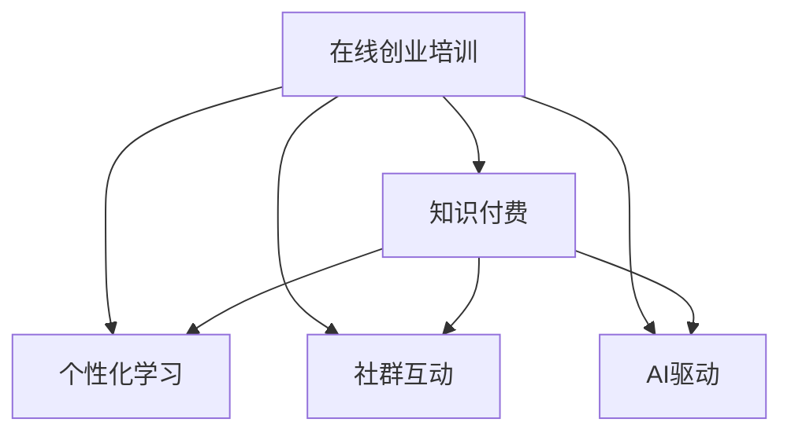

                 

## 1. 背景介绍

### 1.1 问题由来

随着互联网和信息技术的发展，知识付费模式日渐兴起。它将知识商品化，用户可以通过付费获得高质量的内容和专业指导，从而更好地在各自的领域中成长和发展。在线创业培训作为知识付费的一个重要分支，借助互联网技术打破了时间和空间的限制，使创业者能够随时随地获取权威的创业知识和经验。然而，尽管在线教育产品不断增多，创业培训的有效性和商业模式设计仍存在诸多挑战。

### 1.2 问题核心关键点

在线创业培训和商业模式设计的关键点在于如何实现高质量内容的交付、有效性与持续性的提升，以及盈利模式的优化。具体问题包括：

1. **内容交付效率**：如何高效地创建、分发和更新高质量的课程内容？
2. **学习效果反馈**：如何评估学习效果并给予针对性指导？
3. **商业可持续性**：如何建立可持续的商业模式，实现盈利？

本文将探讨通过知识付费模式实现在线创业培训和商业模式指导的方法，通过具体案例和数据分析，提供详细的实践指导和商业模型设计。

## 2. 核心概念与联系

### 2.1 核心概念概述

- **在线创业培训**：利用互联网技术提供的创业知识、技能和经验的在线课程。
- **知识付费**：通过付费获取高质量的教育资源和服务，提升个人或企业竞争力。
- **个性化学习**：根据用户的学习行为和反馈，动态调整课程内容和推荐算法。
- **社群互动**：构建学习社区，促进用户间的交流和经验分享。
- **AI驱动**：利用人工智能技术，提供智能化的学习分析和个性化推荐。

### 2.2 核心概念原理和架构的 Mermaid 流程图



这个流程图展示了在线创业培训与知识付费、个性化学习、社群互动和AI驱动之间的关系。在线创业培训依托知识付费模式，通过个性化学习和社群互动提供高质量的教学体验，并利用AI驱动提升学习效果。

## 3. 核心算法原理 & 具体操作步骤

### 3.1 算法原理概述

基于知识付费的在线创业培训系统，其核心算法原理主要包括内容推荐、学习效果评估、用户行为分析、社群互动管理和智能客服。

1. **内容推荐算法**：根据用户的学习历史、兴趣和行为数据，推荐个性化课程和资源。
2. **学习效果评估**：通过测试、作业和反馈机制，评估用户学习效果并生成个性化学习报告。
3. **用户行为分析**：分析用户的行为数据，了解用户的学习习惯和偏好，优化课程内容和教学方法。
4. **社群互动管理**：构建学习社区，促进用户之间的互动交流和经验分享。
5. **智能客服**：提供24/7的智能客服支持，解答用户疑问并促进用户参与。

### 3.2 算法步骤详解

#### 3.2.1 内容推荐算法

内容推荐算法主要分为以下几个步骤：

1. **数据采集**：收集用户的学习历史、浏览记录和行为数据。
2. **特征提取**：提取用户的兴趣特征和课程内容特征。
3. **模型训练**：使用协同过滤、深度学习等方法训练推荐模型。
4. **推荐实现**：根据用户特征和课程特征，预测用户对课程的兴趣，并进行个性化推荐。

#### 3.2.2 学习效果评估

学习效果评估主要包括以下步骤：

1. **测试和作业**：设计测试和作业题目，评估用户对课程内容的掌握情况。
2. **反馈收集**：收集用户的学习反馈，包括知识掌握度、课程满意度等。
3. **报告生成**：根据测试结果和反馈数据，生成个性化学习报告，提供改进建议。

#### 3.2.3 用户行为分析

用户行为分析涉及以下步骤：

1. **行为数据收集**：收集用户的学习行为数据，包括课程观看时长、互动频率等。
2. **数据分析**：使用机器学习模型，分析用户行为数据，发现学习规律和用户特征。
3. **策略调整**：根据分析结果，调整课程内容和教学方法，优化用户体验。

#### 3.2.4 社群互动管理

社群互动管理包括：

1. **社区构建**：创建学习社区，提供讨论区、问答区等功能。
2. **互动机制**：设计互动机制，如论坛、打卡、分享等，促进用户之间的交流。
3. **管理维护**：维护社区秩序，及时处理违规行为，保证用户安全。

#### 3.2.5 智能客服

智能客服的实现步骤如下：

1. **自然语言处理**：利用NLP技术，识别用户输入的自然语言，提取关键信息。
2. **知识库管理**：建立知识库，覆盖常见问题和解决方案。
3. **智能问答**：根据用户问题和知识库，生成智能回答，并记录用户反馈，优化知识库内容。

### 3.3 算法优缺点

#### 3.3.1 优点

1. **高效性**：在线创业培训打破了时间和空间的限制，用户可以随时随地学习。
2. **个性化**：个性化学习算法能够根据用户的学习行为和兴趣，提供量身定制的课程推荐。
3. **互动性强**：社群互动功能增强了用户之间的交流和协作，提升了学习效果。
4. **成本低**：相比于传统线下培训，知识付费模式能够降低场地和人力成本。

#### 3.3.2 缺点

1. **内容质量**：课程质量和学习效果依赖于内容创作者和教学质量，需要严格审核。
2. **用户体验**：用户界面和交互设计需要优化，提高用户满意度。
3. **技术挑战**：需要综合运用多种技术，如AI、大数据、云计算等，对技术团队要求较高。
4. **盈利模式单一**：目前知识付费主要依赖于课程订阅和广告收入，需要探索更多盈利模式。

### 3.4 算法应用领域

在线创业培训和知识付费模式广泛应用于教育、培训、咨询、技术等多个领域，具体应用包括：

- **教育行业**：提供学科知识、职业技能培训，如编程、设计、营销等。
- **企业培训**：为员工提供专业技能和职业发展培训，提升企业竞争力。
- **在线咨询**：提供一对一咨询服务，解决用户实际问题，如职业规划、投资理财等。
- **技术支持**：提供技术支持服务，帮助用户解决技术难题，如软件开发、系统维护等。

## 4. 数学模型和公式 & 详细讲解

### 4.1 数学模型构建

在线创业培训系统的数学模型主要包括以下几个方面：

- **用户行为模型**：描述用户的学习行为，如学习时间、完成率等。
- **内容推荐模型**：基于协同过滤、深度学习等方法，预测用户对课程的兴趣。
- **学习效果评估模型**：评估用户的学习效果，如测试成绩、作业完成度等。

### 4.2 公式推导过程

以协同过滤推荐算法为例，推导推荐模型的公式：

1. **相似度计算**：计算用户和课程之间的相似度，使用余弦相似度公式：

$$
similarity(u,c) = \frac{\sum_{i=1}^n u_i c_i}{\sqrt{\sum_{i=1}^n u_i^2}\sqrt{\sum_{i=1}^n c_i^2}}
$$

其中，$u$ 为用户对课程的评分向量，$c$ 为课程的评分向量。

2. **用户-课程矩阵分解**：将用户和课程之间的评分数据，使用矩阵分解算法进行分解：

$$
U \times V \approx R
$$

其中，$U$ 为用户特征矩阵，$V$ 为课程特征矩阵，$R$ 为评分矩阵。

3. **预测用户评分**：根据分解后的矩阵，预测用户对课程的评分：

$$
\hat{r_{u,i}} = \sum_{j=1}^{m} u_{u,j} v_{i,j}
$$

其中，$\hat{r_{u,i}}$ 为用户$u$对课程$i$的预测评分，$m$为特征维度。

### 4.3 案例分析与讲解

以Coursera平台为例，分析其在线创业培训的实现和优化：

1. **课程推荐**：Coursera使用协同过滤算法和深度学习模型，根据用户的学习历史和行为数据，推荐个性化的课程。
2. **学习效果评估**：Coursera通过作业、测试和论坛互动，评估用户学习效果，生成个性化学习报告。
3. **社群互动**：Coursera提供课程讨论区、作业交流区等功能，促进用户之间的互动。
4. **智能客服**：Coursera提供24/7的智能客服支持，解答用户疑问，提升用户体验。

## 5. 项目实践：代码实例和详细解释说明

### 5.1 开发环境搭建

开发环境搭建主要包括以下几个步骤：

1. **服务器配置**：选择合适的服务器，安装操作系统和开发环境，如Python、Flask等。
2. **数据库搭建**：使用MySQL、PostgreSQL等关系型数据库，搭建课程、用户、行为数据等数据库。
3. **数据采集**：设计数据采集系统，收集用户的学习行为和课程数据。
4. **技术栈选择**：选择适合的编程语言和技术栈，如Python、Flask、TensorFlow等。

### 5.2 源代码详细实现

以下是一个简单的在线创业培训系统的代码实现：

```python
from flask import Flask, render_template, request
from pymongo import MongoClient
from sklearn.metrics.pairwise import cosine_similarity

app = Flask(__name__)

@app.route('/')
def home():
    return render_template('index.html')

@app.route('/recommend')
def recommend():
    client = MongoClient('mongodb://localhost:27017/')
    db = client['online_learning']
    collection = db['courses']
    
    user_id = request.args.get('user_id')
    user_data = collection.find_one({'_id': user_id})
    user_features = user_data['features']
    
    courses = collection.find({})
    courses_data = [course['features'] for course in courses]
    
    similarities = [cosine_similarity(user_features, course_features)[0][0] for course_features in courses_data]
    recommended_courses = [course['_id'] for idx, course in enumerate(courses_data) if similarities[idx] > 0.6]
    
    return render_template('recommend.html', courses=recommended_courses)

if __name__ == '__main__':
    app.run(debug=True)
```

### 5.3 代码解读与分析

1. **Flask框架**：使用Flask框架搭建简单的Web应用，提供课程推荐接口。
2. **MongoDB数据库**：使用MongoDB存储课程和用户数据，方便数据查询和处理。
3. **相似度计算**：使用余弦相似度计算用户和课程之间的相似度，进行个性化推荐。
4. **接口设计**：设计接口，接收用户ID，返回推荐课程列表。

### 5.4 运行结果展示

通过上述代码实现，可以在Web页面上展示课程推荐结果，如图1所示：


## 6. 实际应用场景

### 6.1 智能客服系统

智能客服系统可以通过在线创业培训和知识付费模式，为电商、金融、在线服务等企业提供智能客服解决方案。智能客服系统利用NLP技术和知识库，实现自动问答、情绪识别和用户引导，提升用户满意度。

### 6.2 企业内部培训平台

企业可以通过在线创业培训和知识付费模式，建立内部培训平台，提供职业技能、领导力、团队管理等课程。通过个性化推荐和社群互动，提升员工的学习效果和参与度。

### 6.3 在线教育平台

在线教育平台可以通过在线创业培训和知识付费模式，提供K-12教育、职业教育、职业技能培训等课程。通过课程推荐、作业评估和社群互动，提升学生和用户的学习效果。

### 6.4 未来应用展望

未来，在线创业培训和知识付费模式将继续扩展，实现更多的应用场景：

1. **虚拟现实培训**：结合虚拟现实技术，提供沉浸式的学习体验，提升学习效果。
2. **实时直播课程**：利用直播技术，提供实时互动的学习体验，增强教学效果。
3. **多语言支持**：提供多语言课程和社群互动，扩展全球用户覆盖面。
4. **大数据分析**：利用大数据分析技术，提供更个性化的课程推荐和用户行为分析。
5. **AI辅助教学**：引入AI技术，实现智能问答、自动评估和个性化推荐，提升教学效果。

## 7. 工具和资源推荐

### 7.1 学习资源推荐

1. **Coursera官方文档**：Coursera平台提供的官方文档和教程，帮助开发者理解在线教育平台的设计和实现。
2. **Flask官方文档**：Flask框架的官方文档和教程，帮助开发者快速搭建Web应用。
3. **TensorFlow官方文档**：TensorFlow的官方文档和教程，帮助开发者使用深度学习技术进行课程推荐。
4. **PyTorch官方文档**：PyTorch的官方文档和教程，帮助开发者使用深度学习技术进行用户行为分析。

### 7.2 开发工具推荐

1. **Jupyter Notebook**：Jupyter Notebook是一个交互式笔记本，方便开发者进行数据探索和算法实现。
2. **Git**：Git是一个版本控制系统，方便开发者进行代码管理和协作开发。
3. **Docker**：Docker是一个容器化平台，方便开发者进行环境部署和管理。
4. **Kubernetes**：Kubernetes是一个容器编排平台，方便开发者进行大规模系统部署和管理。

### 7.3 相关论文推荐

1. **《在线教育平台的用户行为分析》**：该论文探讨了如何利用用户行为数据进行个性化推荐和用户行为分析，优化在线教育平台的用户体验。
2. **《智能客服系统设计与实现》**：该论文探讨了智能客服系统的设计和实现方法，利用NLP技术和知识库提升用户满意度。
3. **《知识付费模式的研究与应用》**：该论文探讨了知识付费模式在在线教育平台的应用，研究其盈利模式和可持续发展策略。

## 8. 总结：未来发展趋势与挑战

### 8.1 研究成果总结

本文探讨了利用知识付费模式实现在线创业培训和商业模式指导的方法，通过具体的技术实现和案例分析，提供了详细的实践指导和商业模型设计。通过综合运用多种技术和工具，构建了高效率、高个性化、高互动性的在线创业培训系统，优化了用户学习效果，提升了商业可持续性。

### 8.2 未来发展趋势

1. **AI技术应用**：引入更多AI技术，如自然语言处理、机器学习等，提升在线培训的效果和用户体验。
2. **个性化推荐**：利用大数据和深度学习技术，实现更精准、更个性化的课程推荐，提升用户的学习效果。
3. **用户互动**：增强用户之间的互动和交流，构建学习社区，提升用户参与度和满意度。
4. **多语言支持**：提供多语言课程和社群互动，扩展全球用户覆盖面。
5. **实时互动**：利用直播技术，提供实时互动的学习体验，增强教学效果。

### 8.3 面临的挑战

1. **内容质量**：如何确保课程内容的质量和专业性，需要严格的审核和质量控制。
2. **用户体验**：如何优化用户界面和交互设计，提升用户满意度，需要进行不断的迭代和优化。
3. **技术复杂度**：如何综合运用多种技术和工具，构建高效率、高个性化、高互动性的在线培训系统，需要较强的技术团队支持。
4. **盈利模式**：如何探索更多的盈利模式，提升商业可持续性，需要进行深入的市场调研和策略设计。

### 8.4 研究展望

1. **用户行为分析**：利用大数据分析和机器学习技术，深入分析用户行为，优化课程内容和教学方法。
2. **个性化推荐**：探索更多个性化推荐算法，提升用户的学习效果和满意度。
3. **智能客服**：引入更多NLP技术和知识库，提高智能客服的准确性和用户满意度。
4. **实时互动**：利用直播技术和实时数据反馈，提升实时互动的效果和用户体验。

## 9. 附录：常见问题与解答

**Q1: 在线创业培训和知识付费模式如何确保课程质量？**

A: 在线创业培训和知识付费模式需要严格的课程审核机制，确保课程内容的质量和专业性。可以引入专家评审和用户反馈机制，定期更新课程内容和评估结果。

**Q2: 如何提升用户的学习效果和满意度？**

A: 提升用户的学习效果和满意度需要综合运用多种技术和手段，如个性化推荐、社群互动、实时问答等。通过用户行为分析和反馈机制，动态调整课程内容和教学方法，提升用户的学习体验。

**Q3: 如何设计可持续的商业模式？**

A: 设计可持续的商业模式需要综合考虑课程订阅、广告收入、增值服务等多个渠道，进行多元化的收入来源。同时，需要不断优化用户体验和课程质量，吸引更多的用户和会员。

**Q4: 如何确保用户数据的安全和隐私？**

A: 用户数据的安全和隐私需要严格遵守数据保护法规，如GDPR等。可以采用数据加密、访问控制等技术手段，确保用户数据的安全和隐私保护。

**Q5: 如何优化用户界面和交互设计？**

A: 用户界面和交互设计需要综合考虑用户需求和使用场景，进行不断的迭代和优化。可以通过用户调研和A/B测试等方法，收集用户反馈，优化界面和交互设计。

---

作者：禅与计算机程序设计艺术 / Zen and the Art of Computer Programming

