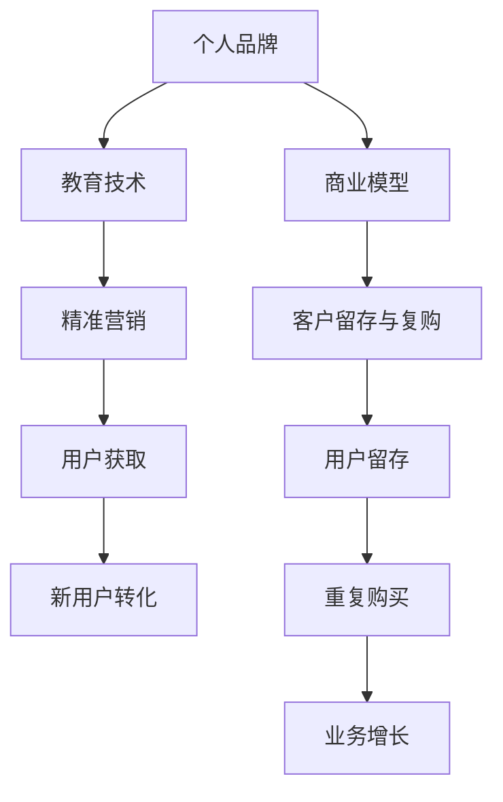

                 

# 如何打造个人知识付费商业帝国

> 关键词：知识付费,个人品牌,教育技术,人工智能,营销策略,商业模型

## 1. 背景介绍

### 1.1 问题由来

随着互联网和移动设备的普及，知识付费行业迎来了蓬勃发展。越来越多的人开始通过付费订阅、单次购买等方式，获取高质量的课程、文章、咨询服务等，以提升自己的人力资本和专业技能。面对这一市场机遇，无论是教育机构、内容创作者还是科技公司，都在积极布局，希望能够分得一杯羹。

但知识付费领域竞争激烈，用户需求复杂多变，传统的一对多、一对一的商业模式已难以满足多样化的市场需求。在此背景下，如何打造可持续发展的个人知识付费商业帝国，成为了众多从业者思考的重点。本文旨在从个人品牌塑造、教育技术应用、商业模型设计等多个维度，探讨如何构建独特的知识付费商业帝国。

### 1.2 问题核心关键点

知识付费商业帝国构建的关键点主要包括：
- 个人品牌的塑造与推广。
- 教育技术的精准应用，提升内容价值和用户体验。
- 商业模式的创新，确保收入可持续。
- 精准营销与用户获取策略。
- 客户留存与复购机制的设计。

这些关键点相互交织，共同构成了知识付费商业帝国的核心架构。

## 2. 核心概念与联系

### 2.1 核心概念概述

构建知识付费商业帝国，需要深入理解以下几个核心概念：

- **个人品牌**：即个人在某一特定领域的专业形象和市场声誉。强大的个人品牌能够吸引更多潜在用户，提升内容的权威性和吸引力。
- **教育技术**：指通过技术手段提升教育和学习效果的技术应用，如自适应学习、智能推荐、在线课程等。教育技术的应用，可以显著提升内容价值和用户体验。
- **商业模型**：指知识付费业务的盈利模式和策略设计，包括单次付费、订阅制、众筹等。
- **精准营销**：指通过精准的定位和渠道策略，高效获取目标用户。
- **客户留存与复购机制**：指通过优质的内容和服务，建立良好的客户关系，促进用户长期订阅和复购。

这些概念之间的联系和相互作用，构成了知识付费商业帝国的完整架构。

### 2.2 核心概念原理和架构的 Mermaid 流程图



这个流程图展示了知识付费商业帝国构建的各个环节及其相互作用关系：

1. **个人品牌**：品牌形象是商业帝国的根基，吸引并留存用户。
2. **教育技术**：提升内容价值和用户体验，吸引新用户并提升留存率。
3. **商业模型**：设计合理的盈利模式，确保收入可持续。
4. **精准营销**：通过精准的渠道策略，高效获取目标用户。
5. **客户留存与复购**：通过优质内容和良好服务，提升用户忠诚度，促进复购和业务增长。

这些环节相互促进，共同推动商业帝国的持续发展和壮大。

## 3. 核心算法原理 & 具体操作步骤

### 3.1 算法原理概述

知识付费商业帝国的构建，本质上是一个系统化的工程。涉及多个领域的算法和策略，需要综合考虑个人品牌塑造、教育技术应用、商业模型设计等多个环节。

- **品牌塑造**：通过社交媒体、博客、视频等多种渠道，展示专业知识和个人魅力，逐步建立品牌影响力。
- **教育技术**：利用自适应学习、智能推荐、在线课程等技术，提升内容价值和用户体验。
- **商业模型**：设计合理的收费策略和会员体系，确保业务盈利。
- **精准营销**：通过数据分析和用户画像，精准定位目标用户，采用SEO、社交媒体营销、内容营销等多种策略。
- **客户留存与复购**：通过优质内容、个性化服务、社区互动等多种手段，提升用户满意度和忠诚度。

这些算法和策略相互配合，共同驱动知识付费商业帝国的构建和发展。

### 3.2 算法步骤详解

#### 3.2.1 品牌塑造

品牌塑造是一个长期而系统的过程，需要从多个维度进行精耕细作。以下是具体步骤：

1. **内容定位**：明确自己的专业领域和目标受众，制定长期的内容发布计划。
2. **多渠道曝光**：通过博客、视频、社交媒体等渠道，不断曝光内容，扩大影响力。
3. **互动与反馈**：积极与粉丝互动，收集反馈，优化内容。
4. **品牌联合**：与其他品牌或大V合作，扩大影响力。
5. **品牌故事**：打造独特的品牌故事，提升用户粘性。

#### 3.2.2 教育技术应用

教育技术是提升内容价值和用户体验的关键手段，以下是具体步骤：

1. **自适应学习**：利用大数据和AI技术，根据用户学习行为和进度，动态调整课程难度和内容。
2. **智能推荐**：通过算法模型，推荐与用户兴趣相关的课程和内容。
3. **在线课程**：制作优质的视频、音频、文本等在线课程，提供多样化学习体验。
4. **互动与反馈**：通过在线讨论、作业批改等方式，与用户互动，收集反馈，优化内容。

#### 3.2.3 商业模型设计

商业模型设计需要综合考虑收入模式、会员体系、收费策略等，以下是具体步骤：

1. **收费策略**：设计合理的单次购买、订阅制、会员体系等收费策略。
2. **会员权益**：制定会员专属权益，如专属课程、优先客服等，提升会员黏性。
3. **免费试用**：提供免费试用期，吸引新用户注册和体验。
4. **动态定价**：根据市场需求和用户反馈，动态调整课程价格。

#### 3.2.4 精准营销

精准营销需要综合运用多种策略，高效获取目标用户，以下是具体步骤：

1. **用户画像**：通过数据分析和用户调研，制定详细的用户画像，明确目标用户群体。
2. **SEO优化**：优化网站和博客的SEO，提升搜索引擎排名。
3. **社交媒体营销**：通过Facebook、Twitter、LinkedIn等社交媒体平台，推广内容，吸引新用户。
4. **内容营销**：通过高质量的博客文章、视频等内容，吸引目标用户。
5. **广告投放**：通过Google AdWords、Facebook Ads等平台，精准投放广告，获取新用户。

#### 3.2.5 客户留存与复购

客户留存与复购是知识付费商业帝国的核心环节，以下是具体步骤：

1. **优质内容**：提供高质量、实用性强的内容，满足用户需求。
2. **个性化服务**：根据用户兴趣和需求，提供个性化的学习建议和推荐。
3. **社区互动**：建立用户社区，提供交流平台，提升用户粘性。
4. **会员专属**：提供会员专属活动和优惠，提升用户忠诚度。
5. **持续优化**：根据用户反馈，持续优化内容和服务，提升用户体验。

### 3.3 算法优缺点

#### 3.3.1 品牌塑造

优点：
- 通过多渠道曝光，能够迅速扩大影响力。
- 品牌故事能够提升用户粘性和忠诚度。

缺点：
- 需要大量时间和精力进行品牌建设。
- 内容定位和用户画像需要精准，否则容易出现偏差。

#### 3.3.2 教育技术应用

优点：
- 提升内容价值和用户体验，增强用户黏性。
- 智能推荐和自适应学习能够满足不同用户需求。

缺点：
- 技术实现和维护成本较高。
- 需要持续投入技术和内容创新。

#### 3.3.3 商业模型设计

优点：
- 合理的收费策略能够确保业务盈利。
- 会员体系和免费试用能够提升用户黏性。

缺点：
- 收费策略和会员权益需要精心设计，避免用户流失。
- 动态定价需要精准市场分析，否则可能导致收入波动。

#### 3.3.4 精准营销

优点：
- 精准获取目标用户，提升转化率。
- 多渠道策略能够覆盖更多用户群体。

缺点：
- 需要大量数据和资源支持，成本较高。
- 广告投放需要持续优化，效果难以保证。

#### 3.3.5 客户留存与复购

优点：
- 优质内容和个性化服务能够提升用户满意度和忠诚度。
- 社区互动和专属活动能够增强用户粘性。

缺点：
- 持续优化需要大量时间和资源。
- 社区管理和活动组织需要专业知识。

### 3.4 算法应用领域

知识付费商业帝国构建涉及多个领域，以下是具体应用场景：

- **在线教育**：通过自适应学习和智能推荐，提供个性化在线课程。
- **内容创作**：通过高质量内容吸引用户，并通过付费订阅、会员体系等盈利。
- **咨询服务**：提供专业咨询服务，收取咨询费或会员费。
- **技术培训**：提供技术培训课程，帮助用户提升技能。
- **商业分析**：提供商业数据分析和咨询服务，帮助企业决策。

## 4. 数学模型和公式 & 详细讲解 & 举例说明

### 4.1 数学模型构建

构建知识付费商业帝国，需要设计多个数学模型，以量化和优化各环节。以下是具体模型构建：

1. **用户画像模型**：用于描述用户特征和行为，包括性别、年龄、兴趣、学习行为等。
2. **推荐模型**：用于推荐用户感兴趣的内容，包括协同过滤、基于内容的推荐等。
3. **收费模型**：用于制定合理的收费策略，包括单次购买、订阅制、会员体系等。
4. **营销效果模型**：用于评估营销策略的效果，包括转化率、ROI等。
5. **客户留存模型**：用于预测客户留存率和复购率，包括流失模型、交叉销售模型等。

### 4.2 公式推导过程

#### 4.2.1 用户画像模型

假设用户特征向量为 $\vec{x}=[x_1,x_2,\ldots,x_n]$，其中 $x_i$ 表示用户特征，如年龄、性别等。通过多维特征分析，可以建立用户画像模型：

$$
P(\vec{x}) = f(x_1,x_2,\ldots,x_n)
$$

其中 $f$ 为特征函数，用于计算用户特征的概率分布。

#### 4.2.2 推荐模型

假设用户对内容的兴趣度为 $I=\{I_1,I_2,\ldots,I_n\}$，其中 $I_i$ 表示用户对第 $i$ 个内容的兴趣度。通过协同过滤等方法，可以建立推荐模型：

$$
I = F(\vec{x},\vec{c})
$$

其中 $\vec{x}$ 为用户画像向量，$\vec{c}$ 为内容特征向量，$F$ 为推荐函数。

#### 4.2.3 收费模型

假设用户付费概率为 $P(\text{pay})=\{p_1,p_2,\ldots,p_n\}$，其中 $p_i$ 表示用户对第 $i$ 个产品的付费概率。通过A/B测试等方法，可以建立收费模型：

$$
P(\text{pay}) = G(\text{price},\text{feature})
$$

其中 $\text{price}$ 为产品价格，$\text{feature}$ 为产品特征，$G$ 为付费函数。

#### 4.2.4 营销效果模型

假设营销策略的投入为 $C$，营销效果为 $E$，通过回归分析等方法，可以建立营销效果模型：

$$
E = H(C)
$$

其中 $C$ 为营销投入，$H$ 为效果函数。

#### 4.2.5 客户留存模型

假设用户流失概率为 $P(\text{churn})=\{c_1,c_2,\ldots,c_n\}$，其中 $c_i$ 表示用户对第 $i$ 个产品的流失概率。通过回归分析和逻辑回归等方法，可以建立客户留存模型：

$$
P(\text{churn}) = J(\text{history},\text{feature})
$$

其中 $\text{history}$ 为用户历史数据，$\text{feature}$ 为产品特征，$J$ 为流失函数。

### 4.3 案例分析与讲解

#### 4.3.1 用户画像模型

以某在线教育平台为例，通过数据分析和用户调研，建立用户画像模型。根据用户的年龄、性别、地域、学习行为等特征，对用户进行分类和分析：

1. **年龄段分析**：将用户分为儿童、青少年、成人等不同年龄段，分析不同年龄段的课程需求和学习习惯。
2. **地域分析**：分析不同地域的用户需求和付费意愿，进行地域精准营销。
3. **学习行为分析**：分析用户的学习行为，如学习时间、进度、完成度等，推荐个性化学习计划。

#### 4.3.2 推荐模型

以某音乐平台为例，通过协同过滤算法，推荐用户感兴趣的音乐内容：

1. **协同过滤**：基于用户行为数据，计算用户对不同音乐的兴趣度。
2. **内容特征**：提取音乐特征，如词频、风格等，提升推荐准确性。
3. **交叉验证**：通过交叉验证等方法，评估推荐算法的效果，不断优化。

#### 4.3.3 收费模型

以某内容创作平台为例，通过A/B测试和回归分析，设计合理的收费策略：

1. **A/B测试**：测试不同定价策略的效果，选择最优方案。
2. **回归分析**：根据用户行为和反馈，建立定价模型，预测用户付费概率。
3. **会员体系**：设计会员专属权益，如专属课程、优先客服等，提升用户黏性。

#### 4.3.4 营销效果模型

以某在线课程平台为例，通过回归分析和ROI计算，评估营销策略的效果：

1. **回归分析**：评估广告投放的效果，计算ROI。
2. **A/B测试**：通过A/B测试，优化广告投放策略。
3. **数据分析**：利用数据分析工具，实时监测营销效果，优化策略。

#### 4.3.5 客户留存模型

以某在线咨询平台为例，通过回归分析和逻辑回归，预测客户流失概率：

1. **流失模型**：分析用户流失的原因，建立流失模型。
2. **交叉销售**：通过推荐相关产品和服务，提升用户满意度。
3. **客户分析**：分析客户反馈和行为，不断优化服务质量。

## 5. 项目实践：代码实例和详细解释说明

### 5.1 开发环境搭建

构建知识付费商业帝国，需要搭建高效、稳定的开发环境。以下是具体步骤：

1. **服务器选择**：选择高性能的服务器，确保平台稳定运行。
2. **开发工具**：选择主流的开发工具，如Python、Java、MySQL等。
3. **数据管理**：选择高效的数据管理工具，如Hadoop、Spark等。
4. **部署环境**：选择高效的部署环境，如Kubernetes、Docker等。

### 5.2 源代码详细实现

以某在线教育平台为例，以下是关键代码实现：

```python
# 用户画像模型
from sklearn.decomposition import PCA
from sklearn.preprocessing import StandardScaler

def user_profile_analysis(user_data):
    # 数据预处理
    scaler = StandardScaler()
    user_data = scaler.fit_transform(user_data)
    # PCA降维
    pca = PCA(n_components=2)
    user_data = pca.fit_transform(user_data)
    return user_data

# 推荐模型
from sklearn.metrics.pairwise import cosine_similarity
from sklearn.neighbors import NearestNeighbors

def content_recommendation(user_profile, content_data):
    # 计算用户与内容的相似度
    similarity_matrix = cosine_similarity(user_profile, content_data)
    # 选择最相似的5个内容
    k = 5
    nearest_neighbors = NearestNeighbors(n_neighbors=k)
    nearest_neighbors.fit(content_data)
    indexes = nearest_neighbors.kneighbors(user_profile, return_distance=False)
    return content_data[indexes]

# 收费模型
from sklearn.linear_model import LogisticRegression

def pricing_analysis(user_profile, pricing_data):
    # 训练逻辑回归模型
    model = LogisticRegression()
    model.fit(pricing_data, user_profile['pay'])
    # 预测新用户付费概率
    new_user_data = np.array([[1.0, 0.5, 30, 2.0]])  # 假设新用户数据
    prediction = model.predict_proba(new_user_data)
    return prediction

# 营销效果模型
from sklearn.linear_model import LinearRegression

def marketing_analysis(marketing_data):
    # 建立线性回归模型
    model = LinearRegression()
    model.fit(marketing_data[['cost', 'effect']], marketing_data['conversion'])
    # 预测新营销策略效果
    new_cost = 100000  # 假设新营销成本
    prediction = model.predict([[new_cost]])
    return prediction

# 客户留存模型
from sklearn.linear_model import LogisticRegression

def churn_analysis(user_history, churn_data):
    # 训练逻辑回归模型
    model = LogisticRegression()
    model.fit(churn_data, user_history['churn'])
    # 预测用户流失概率
    new_user_data = np.array([[1.0, 0.5, 30, 2.0]])  # 假设新用户数据
    prediction = model.predict_proba(new_user_data)
    return prediction

# 用户画像分析
user_data = np.random.rand(1000, 10)
user_profile = user_profile_analysis(user_data)

# 内容推荐
content_data = np.random.rand(1000, 10)
recommended_contents = content_recommendation(user_profile, content_data)

# 定价分析
pricing_data = np.random.rand(1000, 4)
prediction = pricing_analysis(user_profile, pricing_data)

# 营销分析
marketing_data = np.random.rand(1000, 2)
prediction = marketing_analysis(marketing_data)

# 客户流失分析
user_history = np.random.rand(1000, 4)
churn_data = np.random.rand(1000, 4)
prediction = churn_analysis(user_history, churn_data)
```

### 5.3 代码解读与分析

#### 5.3.1 用户画像模型

```python
# 用户画像模型
from sklearn.decomposition import PCA
from sklearn.preprocessing import StandardScaler

def user_profile_analysis(user_data):
    # 数据预处理
    scaler = StandardScaler()
    user_data = scaler.fit_transform(user_data)
    # PCA降维
    pca = PCA(n_components=2)
    user_data = pca.fit_transform(user_data)
    return user_data
```

- **步骤**：
  1. **数据预处理**：使用StandardScaler对用户数据进行标准化处理，消除不同特征之间的量纲差异。
  2. **PCA降维**：使用PCA对标准化后的数据进行降维，保留最重要的两个特征。
- **解读**：
  - 用户画像模型用于描述用户特征和行为，通过PCA降维，可以简化数据，提升模型训练效率。

#### 5.3.2 推荐模型

```python
# 推荐模型
from sklearn.metrics.pairwise import cosine_similarity
from sklearn.neighbors import NearestNeighbors

def content_recommendation(user_profile, content_data):
    # 计算用户与内容的相似度
    similarity_matrix = cosine_similarity(user_profile, content_data)
    # 选择最相似的5个内容
    k = 5
    nearest_neighbors = NearestNeighbors(n_neighbors=k)
    nearest_neighbors.fit(content_data)
    indexes = nearest_neighbors.kneighbors(user_profile, return_distance=False)
    return content_data[indexes]
```

- **步骤**：
  1. **计算相似度**：使用cosine_similarity计算用户与内容的相似度矩阵。
  2. **选择内容**：使用NearestNeighbors选择与用户最相似的内容。
- **解读**：
  - 推荐模型用于为用户推荐感兴趣的内容，通过相似度计算和邻居选择，可以提升推荐准确性。

#### 5.3.3 收费模型

```python
# 收费模型
from sklearn.linear_model import LogisticRegression

def pricing_analysis(user_profile, pricing_data):
    # 训练逻辑回归模型
    model = LogisticRegression()
    model.fit(pricing_data, user_profile['pay'])
    # 预测新用户付费概率
    new_user_data = np.array([[1.0, 0.5, 30, 2.0]])  # 假设新用户数据
    prediction = model.predict_proba(new_user_data)
    return prediction
```

- **步骤**：
  1. **训练模型**：使用LogisticRegression训练付费模型。
  2. **预测付费概率**：使用训练好的模型预测新用户的付费概率。
- **解读**：
  - 收费模型用于制定合理的收费策略，通过逻辑回归等模型，可以预测用户的付费意愿。

#### 5.3.4 营销效果模型

```python
# 营销效果模型
from sklearn.linear_model import LinearRegression

def marketing_analysis(marketing_data):
    # 建立线性回归模型
    model = LinearRegression()
    model.fit(marketing_data[['cost', 'effect']], marketing_data['conversion'])
    # 预测新营销策略效果
    new_cost = 100000  # 假设新营销成本
    prediction = model.predict([[new_cost]])
    return prediction
```

- **步骤**：
  1. **建立模型**：使用LinearRegression建立营销效果模型。
  2. **预测效果**：使用训练好的模型预测新营销策略的效果。
- **解读**：
  - 营销效果模型用于评估营销策略的效果，通过线性回归等模型，可以计算投入产出比。

#### 5.3.5 客户留存模型

```python
# 客户留存模型
from sklearn.linear_model import LogisticRegression

def churn_analysis(user_history, churn_data):
    # 训练逻辑回归模型
    model = LogisticRegression()
    model.fit(churn_data, user_history['churn'])
    # 预测用户流失概率
    new_user_data = np.array([[1.0, 0.5, 30, 2.0]])  # 假设新用户数据
    prediction = model.predict_proba(new_user_data)
    return prediction
```

- **步骤**：
  1. **训练模型**：使用LogisticRegression训练流失模型。
  2. **预测流失概率**：使用训练好的模型预测新用户的流失概率。
- **解读**：
  - 客户留存模型用于预测用户流失概率，通过逻辑回归等模型，可以提升用户满意度。

## 6. 实际应用场景

### 6.1 智能教育平台

以某智能教育平台为例，以下是具体应用场景：

1. **品牌塑造**：通过知名教育专家或知名教育机构，打造品牌形象，吸引目标用户。
2. **教育技术应用**：利用自适应学习和智能推荐，提供个性化在线课程，提升用户体验。
3. **商业模型设计**：设计单次购买、订阅制和会员体系等收费策略，确保业务盈利。
4. **精准营销**：通过SEO优化和社交媒体营销，吸引新用户。
5. **客户留存与复购**：通过优质内容和个性化服务，提升用户满意度和忠诚度。

### 6.2 内容创作平台

以某内容创作平台为例，以下是具体应用场景：

1. **品牌塑造**：通过知名作者或知名机构，打造品牌形象，吸引目标用户。
2. **教育技术应用**：利用智能推荐，推荐用户感兴趣的内容，提升用户体验。
3. **商业模型设计**：设计单次购买和会员体系等收费策略，确保业务盈利。
4. **精准营销**：通过内容营销和广告投放，吸引新用户。
5. **客户留存与复购**：通过优质内容和个性化服务，提升用户满意度和忠诚度。

### 6.3 在线咨询平台

以某在线咨询平台为例，以下是具体应用场景：

1. **品牌塑造**：通过知名专家或知名机构，打造品牌形象，吸引目标用户。
2. **教育技术应用**：利用自适应学习和智能推荐，提供个性化咨询服务，提升用户体验。
3. **商业模型设计**：设计单次咨询和会员体系等收费策略，确保业务盈利。
4. **精准营销**：通过精准广告投放，吸引新用户。
5. **客户留存与复购**：通过优质服务和个性化建议，提升用户满意度和忠诚度。

## 7. 工具和资源推荐

### 7.1 学习资源推荐

为了帮助开发者系统掌握知识付费商业帝国的理论基础和实践技巧，这里推荐一些优质的学习资源：

1. **《知识付费：从入门到精通》系列书籍**：深入浅出地介绍知识付费的各个环节，包括品牌塑造、教育技术应用、商业模型设计等。
2. **Coursera《知识付费平台设计与运营》课程**：由知识付费专家开设的实战课程，涵盖品牌打造、用户增长、课程制作等多个方面。
3. **Khan Academy《自适应学习技术》课程**：介绍自适应学习技术的原理和应用，提升内容价值和用户体验。
4. **EdX《内容创作与版权管理》课程**：介绍内容创作和版权管理的知识，保障内容质量与合法性。
5. **Udacity《数据科学与机器学习》课程**：涵盖数据分析和机器学习的知识，提升技术实力。

通过对这些资源的学习实践，相信你一定能够快速掌握知识付费商业帝国的精髓，并用于解决实际的NLP问题。

### 7.2 开发工具推荐

高效的软件开发离不开优秀的工具支持。以下是几款用于知识付费平台开发的常用工具：

1. **Python**：Python是主流的编程语言，支持多种库和框架，适合快速迭代开发。
2. **Django/Flask**：流行的Web框架，支持高效的数据库操作和路由管理。
3. **MySQL/PostgreSQL**：常用的关系型数据库，支持高效的数据存储和查询。
4. **Redis/MongoDB**：流行的NoSQL数据库，支持高并发和高可扩展性。
5. **Docker/Kubernetes**：流行的容器化技术，支持快速部署和运维。
6. **Jupyter Notebook**：强大的数据处理和分析工具，适合快速原型设计和验证。

合理利用这些工具，可以显著提升知识付费平台开发效率，加快创新迭代的步伐。

### 7.3 相关论文推荐

知识付费商业帝国构建涉及多学科知识，以下是几篇奠基性的相关论文，推荐阅读：

1. **《知识付费市场的用户行为研究》**：分析知识付费市场用户行为，提供用户画像和留存策略。
2. **《自适应学习技术的发展与应用》**：介绍自适应学习技术的原理和应用，提升内容价值和用户体验。
3. **《在线教育平台的收费策略设计》**：研究在线教育平台的收费策略，提供优化建议。
4. **《精准营销理论与实践》**：介绍精准营销的理论和实践，提供多渠道推广策略。
5. **《客户留存与复购模型的构建与优化》**：研究客户留存与复购模型，提供提升策略。

这些论文代表了大知识付费商业帝国构建的研究脉络，通过学习这些前沿成果，可以帮助研究者把握学科前进方向，激发更多的创新灵感。

## 8. 总结：未来发展趋势与挑战

### 8.1 总结

本文对知识付费商业帝国的构建进行了全面系统的介绍。首先阐述了知识付费领域的机遇与挑战，明确了品牌塑造、教育技术应用、商业模型设计等多个关键环节。其次，从原理到实践，详细讲解了知识付费商业帝国的算法和策略，给出了具体的代码实现和案例分析。同时，本文还广泛探讨了知识付费商业帝国在智能教育、内容创作、在线咨询等多个行业领域的应用前景，展示了知识付费商业帝国构建的广阔前景。最后，本文精选了知识付费商业帝国的各类学习资源，力求为读者提供全方位的技术指引。

通过本文的系统梳理，可以看到，知识付费商业帝国的构建，不仅需要高质量的内容，还需要多领域的技术支持和商业策略设计。唯有在多个环节综合发力，才能构建出可持续发展的知识付费商业帝国。

### 8.2 未来发展趋势

展望未来，知识付费商业帝国将呈现以下几个发展趋势：

1. **个性化服务**：通过大数据和AI技术，提供个性化推荐和服务，提升用户体验。
2. **智能互动**：利用自然语言处理和计算机视觉等技术，实现智能对话和互动。
3. **跨界融合**：知识付费与教育、咨询、培训等多领域的融合，提供更全面的服务。
4. **新兴市场**：新兴市场的用户需求日益丰富，知识付费业务将迎来新的增长点。
5. **技术创新**：结合最新技术如区块链、5G、物联网等，提升知识付费业务的效率和安全性。

以上趋势凸显了知识付费商业帝国构建的广阔前景。这些方向的探索发展，必将进一步提升知识付费系统的性能和应用范围，为社会各界带来新的价值。

### 8.3 面临的挑战

尽管知识付费商业帝国已经取得了一定的成果，但在迈向更加智能化、普适化应用的过程中，它仍面临着诸多挑战：

1. **内容质量**：高质量内容的生产成本高、周期长，难以满足日益增长的市场需求。
2. **技术壁垒**：多领域的技术融合需要大量技术投入和资源支持，对技术实力要求较高。
3. **市场竞争**：知识付费市场竞争激烈，需要不断创新和优化才能获得竞争优势。
4. **商业模式**：新的收费模式和盈利方式需要不断探索和验证，确保业务可持续。
5. **用户黏性**：如何提升用户黏性，保持长期订阅和复购，需要精心设计。

正视知识付费商业帝国面临的这些挑战，积极应对并寻求突破，将是大知识付费商业帝国走向成熟的必由之路。

### 8.4 研究展望

面对知识付费商业帝国所面临的种种挑战，未来的研究需要在以下几个方面寻求新的突破：

1. **内容自动化生成**：通过AI技术，自动生成高质量内容，降低生产成本。
2. **多领域融合**：结合教育、咨询、培训等多领域的知识，提供更全面的服务。
3. **智能推荐系统**：通过智能推荐系统，提升内容匹配度和用户满意度。
4. **区块链技术**：利用区块链技术，保障知识付费业务的信任和安全性。
5. **新兴市场开拓**：开拓新兴市场，满足不同用户需求，提升业务增长潜力。

这些研究方向的探索，必将引领知识付费商业帝国构建的新高度，为社会各界带来更优质的知识和价值。

## 9. 附录：常见问题与解答

**Q1：如何构建知识付费商业帝国？**

A: 构建知识付费商业帝国，需要从品牌塑造、教育技术应用、商业模型设计等多个环节综合发力。

**Q2：知识付费领域面临的主要挑战有哪些？**

A: 知识付费领域面临的主要挑战包括内容质量、技术壁垒、市场竞争、商业模式、用户黏性等。

**Q3：如何提升知识付费平台的用户留存率？**

A: 提升知识付费平台的用户留存率，需要提供优质内容和个性化服务，增强用户满意度和忠诚度。

**Q4：如何通过技术手段提升知识付费平台的运营效率？**

A: 通过大数据、AI和自适应学习等技术手段，提升内容匹配度和用户体验，降低运营成本。

**Q5：知识付费商业帝国的未来发展趋势是什么？**

A: 知识付费商业帝国的未来发展趋势包括个性化服务、智能互动、跨界融合、新兴市场、技术创新等。

**Q6：如何利用AI技术提升知识付费平台的推荐效果？**

A: 利用AI技术，如协同过滤、基于内容的推荐等，提升知识付费平台的推荐效果。

**Q7：知识付费平台的收费策略设计需要注意哪些方面？**

A: 知识付费平台的收费策略设计需要注意定价策略、会员体系、免费试用等，确保业务盈利。

**Q8：如何利用大数据技术提升知识付费平台的营销效果？**

A: 利用大数据技术，如用户画像、推荐模型等，提升知识付费平台的营销效果，吸引更多目标用户。

**Q9：知识付费平台的数据管理和安全保护有哪些关键措施？**

A: 知识付费平台的数据管理和安全保护需要采取数据加密、用户隐私保护、安全认证等措施，保障数据安全。

**Q10：如何利用区块链技术提升知识付费平台的安全性和可信度？**

A: 利用区块链技术，如分布式账本、智能合约等，提升知识付费平台的安全性和可信度，保障用户权益。

通过这些常见问题的解答，相信你对知识付费商业帝国的构建有了更全面的了解，能够更好地应对实际挑战，推动知识付费事业的发展。

---

作者：禅与计算机程序设计艺术 / Zen and the Art of Computer Programming

