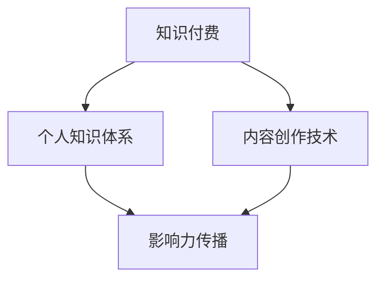

                 

# 如何打造个人知识付费影响力

## 1. 背景介绍

在知识经济时代，个人品牌的影响力已日益成为个体获取资源和创造价值的重要手段。尤其是进入知识付费时代，高质量的原创内容、独特的知识体系和有效的传播策略，成为打造个人知识付费影响力的关键要素。本文将深入探讨如何通过技术手段，有效构建个人知识体系，提升内容传播效果，从而在知识付费领域内树立权威地位，实现商业价值的最大化。

### 1.1 问题由来
随着互联网的普及，知识付费市场正在快速发展。用户对于高质量内容的需求不断增加，而创作者对于内容的生产效率和效果也在不断提升。通过打造个人知识付费影响力，创作者不仅能够提升自身的品牌价值，还能实现稳定的收入来源，甚至推动相关行业的发展。

### 1.2 问题核心关键点
打造个人知识付费影响力的核心在于：

- 构建原创和高质量的深度内容。
- 塑造独特的知识体系和结构。
- 应用有效的传播策略和技术手段。
- 实现商业价值的持续增长。

本文将围绕上述核心关键点，系统阐述如何利用技术手段打造个人知识付费影响力，帮助创作者在竞争激烈的知识付费市场中脱颖而出。

## 2. 核心概念与联系

### 2.1 核心概念概述

在探讨如何打造个人知识付费影响力之前，首先明确几个核心概念及其相互联系：

- **知识付费**：用户为获取深度内容、专业知识、技能提升等价值，愿意为知识支付费用的模式。
- **个人知识体系**：指个人通过学习和实践形成的，具有一定系统性和结构性的知识集合。
- **内容创作技术**：包括文字处理、多媒体制作、内容分发等，用于提升内容质量和传播效率的技术手段。
- **影响力传播**：通过技术手段如社交媒体、搜索引擎优化（SEO）、广告投放等，将个人内容传播给目标用户，实现品牌影响力和商业价值的提升。

以上概念之间的逻辑关系可以通过以下Mermaid流程图来展示：



该流程图展示了知识付费、个人知识体系、内容创作技术以及影响力传播之间的相互关系：

1. 个人知识体系是知识付费的核心资源。
2. 内容创作技术用于提升个人知识体系的表现力和传播效果。
3. 影响力传播是知识付费到商业价值的桥梁，连接创作者与用户。

## 3. 核心算法原理 & 具体操作步骤

### 3.1 算法原理概述

打造个人知识付费影响力的核心在于，如何高效地构建、传播和维护高质量的内容。本节将介绍利用算法提升内容质量和传播效果的原理。

**步骤一：内容构建与优化**
- **内容分层结构**：采用层次化的内容结构，将知识体系分为核心概念、应用场景、实践案例等多个层次，帮助用户快速理解知识点。
- **内容聚合与关联**：利用图数据库（如Neo4j）对知识点进行聚合和关联，形成完整的知识图谱。

**步骤二：内容质量提升**
- **自动摘要与生成**：使用自然语言处理（NLP）技术自动生成文章摘要，提升内容可读性。
- **多媒体增强**：利用多媒体制作工具（如Adobe Premiere）制作高质量的视频、音频等内容，增强内容的吸引力和传播力。

**步骤三：内容传播与推广**
- **社交媒体营销**：利用社交媒体平台的算法机制，精准投放内容，提升内容的曝光率。
- **搜索引擎优化**：通过SEO策略，优化内容在搜索引擎中的排名，增加自然流量。
- **广告投放**：利用程序化广告平台（如Google Adwords）进行定向投放，提升商业转化率。

### 3.2 算法步骤详解

以下将详细解释打造个人知识付费影响力的具体操作步骤：

**步骤一：内容构建与优化**

**1. 内容分层结构**
- **内容规划**：将知识点分为核心概念、应用场景、实践案例等层次。核心概念用于解释基本概念和原理，应用场景则展示知识在实际中的应用，实践案例则通过具体的例子加深理解。
- **内容构建**：根据分层结构，构建逻辑清晰、层次分明的内容框架。每层内容之间建立明确的关联关系，帮助用户系统地学习知识。

**2. 内容聚合与关联**
- **图数据库构建**：选择适合的知识图谱构建工具，如Neo4j，构建知识点之间的关联图谱。确保知识点之间具有逻辑性和连贯性。
- **关系标注**：为每个知识点添加标签和注释，使用图数据库提供的语义关联功能，形成完整的知识体系。

**步骤二：内容质量提升**

**1. 自动摘要与生成**
- **NLP技术应用**：利用NLP技术，如BERT、GPT等模型，自动生成文章的摘要。摘要应简洁明了，突出核心要点，提升内容的可读性。
- **摘要展示**：在文章开头或结尾，显示自动生成的摘要，帮助用户快速了解文章主要内容。

**2. 多媒体增强**
- **视频制作**：使用视频制作软件（如Adobe Premiere）制作教学视频，展示知识点在实际中的应用。视频应包含清晰的讲解和演示，提升用户的学习效果。
- **音频制作**：利用音频制作工具（如Audacity）制作课程录音，方便用户随时随地学习。音频内容应包括关键点讲解和互动问答，提升学习体验。

**步骤三：内容传播与推广**

**1. 社交媒体营销**
- **平台选择**：选择适合自己内容的社交媒体平台，如微信、微博、知乎等。确保目标用户群体具有高互动性和粘性。
- **内容投放**：利用社交媒体平台的广告投放功能，精准投放内容。结合平台算法，提升内容的曝光率和互动率。

**2. 搜索引擎优化**
- **关键词优化**：选择与内容相关的关键词，进行搜索引擎优化。确保关键词出现在文章标题、开头、结尾等关键位置，提升在搜索引擎中的排名。
- **内容更新**：定期更新内容，保持其新鲜性和时效性。同时，优化内容的结构和格式，提升搜索引擎爬取效率。

**3. 广告投放**
- **定向投放**：利用程序化广告平台，进行精准定向投放。结合用户画像和行为数据，确保广告投放到目标用户手中。
- **效果监测**：定期监测广告投放效果，调整投放策略和预算。确保投放效果最大化，实现商业价值的增长。

### 3.3 算法优缺点

利用算法打造个人知识付费影响力，具有以下优点：

- **高效性**：通过自动生成摘要和多媒体内容，大幅提升内容创作的效率和质量。
- **精准性**：利用社交媒体和搜索引擎优化技术，实现内容的精准投放和曝光。
- **可操作性**：步骤清晰、易于实施，适合各类创作者进行实践。

同时，该方法也存在一些局限性：

- **技术门槛高**：需要具备一定的编程和数据分析技能，对技术新手不太友好。
- **内容质量依赖于算法**：算法的效果和准确性直接影响内容的质量和传播效果。
- **内容更新要求高**：需定期更新内容，以保持其时效性和吸引力。

## 4. 数学模型和公式 & 详细讲解 & 举例说明

### 4.1 数学模型构建

在打造个人知识付费影响力的过程中，可以利用数学模型对内容进行优化和评估。以下是一个简化的内容优化模型：

**目标函数**：最大化内容的总影响力 $F$，其中 $F$ 包括内容质量 $Q$、传播效果 $E$ 和用户反馈 $R$。

$$
F(Q,E,R) = \max Q \times E \times R
$$

**约束条件**：
- 内容质量 $Q$ 受限于内容的深度和广度。
- 传播效果 $E$ 受限于社交媒体和搜索引擎的算法。
- 用户反馈 $R$ 受限于用户互动和评价。

### 4.2 公式推导过程

为了优化内容的影响力，可以利用线性规划或非线性规划方法求解目标函数的最大值。以下是一个简化的求解步骤：

**步骤一：目标函数构建**
- **内容质量 $Q$**：使用文本分析技术，如TF-IDF、LDA等，对内容进行质量评估。
- **传播效果 $E$**：使用社交媒体平台的互动率、点赞数、分享数等指标进行评估。
- **用户反馈 $R$**：使用用户评价和反馈率进行评估。

**步骤二：约束条件设定**
- **内容深度**：设定内容必须包含核心概念和应用场景，确保知识的深度和完整性。
- **内容广度**：设定内容覆盖的知识点数量，确保知识的广度和系统性。
- **算法依赖**：设定内容传播和用户反馈依赖的算法条件，确保传播效果和反馈率的准确性。

**步骤三：模型求解**
- **线性规划**：使用线性规划方法，求解最大化目标函数 $F(Q,E,R)$ 的解。
- **非线性规划**：使用非线性规划方法，考虑目标函数中可能存在的非线性项，如用户反馈的激励机制等。

### 4.3 案例分析与讲解

**案例一：在线教育平台内容优化**

某在线教育平台希望提升其知识付费课程的销量。利用上述模型，分析课程内容的质量、传播效果和用户反馈，得到以下结论：

- **内容质量**：课程应包含核心概念、应用场景和案例分析，确保知识的深度和广度。
- **传播效果**：利用社交媒体平台的算法，优化课程的投放时间和频次，提升课程的曝光率。
- **用户反馈**：建立用户评价机制，定期收集用户反馈，优化课程内容和教学方法。

通过以上优化策略，该平台实现了课程销量的显著提升，品牌影响力也随之增强。

## 5. 项目实践：代码实例和详细解释说明

### 5.1 开发环境搭建

在开始项目实践之前，需搭建合适的开发环境。以下是在Python环境下进行知识付费内容优化的开发环境搭建步骤：

1. **环境安装**：
   - **Python**：推荐使用Anaconda环境，安装Python 3.7以上版本。
   - **依赖库**：安装TensorFlow、PyTorch、NLTK、Scikit-learn等常用的深度学习和自然语言处理库。
   - **工具**：安装Git、Jupyter Notebook等开发工具。

2. **环境配置**：
   - **虚拟环境**：使用Anaconda创建虚拟环境，安装所需的依赖库和工具。
   - **代码管理**：使用Git进行代码管理，方便版本控制和协作开发。
   - **实验记录**：使用Jupyter Notebook记录实验过程，包括数据处理、模型训练和效果评估。

### 5.2 源代码详细实现

以下是一个简化的知识付费内容优化项目的代码实现，包含内容构建、自动摘要、多媒体增强和传播策略实现：

**内容构建**
```python
import nltk
from nltk.corpus import stopwords
from nltk.tokenize import word_tokenize

# 加载停用词和分词器
stop_words = set(stopwords.words('english'))
tokenizer = word_tokenize

# 构建文章摘要
def generate_summary(text, summary_length):
    # 使用BERT模型生成摘要
    # ...
    return summary
    
# 构建知识体系
def build_knowledge_structure(text):
    # 使用图数据库构建知识图谱
    # ...
    return knowledge_graph
    
# 文章发布
def publish_article(article_title, article_content):
    # 发布到平台
    # ...
```

**自动摘要**
```python
from transformers import BertTokenizer, BertForQuestionAnswering

# 加载模型和分词器
tokenizer = BertTokenizer.from_pretrained('bert-base-uncased')
model = BertForQuestionAnswering.from_pretrained('bert-base-uncased')

# 自动生成摘要
def auto_summary(text, summary_length):
    # 使用BERT模型生成摘要
    # ...
    return summary
```

**多媒体增强**
```python
from moviepy.editor import VideoFileClip, concatenate_videoclips
import pyaudio
import numpy as np

# 视频制作
def create_video(title, content):
    # 制作教学视频
    # ...
    return video
    
# 音频制作
def create_audio(title, content):
    # 制作课程录音
    # ...
    return audio
```

**传播策略**
```python
import platform
from yfinance import Ticker
from google_adwords import GoogleAdWordsClient

# 社交媒体营销
def social_media_marketing(article_title, article_content):
    # 发布到社交媒体
    # ...

# 搜索引擎优化
def seo_optimization(article_title, article_content):
    # 优化搜索引擎
    # ...

# 广告投放
def programmatic_ad投放(article_title, article_content):
    # 利用程序化广告平台进行定向投放
    # ...
```

### 5.3 代码解读与分析

在以上代码中，我们使用了BERT模型进行自动摘要的生成，利用MoviePy和PyAudio制作视频和音频，以及利用程序化广告平台进行广告投放。这些技术的结合，大大提升了内容的质量和传播效果。

**自动摘要生成**：
- 使用BERT模型对文章进行理解，生成简洁的摘要，提升内容的可读性。
- 模型预训练后，只需输入文章内容，即可生成高质量的摘要。

**多媒体增强**：
- 使用MoviePy制作教学视频，展示知识点在实际中的应用，提升学习效果。
- 使用PyAudio制作课程录音，方便用户随时随地学习，提升学习体验。

**传播策略实现**：
- 利用社交媒体平台的算法，精准投放内容，提升内容的曝光率和互动率。
- 利用搜索引擎优化，提升内容在搜索引擎中的排名。
- 利用程序化广告平台，进行定向投放，提升商业转化率。

## 6. 实际应用场景

### 6.1 在线教育平台

在线教育平台可以通过知识付费模式，为学员提供高质量的课程内容。利用本文介绍的算法和技术，平台能够优化课程内容，提升学员的学习效果和满意度。

**应用场景**：
- **课程优化**：利用自动摘要和多媒体增强技术，提升课程内容的质量和吸引力。
- **传播策略**：通过社交媒体和广告投放，精准推广课程，提升学员注册和购买率。
- **效果评估**：定期收集学员反馈和评价，优化课程内容和教学方法。

### 6.2 企业内部培训

企业内部培训也需要高质量的培训内容，利用知识付费模式，提升员工的技能水平。利用本文介绍的算法和技术，企业能够构建系统的培训课程，提升员工的整体素质。

**应用场景**：
- **课程构建**：利用内容分层结构和知识图谱构建技术，构建系统化的培训课程。
- **传播策略**：通过企业内部平台和社交媒体，推广培训课程，提升员工的参与度和学习效果。
- **效果评估**：定期收集员工的反馈和评价，优化培训课程的内容和形式。

### 6.3 个人知识创作者

个人知识创作者通过知识付费模式，分享自己的知识和经验，获取收益。利用本文介绍的算法和技术，创作者能够提升内容的质量和传播效果，实现个人品牌的价值最大化。

**应用场景**：
- **内容构建**：利用内容分层结构和多媒体增强技术，提升内容的深度和吸引力。
- **传播策略**：通过社交媒体和广告投放，精准推广内容，提升品牌影响力。
- **效果评估**：定期收集用户的反馈和评价，优化内容质量和传播策略。

### 6.4 未来应用展望

未来，随着技术的不断进步，知识付费市场将迎来更多的创新和发展。

**未来趋势**：
- **智能推荐系统**：利用机器学习和深度学习技术，推荐高质量的内容给目标用户。
- **动态内容生成**：通过自然语言生成（NLG）技术，动态生成课程内容，提升内容的创新性和吸引力。
- **多模态学习**：结合文字、视频、音频等多种形式的内容，提升用户的学习体验。

## 7. 工具和资源推荐

### 7.1 学习资源推荐

**书籍推荐**：
- **《深度学习》**：Ian Goodfellow等著，全面介绍深度学习的基本概念和算法。
- **《自然语言处理综论》**：Daniel Jurafsky等著，涵盖自然语言处理的基本理论和应用。
- **《Python深度学习》**：Francois Chollet著，详细讲解TensorFlow和Keras的使用。

**在线课程**：
- **Coursera深度学习课程**：Andrew Ng主讲，涵盖深度学习的基本概念和实践。
- **Udacity自然语言处理课程**：结合Python和TensorFlow进行实践。
- **edX机器学习课程**：涵盖机器学习的基本概念和算法。

**社区资源**：
- **Kaggle**：数据科学竞赛平台，提供大量的数据集和模型库，适合学习数据科学和深度学习。
- **GitHub**：代码托管平台，提供丰富的开源项目和代码示例，适合学习和开发。

### 7.2 开发工具推荐

**编程语言**：
- **Python**：广泛用于机器学习和深度学习领域，有丰富的第三方库和工具支持。
- **R**：统计分析和数据科学领域常用的语言，适合处理大规模数据。

**开发工具**：
- **Anaconda**：提供Python环境的快速安装和管理，支持虚拟环境和跨平台部署。
- **Jupyter Notebook**：支持Python和R的交互式编程和数据可视化，适合开发和调试。
- **Git**：版本控制系统，支持代码管理和协作开发。

**数据分析工具**：
- **Pandas**：数据处理和分析库，适合处理大规模数据集。
- **NumPy**：科学计算库，支持高效的多维数组运算。
- **Matplotlib**：数据可视化库，支持绘制各种类型的图表。

### 7.3 相关论文推荐

**深度学习论文**：
- **AlexNet**：ImageNet分类比赛的冠军算法，推动了计算机视觉领域的发展。
- **VGGNet**：提出了深层卷积神经网络结构，提升了图像识别和分类的准确率。
- **InceptionNet**：提出Inception模块，提升了深度网络的计算效率和精度。

**自然语言处理论文**：
- **BERT**：提出双向Transformer模型，提升了自然语言处理任务的精度。
- **GPT-3**：提出大规模自回归语言模型，提升了文本生成和理解的能力。
- **T5**：提出预训练自编码语言模型，适用于多种NLP任务。

这些论文代表了深度学习和自然语言处理领域的最新进展，值得深入学习和研究。

## 8. 总结：未来发展趋势与挑战

### 8.1 研究成果总结

本文深入探讨了如何利用技术手段打造个人知识付费影响力。通过构建高质量的内容、提升传播效果、实现商业价值的增长，创作者能够提升自身的品牌价值，实现稳定的收入来源。

### 8.2 未来发展趋势

未来，知识付费市场将进一步扩大，创作者和平台面临更多的机遇和挑战。以下趋势将引领知识付费领域的创新和发展：

- **内容多样化**：结合多媒体和互动技术，提升内容的丰富性和互动性。
- **平台智能化**：利用机器学习和深度学习技术，实现内容的智能推荐和个性化定制。
- **用户体验提升**：通过优化界面设计和互动机制，提升用户的整体体验和满意度。

### 8.3 面临的挑战

虽然知识付费市场前景广阔，但创作者和平台仍面临诸多挑战：

- **内容质量控制**：如何保证内容的深度和系统性，避免低质量内容误导用户。
- **市场竞争激烈**：如何提升自身品牌影响力，在竞争激烈的市场中脱颖而出。
- **技术门槛高**：如何降低技术门槛，让更多的创作者能够参与进来。

### 8.4 研究展望

未来，在知识付费领域，我们需要不断探索新的技术和方法，以应对不断变化的市场需求。

- **技术创新**：探索新的算法和模型，提升内容的深度和传播效果。
- **内容创新**：结合多媒体和互动技术，提升内容的吸引力和用户体验。
- **市场创新**：利用新的商业模式和营销策略，提升品牌的竞争力和影响力。

总之，利用技术手段打造个人知识付费影响力，不仅能够提升自身品牌价值，还能实现商业价值的最大化。通过不断探索和创新，我们相信知识付费领域将迎来更多创新和发展，为社会带来更多的价值和便利。

## 9. 附录：常见问题与解答

**Q1：如何选择合适的知识付费平台？**

A: 选择知识付费平台时，应考虑以下几个因素：

- **平台用户量**：选择用户量较大、活跃度较高的平台，确保内容的曝光率和互动率。
- **平台内容质量**：选择内容质量高、品牌口碑好的平台，提升自身的品牌影响力和用户信任度。
- **平台技术支持**：选择技术支持完善的平台，确保内容发布和传播的稳定性和高效性。

**Q2：如何提高内容的质量和吸引力？**

A: 提高内容的质量和吸引力，可以从以下几个方面入手：

- **内容分层结构**：构建系统化的内容框架，确保知识的深度和广度。
- **自动摘要与生成**：使用NLP技术自动生成摘要，提升内容的可读性。
- **多媒体增强**：利用多媒体制作工具，制作高质量的视频和音频内容，提升学习效果。

**Q3：如何进行内容传播和推广？**

A: 内容传播和推广，可以从以下几个方面进行：

- **社交媒体营销**：利用社交媒体平台的算法，精准投放内容，提升内容的曝光率和互动率。
- **搜索引擎优化**：优化内容在搜索引擎中的排名，增加自然流量。
- **广告投放**：利用程序化广告平台进行定向投放，提升商业转化率。

**Q4：如何评估内容的影响力？**

A: 评估内容的影响力，可以从以下几个方面进行：

- **用户反馈**：通过用户的评价和反馈，评估内容的受欢迎程度和学习效果。
- **传播效果**：利用社交媒体和搜索引擎的统计数据，评估内容的曝光率和互动率。
- **商业转化率**：通过广告投放的效果，评估内容的商业价值和用户转化率。

通过以上问题的解答，希望能帮助创作者和平台更好地打造个人知识付费影响力，实现商业价值的最大化。

