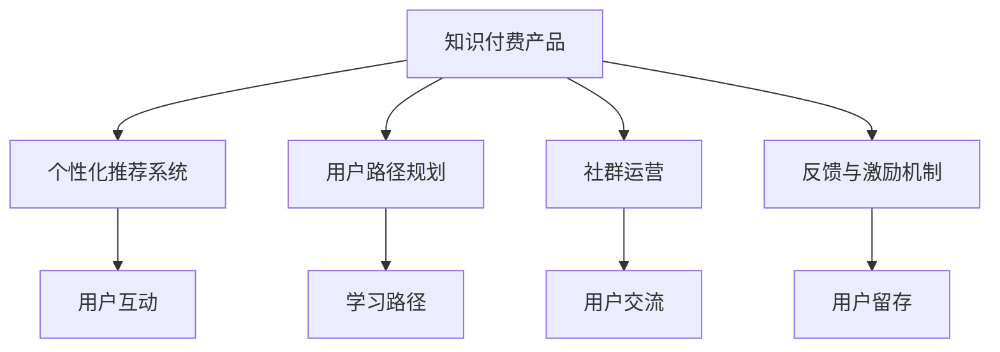

                 

# 如何提高知识付费产品的用户忠诚度

> 关键词：知识付费, 用户体验, 推荐系统, 个性化定制, 学习路径规划, 社群运营, 用户留存, 反馈机制, 互动性, 学习动机, 长尾内容

## 1. 背景介绍

### 1.1 问题由来

在知识付费市场持续增长的今天，如何提升用户忠诚度已成为各大知识付费平台面临的重大挑战。许多平台在用户留存、续订率、转化率等关键指标上陷入困境，难以形成稳定增长的商业模式。究其原因，主要有以下几点：

- **内容同质化严重**：市场供给过剩，优质内容稀缺。用户选择权增大，却难以找到真正适合自己的知识产品。
- **缺乏个性化体验**：多数平台仍采用“一刀切”的推荐模式，难以匹配用户的个性化需求，导致用户流失。
- **用户体验差**：平台界面复杂、操作繁琐、互动性差，用户难以形成长期粘性。
- **缺乏社群支撑**：平台未能有效搭建起用户之间的社群关系，用户孤立学习，缺乏持续学习动力。

### 1.2 问题核心关键点

提升知识付费产品的用户忠诚度，核心在于以下几个方面：

- **内容定制化**：提供符合用户个性化需求的知识内容，构建个性化的学习路径和推荐系统。
- **用户体验优化**：简化操作流程，增强互动性，构建良好的用户体验，提升用户满意度。
- **社群运营**：建立用户之间的互动和交流平台，增强用户的归属感和忠诚度。
- **反馈与激励机制**：设计科学的反馈与激励机制，保持用户的长期学习动力。

## 2. 核心概念与联系

### 2.1 核心概念概述

为更好地理解如何提高知识付费产品的用户忠诚度，本节将介绍几个关键概念：

- **知识付费产品**：即平台提供的知识服务，包括课程、文章、音频、视频等形式的内容。
- **个性化推荐系统**：通过用户行为数据和内容特征，推荐符合用户兴趣和需求的内容。
- **用户路径规划**：根据用户的学习进度和偏好，为其规划最优的学习路径。
- **社群运营**：建立用户之间的互动和交流平台，提升用户粘性和归属感。
- **反馈与激励机制**：基于用户反馈和行为数据，设计科学的激励和奖励机制，增强用户的学习动机。

这些概念之间的逻辑关系可以通过以下Mermaid流程图来展示：



这个流程图展示了知识付费产品的几个核心组成部分及其之间的关系：

1. 知识付费产品通过个性化推荐系统、用户路径规划、社群运营和反馈激励机制，提供个性化的学习体验，增强用户粘性。
2. 个性化推荐系统根据用户行为和偏好，推荐感兴趣的内容，提升用户体验。
3. 用户路径规划帮助用户找到适合自己的学习路径，避免浪费时间和资源。
4. 社群运营建立用户间的互动和交流，增强用户归属感。
5. 反馈与激励机制基于用户反馈和行为数据，设计科学奖励机制，保持用户的学习动力。

## 3. 核心算法原理 & 具体操作步骤

### 3.1 算法原理概述

提升知识付费产品用户忠诚度的关键在于构建一个高效、个性化的推荐系统和学习路径规划系统。具体步骤如下：

**Step 1: 数据采集与处理**
- 收集用户注册、登录、学习、购买、评价等行为数据。
- 采集用户历史浏览、点击、学习时间等行为特征。
- 分析用户兴趣和需求，构建用户画像。

**Step 2: 内容特征提取**
- 对课程、文章、音频、视频等知识内容进行特征提取，包括标题、摘要、标签、作者、评价等。
- 使用文本向量化技术，将内容转换为高维向量表示。
- 分析用户对内容的偏好和评价，构建内容特征向量。

**Step 3: 推荐模型训练**
- 使用机器学习算法（如协同过滤、内容推荐、混合模型等）训练个性化推荐模型。
- 使用深度学习算法（如神经网络、注意力机制等）训练学习路径规划模型。
- 训练社群互动和反馈激励模型，收集用户反馈，优化推荐系统。

**Step 4: 推荐与路径规划**
- 基于用户画像和内容特征向量，进行推荐计算，生成推荐列表。
- 结合用户学习进度和偏好，动态生成个性化学习路径。
- 根据推荐和路径规划结果，构建界面和交互流程，提升用户体验。

### 3.2 算法步骤详解

以个性化推荐系统为例，详细讲解其核心算法步骤：

**Step 1: 用户画像构建**
- 收集用户注册、登录、学习、购买、评价等行为数据。
- 采集用户历史浏览、点击、学习时间等行为特征。
- 使用聚类算法（如K-means）对用户进行分类，构建用户画像。

**Step 2: 内容特征提取**
- 对课程、文章、音频、视频等知识内容进行特征提取，包括标题、摘要、标签、作者、评价等。
- 使用文本向量化技术，将内容转换为高维向量表示。
- 分析用户对内容的偏好和评价，构建内容特征向量。

**Step 3: 推荐模型训练**
- 使用协同过滤算法（如基于矩阵分解的算法）对用户和内容进行相似度计算。
- 使用深度学习算法（如神经网络、注意力机制等）构建推荐模型，训练模型参数。
- 训练反馈激励模型，收集用户反馈，优化推荐系统。

**Step 4: 推荐结果生成**
- 根据用户画像和内容特征向量，进行推荐计算，生成推荐列表。
- 结合用户学习进度和偏好，动态生成个性化学习路径。
- 根据推荐和路径规划结果，构建界面和交互流程，提升用户体验。

### 3.3 算法优缺点

个性化推荐系统具有以下优点：
1. 提升用户满意度：通过推荐符合用户兴趣的内容，提升用户体验。
2. 优化资源配置：合理分配内容资源，提升内容价值利用率。
3. 增加用户粘性：通过个性化推荐，增强用户粘性，提升留存率。
4. 促进用户转化：通过精准推荐，提升用户转化率，增加营收。

同时，该方法也存在一定的局限性：
1. 数据质量要求高：推荐系统依赖大量高质量数据，数据缺失或不准确会导致推荐效果不佳。
2. 模型复杂度高：深度学习模型的训练和维护成本较高，需要较大的计算资源。
3. 个性化不够精细：推荐系统难以精细化匹配用户的多样化需求，可能导致部分用户不满足。
4. 用户隐私风险：需要处理和存储大量用户数据，可能存在隐私泄露的风险。

尽管存在这些局限性，但就目前而言，个性化推荐系统仍然是最主流的方法之一。未来相关研究的重点在于如何进一步降低推荐系统的数据依赖，提高模型的复杂度，以及增强个性化和隐私保护等方面。

### 3.4 算法应用领域

个性化推荐系统在知识付费产品中得到了广泛的应用，例如：

- 课程推荐：根据用户浏览、学习、评价等行为数据，推荐感兴趣的高质量课程。
- 文章推荐：根据用户阅读历史和偏好，推荐相关主题的文章。
- 视频推荐：根据用户观看历史和评价，推荐相关视频内容。
- 内容订阅：根据用户兴趣和需求，推荐订阅内容，减少用户选择成本。

除了上述这些经典应用外，个性化推荐系统还被创新性地应用到更多场景中，如新用户推荐、热门内容推广、个性化课程包设计等，为知识付费产品带来了新的发展机遇。

## 4. 数学模型和公式 & 详细讲解  
### 4.1 数学模型构建

本节将使用数学语言对个性化推荐系统的构建过程进行更加严格的刻画。

记用户集合为 $U=\{u_1, u_2, \dots, u_N\}$，内容集合为 $I=\{i_1, i_2, \dots, i_M\}$，行为数据矩阵为 $D \in \{0, 1\}^{N \times M}$，其中 $D_{ui} = 1$ 表示用户 $u$ 在内容 $i$ 上产生了行为，否则为0。

定义用户特征向量为 $\mathbf{u}_u = [u_{u1}, u_{u2}, \dots, u_{un}]$，内容特征向量为 $\mathbf{i}_i = [i_{i1}, i_{i2}, \dots, i_{im}]$，其中 $u_{uj}$ 和 $i_{ik}$ 分别表示用户 $u$ 和内容 $i$ 的特征。

用户和内容相似度矩阵为 $S \in \mathbb{R}^{N \times M}$，其中 $S_{ui}$ 表示用户 $u$ 和内容 $i$ 的相似度。

推荐模型基于用户特征 $\mathbf{u}_u$、内容特征 $\mathbf{i}_i$ 和相似度矩阵 $S$ 进行推荐计算。推荐结果为 $\hat{\mathbf{i}}_u = [\hat{i}_{u1}, \hat{i}_{u2}, \dots, \hat{i}_{um}]$，其中 $\hat{i}_{uj}$ 表示推荐内容 $i$ 的评分。

### 4.2 公式推导过程

以协同过滤算法为例，推导推荐模型的公式。

协同过滤算法基于用户-内容矩阵 $D$ 和用户特征向量 $\mathbf{u}_u$ 和内容特征向量 $\mathbf{i}_i$，计算用户和内容的相似度矩阵 $S$，然后根据相似度矩阵 $S$ 生成推荐结果 $\hat{\mathbf{i}}_u$。

推荐计算公式为：

$$
\hat{\mathbf{i}}_u = (\mathbf{u}_u^T S) \odot \mathbf{i}_i
$$

其中 $\odot$ 表示逐元素相乘。

具体推导过程如下：

**Step 1: 用户特征和内容特征矩阵的归一化**

$$
\mathbf{U}_u = \frac{\mathbf{u}_u}{\|\mathbf{u}_u\|}, \mathbf{I}_i = \frac{\mathbf{i}_i}{\|\mathbf{i}_i\|}
$$

**Step 2: 用户-内容矩阵的归一化**

$$
\tilde{D} = \frac{D}{\max\limits_i \sum\limits_u D_{ui}}
$$

**Step 3: 用户特征和内容特征的扩展**

$$
\tilde{\mathbf{U}}_u = [\mathbf{U}_u, \mathbf{I}_i], \tilde{\mathbf{I}}_i = [\mathbf{I}_i, \mathbf{U}_u]
$$

**Step 4: 相似度矩阵的计算**

$$
S = \tilde{D} \tilde{\mathbf{U}}_u^T \tilde{\mathbf{I}}_i
$$

**Step 5: 推荐计算**

$$
\hat{\mathbf{i}}_u = (\mathbf{u}_u^T S) \odot \mathbf{i}_i
$$

其中，$\mathbf{u}_u^T$ 表示用户特征向量的转置，$S$ 表示用户和内容的相似度矩阵，$\odot$ 表示逐元素相乘。

通过以上公式，协同过滤算法可以高效地计算推荐结果，满足大规模个性化推荐的需求。

### 4.3 案例分析与讲解

以在线教育平台为例，分析个性化推荐系统的应用。

**Step 1: 数据采集与处理**
- 收集用户注册、登录、学习、购买、评价等行为数据。
- 采集用户历史浏览、点击、学习时间等行为特征。
- 分析用户兴趣和需求，构建用户画像。

**Step 2: 内容特征提取**
- 对课程、文章、音频、视频等知识内容进行特征提取，包括标题、摘要、标签、作者、评价等。
- 使用文本向量化技术，将内容转换为高维向量表示。
- 分析用户对内容的偏好和评价，构建内容特征向量。

**Step 3: 推荐模型训练**
- 使用协同过滤算法对用户和内容进行相似度计算。
- 使用深度学习算法（如神经网络、注意力机制等）构建推荐模型，训练模型参数。
- 训练反馈激励模型，收集用户反馈，优化推荐系统。

**Step 4: 推荐结果生成**
- 根据用户画像和内容特征向量，进行推荐计算，生成推荐列表。
- 结合用户学习进度和偏好，动态生成个性化学习路径。
- 根据推荐和路径规划结果，构建界面和交互流程，提升用户体验。

## 5. 项目实践：代码实例和详细解释说明
### 5.1 开发环境搭建

在进行个性化推荐系统开发前，我们需要准备好开发环境。以下是使用Python进行TensorFlow开发的环境配置流程：

1. 安装Anaconda：从官网下载并安装Anaconda，用于创建独立的Python环境。

2. 创建并激活虚拟环境：
```bash
conda create -n tf-env python=3.8 
conda activate tf-env
```

3. 安装TensorFlow：根据CUDA版本，从官网获取对应的安装命令。例如：
```bash
pip install tensorflow==2.4
```

4. 安装TensorFlow推荐库：
```bash
pip install tensorflow-recommenders
```

5. 安装各类工具包：
```bash
pip install numpy pandas scikit-learn matplotlib tqdm jupyter notebook ipython
```

完成上述步骤后，即可在`tf-env`环境中开始推荐系统开发。

### 5.2 源代码详细实现

下面我们以在线教育平台为例，给出使用TensorFlow推荐库对用户进行个性化推荐的全代码实现。

首先，定义推荐系统的输入数据格式：

```python
import tensorflow as tf
import tensorflow_recommenders as tfrs
from tensorflow.keras.layers import Input, Embedding, Dot, Dense

# 定义输入层
user_input = Input(shape=(1,), name='user_input')
content_input = Input(shape=(1,), name='content_input')

# 定义用户特征向量和内容特征向量
user_embed = Embedding(input_dim=1000, output_dim=16, name='user_embed')(user_input)
content_embed = Embedding(input_dim=1000, output_dim=16, name='content_embed')(content_input)

# 定义相似度矩阵
dot_product = Dot(axes=(1, 1))([user_embed, content_embed])
similarity = Dense(1, activation='sigmoid')(dot_product)

# 定义推荐结果
recommender = tfrs.layers.Recommender(user_input=user_input, content_input=content_input, dot_product=similarity)
```

接着，定义推荐系统的训练流程：

```python
from tensorflow.keras.optimizers import Adam

# 定义损失函数
def loss_fn(y_true, y_pred):
    return tf.reduce_mean(tf.losses.binary_crossentropy(y_true, y_pred))

# 定义训练模型
model = tf.keras.Sequential([
    recommender,
    Dense(1, activation='sigmoid')
])

# 定义优化器和超参数
optimizer = Adam(learning_rate=0.001)
model.compile(optimizer=optimizer, loss=loss_fn)

# 训练模型
model.fit(x_train, y_train, epochs=10, batch_size=128, validation_data=(x_valid, y_valid))
```

最后，启动训练流程并在测试集上评估：

```python
from sklearn.metrics import roc_auc_score

# 加载测试集数据
x_test, y_test = load_test_data()

# 评估模型
y_pred = model.predict(x_test)
auc = roc_auc_score(y_test, y_pred)
print(f"ROC AUC score: {auc:.3f}")
```

以上就是使用TensorFlow对用户进行个性化推荐的全代码实现。可以看到，借助TensorFlow推荐库，我们能够用相对简洁的代码实现一个高效的个性化推荐系统。

### 5.3 代码解读与分析

让我们再详细解读一下关键代码的实现细节：

**TensorFlow推荐库**：
- 通过TensorFlow推荐库，我们可以很方便地构建推荐系统，实现高效的推荐计算。

**模型定义**：
- 首先定义用户输入和内容输入的层，然后通过Embedding层将输入转换为高维向量表示。
- 使用Dot层计算用户和内容的相似度矩阵，最后通过Dense层将相似度映射为推荐结果。

**模型训练**：
- 定义损失函数和优化器，使用`Sequential`模型将推荐层和输出层组合在一起。
- 训练模型时，使用交叉熵损失函数和Adam优化器进行梯度下降。

**模型评估**：
- 加载测试集数据，使用`predict`方法获取推荐结果。
- 使用`roc_auc_score`函数计算AUC指标，评估推荐系统的效果。

可以看到，TensorFlow推荐库极大地简化了推荐系统的构建和训练过程，使得开发者可以更专注于算法创新和业务优化。

当然，工业级的系统实现还需考虑更多因素，如模型的保存和部署、超参数的自动搜索、多模型集成等。但核心的推荐算法基本与此类似。

## 6. 实际应用场景
### 6.1 在线教育平台

在线教育平台通过个性化推荐系统，可以为用户推荐感兴趣的高质量课程，提升学习效率。具体实现步骤如下：

**数据采集与处理**：
- 收集用户注册、登录、学习、购买、评价等行为数据。
- 采集用户历史浏览、点击、学习时间等行为特征。
- 分析用户兴趣和需求，构建用户画像。

**内容特征提取**：
- 对课程、文章、音频、视频等知识内容进行特征提取，包括标题、摘要、标签、作者、评价等。
- 使用文本向量化技术，将内容转换为高维向量表示。
- 分析用户对内容的偏好和评价，构建内容特征向量。

**推荐模型训练**：
- 使用协同过滤算法对用户和内容进行相似度计算。
- 使用深度学习算法（如神经网络、注意力机制等）构建推荐模型，训练模型参数。
- 训练反馈激励模型，收集用户反馈，优化推荐系统。

**推荐结果生成**：
- 根据用户画像和内容特征向量，进行推荐计算，生成推荐列表。
- 结合用户学习进度和偏好，动态生成个性化学习路径。
- 根据推荐和路径规划结果，构建界面和交互流程，提升用户体验。

### 6.2 电商零售平台

电商零售平台通过个性化推荐系统，可以为用户推荐感兴趣的商品，提升购买转化率。具体实现步骤如下：

**数据采集与处理**：
- 收集用户注册、登录、浏览、购买、评价等行为数据。
- 采集用户历史浏览、点击、购买时间等行为特征。
- 分析用户兴趣和需求，构建用户画像。

**商品特征提取**：
- 对商品进行分类、标签、评价等特征提取。
- 使用文本向量化技术，将商品特征转换为高维向量表示。
- 分析用户对商品的偏好和评价，构建商品特征向量。

**推荐模型训练**：
- 使用协同过滤算法对用户和商品进行相似度计算。
- 使用深度学习算法（如神经网络、注意力机制等）构建推荐模型，训练模型参数。
- 训练反馈激励模型，收集用户反馈，优化推荐系统。

**推荐结果生成**：
- 根据用户画像和商品特征向量，进行推荐计算，生成推荐列表。
- 结合用户购买进度和偏好，动态生成个性化购买路径。
- 根据推荐和路径规划结果，构建界面和交互流程，提升用户体验。

### 6.3 内容分发平台

内容分发平台通过个性化推荐系统，可以为用户推荐感兴趣的文章、视频等内容，提升用户粘性和满意度。具体实现步骤如下：

**数据采集与处理**：
- 收集用户注册、登录、阅读、评论、分享等行为数据。
- 采集用户历史浏览、点击、阅读时间等行为特征。
- 分析用户兴趣和需求，构建用户画像。

**内容特征提取**：
- 对文章、视频、音频等知识内容进行特征提取，包括标题、摘要、标签、作者、评价等。
- 使用文本向量化技术，将内容转换为高维向量表示。
- 分析用户对内容的偏好和评价，构建内容特征向量。

**推荐模型训练**：
- 使用协同过滤算法对用户和内容进行相似度计算。
- 使用深度学习算法（如神经网络、注意力机制等）构建推荐模型，训练模型参数。
- 训练反馈激励模型，收集用户反馈，优化推荐系统。

**推荐结果生成**：
- 根据用户画像和内容特征向量，进行推荐计算，生成推荐列表。
- 结合用户阅读进度和偏好，动态生成个性化阅读路径。
- 根据推荐和路径规划结果，构建界面和交互流程，提升用户体验。

## 7. 工具和资源推荐
### 7.1 学习资源推荐

为了帮助开发者系统掌握个性化推荐系统的理论基础和实践技巧，这里推荐一些优质的学习资源：

1. 《推荐系统实战》书籍：深入浅出地介绍了推荐系统的基本概念和经典算法，适合新手入门。
2. 《深度学习与推荐系统》课程：由斯坦福大学教授主讲，涵盖推荐系统的理论基础和实际应用，是推荐系统领域的经典课程。
3. TensorFlow推荐库官方文档：详细介绍了TensorFlow推荐库的使用方法和最佳实践，是TensorFlow推荐系统的官方指南。
4. HuggingFace Transformers库：提供了大量预训练模型和推荐系统的样例代码，是实现推荐系统的重要工具。
5. KDD Cup比赛：各大数据竞赛中的推荐系统挑战赛，可以了解当前推荐系统的前沿技术和发展趋势。

通过对这些资源的学习实践，相信你一定能够快速掌握个性化推荐系统的精髓，并用于解决实际的NLP问题。

### 7.2 开发工具推荐

高效的开发离不开优秀的工具支持。以下是几款用于个性化推荐系统开发的常用工具：

1. TensorFlow：基于Python的开源深度学习框架，灵活动态的计算图，适合快速迭代研究。TensorFlow推荐库提供丰富的推荐算法和模型实现。

2. PyTorch：基于Python的开源深度学习框架，灵活易用，适合快速实验和研究。TensorFlow推荐库和PyTorch推荐库都提供了丰富的推荐算法和模型实现。

3. Scikit-learn：Python的机器学习库，提供了大量的经典机器学习算法，如协同过滤、决策树等，适合实现推荐系统的基线模型。

4. Weights & Biases：模型训练的实验跟踪工具，可以记录和可视化模型训练过程中的各项指标，方便对比和调优。

5. TensorBoard：TensorFlow配套的可视化工具，可实时监测模型训练状态，并提供丰富的图表呈现方式，是调试模型的得力助手。

6. Apache Flink：高可扩展的分布式计算框架，适合处理大规模推荐数据，实现高效推荐计算。

合理利用这些工具，可以显著提升个性化推荐系统的开发效率，加快创新迭代的步伐。

### 7.3 相关论文推荐

个性化推荐系统在推荐领域的研究得到了广泛关注，以下是几篇奠基性的相关论文，推荐阅读：

1. Matrix Factorization Techniques for Recommender Systems（协同过滤算法）：提出矩阵分解算法，通过分解用户-内容矩阵，获取用户和内容的隐含特征，用于推荐计算。

2. Field-Aware Factorization Machines for Personalized Recommendation：提出领域感知的因子机算法，结合用户特征和内容特征，实现更精准的推荐计算。

3. Attention Is All You Need：提出Transformer结构，通过自注意力机制实现高效的推荐计算，广泛应用于深度推荐系统中。

4. Deep Learning with Gaussian Processes for Scalable Recommendations：将高斯过程引入推荐系统，通过模型预测实现高效的推荐计算，适用于大规模推荐数据。

5. Multi-task Learning with Multiple Similarity Measures：提出多任务学习算法，结合不同相似度度量，实现多模态推荐系统。

这些论文代表了个性化推荐系统的发展脉络。通过学习这些前沿成果，可以帮助研究者把握学科前进方向，激发更多的创新灵感。

## 8. 总结：未来发展趋势与挑战

### 8.1 总结

本文对如何提高知识付费产品的用户忠诚度进行了全面系统的介绍。首先阐述了用户忠诚度提升的重要性，明确了个性化推荐系统在学习路径规划、社群运营、反馈激励等环节的关键作用。其次，从原理到实践，详细讲解了推荐系统的数学模型和算法步骤，给出了推荐系统开发的全代码实现。同时，本文还广泛探讨了推荐系统在在线教育、电商零售、内容分发等实际应用场景中的应用前景，展示了推荐系统技术的多样性和实用性。

通过本文的系统梳理，可以看到，个性化推荐系统在知识付费产品中具有广泛的应用前景，能够显著提升用户满意度、忠诚度和留存率。推荐系统技术的不断发展，将为NLP技术带来更多创新应用，为各行各业提供更优质的服务。

### 8.2 未来发展趋势

展望未来，个性化推荐系统将呈现以下几个发展趋势：

1. 数据驱动的推荐系统：数据量将持续增长，推荐系统将更加依赖数据驱动的模型和算法。
2. 多模态推荐系统：推荐系统将融合多种数据源，如图像、语音、视频等多模态信息，提升推荐效果。
3. 深度学习与协同过滤结合：深度学习算法与传统协同过滤算法结合，将进一步提升推荐系统的性能。
4. 实时推荐系统：推荐系统将实现实时计算和动态更新，提升用户满意度。
5. 多任务学习和个性化推荐结合：结合多任务学习和个性化推荐，实现更精准的推荐。

以上趋势凸显了个性化推荐系统的广阔前景。这些方向的探索发展，必将进一步提升推荐系统的精度和个性化程度，为知识付费产品带来更好的用户体验。

### 8.3 面临的挑战

尽管个性化推荐系统在知识付费产品中得到了广泛应用，但在迈向更加智能化、普适化应用的过程中，它仍面临着诸多挑战：

1. 数据质量问题：推荐系统依赖高质量数据，数据缺失或不准确会导致推荐效果不佳。
2. 推荐系统复杂性：深度学习算法的计算和维护成本较高，需要较大的计算资源。
3. 推荐算法公平性：推荐算法可能存在偏见，需要进一步研究公平性和可解释性。
4. 推荐系统隐私保护：推荐系统需要处理和存储大量用户数据，可能存在隐私泄露的风险。
5. 推荐系统冷启动问题：新用户和未交互过内容的用户推荐效果较差，需要进一步优化。

尽管存在这些挑战，但随着学界和产业界的共同努力，这些挑战终将一一被克服，个性化推荐系统必将在推荐领域不断演进，为各行各业提供更优质的推荐服务。

### 8.4 研究展望

面对个性化推荐系统所面临的种种挑战，未来的研究需要在以下几个方面寻求新的突破：

1. 数据预处理技术：提升数据质量和数据处理效率，降低数据缺失和噪音对推荐效果的影响。
2. 深度学习模型优化：优化深度学习算法的计算和维护成本，提升模型效率和可解释性。
3. 公平性和可解释性：研究公平性和可解释性的推荐算法，减少推荐算法偏见和提升用户信任度。
4. 隐私保护技术：研究隐私保护技术，保护用户数据隐私和安全。
5. 冷启动问题解决：研究解决冷启动问题的方法，提升新用户和未交互过内容的用户推荐效果。

这些研究方向的探索，必将引领个性化推荐系统技术迈向更高的台阶，为各行各业提供更优质的推荐服务。面向未来，个性化推荐系统需要与其他人工智能技术进行更深入的融合，如知识表示、因果推理、强化学习等，多路径协同发力，共同推动人工智能技术在推荐领域的持续进步。只有勇于创新、敢于突破，才能不断拓展推荐系统的边界，为各行各业带来新的技术革命。

## 9. 附录：常见问题与解答

**Q1：推荐系统如何保证用户隐私？**

A: 推荐系统在处理用户数据时，需要采取严格的隐私保护措施。具体措施包括：

1. 数据匿名化：对用户数据进行匿名化处理，去除或模糊化敏感信息，确保用户隐私不受侵犯。
2. 数据加密：使用加密技术对用户数据进行加密存储和传输，防止数据泄露。
3. 访问控制：设置严格的访问权限，确保只有授权人员可以访问用户数据。
4. 差分隐私：使用差分隐私技术，在数据处理过程中添加噪音，保护用户隐私。

通过这些措施，推荐系统可以确保用户数据的安全性和隐私性。

**Q2：推荐系统如何提升新用户的推荐效果？**

A: 推荐系统在处理新用户时，往往存在冷启动问题，难以推荐符合用户兴趣的内容。以下是几种解决冷启动问题的方法：

1. 基于内容的推荐：使用用户的兴趣标签和行为特征，推荐与新用户兴趣相似的内容。
2. 基于社交的推荐：利用用户的社交网络关系，推荐与新用户相似用户的兴趣内容。
3. 基于多模态的推荐：结合用户的行为数据和多种模态数据（如图像、视频、音频等），提升推荐效果。
4. 基于增量的推荐：随着新用户数据的积累，动态更新推荐模型，提升推荐精度。

这些方法可以有效地提升新用户的推荐效果，减少冷启动问题。

**Q3：推荐系统如何优化模型效率？**

A: 推荐系统在优化模型效率方面，可以从以下几个方面入手：

1. 模型压缩：使用模型压缩技术，如剪枝、量化、蒸馏等，减少模型大小，提升推理速度。
2. 模型并行：使用分布式计算和模型并行技术，提高模型计算效率。
3. 算法优化：优化推荐算法的计算复杂度，减少计算资源消耗。
4. 增量学习：使用增量学习技术，动态更新推荐模型，减少模型重训练时间。

通过这些优化措施，推荐系统可以提升模型效率，满足实时推荐的需求。

**Q4：推荐系统如何提升用户满意度？**

A: 推荐系统在提升用户满意度方面，可以从以下几个方面入手：

1. 个性化推荐：根据用户兴趣和行为数据，推荐符合用户需求的内容，提升用户满意度。
2. 多维度推荐：结合用户多维度数据（如行为、社交、背景等），进行全面推荐，提升推荐效果。
3. 实时推荐：实现实时推荐，动态更新推荐内容，提升用户体验。
4. 用户反馈：收集用户反馈，动态优化推荐算法，提升推荐质量。

通过这些措施，推荐系统可以显著提升用户满意度，增强用户粘性。

**Q5：推荐系统如何提升用户留存率？**

A: 推荐系统在提升用户留存率方面，可以从以下几个方面入手：

1. 高质量内容：提供高质量、高价值的内容，满足用户需求，提升用户留存率。
2. 个性化服务：根据用户兴趣和行为数据，提供个性化推荐和定制化服务，提升用户满意度。
3. 互动机制：建立用户互动机制，增强用户粘性和参与度。
4. 反馈机制：建立用户反馈机制，及时收集用户反馈，动态优化推荐算法，提升推荐效果。

通过这些措施，推荐系统可以显著提升用户留存率，实现长期稳定增长。

---

作者：禅与计算机程序设计艺术 / Zen and the Art of Computer Programming

