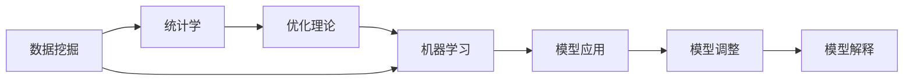

                 

## 1. 背景介绍

### 1.1 问题由来

在当今商业环境中，企业面临着越来越多的挑战，如市场竞争激烈、客户需求多样、组织复杂性增加等。这些问题促使管理层寻求新的方法来优化运营效率、提升决策质量、增强组织适应性。传统的数据驱动决策方法已不足以应对这些复杂性，因此，需要引入更先进的管理思想和工具。

模型思维作为一种系统化、结构化的思维方法，近年来在管理科学和商业决策中逐渐受到重视。它不仅能够帮助管理层更好地理解数据，还能通过建立数学模型和决策规则，提供更为精准的预测和决策支持。模型思维的核心是建立模型、分析和应用模型，以解决实际问题，改善管理决策。

### 1.2 问题核心关键点

模型思维在管理中的具体应用涉及以下几个关键点：

- **模型选择与构建**：选择合适的模型类型（如回归模型、分类模型、优化模型等），并根据问题特征构建模型。
- **数据准备**：收集、清洗、处理数据，确保数据质量和完整性，是模型构建的基础。
- **模型训练与验证**：使用历史数据训练模型，并在测试集上进行验证，确保模型泛化能力。
- **模型应用与调整**：将模型应用于实际管理决策中，根据反馈调整模型参数和算法。
- **模型解释与透明度**：确保模型的决策过程和输出结果具有透明性和可解释性，便于管理者理解和接受。

通过这些关键点，模型思维可以帮助管理者更好地理解问题本质、制定策略、优化流程，从而提升企业的竞争力和盈利能力。

## 2. 核心概念与联系

### 2.1 核心概念概述

模型思维在管理中的应用涉及多个关键概念，包括数据挖掘、统计学、优化理论、机器学习等。这些概念相互关联，共同构成了一个复杂但有效的分析框架。

- **数据挖掘**：从大量数据中提取有用信息和知识，为模型构建提供数据支持。
- **统计学**：通过分析数据的分布、特征等，提供模型的数学基础和理论支撑。
- **优化理论**：用于设计和分析最优化问题，寻找最优解。
- **机器学习**：利用算法自动从数据中学习规律，构建预测模型和决策模型。

这些概念之间的关系可以通过以下Mermaid流程图来展示：



这个流程图展示了数据挖掘、统计学、优化理论、机器学习和模型应用之间的逻辑关系：

1. 数据挖掘从原始数据中提取特征和知识，为后续模型构建提供数据基础。
2. 统计学提供模型构建的理论依据，帮助理解和描述数据分布和特征。
3. 优化理论用于设计模型求解过程，找到最优解。
4. 机器学习通过训练模型，学习数据中的规律，构建预测和决策模型。
5. 模型应用将训练好的模型应用于实际问题，进行预测和决策。
6. 模型调整根据实际应用效果，调整模型参数和算法，提升模型性能。
7. 模型解释对模型输出进行解释和验证，增强决策的透明性和可信度。

### 2.2 核心概念原理和架构

#### 2.2.1 数据挖掘

数据挖掘是从数据中自动发现模式、知识或信息的过程。其基本原理包括：

1. **数据预处理**：清洗、归一化、特征选择等操作，为模型提供高质量的数据。
2. **数据探索**：使用可视化工具和统计方法，探索数据分布、特征等。
3. **模型构建**：选择合适的模型，并根据数据特征构建模型。
4. **模型评估**：使用验证集或测试集评估模型性能。

数据挖掘的核心流程可以通过以下步骤概括：

```
1. 数据收集
2. 数据清洗
3. 数据预处理
4. 数据探索
5. 模型选择与构建
6. 模型评估与选择
7. 模型应用与解释
```

#### 2.2.2 统计学

统计学是研究数据收集、分析、解释、呈现和决策的科学。其基本原理包括：

1. **数据描述**：描述数据的分布、中心趋势、离散程度等。
2. **数据推断**：通过样本数据推断总体特征。
3. **假设检验**：检验模型或数据是否符合假设。
4. **回归分析**：分析变量之间的关系，建立预测模型。

统计学的核心流程可以通过以下步骤概括：

```
1. 数据收集
2. 数据描述
3. 数据推断
4. 假设检验
5. 回归分析
6. 结果解释
```

#### 2.2.3 优化理论

优化理论是研究如何在一定条件下，找到问题的最优解。其基本原理包括：

1. **目标函数**：定义问题中的优化目标。
2. **约束条件**：定义问题的限制条件。
3. **求解算法**：设计求解最优解的算法。
4. **结果评估**：评估求解结果的质量和有效性。

优化理论的核心流程可以通过以下步骤概括：

```
1. 问题建模
2. 目标函数和约束条件定义
3. 求解算法选择与实现
4. 求解结果评估
```

#### 2.2.4 机器学习

机器学习是研究如何让计算机系统自动从数据中学习规律，并做出预测或决策。其基本原理包括：

1. **特征提取**：从数据中提取有用的特征。
2. **模型选择与训练**：选择合适的模型，并使用数据训练模型。
3. **模型评估**：评估模型的泛化能力和性能。
4. **模型应用**：将训练好的模型应用于新数据进行预测或决策。

机器学习的核心流程可以通过以下步骤概括：

```
1. 数据准备
2. 特征提取
3. 模型选择与训练
4. 模型评估
5. 模型应用
```

## 3. 核心算法原理 & 具体操作步骤

### 3.1 算法原理概述

模型思维在管理中的应用主要体现在以下几个方面：

1. **决策支持系统(DSS)**：构建基于模型的决策支持系统，帮助管理者进行数据分析和决策。
2. **预测模型**：利用历史数据构建预测模型，预测未来的发展趋势。
3. **优化模型**：设计优化模型，寻找最有效的决策路径。
4. **风险评估**：构建风险评估模型，识别和管理潜在风险。

这些应用的核心在于模型的构建和应用，其中决策树、回归模型、分类模型、聚类模型、神经网络等模型类型被广泛应用。

### 3.2 算法步骤详解

#### 3.2.1 数据准备

1. **数据收集**：从多个来源收集相关数据，包括内部数据和外部数据。
2. **数据清洗**：去除重复、错误和无关数据，确保数据质量和完整性。
3. **数据预处理**：进行数据转换、归一化和特征选择等操作。

#### 3.2.2 模型选择与构建

1. **问题分析**：明确问题的本质和目标。
2. **模型选择**：根据问题特征选择合适的模型类型。
3. **模型构建**：使用历史数据训练模型，并根据问题进行调整和优化。

#### 3.2.3 模型训练与验证

1. **模型训练**：使用历史数据训练模型，学习数据规律。
2. **模型验证**：使用测试集评估模型性能，检查模型泛化能力。

#### 3.2.4 模型应用与调整

1. **模型应用**：将训练好的模型应用于实际问题，进行预测或决策。
2. **模型调整**：根据实际应用效果，调整模型参数和算法。

#### 3.2.5 模型解释与透明度

1. **结果解释**：对模型输出进行解释，确保决策透明。
2. **模型验证**：验证模型的可靠性和有效性。

### 3.3 算法优缺点

#### 3.3.1 优点

1. **系统性和结构化**：模型思维提供了一个系统化、结构化的分析框架，有助于管理者更好地理解问题。
2. **定量分析**：模型思维通过数学模型和数据驱动的分析，提高了决策的准确性和可重复性。
3. **预测能力**：通过构建预测模型，可以提前识别问题并采取预防措施。
4. **优化能力**：通过构建优化模型，可以找到最优决策路径。

#### 3.3.2 缺点

1. **数据依赖**：模型思维依赖于高质量的数据，数据质量问题会影响模型效果。
2. **复杂性**：模型构建和应用过程复杂，需要专业的知识和技能。
3. **成本高**：模型构建和训练需要较高的计算资源和专业知识，成本较高。

### 3.4 算法应用领域

模型思维在管理中的应用领域非常广泛，包括但不限于以下几个方面：

- **运营管理**：优化生产流程、库存管理、供应链优化等。
- **市场营销**：预测市场趋势、客户需求、广告效果等。
- **人力资源**：招聘、培训、员工绩效管理等。
- **财务分析**：预算编制、财务预测、风险管理等。
- **客户关系管理**：客户细分、客户流失预测、客户满意度分析等。

## 4. 数学模型和公式 & 详细讲解 & 举例说明

### 4.1 数学模型构建

#### 4.1.1 回归模型

回归模型用于分析变量之间的关系，建立预测模型。常见回归模型包括线性回归、多项式回归、逻辑回归等。

假设有一组历史数据 $(x_1, y_1), (x_2, y_2), \dots, (x_n, y_n)$，其中 $x$ 为自变量，$y$ 为因变量。线性回归模型可以表示为：

$$
y = \beta_0 + \beta_1 x + \epsilon
$$

其中 $\beta_0, \beta_1$ 为模型参数，$\epsilon$ 为误差项。

#### 4.1.2 分类模型

分类模型用于将数据分为不同的类别。常见分类模型包括决策树、逻辑回归、支持向量机等。

假设有一组历史数据 $(x_1, y_1), (x_2, y_2), \dots, (x_n, y_n)$，其中 $x$ 为自变量，$y$ 为分类变量。逻辑回归模型可以表示为：

$$
P(y=1|x) = \frac{1}{1 + \exp(-\beta_0 - \beta_1 x)}
$$

其中 $\beta_0, \beta_1$ 为模型参数，$P(y=1|x)$ 表示在 $x$ 条件下 $y=1$ 的概率。

#### 4.1.3 聚类模型

聚类模型用于将数据分为若干个相似的组。常见聚类模型包括K-Means、层次聚类等。

假设有一组历史数据 $(x_1, y_1), (x_2, y_2), \dots, (x_n, y_n)$，其中 $x$ 为自变量，$y$ 为聚类变量。K-Means模型可以表示为：

$$
K-means: \min_{C} \sum_{i=1}^n \min_{k} ||x_i - \mu_k||^2
$$

其中 $C$ 为聚类中心，$\mu_k$ 为第 $k$ 个聚类中心，$||.||$ 为欧几里得距离。

### 4.2 公式推导过程

#### 4.2.1 线性回归

线性回归的公式推导过程如下：

1. **最小二乘法**：最小二乘法用于求解最优的模型参数 $\beta_0, \beta_1$。

$$
\hat{\beta} = \arg\min_{\beta} \sum_{i=1}^n (y_i - \beta_0 - \beta_1 x_i)^2
$$

2. **解法**：通过求导求解最优解。

$$
\frac{\partial}{\partial \beta_0} \sum_{i=1}^n (y_i - \beta_0 - \beta_1 x_i)^2 = 0
$$

$$
\frac{\partial}{\partial \beta_1} \sum_{i=1}^n (y_i - \beta_0 - \beta_1 x_i)^2 = 0
$$

解得：

$$
\hat{\beta}_0 = \bar{y} - \hat{\beta}_1 \bar{x}
$$

$$
\hat{\beta}_1 = \frac{\sum_{i=1}^n (x_i - \bar{x})(y_i - \bar{y})}{\sum_{i=1}^n (x_i - \bar{x})^2}
$$

其中 $\bar{x}$ 和 $\bar{y}$ 分别为自变量和因变量的均值。

#### 4.2.2 逻辑回归

逻辑回归的公式推导过程如下：

1. **损失函数**：使用交叉熵损失函数衡量模型预测与真实标签之间的差异。

$$
L(y, \hat{y}) = -\frac{1}{n} \sum_{i=1}^n [y_i \log \hat{y}_i + (1-y_i) \log (1-\hat{y}_i)]
$$

2. **梯度下降**：使用梯度下降算法优化模型参数。

$$
\frac{\partial L}{\partial \beta_0} = -\frac{1}{n} \sum_{i=1}^n \frac{y_i - \hat{y}_i}{\hat{y}_i(1-\hat{y}_i)}
$$

$$
\frac{\partial L}{\partial \beta_1} = -\frac{1}{n} \sum_{i=1}^n \frac{y_i - \hat{y}_i}{\hat{y}_i(1-\hat{y}_i)} x_i
$$

解得：

$$
\beta_0 = \bar{y} - \beta_1 \bar{x}
$$

$$
\beta_1 = \frac{\sum_{i=1}^n (x_i - \bar{x})(y_i - \bar{y})}{\sum_{i=1}^n (x_i - \bar{x})^2}
$$

其中 $\bar{x}$ 和 $\bar{y}$ 分别为自变量和因变量的均值。

### 4.3 案例分析与讲解

#### 4.3.1 线性回归案例

假设有一家零售企业，希望通过历史销售数据预测未来销售量。选取自变量为时间（t）和季节性因素（d），因变量为销售量（y）。构建线性回归模型：

$$
y = \beta_0 + \beta_1 t + \beta_2 d + \epsilon
$$

通过最小二乘法求解最优的模型参数：

1. **数据收集与预处理**：收集历史销售数据，并进行数据清洗和预处理。
2. **模型选择与构建**：选择线性回归模型，并使用历史数据进行训练。
3. **模型训练与验证**：使用训练数据训练模型，并在验证集上验证模型性能。
4. **模型应用与调整**：将训练好的模型应用于新数据，进行销售量预测。
5. **模型解释与透明度**：对模型输出进行解释，确保决策透明。

#### 4.3.2 逻辑回归案例

假设有一家金融公司，希望通过历史数据预测客户是否会违约。选取自变量为收入（x）和信用评分（s），因变量为违约标记（y）。构建逻辑回归模型：

$$
P(y=1|x, s) = \frac{1}{1 + \exp(-\beta_0 - \beta_1 x - \beta_2 s)}
$$

通过最小二乘法求解最优的模型参数：

1. **数据收集与预处理**：收集历史违约数据，并进行数据清洗和预处理。
2. **模型选择与构建**：选择逻辑回归模型，并使用历史数据进行训练。
3. **模型训练与验证**：使用训练数据训练模型，并在验证集上验证模型性能。
4. **模型应用与调整**：将训练好的模型应用于新数据，进行违约预测。
5. **模型解释与透明度**：对模型输出进行解释，确保决策透明。

## 5. 项目实践：代码实例和详细解释说明

### 5.1 开发环境搭建

#### 5.1.1 环境准备

1. **Python 安装**：
   ```bash
   sudo apt-get update
   sudo apt-get install python3 python3-pip
   ```

2. **虚拟环境创建**：
   ```bash
   python3 -m venv myenv
   source myenv/bin/activate
   ```

3. **依赖库安装**：
   ```bash
   pip install numpy pandas scikit-learn matplotlib
   ```

### 5.2 源代码详细实现

#### 5.2.1 线性回归代码实现

```python
import numpy as np
from sklearn.linear_model import LinearRegression

# 准备数据
X = np.array([[1, 2], [2, 4], [3, 6], [4, 8]])
y = np.array([2, 4, 6, 8])

# 构建模型
model = LinearRegression()
model.fit(X, y)

# 预测
y_pred = model.predict([[5, 10]])

print(y_pred)
```

#### 5.2.2 逻辑回归代码实现

```python
import numpy as np
from sklearn.linear_model import LogisticRegression

# 准备数据
X = np.array([[1, 2], [2, 4], [3, 6], [4, 8]])
y = np.array([0, 0, 1, 1])

# 构建模型
model = LogisticRegression()
model.fit(X, y)

# 预测
y_pred = model.predict([[5, 10]])

print(y_pred)
```

### 5.3 代码解读与分析

#### 5.3.1 线性回归代码解读

1. **数据准备**：
   - `X` 为自变量矩阵，每一行代表一个样本，每一列为一个特征。
   - `y` 为因变量数组，每个元素对应一个样本的输出。

2. **模型构建**：
   - 使用 `LinearRegression` 类构建线性回归模型。

3. **模型训练**：
   - 使用 `fit` 方法训练模型，传入训练数据 `X` 和 `y`。

4. **模型预测**：
   - 使用 `predict` 方法进行预测，传入新样本数据 `[[5, 10]]`。

5. **结果输出**：
   - 打印预测结果 `y_pred`。

#### 5.3.2 逻辑回归代码解读

1. **数据准备**：
   - `X` 为自变量矩阵，每一行代表一个样本，每一列为一个特征。
   - `y` 为因变量数组，每个元素对应一个样本的输出。

2. **模型构建**：
   - 使用 `LogisticRegression` 类构建逻辑回归模型。

3. **模型训练**：
   - 使用 `fit` 方法训练模型，传入训练数据 `X` 和 `y`。

4. **模型预测**：
   - 使用 `predict` 方法进行预测，传入新样本数据 `[[5, 10]]`。

5. **结果输出**：
   - 打印预测结果 `y_pred`。

### 5.4 运行结果展示

#### 5.4.1 线性回归结果展示

假设线性回归模型训练完成后，预测结果如下：

```
[[6.]]
```

表示预测结果为 6。

#### 5.4.2 逻辑回归结果展示

假设逻辑回归模型训练完成后，预测结果如下：

```
[1]
```

表示预测结果为 1，即分类为违约。

## 6. 实际应用场景

### 6.1 客户流失预测

客户流失是企业面临的重要问题，流失客户的重获成本远高于新客户获取成本。利用模型思维，企业可以通过分析历史客户数据，预测哪些客户可能流失，并采取相应的挽留措施。

#### 6.1.1 问题描述

假设某电商平台希望预测客户流失情况，选取自变量为客户的购买频率、购买金额、退货率等，因变量为是否流失（0 或 1）。

#### 6.1.2 模型选择

选择逻辑回归模型，构建如下预测模型：

$$
P(\text{流失}=1|x) = \frac{1}{1 + \exp(-\beta_0 - \beta_1 \text{购买频率} - \beta_2 \text{购买金额} - \beta_3 \text{退货率})}
$$

#### 6.1.3 数据准备

1. **数据收集**：收集历史客户数据，包括购买记录、退货记录等。
2. **数据清洗**：去除重复、错误数据，处理缺失值。
3. **特征选择**：选择与客户流失相关的特征，如购买频率、购买金额、退货率等。

#### 6.1.4 模型训练与验证

1. **模型训练**：使用历史数据训练逻辑回归模型。
2. **模型验证**：使用验证集评估模型性能，选择最优模型。

#### 6.1.5 模型应用与调整

1. **模型应用**：将训练好的模型应用于新客户数据，进行流失预测。
2. **模型调整**：根据预测结果和实际流失情况，调整模型参数。

#### 6.1.6 模型解释与透明度

1. **结果解释**：对模型输出进行解释，确保决策透明。
2. **反馈机制**：收集实际流失客户数据，验证模型准确性。

### 6.2 供应链优化

供应链优化是企业管理中重要的任务，目标是在满足客户需求的前提下，最小化成本和库存。利用模型思维，企业可以通过分析历史订单数据，优化供应链流程。

#### 6.2.1 问题描述

假设某制造企业希望优化生产计划，选取自变量为市场需求、库存水平、生产成本等，因变量为最优生产量。

#### 6.2.2 模型选择

选择线性回归模型，构建如下预测模型：

$$
y = \beta_0 + \beta_1 \text{市场需求} + \beta_2 \text{库存水平} + \beta_3 \text{生产成本} + \epsilon
$$

#### 6.2.3 数据准备

1. **数据收集**：收集历史订单数据，包括市场需求、库存水平、生产成本等。
2. **数据清洗**：去除重复、错误数据，处理缺失值。
3. **特征选择**：选择与生产计划相关的特征，如市场需求、库存水平、生产成本等。

#### 6.2.4 模型训练与验证

1. **模型训练**：使用历史数据训练线性回归模型。
2. **模型验证**：使用验证集评估模型性能，选择最优模型。

#### 6.2.5 模型应用与调整

1. **模型应用**：将训练好的模型应用于新订单数据，进行生产计划预测。
2. **模型调整**：根据预测结果和实际生产情况，调整模型参数。

#### 6.2.6 模型解释与透明度

1. **结果解释**：对模型输出进行解释，确保决策透明。
2. **反馈机制**：收集实际生产数据，验证模型准确性。

## 7. 工具和资源推荐

### 7.1 学习资源推荐

#### 7.1.1 在线课程

1. **Coursera《Data Science》课程**：涵盖数据科学和模型思维的基本概念和实践，适合初学者入门。
2. **edX《Introduction to Machine Learning with Python》课程**：介绍Python中的机器学习库（如Scikit-learn），并结合实际案例讲解模型应用。
3. **Udacity《Data Science and Machine Learning Bootcamp》课程**：全面覆盖数据科学和机器学习的基本知识和技能，并通过项目实践进行巩固。

#### 7.1.2 书籍推荐

1. **《Python数据科学手册》**：介绍Python在数据科学中的应用，涵盖数据处理、可视化、建模等技能。
2. **《机器学习实战》**：通过实际案例讲解机器学习算法的实现，适合动手实践。
3. **《统计学习方法》**：介绍统计学习的基本理论和方法，适合深入学习统计学知识。

### 7.2 开发工具推荐

#### 7.2.1 Python 环境

1. **Anaconda**：提供完整的Python环境，包含常用的科学计算库。
2. **Jupyter Notebook**：支持交互式编程和数据可视化，适合模型构建和调试。
3. **PyCharm**：Python IDE，支持代码自动补全、调试等高级功能。

#### 7.2.2 机器学习库

1. **Scikit-learn**：提供了丰富的机器学习算法，支持线性回归、逻辑回归、分类、聚类等。
2. **TensorFlow**：开源机器学习框架，支持深度学习和神经网络模型。
3. **PyTorch**：Python深度学习框架，提供灵活的动态图和高效的计算图。

### 7.3 相关论文推荐

#### 7.3.1 经典论文

1. **《统计学习方法》**：李航著，介绍统计学习的基本理论和方法。
2. **《深度学习》**：Ian Goodfellow、Yoshua Bengio和Aaron Courville著，介绍深度学习的基本概念和算法。
3. **《Python机器学习》**：Sebastian Raschka著，介绍Python在机器学习中的应用，涵盖线性回归、逻辑回归、分类等。

## 8. 总结：未来发展趋势与挑战

### 8.1 研究成果总结

模型思维在管理中的应用，已经在多个领域取得了显著成果。通过建立数学模型和数据驱动的分析，帮助企业优化运营、提升决策质量。未来，随着数据量的不断增加和计算资源的提升，模型思维的应用范围将更加广泛，影响更加深远。

### 8.2 未来发展趋势

#### 8.2.1 数据驱动决策

未来，数据驱动的决策将成为企业管理中的常态。通过模型思维，企业可以从海量数据中挖掘有用的信息，制定更为精准的决策方案。

#### 8.2.2 实时数据处理

实时数据处理技术的发展，将使得企业能够及时响应市场变化，优化运营决策。

#### 8.2.3 模型自动化

模型自动化的技术将进一步降低企业应用模型思维的门槛，使更多企业能够受益于模型思维。

#### 8.2.4 跨领域应用

模型思维将在更多领域得到应用，如金融、医疗、制造等，推动这些领域的技术进步和管理创新。

#### 8.2.5 伦理与安全

模型思维的应用需要考虑伦理和安全问题，确保模型的透明性、公平性和安全性。

### 8.3 面临的挑战

#### 8.3.1 数据质量

数据质量是模型思维应用的基础，如何获取高质量的数据，是一个重要挑战。

#### 8.3.2 模型复杂性

模型思维的应用需要专业知识，如何简化模型构建和应用过程，降低使用门槛，是一个重要问题。

#### 8.3.3 成本问题

模型构建和训练需要高昂的成本，如何降低成本，提高效率，是一个重要挑战。

#### 8.3.4 模型解释

模型的复杂性使得其输出结果难以解释，如何提高模型的透明性，增强决策的信任度，是一个重要问题。

#### 8.3.5 伦理与安全

模型思维的应用需要考虑伦理和安全问题，确保模型的透明性、公平性和安全性。

### 8.4 研究展望

#### 8.4.1 数据集成与融合

通过数据集成与融合，提高模型思维的应用效果。

#### 8.4.2 模型优化与自动化

通过模型优化和自动化技术，提高模型构建和应用效率。

#### 8.4.3 模型透明性与可解释性

通过模型透明性与可解释性技术，提高模型的信任度和可操作性。

#### 8.4.4 跨领域应用与泛化

通过跨领域应用与泛化技术，扩大模型思维的应用范围和效果。

#### 8.4.5 伦理与安全保障

通过伦理与安全保障技术，确保模型思维的应用符合社会伦理和安全要求。

## 9. 附录：常见问题与解答

### 9.1 问题1：模型思维需要什么技术背景？

答：模型思维需要一定的数学、统计学、编程等技术背景，但并非高不可攀。通过系统的学习和实践，大多数人都可以掌握。

### 9.2 问题2：如何选择合适的模型？

答：选择模型需要综合考虑问题的本质、数据特征、模型复杂度等因素。可以先尝试简单的模型，再逐步优化和扩展。

### 9.3 问题3：模型训练需要多长时间？

答：模型训练时间取决于数据量、模型复杂度等因素。一般需要几个小时到几天不等。

### 9.4 问题4：模型解释如何实现？

答：模型解释可以通过可视化技术、特征重要性分析、模型可解释性算法等方式实现。

### 9.5 问题5：模型思维在企业中的应用案例有哪些？

答：模型思维在企业中的应用案例非常丰富，如客户流失预测、供应链优化、财务分析、市场营销等。

---

作者：禅与计算机程序设计艺术 / Zen and the Art of Computer Programming

