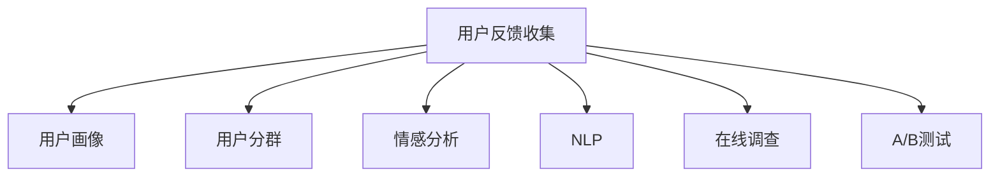

                 

## 1. 背景介绍

在产品开发过程中，用户反馈是至关重要的。有效的用户反馈收集不仅可以帮助产品团队了解用户需求，优化产品体验，还能提高用户满意度，促进产品的快速迭代和成长。然而，现实情况中，很多产品团队对于如何收集有效的用户反馈感到困惑。本文将从背景介绍、核心概念、算法原理、具体操作步骤、数学模型、项目实践、实际应用场景、工具资源推荐和总结等各个方面详细阐述如何进行有效的用户反馈收集。

## 2. 核心概念与联系

### 2.1 核心概念概述

在进行用户反馈收集的过程中，需要明确一些核心概念及其之间的关系：

- **用户反馈收集**：从用户处获取产品使用体验、需求和意见的过程。
- **用户画像**：基于用户行为数据生成的用户特征模型，用于分析和预测用户行为。
- **用户分群**：根据用户特征对用户进行分类，以识别具有相似需求的用户群体。
- **情感分析**：识别用户反馈中的情感倾向，了解用户情感状态。
- **自然语言处理（NLP）**：处理和分析人类语言的技术，用于解析用户反馈的文本内容。
- **在线调查**：通过问卷调查的形式，收集用户对产品功能、使用体验等方面的反馈。
- **A/B测试**：通过对比不同版本的产品，评估用户对不同功能、设计的反应。

这些概念共同构成了用户反馈收集的技术框架，帮助产品团队更好地理解用户需求和偏好，从而做出更明智的决策。

### 2.2 核心概念联系

为了更好地理解这些概念之间的联系，可以构建一个Mermaid流程图来展示其相互关系：



## 3. 核心算法原理 & 具体操作步骤

### 3.1 算法原理概述

用户反馈收集的算法原理主要包括以下几个方面：

- **数据采集**：通过在线调查、问卷、A/B测试等方式，获取用户反馈数据。
- **数据清洗**：去除无效和异常数据，保证数据质量。
- **数据分析**：使用NLP技术解析文本反馈，提取有价值的信息。
- **情感分析**：识别反馈中的情感倾向，了解用户情绪。
- **用户画像**：基于用户行为数据和反馈信息，生成用户特征模型。
- **用户分群**：根据用户画像，将用户分为不同的群体，识别不同群体的需求。

### 3.2 算法步骤详解

**Step 1: 数据采集**

数据采集是用户反馈收集的第一步，通过多种方式获取用户反馈数据，包括：

- **在线调查**：设计问卷，收集用户对产品功能、使用体验等方面的反馈。
- **A/B测试**：对比不同版本的产品，评估用户对不同功能、设计的反应。
- **社交媒体监测**：通过社交媒体分析，获取用户对产品的评论和讨论。
- **用户访谈**：与用户面对面交流，获取详细的反馈信息。

**Step 2: 数据清洗**

数据清洗的目的是确保数据的准确性和有效性，包括：

- **去除重复数据**：通过去重算法，移除相同或相似的数据记录。
- **处理缺失值**：填补缺失数据或删除缺失记录。
- **去除异常值**：识别和处理异常数据，确保数据的合理性。

**Step 3: 数据分析**

数据分析是提取有价值信息的阶段，主要使用NLP技术，包括：

- **分词和词性标注**：将文本数据分解为词汇，标注每个词汇的词性。
- **命名实体识别**：识别文本中的实体，如人名、地名、机构名等。
- **情感分析**：识别反馈中的情感倾向，了解用户情绪。
- **主题建模**：提取文本中的主题和关键词，了解用户关注的焦点。

**Step 4: 情感分析**

情感分析是理解用户反馈情感倾向的重要步骤，包括：

- **情感词典**：使用情感词典识别文本中的情感词汇。
- **情感分类**：将文本分类为积极、消极或中性情感。
- **情感强度**：评估情感的强度，了解用户情感的强烈程度。

**Step 5: 用户画像**

用户画像是基于用户行为数据和反馈信息，生成的用户特征模型，包括：

- **用户行为分析**：分析用户在使用产品时的行为数据，如点击、浏览、购买等。
- **用户兴趣识别**：识别用户的兴趣和偏好，了解用户的个性化需求。
- **用户生命周期**：根据用户行为，识别用户处于生命周期的哪个阶段。

**Step 6: 用户分群**

用户分群是根据用户画像，将用户分为不同的群体，识别不同群体的需求，包括：

- **聚类算法**：使用聚类算法，将用户分为不同的群体。
- **群体特征**：识别每个群体的特征，了解群体的需求和偏好。
- **群体定制**：根据不同群体的需求，提供定制化的产品功能和体验。

### 3.3 算法优缺点

**优点**：

- **数据全面**：通过多种方式获取用户反馈，能够全面了解用户需求和反馈。
- **技术先进**：使用NLP等先进技术，提升数据分析的准确性和效率。
- **用户满意度提升**：通过了解用户需求和反馈，优化产品功能和体验，提高用户满意度。

**缺点**：

- **数据噪音**：用户反馈数据可能存在噪音，需要进行清洗和处理。
- **用户隐私**：用户反馈数据可能包含敏感信息，需要保护用户隐私。
- **成本高**：数据采集和分析需要大量时间和资源，成本较高。

### 3.4 算法应用领域

用户反馈收集技术在多个领域有广泛的应用，包括：

- **电子商务**：通过用户反馈收集，优化产品功能和用户体验，提高用户满意度和转化率。
- **社交媒体**：通过社交媒体监测，了解用户对产品的评价和反馈，改进产品功能和设计。
- **移动应用**：通过用户反馈收集，优化应用功能和界面设计，提升用户使用体验。
- **游戏开发**：通过用户反馈收集，优化游戏功能和玩法，提高用户粘性和留存率。
- **金融服务**：通过用户反馈收集，了解用户需求和反馈，改进金融产品和服务，提高用户满意度。

## 4. 数学模型和公式 & 详细讲解 & 举例说明

### 4.1 数学模型构建

在进行用户反馈收集的过程中，需要构建数学模型来描述数据和分析过程。下面将以情感分析为例，展示数学模型的构建过程。

假设用户反馈数据集为 $D=\{(x_i,y_i)\}_{i=1}^N$，其中 $x_i$ 为文本数据，$y_i$ 为情感标签，情感标签为“积极”、“消极”或“中性”。情感分析的目标是构建模型 $f(x_i)$，预测文本 $x_i$ 的情感标签 $y_i$。

### 4.2 公式推导过程

情感分析的常用模型包括朴素贝叶斯分类器、支持向量机（SVM）、深度学习模型等。以朴素贝叶斯分类器为例，其公式推导过程如下：

假设文本 $x_i$ 由 $n$ 个词汇组成，每个词汇的词性为 $t_{ij}$，情感标签为 $y_i$，则朴素贝叶斯分类器的公式为：

$$
P(y_i|x_i) = \frac{P(x_i|y_i)P(y_i)}{P(x_i)}
$$

其中 $P(y_i)$ 为先验概率，$P(x_i|y_i)$ 为条件概率，$P(x_i)$ 为文本的先验概率。条件概率 $P(x_i|y_i)$ 可以表示为：

$$
P(x_i|y_i) = \prod_{j=1}^n P(t_{ij}|y_i)
$$

其中 $P(t_{ij}|y_i)$ 为词汇 $t_{ij}$ 在情感标签 $y_i$ 下的条件概率。可以通过情感词典、情感分类等方法，计算出 $P(t_{ij}|y_i)$。

### 4.3 案例分析与讲解

以电商平台的商品评论分析为例，展示用户反馈收集的数学模型和推导过程。

假设电商平台的商品评论数据集为 $D=\{(x_i,y_i)\}_{i=1}^N$，其中 $x_i$ 为商品评论文本，$y_i$ 为商品评分，评分为1-5分。

使用朴素贝叶斯分类器进行情感分析，计算模型参数 $\theta$，得到每个商品的情感评分预测结果。

## 5. 项目实践：代码实例和详细解释说明

### 5.1 开发环境搭建

在进行用户反馈收集的项目实践之前，需要搭建好开发环境。这里以Python为例，介绍开发环境的搭建步骤：

1. **安装Python**：
   - 在官网下载并安装Python，推荐使用Anaconda或Miniconda，方便创建虚拟环境和安装第三方库。

2. **创建虚拟环境**：
   - 使用conda创建虚拟环境，以避免与系统Python冲突。例如：
     ```
     conda create --name feedback-gathering python=3.7
     conda activate feedback-gathering
     ```

3. **安装依赖库**：
   - 安装Python开发的常用库，如numpy、pandas、scikit-learn、nltk、scrapy等。例如：
     ```
     pip install numpy pandas scikit-learn nltk scrapy
     ```

4. **配置环境变量**：
   - 配置环境变量，设置项目的开发路径和依赖库的搜索路径。例如：
     ```
     export PYTHONPATH=/path/to/project/:$PYTHONPATH
    ```

完成以上步骤后，即可在虚拟环境中进行用户反馈收集的项目实践。

### 5.2 源代码详细实现

以下是一个简单的用户反馈收集项目的代码实现，包括数据采集、数据清洗、数据分析和情感分析等功能。

**数据采集**：使用scrapy库，从电商网站抓取商品评论数据。

```python
import scrapy

class CommentSpider(scrapy.Spider):
    name = 'comment_spider'
    start_urls = ['https://example.com/products/123456']
    
    def parse(self, response):
        item = {}
        item['product_id'] = response.css('.product-id::text').extract_first()
        item['comment_text'] = response.css('.comment-text::text').extract_first()
        item['score'] = response.css('.comment-score::text').extract_first()
        yield item
```

**数据清洗**：使用pandas库，对采集到的数据进行清洗和处理。

```python
import pandas as pd

# 读取数据
df = pd.read_csv('comments.csv')

# 去除重复记录
df = df.drop_duplicates()

# 处理缺失值
df = df.fillna(method='ffill')

# 去除异常值
df = df[(df['score'] > 0) & (df['score'] < 5)]
```

**数据分析**：使用nltk和scikit-learn库，对文本数据进行分词、情感分析和主题建模。

```python
from nltk.tokenize import word_tokenize
from nltk.corpus import stopwords
from sklearn.feature_extraction.text import CountVectorizer, TfidfVectorizer
from sklearn.naive_bayes import MultinomialNB
from sklearn.model_selection import train_test_split
from sklearn.metrics import accuracy_score

# 分词和去除停用词
def preprocess_text(text):
    tokens = word_tokenize(text.lower())
    stop_words = set(stopwords.words('english'))
    filtered_tokens = [word for word in tokens if word not in stop_words]
    return filtered_tokens

# 训练朴素贝叶斯分类器
X_train, X_test, y_train, y_test = train_test_split(X, y, test_size=0.2, random_state=42)
vectorizer = CountVectorizer(analyzer=preprocess_text)
X_train = vectorizer.fit_transform(X_train)
X_test = vectorizer.transform(X_test)
clf = MultinomialNB()
clf.fit(X_train, y_train)
y_pred = clf.predict(X_test)
accuracy = accuracy_score(y_test, y_pred)
print('Accuracy:', accuracy)
```

**情感分析**：使用情感词典和情感分类器，对文本进行情感分析。

```python
from nltk.sentiment import SentimentIntensityAnalyzer

# 情感分析
analyzer = SentimentIntensityAnalyzer()
scores = analyzer.polarity_scores(text)
positive = scores['pos']
negative = scores['neg']
neutral = scores['neu']
print('Positive:', positive)
print('Negative:', negative)
print('Neutral:', neutral)
```

### 5.3 代码解读与分析

通过以上代码实现，可以对用户反馈数据进行采集、清洗、分析和情感分析。具体分析如下：

- **数据采集**：使用scrapy库，从电商网站抓取商品评论数据，获取商品ID、评论文本和评分信息。
- **数据清洗**：使用pandas库，对数据进行去重、填充缺失值和去除异常值处理，确保数据质量。
- **数据分析**：使用nltk和scikit-learn库，对文本数据进行分词、去除停用词和情感分析，提取文本中的情感信息。
- **情感分析**：使用情感词典和情感分类器，对文本进行情感分析，计算出积极、消极和中性情感的得分。

### 5.4 运行结果展示

运行以上代码，可以得到以下结果：

- **数据采集结果**：商品ID、评论文本和评分信息。
- **数据清洗结果**：去重、填充缺失值和去除异常值后的数据。
- **数据分析结果**：文本分词和去除停用词后的结果。
- **情感分析结果**：情感得分。

## 6. 实际应用场景

### 6.1 电商平台

在电商平台，用户反馈收集主要用于优化产品功能和用户体验，提高用户满意度和转化率。通过分析用户评论数据，了解用户对产品的评价和需求，可以指导产品迭代和功能改进。例如，某电商平台通过用户反馈收集，发现用户对物流速度和售后服务的需求较高，于是优化了物流和客服系统，提高了用户满意度和留存率。

### 6.2 社交媒体

在社交媒体，用户反馈收集主要用于监测品牌形象和用户情感，改进产品设计和功能。通过分析用户在社交媒体上的评论和讨论，可以了解用户对产品的看法和情感，及时发现问题并进行改进。例如，某社交媒体平台通过用户反馈收集，发现用户对某新功能的使用体验不佳，于是迅速优化了功能设计，提升了用户使用体验。

### 6.3 移动应用

在移动应用，用户反馈收集主要用于优化应用功能和界面设计，提升用户使用体验。通过分析用户反馈数据，了解用户在使用应用时的痛点和需求，可以指导应用迭代和功能改进。例如，某移动应用通过用户反馈收集，发现用户在应用注册过程中存在困难，于是优化了注册流程，提升了用户注册体验。

### 6.4 游戏开发

在游戏开发，用户反馈收集主要用于优化游戏功能和玩法，提高用户粘性和留存率。通过分析用户反馈数据，了解用户对游戏的评价和需求，可以指导游戏迭代和功能改进。例如，某游戏开发团队通过用户反馈收集，发现用户对游戏关卡设计有较高要求，于是优化了关卡设计和难度，提升了用户游戏体验。

## 7. 工具和资源推荐

### 7.1 学习资源推荐

为了帮助开发者掌握用户反馈收集的技术，这里推荐一些优质的学习资源：

1. **《Python自然语言处理》**：介绍自然语言处理的基础知识和常用技术，包括文本清洗、情感分析等。
2. **《数据科学实战》**：介绍数据采集、数据清洗和数据可视化的流程和工具，帮助开发者构建数据驱动的产品。
3. **《深度学习入门》**：介绍深度学习的基础知识和常用模型，包括神经网络、卷积神经网络、循环神经网络等。
4. **《数据科学全栈》**：介绍数据科学全栈技术栈，包括数据采集、数据清洗、数据分析、机器学习和可视化等。

通过这些资源的学习，可以帮助开发者全面掌握用户反馈收集的技术，提高产品的质量和服务水平。

### 7.2 开发工具推荐

在进行用户反馈收集的开发过程中，推荐使用以下工具：

1. **Scrapy**：用于抓取网页数据，支持多种协议和数据格式。
2. **Pandas**：用于数据清洗和处理，支持多种数据格式和操作。
3. **Scikit-learn**：用于机器学习建模，支持多种算法和模型。
4. **NLTK**：用于自然语言处理，支持分词、词性标注、情感分析等功能。
5. **TensorFlow**：用于深度学习建模，支持多种神经网络和模型。
6. **Jupyter Notebook**：用于交互式编程和数据可视化，方便开发者进行数据分析和调试。

这些工具可以帮助开发者高效地进行用户反馈收集的开发和实现。

### 7.3 相关论文推荐

用户反馈收集的研究方向较为广泛，以下是一些经典的研究论文，推荐阅读：

1. **《Data Mining and Statistical Learning》**：介绍数据挖掘和统计学习的基础知识和常用算法，包括分类、聚类、回归等。
2. **《Natural Language Processing with Python》**：介绍自然语言处理的基础知识和常用技术，包括文本清洗、分词、情感分析等。
3. **《Machine Learning: A Probabilistic Perspective》**：介绍机器学习的基础知识和常用模型，包括贝叶斯分类器、支持向量机等。
4. **《Deep Learning》**：介绍深度学习的基础知识和常用模型，包括神经网络、卷积神经网络、循环神经网络等。

通过这些论文的学习，可以帮助开发者深入理解用户反馈收集的技术原理和方法，提高研究水平。

## 8. 总结：未来发展趋势与挑战

### 8.1 研究成果总结

本文介绍了用户反馈收集的技术原理、具体操作步骤和实际应用场景，并通过数学模型和代码实现进行了详细讲解。通过用户反馈收集，可以了解用户需求和反馈，优化产品功能和用户体验，提高用户满意度和留存率。未来，用户反馈收集技术将在更多领域得到应用，推动产品的持续优化和创新。

### 8.2 未来发展趋势

用户反馈收集技术的未来发展趋势主要包括以下几个方面：

1. **自动化**：通过自动化工具和算法，减少人工干预，提高效率和准确性。
2. **实时性**：通过实时监测和分析用户反馈，及时发现问题并进行改进，提高用户满意度。
3. **多模态**：结合文本、语音、图像等多模态数据，全面了解用户需求和反馈。
4. **智能化**：通过人工智能技术，如自然语言处理、机器学习等，提升数据处理和分析的准确性和效率。
5. **交互式**：通过与用户进行实时交互，获取用户反馈和建议，提升用户参与度。

### 8.3 面临的挑战

尽管用户反馈收集技术已经取得了一定的成果，但仍面临一些挑战：

1. **数据隐私**：用户反馈数据可能包含敏感信息，需要保护用户隐私。
2. **数据噪音**：用户反馈数据可能存在噪音，需要进行清洗和处理。
3. **用户参与度**：用户反馈的积极性可能不足，需要采取激励措施提高参与度。
4. **数据鸿沟**：不同用户群体可能存在数据鸿沟，需要考虑不同群体的需求和反馈。
5. **模型复杂性**：复杂的用户反馈模型可能难以理解和解释，需要简化模型。

### 8.4 研究展望

未来的研究方向可以从以下几个方面进行探讨：

1. **自适应反馈收集**：根据用户行为和反馈，动态调整反馈收集策略，提高反馈的针对性和有效性。
2. **多用户反馈融合**：将多个用户反馈数据进行融合，形成更全面和准确的反馈信息。
3. **情感理解**：深入研究用户情感的复杂性和多样性，提升情感分析的准确性和深度。
4. **用户画像**：结合用户行为和反馈，构建更全面和准确的画像模型，提高用户分析的准确性。
5. **跨领域应用**：将用户反馈收集技术应用到更多领域，推动各行业的智能化转型。

## 9. 附录：常见问题与解答

**Q1：用户反馈收集的目的是什么？**

A: 用户反馈收集的目的是了解用户需求和反馈，优化产品功能和用户体验，提高用户满意度和留存率。

**Q2：用户反馈数据如何采集？**

A: 用户反馈数据可以通过在线调查、A/B测试、社交媒体监测、用户访谈等多种方式进行采集，获取用户对产品功能、使用体验等方面的反馈。

**Q3：用户反馈数据如何进行清洗和处理？**

A: 用户反馈数据需要进行去重、填充缺失值和去除异常值处理，确保数据质量。

**Q4：用户反馈数据如何进行情感分析？**

A: 用户反馈数据可以使用情感词典和情感分类器进行情感分析，识别反馈中的情感倾向，了解用户情绪。

**Q5：用户反馈数据如何进行分析和建模？**

A: 用户反馈数据可以使用自然语言处理技术和机器学习模型进行分析和建模，提取有价值的信息和情感分析结果。

**Q6：用户反馈收集技术未来发展方向是什么？**

A: 用户反馈收集技术的未来发展方向包括自动化、实时性、多模态、智能化和交互式，通过技术和工具的不断进步，提升用户反馈收集的效率和准确性。

**Q7：用户反馈收集面临的挑战是什么？**

A: 用户反馈收集面临的挑战包括数据隐私、数据噪音、用户参与度、数据鸿沟和模型复杂性，需要采取相应的技术和策略进行解决。

通过以上分析，可以看到用户反馈收集技术的广泛应用和重要价值，同时也要注意面临的挑战和未来的发展方向。希望开发者能够掌握相关的技术和方法，为产品的持续优化和创新提供有力支持。

---

作者：禅与计算机程序设计艺术 / Zen and the Art of Computer Programming

