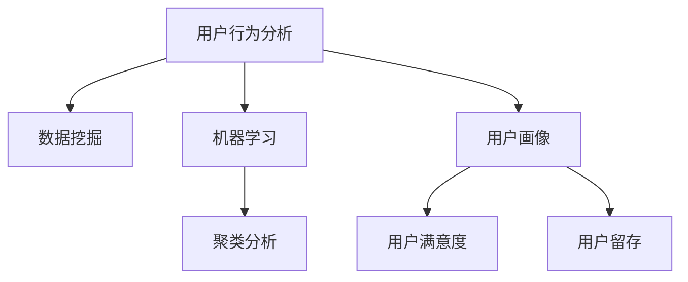

                 

# 如何进行有效的用户行为分析

> 关键词：用户行为分析, 数据挖掘, 机器学习, 聚类分析, 用户画像, 用户满意度

## 1. 背景介绍

### 1.1 问题由来
随着互联网和移动互联网的普及，数据日益丰富多样，如何利用这些数据来深入理解用户行为、提升用户体验和业务价值，成为企业关注的焦点。用户行为分析(User Behavior Analysis, UBA)即是指通过收集、分析和挖掘用户行为数据，识别用户行为模式和兴趣偏好，从而实现用户细分、行为预测、个性化推荐、用户留存、市场细分等业务目标。

近年来，大数据和机器学习技术的发展为UBA提供了强大的技术支持，促进了UBA方法的多样化和智能化。然而，如何在海量数据中找到有效信息、消除噪音干扰、识别关键模式，仍然是一个复杂且具有挑战性的问题。

### 1.2 问题核心关键点
用户行为分析的核心在于通过对用户数据进行高效分析和建模，得到有价值的洞察和预测结果。具体来说，关键点包括：

- 数据获取：如何高效地从多个渠道收集用户行为数据。
- 数据处理：如何清洗和处理原始数据，以消除噪音和异常值，提取有用特征。
- 模型构建：如何选择和设计合适的机器学习模型，以挖掘用户行为模式。
- 结果评估：如何评价和改进模型的预测效果，确保其可靠性和鲁棒性。

### 1.3 问题研究意义
高效的用户行为分析能够帮助企业：
- 精准细分用户群体，实现个性化营销和运营。
- 提升用户满意度和忠诚度，增加长期价值。
- 优化产品和服务，提升用户体验和品牌声誉。
- 发掘市场机会，抢占市场先机，提高竞争优势。

## 2. 核心概念与联系

### 2.1 核心概念概述

为更好地理解用户行为分析的方法，本节将介绍几个密切相关的核心概念：

- 用户行为分析(User Behavior Analysis, UBA)：通过收集、分析和挖掘用户行为数据，识别用户行为模式和兴趣偏好，实现用户细分、行为预测、个性化推荐、用户留存、市场细分等业务目标。
- 数据挖掘(Data Mining)：从大量数据中发现有用信息、模式和规律的过程，是UBA的重要手段。
- 机器学习(Machine Learning)：通过算法模型学习数据特征，进行预测和分类，是UBA的重要技术支撑。
- 聚类分析(Clustering)：根据用户行为数据将用户分组，识别出具有相似行为特征的用户群体。
- 用户画像(User Persona)：对用户行为的全面描述，通过数据挖掘和聚类分析得到，用于个性化推荐和运营。
- 用户满意度(Satisfaction)：衡量用户对产品、服务等的满意度，通过调查问卷和行为数据分析得到。
- 用户留存(User Retention)：衡量用户在产品中停留时间的长短，通过行为数据分析得到。

这些核心概念之间的逻辑关系可以通过以下Mermaid流程图来展示：



这个流程图展示出用户行为分析的主要组成和流程：

1. 从数据挖掘中获取用户行为数据。
2. 应用机器学习模型对数据进行建模，得到用户行为模式。
3. 通过聚类分析将用户分组，得到用户画像。
4. 利用用户画像进行个性化推荐和运营，提升用户满意度。
5. 监测用户留存情况，优化产品和服务，保持用户忠诚度。

## 3. 核心算法原理 & 具体操作步骤
### 3.1 算法原理概述

用户行为分析的算法原理主要基于数据挖掘和机器学习技术，其核心思想是通过对用户行为数据进行建模和分析，发现潜在的模式和规律，从而实现对用户行为的有效理解和预测。

常见的用户行为分析模型包括：

- 关联规则学习：通过分析用户的行为数据，挖掘出用户之间、用户与商品/服务之间可能存在的关联关系。
- 序列模式分析：分析用户行为序列，发现其中的时间序列模式，如购物车序列、搜索序列等。
- 分类与回归分析：通过对用户行为数据进行分类或回归分析，预测用户行为趋势，如购买概率、满意度预测等。
- 聚类分析：将用户分为不同群体，基于用户行为数据实现群体划分，用于用户细分和推荐。

### 3.2 算法步骤详解

用户行为分析的一般步骤包括：

1. **数据收集与预处理**：
   - 从不同渠道（如网站、APP、社交媒体等）收集用户行为数据。
   - 对数据进行清洗、去重、填补缺失值等预处理，保证数据质量和一致性。

2. **特征工程**：
   - 提取和选择对用户行为有预测能力的特征。
   - 对特征进行归一化、编码、降维等处理，提升数据建模效果。

3. **建模与训练**：
   - 选择合适的机器学习模型，如分类树、随机森林、K近邻、神经网络等。
   - 使用历史数据对模型进行训练，调整模型参数，优化模型效果。

4. **模型评估与优化**：
   - 使用测试数据对模型进行评估，计算指标如准确率、召回率、F1值等。
   - 根据评估结果对模型进行优化，如调整特征、改变模型参数、采用集成学习等。

5. **结果应用与反馈**：
   - 将模型应用于实际业务场景，进行用户细分、行为预测、个性化推荐等。
   - 收集用户反馈，持续改进模型，确保其稳定性和实用性。

### 3.3 算法优缺点

用户行为分析具有以下优点：
1. 数据驱动：通过数据分析，揭示用户行为规律，提升业务决策的科学性和准确性。
2. 提升效率：自动化的数据分析和模型训练，大大节省人力和时间成本。
3. 个性化服务：通过用户画像，提供个性化推荐和运营，提升用户体验和满意度。
4. 增强竞争力：精准的市场细分和行为预测，帮助企业抢占市场先机，提高竞争力。

同时，该方法也存在一定的局限性：
1. 数据依赖性强：用户行为数据的质量和完备性对分析结果有直接影响。
2. 模型复杂度高：选择合适的模型和调优参数需要大量试错和调整。
3. 隐私问题：用户数据的隐私保护和匿名化处理需要严格执行，否则可能引发法律风险。
4. 场景限制：不同业务场景的数据和模型需要选择不同的分析方法，复杂度较高。

尽管存在这些局限性，但用户行为分析方法在大数据时代仍是不可或缺的，其高效性和精准性使其成为企业数字化转型和市场竞争中的重要工具。

### 3.4 算法应用领域

用户行为分析在众多领域中均有广泛应用，例如：

- **电商**：通过分析用户浏览、购买、评价等行为数据，实现个性化推荐、营销优化和库存管理。
- **金融**：分析用户的交易记录和行为数据，进行风险评估、反欺诈检测和客户分群。
- **社交媒体**：通过分析用户互动、分享、评论等行为数据，提升内容推荐、广告投放和用户粘性。
- **医疗**：分析患者的就诊记录和治疗数据，实现疾病预测、治疗方案优化和用户管理。
- **旅游**：分析用户的旅行记录和行为数据，提供个性化旅行建议、营销推广和预订服务。
- **教育**：分析学生的学习行为数据，进行学习效果评估、个性化教学和在线辅导。

除了上述这些典型场景外，用户行为分析还被应用于更多行业领域，如房地产、交通、物流等，助力企业实现数字化转型和智能化升级。

## 4. 数学模型和公式 & 详细讲解 & 举例说明

### 4.1 数学模型构建

在本节中，我们将以用户留存率预测为例，介绍用户行为分析中的经典数学模型和公式。

假设用户行为数据为 $X=\{x_1, x_2, ..., x_n\}$，用户留存时间 $Y=\{y_1, y_2, ..., y_n\}$，其中 $y_i$ 表示第 $i$ 个用户在特定时间段 $t$ 的留存次数。

定义用户留存率预测任务为：给定用户历史行为数据 $X_i$，预测用户在未来时间段 $t'$ 的留存次数 $y_{i,t'}$。

预测模型可表示为：

$$
y_{i,t'} = f(X_i, \theta)
$$

其中 $f$ 为预测函数，$\theta$ 为模型参数。

### 4.2 公式推导过程

常见的用户留存率预测模型包括线性回归模型、逻辑回归模型和决策树模型。下面以逻辑回归模型为例，推导用户留存率预测的公式：

设 $y_{i,t'}$ 为二分类变量，表示用户是否在 $t'$ 时间内留存，1 表示留存，0 表示不留存。则预测函数 $f$ 可表示为：

$$
f(X_i, \theta) = \text{sigmoid}(X_i^T\theta)
$$

其中 $\text{sigmoid}$ 为逻辑函数，$\theta$ 为模型参数。

预测结果 $y_{i,t'}$ 可由以下公式得到：

$$
y_{i,t'} = 
\begin{cases} 
1, & \text{if } f(X_i, \theta) \geq 0.5 \\
0, & \text{otherwise}
\end{cases}
$$

对于模型参数 $\theta$，可以使用最大似然估计方法进行估计。假设 $X_i$ 和 $y_{i,t'}$ 的联合概率分布为 $p(y_{i,t'}|X_i, \theta)$，则似然函数为：

$$
L(\theta) = \prod_{i=1}^n p(y_{i,t'}|X_i, \theta)
$$

通过最大化似然函数 $L(\theta)$，得到模型参数 $\theta$ 的估计值。

### 4.3 案例分析与讲解

我们以电商平台用户留存率预测为例，进行详细分析。

**步骤 1：数据准备**
- 收集用户注册、浏览、购买、评价等行为数据。
- 对数据进行清洗、去重、填补缺失值等预处理，得到干净的训练数据集。

**步骤 2：特征工程**
- 提取对用户留存有影响的特征，如注册时间、浏览次数、购买金额、评价评分等。
- 对特征进行归一化、编码、降维等处理，提升数据建模效果。

**步骤 3：模型训练**
- 选择逻辑回归模型，并设置模型参数。
- 使用历史数据对模型进行训练，调整模型参数，优化模型效果。

**步骤 4：模型评估**
- 使用测试数据对模型进行评估，计算准确率、召回率、F1值等指标。
- 根据评估结果对模型进行优化，如调整特征、改变模型参数、采用集成学习等。

**步骤 5：结果应用**
- 将模型应用于实际业务场景，进行用户细分、行为预测、个性化推荐等。
- 收集用户反馈，持续改进模型，确保其稳定性和实用性。

## 5. 项目实践：代码实例和详细解释说明

### 5.1 开发环境搭建

在进行用户行为分析的项目实践前，我们需要准备好开发环境。以下是使用Python进行Scikit-learn开发的环境配置流程：

1. 安装Anaconda：从官网下载并安装Anaconda，用于创建独立的Python环境。

2. 创建并激活虚拟环境：
```bash
conda create -n uba-env python=3.8 
conda activate uba-env
```

3. 安装Scikit-learn：
```bash
pip install scikit-learn
```

4. 安装其他相关库：
```bash
pip install pandas numpy matplotlib seaborn
```

完成上述步骤后，即可在`uba-env`环境中开始用户行为分析的实践。

### 5.2 源代码详细实现

下面我们以用户留存率预测为例，给出使用Scikit-learn库对逻辑回归模型进行训练和预测的Python代码实现。

首先，定义数据预处理函数：

```python
import pandas as pd
from sklearn.preprocessing import StandardScaler

def preprocess_data(df):
    # 处理缺失值
    df = df.dropna()

    # 特征编码
    cat_cols = df.select_dtypes(include=['object']).columns
    for col in cat_cols:
        df[col] = pd.Categorical(df[col]).codes

    # 特征归一化
    num_cols = df.select_dtypes(include=['float', 'int']).columns
    scaler = StandardScaler()
    df[num_cols] = scaler.fit_transform(df[num_cols])

    return df
```

然后，定义模型训练和预测函数：

```python
from sklearn.linear_model import LogisticRegression
from sklearn.model_selection import train_test_split
from sklearn.metrics import accuracy_score, roc_auc_score

def train_model(X, y):
    # 数据切分
    X_train, X_test, y_train, y_test = train_test_split(X, y, test_size=0.2, random_state=42)

    # 逻辑回归模型训练
    model = LogisticRegression()
    model.fit(X_train, y_train)

    # 预测结果
    y_pred = model.predict_proba(X_test)[:, 1]

    # 评估指标
    acc = accuracy_score(y_test, y_pred.round())
    auc = roc_auc_score(y_test, y_pred)

    return model, acc, auc
```

最后，启动训练流程并在测试集上评估：

```python
# 数据准备
df = pd.read_csv('user_data.csv')
X = df.drop(['user_id', 'user_time'], axis=1)
y = df['user_time'] > 30  # 留存次数大于30天

# 数据预处理
X = preprocess_data(X)

# 模型训练和评估
model, acc, auc = train_model(X, y)

print(f'Accuracy: {acc:.4f}')
print(f'AUC-ROC: {auc:.4f}')
```

以上就是使用Scikit-learn对逻辑回归模型进行用户留存率预测的完整代码实现。可以看到，Scikit-learn提供了高度封装的数据处理和模型训练接口，使得代码实现变得简洁高效。

### 5.3 代码解读与分析

让我们再详细解读一下关键代码的实现细节：

**preprocess_data函数**：
- 处理缺失值，去除含有缺失值的样本。
- 特征编码，将分类特征转换为数值特征。
- 特征归一化，对数值特征进行标准化处理，提升模型效果。

**train_model函数**：
- 使用train_test_split函数将数据集切分为训练集和测试集。
- 实例化LogisticRegression模型，并使用训练数据拟合模型。
- 预测测试集结果，并计算准确率和AUC-ROC指标。

**训练流程**：
- 读取用户行为数据。
- 进行数据预处理。
- 调用train_model函数进行模型训练和评估。
- 输出评估指标。

通过以上代码，我们可以看到用户行为分析的完整实现流程，包括数据预处理、模型训练、结果评估等环节。

## 6. 实际应用场景

### 6.1 智能推荐系统

用户行为分析在智能推荐系统中有着广泛应用。通过对用户行为数据的分析，可以精准预测用户对商品/内容的兴趣和需求，实现个性化推荐，提升用户体验和满意度。

在推荐系统中，用户行为分析主要应用于以下几个环节：
- 用户行为数据收集：记录用户浏览、点击、购买、评分等行为数据。
- 用户画像构建：基于用户行为数据，构建用户画像，识别用户的兴趣偏好和行为模式。
- 推荐算法设计：设计合适的推荐算法，如协同过滤、基于内容的推荐、混合推荐等。
- 推荐结果优化：根据用户反馈，持续优化推荐算法和模型，提升推荐效果。

### 6.2 客户细分与个性化营销

客户细分和个性化营销是企业数字化转型的重要方向。通过对用户行为数据的分析，可以精准识别不同客户群体，实现个性化营销和运营，提升客户满意度和忠诚度。

在客户细分和个性化营销中，用户行为分析主要应用于以下几个环节：
- 客户数据收集：收集用户基本信息、行为数据、购买数据等。
- 客户画像构建：基于用户行为数据，构建客户画像，识别客户的兴趣偏好和行为模式。
- 客户细分设计：设计合适的客户细分方法，如聚类分析、RFM分析等。
- 个性化营销优化：基于客户画像，设计个性化营销策略，提升客户满意度和忠诚度。

### 6.3 用户体验优化

用户体验优化是提升产品竞争力的重要手段。通过对用户行为数据的分析，可以识别用户使用产品时遇到的问题和瓶颈，优化产品功能和用户体验。

在用户体验优化中，用户行为分析主要应用于以下几个环节：
- 用户反馈收集：通过调查问卷、用户评论、行为数据等收集用户反馈。
- 用户需求分析：基于用户行为数据，分析用户需求和痛点，识别产品缺陷和改进方向。
- 产品优化设计：设计合适的产品优化方案，提升用户满意度和产品竞争力。
- 用户体验评估：根据用户反馈和产品优化效果，评估用户体验提升效果，持续改进产品。

### 6.4 未来应用展望

随着大数据和人工智能技术的发展，用户行为分析将呈现出以下几个发展趋势：

1. **自动化和智能化**：自动化用户行为分析流程，提升数据处理和模型训练的效率，实现智能推荐和优化。
2. **多模态融合**：融合文本、图像、视频等多模态数据，提升用户行为分析的全面性和准确性。
3. **实时分析和预测**：实现实时用户行为分析和预测，提供动态推荐和优化服务。
4. **隐私保护和伦理规范**：在数据收集和分析过程中，加强隐私保护和伦理规范，确保用户数据的合法使用。
5. **跨领域应用**：将用户行为分析技术应用于更多领域，如医疗、教育、交通等，推动各行业的数字化转型。

这些趋势表明，用户行为分析在未来将具有更广阔的应用前景和更重要的业务价值。

## 7. 工具和资源推荐

### 7.1 学习资源推荐

为了帮助开发者系统掌握用户行为分析的理论基础和实践技巧，这里推荐一些优质的学习资源：

1. **《Python数据分析》系列书籍**：介绍如何使用Python进行数据清洗、处理和分析，适合初学者入门。
2. **《数据挖掘与统计学习》课程**：斯坦福大学开设的在线课程，深入讲解数据挖掘和机器学习的基本概念和经典算法。
3. **Kaggle数据科学竞赛平台**：提供丰富的数据集和竞赛任务，实践数据挖掘和机器学习的各种算法。
4. **Coursera《Applied Data Science》专项课程**：涵盖数据处理、数据可视化、机器学习等多个方面，适合进阶学习。
5. **Udacity《人工智能工程师》纳米学位**：全面学习人工智能技术，涵盖深度学习、机器学习、自然语言处理等多个领域。

通过对这些资源的学习实践，相信你一定能够快速掌握用户行为分析的精髓，并用于解决实际的业务问题。

### 7.2 开发工具推荐

高效的开发离不开优秀的工具支持。以下是几款用于用户行为分析开发的常用工具：

1. **Python**：Python以其简洁的语法和强大的生态系统，成为数据科学和机器学习领域的主流语言，非常适合用户行为分析的开发。
2. **Jupyter Notebook**：Jupyter Notebook是Python的交互式开发环境，适合进行数据探索和模型训练。
3. **Scikit-learn**：Scikit-learn是Python的机器学习库，提供丰富的机器学习算法和模型，适合进行用户行为分析的数据建模和预测。
4. **Pandas**：Pandas是Python的数据处理库，提供高效的数据清洗和分析功能，适合进行用户行为数据处理。
5. **Matplotlib**：Matplotlib是Python的数据可视化库，提供丰富的图表展示功能，适合进行用户行为数据的可视化分析。
6. **Seaborn**：Seaborn是Python的高级数据可视化库，基于Matplotlib，提供更美观、更易用的数据可视化接口。

合理利用这些工具，可以显著提升用户行为分析的开发效率，加快创新迭代的步伐。

### 7.3 相关论文推荐

用户行为分析的研究源于学界的持续研究。以下是几篇奠基性的相关论文，推荐阅读：

1. **《信息检索与用户行为分析》**：研究用户行为数据在信息检索中的应用，提出了基于用户行为数据的检索模型。
2. **《用户行为分析中的关联规则挖掘》**：研究用户行为数据中的关联规则，提出了基于关联规则的用户行为分析方法。
3. **《用户行为数据中的序列模式分析》**：研究用户行为数据中的序列模式，提出了基于序列模式的用户行为分析方法。
4. **《用户行为预测与分类研究》**：研究用户行为数据的预测和分类问题，提出了基于机器学习模型的用户行为预测方法。
5. **《用户行为数据中的聚类分析》**：研究用户行为数据中的聚类问题，提出了基于聚类算法的用户行为分析方法。

这些论文代表了大数据用户行为分析的发展脉络。通过学习这些前沿成果，可以帮助研究者把握学科前进方向，激发更多的创新灵感。

## 8. 总结：未来发展趋势与挑战

### 8.1 总结

本文对用户行为分析的方法进行了全面系统的介绍。首先阐述了用户行为分析的研究背景和意义，明确了其在提升用户体验和业务价值方面的重要价值。其次，从原理到实践，详细讲解了用户行为分析的数学模型和关键步骤，给出了用户留存率预测的完整代码实例。同时，本文还广泛探讨了用户行为分析方法在智能推荐、客户细分、用户体验优化等多个行业领域的应用前景，展示了其广泛的应用价值。此外，本文精选了用户行为分析的学习资源、开发工具和相关论文，力求为读者提供全方位的技术指引。

通过本文的系统梳理，可以看到，用户行为分析方法在大数据时代具有不可替代的重要作用。其高效性和精准性使其成为企业数字化转型和市场竞争中的重要工具。未来，伴随大数据和人工智能技术的发展，用户行为分析方法将进一步优化和扩展，助力企业实现智能化运营和业务创新。

### 8.2 未来发展趋势

用户行为分析未来将呈现以下几个发展趋势：

1. **自动化和智能化**：自动化用户行为分析流程，提升数据处理和模型训练的效率，实现智能推荐和优化。
2. **多模态融合**：融合文本、图像、视频等多模态数据，提升用户行为分析的全面性和准确性。
3. **实时分析和预测**：实现实时用户行为分析和预测，提供动态推荐和优化服务。
4. **隐私保护和伦理规范**：在数据收集和分析过程中，加强隐私保护和伦理规范，确保用户数据的合法使用。
5. **跨领域应用**：将用户行为分析技术应用于更多领域，如医疗、教育、交通等，推动各行业的数字化转型。

这些趋势表明，用户行为分析在未来将具有更广阔的应用前景和更重要的业务价值。

### 8.3 面临的挑战

尽管用户行为分析方法已经取得了显著成果，但在实际应用过程中，仍面临一些挑战：

1. **数据质量问题**：用户行为数据质量不高、数据缺失、数据格式不统一等问题，可能导致分析结果不准确。
2. **模型复杂性**：选择合适的模型和调整参数需要大量试错和调整，增加了分析复杂性。
3. **隐私保护问题**：用户行为数据涉及隐私问题，如何保护用户隐私，确保数据安全，是一个重要的挑战。
4. **场景多样性**：不同业务场景的数据和模型需要选择不同的分析方法，增加了技术复杂度。
5. **技术更新速度**：用户行为分析涉及多种技术，如数据处理、机器学习、数据可视化等，如何跟上技术发展速度，持续优化分析方法，也是一个挑战。

尽管存在这些挑战，但用户行为分析方法在未来仍具有广阔的应用前景和重要的业务价值，需要持续优化和改进，以实现其在实际业务场景中的落地应用。

### 8.4 研究展望

未来的用户行为分析研究需要在以下几个方面寻求新的突破：

1. **自动化和智能化**：探索自动化用户行为分析流程，提升数据处理和模型训练的效率，实现智能推荐和优化。
2. **多模态融合**：研究融合文本、图像、视频等多模态数据的方法，提升用户行为分析的全面性和准确性。
3. **实时分析和预测**：研究实时用户行为分析和预测的方法，提供动态推荐和优化服务。
4. **隐私保护和伦理规范**：研究隐私保护和伦理规范的算法和技术，确保用户数据的合法使用。
5. **跨领域应用**：将用户行为分析技术应用于更多领域，如医疗、教育、交通等，推动各行业的数字化转型。

这些研究方向的探索，必将引领用户行为分析技术迈向更高的台阶，为构建安全、可靠、可解释、可控的智能系统铺平道路。面向未来，用户行为分析技术还需要与其他人工智能技术进行更深入的融合，如知识表示、因果推理、强化学习等，多路径协同发力，共同推动自然语言理解和智能交互系统的进步。只有勇于创新、敢于突破，才能不断拓展用户行为分析的边界，让智能技术更好地造福人类社会。

## 9. 附录：常见问题与解答

**Q1：用户行为分析对业务有哪些具体应用？**

A: 用户行为分析对业务的帮助主要体现在以下几个方面：
1. **用户细分**：通过分析用户行为数据，可以精准识别不同用户群体，实现个性化营销和运营。
2. **个性化推荐**：通过对用户行为数据的分析，可以精准预测用户对商品/内容的兴趣和需求，实现个性化推荐。
3. **客户满意度提升**：通过分析用户行为数据，可以识别用户需求和痛点，优化产品和服务，提升客户满意度。
4. **用户体验优化**：通过分析用户行为数据，可以识别用户使用产品时遇到的问题和瓶颈，优化产品功能和用户体验。
5. **市场细分**：通过对用户行为数据的分析，可以识别不同市场细分群体，制定更有针对性的市场策略。

**Q2：如何处理用户行为数据中的噪音和异常值？**

A: 处理用户行为数据中的噪音和异常值，可以采取以下方法：
1. **数据清洗**：通过数据去重、缺失值填补、异常值检测等方法，清洗数据，确保数据质量和一致性。
2. **特征工程**：提取对用户行为有预测能力的特征，去除冗余和无用特征。
3. **数据归一化**：对数据进行归一化处理，提升模型效果。
4. **异常值检测**：使用统计方法或机器学习算法，检测并处理异常值。
5. **数据变换**：对数据进行变换，如对数变换、标准化等，降低数据噪声。

通过这些方法，可以有效提升用户行为分析的准确性和可靠性，确保分析结果的真实性和可靠性。

**Q3：用户行为分析中如何平衡数据隐私和安全？**

A: 用户行为分析中平衡数据隐私和安全，可以采取以下方法：
1. **数据匿名化**：对用户数据进行匿名化处理，去除个人身份信息，保护用户隐私。
2. **数据加密**：对敏感数据进行加密处理，确保数据传输和存储安全。
3. **访问控制**：限制数据访问权限，确保只有授权人员可以访问敏感数据。
4. **隐私保护算法**：采用隐私保护算法，如差分隐私、联邦学习等，确保数据隐私。
5. **合规审查**：遵守相关法律法规，确保数据收集和分析过程符合隐私保护要求。

通过这些方法，可以有效保护用户数据隐私，确保用户行为分析的合法性和合规性。

**Q4：用户行为分析中如何评估模型效果？**

A: 用户行为分析中评估模型效果，可以采取以下方法：
1. **准确率**：计算模型预测结果与真实结果之间的准确率，评估模型分类效果。
2. **召回率**：计算模型预测结果中包含真实结果的比例，评估模型对正例的识别能力。
3. **F1值**：综合考虑准确率和召回率，计算F1值，评估模型综合效果。
4. **ROC曲线和AUC**：通过绘制ROC曲线，计算AUC值，评估模型分类性能。
5. **混淆矩阵**：通过混淆矩阵，评估模型预测结果的分类效果。

通过这些方法，可以有效评估用户行为分析模型的预测效果，确保其稳定性和实用性。

---

作者：禅与计算机程序设计艺术 / Zen and the Art of Computer Programming

