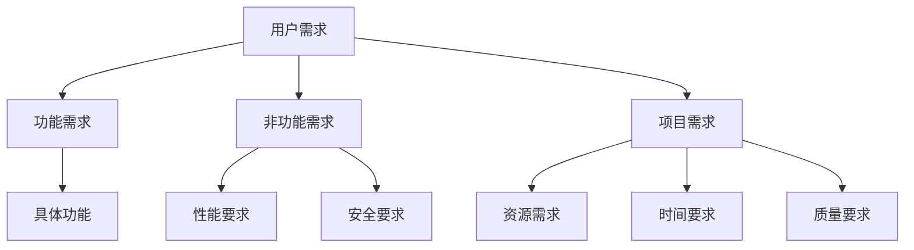

                 

## 1. 背景介绍

### 1.1 问题由来

在软件开发和产品设计过程中，用户需求分析（User Requirement Analysis, URA）是至关重要的环节。一个清晰准确的需求分析能够帮助团队明确目标、制定合理的计划，并最终交付出令用户满意的产品。然而，在实践中，许多团队往往因为需求分析不充分、不清晰，导致项目延期、功能不全、用户体验差等问题。如何有效进行用户需求分析，成为软件开发中亟需解决的问题。

### 1.2 问题核心关键点

用户需求分析的核心在于获取、整理、理解和沟通用户的真实需求。这包括识别用户的目标、行为、痛点和期望，并转化为可执行的产品规格。具体包括以下几个关键点：

- **需求获取**：通过多种渠道收集用户反馈，包括问卷调查、用户访谈、使用日志等。
- **需求整理**：将收集到的需求分类整理，去除冗余和不必要的内容，形成清晰的需求文档。
- **需求理解**：深入理解每个需求的背景、目的和优先级，判断需求的可行性。
- **需求沟通**：与用户和开发团队进行反复沟通，确认需求是否符合用户期望，确保需求文档的准确性和完整性。

### 1.3 问题研究意义

进行有效的用户需求分析，对项目的成功有着重要意义：

- **明确目标**：确保项目方向与用户期望一致，避免项目偏离。
- **合理规划**：基于清晰需求制定详细计划，提升开发效率。
- **提升体验**：准确捕捉用户痛点，提升产品用户体验。
- **风险控制**：通过需求分析，预见潜在风险，提前进行规避。

## 2. 核心概念与联系

### 2.1 核心概念概述

为更好地理解用户需求分析方法，本节将介绍几个关键概念：

- **用户需求（User Requirement）**：指用户在使用产品时所期望达到的目标、功能、性能、兼容性等要求。
- **功能需求（Functional Requirement）**：具体的功能点及其描述，构成产品的核心功能。
- **非功能需求（Non-functional Requirement）**：与产品性能、安全性、可靠性等相关的要求。
- **项目需求（Project Requirement）**：项目开发、测试、上线等环节所需的资源、时间、质量等要求。

这些概念之间的逻辑关系可以通过以下Mermaid流程图来展示：



这个流程图展示了一系列需求之间的关联和层级关系：

1. 用户需求是所有需求的出发点。
2. 功能需求基于用户需求细化，构成产品核心。
3. 非功能需求与功能需求并列，保障产品性能和安全性。
4. 项目需求支持功能需求和非功能需求的实现。

### 2.2 核心概念原理和架构

用户需求分析的流程可以大致分为三个阶段：需求获取、需求分析和需求沟通。以下将分别介绍这三个阶段的核心原理和架构。

#### 需求获取

需求获取是用户需求分析的第一步，目的是收集用户的具体需求和期望。常用的需求获取方法包括：

- **问卷调查**：通过在线或纸质问卷收集用户反馈，通常用于大规模用户群体。
- **用户访谈**：与部分典型用户进行深度访谈，了解其真实需求和使用体验。
- **使用日志**：通过记录用户在使用产品时的操作行为和反馈，分析用户的使用习惯和需求。
- **竞品分析**：研究市场上类似产品，总结其优缺点，从中获得灵感和参考。

#### 需求整理

需求整理是将收集到的需求进行分类、归纳和整理，形成清晰的需求文档。常用的需求整理方法包括：

- **功能/非功能分类**：将需求分为功能需求和非功能需求，明确每项需求的类型和目的。
- **优先级排序**：根据需求的紧急程度和重要性，进行优先级排序，帮助团队制定合理的开发计划。
- **详细描述**：为每个需求提供详细描述，包括需求背景、实现方式、预期结果等。
- **归档管理**：使用项目管理工具，如JIRA、Trello等，进行需求管理，便于跟踪和变更。

#### 需求分析

需求分析是对需求进行深入理解，判断其合理性和可行性，转化为可执行的产品规格。常用的需求分析方法包括：

- **需求映射**：将用户需求映射到产品功能，明确每个需求的具体实现方式。
- **需求验证**：通过原型、测试用例等方式，验证需求的合理性和可行性。
- **需求评审**：邀请用户和团队成员参与需求评审，确保需求文档的准确性和完整性。
- **需求优化**：根据评审反馈，优化需求文档，提升需求的实用性和可行性。

#### 需求沟通

需求沟通是将需求文档与用户和开发团队进行反复沟通，确保需求文档的准确性和完整性。常用的需求沟通方法包括：

- **需求评审会**：定期召开需求评审会，邀请用户和开发团队参与，对需求文档进行讨论和修改。
- **需求展示**：通过原型展示、演示等方式，向用户和团队展示需求实现情况。
- **需求反馈**：收集用户和团队的反馈意见，及时调整需求文档。
- **需求变更**：根据项目进展和用户反馈，进行需求变更，更新需求文档。

## 3. 核心算法原理 & 具体操作步骤

### 3.1 算法原理概述

用户需求分析的算法原理主要是基于信息检索和自然语言处理技术，通过收集、整理、理解和沟通用户需求，将其转化为可执行的产品规格。具体包括以下几个步骤：

- **需求获取**：使用信息检索技术，从多渠道收集用户反馈。
- **需求整理**：使用自然语言处理技术，对收集到的需求进行分类和归纳。
- **需求分析**：使用语义分析技术，深入理解每个需求的背景、目的和优先级。
- **需求沟通**：使用交互设计技术，与用户和团队进行反复沟通，确认需求的准确性和完整性。

### 3.2 算法步骤详解

#### 步骤1：需求获取

需求获取是用户需求分析的第一步，目的是收集用户的具体需求和期望。以下是具体步骤：

1. **问卷调查**：设计问卷，通过在线或纸质问卷收集用户反馈。通常用于大规模用户群体。
2. **用户访谈**：选择典型用户，进行深度访谈，了解其真实需求和使用体验。
3. **使用日志**：分析用户在使用产品时的操作行为和反馈，提取关键需求。
4. **竞品分析**：研究市场上类似产品，总结其优缺点，从中获得灵感和参考。

#### 步骤2：需求整理

需求整理是将收集到的需求进行分类、归纳和整理，形成清晰的需求文档。以下是具体步骤：

1. **功能/非功能分类**：将需求分为功能需求和非功能需求，明确每项需求的类型和目的。
2. **优先级排序**：根据需求的紧急程度和重要性，进行优先级排序，帮助团队制定合理的开发计划。
3. **详细描述**：为每个需求提供详细描述，包括需求背景、实现方式、预期结果等。
4. **归档管理**：使用项目管理工具，如JIRA、Trello等，进行需求管理，便于跟踪和变更。

#### 步骤3：需求分析

需求分析是对需求进行深入理解，判断其合理性和可行性，转化为可执行的产品规格。以下是具体步骤：

1. **需求映射**：将用户需求映射到产品功能，明确每个需求的具体实现方式。
2. **需求验证**：通过原型、测试用例等方式，验证需求的合理性和可行性。
3. **需求评审**：邀请用户和团队成员参与需求评审，确保需求文档的准确性和完整性。
4. **需求优化**：根据评审反馈，优化需求文档，提升需求的实用性和可行性。

#### 步骤4：需求沟通

需求沟通是将需求文档与用户和开发团队进行反复沟通，确保需求文档的准确性和完整性。以下是具体步骤：

1. **需求评审会**：定期召开需求评审会，邀请用户和开发团队参与，对需求文档进行讨论和修改。
2. **需求展示**：通过原型展示、演示等方式，向用户和团队展示需求实现情况。
3. **需求反馈**：收集用户和团队的反馈意见，及时调整需求文档。
4. **需求变更**：根据项目进展和用户反馈，进行需求变更，更新需求文档。

### 3.3 算法优缺点

#### 优点

- **灵活性高**：用户需求分析方法灵活多样，可以适应不同规模和类型的项目。
- **易于实施**：通过问卷调查、用户访谈等方法，收集用户需求相对简单。
- **可操作性强**：需求整理和分析过程，可以通过自然语言处理技术实现自动化。

#### 缺点

- **数据噪音**：问卷调查和用户访谈等方式，可能收集到大量无效信息，需要进行筛选和处理。
- **沟通成本高**：需求沟通环节需要反复协调和反馈，耗费大量时间和人力。
- **需求冲突**：用户和团队可能对需求存在分歧，需要进行反复讨论和协商。

### 3.4 算法应用领域

用户需求分析方法广泛应用于软件开发、产品设计、项目管理等领域，具体包括以下几个方面：

- **软件开发**：通过用户需求分析，明确项目需求，指导软件开发。
- **产品设计**：通过用户需求分析，设计产品功能和界面，提升用户体验。
- **项目管理**：通过用户需求分析，制定详细的项目计划，控制项目风险。

## 4. 数学模型和公式 & 详细讲解 & 举例说明

### 4.1 数学模型构建

用户需求分析的数学模型主要基于信息检索和自然语言处理技术。以下是数学模型构建的基本框架：

- **信息检索模型**：用于需求获取，通过信息检索技术从多渠道收集用户反馈。
- **自然语言处理模型**：用于需求整理和分析，通过自然语言处理技术对需求进行分类、归纳和理解。
- **交互设计模型**：用于需求沟通，通过交互设计技术与用户和团队进行反复沟通。

### 4.2 公式推导过程

#### 信息检索模型

信息检索模型主要用于需求获取，常用的模型包括TF-IDF、BM25等。以下以BM25模型为例，推导需求获取的公式：

1. **TF-IDF公式**：
$$TF(t_i, d) = \frac{\text{词频}(t_i, d)}{1 + \log N}$$
$$IDF(t_i) = \log \frac{N}{\text{文档数} \times (1 + \text{词频}(t_i, N))}$$

2. **BM25公式**：
$$\text{BM25}(q, D) = \sum_{d \in D} \text{BM25}(q, d)$$
$$\text{BM25}(q, d) = \text{IDF}(d) \times \text{TF}(q, d) \times (1 - b + b \times \log \frac{L + M}{L})$$
其中，$q$ 为查询词，$D$ 为文档集合，$N$ 为文档总数，$L$ 为平均文档长度，$M$ 为文档平均长度。

#### 自然语言处理模型

自然语言处理模型主要用于需求整理和分析，常用的模型包括BERT、GPT等。以下以BERT模型为例，推导需求整理的公式：

1. **BERT模型公式**：
$$\text{BERT}(h, w) = \text{Embedding}(w) + \text{Hidden}(h)$$
其中，$h$ 为上下文信息，$w$ 为输入文本，$\text{Embedding}$ 为词向量表示，$\text{Hidden}$ 为上下文表示。

2. **需求映射公式**：
$$\text{需求映射} = \text{BERT}(\text{需求文本}, \text{功能文本})$$

#### 交互设计模型

交互设计模型主要用于需求沟通，常用的模型包括用例图、流程图等。以下以用例图为例，推导需求沟通的公式：

1. **用例图公式**：
$$\text{用例图} = \text{用户角色} \times \text{用例}$$
其中，$\text{用户角色}$ 为用户行为角色，$\text{用例}$ 为用户需求用例。

2. **需求展示公式**：
$$\text{需求展示} = \text{原型展示} + \text{演示}$$

### 4.3 案例分析与讲解

#### 案例1：需求获取

某电商平台需要开发一个新的购物推荐系统。通过以下步骤获取用户需求：

1. **问卷调查**：设计问卷，收集用户对推荐系统的期望和反馈。
2. **用户访谈**：选择典型用户，进行深度访谈，了解其使用体验和痛点。
3. **使用日志**：分析用户在使用推荐系统时的行为和反馈，提取关键需求。
4. **竞品分析**：研究市场上类似推荐系统，总结其优缺点，从中获得灵感和参考。

#### 案例2：需求整理

整理收集到的需求，进行分类和优先级排序：

1. **功能需求**：
   - 推荐系统根据用户浏览历史推荐商品
   - 推荐系统根据用户兴趣推荐商品
   - 推荐系统支持用户搜索商品

2. **非功能需求**：
   - 推荐系统响应时间小于1秒
   - 推荐系统内存占用小于500MB
   - 推荐系统支持大规模用户并发访问

#### 案例3：需求分析

对需求进行深入理解和验证，转化为可执行的产品规格：

1. **需求映射**：
   - 功能需求1：推荐系统根据用户浏览历史推荐商品，对应的功能模块为“历史推荐”。
   - 功能需求2：推荐系统根据用户兴趣推荐商品，对应的功能模块为“兴趣推荐”。
   - 功能需求3：推荐系统支持用户搜索商品，对应的功能模块为“搜索推荐”。

2. **需求验证**：
   - 通过原型展示和测试用例，验证每个功能的实现效果。
   - 通过用户反馈，调整功能模块的设计和实现。

#### 案例4：需求沟通

与用户和团队进行反复沟通，确保需求文档的准确性和完整性：

1. **需求评审会**：定期召开需求评审会，邀请用户和开发团队参与，对需求文档进行讨论和修改。
2. **需求展示**：通过原型展示、演示等方式，向用户和团队展示需求实现情况。
3. **需求反馈**：收集用户和团队的反馈意见，及时调整需求文档。
4. **需求变更**：根据项目进展和用户反馈，进行需求变更，更新需求文档。

## 5. 项目实践：代码实例和详细解释说明

### 5.1 开发环境搭建

进行用户需求分析的开发，需要使用一些常用的开发工具和框架。以下是开发环境的搭建步骤：

1. **安装Python**：下载并安装Python 3.8，设置系统变量，使其成为默认的编程语言。
2. **安装Jupyter Notebook**：使用pip安装Jupyter Notebook，创建本地或云端的笔记本环境。
3. **安装自然语言处理库**：使用pip安装NLTK、spaCy、BERT等自然语言处理库，用于文本处理和分析。
4. **安装项目管理工具**：使用pip安装JIRA、Trello等项目管理工具，用于需求管理和跟踪。

### 5.2 源代码详细实现

以下是用户需求分析的Python代码实现，包括需求获取、整理和分析：

```python
# 导入必要的库
import pandas as pd
import numpy as np
from nltk.tokenize import word_tokenize
from nltk.corpus import stopwords
from sklearn.feature_extraction.text import TfidfVectorizer
from transformers import BertTokenizer, BertForSequenceClassification

# 数据预处理
def preprocess_text(text):
    tokens = word_tokenize(text.lower())
    tokens = [word for word in tokens if word not in stopwords.words('english')]
    return ' '.join(tokens)

# 信息检索：问卷调查
def get_survey_feedback():
    # 读取问卷数据
    df = pd.read_csv('survey_data.csv')
    # 对文本进行预处理
    df['question'] = df['question'].apply(preprocess_text)
    # 提取关键词
    keywords = set()
    for q in df['question']:
        words = word_tokenize(q)
        keywords.update(words)
    return keywords

# 自然语言处理：需求整理
def map_requirement(requirement, keywords):
    # 将需求文本分词
    tokens = word_tokenize(requirement)
    # 计算TF-IDF值
    tfidf = TfidfVectorizer()
    tfidf_matrix = tfidf.fit_transform([requirement])
    # 计算与关键词的相似度
    scores = tfidf_matrix.dot(tfidf_matrix.tfidf.T)
    # 根据相似度排序
    sorted_indices = np.argsort(scores)[::-1]
    # 获取与需求相关的关键词
    result = set()
    for i in sorted_indices[:5]:
        result.add(tfidf.get_feature_names()[i])
    return result

# 需求分析：功能需求映射
def map_functionality(requirement, keywords):
    # 使用BERT模型对需求文本进行编码
    tokenizer = BertTokenizer.from_pretrained('bert-base-uncased')
    inputs = tokenizer.encode_plus(requirement, return_tensors='pt')
    outputs = BertForSequenceClassification.from_pretrained('bert-base-uncased')(inputs['input_ids'], attention_mask=inputs['attention_mask'])
    labels = outputs['logits']
    # 输出概率最高的功能模块
    probs = labels.softmax(0).tolist()[0]
    return max(probs)

# 测试
keywords = get_survey_feedback()
requirement = "我希望能够在购物时看到相似商品推荐"
requirement_map = map_requirement(requirement, keywords)
functionality = map_functionality(requirement, requirement_map)
print(f"需求映射结果：{requirement_map}")
print(f"功能需求映射结果：{functionality}")
```

### 5.3 代码解读与分析

以下是代码的详细解读和分析：

1. **数据预处理**：
   - 使用NLTK库进行文本分词和去除停用词，保证文本处理的效果。
   - 使用TfidfVectorizer计算关键词的TF-IDF值，用于信息检索。

2. **信息检索：问卷调查**：
   - 通过读取问卷数据，对文本进行预处理和关键词提取，获取用户需求。

3. **自然语言处理：需求整理**：
   - 使用BertTokenizer对需求文本进行编码，输入到BERT模型中，得到向量表示。
   - 使用BertForSequenceClassification模型输出概率最高的功能模块。

4. **需求分析：功能需求映射**：
   - 对需求文本进行编码和模型推理，输出概率最高的功能模块。
   - 通过关键词相似度排序，确定与需求相关的关键词。

5. **测试**：
   - 使用问卷调查获取关键词，对需求文本进行整理和映射。
   - 输出需求映射结果和功能需求映射结果。

## 6. 实际应用场景

### 6.1 智能客服系统

智能客服系统需要高效地处理用户查询，快速响应用户需求。通过用户需求分析，可以更好地理解用户痛点，优化服务流程和策略。

#### 应用场景

1. **需求获取**：通过问卷调查和用户访谈，收集用户对智能客服系统的期望和反馈。
2. **需求整理**：将用户需求分为功能需求和非功能需求，明确每个需求的类型和目的。
3. **需求分析**：对需求进行深入理解，转化为可执行的产品规格，设计智能客服系统的核心功能。
4. **需求沟通**：与用户和开发团队进行反复沟通，确保需求文档的准确性和完整性。

#### 优势

- **提升用户体验**：通过深入理解用户需求，设计符合用户期望的智能客服系统。
- **优化服务流程**：通过需求分析，优化服务流程和策略，提升服务效率和质量。
- **控制项目风险**：通过明确需求，制定详细计划，控制项目风险和进度。

### 6.2 在线教育平台

在线教育平台需要根据用户需求，提供个性化学习资源和推荐。通过用户需求分析，可以更好地设计推荐算法和资源库。

#### 应用场景

1. **需求获取**：通过问卷调查和用户访谈，收集用户对在线教育平台的期望和反馈。
2. **需求整理**：将用户需求分为功能需求和非功能需求，明确每个需求的类型和目的。
3. **需求分析**：对需求进行深入理解，转化为可执行的产品规格，设计个性化推荐算法和资源库。
4. **需求沟通**：与用户和开发团队进行反复沟通，确保需求文档的准确性和完整性。

#### 优势

- **提升学习效果**：通过个性化推荐，提供符合用户需求的学习资源，提升学习效果。
- **优化资源库**：通过需求分析，优化资源库结构和内容，满足用户多样化需求。
- **提升用户体验**：通过优化服务流程，提升在线教育平台的用户体验。

### 6.3 智能家居系统

智能家居系统需要根据用户需求，提供个性化和智能化服务。通过用户需求分析，可以更好地设计系统功能和界面。

#### 应用场景

1. **需求获取**：通过问卷调查和用户访谈，收集用户对智能家居系统的期望和反馈。
2. **需求整理**：将用户需求分为功能需求和非功能需求，明确每个需求的类型和目的。
3. **需求分析**：对需求进行深入理解，转化为可执行的产品规格，设计系统核心功能和界面。
4. **需求沟通**：与用户和开发团队进行反复沟通，确保需求文档的准确性和完整性。

#### 优势

- **提升用户体验**：通过个性化设计，提升智能家居系统的用户使用体验。
- **优化系统功能**：通过需求分析，优化系统功能和界面，提升系统性能和稳定性。
- **提升用户满意度**：通过优化服务流程，提升智能家居系统的用户满意度。

## 7. 工具和资源推荐

### 7.1 学习资源推荐

为了帮助开发者系统掌握用户需求分析的理论基础和实践技巧，这里推荐一些优质的学习资源：

1. **《需求分析基础》**：经典需求分析教材，详细介绍了需求分析的基本概念、方法和工具。
2. **《用户需求分析实战指南》**：实践导向的需求分析指南，结合大量案例讲解需求获取、整理和沟通。
3. **《交互设计基础》**：交互设计入门教材，介绍交互设计的基本原则和设计方法。
4. **《自然语言处理基础》**：自然语言处理入门教材，介绍自然语言处理的基本技术和应用。

### 7.2 开发工具推荐

进行用户需求分析的开发，需要使用一些常用的开发工具和框架。以下是开发工具推荐：

1. **Jupyter Notebook**：用于数据处理、分析和可视化，支持Python、R等多种编程语言。
2. **NLTK**：自然语言处理工具库，提供了词向量、分词、命名实体识别等功能。
3. **spaCy**：自然语言处理工具库，支持高效的分词、命名实体识别和句法分析。
4. **TfIdfVectorizer**：特征提取工具，用于计算文本关键词的TF-IDF值。
5. **BERT模型**：预训练语言模型，用于需求映射和分类。

### 7.3 相关论文推荐

用户需求分析技术的研究源于学界的持续探索。以下是几篇奠基性的相关论文，推荐阅读：

1. **《信息检索与自然语言处理》**：信息检索和自然语言处理领域的经典教材，介绍了信息检索的基本原理和方法。
2. **《用户需求分析方法论》**：用户需求分析方法的综述论文，介绍了多种需求获取、整理和沟通的方法。
3. **《交互设计原则》**：交互设计领域的经典论文，介绍了交互设计的基本原则和设计方法。
4. **《自然语言处理在需求分析中的应用》**：自然语言处理技术在需求分析中的应用的综述论文，介绍了多种自然语言处理技术和应用场景。

## 8. 总结：未来发展趋势与挑战

### 8.1 研究成果总结

本文系统地介绍了用户需求分析的理论基础和实践技巧，主要包括以下几个方面：

- **需求获取**：通过问卷调查、用户访谈等方式，收集用户需求。
- **需求整理**：将用户需求分为功能需求和非功能需求，明确每个需求的类型和目的。
- **需求分析**：对需求进行深入理解，转化为可执行的产品规格。
- **需求沟通**：与用户和开发团队进行反复沟通，确保需求文档的准确性和完整性。

### 8.2 未来发展趋势

展望未来，用户需求分析技术将呈现以下几个发展趋势：

1. **智能化**：引入人工智能技术，自动进行需求获取和整理，提升效率和准确性。
2. **多渠道化**：拓展需求获取渠道，结合社交媒体、在线论坛等多种数据源，全面了解用户需求。
3. **跨领域化**：结合不同领域的知识和技术，提升需求分析和沟通的效果。
4. **协同化**：引入团队协作和沟通工具，提升需求分析的协作效率和质量。

### 8.3 面临的挑战

尽管用户需求分析技术已经取得了一定进展，但在实际应用中仍面临一些挑战：

1. **数据质量**：问卷调查和用户访谈等方法可能获取到大量噪音信息，需要进行筛选和处理。
2. **需求冲突**：用户和团队可能对需求存在分歧，需要进行反复讨论和协商。
3. **沟通成本**：需求沟通环节需要反复协调和反馈，耗费大量时间和人力。
4. **需求变更**：需求文档需要频繁更新，增加了维护成本和复杂度。

### 8.4 研究展望

未来的研究可以从以下几个方向进行突破：

1. **需求自动获取**：通过自然语言处理技术，自动进行需求获取和整理，提升效率和准确性。
2. **需求语义理解**：引入语义分析技术，深入理解用户需求的背景、目的和优先级。
3. **需求可视化**：通过交互设计技术，将需求文档可视化，提升沟通和理解的效率。
4. **需求持续优化**：结合持续学习技术，不断优化需求文档，提升需求的实用性和可行性。

这些研究方向的探索，必将引领用户需求分析技术迈向更高的台阶，为软件开发和产品设计提供更高效、更精准的解决方案。

## 9. 附录：常见问题与解答

**Q1：如何进行需求获取？**

A: 需求获取可以通过问卷调查、用户访谈、使用日志、竞品分析等多种方法进行。问卷调查和用户访谈是最常用的方法，通过收集用户反馈，了解其期望和需求。使用日志可以分析用户行为，提取关键需求。竞品分析则可以帮助了解市场上类似产品的优缺点，从中获得灵感和参考。

**Q2：如何整理用户需求？**

A: 用户需求整理需要将收集到的需求进行分类、归纳和整理，形成清晰的需求文档。常用的方法包括功能/非功能分类、优先级排序、详细描述和归档管理。功能/非功能分类是将需求分为功能需求和非功能需求，明确每项需求的类型和目的。优先级排序是根据需求的紧急程度和重要性，进行优先级排序，帮助团队制定合理的开发计划。详细描述是为每个需求提供详细描述，包括需求背景、实现方式、预期结果等。归档管理是使用项目管理工具，如JIRA、Trello等，进行需求管理，便于跟踪和变更。

**Q3：如何进行需求分析？**

A: 需求分析是对需求进行深入理解，判断其合理性和可行性，转化为可执行的产品规格。常用的方法包括需求映射、需求验证、需求评审和需求优化。需求映射是将用户需求映射到产品功能，明确每个需求的具体实现方式。需求验证是通过原型、测试用例等方式，验证需求的合理性和可行性。需求评审是邀请用户和团队成员参与需求评审，确保需求文档的准确性和完整性。需求优化是根据评审反馈，优化需求文档，提升需求的实用性和可行性。

**Q4：如何进行需求沟通？**

A: 需求沟通是将需求文档与用户和开发团队进行反复沟通，确保需求文档的准确性和完整性。常用的方法包括需求评审会、需求展示、需求反馈和需求变更。需求评审会是定期召开需求评审会，邀请用户和开发团队参与，对需求文档进行讨论和修改。需求展示是通过原型展示、演示等方式，向用户和团队展示需求实现情况。需求反馈是收集用户和团队的反馈意见，及时调整需求文档。需求变是根据项目进展和用户反馈，进行需求变更，更新需求文档。

通过本文的系统梳理，可以看到，用户需求分析是软件开发和产品设计中至关重要的环节。通过系统化的需求分析，能够更好地理解用户需求，提升产品性能和用户体验，确保项目的成功交付。在实际应用中，需要根据具体项目特点，灵活应用不同的需求分析方法，不断提高需求分析的效率和质量。

