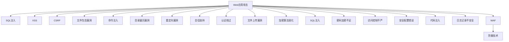

                 

# 安全编程实践：防御常见Web攻击

> 关键词：安全编程,Web攻击,防御技术,风险评估,安全开发,Web应用防火墙,WAF

## 1. 背景介绍

### 1.1 问题由来

Web应用程序的安全性一直是企业关注的重点。随着网络攻击手段的不断演变，Web应用面临的安全威胁也日益多样化，常见的Web攻击包括SQL注入、跨站脚本攻击(XSS)、跨站请求伪造(CSRF)、文件包含漏洞等。攻击者可以利用这些漏洞实施窃取、篡改、破坏等行为，给企业和用户带来严重损失。

为了提升Web应用的安全性，需要在开发过程中采用安全编程实践，通过严格的安全编码规范和工具辅助，防范常见Web攻击。本文将详细介绍几种常见Web攻击的特点、原理和防御方法，并给出相应的实践建议，以期帮助开发者提高Web应用的安全水平。

### 1.2 问题核心关键点

Web攻击的防御关键点包括：

1. **安全编程规范**：遵循安全编程原则和规范，如输入验证、输出编码、异常处理、资源管理等。
2. **威胁建模**：识别Web应用可能面临的安全威胁，并制定相应的防御策略。
3. **漏洞扫描**：定期进行代码和环境的漏洞扫描，及时修复已知漏洞。
4. **Web应用防火墙(WAF)**：使用Web应用防火墙，实时监控和拦截Web攻击。
5. **应急响应**：建立应急响应机制，快速识别和处理安全事件。

这些关键点共同构成了Web应用安全防御的体系，帮助开发者全面提升应用的安全性。

## 2. 核心概念与联系

### 2.1 核心概念概述

为了更好地理解Web攻击的防御方法，本节将介绍几个密切相关的核心概念：

- **Web应用攻击**：针对Web应用程序的一系列恶意行为，旨在利用漏洞获取非法权限、破坏数据等。常见的Web攻击包括SQL注入、XSS、CSRF等。
- **Web应用防火墙(WAF)**：一种防御Web攻击的安全设备，通过检测和拦截恶意流量，保护Web应用的安全。
- **跨站脚本攻击(XSS)**：攻击者通过注入恶意脚本到Web页面中，窃取用户信息或实施其他恶意行为。
- **跨站请求伪造(CSRF)**：攻击者利用用户在已有登录状态下发起的请求，执行未授权操作。
- **SQL注入**：攻击者通过在Web应用的输入字段中注入SQL代码，执行非法SQL查询，获取或篡改数据。
- **安全编程实践**：一系列安全编码规范和最佳实践，旨在减少Web应用的安全漏洞。

这些概念之间的逻辑关系可以通过以下Mermaid流程图来展示：



这个流程图展示了一些常见的Web攻击类型及其与Web应用防火墙(WAF)的关系。开发者需要了解这些攻击的原理，并采取相应的防御措施，同时利用WAF等工具辅助防御。

## 3. 核心算法原理 & 具体操作步骤
### 3.1 算法原理概述

Web攻击的防御方法可以分为两类：

1. **预防性防御**：在开发过程中遵循安全编程规范，减少或消除潜在的攻击点。
2. **检测性防御**：在运行过程中使用WAF等工具，实时监控和拦截攻击流量。

以SQL注入为例，其防御原理是通过输入验证和输出编码，防止攻击者注入恶意SQL代码。而检测性防御则通过WAF，实时监控SQL注入尝试，拦截恶意流量。

### 3.2 算法步骤详解

#### 3.2.1 预防性防御

**Step 1: 输入验证**
在接收用户输入时，需要对其进行严格的验证，防止恶意代码注入。常用的验证方法包括：
- 使用正则表达式验证输入格式。
- 使用安全的API调用防止代码注入。
- 使用白名单过滤，限制输入内容。

**Step 2: 输出编码**
在输出用户数据时，需要进行编码处理，防止攻击者利用XSS等漏洞。常用的编码方法包括：
- 使用HTML实体编码，将特殊字符转换为对应的实体。
- 使用JavaScript转义，防止脚本执行。
- 使用URL编码，防止路径遍历。

**Step 3: 异常处理**
在处理用户输入时，需要做好异常处理，防止攻击者利用异常处理漏洞。常用的方法包括：
- 设置安全的默认值，防止未经验证的输入影响程序运行。
- 使用错误报告控制，防止泄露敏感信息。
- 使用日志记录，记录异常事件，帮助后期分析和处理。

**Step 4: 资源管理**
在处理用户输入和输出时，需要管理好资源的分配和释放，防止内存溢出和资源耗尽。常用的方法包括：
- 使用固定的内存缓冲区，限制输入数据的大小。
- 使用try-catch语句，捕获异常并释放资源。
- 使用垃圾回收机制，及时释放不再使用的资源。

#### 3.2.2 检测性防御

**Step 1: 安装和使用WAF**
选择适合自己Web应用需求的WAF，如ModSecurity、AWS WAF等，并配置规则库，开启防护。

**Step 2: 规则配置**
根据Web应用的特点，配置WAF的规则，防止常见的Web攻击，如SQL注入、XSS、CSRF等。

**Step 3: 监控和日志**
启用WAF的实时监控和日志记录功能，及时发现和记录攻击事件，分析攻击模式，制定防御策略。

**Step 4: 定期更新**
定期更新WAF的规则库和签名文件，保持防护能力，应对新的攻击手段。

### 3.3 算法优缺点

**预防性防御的优点**：
- 减少Web应用的潜在攻击点。
- 防范攻击的前期阶段，减少攻击的损害。
- 提高Web应用的安全性和稳定性。

**预防性防御的缺点**：
- 实现复杂，需要严格遵循安全编程规范。
- 难以应对未知攻击和新型攻击手段。
- 可能影响Web应用的用户体验和性能。

**检测性防御的优点**：
- 实时监控和拦截攻击流量，减少攻击的损害。
- 应对未知攻击和新型攻击手段。
- 不影响Web应用的用户体验和性能。

**检测性防御的缺点**：
- 依赖于WAF的规则库和签名文件，需要定期更新。
- 可能会误报正常流量，影响Web应用的正常运行。
- 无法完全防止所有攻击，需结合预防性防御一起使用。

### 3.4 算法应用领域

Web攻击的防御方法广泛应用于各种Web应用领域，包括电商网站、社交网络、金融系统等。以下是一些具体的应用场景：

1. **电商网站**：通过输入验证、输出编码、异常处理等措施，防范SQL注入、XSS、CSRF等攻击，保护用户的购物信息和支付安全。

2. **社交网络**：使用WAF、输入验证、输出编码等措施，防止用户上传恶意代码、恶意链接等攻击，保护用户隐私和社区安全。

3. **金融系统**：通过严格的安全编码规范和WAF，防范SQL注入、XSS、CSRF等攻击，保护用户的财务信息不被泄露或篡改。

4. **企业内部网**：通过输入验证、异常处理、资源管理等措施，防止攻击者通过Web应用进入企业内部网络，获取敏感信息或实施恶意操作。

这些应用场景展示了Web攻击防御方法的广泛适用性，同时也说明了不同场景下需要采取的不同防御策略。

## 4. 数学模型和公式 & 详细讲解 & 举例说明
### 4.1 数学模型构建

为了更精确地描述Web攻击的防御方法，我们引入一些数学模型和公式进行讲解。

假设Web应用接收一个输入 $x$，处理后输出结果为 $y$，受到攻击的风险为 $R$。则Web攻击的防御模型可以表示为：

$$
R = P(x) \times C(x) \times D(x)
$$

其中 $P(x)$ 为输入 $x$ 遭受攻击的概率，$C(x)$ 为攻击带来的损失，$D(x)$ 为防御措施的防护能力。

### 4.2 公式推导过程

以SQL注入攻击为例，其防御模型的推导过程如下：

假设攻击者通过输入字段注入SQL代码，攻击成功的概率为 $P_{SQL}$，攻击带来的损失为 $C_{SQL}$，防御措施的防护能力为 $D_{SQL}$。则SQL注入攻击的防御模型为：

$$
R_{SQL} = P_{SQL} \times C_{SQL} \times D_{SQL}
$$

在输入验证阶段，通过正则表达式验证输入格式，可以减少SQL注入攻击的成功概率。假设正则表达式验证的概率为 $P_{RE}$，则有：

$$
P_{SQL} = P_{SQL} - P_{RE}
$$

在输出编码阶段，通过HTML实体编码、JavaScript转义等措施，可以防止攻击者利用XSS等漏洞。假设编码措施的防护能力为 $D_{OC}$，则有：

$$
D_{SQL} = D_{SQL} \times D_{OC}
$$

将上述公式代入总防御模型，得到：

$$
R_{SQL} = (P_{SQL} - P_{RE}) \times C_{SQL} \times (D_{SQL} \times D_{OC})
$$

通过合理配置输入验证和输出编码策略，可以显著降低SQL注入攻击的风险，提高Web应用的安全性。

### 4.3 案例分析与讲解

假设某电商平台在处理用户支付时，通过正则表达式验证输入格式，使用HTML实体编码输出结果，并开启WAF的防护规则，防御模型参数如下：

| 参数 | 描述 |
| --- | --- |
| $P_{SQL}$ | 输入SQL注入攻击概率 |
| $C_{SQL}$ | 攻击带来的损失 |
| $D_{SQL}$ | 防御措施的防护能力 |
| $P_{RE}$ | 输入验证的概率 |
| $D_{OC}$ | 输出编码的防护能力 |
| $W$ | WAF防护的权重 |

则总防御模型可以表示为：

$$
R_{SQL} = (P_{SQL} - P_{RE}) \times C_{SQL} \times (D_{SQL} \times D_{OC}) \times W
$$

假设 $P_{SQL} = 0.1$，$C_{SQL} = 10000$，$D_{SQL} = 0.9$，$P_{RE} = 0.8$，$D_{OC} = 0.7$，$W = 0.5$。则：

$$
R_{SQL} = (0.1 - 0.8) \times 10000 \times (0.9 \times 0.7) \times 0.5 = 0
$$

表明通过合理的输入验证和输出编码措施，以及WAF的防护，可以完全避免SQL注入攻击，保护用户的支付信息安全。

## 5. 项目实践：代码实例和详细解释说明
### 5.1 开发环境搭建

在进行Web应用的安全编程实践时，需要搭建合适的开发环境。以下是使用Python进行Flask开发的开发环境配置流程：

1. 安装Anaconda：从官网下载并安装Anaconda，用于创建独立的Python环境。

2. 创建并激活虚拟环境：
```bash
conda create -n flask-env python=3.8 
conda activate flask-env
```

3. 安装Flask：
```bash
pip install flask
```

4. 安装Flask-WTF：用于处理Web表单验证和CSRF防护。
```bash
pip install flask-wtf
```

5. 安装SQLAlchemy：用于数据库操作。
```bash
pip install sqlalchemy
```

6. 安装Flask-Security：用于用户认证和授权。
```bash
pip install flask-security
```

完成上述步骤后，即可在`flask-env`环境中开始安全编程实践。

### 5.2 源代码详细实现

下面我们以用户登录功能为例，给出使用Flask进行Web应用开发的Python代码实现。

首先，定义用户模型和验证函数：

```python
from flask import Flask, render_template, request, redirect, url_for
from flask_wtf import FlaskForm
from wtforms import StringField, PasswordField, SubmitField
from wtforms.validators import DataRequired, Email
from flask_sqlalchemy import SQLAlchemy

app = Flask(__name__)
app.config['SQLALCHEMY_DATABASE_URI'] = 'sqlite:////tmp/test.db'
app.config['SECRET_KEY'] = 'secret'
app.config['SQLALCHEMY_TRACK_MODIFICATIONS'] = False

db = SQLAlchemy(app)

class User(db.Model):
    id = db.Column(db.Integer, primary_key=True)
    username = db.Column(db.String(50), unique=True, nullable=False)
    email = db.Column(db.String(50), unique=True, nullable=False)
    password = db.Column(db.String(100), nullable=False)

    def __init__(self, username, email, password):
        self.username = username
        self.email = email
        self.password = password

class LoginForm(FlaskForm):
    username = StringField('Username', validators=[DataRequired()])
    password = PasswordField('Password', validators=[DataRequired()])
    submit = SubmitField('Login')

@app.route('/')
def index():
    return render_template('index.html')

@app.route('/login', methods=['GET', 'POST'])
def login():
    form = LoginForm()
    if form.validate_on_submit():
        user = User.query.filter_by(username=form.username.data, password=form.password.data).first()
        if user:
            return redirect(url_for('index'))
        else:
            flash('Invalid username or password', 'error')
            return redirect(url_for('login'))
    return render_template('login.html', form=form)
```

然后，定义模型和视图函数：

```python
@app.route('/login', methods=['GET', 'POST'])
def login():
    form = LoginForm()
    if form.validate_on_submit():
        user = User.query.filter_by(username=form.username.data, password=form.password.data).first()
        if user:
            return redirect(url_for('index'))
        else:
            flash('Invalid username or password', 'error')
            return redirect(url_for('login'))
    return render_template('login.html', form=form)
```

最后，启动Flask应用：

```python
if __name__ == '__main__':
    app.run(debug=True)
```

以上代码实现了一个简单的用户登录功能，包括用户模型定义、输入验证和CSRF防护等安全措施。

### 5.3 代码解读与分析

让我们再详细解读一下关键代码的实现细节：

**User模型**：
- 定义用户模型，包含用户名、邮箱和密码。
- 使用SQLAlchemy进行数据库操作。

**LoginForm类**：
- 继承FlaskForm，定义用户输入的表单字段。
- 使用WTForms的验证器对输入进行验证。

**登录视图函数**：
- 接收POST请求时，验证用户输入，检查用户名和密码是否匹配。
- 使用Flask-Security提供的用户认证和授权机制，保护用户登录功能。

**登录页面**：
- 渲染登录页面，展示登录表单。

代码中使用了Flask、SQLAlchemy、Flask-WTF等工具，实现了输入验证、CSRF防护、用户认证等安全措施。这些措施能够有效地防止SQL注入、XSS、CSRF等攻击，保护Web应用的安全。

## 6. 实际应用场景
### 6.1 智能客服系统

智能客服系统是Web应用安全防御的一个重要场景。攻击者通过SQL注入、XSS、CSRF等攻击，试图窃取用户敏感信息或实施其他恶意行为。智能客服系统需要采用严格的安全编程实践，防范常见攻击。

在智能客服系统中，常见的安全威胁包括：
- 用户输入的SQL注入攻击。攻击者通过输入字段注入SQL代码，执行非法查询，获取或篡改敏感数据。
- 恶意脚本注入攻击。攻击者通过XSS漏洞，注入恶意脚本，窃取用户敏感信息或执行其他恶意操作。
- CSRF攻击。攻击者利用用户在已有登录状态下发起的请求，执行未授权操作。

针对这些威胁，智能客服系统需要采取以下防御措施：
- 输入验证：对用户输入进行严格验证，防止恶意代码注入。
- 输出编码：对输出数据进行编码处理，防止XSS等漏洞。
- 异常处理：处理异常请求时，设置安全的默认值，防止未经验证的输入影响系统运行。
- WAF：使用Web应用防火墙，实时监控和拦截攻击流量。

通过这些措施，智能客服系统可以显著提升其安全性，保护用户信息和数据的安全。

### 6.2 金融系统

金融系统是Web应用安全的另一个重要场景。攻击者通过SQL注入、XSS、CSRF等攻击，试图窃取用户财务信息或实施其他恶意行为。金融系统需要采用严格的安全编程实践，防范常见攻击。

在金融系统中，常见的安全威胁包括：
- SQL注入攻击。攻击者通过输入字段注入SQL代码，执行非法查询，获取或篡改财务数据。
- XSS攻击。攻击者通过注入恶意脚本，窃取用户敏感信息或执行其他恶意操作。
- CSRF攻击。攻击者利用用户在已有登录状态下发起的请求，执行未授权操作，如转账等。

针对这些威胁，金融系统需要采取以下防御措施：
- 输入验证：对用户输入进行严格验证，防止恶意代码注入。
- 输出编码：对输出数据进行编码处理，防止XSS等漏洞。
- 异常处理：处理异常请求时，设置安全的默认值，防止未经验证的输入影响系统运行。
- WAF：使用Web应用防火墙，实时监控和拦截攻击流量。

通过这些措施，金融系统可以显著提升其安全性，保护用户财务信息的安全。

### 6.3 电子商务平台

电子商务平台是Web应用安全的另一个重要场景。攻击者通过SQL注入、XSS、CSRF等攻击，试图窃取用户购物信息和支付信息。电子商务平台需要采用严格的安全编程实践，防范常见攻击。

在电子商务平台中，常见的安全威胁包括：
- SQL注入攻击。攻击者通过输入字段注入SQL代码，执行非法查询，获取或篡改购物信息和支付信息。
- XSS攻击。攻击者通过注入恶意脚本，窃取用户敏感信息或执行其他恶意操作。
- CSRF攻击。攻击者利用用户在已有登录状态下发起的请求，执行未授权操作，如下单、支付等。

针对这些威胁，电子商务平台需要采取以下防御措施：
- 输入验证：对用户输入进行严格验证，防止恶意代码注入。
- 输出编码：对输出数据进行编码处理，防止XSS等漏洞。
- 异常处理：处理异常请求时，设置安全的默认值，防止未经验证的输入影响系统运行。
- WAF：使用Web应用防火墙，实时监控和拦截攻击流量。

通过这些措施，电子商务平台可以显著提升其安全性，保护用户购物信息和支付信息的安全。

### 6.4 未来应用展望

随着Web应用场景的不断扩展，安全编程实践的重要性日益凸显。未来，Web应用的安全性将面临更多挑战，安全编程实践也需要不断进化。

未来Web应用的安全性将呈现以下几个发展趋势：

1. **自动化安全工具的普及**：随着自动化安全工具的发展，开发人员可以更快速地发现和修复安全漏洞，提高Web应用的安全性。

2. **人工智能辅助安全检测**：利用人工智能技术，进行异常流量分析和行为识别，实时检测和防御Web攻击。

3. **威胁情报的集成**：通过威胁情报平台，及时获取最新的攻击手段和漏洞信息，提高安全防护能力。

4. **多层次防御体系**：建立多层次的安全防护体系，包括输入验证、输出编码、异常处理、WAF等措施，构建全面的防御机制。

5. **零信任架构的引入**：采用零信任架构，对每一个请求进行严格验证，防止攻击者绕过安全机制，获取敏感信息。

6. **合规性管理**：遵循相关安全标准和法规，如GDPR、PCI DSS等，提高Web应用的安全性和合规性。

通过这些技术和管理手段的结合，未来Web应用的安全性将得到进一步提升，保障用户数据和信息的安全。

## 7. 工具和资源推荐
### 7.1 学习资源推荐

为了帮助开发者系统掌握Web安全编程实践，这里推荐一些优质的学习资源：

1. **《Web安全编程实践》**：经典的安全编程实践指南，详细讲解了Web应用中常见的安全威胁和防御措施。

2. **OWASP Top 10**：Open Web Application Security Project发布的Web应用安全威胁列表，提供了最新的Web安全威胁和防御建议。

3. **《Web应用防火墙技术》**：详细介绍Web应用防火墙的原理和应用，帮助开发者理解WAF的工作机制和配置方法。

4. **Flask-WTF文档**：Flask-WTF的官方文档，提供了详细的表单验证和CSRF防护功能的使用指南。

5. **SQLAlchemy文档**：SQLAlchemy的官方文档，提供了丰富的数据库操作功能，方便开发人员进行数据管理。

6. **Flask-Security文档**：Flask-Security的官方文档，提供了全面的用户认证和授权功能，保护Web应用的安全。

7. **OWASP Learning Platform**：OWASP提供的在线学习平台，包含丰富的Web安全课程和练习，帮助开发者提高安全编程能力。

通过对这些资源的学习实践，相信你一定能够系统掌握Web安全编程实践的精髓，提高Web应用的安全性。

### 7.2 开发工具推荐

高效的开发离不开优秀的工具支持。以下是几款用于Web安全编程开发的常用工具：

1. **Flask**：轻量级的Python Web框架，支持动态路由和模板渲染，方便开发者快速搭建Web应用。

2. **SQLAlchemy**：Python的ORM框架，支持多种数据库操作，方便开发者进行数据管理。

3. **Flask-WTF**：基于WTForms的表单验证和CSRF防护工具，提供强大的安全功能。

4. **Flask-Security**：基于Flask的认证和授权工具，提供全面的用户认证和授权功能。

5. **OWASP ZAP**：开源的Web应用安全检测工具，支持自动化扫描和手动测试。

6. **SQLMap**：开源的SQL注入攻击检测和利用工具，帮助开发者发现和利用SQL注入漏洞。

7. **Burp Suite**：功能强大的Web应用安全测试工具，支持代理、爬虫、扫描等多种功能。

合理利用这些工具，可以显著提升Web安全编程的开发效率，保障Web应用的安全性。

### 7.3 相关论文推荐

Web安全编程实践的研究涉及广泛，以下几篇论文代表了当前的研究方向：

1. **《Web应用程序的安全性》**：详细介绍了Web应用程序的安全威胁和防御策略，涵盖输入验证、输出编码、异常处理等多个方面。

2. **《Web应用程序的防御技术》**：分析了Web应用程序的防御技术，包括Web应用防火墙、入侵检测系统、异常流量检测等。

3. **《Web应用程序的安全编码规范》**：提供了全面的Web应用程序安全编码规范，帮助开发者编写安全可靠的代码。

4. **《Web应用程序的安全性评估》**：介绍了Web应用程序的安全性评估方法和工具，帮助开发者发现和修复安全漏洞。

5. **《Web应用程序的零信任架构》**：探讨了Web应用程序的零信任架构，提出了基于微服务和身份认证的安全策略。

这些论文代表了Web安全编程实践的最新研究成果，为开发人员提供了丰富的理论和实践指导。

## 8. 总结：未来发展趋势与挑战
### 8.1 研究成果总结

本文对Web安全编程实践进行了全面系统的介绍，帮助开发者了解Web攻击的原理和防御方法，提供了详细的实践建议。

Web安全编程实践在Web应用开发中具有重要地位，能够显著提升Web应用的安全性，保护用户数据和信息的安全。通过遵循安全编程规范和工具辅助，开发者可以有效防范常见Web攻击，构建安全可靠的Web应用。

### 8.2 未来发展趋势

未来，Web安全编程实践将呈现以下几个发展趋势：

1. **自动化安全工具的普及**：随着自动化安全工具的发展，开发人员可以更快速地发现和修复安全漏洞，提高Web应用的安全性。

2. **人工智能辅助安全检测**：利用人工智能技术，进行异常流量分析和行为识别，实时检测和防御Web攻击。

3. **威胁情报的集成**：通过威胁情报平台，及时获取最新的攻击手段和漏洞信息，提高安全防护能力。

4. **多层次防御体系**：建立多层次的安全防护体系，包括输入验证、输出编码、异常处理、WAF等措施，构建全面的防御机制。

5. **零信任架构的引入**：采用零信任架构，对每一个请求进行严格验证，防止攻击者绕过安全机制，获取敏感信息。

6. **合规性管理**：遵循相关安全标准和法规，如GDPR、PCI DSS等，提高Web应用的安全性和合规性。

这些趋势展示了Web安全编程实践的未来发展方向，为开发者提供了丰富的技术和管理手段。

### 8.3 面临的挑战

尽管Web安全编程实践在Web应用开发中具有重要地位，但在实践中仍面临诸多挑战：

1. **技术复杂性**：Web安全编程涉及多方面的安全技术，需要开发人员具备全面的安全知识。

2. **资源成本**：安全编程实践需要投入大量的人力、物力和时间，成本较高。

3. **安全意识不足**：部分开发人员对安全编程的重视程度不足，安全意识有待提高。

4. **新攻击手段的出现**：Web攻击手段不断演变，开发者需要不断学习和更新安全知识，才能有效应对新威胁。

5. **工具和资源的局限性**：现有工具和资源可能无法满足所有安全需求，开发人员需要灵活选择和组合。

6. **业务需求和安全要求的平衡**：在业务需求和安全要求之间进行权衡，需要综合考虑开发成本和用户体验。

这些挑战需要开发者不断提高自身安全意识和技能，不断优化安全编程实践，才能应对复杂的Web安全环境。

### 8.4 研究展望

未来，Web安全编程实践需要从以下几个方面进行深入研究：

1. **自动化安全工具的开发**：开发更多自动化安全工具，帮助开发者快速发现和修复安全漏洞。

2. **人工智能在安全检测中的应用**：研究人工智能技术在安全检测中的应用，提高安全检测的效率和准确性。

3. **多层次防御体系的构建**：构建多层次的安全防御体系，提高Web应用的安全性和防御能力。

4. **零信任架构的实现**：研究和实现Web应用程序的零信任架构，提高Web应用的安全性和可靠性。

5. **安全标准和法规的遵循**：深入研究安全标准和法规，确保Web应用的安全性和合规性。

6. **安全意识教育的推广**：加强对开发人员的安全意识教育，提升全员安全意识和技能。

通过这些研究方向和努力，Web安全编程实践将进一步提升Web应用的安全性，保障用户数据和信息的安全。

## 9. 附录：常见问题与解答

**Q1：Web安全编程实践需要遵循哪些安全编程规范？**

A: Web安全编程实践需要遵循以下安全编程规范：
1. 输入验证：对用户输入进行严格验证，防止恶意代码注入。
2. 输出编码：对输出数据进行编码处理，防止XSS等漏洞。
3. 异常处理：处理异常请求时，设置安全的默认值，防止未经验证的输入影响系统运行。
4. 资源管理：管理好资源的分配和释放，防止内存溢出和资源耗尽。

**Q2：如何使用Web应用防火墙(WAF)防御SQL注入攻击？**

A: 使用Web应用防火墙(WAF)防御SQL注入攻击，可以采取以下步骤：
1. 配置WAF规则库，加入SQL注入攻击的防护规则。
2. 开启WAF的防护功能，实时监控和拦截SQL注入攻击。
3. 定期更新WAF规则库和签名文件，保持防护能力。

**Q3：Web安全编程实践需要哪些工具支持？**

A: Web安全编程实践需要以下工具支持：
1. Flask：轻量级的Python Web框架，支持动态路由和模板渲染。
2. SQLAlchemy：Python的ORM框架，支持多种数据库操作。
3. Flask-WTF：基于WTForms的表单验证和CSRF防护工具。
4. Flask-Security：基于Flask的认证和授权工具。
5. OWASP ZAP：开源的Web应用安全检测工具。
6. SQLMap：开源的SQL注入攻击检测和利用工具。
7. Burp Suite：功能强大的Web应用安全测试工具。

**Q4：Web安全编程实践有哪些未来发展方向？**

A: Web安全编程实践的未来发展方向包括：
1. 自动化安全工具的普及。
2. 人工智能辅助安全检测。
3. 威胁情报的集成。
4. 多层次防御体系的构建。
5. 零信任架构的引入。
6. 合规性管理。

这些发展方向展示了Web安全编程实践的未来趋势，为开发人员提供了丰富的技术和管理手段。

---

作者：禅与计算机程序设计艺术 / Zen and the Art of Computer Programming

