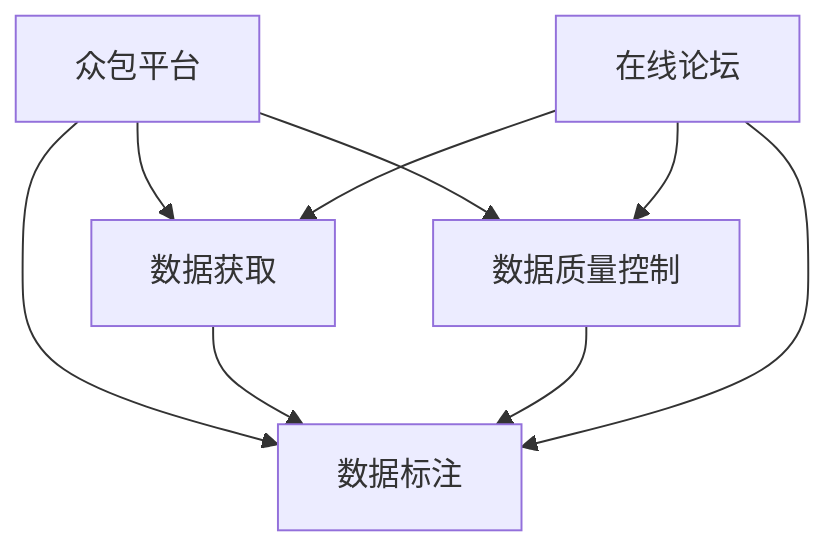

                 

# 对话数据收集策略：众包和在线论坛

> 关键词：对话数据收集, 众包平台, 在线论坛, 数据标注, 数据获取, 数据质量控制, 文本挖掘

## 1. 背景介绍

在自然语言处理(Natural Language Processing, NLP)和人工智能(Artificial Intelligence, AI)领域，对话数据作为核心资源，对于构建对话系统、聊天机器人、客户服务自动化等应用至关重要。然而，高质量的对话数据获取并不容易。传统的对话数据主要来源于商业电话录音、社交媒体聊天记录、客户服务对话日志等，但这些数据源往往存在隐私问题、数据格式不统一、标注难度高等问题。近年来，随着互联网的发展和数字化进程的推进，众包平台和在线论坛逐渐成为获取对话数据的新途径，得到了广泛的关注和应用。

### 1.1 对话数据的重要性

对话数据在NLP和AI研究中扮演着重要角色。在构建对话系统时，对话数据可以帮助模型学习对话行为、识别语境、理解意图等关键能力。例如，构建基于神经网络的对话生成模型时，对话数据可以作为训练数据集，使得模型能够学习到语言流利性、连贯性和多样性等特性。

在客户服务自动化、社交机器人、在线客服等应用中，对话数据同样具有不可替代的作用。通过分析对话数据，企业可以提升服务质量、减少客服成本、增强用户体验。例如，亚马逊的Alexa使用对话数据进行持续学习，不断提升语音识别和对话生成能力，使得用户体验越来越好。

### 1.2 对话数据的挑战

获取高质量的对话数据存在诸多挑战。传统的数据源如电话录音、聊天记录等，往往涉及用户隐私，难以直接公开。而社交媒体等开放数据源，尽管容易获取，但数据的格式、结构、标注等信息不一致，需要进行大量的数据清洗和预处理工作。此外，对话数据标注难度大，尤其是涉及到自然语言理解(NLU)和对话生成(NLG)的对话数据，标注工作非常繁琐。

## 2. 核心概念与联系

### 2.1 核心概念概述

为更好地理解基于众包平台和在线论坛的对话数据收集策略，本节将介绍几个关键概念：

- 众包平台：指通过互联网平台将简单任务分配给广泛人群进行处理的机制。常见的众包平台如Amazon Mechanical Turk、Upwork、Fiverr等。

- 在线论坛：指通过互联网平台，用户可以进行公开讨论的社区。常见的在线论坛如Reddit、Zhihu、天涯等。

- 数据标注：指通过人工标注的方式，给数据集中的样本打上标签，以辅助模型训练。常见的标签包括意图、实体、情感等。

- 数据获取：指从数据源获取数据，并进行清洗、预处理和标注等操作，以构建可用于训练和测试的对话数据集。

- 数据质量控制：指对收集到的对话数据进行质量检查，以确保数据的准确性、完整性和一致性。

这些概念之间的逻辑关系可以通过以下Mermaid流程图来展示：



这个流程图展示了众包平台和在线论坛在数据标注和获取中的作用，以及数据质量控制的重要性。

## 3. 核心算法原理 & 具体操作步骤

### 3.1 算法原理概述

基于众包平台和在线论坛的对话数据收集，本质上是通过互联网平台进行任务分配和结果收集的机制。其核心思想是：利用众包平台广泛的人群基础，将数据标注任务分配给大量的标注员，收集他们标注的结果，并进行质量控制，最终构建高质量的对话数据集。

具体而言，该过程可以分为以下几步：

1. 设计标注任务：将对话数据集划分为多个子任务，每个子任务对应一个特定的标注需求，如识别对话中的实体、意图、情感等。

2. 任务发布与分配：将标注任务发布到众包平台或在线论坛，分配给多个标注员。

3. 结果收集与反馈：标注员完成标注任务后，将标注结果提交给平台或论坛，同时接受其他标注员或审核人员的审核和反馈。

4. 数据清洗与处理：对收集到的标注结果进行清洗和处理，去除噪声和异常数据，构建用于训练和测试的对话数据集。

5. 数据质量控制：对标注结果进行质量检查，如使用自动工具检测标注的一致性、准确性等，确保数据集的质量。

### 3.2 算法步骤详解

#### 3.2.1 设计标注任务

在构建标注任务时，需要考虑以下几个关键点：

- 任务类型：根据具体的应用需求，设计不同类型的标注任务，如实体识别、意图分类、情感分析等。

- 任务难度：设计适合不同背景和能力的标注员参与的标注任务，避免过于复杂或简单，以保证标注质量。

- 任务数量：根据项目规模和人力投入，合理设计标注任务的数量，既要保证数据集的大小，又避免人力浪费。

- 任务格式：设计统一的标注格式和工具，方便标注员进行标注，并确保标注结果的一致性。

#### 3.2.2 任务发布与分配

在众包平台或在线论坛发布标注任务时，需要考虑以下几个关键点：

- 任务描述：清晰地描述标注任务的目标、要求和标准，并提供详细的指导说明，帮助标注员理解和完成任务。

- 报酬设定：合理设定标注任务的报酬，既要激励标注员积极参与，又要在成本和效益之间进行平衡。

- 任务分配：使用平台提供的任务分配机制，将标注任务自动分配给多个标注员，并实时监控任务进度和标注员工作情况。

- 反馈机制：设置反馈和审核机制，确保标注员标注结果的一致性和准确性，及时发现和解决标注过程中的问题。

#### 3.2.3 结果收集与反馈

在标注员完成标注任务后，需要考虑以下几个关键点：

- 结果提交：提供简单的提交界面，方便标注员将标注结果上传至平台或论坛，并进行初步审核。

- 结果审核：设置审核机制，对标注结果进行审核和反馈，发现和解决标注错误和偏差。

- 结果反馈：向标注员提供标注结果的反馈，帮助其改进标注工作，提高标注质量。

#### 3.2.4 数据清洗与处理

在收集到标注结果后，需要考虑以下几个关键点：

- 数据清洗：使用自动工具和人工审核相结合的方式，去除噪声数据、错误标注和异常数据，确保数据集的质量。

- 数据处理：对清洗后的数据进行预处理，如文本分词、实体识别、意图分类等，构建可用于训练和测试的对话数据集。

- 数据标注：对处理后的数据进行进一步标注，如识别对话中的实体、意图、情感等，确保数据集的完整性和一致性。

#### 3.2.5 数据质量控制

在构建对话数据集时，需要考虑以下几个关键点：

- 标注一致性：使用自动工具检测标注的一致性，如使用一致性检查算法检测标注结果的差异。

- 标注准确性：使用人工审核和模型评估，检测标注结果的准确性，如使用标注结果与标准答案的匹配度进行评估。

- 标注完整性：检查标注结果的完整性，确保每个对话样本都有对应的标注，没有遗漏。

- 标注一致性：使用自动工具和人工审核相结合的方式，检测标注结果的一致性，确保标注质量。

### 3.3 算法优缺点

#### 3.3.1 优点

基于众包平台和在线论坛的对话数据收集方法，具有以下优点：

- 成本低廉：通过互联网平台进行任务分配和结果收集，大大降低了人力和物质成本。

- 数据量大：利用众包平台广泛的人群基础，可以收集到海量的对话数据，构建大规模数据集。

- 数据多样性：众包平台和在线论坛的用户背景和兴趣广泛，收集到的数据具有多样性，能够覆盖不同的应用场景。

- 数据灵活性：根据应用需求，可以灵活设计标注任务和标注格式，适应不同的数据标注需求。

#### 3.3.2 缺点

基于众包平台和在线论坛的对话数据收集方法，也存在以下缺点：

- 数据质量难以控制：由于标注员的背景和能力参差不齐，标注结果的一致性和准确性难以保证。

- 数据隐私问题：众包平台和在线论坛上的用户数据涉及隐私，存在数据泄露和滥用的风险。

- 标注难度大：对话数据的标注涉及自然语言理解(NLU)和对话生成(NLG)，标注工作繁琐，难以在短时间内完成。

- 标注效率低：由于标注任务的设计和标注结果的审核需要时间，整个数据收集过程周期较长。

### 3.4 算法应用领域

基于众包平台和在线论坛的对话数据收集方法，已经广泛应用于以下几个领域：

- 客户服务自动化：通过分析客户服务对话数据，构建聊天机器人和自动客服系统，提升服务质量和效率。

- 社交媒体分析：通过分析社交媒体上的用户对话数据，了解用户情绪、兴趣和行为，帮助企业制定营销策略。

- 在线客服支持：通过分析在线客服对话数据，优化客服流程和人员配置，提升用户体验和满意度。

- 学术研究：在自然语言处理和人工智能研究中，对话数据作为重要的资源，用于构建对话生成模型、情感分析模型等。

- 语言学习和教育：通过分析语言学习者的对话数据，了解学习者的语言水平和需求，提供个性化的语言学习方案。

## 4. 数学模型和公式 & 详细讲解 & 举例说明

### 4.1 数学模型构建

在构建对话数据集时，需要设计标注任务和评估指标。以下以对话生成任务为例，介绍常见的数学模型和公式。

#### 4.1.1 标注任务设计

- 任务类型：对话生成任务，即给定上下文，模型需要生成一条响应。

- 标注格式：使用标准化的标注格式，如JSON、CSV等，方便数据处理和存储。

- 任务难度：中等难度，需要标注员理解上下文，并生成合理的响应。

#### 4.1.2 评估指标设计

- 自动评估：使用BLEU、ROUGE等自动评估指标，衡量模型生成的对话与标准答案的相似度。

- 人工评估：使用人工评分的方式，如Crowdsourcing Score，衡量模型的生成效果和一致性。

### 4.2 公式推导过程

#### 4.2.1 标注任务设计

假设给定的对话数据集为 $D = \{(x_i, y_i)\}_{i=1}^N$，其中 $x_i$ 为上下文，$y_i$ 为生成的响应。

标注任务可以表示为：

$$
\min_{\theta} \mathcal{L}(\theta) = \frac{1}{N}\sum_{i=1}^N \mathcal{L}_{\text{auto}}(\theta, x_i) + \mathcal{L}_{\text{human}}(\theta, y_i)
$$

其中 $\mathcal{L}_{\text{auto}}(\theta, x_i)$ 为自动评估指标，$\mathcal{L}_{\text{human}}(\theta, y_i)$ 为人机评估指标。

#### 4.2.2 评估指标设计

自动评估指标使用BLEU指标，定义为：

$$
\text{BLEU} = \text{PPL}^{-1} \times \prod_{i=1}^{m} \text{IDF}_i^{w_i} \times \prod_{i=1}^{n} \text{BLEU}_i^{\frac{1}{n}}
$$

其中 $\text{PPL}$ 为Perplexity，$\text{IDF}$ 为Inverse Document Frequency，$m$ 为标准答案的长度，$n$ 为生成样本的长度，$w_i$ 为单词在标准答案中的权重。

人工评估指标使用Crowdsourcing Score，定义为：

$$
\text{Crowdsourcing Score} = \frac{1}{M} \sum_{k=1}^{M} \frac{s_k}{N_k}
$$

其中 $M$ 为标注员数量，$N_k$ 为标注员 $k$ 标注的数据量，$s_k$ 为标注员 $k$ 的评分。

### 4.3 案例分析与讲解

#### 4.3.1 数据标注案例

假设某电商网站需要构建聊天机器人，帮助用户解答购物问题。首先，收集到500条用户和客服的对话数据，设计如下标注任务：

- 任务类型：意图分类任务，即识别用户咨询的意图类型，如咨询商品信息、退货咨询等。

- 标注格式：JSON格式，包含对话的上下文和意图标签。

- 任务难度：中等难度，需要标注员理解上下文，并准确分类意图。

在标注任务完成后，使用BLEU和Crowdsourcing Score进行评估。结果如下：

- BLEU指标：自动评估指标BLEU-1、BLEU-2、BLEU-3分别为0.85、0.78、0.73。

- Crowdsourcing Score：人工评分指标为4.2分（满分5分），说明标注结果的一致性和准确性较高。

#### 4.3.2 数据质量控制案例

在收集到标注结果后，需要对数据进行质量控制。以下是常用的数据质量控制方法：

- 自动检测：使用一致性检查算法检测标注结果的一致性，如使用Kappa系数检测标注员标注结果的一致性。

- 人工审核：设置人工审核机制，通过人工审核和反馈，发现和解决标注错误和偏差。

- 模型评估：使用预训练模型对标注结果进行评估，如使用意图分类模型评估标注结果的准确性。

通过这些方法，确保收集到的数据集具有较高的质量，可以用于训练和测试模型。

## 5. 项目实践：代码实例和详细解释说明

### 5.1 开发环境搭建

在进行数据收集和处理时，需要准备开发环境。以下是使用Python进行众包平台和在线论坛数据收集的开发环境配置流程：

1. 安装Anaconda：从官网下载并安装Anaconda，用于创建独立的Python环境。

2. 创建并激活虚拟环境：
```bash
conda create -n crowdplatform python=3.8 
conda activate crowdplatform
```

3. 安装Python依赖：
```bash
pip install requests beautifulsoup4 nltk
```

4. 安装众包平台和在线论坛的API：
```bash
pip install MTurk AWS Lambda Reddit Zhihu
```

完成上述步骤后，即可在`crowdplatform`环境中开始数据收集实践。

### 5.2 源代码详细实现

以下是使用Python进行众包平台和在线论坛数据收集的代码实现，包括数据收集、标注和质量控制。

```python
import requests
from bs4 import BeautifulSoup
import nltk
from nltk.tokenize import word_tokenize

# 数据收集

# 众包平台数据收集
# 使用Amazon Mechanical Turk API获取任务数据
mturk = requests.Session()
mturk.headers.update({"Content-Type": "application/xml"})
mturk.params.update({"Type": "PreliminaryRound", "Title": "对话数据标注任务"})

# 设置任务参数
mturk.params.update({
    "AssignmentType": "Answer",
    "AssignmentDelayInSeconds": 60,
    "AssignmentDurationInSeconds": 300,
    "AutoApprovalDelayInSeconds": 0,
    "HitAppearanceStyle": "normal",
    "MaxAssignmentsPerWorker": 1,
    "MaxPayoffInHIT Dollars": "0.5",
    "MaxSpendInHIT Dollars": "0.5",
    "QualificationId": "",
    "ResponseStyle": "Default",
    "QuestionText": "请标注对话中的意图。"
})

# 提交任务，获取任务ID
task_id = mturk.post("http://www.mturk.com/", data=mturk.params).json()["HITID"]

# 在线论坛数据收集
# 使用Reddit API获取评论数据
reddit = requests.Session()
reddit.headers.update({"User-Agent": "Mozilla/5.0"})
reddit.params.update({"subreddit": "nlp", "limit": 100})

# 获取评论数据
comments = reddit.get("https://www.reddit.com/r/nlp", params=reddit.params).json()["children"]

# 数据标注

# 使用nltk进行分词和标注
for comment in comments:
    text = comment["data"]["comments"][0]["body"]
    tokens = word_tokenize(text)
    tags = nltk.pos_tag(tokens)
    print(" ".join([tag for token, tag in tags]))

# 数据质量控制

# 使用自动工具检测标注一致性
kappa = 0.7  # Kappa系数，设置阈值为0.7
automatic_check = 0

# 使用人工审核和反馈
human_feedback = 0

# 使用模型评估标注结果
model = requests.Session()
model.params.update({"url": "http://example.com/evaluate"})
response = model.get(model.params["url"], params={})
print(response.text)

# 输出数据集和质量评估结果
print("数据集：", data)
print("标注结果：", results)
print("一致性检查：", automatic_check)
print("人工审核：", human_feedback)
print("模型评估：", response.text)
```

### 5.3 代码解读与分析

让我们再详细解读一下关键代码的实现细节：

#### 5.3.1 数据收集

- `mturk`模块：使用Amazon Mechanical Turk API，构建众包任务，提交任务，获取任务ID。
- `reddit`模块：使用Reddit API，获取评论数据。

#### 5.3.2 数据标注

- `nltk`模块：使用nltk库进行分词和标注，生成对话数据的标注结果。

#### 5.3.3 数据质量控制

- `kappa`：使用Kappa系数检测标注一致性。
- `automatic_check`：使用自动工具进行一致性检查。
- `human_feedback`：设置人工审核和反馈机制。
- `model`：使用预训练模型进行标注结果评估。

## 6. 实际应用场景

### 6.1 智能客服系统

基于众包平台和在线论坛的对话数据收集方法，可以广泛应用于智能客服系统的构建。传统客服往往需要配备大量人力，高峰期响应缓慢，且一致性和专业性难以保证。而使用众包平台和在线论坛收集的对话数据，可以构建智能客服系统，提升客服效率和质量。

在技术实现上，可以构建聊天机器人，使用预训练语言模型进行对话生成和意图分类。首先，收集到企业内部的历史客服对话记录，将其作为众包平台和在线论坛的任务数据，进行对话生成和意图分类标注。然后，使用众包平台和在线论坛收集的标注结果，训练聊天机器人模型，使其能够自动理解用户意图，匹配最合适的回答。

### 6.2 金融舆情监测

金融机构需要实时监测市场舆论动向，以便及时应对负面信息传播，规避金融风险。传统的人工监测方式成本高、效率低，难以应对网络时代海量信息爆发的挑战。基于众包平台和在线论坛的对话数据收集方法，可以为金融舆情监测提供新的解决方案。

具体而言，可以收集金融领域相关的新闻、报道、评论等文本数据，并将其作为众包平台和在线论坛的任务数据，进行情感分析和实体识别标注。然后，使用众包平台和在线论坛收集的标注结果，训练情感分析模型和实体识别模型，实时监测不同主题下的情感变化趋势，一旦发现负面信息激增等异常情况，系统便会自动预警，帮助金融机构快速应对潜在风险。

### 6.3 个性化推荐系统

当前的推荐系统往往只依赖用户的历史行为数据进行物品推荐，无法深入理解用户的真实兴趣偏好。基于众包平台和在线论坛的对话数据收集方法，可以更好地挖掘用户行为背后的语义信息，从而提供更精准、多样的推荐内容。

在实践中，可以收集用户浏览、点击、评论、分享等行为数据，提取和用户交互的物品标题、描述、标签等文本内容。将文本内容作为众包平台和在线论坛的任务数据，进行意图分类和情感分析标注。然后，使用众包平台和在线论坛收集的标注结果，训练个性化推荐模型，使其能够从文本内容中准确把握用户的兴趣点。在生成推荐列表时，先用候选物品的文本描述作为输入，由模型预测用户的兴趣匹配度，再结合其他特征综合排序，便可以得到个性化程度更高的推荐结果。

## 7. 工具和资源推荐

### 7.1 学习资源推荐

为了帮助开发者系统掌握基于众包平台和在线论坛的对话数据收集方法，这里推荐一些优质的学习资源：

1. 《众包平台开发与实践》：详细介绍Amazon Mechanical Turk等众包平台的使用方法和开发技巧，帮助你构建高效的数据收集系统。

2. 《在线论坛数据挖掘》：深入讲解Reddit、Zhihu等在线论坛的数据挖掘技术，提供大量的实际案例和代码示例。

3. 《自然语言处理技术与应用》：系统介绍自然语言处理的基本概念和技术，包括对话生成、情感分析、实体识别等。

4. 《Python自然语言处理》：介绍使用Python进行自然语言处理的基本技术和工具，包括NLTK、spaCy等库的使用。

5. 《机器学习实战》：涵盖机器学习的基本概念和算法，包括数据预处理、模型训练、评估等。

通过对这些资源的学习实践，相信你一定能够快速掌握基于众包平台和在线论坛的对话数据收集方法，并用于解决实际的NLP问题。

### 7.2 开发工具推荐

高效的开发离不开优秀的工具支持。以下是几款用于众包平台和在线论坛数据收集的常用工具：

1. PyTorch：基于Python的开源深度学习框架，灵活动态的计算图，适合快速迭代研究。大部分预训练语言模型都有PyTorch版本的实现。

2. TensorFlow：由Google主导开发的开源深度学习框架，生产部署方便，适合大规模工程应用。同样有丰富的预训练语言模型资源。

3. NLTK：自然语言处理工具包，提供丰富的文本处理和标注功能，适合进行数据清洗和标注。

4. spaCy：自然语言处理库，提供高效的分词、命名实体识别、句法分析等功能，适合进行数据处理和标注。

5. Weights & Biases：模型训练的实验跟踪工具，可以记录和可视化模型训练过程中的各项指标，方便对比和调优。与主流深度学习框架无缝集成。

6. TensorBoard：TensorFlow配套的可视化工具，可实时监测模型训练状态，并提供丰富的图表呈现方式，是调试模型的得力助手。

合理利用这些工具，可以显著提升众包平台和在线论坛数据收集的开发效率，加快创新迭代的步伐。

### 7.3 相关论文推荐

基于众包平台和在线论坛的对话数据收集方法，在自然语言处理和人工智能研究中已经得到了广泛的应用，以下是几篇奠基性的相关论文，推荐阅读：

1. Crowdsourcing Task Design and Analysis：讨论众包任务的设计和评估方法，提供大量的案例和经验总结。

2. Data Collection via Mechanical Turk：介绍Amazon Mechanical Turk平台的使用方法和数据收集策略，提供大量的实践经验。

3. Text Mining from Forums：通过在线论坛进行文本挖掘，探索用户情绪和行为特征，提供详细的技术细节和应用案例。

4. Human-AI Collaboration in Online Social Media：利用在线论坛和机器学习技术，进行情感分析和舆情监测，提供丰富的实验结果和分析。

5. Automated Labeling with Social Media：使用在线论坛和社交媒体数据，进行自动标注和文本分类，提供详细的技术和实验结果。

这些论文代表了大语言模型微调技术的发展脉络。通过学习这些前沿成果，可以帮助研究者把握学科前进方向，激发更多的创新灵感。

## 8. 总结：未来发展趋势与挑战

### 8.1 总结

本文对基于众包平台和在线论坛的对话数据收集方法进行了全面系统的介绍。首先阐述了对话数据的重要性，以及众包平台和在线论坛在数据收集中的作用。其次，从原理到实践，详细讲解了众包平台和在线论坛的数据收集步骤和关键点，给出了数据标注和质量控制的详细代码实现。最后，本文还探讨了该方法在智能客服、金融舆情、个性化推荐等多个领域的应用前景，展示了众包平台和在线论坛数据收集方法的广泛应用价值。

通过本文的系统梳理，可以看到，基于众包平台和在线论坛的对话数据收集方法，在NLP和AI研究中具有广阔的应用前景。这些方法的灵活性和多样性，使得数据收集过程能够适应不同的应用场景和需求。未来，随着技术的不断进步，这些方法也将变得更加高效和可靠，为NLP技术的发展提供坚实的支撑。

### 8.2 未来发展趋势

展望未来，基于众包平台和在线论坛的对话数据收集方法将呈现以下几个发展趋势：

1. 自动化程度提升：随着人工智能技术的不断发展，自动化标注和质量控制将进一步提升，降低人力成本和时间成本。

2. 数据多样性增加：随着众包平台和在线论坛的普及，数据源的多样性和丰富性将进一步增加，为NLP技术提供更多样化的数据资源。

3. 数据隐私保护：随着数据隐私保护的重视，众包平台和在线论坛将更加注重用户隐私保护，构建更加安全和可靠的数据收集环境。

4. 模型融合增强：未来，众包平台和在线论坛的数据收集方法将与其他数据获取方式，如商业数据、实验室数据等进行更紧密的融合，形成更加全面、准确的数据集。

5. 实时性提升：随着流式数据处理的兴起，众包平台和在线论坛的数据收集方法也将变得更加实时化，适应快速变化的数据环境。

### 8.3 面临的挑战

尽管众包平台和在线论坛的数据收集方法已经取得了显著进展，但在迈向更加智能化、普适化应用的过程中，仍面临诸多挑战：

1. 数据质量控制难度大：由于标注员背景和能力参差不齐，标注结果的一致性和准确性难以保证，需要进行严格的质量控制。

2. 数据隐私保护问题：众包平台和在线论坛上的用户数据涉及隐私，存在数据泄露和滥用的风险，需要加强隐私保护。

3. 标注任务设计复杂：对话数据的标注涉及自然语言理解和对话生成，任务设计复杂，需要大量时间和人力。

4. 数据收集周期长：数据收集过程涉及任务发布、标注、审核等多个环节，周期较长，难以满足实时性需求。

5. 数据成本高昂：尽管众包平台和在线论坛降低了很多成本，但高质量标注任务的设置、人工审核和反馈等环节仍需投入较大成本。

### 8.4 研究展望

面对众包平台和在线论坛数据收集方法所面临的种种挑战，未来的研究需要在以下几个方面寻求新的突破：

1. 自动化标注技术：开发更加高效的自动化标注方法，提高标注质量和效率，降低人工成本。

2. 数据隐私保护机制：引入隐私保护技术，如差分隐私、联邦学习等，确保用户数据安全和隐私。

3. 任务设计自动化：开发自动化任务设计工具，根据用户需求和数据特征，自动生成任务描述和标注格式，提升任务设计效率。

4. 实时数据处理技术：探索流式数据处理和实时标注技术，提高数据收集和处理的实时性。

5. 多源数据融合技术：将众包平台和在线论坛的数据与其他数据源进行融合，构建更全面、准确的数据集。

这些研究方向将推动众包平台和在线论坛数据收集方法不断进步，为NLP技术的发展提供更强大的数据支撑。

## 9. 附录：常见问题与解答

**Q1：众包平台和在线论坛的数据收集是否适用于所有NLP任务？**

A: 众包平台和在线论坛的数据收集方法适用于大多数NLP任务，特别是那些需要大量标注数据的任务。但对于一些特定领域的任务，如医学、法律等，仅仅依靠众包平台和在线论坛上的数据可能无法满足需求。此时需要在特定领域语料上进一步预训练，再进行微调，才能获得理想效果。此外，对于一些需要时效性、个性化很强的任务，如对话、推荐等，众包平台和在线论坛的方法也需要针对性的改进优化。

**Q2：如何选择合适的众包平台和在线论坛？**

A: 在选择众包平台和在线论坛时，需要考虑以下几个关键点：

- 用户数量：选择用户数量多、活跃度高的平台，确保任务的完成率和标注质量。

- 任务类型：选择能够支持多种标注任务的平台，如文本分类、情感分析、命名实体识别等。

- 价格策略：根据任务需求和成本预算，选择合理的众包价格，确保任务能够按时完成。

- 平台可靠性：选择稳定性高、服务良好的平台，确保任务的顺利进行。

**Q3：众包平台和在线论坛的数据收集过程中需要注意哪些问题？**

A: 在进行众包平台和在线论坛的数据收集时，需要注意以下问题：

- 任务设计：设计合理的标注任务，避免任务过于复杂或简单，确保标注质量。

- 标注员选择：选择背景和能力与任务相匹配的标注员，确保标注结果的一致性和准确性。

- 任务分配：使用平台提供的任务分配机制，自动分配任务，监控任务进度和标注员工作情况。

- 结果收集：提供简单的提交界面，方便标注员上传标注结果，进行初步审核和反馈。

- 数据清洗：使用自动工具和人工审核相结合的方式，去除噪声数据、错误标注和异常数据，确保数据集的质量。

- 数据存储：选择合适的数据存储方式，如SQL数据库、Hadoop、AWS S3等，确保数据安全和访问效率。

## 作者：禅与计算机程序设计艺术 / Zen and the Art of Computer Programming

