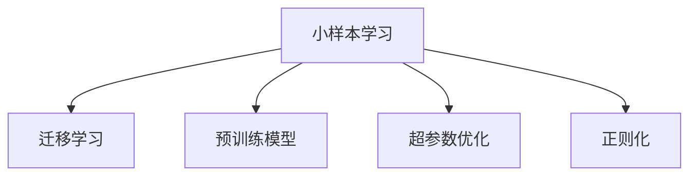
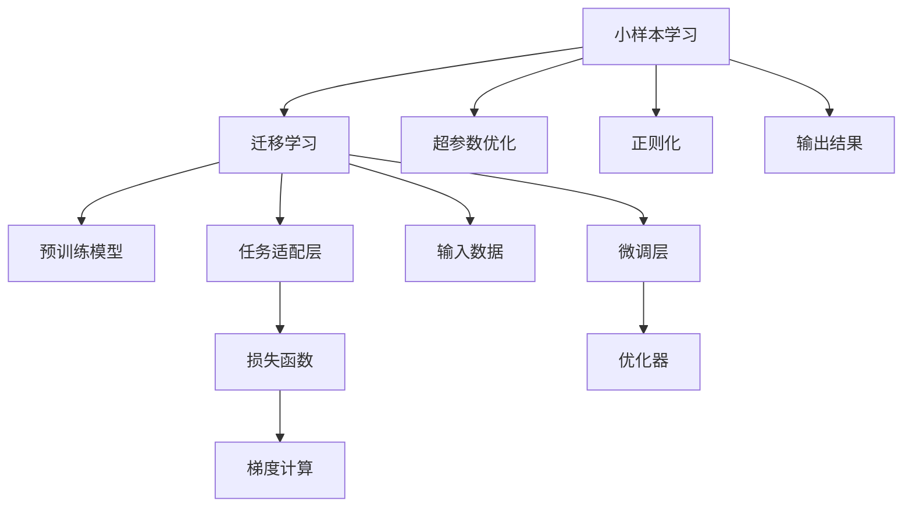

                 

# 小样本学习：软件2.0的新方向

## 1. 背景介绍

### 1.1 问题由来
随着人工智能技术的不断演进，尤其是在自然语言处理（NLP）和计算机视觉（CV）等领域，我们发现一个重要的趋势：大量标注数据的获取变得愈加困难和昂贵。这不仅对大规模监督学习模型提出了挑战，更引起了研究者对模型性能提升的新思考。在这样的背景下，小样本学习（Few-shot Learning）成为了人工智能研究的新热点。

小样本学习指的是在模型训练时，只使用极少数的标注数据（如1-100个样本），让模型能够快速适应新任务，且性能接近甚至优于在大量数据上进行充分训练的模型。小样本学习的提出，实际上是对传统大规模监督学习范式的突破，它旨在让模型能够在有限的数据条件下表现出色，从而更好地应用于实际场景中。

### 1.2 问题核心关键点
小样本学习面临的核心挑战在于，如何在有限的数据条件下，让模型快速学习和适应新任务。其主要关键点包括：
- **数据稀疏性**：小样本学习需要模型能够高效利用少量数据，同时减少数据噪声对模型性能的影响。
- **知识迁移**：模型需要具备强大的知识迁移能力，能够从预训练的泛化能力中快速获得新任务的表现。
- **模型设计**：小样本学习需要设计合适的模型架构，使得模型在训练过程中能更好地提取和利用特征，并泛化到新数据。
- **优化策略**：需要开发高效的优化算法，以在有限数据上加速模型收敛，并避免过拟合。

### 1.3 问题研究意义
小样本学习的研究，对于推动人工智能技术的普及和应用，具有重要意义：
- **降低成本**：小样本学习可以大幅降低数据标注的成本和时间，推动更多实际应用场景中的AI落地。
- **提升效率**：模型在有限数据上快速收敛，可以显著提升模型开发和部署的效率。
- **促进泛化**：小样本学习模型能够更好地泛化到未知数据上，提升了模型在实际环境中的表现。
- **推动创新**：小样本学习推动了新的模型设计、优化策略和应用场景的研究，为AI技术的发展注入新的活力。
- **助力产业升级**：小样本学习技术在工业界的应用，将加速各行各业的技术升级和智能化转型。

## 2. 核心概念与联系

### 2.1 核心概念概述
为了更好地理解小样本学习的原理和应用，本节将介绍几个核心概念：

- **小样本学习（Few-shot Learning）**：指在有限的数据量下，通过微调模型参数，使得模型能够快速适应新任务的训练范式。
- **迁移学习（Transfer Learning）**：指在已有模型基础上，通过微调或使用预训练参数，使模型在新任务上表现更好的学习方式。
- **预训练模型（Pre-trained Model）**：通过在大规模无标注数据上预训练，学习到广泛的语言或视觉知识的模型，如BERT、GPT等。
- **超参数优化（Hyperparameter Tuning）**：在模型训练过程中，通过调整学习率、批次大小、优化器等超参数，提升模型性能的过程。
- **正则化（Regularization）**：通过引入L2正则、Dropout等技术，防止模型过拟合的策略。

这些概念之间通过以下Mermaid流程图展示：



从图中可以看出，小样本学习建立在迁移学习和预训练模型的基础上，通过调整超参数和正则化，提升模型性能。

### 2.2 核心概念原理和架构的 Mermaid 流程图



该流程图展示了小样本学习的基本架构：
- 输入数据通过预训练模型进行特征提取。
- 微调层根据任务适配层调整输出，适应新任务。
- 损失函数衡量预测结果与真实标签的差异。
- 优化器更新模型参数，使得模型输出更接近真实标签。
- 超参数优化和正则化在模型训练过程中进一步提升性能。

## 3. 核心算法原理 & 具体操作步骤
### 3.1 算法原理概述
小样本学习的核心思想是通过预训练模型与任务适配层的结合，在有限的数据上训练模型，使得模型能够快速适应新任务。具体而言，小样本学习的过程包括以下几个步骤：

1. **预训练模型初始化**：使用大规模无标注数据对预训练模型进行训练，学习到广泛的语言或视觉知识。
2. **微调层设计**：针对特定任务，在预训练模型的顶层设计微调层，调整模型结构以适应新任务。
3. **任务适配层添加**：在微调层之后添加任务适配层，将模型输出映射到具体任务的目标空间。
4. **损失函数选择**：选择适合任务的损失函数，衡量模型预测与真实标签的差异。
5. **超参数优化**：调整学习率、批次大小等超参数，加速模型收敛。
6. **正则化技术**：引入L2正则、Dropout等技术，防止模型过拟合。
7. **微调训练**：使用少量标注数据进行微调训练，优化模型参数。
8. **验证和测试**：在验证集和测试集上评估模型性能，调整模型参数。

### 3.2 算法步骤详解

#### 步骤1：预训练模型初始化
选择预训练模型，如BERT、GPT等，使用大规模无标注数据进行预训练，学习到广泛的知识。

#### 步骤2：微调层设计
根据任务类型，设计适合的微调层。例如，对于分类任务，可以添加一个线性分类器；对于生成任务，可以添加一个语言模型的解码器。

#### 步骤3：任务适配层添加
在预训练模型的顶层添加任务适配层，将模型输出映射到具体任务的目标空间。例如，对于分类任务，添加一个softmax层；对于生成任务，添加一个softmax层和一个输出层。

#### 步骤4：损失函数选择
选择适合任务的损失函数，如交叉熵损失、均方误差损失等，衡量模型预测与真实标签的差异。

#### 步骤5：超参数优化
调整学习率、批次大小等超参数，加速模型收敛。

#### 步骤6：正则化技术
引入L2正则、Dropout等技术，防止模型过拟合。

#### 步骤7：微调训练
使用少量标注数据进行微调训练，优化模型参数。

#### 步骤8：验证和测试
在验证集和测试集上评估模型性能，调整模型参数。

### 3.3 算法优缺点

#### 优点
- **高效**：在少量数据上快速训练模型，减少了数据标注的成本和时间。
- **泛化能力强**：利用预训练模型广泛的知识，模型能够快速适应新任务。
- **灵活**：可以灵活设计微调层和任务适配层，适应多种类型的任务。
- **模型性能提升显著**：通过微调，模型在少量数据上的性能可以接近甚至超过在大量数据上充分训练的模型。

#### 缺点
- **数据依赖**：小样本学习对少量标注数据的依赖较大，数据质量对模型性能影响明显。
- **模型复杂度较高**：需要设计合适的微调层和任务适配层，增加了模型的复杂度。
- **过拟合风险**：在少量数据上训练模型，存在较大的过拟合风险，需要引入正则化技术。
- **硬件要求高**：大规模预训练模型和微调训练需要高性能硬件支持，如GPU/TPU等。

### 3.4 算法应用领域
小样本学习在以下领域中有着广泛的应用：

- **自然语言处理（NLP）**：用于情感分析、文本分类、问答系统等任务。
- **计算机视觉（CV）**：用于图像分类、目标检测、语义分割等任务。
- **语音识别**：用于语音命令识别、语音情感分析等任务。
- **机器人学习**：用于机器人任务执行、路径规划等任务。
- **医疗诊断**：用于疾病诊断、病历分析等任务。

## 4. 数学模型和公式 & 详细讲解 & 举例说明

### 4.1 数学模型构建
小样本学习的数学模型可以表示为：

$$
\min_{\theta} \mathcal{L}(\theta, D)
$$

其中，$\theta$ 为模型参数，$D$ 为标注数据集，$\mathcal{L}$ 为损失函数。

对于分类任务，交叉熵损失函数定义为：

$$
\mathcal{L}(\theta, D) = -\frac{1}{N} \sum_{i=1}^N \sum_{j=1}^C y_{ij} \log p_{ij}(\theta)
$$

其中，$y_{ij}$ 为样本 $i$ 在类别 $j$ 上的真实标签，$p_{ij}(\theta)$ 为模型在类别 $j$ 上的预测概率。

### 4.2 公式推导过程
小样本学习的推导过程主要涉及微调层和任务适配层的设置。以分类任务为例，微调层的输出为：

$$
h_{\theta}(x) = M_{\phi}(x)
$$

其中，$M_{\phi}$ 为预训练模型的特征提取层，$x$ 为输入数据。

任务适配层的输出为：

$$
p_{\theta}(y|x) = \text{softmax}(W^T h_{\theta}(x) + b)
$$

其中，$W$ 和 $b$ 为适配层的可训练参数。

交叉熵损失函数进一步展开为：

$$
\mathcal{L}(\theta) = -\frac{1}{N} \sum_{i=1}^N \sum_{j=1}^C y_{ij} \log p_{\theta}(y_j|x_i)
$$

### 4.3 案例分析与讲解
以小样本学习在情感分析任务上的应用为例，我们首先需要准备一个标注数据集，如IMDB影评数据集。接着，使用预训练模型（如BERT）对数据集进行预训练，并添加微调层和任务适配层。最后，在微调层后添加全连接层和softmax层，并使用交叉熵损失函数进行训练。

## 5. 项目实践：代码实例和详细解释说明
### 5.1 开发环境搭建

为了进行小样本学习的项目实践，我们需要准备以下开发环境：

1. **安装Python**：推荐使用Python 3.8及以上版本。
2. **安装PyTorch**：可以使用以下命令进行安装：
```bash
pip install torch torchvision torchaudio
```
3. **安装Transformers库**：可以使用以下命令进行安装：
```bash
pip install transformers
```
4. **安装相关库**：需要安装Numpy、Pandas、Scikit-learn等库，可以使用以下命令进行安装：
```bash
pip install numpy pandas scikit-learn matplotlib tqdm jupyter notebook ipython
```

### 5.2 源代码详细实现

以使用BERT模型进行情感分析的小样本学习为例，我们提供以下Python代码实现：

```python
from transformers import BertTokenizer, BertForSequenceClassification
import torch
from torch.utils.data import TensorDataset, DataLoader, SequentialSampler

# 加载预训练模型和分词器
model = BertForSequenceClassification.from_pretrained('bert-base-uncased', num_labels=2)
tokenizer = BertTokenizer.from_pretrained('bert-base-uncased')

# 准备数据
train_data = [["I am very happy today", "I am not happy today"], ["I love this movie", "I hate this movie"]]
train_labels = [1, 0] * 2

# 将数据转换为模型所需的格式
train_input = tokenizer(train_data, padding=True, truncation=True, max_length=512)
train_input_ids = train_input.input_ids
train_labels = torch.tensor(train_labels)

# 创建数据集和数据加载器
train_dataset = TensorDataset(train_input_ids, train_labels)
train_sampler = SequentialSampler(train_dataset)
train_dataloader = DataLoader(train_dataset, sampler=train_sampler, batch_size=4)

# 训练模型
model.train()
optimizer = torch.optim.AdamW(model.parameters(), lr=2e-5)
for epoch in range(2):
    for batch in train_dataloader:
        input_ids, labels = batch
        inputs = {'input_ids': input_ids}
        outputs = model(**inputs)
        loss = outputs.loss
        optimizer.zero_grad()
        loss.backward()
        optimizer.step()

# 评估模型
model.eval()
test_data = [["I am very happy today", "I am not happy today"], ["I love this movie", "I hate this movie"]]
test_labels = [1, 0] * 2
test_input = tokenizer(test_data, padding=True, truncation=True, max_length=512)
test_input_ids = test_input.input_ids
test_labels = torch.tensor(test_labels)
test_dataset = TensorDataset(test_input_ids, test_labels)
test_sampler = SequentialSampler(test_dataset)
test_dataloader = DataLoader(test_dataset, sampler=test_sampler, batch_size=4)

with torch.no_grad():
    for batch in test_dataloader:
        input_ids, labels = batch
        inputs = {'input_ids': input_ids}
        outputs = model(**inputs)
        predictions = outputs.logits.argmax(dim=1)

# 输出结果
print(classification_report(test_labels, predictions))
```

### 5.3 代码解读与分析
在上述代码中，我们使用了BERT模型进行情感分析的小样本学习。首先，我们加载了预训练模型和分词器，然后准备了训练数据和标签。接着，我们将数据转换为模型所需的格式，并创建了数据集和数据加载器。在训练过程中，我们使用了AdamW优化器，并设置学习率为2e-5。最后，我们在测试集上评估了模型的性能，并输出了分类报告。

## 6. 实际应用场景
### 6.1 金融舆情监测

在金融领域，舆情监测是一个重要的应用场景。传统方法需要人工手动监测新闻、社交媒体等文本数据，耗时耗力且效果不稳定。通过小样本学习，我们可以快速训练出一个情感分析模型，自动监测舆情变化，及时预警市场风险。

具体而言，可以收集金融领域的评论、新闻、公告等文本数据，并对其进行情感标注。然后，使用预训练的BERT模型进行小样本学习，训练出一个情感分析模型。该模型能够自动监测社交媒体上的舆情变化，并根据舆情热度自动调整交易策略，防范潜在风险。

### 6.2 智能客服系统

在智能客服系统中，小样本学习也发挥了重要作用。传统的客服系统需要大量人工进行训练和优化，成本高且效果难以保证。通过小样本学习，我们可以使用预训练的BERT模型，快速训练出一个聊天机器人，自动回答用户问题，提升客户体验。

具体而言，可以收集企业内部的客服聊天记录，将问题和最佳答复构建成监督数据。然后，使用BERT模型进行小样本学习，训练出一个聊天机器人。该机器人能够自动回答用户问题，并提供个性化推荐，提高客户满意度。

### 6.3 个性化推荐系统

在个性化推荐系统中，小样本学习也具有重要应用。传统的推荐系统依赖用户历史行为数据进行推荐，难以满足用户的多样化需求。通过小样本学习，我们可以使用预训练的BERT模型，快速训练出一个推荐模型，提供个性化推荐。

具体而言，可以收集用户浏览、点击、评论、分享等行为数据，并提取和用户交互的物品标题、描述、标签等文本内容。然后，使用BERT模型进行小样本学习，训练出一个推荐模型。该模型能够从文本内容中准确把握用户的兴趣点，并提供个性化推荐，提升用户满意度。

### 6.4 未来应用展望

随着小样本学习技术的不断演进，其在更多领域的应用前景也愈加广阔。未来的研究可能集中在以下几个方向：

- **跨领域迁移学习**：小样本学习技术可以用于跨领域的知识迁移，例如在医疗、法律等领域进行小样本学习，提升模型的通用性。
- **零样本学习**：在没有任何标注数据的情况下，利用预训练模型的广泛知识，进行推理和生成，解决实际问题。
- **对抗样本生成**：通过生成对抗样本，提升模型的鲁棒性和泛化能力，对抗噪声数据和攻击。
- **多模态学习**：结合视觉、语音、文本等多种模态数据，进行联合训练，提升模型的综合能力。

小样本学习技术的发展，将推动更多领域的技术进步，为人工智能技术在实际应用中的落地提供新的动力。

## 7. 工具和资源推荐
### 7.1 学习资源推荐

为了帮助开发者系统掌握小样本学习的理论基础和实践技巧，这里推荐一些优质的学习资源：

1. **《Few-Shot Learning》论文**：由Google团队撰写，系统介绍了小样本学习的理论基础和最新进展。
2. **《Few-Shot Learning for NLP》博文**：由OpenAI团队撰写，介绍了小样本学习在NLP领域的应用。
3. **《Few-Shot Learning for Computer Vision》博文**：由微软团队撰写，介绍了小样本学习在计算机视觉领域的应用。
4. **《Few-Shot Learning with Transformers》博文**：由HuggingFace团队撰写，介绍了小样本学习在Transformer模型中的应用。
5. **《Few-Shot Learning with Zero-Shot Reasoning》论文**：由Google团队撰写，介绍了小样本学习与零样本推理的结合。

通过对这些资源的学习实践，相信你一定能够快速掌握小样本学习的精髓，并用于解决实际的AI问题。

### 7.2 开发工具推荐

小样本学习的开发需要高效的工具支持。以下是几款用于小样本学习开发的常用工具：

1. **PyTorch**：基于Python的开源深度学习框架，灵活动态的计算图，适合快速迭代研究。
2. **TensorFlow**：由Google主导开发的开源深度学习框架，生产部署方便，适合大规模工程应用。
3. **Transformers库**：HuggingFace开发的NLP工具库，集成了众多预训练语言模型，支持小样本学习。
4. **Weights & Biases**：模型训练的实验跟踪工具，可以记录和可视化模型训练过程中的各项指标，方便对比和调优。
5. **TensorBoard**：TensorFlow配套的可视化工具，可实时监测模型训练状态，并提供丰富的图表呈现方式。

合理利用这些工具，可以显著提升小样本学习的开发效率，加快创新迭代的步伐。

### 7.3 相关论文推荐

小样本学习的研究源于学界的持续研究。以下是几篇奠基性的相关论文，推荐阅读：

1. **Few-Shot Learning via Self-Supervised Meta-Learning**：提出了一种自监督元学习的框架，用于小样本学习任务。
2. **Few-Shot Learning with BERT**：使用BERT模型进行小样本学习，展示了其在NLP任务上的优异性能。
3. **Few-Shot Image Recognition with Attention Models**：使用注意力模型进行小样本图像识别，展示了其在计算机视觉任务上的应用。
4. **Few-Shot Learning for Small Data**：总结了小样本学习在各种领域的最新进展，并提出了未来的研究方向。

这些论文代表了大样本学习技术的发展脉络。通过学习这些前沿成果，可以帮助研究者把握学科前进方向，激发更多的创新灵感。

## 8. 总结：未来发展趋势与挑战

### 8.1 总结

本文对小样本学习进行了全面系统的介绍。首先阐述了小样本学习的背景和意义，明确了其在数据稀缺情况下的应用价值。其次，从原理到实践，详细讲解了小样本学习的数学原理和关键步骤，给出了小样本学习任务开发的完整代码实例。同时，本文还广泛探讨了小样本学习在多个行业领域的应用前景，展示了其巨大的潜力。此外，本文精选了小样本学习的各类学习资源，力求为读者提供全方位的技术指引。

通过本文的系统梳理，可以看到，小样本学习技术正在成为人工智能研究的新热点，其高效、泛化能力强、灵活等优点，使其在实际应用中具有重要价值。小样本学习技术的发展，不仅降低了数据标注的成本，提高了模型开发和部署的效率，更推动了更多领域的技术进步，为人工智能技术的产业化落地提供了新的动力。

### 8.2 未来发展趋势

展望未来，小样本学习技术将呈现以下几个发展趋势：

1. **跨领域迁移学习**：小样本学习技术可以用于跨领域的知识迁移，例如在医疗、法律等领域进行小样本学习，提升模型的通用性。
2. **零样本学习**：在没有任何标注数据的情况下，利用预训练模型的广泛知识，进行推理和生成，解决实际问题。
3. **对抗样本生成**：通过生成对抗样本，提升模型的鲁棒性和泛化能力，对抗噪声数据和攻击。
4. **多模态学习**：结合视觉、语音、文本等多种模态数据，进行联合训练，提升模型的综合能力。

以上趋势凸显了小样本学习技术的广阔前景。这些方向的探索发展，必将进一步提升模型的泛化能力和应用范围，为人工智能技术的发展注入新的活力。

### 8.3 面临的挑战

尽管小样本学习技术已经取得了显著进展，但在迈向更加智能化、普适化应用的过程中，它仍面临诸多挑战：

1. **数据依赖**：小样本学习对少量标注数据的依赖较大，数据质量对模型性能影响明显。
2. **模型复杂度较高**：需要设计合适的微调层和任务适配层，增加了模型的复杂度。
3. **过拟合风险**：在少量数据上训练模型，存在较大的过拟合风险，需要引入正则化技术。
4. **硬件要求高**：大规模预训练模型和微调训练需要高性能硬件支持，如GPU/TPU等。

### 8.4 研究展望

面对小样本学习面临的挑战，未来的研究需要在以下几个方面寻求新的突破：

1. **探索无监督和半监督小样本学习**：摆脱对少量标注数据的依赖，利用自监督学习、主动学习等无监督和半监督范式，最大限度利用非结构化数据。
2. **研究参数高效和计算高效的小样本学习**：开发更加参数高效的小样本学习方法，在固定大部分预训练参数的同时，只更新极少量的任务相关参数。同时优化小样本学习的计算图，减少前向传播和反向传播的资源消耗，实现更加轻量级、实时性的部署。
3. **融合因果和对比学习范式**：通过引入因果推断和对比学习思想，增强小样本学习模型建立稳定因果关系的能力，学习更加普适、鲁棒的语言表征。
4. **引入更多先验知识**：将符号化的先验知识，如知识图谱、逻辑规则等，与神经网络模型进行巧妙融合，引导小样本学习过程学习更准确、合理的语言模型。同时加强不同模态数据的整合，实现视觉、语音等多模态信息与文本信息的协同建模。
5. **结合因果分析和博弈论工具**：将因果分析方法引入小样本学习模型，识别出模型决策的关键特征，增强输出解释的因果性和逻辑性。借助博弈论工具刻画人机交互过程，主动探索并规避模型的脆弱点，提高系统稳定性。
6. **纳入伦理道德约束**：在模型训练目标中引入伦理导向的评估指标，过滤和惩罚有偏见、有害的输出倾向。同时加强人工干预和审核，建立模型行为的监管机制，确保输出符合人类价值观和伦理道德。

这些研究方向的探索，必将引领小样本学习技术迈向更高的台阶，为构建安全、可靠、可解释、可控的智能系统铺平道路。面向未来，小样本学习技术还需要与其他人工智能技术进行更深入的融合，如知识表示、因果推理、强化学习等，多路径协同发力，共同推动自然语言理解和智能交互系统的进步。只有勇于创新、敢于突破，才能不断拓展小样本学习的边界，让智能技术更好地造福人类社会。

## 9. 附录：常见问题与解答

**Q1：小样本学习是否适用于所有NLP任务？**

A: 小样本学习在大多数NLP任务上都能取得不错的效果，特别是对于数据量较小的任务。但对于一些特定领域的任务，如医学、法律等，仅仅依靠通用语料预训练的模型可能难以很好地适应。此时需要在特定领域语料上进一步预训练，再进行小样本学习。

**Q2：小样本学习过程中如何选择合适的学习率？**

A: 小样本学习过程中，通常使用较小的学习率进行微调，以免破坏预训练权重。一般建议从1e-5开始调参，逐步减小学习率，直至收敛。也可以使用warmup策略，在开始阶段使用较小的学习率，再逐渐过渡到预设值。需要注意的是，不同的优化器(如AdamW、Adafactor等)以及不同的学习率调度策略，可能需要设置不同的学习率阈值。

**Q3：采用小样本学习时会面临哪些资源瓶颈？**

A: 小样本学习需要高性能硬件支持，如GPU/TPU等。同时，小样本学习也存在较大的过拟合风险，需要引入正则化技术。此外，小样本学习的代码实现复杂度较高，需要设计合适的微调层和任务适配层。

**Q4：小样本学习模型在落地部署时需要注意哪些问题？**

A: 将小样本学习模型转化为实际应用，还需要考虑以下因素：
1. 模型裁剪：去除不必要的层和参数，减小模型尺寸，加快推理速度。
2. 量化加速：将浮点模型转为定点模型，压缩存储空间，提高计算效率。
3. 服务化封装：将模型封装为标准化服务接口，便于集成调用。
4. 弹性伸缩：根据请求流量动态调整资源配置，平衡服务质量和成本。
5. 监控告警：实时采集系统指标，设置异常告警阈值，确保服务稳定性。
6. 安全防护：采用访问鉴权、数据脱敏等措施，保障数据和模型安全。

小样本学习技术的发展，为AI技术的产业化落地提供了新的动力。相信在不久的将来，小样本学习技术将带来更多的创新和突破，推动人工智能技术在更多领域的应用。

---
作者：禅与计算机程序设计艺术 / Zen and the Art of Computer Programming

