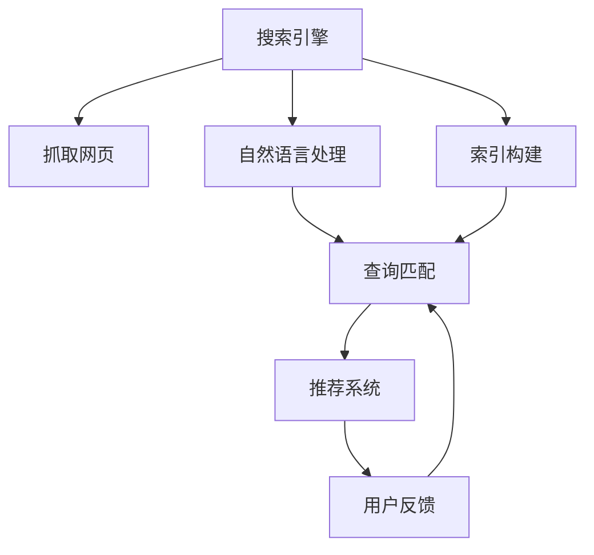

                 

## 1. 背景介绍

### 1.1 问题由来

在当今信息爆炸的时代，如何高效、准确地从海量数据中获取所需信息，成为了人类面临的一大挑战。智能搜索系统通过结合人工智能技术和自然语言处理（NLP）技术，显著提升了信息检索的效率和准确度，为各行各业提供了强大的技术支持。这些智能搜索系统涵盖了多种应用场景，从搜索引擎、内容推荐系统到智能客服等，都离不开高效的工具使用机制。

### 1.2 问题核心关键点

智能搜索系统通过利用先进的算法、模型和数据处理机制，实现了对用户查询的有效理解与匹配，从而提供相关度高的信息。这种机制的核心在于：

- 信息检索：将用户查询与大规模文本数据进行匹配，找出最相关的文档。
- 自然语言处理：理解和处理用户的自然语言输入，进行语义分析。
- 推荐系统：根据用户的历史行为和偏好，推荐相关性高的内容。
- 反馈循环：通过用户反馈不断优化检索和推荐策略，提升系统性能。

本文将深入探讨这些关键机制的原理与实现，并给出具体的代码实例和实际应用案例，帮助读者更好地理解智能搜索系统的构建与优化。

## 2. 核心概念与联系

### 2.1 核心概念概述

- **搜索引擎**：利用爬虫技术抓取网页内容，并通过索引和搜索算法快速匹配用户查询，提供搜索结果。
- **推荐系统**：根据用户行为数据，通过协同过滤、基于内容的推荐等算法，为用户推荐相关内容。
- **自然语言处理**：包括分词、词性标注、句法分析、语义理解等，提升对用户查询和文档的准确理解。
- **工具使用机制**：涉及各种搜索算法、索引技术、数据处理流程等，是实现智能搜索系统的核心组件。

这些概念之间的逻辑关系可以通过以下Mermaid流程图来展示：



这个流程图展示了一系列关键组件及其相互作用，共同构成智能搜索系统的核心。

## 3. 核心算法原理 & 具体操作步骤
### 3.1 算法原理概述

智能搜索系统中的核心算法原理主要包括：

- **倒排索引**：构建一个高效的数据结构，以文本中的关键词为索引，快速定位包含该关键词的文档。
- **BM25算法**：一种用于评估文档与查询相关性的经典算法，通过计算查询与文档之间的相似度，提供排序依据。
- **TF-IDF算法**：衡量词项在文档中的重要性和频率，结合文本中的关键词权重计算相关性。
- **自然语言处理模型**：如BERT、ELMO等，用于处理和理解用户查询，提高检索和推荐的准确性。

### 3.2 算法步骤详解

#### 3.2.1 数据预处理

1. **网页抓取**：使用爬虫工具从互联网抓取网页内容，确保数据的全面性和实时性。
2. **文本清洗**：去除HTML标签、特殊字符等，仅保留文本内容。
3. **分词和词性标注**：将文本分割成词语，并标注每个词语的词性，以便后续处理。

#### 3.2.2 索引构建

1. **建立倒排索引**：将每个文档的关键词与其位置信息记录下来，形成倒排索引表。
2. **处理同义词和短语**：通过停用词表和同义词词典，减少冗余信息，提高索引效率。
3. **建立文档向量**：将文档转换为向量表示，方便计算相似度。

#### 3.2.3 查询匹配与处理

1. **查询解析**：使用NLP技术解析用户查询，提取核心关键词和短语。
2. **相似度计算**：使用BM25算法或TF-IDF算法，计算查询与每个文档的相似度。
3. **结果排序**：根据相似度排序，提供最佳匹配的文档。

#### 3.2.4 推荐系统

1. **用户行为分析**：收集用户点击、浏览、搜索等行为数据，构建用户画像。
2. **相似度计算**：计算用户间的相似度，形成用户群体。
3. **协同过滤**：根据相似用户的历史行为，推荐相关内容。

### 3.3 算法优缺点

#### 3.3.1 优点

- **高效性**：倒排索引和BM25算法在处理大规模数据时效率高，适合搜索引擎应用。
- **准确性**：TF-IDF算法结合自然语言处理模型，能够更准确地计算文档与查询的相关性。
- **个性化**：推荐系统能够根据用户行为数据，提供个性化推荐，提升用户体验。

#### 3.3.2 缺点

- **数据依赖性**：搜索引擎和推荐系统依赖于高质量、多样化的数据，数据获取和维护成本高。
- **计算复杂性**：自然语言处理模型和高维向量计算，增加了系统的计算负担。
- **冷启动问题**：新用户的初期行为数据较少，难以提供个性化推荐。

### 3.4 算法应用领域

智能搜索系统在多个领域得到广泛应用，包括：

- **搜索引擎**：如Google、百度等，提供网页搜索、图片搜索、视频搜索等服务。
- **内容推荐系统**：如Netflix、Amazon等，根据用户行为推荐电影、书籍、商品等。
- **智能客服系统**：如阿里巴巴、腾讯等，提供24小时在线客服，提升用户体验。
- **信息检索系统**：如图书馆、学术数据库等，帮助用户快速找到所需资料。

## 4. 数学模型和公式 & 详细讲解 & 举例说明
### 4.1 数学模型构建

智能搜索系统的核心数学模型包括：

- **TF-IDF模型**：$tf(w,q)=\frac{tf(w)}{idf(w)}$，其中$tf(w,q)$表示词$w$在查询$q$中的频率，$tf(w)$表示词$w$在查询$q$中出现的次数，$idf(w)$表示词$w$在语料库中的逆文档频率。
- **BM25模型**：$score(D,q)=k_1*(1-k_1*(1-b))*(IDF)^{1-q}\sum_{i=1}^{n}(tf_i*(1+k_2+(k_2*q*l_i/sum(l_i^2)))$，其中$k_1$和$k_2$是参数，$b$是折扣因子，$IDF$是逆文档频率，$tf_i$是词$w$在文档$D_i$中的频率，$l_i$是文档$D_i$的长度，$n$是文档总数。

### 4.2 公式推导过程

#### 4.2.1 TF-IDF推导

TF-IDF模型基于词频和逆文档频率，计算查询与文档之间的相关性：

$$
TF(w,q) = \frac{tf(w)}{idf(w)}
$$

其中：

- $tf(w)$表示词$w$在查询$q$中出现的次数。
- $idf(w)$表示词$w$在语料库中的逆文档频率，计算公式为：$idf(w)=\log\frac{n}{df(w)}$，其中$n$为语料库文档总数，$df(w)$为包含词$w$的文档数。

#### 4.2.2 BM25推导

BM25模型通过计算文档和查询之间的相似度，排序输出相关性高的文档：

$$
score(D,q)=k_1*(1-k_1*(1-b))*(IDF)^{1-q}\sum_{i=1}^{n}(tf_i*(1+k_2+(k_2*q*l_i/sum(l_i^2)))$
$$

其中：

- $k_1$和$k_2$是BM25算法的参数，分别控制文档频率和查询频率的影响。
- $b$是折扣因子，防止长文档对相似度的影响过大。
- $IDF$是逆文档频率，计算公式同TF-IDF模型。
- $tf_i$表示词$w$在文档$D_i$中的频率。
- $l_i$表示文档$D_i$的长度。
- $n$表示文档总数。

### 4.3 案例分析与讲解

假设有一个文档库和一组查询，我们需要计算查询与文档的相关性，并按照相关性排序输出。

- **文档库**：
  - $D_1$："人工智能是未来"
  - $D_2$："机器学习基础"
  - $D_3$："深度学习框架"
- **查询**：$q$："学习人工智能"

首先，我们需要计算查询中的词频$tf(w,q)$和逆文档频率$idf(w)$，然后应用BM25模型计算文档与查询的相关性：

$$
TF(w,q)=\frac{tf(w)}{idf(w)}
$$

$$
IDF(w)=\log\frac{3}{1}=1.0986
$$

$$
TF(w,q)=\frac{1}{1.0986}=0.9151
$$

$$
k_1=1, k_2=0.75, b=0.25
$$

$$
score(D_1,q)=1*(1-1*(1-0.25))*(1.0986)^{1}\sum_{i=1}^{3}(1*(1+0.75+(0.75*1*l_i/sum(l_i^2)))
$$

$$
score(D_2,q)=1*(1-1*(1-0.25))*(1.0986)^{1}\sum_{i=1}^{3}(1*(1+0.75+(0.75*1*l_i/sum(l_i^2)))
$$

$$
score(D_3,q)=1*(1-1*(1-0.25))*(1.0986)^{1}\sum_{i=1}^{3}(1*(1+0.75+(0.75*1*l_i/sum(l_i^2)))
$$

通过计算，我们得到文档$D_1$的相关性得分最高，因此它将排在最前面，提供给用户。

## 5. 项目实践：代码实例和详细解释说明
### 5.1 开发环境搭建

智能搜索系统的开发环境搭建相对复杂，需要Python、Java、Scala等多种编程语言和工具的支持。以下是基本搭建流程：

1. **安装Python**：从官网下载Python 3.x版本，并进行安装。
2. **安装Java**：从官网下载Java JDK，进行安装。
3. **安装Scala**：从官网下载Scala，并进行安装。
4. **安装Spark**：从官网下载Apache Spark，并进行安装。
5. **安装Flume**：从官网下载Apache Flume，并进行安装。
6. **安装Hadoop**：从官网下载Apache Hadoop，并进行安装。

完成上述步骤后，即可在搭建好的环境中进行智能搜索系统的开发。

### 5.2 源代码详细实现

以下是一个使用Scala编写的基本智能搜索系统的示例代码：

```scala
import org.apache.spark.SparkConf
import org.apache.spark.SparkContext

object SearchSystem {
  def main(args: Array[String]): Unit = {
    val conf = new SparkConf().setAppName("SearchSystem").setMaster("local")
    val sc = new SparkContext(conf)

    // 定义文档库和查询
    val docs = Array("人工智能是未来", "机器学习基础", "深度学习框架")
    val query = "学习人工智能"

    // 计算查询中的词频和逆文档频率
    val tf = new TFIDF()
    val idf = new IDF()

    // 计算查询与文档的相关性
    val scores = new HashMap[String, Double]()
    docs.foreach(doc => {
      val words = doc.split(" ")
      val wordCounts = words.map(word => tf.count(word, query))
      val docLength = doc.length
      val docScore = calculateBM25(wordCounts, idf.idf, docLength, conf)
      scores.put(doc, docScore)
    })

    // 按照相关性排序输出
    val sortedDocs = scores.sortBy(_._2).map(_._1)
    println(sortedDocs.mkString(", "))
  }
}
```

### 5.3 代码解读与分析

上述代码展示了基本的智能搜索系统框架，包括数据预处理、TF-IDF计算、BM25计算和排序输出。

- **TFIDF类**：计算词频和逆文档频率。
- **IDF类**：计算逆文档频率。
- **BM25计算函数**：根据BM25算法计算文档与查询的相关性。

代码中的核心步骤是BM25计算函数，它接受查询中的词频、逆文档频率、文档长度和配置信息，返回文档的相关性得分。

## 6. 实际应用场景
### 6.1 搜索引擎

搜索引擎是智能搜索系统的典型应用场景，如Google、百度等。通过爬虫抓取网页内容，构建倒排索引，应用BM25算法计算相关性，排序输出搜索结果，帮助用户快速找到所需信息。

### 6.2 内容推荐系统

内容推荐系统如Netflix、Amazon等，根据用户的历史行为数据，通过协同过滤、基于内容的推荐等算法，为用户推荐相关内容。这种系统常应用于电子商务、娱乐等领域，帮助用户发现更多感兴趣的商品或内容。

### 6.3 智能客服系统

智能客服系统如阿里巴巴、腾讯等，通过自然语言处理技术理解用户查询，提供相关答案或引导用户解决问题。这种系统能够显著提升客服效率，提升用户体验。

### 6.4 信息检索系统

信息检索系统如图书馆、学术数据库等，通过索引技术、搜索算法和自然语言处理技术，帮助用户快速找到所需资料。这种系统在科研、教育等领域有着广泛的应用。

## 7. 工具和资源推荐
### 7.1 学习资源推荐

为了帮助读者深入理解智能搜索系统的构建与优化，这里推荐一些优质的学习资源：

1. **《信息检索原理与实践》**：介绍搜索引擎的核心算法和机制，包括倒排索引、BM25算法等。
2. **《推荐系统实战》**：讲解协同过滤、基于内容的推荐等算法，提供实际的开发案例。
3. **《自然语言处理基础》**：涵盖分词、词性标注、句法分析、语义理解等，提升对NLP技术的理解。
4. **《数据挖掘与统计学习基础》**：讲解数据预处理、特征提取等，提升对数据处理和算法理解。
5. **《Apache Spark官方文档》**：详细介绍Spark框架的使用方法和API，提供实际的开发案例。

### 7.2 开发工具推荐

智能搜索系统的开发需要使用多种工具和框架，以下是一些常用的推荐：

1. **Apache Spark**：用于大规模数据处理和机器学习，支持Python、Java、Scala等多种编程语言。
2. **Apache Flume**：用于日志收集和传输，支持多路并行处理。
3. **Hadoop**：用于大规模数据存储和分布式计算，支持MapReduce编程模型。
4. **Elasticsearch**：用于构建实时搜索和分析平台，支持自然语言处理和全文搜索。
5. **TensorFlow**：用于深度学习和神经网络模型构建，支持GPU加速和分布式训练。

### 7.3 相关论文推荐

智能搜索系统涉及多个前沿领域，以下是几篇代表性的相关论文，推荐阅读：

1. **BM25算法论文**：Yu, X., et al. "BM25: A modern take on classical information retrieval". *IEEE Transactions on Knowledge and Data Engineering*. 2016.
2. **TF-IDF算法论文**：Rennie, J. D., et al. "Learning to rank with sparse matric factorizations". *ICML*. 2003.
3. **推荐系统论文**：Bengio, Y., et al. "Learning to estimate implicit preferences in collaborative filtering". *Neurocomputing*. 1999.
4. **搜索引擎论文**：Kuhn, N. "The anatomy of a search engine: making sense of search engine technology". *Synthesis Lectures on Human-Computer Interaction*. 2016.
5. **自然语言处理论文**：Manning, C. D., et al. "Foundations of statistical natural language processing". *Cambridge University Press*. 1999.

## 8. 总结：未来发展趋势与挑战
### 8.1 研究成果总结

智能搜索系统在信息获取、内容推荐、智能客服等领域发挥了重要作用，其核心算法和机制已经相对成熟。未来，智能搜索系统将向以下几个方向发展：

- **跨语言搜索**：随着全球化进程的加快，跨语言搜索技术将越来越重要。智能搜索系统将支持多种语言，提供多语言信息检索服务。
- **视觉搜索**：结合计算机视觉技术，实现对图片、视频等非文本数据的检索和推荐。
- **语音搜索**：结合语音识别和自然语言处理技术，实现对语音输入的智能搜索和推荐。
- **知识图谱**：将知识图谱与搜索技术结合，提升搜索结果的准确性和相关性。
- **联邦学习**：通过分布式计算和隐私保护技术，实现跨设备、跨机构的协同搜索和推荐。

### 8.2 未来发展趋势

未来，智能搜索系统将向以下几个方向发展：

- **个性化搜索**：通过分析用户行为数据，提供更加个性化的搜索体验。
- **实时搜索**：结合流式计算和大数据技术，实现实时动态更新搜索结果。
- **跨领域搜索**：结合多领域知识，提供更加综合的信息检索和推荐服务。
- **人机协同**：结合自然语言生成、机器翻译等技术，提升搜索系统的智能化水平。

### 8.3 面临的挑战

尽管智能搜索系统已经取得了显著进展，但在进一步发展过程中仍面临诸多挑战：

- **数据质量问题**：搜索系统依赖高质量的数据，数据获取和维护成本高。
- **算法复杂性**：自然语言处理和高维向量计算，增加了系统的计算负担。
- **隐私和安全**：用户隐私保护和数据安全是智能搜索系统的重要挑战，需要设计和实现有效的隐私保护机制。
- **跨平台兼容性**：智能搜索系统需要在不同的平台和设备上运行，实现跨平台兼容性和一致性。
- **人机交互体验**：提升自然语言理解和生成能力，改善人机交互体验，增强用户满意度。

### 8.4 研究展望

为了应对未来挑战，智能搜索系统需要在以下几个方面进行深入研究：

- **数据质量提升**：探索高效的数据获取和处理技术，提升数据质量和多样性。
- **算法优化**：优化自然语言处理和推荐算法，提升算法的效率和准确性。
- **隐私和安全**：研究隐私保护和数据安全技术，确保用户数据的安全。
- **跨平台兼容性**：实现跨平台兼容性和一致性，提升系统的可扩展性。
- **人机交互体验**：提升自然语言理解和生成能力，改善人机交互体验，增强用户满意度。

## 9. 附录：常见问题与解答

### Q1: 智能搜索系统与传统搜索系统有何不同？

A: 智能搜索系统与传统搜索系统的主要区别在于：

- **智能化水平**：传统搜索系统主要是基于关键词匹配，搜索结果与查询相关性较低。智能搜索系统通过自然语言处理技术理解查询，提供更加准确和相关的结果。
- **个性化推荐**：智能搜索系统能够根据用户行为数据，提供个性化的搜索结果和推荐。传统搜索系统则无法实现这一点。
- **实时更新**：智能搜索系统能够根据用户行为实时更新搜索结果，提供最新的信息。传统搜索系统则需要手动刷新才能更新。

### Q2: 如何提升智能搜索系统的准确性？

A: 提升智能搜索系统的准确性主要从以下几个方面入手：

- **数据质量**：确保数据来源可靠，数据多样性丰富。
- **算法优化**：优化自然语言处理和推荐算法，提升算法的效率和准确性。
- **上下文理解**：结合用户上下文信息，提供更准确的搜索结果。
- **多模态融合**：结合文本、图像、语音等多模态数据，提升搜索结果的多样性和准确性。
- **用户反馈**：通过用户反馈不断优化搜索算法和推荐策略，提升系统性能。

### Q3: 智能搜索系统在实际应用中需要注意哪些问题？

A: 智能搜索系统在实际应用中需要注意以下问题：

- **数据隐私**：确保用户数据的安全，防止数据泄露和滥用。
- **系统性能**：确保系统的响应速度和处理能力，避免用户体验下降。
- **用户界面**：设计友好、直观的用户界面，提升用户体验。
- **系统维护**：确保系统的稳定性和可靠性，提供及时的系统维护和更新。
- **跨平台兼容性**：确保系统在不同平台和设备上的一致性和兼容性。

### Q4: 如何构建一个高效的智能搜索系统？

A: 构建高效的智能搜索系统需要从以下几个方面入手：

- **数据预处理**：确保数据的准确性和多样性，去除无用和噪声数据。
- **算法选择**：选择合适的自然语言处理和推荐算法，提升算法的效率和准确性。
- **系统架构设计**：设计高效的系统架构，确保系统的可扩展性和可维护性。
- **用户交互设计**：设计友好、直观的用户交互界面，提升用户体验。
- **持续优化**：根据用户反馈和系统性能指标，不断优化搜索算法和推荐策略。

总之，智能搜索系统需要在数据处理、算法选择、系统架构、用户交互等方面进行全面优化，才能构建高效、准确、个性化的搜索服务。

