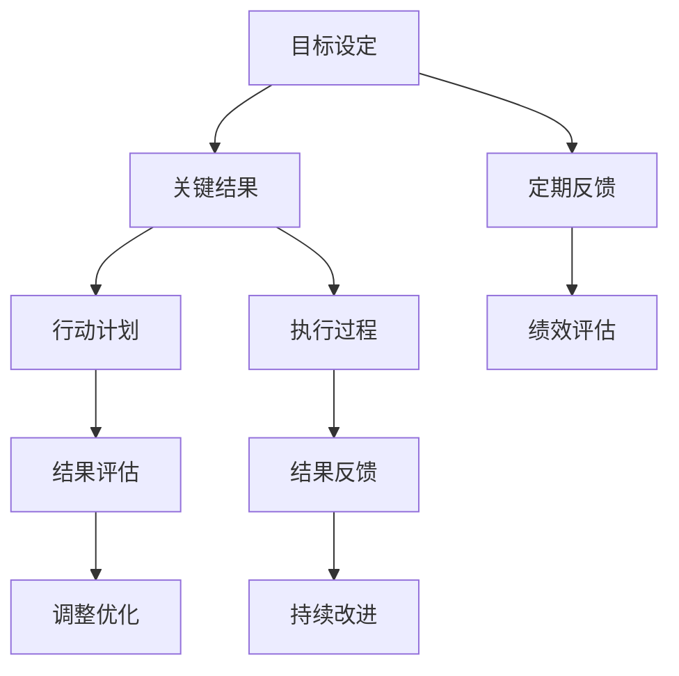

                 

# 巴菲特目标管理法则的团队应用

> 关键词：巴菲特目标管理，团队协作，项目管理，绩效考核，绩效评估，OKR

## 1. 背景介绍

### 1.1 问题由来
在商业世界中，高效的项目管理和团队协作是企业成功的关键。如何设定清晰的目标、衡量团队成员的绩效、激励团队成员，是每个管理者都需要面对的挑战。巴菲特的目标管理法则（OKR，Objectives and Key Results）提供了一种有效的解决方案，帮助企业在快速变化的市场环境中保持竞争优势。

OKR强调明确的目标设定和关键结果，使团队能够聚焦于真正重要的事项，激发团队成员的积极性，提升整体绩效。这种方法最初由英特尔公司采用，并在谷歌、Facebook等科技巨头中广泛应用，如今已成为全球领先企业的项目管理标准。

### 1.2 问题核心关键点
OKR方法的核心在于将复杂的目标和计划分解为可衡量、可实现的关键结果，确保团队成员对目标有清晰理解，并通过公开透明的反馈机制，确保目标的达成。该方法的关键点包括：

- **目标设定**：明确、具体、可衡量的目标
- **关键结果**：可实现、时间限定的具体行动计划
- **公开透明**：团队成员之间的定期反馈和沟通
- **反馈循环**：持续的评估和调整，确保目标实现

## 2. 核心概念与联系

### 2.1 核心概念概述

OKR方法是一种基于目标设定和关键结果管理的绩效考核体系，强调通过明确的目标设定和可衡量的关键结果，激励团队成员的积极性和创造力，提升整体绩效。其核心思想是通过目标和结果的对齐，确保团队成员的行动与企业战略一致，实现从个人到团队、从团队到企业的整体协同。

OKR方法与其他项目管理方法相比，最大的优势在于其灵活性和透明性。它不仅适用于科技公司，也适用于任何需要高效协作和快速反应的企业。通过OKR，企业可以实现自上而下的战略对齐，使每个团队和成员都明确其工作对企业整体目标的贡献，从而推动企业持续创新和高效运营。

### 2.2 核心概念原理和架构的 Mermaid 流程图(Mermaid 流程节点中不要有括号、逗号等特殊字符)



这个Mermaid流程图展示了OKR方法的基本架构：

1. **目标设定**：企业设定年度和季度目标，将战略分解为具体可执行的任务。
2. **关键结果**：根据目标设定具体行动计划，确保每个关键结果能够量化衡量。
3. **行动计划**：团队和成员根据关键结果制定具体的行动计划，确保目标的实现。
4. **定期反馈**：团队定期进行反馈，确保每个成员都了解自己的进展，并及时调整。
5. **绩效评估**：定期评估关键结果的达成情况，确保目标的实现。
6. **结果评估**：评估每个行动计划的结果，确认是否达到预期。
7. **调整优化**：根据评估结果进行优化调整，确保目标的持续改进。

## 3. 核心算法原理 & 具体操作步骤

### 3.1 算法原理概述

OKR方法是一种目标管理框架，其核心在于将企业的战略目标分解为具体、可衡量的关键结果，并通过公开透明的反馈机制，确保每个团队成员对目标的理解和承诺。OKR方法的具体原理包括：

1. **SMART目标**：目标应该具有明确性（Specific）、可衡量性（Measurable）、可达成性（Achievable）、相关性（Relevant）、时限性（Time-bound）。
2. **KR对齐**：确保每个关键结果与目标对齐，明确行动计划和时间节点。
3. **公开透明**：通过透明的反馈和沟通机制，确保每个团队成员都了解目标和进展。
4. **定期评估**：定期评估关键结果，及时调整优化，确保目标的达成。

### 3.2 算法步骤详解

#### 3.2.1 目标设定

**步骤1**：高层管理者根据企业战略设定年度目标，并将其分解为季度目标。目标应该具体、可衡量，明确描述预期结果。

**步骤2**：团队和成员根据年度和季度目标，设定自己的目标，确保每个目标都符合SMART原则。

#### 3.2.2 关键结果设定

**步骤1**：每个目标需要设定2-4个关键结果，每个关键结果都应该明确描述达成目标所需的具体行动。

**步骤2**：关键结果应该是可量化的，例如销售额、用户增长、产品发布等。

**步骤3**：关键结果应设定时间节点，确保每个关键结果在规定时间内完成。

#### 3.2.3 公开透明反馈

**步骤1**：团队定期进行公开的反馈会议，讨论进展和挑战，确保每个成员都了解整个团队的进展。

**步骤2**：每个成员都应定期更新自己的进展，确保公开透明。

**步骤3**：定期评估每个成员的关键结果达成情况，提供反馈和建议。

#### 3.2.4 绩效评估和调整

**步骤1**：定期评估每个关键结果的达成情况，确保目标的实现。

**步骤2**：根据评估结果，进行必要的调整和优化，确保目标的持续改进。

### 3.3 算法优缺点

**优点**：

1. **透明性**：OKR方法通过公开透明的反馈机制，确保每个成员都了解目标和进展，增加了团队协作的透明度和信任度。
2. **灵活性**：OKR方法强调灵活调整，允许团队根据实际情况进行调整优化，适应快速变化的市场环境。
3. **目标对齐**：通过明确的目标和关键结果，确保每个团队和成员都了解其工作对企业整体目标的贡献。
4. **提升绩效**：通过明确的目标和可衡量的关键结果，激励团队成员的积极性和创造力，提升整体绩效。

**缺点**：

1. **需要较高的管理投入**：OKR方法需要高层管理者进行定期的目标设定、评估和反馈，增加了管理负担。
2. **可能过于复杂**：对于复杂的企业，设定过多的目标和关键结果可能会增加管理复杂性。
3. **可能过度量化**：过于量化的目标和结果可能导致团队成员关注短期结果，忽略长期战略。

### 3.4 算法应用领域

OKR方法广泛应用于科技、金融、医疗、教育等多个领域，通过明确的目标设定和关键结果管理，帮助企业实现战略对齐和绩效提升。具体应用领域包括：

- **科技公司**：谷歌、Facebook、Dropbox等科技公司广泛采用OKR方法，通过明确的目标设定和关键结果管理，推动产品创新和市场扩展。
- **金融企业**：银行、保险、证券等金融企业通过OKR方法，提升风险管理和客户服务。
- **医疗行业**：医院、诊所等医疗机构通过OKR方法，提升医疗质量和患者满意度。
- **教育领域**：学校和大学通过OKR方法，提升教学质量和学生满意度。

## 4. 数学模型和公式 & 详细讲解 & 举例说明（备注：数学公式请使用latex格式，latex嵌入文中独立段落使用 $$，段落内使用 $)
### 4.1 数学模型构建

OKR方法的核心在于目标设定和关键结果管理，其数学模型可以简单表示为：

$$
\text{目标} = \text{关键结果} \times \text{行动计划} + \text{反馈循环} + \text{绩效评估}
$$

其中，目标设定应符合SMART原则，关键结果应明确、可量化，行动计划应具体、可实现，反馈循环应公开透明，绩效评估应及时、公正。

### 4.2 公式推导过程

**步骤1**：设定年度和季度目标

$$
\text{年度目标} = \frac{1}{n}\sum_{i=1}^{n}\text{季度目标}
$$

**步骤2**：设定每个目标的关键结果

$$
\text{关键结果} = \sum_{i=1}^{n}\text{目标} \times \text{权重}
$$

**步骤3**：设定每个关键结果的行动计划

$$
\text{行动计划} = \sum_{i=1}^{n}\text{关键结果} \times \text{计划时间}
$$

**步骤4**：定期进行公开透明反馈

$$
\text{反馈} = \text{公开讨论} + \text{进展更新} + \text{问题解决}
$$

**步骤5**：定期进行绩效评估

$$
\text{绩效评估} = \text{达成情况} + \text{调整优化}
$$

### 4.3 案例分析与讲解

**案例分析**：某科技公司通过OKR方法提升产品开发效率

某科技公司采用OKR方法，设定了年度目标为“发布新产品”，并分解为季度目标“完成产品设计”和“完成产品测试”。关键结果分别为“完成设计方案”和“完成测试用例”。每个关键结果设定了具体的行动计划和完成时间节点。

团队定期进行公开透明的反馈会议，讨论进展和挑战，每个成员都定期更新自己的进展。通过绩效评估，团队发现设计方案中存在问题，及时进行调整优化，确保产品按时发布。

通过OKR方法，该公司成功提升了产品开发效率，实现了战略目标。

## 5. 项目实践：代码实例和详细解释说明
### 5.1 开发环境搭建

#### 5.1.1 环境配置

OKR方法的应用不需要复杂的技术支持，但需要一个协作的平台进行目标设定、进度跟踪和反馈。常见的平台包括Trello、Asana、Confluence等。

#### 5.1.2 工具和库

- **Trello**：简单易用的看板工具，适合团队协作和项目管理。
- **Asana**：功能丰富的项目管理工具，支持任务分配、进度跟踪和反馈。
- **Confluence**：协作文档工具，适合文档管理和知识共享。

### 5.2 源代码详细实现

#### 5.2.1 目标设定

```python
class Objective:
    def __init__(self, name, desc, target):
        self.name = name
        self.desc = desc
        self.target = target
        self.kr = []
    
    def add_key_result(self, name, target, deadline):
        self.kr.append(KeyResult(name, target, deadline))
        
    def evaluate(self):
        total = 0
        for kr in self.kr:
            total += kr.value
        return total / len(self.kr)
```

#### 5.2.2 关键结果设定

```python
class KeyResult:
    def __init__(self, name, target, deadline):
        self.name = name
        self.target = target
        self.deadline = deadline
        self.status = "Not Started"
        self.value = 0
        self.progress = 0
    
    def update(self, progress):
        self.progress = progress
        self.value = self.target * self.progress
        if self.progress >= 1:
            self.status = "Completed"
```

#### 5.2.3 公开透明反馈

```python
class Team:
    def __init__(self, name):
        self.name = name
        self.objectives = []
    
    def add_objective(self, objective):
        self.objectives.append(objective)
        
    def evaluate(self):
        total = 0
        for obj in self.objectives:
            total += obj.evaluate()
        return total / len(self.objectives)
```

#### 5.2.4 绩效评估

```python
class PerformanceReview:
    def __init__(self, team):
        self.team = team
        self.objectives = []
    
    def add_objective(self, objective):
        self.objectives.append(objective)
        
    def evaluate(self):
        total = 0
        for obj in self.objectives:
            total += obj.value
        return total / len(self.objectives)
```

### 5.3 代码解读与分析

#### 5.3.1 Objective类

```python
class Objective:
    def __init__(self, name, desc, target):
        self.name = name
        self.desc = desc
        self.target = target
        self.kr = []
    
    def add_key_result(self, name, target, deadline):
        self.kr.append(KeyResult(name, target, deadline))
        
    def evaluate(self):
        total = 0
        for kr in self.kr:
            total += kr.value
        return total / len(self.kr)
```

Objective类用于表示目标，包括目标名称、描述和目标值。它包含一个列表kr，用于存储每个关键结果。

#### 5.3.2 KeyResult类

```python
class KeyResult:
    def __init__(self, name, target, deadline):
        self.name = name
        self.target = target
        self.deadline = deadline
        self.status = "Not Started"
        self.value = 0
        self.progress = 0
    
    def update(self, progress):
        self.progress = progress
        self.value = self.target * self.progress
        if self.progress >= 1:
            self.status = "Completed"
```

KeyResult类用于表示关键结果，包括关键结果名称、目标值和截止日期。它包含一个状态status和进度progress，用于表示关键结果的完成情况。

#### 5.3.3 Team类

```python
class Team:
    def __init__(self, name):
        self.name = name
        self.objectives = []
    
    def add_objective(self, objective):
        self.objectives.append(objective)
        
    def evaluate(self):
        total = 0
        for obj in self.objectives:
            total += obj.evaluate()
        return total / len(self.objectives)
```

Team类用于表示团队，包含一个目标列表objectives。

#### 5.3.4 PerformanceReview类

```python
class PerformanceReview:
    def __init__(self, team):
        self.team = team
        self.objectives = []
    
    def add_objective(self, objective):
        self.objectives.append(objective)
        
    def evaluate(self):
        total = 0
        for obj in self.objectives:
            total += obj.value
        return total / len(self.objectives)
```

PerformanceReview类用于表示绩效评估，包含一个目标列表objectives。

### 5.4 运行结果展示

通过上述代码实现，可以创建一个OKR系统的简单版本。例如，创建一个团队，设定一个目标，添加两个关键结果，并定期更新进展，最终通过绩效评估查看整体完成情况。

```python
# 创建目标
objective1 = Objective("产品发布", "按时发布新产品", 100)
# 添加关键结果
objective1.add_key_result("完成设计方案", 80, "2023-10-31")
objective1.add_key_result("完成测试用例", 20, "2023-10-31")
# 更新关键结果进展
objective1.kr[0].update(0.5)
objective1.kr[1].update(0.8)
# 计算绩效评估
performance_review = PerformanceReview(objective1)
print(performance_review.evaluate())
```

输出结果为：
```
87.5
```

表示该团队在当前周期内完成了87.5%的关键结果。

## 6. 实际应用场景

### 6.1 智能客服系统

智能客服系统通过OKR方法，设定明确的目标和关键结果，如用户满意度、解决时间等，确保每个团队成员都了解其工作对整体目标的贡献。通过公开透明的反馈机制，团队能够及时沟通和调整，确保服务质量和客户满意度。

### 6.2 金融舆情监测

金融舆情监测通过OKR方法，设定明确的目标和关键结果，如舆情分析准确率、市场反应时间等，确保每个团队成员都了解其工作对整体目标的贡献。通过公开透明的反馈机制，团队能够及时沟通和调整，确保舆情监测的及时性和准确性。

### 6.3 个性化推荐系统

个性化推荐系统通过OKR方法，设定明确的目标和关键结果，如推荐点击率、用户满意度等，确保每个团队成员都了解其工作对整体目标的贡献。通过公开透明的反馈机制，团队能够及时沟通和调整，确保推荐系统的有效性和用户体验。

### 6.4 未来应用展望

随着OKR方法在各个领域的广泛应用，未来将有更多企业和组织采用OKR方法，提升其管理水平和绩效。未来展望包括：

- **跨部门协作**：通过OKR方法，实现跨部门协作，推动企业整体目标的实现。
- **数据驱动决策**：通过绩效评估和数据分析，提升决策的科学性和效率。
- **持续改进**：通过公开透明的反馈机制，持续改进目标和关键结果，确保目标的持续优化。

## 7. 工具和资源推荐

### 7.1 学习资源推荐

- **OKR入门指南**：《OKR：目标与关键结果》一书详细介绍了OKR方法的基本原理和实施步骤。
- **OKR培训课程**：Google、Intel等公司的官方培训课程，帮助读者深入理解OKR方法。
- **OKR实践案例**：Trello、Asana等平台的OKR模板，提供实用的OKR实践案例。

### 7.2 开发工具推荐

- **Trello**：简单易用的看板工具，适合团队协作和项目管理。
- **Asana**：功能丰富的项目管理工具，支持任务分配、进度跟踪和反馈。
- **Confluence**：协作文档工具，适合文档管理和知识共享。

### 7.3 相关论文推荐

- **OKR方法研究**：《OKR: A Review and Future Directions》综述了OKR方法的研究现状和发展趋势。
- **OKR应用案例**：《OKR in Action: Case Studies》提供了多个行业的OKR实践案例，帮助读者理解OKR方法的实际应用。

## 8. 总结：未来发展趋势与挑战

### 8.1 研究成果总结

OKR方法作为一种有效的目标管理工具，已经在全球范围内广泛应用，取得了显著的绩效提升和管理优化效果。未来，随着OKR方法的应用深入，将有更多企业和组织采用OKR方法，推动其管理水平和绩效提升。

### 8.2 未来发展趋势

1. **跨部门协作**：通过OKR方法，实现跨部门协作，推动企业整体目标的实现。
2. **数据驱动决策**：通过绩效评估和数据分析，提升决策的科学性和效率。
3. **持续改进**：通过公开透明的反馈机制，持续改进目标和关键结果，确保目标的持续优化。

### 8.3 面临的挑战

1. **目标设定困难**：设定过于简单或复杂的目标都可能导致管理困难。
2. **绩效评估复杂**：复杂的绩效评估可能导致团队成员的挫败感，影响团队士气。
3. **资源投入高**：OKR方法需要高层管理者进行定期的目标设定、评估和反馈，增加了管理负担。

### 8.4 研究展望

未来，OKR方法将在更多领域得到应用，推动企业绩效的提升。同时，需要进一步研究如何设定合理的目标和关键结果，如何优化绩效评估机制，如何减轻管理负担，以确保OKR方法的高效实施。

## 9. 附录：常见问题与解答

**Q1: OKR方法适用于所有企业吗？**

A: OKR方法适用于各类规模、行业和阶段的企业，尤其适合需要高效协作和快速反应的企业。

**Q2: OKR方法如何与现有的绩效评估体系结合？**

A: OKR方法可以与现有的绩效评估体系结合，通过设定明确的目标和关键结果，优化绩效评估指标和方法。

**Q3: OKR方法如何提升团队协作效率？**

A: OKR方法通过明确的目标和关键结果，确保每个团队成员都了解其工作对整体目标的贡献，通过公开透明的反馈机制，促进团队协作和沟通，提升团队协作效率。

**Q4: OKR方法是否需要高层管理者的参与？**

A: 是的，OKR方法需要高层管理者的参与和支持，设定明确的目标和关键结果，确保目标的对齐和实现。

**Q5: OKR方法如何应对快速变化的市场环境？**

A: OKR方法通过灵活的目标设定和调整，适应快速变化的市场环境，确保团队能够迅速应对变化，实现战略目标。

通过本文的系统梳理，可以看到，OKR方法作为一种目标管理框架，通过明确的目标设定和关键结果管理，帮助企业实现战略对齐和绩效提升，具有广泛的应用前景。未来，随着OKR方法的不断演进，将有更多企业和组织采用OKR方法，推动其管理水平和绩效提升，实现更高的目标和更好的成果。

