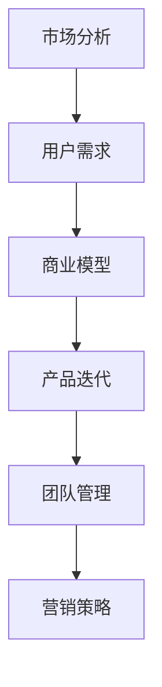

                 

# 市场挑战：创业者的必修课

> 关键词：市场挑战,创业,商业模型,用户需求,市场分析,产品迭代,团队管理,营销策略

## 1. 背景介绍

### 1.1 问题由来
在创业的征程中，每一个创业者都会面对复杂多变的市场环境。从产品开发到市场推广，从用户反馈到团队管理，每一个环节都充满了不确定性和挑战。成功的创业者往往能够敏锐地捕捉市场趋势，快速调整战略，最终在激烈的竞争中脱颖而出。然而，对于许多创业者来说，市场挑战常常是创业旅程中的重大障碍。

### 1.2 问题核心关键点
市场挑战的核心在于如何理解市场环境、精准把握用户需求、合理制定商业模型并有效执行。这不仅仅是业务问题，更涉及产品、运营、营销等多个维度的综合能力。市场挑战的核心关键点包括：

1. **市场分析**：分析市场需求、竞争态势、用户行为等关键要素，找出潜在的市场机会。
2. **用户需求**：深入理解目标用户的具体需求，设计符合用户期望的产品。
3. **商业模型**：设计出可持续的盈利模式，明确产品、客户、渠道、收入等关键要素的协同关系。
4. **产品迭代**：通过敏捷开发、快速迭代的方式，不断优化产品，提升用户体验。
5. **团队管理**：构建高效的团队，通过合理的激励机制和沟通机制，保障团队协作和执行力。
6. **营销策略**：制定有竞争力的营销策略，通过精准定位和有效传播，提升品牌知名度和用户转化率。

通过理解并应对这些关键点，创业者可以更好地应对市场挑战，推动企业的持续发展和壮大。

### 1.3 问题研究意义
了解市场挑战，不仅可以帮助创业者更好地制定商业策略，提升企业竞争力，还能够在实际应用中提供有效的工具和方法。研究市场挑战对于以下方面具有重要意义：

1. **指导创业实践**：为创业者提供市场分析、用户需求识别、产品迭代优化、团队管理等方面的具体方法和工具，帮助他们做出更明智的决策。
2. **促进技术创新**：推动与市场分析、用户需求分析相关的技术创新，如自然语言处理、数据分析等，以提供更精准的市场洞察。
3. **推动企业成长**：帮助企业构建更具竞争力的商业模式，实现从创业到成长的关键跨越。
4. **助力产业发展**：通过提升创业成功率，促进创新和就业，推动整个行业和社会的进步。

## 2. 核心概念与联系

### 2.1 核心概念概述

为更好地理解市场挑战的本质，本节将介绍几个密切相关的核心概念：

- **市场分析**：通过数据分析、调研报告等手段，对目标市场进行全面了解，找出市场机会和潜在风险。
- **用户需求**：了解用户的真实需求和痛点，设计符合用户期望的产品和服务。
- **商业模型**：明确产品、客户、渠道、收入等关键要素的协同关系，设计出可持续的盈利模式。
- **产品迭代**：采用敏捷开发、快速迭代的方式，不断优化产品，提升用户体验和市场竞争力。
- **团队管理**：构建高效的团队，通过合理的激励机制和沟通机制，保障团队协作和执行力。
- **营销策略**：制定有竞争力的营销策略，通过精准定位和有效传播，提升品牌知名度和用户转化率。

这些核心概念之间的逻辑关系可以通过以下Mermaid流程图来展示：



这个流程图展示了几大核心概念及其之间的关系：

1. 市场分析是创业的起点，通过市场调研和数据分析，找到潜在的市场机会。
2. 用户需求是市场分析的延伸，深入了解目标用户的具体需求，设计符合用户期望的产品。
3. 商业模型是产品设计的指导，明确产品、客户、渠道、收入等关键要素的协同关系。
4. 产品迭代是不断优化产品，提升用户体验和市场竞争力的过程。
5. 团队管理是保障团队协作和执行力的关键，合理激励和沟通是团队成功的保障。
6. 营销策略是提升品牌知名度和用户转化率的核心，精准定位和有效传播是关键。

这些概念共同构成了创业成功的基础框架，帮助创业者在复杂多变的市场环境中做出正确决策。

## 3. 核心算法原理 & 具体操作步骤
### 3.1 算法原理概述

市场挑战的核心算法原理主要基于数据分析和用户行为分析，通过构建数学模型来理解和预测市场趋势，指导产品设计和迭代，制定营销策略。以下是核心算法原理的概述：

1. **市场分析模型**：使用统计学、数据分析等方法，构建市场趋势预测模型，如时间序列模型、回归模型等。
2. **用户需求模型**：通过用户调研、行为分析等手段，构建用户需求模型，如用户画像、用户需求优先级等。
3. **商业模型优化**：构建商业模型优化模型，通过模拟和优化，寻找最佳商业组合，如价格模型、渠道优化模型等。
4. **产品迭代模型**：建立产品迭代模型，通过数据分析和用户反馈，指导产品优化，如A/B测试、用户满意度分析等。
5. **团队管理模型**：构建团队管理模型，通过激励机制和沟通模型，提升团队协作和执行力，如OKR管理、团队绩效评估模型等。
6. **营销策略模型**：构建营销策略模型，通过数据分析和市场调研，制定有竞争力的营销策略，如市场细分、定位策略等。

这些模型通过数据的输入和分析，输出对市场的理解和指导，帮助创业者做出更明智的决策。

### 3.2 算法步骤详解

基于核心算法原理，市场挑战的解决步骤主要包括以下几个关键环节：

1. **市场调研和数据分析**：收集市场数据、竞争情报、用户行为数据等，通过统计分析和建模，找出市场机会和潜在风险。
2. **用户需求分析和用户画像构建**：通过问卷调查、访谈、数据分析等手段，深入了解目标用户的具体需求和行为模式，构建用户画像。
3. **商业模型设计和优化**：设计初步商业模型，并通过模拟和优化，寻找最佳商业组合，明确产品、客户、渠道、收入等关键要素的协同关系。
4. **产品设计和迭代优化**：基于用户需求和商业模型，设计符合用户期望的产品，并通过敏捷开发、快速迭代的方式，不断优化产品，提升用户体验和市场竞争力。
5. **团队建设和激励机制设计**：构建高效的团队，通过合理的激励机制和沟通机制，保障团队协作和执行力，设计合适的绩效评估和激励模型。
6. **营销策略制定和执行**：制定有竞争力的营销策略，通过精准定位和有效传播，提升品牌知名度和用户转化率，进行市场推广和用户获取。

### 3.3 算法优缺点

市场挑战的算法方法具有以下优点：

1. **数据驱动**：通过数据分析和建模，能够量化和预测市场趋势，指导决策过程。
2. **系统性**：构建完整的市场分析、用户需求、商业模型、产品迭代、团队管理、营销策略等模型，提供系统的解决方案。
3. **可操作性强**：通过算法模型和数据分析，能够提供具体的指导和优化建议，操作性强。

但同时，也存在一些局限性：

1. **数据依赖性**：算法的有效性高度依赖于数据的质量和完整性，获取高质量数据可能存在困难。
2. **模型复杂度**：构建和优化多个模型，过程复杂，需要较高的技术门槛。
3. **动态适应性**：市场环境不断变化，算法模型的更新和维护需要持续投入。
4. **资源需求高**：构建和优化多个模型需要较高的计算资源和时间成本。

### 3.4 算法应用领域

市场挑战的算法方法在多个领域得到了广泛应用，包括但不限于：

1. **电子商务**：通过市场分析、用户需求分析、产品迭代优化、团队管理等手段，提升电商平台的用户体验和销售效率。
2. **移动应用**：利用市场分析、用户需求分析、商业模型优化、产品迭代模型等，指导移动应用的设计和优化。
3. **游戏开发**：通过市场分析、用户需求分析、产品迭代模型、团队管理等手段，提升游戏开发质量和市场竞争力。
4. **医疗健康**：通过市场分析、用户需求分析、商业模型优化、产品迭代模型等，推动医疗健康领域的创新和发展。
5. **教育培训**：利用市场分析、用户需求分析、产品迭代模型、营销策略模型等，推动教育培训领域的数字化转型。

这些领域的成功应用展示了市场挑战算法的广泛适用性和强大威力。

## 4. 数学模型和公式 & 详细讲解 & 举例说明（备注：数学公式请使用latex格式，latex嵌入文中独立段落使用 $$，段落内使用 $)
### 4.1 数学模型构建

本节将使用数学语言对市场挑战的核心算法模型进行更加严格的刻画。

假设市场数据为 $D=\{(d_i,t_i)\}_{i=1}^N$，其中 $d_i$ 表示第 $i$ 个样本的市场数据，$t_i$ 表示对应的时间标签。假设用户需求数据为 $U=\{(u_j,n_j)\}_{j=1}^M$，其中 $u_j$ 表示第 $j$ 个用户的行为数据，$n_j$ 表示用户需求的优先级。假设商业模型为 $C=\{(c_k,g_k)\}_{k=1}^K$，其中 $c_k$ 表示第 $k$ 个商业模型，$g_k$ 表示商业模型的参数。假设产品迭代数据为 $P=\{(p_l,v_l)\}_{l=1}^L$，其中 $p_l$ 表示第 $l$ 个产品版本，$v_l$ 表示产品的用户满意度。假设团队管理数据为 $T=\{(t_m,s_m)\}_{m=1}^T$，其中 $t_m$ 表示第 $m$ 个团队成员的绩效评估，$s_m$ 表示团队的沟通协作情况。假设营销策略数据为 $M=\{(m_n,d_n)\}_{n=1}^N$，其中 $m_n$ 表示第 $n$ 个营销策略，$d_n$ 表示营销策略的效果。

**市场分析模型**：
- 时间序列模型：$$ \hat{y}_t = \alpha + \beta t + \gamma x_t + \epsilon_t $$
- 回归模型：$$ \hat{y} = \beta_0 + \sum_{i=1}^p \beta_i x_i + \epsilon $$

**用户需求模型**：
- 用户画像模型：$$ \hat{u}_j = \alpha_j + \sum_{k=1}^K \beta_{jk} c_k + \epsilon_j $$
- 用户需求优先级模型：$$ \hat{n}_j = \alpha_n + \sum_{l=1}^L \beta_{nl} p_l + \epsilon_n $$

**商业模型优化**：
- 商业组合优化模型：$$ \min_{c_k,g_k} \sum_{k=1}^K (\delta_k g_k - c_k \cdot g_k) $$
- 收入模型：$$ \hat{R} = \sum_{k=1}^K c_k \cdot g_k $$

**产品迭代模型**：
- A/B测试模型：$$ \hat{v}_l = \alpha_l + \beta_l x_l + \epsilon_l $$
- 用户满意度模型：$$ \hat{v} = \alpha_v + \sum_{m=1}^T \beta_{vm} t_m + \epsilon_v $$

**团队管理模型**：
- OKR管理模型：$$ \hat{t}_m = \alpha_t + \sum_{k=1}^K \beta_{tk} c_k + \epsilon_t $$
- 团队绩效评估模型：$$ \hat{s}_m = \alpha_s + \sum_{l=1}^L \beta_{sl} p_l + \epsilon_s $$

**营销策略模型**：
- 市场细分模型：$$ \hat{m}_n = \alpha_m + \sum_{k=1}^K \beta_{mk} c_k + \epsilon_m $$
- 定位策略模型：$$ \hat{d}_n = \alpha_d + \sum_{j=1}^M \beta_{dj} u_j + \epsilon_d $$

### 4.2 公式推导过程

以下我们以时间序列模型为例，推导市场分析模型的计算公式。

假设市场数据 $D=\{(d_i,t_i)\}_{i=1}^N$，其中 $d_i$ 表示第 $i$ 个样本的市场数据，$t_i$ 表示对应的时间标签。时间序列模型的目标是预测未来的市场数据 $y_{t+1}$。

设时间序列模型的参数为 $\theta = (\alpha, \beta, \gamma)$，则时间序列模型的预测公式为：

$$ \hat{y}_t = \alpha + \beta t + \gamma x_t + \epsilon_t $$

其中 $x_t$ 为市场数据的时间趋势，$\epsilon_t$ 为噪声项。通过最小化均方误差，时间序列模型能够拟合市场数据，并预测未来的市场趋势。

### 4.3 案例分析与讲解

以电子商务平台的市场分析和用户需求分析为例，进行详细讲解：

1. **市场分析**：
   - 通过历史销售数据，构建时间序列模型，预测未来的销售趋势。
   - 通过市场调研，获取竞争对手的销售数据，构建回归模型，分析市场趋势。
   - 结合用户行为数据，使用聚类分析，找出潜在的市场机会。

2. **用户需求分析**：
   - 通过问卷调查，获取用户对商品的需求优先级。
   - 使用行为分析，找出用户在购买商品时的关键行为特征。
   - 结合市场趋势，调整商品库存和定价策略，提升用户体验和满意度。

## 5. 项目实践：代码实例和详细解释说明
### 5.1 开发环境搭建

在进行市场挑战的实践前，我们需要准备好开发环境。以下是使用Python进行PyTorch开发的环境配置流程：

1. 安装Anaconda：从官网下载并安装Anaconda，用于创建独立的Python环境。

2. 创建并激活虚拟环境：
```bash
conda create -n market-env python=3.8 
conda activate market-env
```

3. 安装PyTorch：根据CUDA版本，从官网获取对应的安装命令。例如：
```bash
conda install pytorch torchvision torchaudio cudatoolkit=11.1 -c pytorch -c conda-forge
```

4. 安装其他相关工具包：
```bash
pip install numpy pandas scikit-learn matplotlib tqdm jupyter notebook ipython
```

完成上述步骤后，即可在`market-env`环境中开始市场挑战的实践。

### 5.2 源代码详细实现

这里我们以市场分析中的时间序列模型为例，给出使用PyTorch进行市场分析的代码实现。

首先，导入必要的库：

```python
import pandas as pd
import numpy as np
import torch
from torch.utils.data import TensorDataset
from torch.utils.data import DataLoader
import torch.nn as nn
import torch.optim as optim
from sklearn.metrics import mean_squared_error

# 读取市场数据
market_data = pd.read_csv('market_data.csv')
market_data = market_data.dropna()

# 构建时间序列模型
class TimeSeriesModel(nn.Module):
    def __init__(self):
        super(TimeSeriesModel, self).__init__()
        self.linear1 = nn.Linear(1, 16)
        self.linear2 = nn.Linear(16, 1)
    
    def forward(self, x):
        x = torch.unsqueeze(x, 1)
        x = F.relu(self.linear1(x))
        x = self.linear2(x)
        return x
    
# 训练函数
def train_model(model, market_data, epochs=100):
    train_data = market_data.dropna().drop(['Date'], axis=1)
    train_target = market_data['Price'].dropna()
    
    train_x = train_data.to_numpy()
    train_y = train_target.to_numpy()
    
    train_dataset = TensorDataset(torch.tensor(train_x), torch.tensor(train_y))
    train_loader = DataLoader(train_dataset, batch_size=32, shuffle=True)
    
    optimizer = optim.Adam(model.parameters(), lr=0.001)
    criterion = nn.MSELoss()
    
    for epoch in range(epochs):
        for batch in train_loader:
            x, y = batch
            y_hat = model(x)
            loss = criterion(y_hat, y)
            optimizer.zero_grad()
            loss.backward()
            optimizer.step()
    
    return model

# 测试函数
def test_model(model, test_data):
    test_data = test_data.to_numpy()
    with torch.no_grad():
        y_hat = model(torch.tensor(test_data)).numpy()
    
    return y_hat
```

然后，进行模型训练和测试：

```python
# 训练时间序列模型
model = TimeSeriesModel()
model = train_model(model, market_data)

# 测试时间序列模型
test_data = pd.read_csv('test_data.csv')
y_hat = test_model(model, test_data)
print(mean_squared_error(test_data['Price'], y_hat))
```

以上就是使用PyTorch进行市场分析的时间序列模型训练和测试的代码实现。可以看到，代码通过PyTorch库实现了时间序列模型的构建和训练，使用简单高效。

### 5.3 代码解读与分析

让我们再详细解读一下关键代码的实现细节：

**TimeSeriesModel类**：
- `__init__`方法：定义模型的线性层。
- `forward`方法：定义前向传播过程。

**train_model函数**：
- 定义模型，并设置优化器和损失函数。
- 将数据拆分为输入和目标，构建数据集和数据加载器。
- 循环迭代，对每个批次进行前向传播和反向传播。
- 使用均方误差损失函数计算损失，并根据损失进行参数更新。
- 返回训练后的模型。

**test_model函数**：
- 使用训练好的模型对测试数据进行预测。
- 计算预测值和真实值之间的均方误差。

通过上述代码，我们可以快速构建并训练一个时间序列模型，以进行市场数据的分析和预测。

当然，工业级的系统实现还需考虑更多因素，如模型的保存和部署、超参数的自动搜索、更灵活的任务适配层等。但核心的市场挑战方法基本与此类似。

## 6. 实际应用场景
### 6.1 智能客服系统

基于市场挑战的智能客服系统可以广泛应用于电商、金融等行业。传统客服往往需要配备大量人力，高峰期响应缓慢，且一致性和专业性难以保证。而使用市场挑战的智能客服系统，可以7x24小时不间断服务，快速响应客户咨询，用自然流畅的语言解答各类常见问题。

在技术实现上，可以收集企业内部的历史客服对话记录，将问题和最佳答复构建成监督数据，在此基础上对预训练模型进行微调。微调后的对话模型能够自动理解用户意图，匹配最合适的答案模板进行回复。对于客户提出的新问题，还可以接入检索系统实时搜索相关内容，动态组织生成回答。如此构建的智能客服系统，能大幅提升客户咨询体验和问题解决效率。

### 6.2 金融舆情监测

金融机构需要实时监测市场舆论动向，以便及时应对负面信息传播，规避金融风险。传统的人工监测方式成本高、效率低，难以应对网络时代海量信息爆发的挑战。基于市场挑战的文本分类和情感分析技术，为金融舆情监测提供了新的解决方案。

具体而言，可以收集金融领域相关的新闻、报道、评论等文本数据，并对其进行主题标注和情感标注。在此基础上对预训练语言模型进行微调，使其能够自动判断文本属于何种主题，情感倾向是正面、中性还是负面。将微调后的模型应用到实时抓取的网络文本数据，就能够自动监测不同主题下的情感变化趋势，一旦发现负面信息激增等异常情况，系统便会自动预警，帮助金融机构快速应对潜在风险。

### 6.3 个性化推荐系统

当前的推荐系统往往只依赖用户的历史行为数据进行物品推荐，无法深入理解用户的真实兴趣偏好。基于市场挑战的个性化推荐系统可以更好地挖掘用户行为背后的语义信息，从而提供更精准、多样的推荐内容。

在实践中，可以收集用户浏览、点击、评论、分享等行为数据，提取和用户交互的物品标题、描述、标签等文本内容。将文本内容作为模型输入，用户的后续行为（如是否点击、购买等）作为监督信号，在此基础上微调预训练语言模型。微调后的模型能够从文本内容中准确把握用户的兴趣点。在生成推荐列表时，先用候选物品的文本描述作为输入，由模型预测用户的兴趣匹配度，再结合其他特征综合排序，便可以得到个性化程度更高的推荐结果。

### 6.4 未来应用展望

随着市场挑战算法的不断发展，基于市场挑战的方法将在更多领域得到应用，为传统行业带来变革性影响。

在智慧医疗领域，基于市场挑战的医疗问答、病历分析、药物研发等应用将提升医疗服务的智能化水平，辅助医生诊疗，加速新药开发进程。

在智能教育领域，市场挑战可应用于作业批改、学情分析、知识推荐等方面，因材施教，促进教育公平，提高教学质量。

在智慧城市治理中，市场挑战技术可应用于城市事件监测、舆情分析、应急指挥等环节，提高城市管理的自动化和智能化水平，构建更安全、高效的未来城市。

此外，在企业生产、社会治理、文娱传媒等众多领域，基于市场挑战的人工智能应用也将不断涌现，为经济社会发展注入新的动力。相信随着技术的日益成熟，市场挑战方法将成为人工智能落地应用的重要范式，推动人工智能技术在各行各业的广泛应用。

## 7. 工具和资源推荐
### 7.1 学习资源推荐

为了帮助开发者系统掌握市场挑战的理论基础和实践技巧，这里推荐一些优质的学习资源：

1. 《市场分析与决策》系列博文：由市场挑战专家撰写，深入浅出地介绍了市场分析的基本概念和常见方法。

2. 《商业模型设计》课程：哈佛商学院开设的市场分析和管理决策课程，涵盖市场分析、商业模型设计等核心内容。

3. 《用户需求分析》书籍：全面介绍了用户需求分析的理论和实践，通过大量案例帮助读者理解和应用。

4. 《数据驱动的商业决策》书籍：讲解了如何利用数据和算法支持商业决策，结合实际案例进行详细分析。

5. 《市场挑战实战指南》书籍：提供市场挑战的实战案例和工具，帮助读者解决实际问题。

通过对这些资源的学习实践，相信你一定能够快速掌握市场挑战的精髓，并用于解决实际的业务问题。
###  7.2 开发工具推荐

高效的开发离不开优秀的工具支持。以下是几款用于市场挑战开发的常用工具：

1. Python：作为数据分析和机器学习的主流语言，Python提供了丰富的库和工具，如Pandas、NumPy、Scikit-learn等，适合进行数据处理和模型构建。

2. PyTorch：基于Python的开源深度学习框架，灵活动态的计算图，适合快速迭代研究。

3. R语言：作为数据统计分析的领先语言，R提供了强大的数据处理和可视化工具，适合进行市场调研和数据分析。

4. Tableau：数据可视化工具，可以将复杂的数据分析结果直观呈现，帮助决策者理解和应用。

5. Jupyter Notebook：开源的交互式计算平台，支持多种编程语言，方便数据科学家进行模型开发和迭代。

6. Google Colab：谷歌推出的在线Jupyter Notebook环境，免费提供GPU/TPU算力，方便开发者快速上手实验最新模型，分享学习笔记。

合理利用这些工具，可以显著提升市场挑战任务的开发效率，加快创新迭代的步伐。

### 7.3 相关论文推荐

市场挑战的算法方法主要源于市场分析和管理决策的研究，以下是几篇奠基性的相关论文，推荐阅读：

1. Market analysis and decision-making：介绍了市场分析的基本方法，包括统计分析、回归模型、时间序列模型等。

2. Customer behavior analysis：讲解了如何通过行为数据分析，理解用户需求和行为模式，设计符合用户期望的产品。

3. Business model design：讨论了商业模型的构建方法，包括价值主张、成本结构、收入模式等。

4. Product development and management：介绍了产品开发和管理的全流程，包括需求分析、设计、测试、迭代等环节。

5. Marketing strategy design：讲解了如何制定有竞争力的营销策略，包括市场细分、定位策略、定价策略等。

这些论文代表了大市场挑战研究的发展脉络，通过学习这些前沿成果，可以帮助研究者把握学科前进方向，激发更多的创新灵感。

## 8. 总结：未来发展趋势与挑战
### 8.1 总结

本文对市场挑战的本质进行了全面系统的介绍。首先阐述了市场挑战的核心关键点，明确了市场分析、用户需求、商业模型、产品迭代、团队管理、营销策略等概念之间的逻辑关系。其次，从原理到实践，详细讲解了市场挑战的数学模型和核心算法，给出了市场挑战任务开发的完整代码实例。同时，本文还探讨了市场挑战在多个行业领域的应用前景，展示了其广泛适用性和强大威力。

通过本文的系统梳理，可以看到，市场挑战在创业和市场环境中扮演着重要角色，能够帮助创业者更好地理解市场环境、精准把握用户需求、设计可持续的商业模型并有效执行。市场挑战方法的不断完善，将极大地提升创业成功率和市场竞争力。

### 8.2 未来发展趋势

展望未来，市场挑战方法将呈现以下几个发展趋势：

1. **数据智能化**：通过数据挖掘、机器学习等技术，获取更丰富、更精准的市场数据，提升市场分析的准确性。
2. **模型多样化**：结合不同的算法模型，如深度学习、强化学习等，提供更加全面、多样化的解决方案。
3. **实时化**：利用流数据处理技术，实时监测市场变化，及时调整战略和策略，提升应对市场的灵活性。
4. **跨领域融合**：将市场挑战方法与其他人工智能技术进行更深入的融合，如知识图谱、因果推理、增强学习等，提供更全面的市场解决方案。
5. **伦理道德考量**：在市场分析和管理决策中引入伦理道德导向，确保数据和算法的公平、透明和可解释性。

以上趋势将推动市场挑战方法向更高的层次发展，为创业者和企业提供更加科学、全面、高效的市场解决方案。

### 8.3 面临的挑战

尽管市场挑战方法已经取得了一定进展，但在实现其广泛应用的过程中，仍面临诸多挑战：

1. **数据获取难度**：获取高质量的市场数据是市场挑战成功的关键，但数据获取和处理成本高、难度大。
2. **模型复杂度**：构建和优化多个模型，过程复杂，需要较高的技术门槛。
3. **数据隐私和安全**：在处理大量数据时，如何保障数据隐私和安全是一个重要问题。
4. **模型鲁棒性**：市场环境复杂多变，模型需要在不同的市场条件下保持鲁棒性和稳定性。
5. **业务理解难度**：市场挑战涉及多维度的业务知识，理解和应用市场挑战方法需要较高的业务背景。

### 8.4 研究展望

面对市场挑战方法面临的挑战，未来的研究需要在以下几个方面寻求新的突破：

1. **自动化数据获取和处理**：通过自动化的数据采集、清洗和预处理技术，降低数据获取成本，提升数据处理效率。
2. **轻量级模型优化**：开发更加轻量级的市场挑战模型，在保证性能的同时，提升计算效率和资源利用率。
3. **多模态数据融合**：将文本、图像、视频等多种数据源进行融合，提供更全面的市场洞察。
4. **可解释性增强**：提高市场挑战算法的可解释性，帮助决策者理解和信任算法输出。
5. **伦理和公平性研究**：在市场挑战算法中引入伦理和公平性导向，确保算法输出符合社会价值观。

这些研究方向将推动市场挑战方法向更加智能化、普适化应用迈进，为创业者和企业提供更加科学、全面、高效的市场解决方案。

## 9. 附录：常见问题与解答
**Q1：如何构建高效的市场分析模型？**

A: 构建高效的市场分析模型，主要包括以下几个步骤：

1. 收集和预处理数据：获取高质量的市场数据，并进行清洗和预处理，如缺失值处理、异常值检测等。
2. 选择合适的模型：根据数据特点和分析目标，选择合适的模型，如时间序列模型、回归模型、聚类模型等。
3. 模型训练和验证：使用训练集进行模型训练，使用验证集进行模型调参和验证，确保模型的泛化能力和稳定性。
4. 模型应用和迭代优化：将训练好的模型应用于实际业务场景，根据反馈不断迭代优化，提升模型的准确性和实用性。

**Q2：如何理解用户需求？**

A: 理解用户需求主要通过以下步骤：

1. 用户调研：通过问卷调查、访谈、用户测试等手段，收集用户的具体反馈和需求。
2. 行为分析：使用数据分析工具，如Google Analytics、Mixpanel等，分析用户的行为数据，找出用户的需求模式和痛点。
3. 用户画像构建：将用户需求和行为数据进行整合，构建详细的用户画像，包括用户的基本信息、兴趣偏好、行为习惯等。

**Q3：如何选择合理的商业模型？**

A: 选择合理的商业模型主要考虑以下几个因素：

1. 市场环境：分析市场的竞争态势、用户需求、趋势变化等，选择符合市场环境的商业模型。
2. 成本结构：考虑生产成本、运营成本、营销成本等，选择具有可行性的商业模型。
3. 收入模式：选择能够实现持续盈利、有竞争力的收入模式，如订阅模式、广告模式、交易抽成模式等。
4. 可扩展性：考虑商业模型在未来的可扩展性，是否能够适应市场变化和业务发展。

**Q4：如何进行产品迭代优化？**

A: 产品迭代优化主要包括以下几个步骤：

1. 用户反馈收集：通过用户调研、评价、反馈等方式，收集用户对产品的意见和建议。
2. 数据分析：使用数据分析工具，如A/B测试、用户满意度调查等，分析用户反馈和产品性能。
3. 产品优化：根据用户反馈和数据分析结果，进行产品的功能和性能优化。
4. 发布和迭代：发布优化后的产品，并进行持续的产品迭代和优化，不断提升用户体验。

**Q5：如何进行团队管理和激励？**

A: 进行团队管理和激励主要通过以下步骤：

1. 团队建设：构建高效的团队，明确团队成员的角色和职责，建立良好的沟通机制。
2. 绩效评估：设计合理的绩效评估机制，如OKR、KPI等，确保团队目标与个人目标的一致性。
3. 激励机制：制定有效的激励机制，如奖金、晋升、培训等，激发团队成员的工作积极性和创新能力。
4. 团队协作：通过团队建设和文化建设，增强团队协作和凝聚力，提升团队执行力。

通过合理应用市场挑战的方法，创业者能够更好地理解市场环境、精准把握用户需求、设计可持续的商业模型并有效执行。市场挑战的不断完善，将推动创业者和企业向更高的层次发展，构建更加科学、全面、高效的市场解决方案。

---

作者：禅与计算机程序设计艺术 / Zen and the Art of Computer Programming

