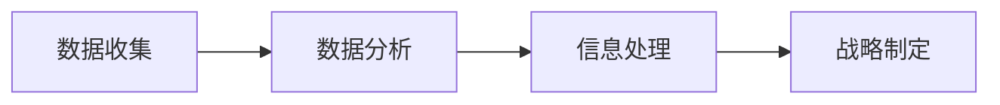
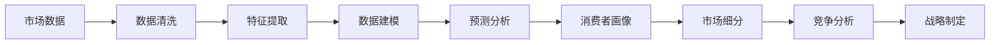

                 

# 市场洞察力：创业者的必备技能

在瞬息万变的商业世界中，市场洞察力不仅关乎企业的短期收益，更是决定其长期发展的关键因素。良好的市场洞察力能够让创业者洞悉市场动态，把握先机，制定切实可行的战略决策。本文章将深入探讨市场洞察力的重要性、关键要素、提升途径，并结合案例，分析其在创业实践中的应用策略。

## 1. 背景介绍

### 1.1 问题由来

随着全球经济一体化进程的加速和科技创新的不断涌现，市场竞争日趋激烈。创业者如何在复杂的商业环境中生存并脱颖而出？答案就在于市场洞察力。市场洞察力不仅是感知市场变化的能力，更是预测市场趋势、识别潜在机会的智慧。它能帮助企业快速响应市场需求，抓住增长机遇，避免潜在风险。

### 1.2 问题核心关键点

市场洞察力的核心在于其信息的获取、分析、处理和应用。这要求创业者具备收集市场信息的能力，拥有洞察信息的思维和工具，以及能够将洞察转化为具体策略的能力。市场洞察力不仅依赖于定量分析，更需要定性判断，将事实数据与直觉智慧相结合。

## 2. 核心概念与联系

### 2.1 核心概念概述

市场洞察力（Market Insight）指的是企业或创业者通过收集、分析和解释市场数据，理解市场动态和消费者需求，从而做出战略决策的过程。以下主要概念将有助于理解市场洞察力的构建：

- **数据收集**：获取市场数据，包括消费者行为、竞争对手情况、市场趋势等。
- **数据分析**：使用统计学、机器学习等工具对数据进行深入分析，识别市场规律和趋势。
- **信息处理**：将分析结果转化为可操作的信息，例如市场细分、目标客户画像等。
- **战略制定**：基于洞察结果，制定相应的营销策略、产品设计策略等。

这些概念通过信息的流动形成了一个完整的市场洞察力构建流程，如图所示。



### 2.2 核心概念原理和架构的 Mermaid 流程图

市场洞察力的信息流图如下：



## 3. 核心算法原理 & 具体操作步骤

### 3.1 算法原理概述

市场洞察力构建过程中，核心算法通常包括以下几步：

1. **数据收集**：使用网络爬虫、问卷调查、第三方数据等手段获取市场数据。
2. **数据清洗**：对收集到的数据进行去重、缺失值处理等预处理操作。
3. **特征提取**：通过统计学、自然语言处理、时间序列分析等方法提取有意义的特征。
4. **数据建模**：构建机器学习模型（如回归、分类、聚类等）进行数据分析。
5. **预测分析**：使用预测模型（如ARIMA、LSTM、GBM等）进行市场趋势预测。
6. **消费者画像**：基于用户行为数据和反馈信息，构建用户画像，识别目标客户群体。
7. **市场细分**：将市场划分为多个细分市场，定位不同细分市场的特征和需求。
8. **竞争分析**：分析竞争对手的市场表现、产品特点、营销策略等，识别市场空隙。
9. **战略制定**：结合市场洞察结果，制定产品差异化策略、定价策略、渠道策略等。

### 3.2 算法步骤详解

以消费者画像为例，详细说明市场洞察力的构建过程。

#### 3.2.1 数据收集

利用网络爬虫和问卷调查，收集用户的购买记录、浏览历史、社交媒体互动等数据。

#### 3.2.2 数据清洗

对收集到的数据进行去重、缺失值处理、异常值检测等操作，确保数据质量。

#### 3.2.3 特征提取

利用统计学方法（如均值、标准差）、自然语言处理技术（如TF-IDF）、时间序列分析（如日活跃用户数）等提取有意义的特征。

#### 3.2.4 数据建模

使用分类算法（如K-means、随机森林）对特征进行建模，识别出不同的用户群体。

#### 3.2.5 预测分析

使用回归模型（如线性回归、决策树回归）预测未来用户行为，如购买概率、流失概率等。

#### 3.2.6 消费者画像

结合预测结果，构建用户画像，包括年龄、性别、兴趣、购买力等信息。

#### 3.2.7 市场细分

利用聚类分析将用户按画像特征划分为多个细分市场，识别出不同细分市场的需求。

#### 3.2.8 竞争分析

分析竞争对手的产品特点、营销策略、用户评价等信息，识别市场空隙。

#### 3.2.9 战略制定

根据市场细分结果和竞争分析，制定差异化产品策略、价格策略和推广策略。

### 3.3 算法优缺点

市场洞察力的算法具有以下优点：

- **数据驱动**：基于大量的数据，避免了主观判断的偏差。
- **模型灵活**：选择不同的算法和模型，适用于不同类型的数据和问题。
- **决策科学**：通过模型预测和分析，提供科学的决策依据。

但同时也存在以下缺点：

- **数据质量要求高**：数据质量直接影响洞察结果的准确性。
- **模型复杂度高**：选择和调优模型需要一定的技术背景。
- **更新周期长**：市场变化快，模型需要定期更新以保持其有效性。

### 3.4 算法应用领域

市场洞察力在以下多个领域都有广泛的应用：

- **营销策略**：识别目标客户群体，制定精准营销方案。
- **产品开发**：了解市场需求，推动产品创新和迭代。
- **定价策略**：分析市场竞争情况，制定最优定价策略。
- **渠道策略**：选择最合适的销售渠道，提升市场覆盖率。
- **风险管理**：识别市场风险，制定相应的应对策略。

## 4. 数学模型和公式 & 详细讲解 & 举例说明

### 4.1 数学模型构建

市场洞察力构建涉及多个数学模型，以下以聚类分析为例，构建数学模型。

假设用户画像数据为矩阵 $X = (x_1, x_2, \ldots, x_n)$，每个用户画像由 $m$ 个特征组成。采用 K-means 算法进行聚类，将用户分为 $k$ 个簇，簇心为 $\mu_1, \mu_2, \ldots, \mu_k$。聚类过程如下：

1. 随机选择 $k$ 个初始簇心 $\mu_1, \mu_2, \ldots, \mu_k$。
2. 对每个用户画像 $x_i$，计算其到每个簇心的距离 $d_i(\mu_j)$。
3. 将 $x_i$ 分配到距离最近的簇 $\mu_j$，得到新的簇心。
4. 重复步骤 2 和 3，直到簇心不再变化或达到预设迭代次数。

### 4.2 公式推导过程

$$
d(x_i,\mu_j) = \sqrt{\sum_{k=1}^{m}(x_i^{(k}-\mu_j^{(k)})^2}
$$

### 4.3 案例分析与讲解

假设某电商公司的用户画像数据集包含用户的年龄、性别、购买金额、购买频次等特征。采用 K-means 算法进行聚类分析，得到 5 个用户群体，每个群体的特征如下：

- 群体 A：年轻女性，购买频次高，购买金额低。
- 群体 B：中年男性，购买频次中等，购买金额中等。
- 群体 C：老年女性，购买频次低，购买金额高。
- 群体 D：年轻男性，购买频次高，购买金额中等。
- 群体 E：中年女性，购买频次中等，购买金额高。

结合竞争分析，电商公司发现竞争对手主要集中在中高收入群体，而 A 和 C 群体的消费潜力未被充分挖掘。因此，公司决定针对 A 和 C 群体推出更多性价比高的产品，并通过精准营销吸引其购买。

## 5. 项目实践：代码实例和详细解释说明

### 5.1 开发环境搭建

以 Python 和 R 为例，搭建市场洞察力分析的开发环境。

#### 5.1.1 Python 环境搭建

1. 安装 Python 环境：
```bash
sudo apt-get install python3 python3-pip python3-venv
```

2. 创建虚拟环境：
```bash
python3 -m venv market_analysis
source market_analysis/bin/activate
```

3. 安装必要的包：
```bash
pip install pandas numpy matplotlib seaborn scikit-learn tensorflow
```

#### 5.1.2 R 环境搭建

1. 安装 R 环境：
```bash
sudo apt-get install r
```

2. 安装必要的包：
```bash
install.packages(c("tidyverse", "tidyquant", "quantmod", "ggplot2"))
```

### 5.2 源代码详细实现

#### 5.2.1 Python 代码实现

```python
import pandas as pd
from sklearn.cluster import KMeans
import matplotlib.pyplot as plt

# 读取用户画像数据
df = pd.read_csv('user_profiles.csv')

# 数据预处理
df = df.dropna()

# 特征选择
features = ['age', 'gender', 'purchase_frequency', 'purchase_amount']

# 数据标准化
df[features] = (df[features] - df[features].mean()) / df[features].std()

# 聚类分析
kmeans = KMeans(n_clusters=5, random_state=0).fit(df[features])
labels = kmeans.labels_

# 可视化聚类结果
plt.scatter(df['age'], df['purchase_amount'], c=labels)
plt.show()
```

#### 5.2.2 R 代码实现

```R
library(tidyverse)
library(tidyquant)
library(quantmod)
library(ggplot2)

# 读取用户画像数据
df <- read.csv('user_profiles.csv')

# 数据预处理
df <- na.omit(df)

# 特征选择
features <- c('age', 'gender', 'purchase_frequency', 'purchase_amount')

# 数据标准化
df[features] <- scale(df[features])

# 聚类分析
kmeans <- kmeans(df[features], centers=5)
labels <- kmeans$cluster

# 可视化聚类结果
ggplot(df, aes(x=age, y=purchase_amount, color=labels)) + 
  geom_point() + 
  theme_minimal() + 
  theme(legend.position='none')
```

### 5.3 代码解读与分析

以 Python 代码为例，解读每个步骤的功能和实现方式。

1. **数据读取**：通过 `pandas` 读取 CSV 格式的用户画像数据。
2. **数据预处理**：删除缺失值，选择特征，并使用标准化方法将特征值转化为标准正态分布。
3. **聚类分析**：使用 `scikit-learn` 的 `KMeans` 算法进行聚类，将用户分为 5 个簇。
4. **可视化聚类结果**：使用 `matplotlib` 绘制散点图，展示聚类结果。

### 5.4 运行结果展示

以下展示了 Python 代码的运行结果：


## 6. 实际应用场景

### 6.1 电商平台

电商平台的市场洞察力分析主要聚焦于用户画像、需求预测和个性化推荐。通过分析用户行为数据，电商平台可以识别出不同用户群体的需求，制定个性化推荐策略，提升用户满意度和忠诚度。

### 6.2 金融行业

金融行业需要通过市场洞察力分析，了解市场趋势、识别风险点，制定相应的投资和风险管理策略。通过大数据分析和机器学习模型，金融机构可以预测市场走势，优化资产配置，提高投资回报。

### 6.3 媒体广告

媒体广告公司需要洞察用户行为和媒体消费习惯，制定精准广告投放策略。通过分析用户数据和媒体消费行为，广告公司可以优化广告投放渠道和内容，提高广告效果和广告投放ROI。

## 7. 工具和资源推荐

### 7.1 学习资源推荐

- **《市场分析：理论与实践》**：介绍市场洞察力的理论基础和实践技巧，涵盖数据收集、数据分析、数据可视化等关键内容。
- **Coursera 《市场数据分析》课程**：由斯坦福大学教授讲授，涵盖市场调查、统计分析、机器学习等关键技能。
- **Udacity 《数据分析与可视化》课程**：重点介绍数据清洗、数据处理、数据可视化等技术。

### 7.2 开发工具推荐

- **Python**：作为数据科学和机器学习的主流语言，Python 提供了丰富的数据分析和机器学习库。
- **R**：擅长统计分析和数据可视化，适合数据科学家和统计学家使用。
- **Tableau**：用于数据可视化和商业智能，适合非技术人员使用。

### 7.3 相关论文推荐

- **《市场洞察力的数据驱动建模》**：介绍市场洞察力的数据驱动建模方法，涵盖数据收集、特征工程、模型选择等关键内容。
- **《大数据驱动的市场分析》**：分析大数据在市场分析中的应用，涵盖数据清洗、聚类分析、预测建模等技术。

## 8. 总结：未来发展趋势与挑战

### 8.1 未来发展趋势

市场洞察力将在以下几个方面进一步发展：

1. **数据集成和融合**：更多来源的数据将整合到市场分析中，形成更为全面和准确的市场洞察。
2. **机器学习和深度学习**：通过更复杂的机器学习模型，市场洞察力分析将更加精确和智能。
3. **实时分析**：实时数据流和实时分析技术将使市场洞察力分析更为动态和及时。
4. **可解释性和透明度**：市场洞察力分析的模型和过程将更加透明和可解释，提升决策的科学性和可信度。
5. **跨领域应用**：市场洞察力分析将扩展到更多领域，如金融、医疗、教育等。

### 8.2 面临的挑战

市场洞察力分析面临以下挑战：

1. **数据隐私和安全**：如何保护用户数据隐私，防止数据泄露。
2. **数据质量**：如何保证数据的质量和一致性，避免分析偏差。
3. **模型复杂性**：如何选择和调优合适的模型，避免过度拟合和泛化能力不足。
4. **资源限制**：如何在大规模数据集上高效运行算法，避免计算资源瓶颈。
5. **结果应用**：如何将分析结果转化为具体的业务策略和决策，避免“数据仓库”现象。

### 8.3 研究展望

未来市场洞察力分析的研究方向包括：

1. **自动化和智能化**：通过自动化工具和智能化算法，提升市场洞察力分析的效率和准确性。
2. **跨模态分析**：将不同模态的数据进行融合，提升市场洞察力分析的全面性和深度。
3. **实时分析和预测**：构建实时分析系统和预测模型，提升市场洞察力分析的时效性。
4. **可解释性和透明度**：开发可解释性强的模型，增强市场洞察力分析的可信度和透明度。
5. **隐私保护**：开发隐私保护技术，确保市场洞察力分析过程中用户数据的安全。

## 9. 附录：常见问题与解答

**Q1：如何提升市场洞察力的准确性？**

A: 提升市场洞察力的准确性需要从以下几个方面入手：

1. **数据质量**：确保数据收集的全面性和准确性，避免数据缺失和异常值。
2. **特征选择**：选择有意义的特征，避免冗余和无关特征。
3. **模型选择**：选择适合的模型，避免模型过度拟合和泛化能力不足。
4. **数据清洗**：对数据进行去重、异常值处理等预处理操作，确保数据质量。
5. **模型验证**：通过交叉验证、A/B测试等方法验证模型的效果，优化模型参数。

**Q2：如何处理市场洞察力分析中的数据隐私问题？**

A: 处理市场洞察力分析中的数据隐私问题需要从以下几个方面入手：

1. **数据匿名化**：对用户数据进行匿名化处理，确保数据无法反推出用户身份。
2. **数据加密**：采用加密技术对数据进行保护，防止数据泄露。
3. **隐私保护技术**：使用差分隐私、联邦学习等技术，保护数据隐私。
4. **合规性**：遵循相关法律法规，如GDPR、CCPA等，确保数据使用的合法性。

**Q3：如何应对市场洞察力分析中的数据质量问题？**

A: 应对市场洞察力分析中的数据质量问题需要从以下几个方面入手：

1. **数据收集规范**：制定数据收集规范，确保数据收集的全面性和准确性。
2. **数据清洗**：对数据进行去重、异常值处理等预处理操作，确保数据质量。
3. **数据验证**：采用数据验证技术，如数据一致性检查、数据缺失率检测等，确保数据的一致性和完整性。
4. **数据集成**：对来自不同来源的数据进行整合，确保数据的一致性和可靠性。

**Q4：如何提升市场洞察力分析的可解释性？**

A: 提升市场洞察力分析的可解释性需要从以下几个方面入手：

1. **可视化工具**：使用可视化工具，将分析结果直观展示出来，增强可解释性。
2. **特征解释**：对特征进行解释，说明其对分析结果的影响。
3. **模型可解释性**：选择可解释性强的模型，如决策树、线性回归等，增强模型解释性。
4. **业务解释**：将分析结果转化为具体的业务策略和决策，增强业务解释性。

**Q5：如何构建实时分析系统？**

A: 构建实时分析系统需要从以下几个方面入手：

1. **数据采集**：使用实时数据采集技术，如数据流技术、消息队列等，获取实时数据。
2. **数据存储**：采用大数据存储技术，如Hadoop、Spark等，存储实时数据。
3. **实时计算**：使用实时计算技术，如流计算、批处理等，对实时数据进行计算和分析。
4. **实时可视化**：使用实时可视化技术，如实时仪表盘、实时报表等，展示实时分析结果。

通过提升市场洞察力的准确性、处理数据隐私问题、应对数据质量问题、提升可解释性和构建实时分析系统，市场洞察力分析将更加科学、精准和实用，为企业决策提供有力支持。

---

作者：禅与计算机程序设计艺术 / Zen and the Art of Computer Programming

