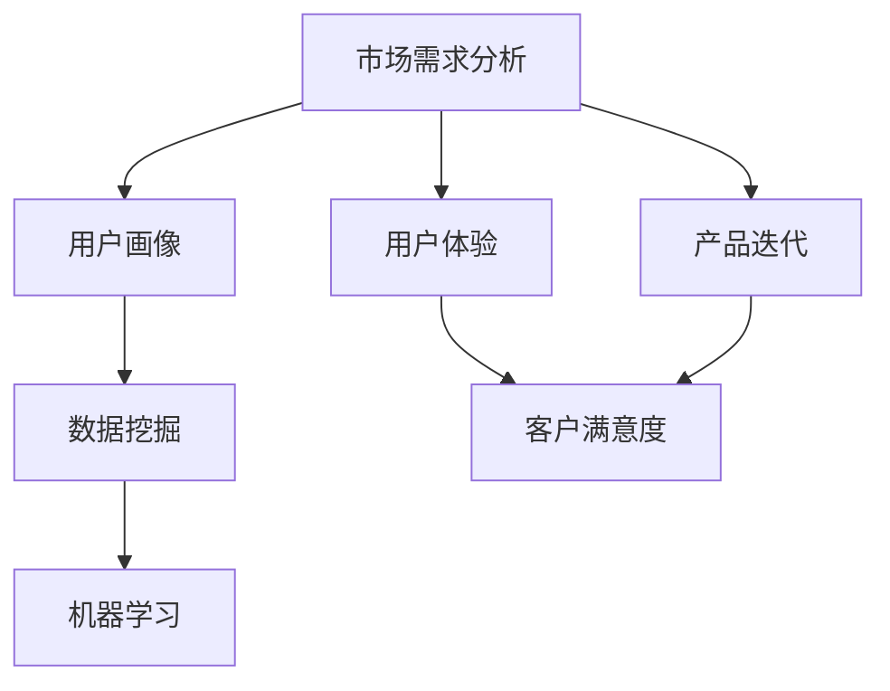

                 

# 市场需求分析在电商产品开发中的应用

> 关键词：市场需求分析,电商产品开发,数据分析,用户画像,产品迭代,客户满意度

## 1. 背景介绍

### 1.1 问题由来

电商行业随着互联网的普及和物流技术的提升，迅速成为全球最大的零售市场之一。各大电商平台之间的竞争激烈，如何有效获取并分析市场信息，精准定位用户需求，成为电商产品开发中至关重要的环节。市场需求分析，作为一种定量的用户需求研究方法，能够在电商产品开发中发挥巨大作用。

### 1.2 问题核心关键点

市场需求分析是指通过系统、科学的方法，收集、整理和分析市场数据，以预测未来的市场趋势和用户需求，帮助企业制定相应的产品策略，提高市场竞争力。具体而言，市场需求分析的核心关键点包括：

- 数据收集：从各种渠道（如用户调查、市场调查、销售数据、网络数据等）收集市场数据。
- 数据分析：运用统计学、数据分析等方法，对收集到的数据进行分析，识别出市场趋势和用户需求。
- 结果应用：将分析结果转化为产品设计、功能优化、营销策略等方面的决策，指导电商产品的迭代和升级。

## 2. 核心概念与联系

### 2.1 核心概念概述

为了更好地理解市场需求分析在电商产品开发中的应用，本节将介绍几个密切相关的核心概念：

- **市场需求分析（Demand Analysis）**：通过分析市场数据，预测未来的市场需求，帮助企业制定产品策略。
- **用户画像（User Persona）**：基于用户行为和偏好，构建典型用户群体，以指导产品设计和营销。
- **数据挖掘（Data Mining）**：从大量数据中提取有用信息，分析市场趋势和用户需求。
- **机器学习（Machine Learning）**：使用算法对数据进行训练，预测用户行为和市场需求。
- **用户体验（User Experience）**：关注用户在使用产品时的体验，提升用户满意度和忠诚度。
- **产品迭代（Product Iteration）**：根据市场需求和用户反馈，不断改进和优化产品，保持市场竞争力。

这些核心概念之间的逻辑关系可以通过以下Mermaid流程图来展示：



这个流程图展示了市场需求分析与用户画像、数据挖掘、机器学习、产品迭代、用户体验、客户满意度等概念之间的联系：

1. 市场需求分析通过数据分析、用户画像等方法，识别用户需求和市场趋势。
2. 用户画像构建典型用户群体，指导产品设计和营销策略。
3. 数据挖掘和机器学习对市场数据进行深度分析，提取有用信息。
4. 产品迭代根据市场需求和用户反馈，不断改进和优化产品。
5. 用户体验关注用户使用产品的感受，提升用户满意度和忠诚度。
6. 客户满意度是用户体验的最终体现，直接影响到电商产品的市场表现。

## 3. 核心算法原理 & 具体操作步骤

### 3.1 算法原理概述

市场需求分析的本质是通过对市场数据的收集和分析，识别出用户的潜在需求和市场趋势，以指导电商产品的设计、优化和迭代。具体而言，市场需求分析的算法原理包括以下几个方面：

- **数据收集**：通过各种渠道收集用户行为数据、市场数据、社交媒体数据等。
- **数据清洗**：对收集到的数据进行预处理，去除噪声和异常值，确保数据的准确性和完整性。
- **数据分析**：运用统计学、数据分析等方法，对清洗后的数据进行分析，识别出市场趋势和用户需求。
- **结果应用**：将分析结果转化为产品策略、功能优化、营销方案等，指导电商产品的迭代和升级。

### 3.2 算法步骤详解

市场需求分析的具体操作步骤可以概括为以下五个步骤：

1. **数据收集**：
   - 收集用户的购买历史、浏览记录、评价反馈等数据。
   - 获取市场数据，包括竞品信息、行业报告、宏观经济数据等。
   - 利用网络爬虫、API接口等方式获取社交媒体数据，了解用户热点话题和情感倾向。

2. **数据清洗**：
   - 对收集到的数据进行去重、缺失值填充、异常值处理等预处理。
   - 使用数据清洗工具（如Python的Pandas库）对数据进行格式化和标准化。
   - 进行数据可视化，识别数据中的异常和缺失，确保数据的准确性。

3. **数据分析**：
   - 使用统计学方法（如均值、方差、回归分析等）对用户行为和市场趋势进行分析。
   - 使用数据挖掘算法（如聚类分析、关联规则挖掘等）识别用户群体和需求模式。
   - 运用机器学习算法（如分类、回归、协同过滤等）对用户行为进行预测。

4. **结果应用**：
   - 根据数据分析结果，制定产品策略，确定产品定位和功能需求。
   - 优化产品设计，提升用户体验，增强用户粘性。
   - 制定营销方案，提高市场曝光率和用户转化率。

5. **迭代验证**：
   - 将优化后的产品发布到市场，进行A/B测试。
   - 收集用户反馈和市场数据，进行二次分析，验证优化效果。
   - 根据测试结果，进一步优化产品设计和营销策略。

### 3.3 算法优缺点

市场需求分析作为一种数据驱动的决策方法，具有以下优点：

- **精准性高**：通过大量数据分析，能够准确识别用户需求和市场趋势。
- **适应性强**：能够快速响应市场变化，灵活调整产品策略。
- **决策科学**：数据驱动的决策过程，减少了人为偏差。

同时，市场需求分析也存在一些缺点：

- **数据质量要求高**：需要高质量的数据源和分析工具。
- **技术门槛较高**：对数据处理和分析技能要求较高。
- **周期较长**：数据收集和分析过程较为复杂，需要较长时间。

## 4. 数学模型和公式 & 详细讲解

### 4.1 数学模型构建

市场需求分析的数学模型可以概括为以下几个部分：

- **用户需求模型**：通过用户行为数据，构建用户需求模型，识别用户偏好和需求模式。
- **市场趋势模型**：利用市场数据，构建市场趋势模型，预测市场需求和竞争态势。
- **用户画像模型**：根据用户数据，构建用户画像，识别典型用户群体和特征。
- **产品功能模型**：结合用户需求和市场趋势，构建产品功能模型，优化产品设计。

### 4.2 公式推导过程

以用户需求模型为例，我们可以使用协同过滤算法来构建用户需求模型。协同过滤算法基于用户行为数据，预测用户对未购买商品的兴趣。具体来说，我们可以使用以下公式来表示协同过滤模型：

$$
I_{ij} = \frac{\sum_{k=1}^{n} P_{ik} R_{kj}}{\sqrt{\sum_{k=1}^{n} P_{ik}^2} \sqrt{\sum_{k=1}^{n} R_{kj}^2}}
$$

其中，$I_{ij}$表示用户i对商品j的兴趣度，$P_{ik}$表示用户i对商品k的兴趣程度，$R_{kj}$表示用户k对商品j的兴趣程度。

### 4.3 案例分析与讲解

以某电商平台为例，该平台收集了大量用户的历史购买记录、浏览记录和评价反馈。为了优化产品设计和提升用户体验，平台对数据进行了详细的分析，构建了用户需求模型和市场趋势模型。

首先，使用协同过滤算法对用户购买历史进行分析，识别出每个用户的兴趣偏好。然后，利用聚类分析将用户划分为不同的群体，构建用户画像。最后，结合市场数据和用户画像，构建市场趋势模型，预测未来的市场需求。根据分析结果，平台对商品分类、推荐算法和用户体验进行了优化，提升了用户满意度和转化率。

## 5. 项目实践：代码实例和详细解释说明

### 5.1 开发环境搭建

为了进行市场需求分析的项目实践，需要搭建以下开发环境：

1. **Python环境**：使用Anaconda创建Python虚拟环境，安装必要的依赖库。
2. **数据处理工具**：安装Pandas、NumPy、Scikit-learn等数据处理库。
3. **数据分析工具**：安装Matplotlib、Seaborn、SciPy等数据可视化库。
4. **机器学习库**：安装Scikit-learn、TensorFlow等机器学习库。
5. **Web开发工具**：安装Flask、Django等Web框架，实现数据展示和用户交互。

### 5.2 源代码详细实现

以下是一个使用Python和Scikit-learn库进行市场需求分析的示例代码：

```python
import pandas as pd
from sklearn.cluster import KMeans
from sklearn.decomposition import PCA
from sklearn.metrics import silhouette_score

# 读取数据
data = pd.read_csv('user_data.csv')

# 数据清洗
data = data.dropna()
data = data.drop_duplicates()

# 数据分析
X = data[['purchase_count', 'browsing_time', 'product_score']]
y = data['product_category']

# 聚类分析
kmeans = KMeans(n_clusters=5, random_state=0)
kmeans.fit(X)

# 计算轮廓系数
silhouette_score(X, kmeans.labels_)

# 可视化
import matplotlib.pyplot as plt
plt.scatter(X['purchase_count'], X['browsing_time'], c=kmeans.labels_)
plt.show()
```

### 5.3 代码解读与分析

上述代码主要实现了以下功能：

1. **数据读取和清洗**：使用Pandas库读取用户数据，并进行去重和缺失值处理。
2. **数据分析**：使用KMeans聚类算法对用户数据进行聚类分析，识别出用户群体。
3. **结果展示**：使用Matplotlib库对用户群体进行可视化展示，识别出每个群体的特征。

## 6. 实际应用场景

### 6.1 电商产品定位

市场需求分析在电商产品定位中具有重要作用。通过分析用户需求和市场趋势，电商企业可以准确把握目标用户群体，制定相应的产品定位策略。

以某电商平台为例，该平台通过市场需求分析发现，年轻用户对时尚、个性化的商品需求较高。因此，平台决定推出一系列定制化、限量版的商品，以满足用户需求，提升品牌形象。

### 6.2 用户行为分析

市场需求分析还可以用于用户行为分析，帮助电商企业识别用户痛点和改进空间。

某电商平台通过市场需求分析发现，用户在购买某些商品时，存在一定的选择困难和决策周期较长的问题。因此，平台决定优化商品展示界面和推荐算法，提升用户体验，加快决策速度。

### 6.3 竞品分析

市场需求分析还可以用于竞品分析，帮助电商企业了解市场竞争态势，制定有效的市场策略。

某电商平台通过市场需求分析发现，竞品A在某个细分市场占据了较大份额，且用户对其满意度较高。因此，平台决定借鉴竞品A的成功经验，优化自身产品和服务，提升市场竞争力。

### 6.4 未来应用展望

市场需求分析在未来仍有广阔的应用前景，具体包括：

- **实时数据分析**：利用大数据技术，实时分析用户需求和市场趋势，动态调整产品策略。
- **多维度数据分析**：结合用户行为数据、市场数据、社交媒体数据等，进行多维度综合分析，提升分析精度。
- **人工智能应用**：引入机器学习、深度学习等人工智能技术，提高市场需求分析的自动化和智能化水平。
- **跨平台数据共享**：实现不同平台的数据共享和互操作，提升数据利用率。

## 7. 工具和资源推荐

### 7.1 学习资源推荐

为了帮助电商产品开发者掌握市场需求分析的理论和实践技能，推荐以下学习资源：

1. 《数据科学与机器学习》课程：Coursera提供的入门级数据科学和机器学习课程，涵盖数据分析、统计学、机器学习等核心内容。
2. 《电商数据分析实战》书籍：介绍电商数据分析的实战方法和技巧，适合电商开发者阅读。
3. 《Python数据科学手册》书籍：全面介绍Python在数据科学和分析中的应用，适合初学者学习。
4. Kaggle：数据科学竞赛平台，提供大量电商数据分析的竞赛项目和数据集，适合实践训练。
5. Google Analytics：电商数据分析工具，提供网站流量、用户行为等数据，帮助电商企业深入了解用户需求。

### 7.2 开发工具推荐

为了实现市场需求分析的自动化和智能化，推荐以下开发工具：

1. Python：数据科学和机器学习的主流编程语言，具有丰富的数据处理和分析库。
2. R语言：适合统计分析和数据可视化，适合初学者和中级用户。
3. SQL数据库：适合存储和管理电商数据，方便数据查询和分析。
4. Tableau：数据可视化工具，适合电商企业进行市场数据分析和报告展示。
5. Apache Spark：大数据处理框架，适合大规模数据处理和分析。

### 7.3 相关论文推荐

市场需求分析的研究涉及多个领域，以下是几篇代表性的论文，推荐阅读：

1. "Customer Segmentation Using Clustering Algorithms"：介绍如何利用聚类算法对用户进行分群，识别用户需求。
2. "Predictive Analytics for E-commerce"：介绍如何通过数据分析和机器学习，预测电商用户行为和市场需求。
3. "Customer Lifetime Value Prediction in E-commerce"：介绍如何通过数据分析和模型预测，提升用户生命周期价值。
4. "Product Recommendation Algorithms in E-commerce"：介绍如何通过协同过滤等算法，实现电商产品推荐。
5. "Market Segmentation and Targeted Advertising"：介绍如何通过市场需求分析，制定精准的市场营销策略。

## 8. 总结：未来发展趋势与挑战

### 8.1 研究成果总结

市场需求分析在电商产品开发中具有重要价值，通过数据分析和用户画像，帮助电商企业精准定位市场，提升用户满意度和忠诚度，实现产品迭代和优化。未来市场需求分析将进一步结合大数据、人工智能等技术，实现实时分析、多维度分析、自动化分析，提升分析精度和效率。

### 8.2 未来发展趋势

1. **大数据应用**：结合大数据技术，实现实时数据分析和实时决策，提升市场响应速度。
2. **多维度分析**：综合用户行为数据、市场数据、社交媒体数据等，进行多维度综合分析，提升分析精度。
3. **人工智能应用**：引入机器学习、深度学习等人工智能技术，提高市场需求分析的自动化和智能化水平。
4. **跨平台数据共享**：实现不同平台的数据共享和互操作，提升数据利用率。
5. **用户隐私保护**：加强用户隐私保护，确保数据安全和用户隐私。

### 8.3 面临的挑战

市场需求分析在电商产品开发中仍面临以下挑战：

1. **数据隐私**：电商企业在收集用户数据时，需要遵守数据隐私法规，确保用户隐私安全。
2. **数据质量**：数据来源多样，数据质量参差不齐，需要进行严格的数据清洗和预处理。
3. **分析精度**：市场需求分析模型的精度和准确性需要不断优化和提升。
4. **跨领域融合**：市场需求分析需要与营销、产品设计、技术开发等不同领域进行融合，协调各方需求。
5. **人才匮乏**：市场需求分析涉及数据分析、机器学习、统计学等多个领域，需要跨学科的人才。

### 8.4 研究展望

为了克服市场需求分析面临的挑战，未来研究可以从以下几个方向进行探索：

1. **数据隐私保护**：开发隐私保护技术，确保用户数据安全和隐私。
2. **数据质量提升**：采用数据清洗和预处理技术，提高数据质量。
3. **分析模型优化**：开发更加精确和高效的市场需求分析模型，提升分析精度。
4. **跨领域融合**：实现市场需求分析与其他领域的融合，提升数据利用率。
5. **人才培养**：加强市场需求分析相关人才的培养，提升企业数据分析能力。

## 9. 附录：常见问题与解答

### Q1：市场需求分析是否适用于所有电商产品？

A：市场需求分析适用于大多数电商产品，特别是用户需求多样化和市场竞争激烈的产品。但对于某些标准化程度高、市场竞争稳定的产品，市场需求分析的价值可能相对较低。

### Q2：如何进行市场需求分析？

A：市场需求分析通常包括以下步骤：

1. **数据收集**：从用户行为数据、市场数据、社交媒体数据等渠道收集数据。
2. **数据清洗**：对收集到的数据进行去重、缺失值填充、异常值处理等预处理。
3. **数据分析**：使用统计学和机器学习方法，分析用户行为和市场趋势。
4. **结果应用**：根据分析结果，制定产品策略，优化产品设计和营销方案。

### Q3：市场需求分析对电商产品开发有什么影响？

A：市场需求分析对电商产品开发有以下影响：

1. **产品定位**：通过市场需求分析，可以准确把握目标用户群体，制定相应的产品定位策略。
2. **用户行为分析**：识别用户痛点和改进空间，优化用户体验，提升用户满意度和忠诚度。
3. **竞品分析**：了解市场竞争态势，制定有效的市场策略。

### Q4：市场需求分析的局限性有哪些？

A：市场需求分析的局限性包括：

1. **数据隐私**：需要遵守数据隐私法规，确保用户隐私安全。
2. **数据质量**：数据来源多样，数据质量参差不齐，需要进行严格的数据清洗和预处理。
3. **分析精度**：市场需求分析模型的精度和准确性需要不断优化和提升。
4. **跨领域融合**：需要与其他领域进行融合，协调各方需求。
5. **人才匮乏**：涉及数据分析、机器学习、统计学等多个领域，需要跨学科的人才。

---

作者：禅与计算机程序设计艺术 / Zen and the Art of Computer Programming

