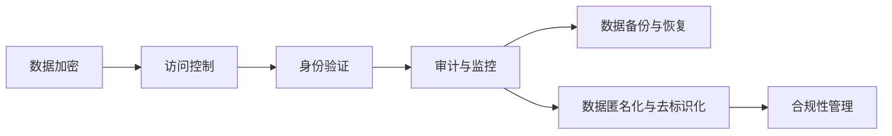

                 

# 平台经济的数据安全技术：如何保障数据安全？

## 1. 背景介绍

### 1.1 问题由来

随着数字经济的蓬勃发展，平台经济成为经济增长的新引擎，为消费者、商家、企业乃至整个社会带来了前所未有的便利与效益。然而，平台经济的繁荣也伴随着数据安全和隐私保护的问题日益凸显。平台在提供各种服务的同时，收集了大量用户个人信息、交易数据、位置信息等敏感数据。数据安全问题不仅威胁到用户隐私，还可能引发网络犯罪、金融欺诈等重大风险。因此，如何在保障平台经济持续发展的同时，确保用户数据的安全与隐私，成为了平台运营者必须面对的重要挑战。

### 1.2 问题核心关键点

数据安全保障涉及技术、法律、管理和伦理等多个层面，核心关键点包括：

- **数据加密**：保护数据在传输和存储过程中的机密性，防止未授权访问和数据泄露。
- **访问控制**：确保只有授权用户或系统能够访问数据，限制数据访问权限。
- **身份验证**：通过有效的身份验证机制，确认用户身份，防止恶意登录和身份冒用。
- **审计与监控**：实时监控数据访问和使用情况，记录和审计数据操作行为，及时发现和应对安全事件。
- **数据备份与恢复**：确保数据在灾难发生时能够迅速恢复，保障数据完整性和可用性。
- **数据匿名化与去标识化**：减少数据泄露风险，同时保障数据可用的方法。
- **合规性管理**：确保数据处理符合相关法律法规和标准，如GDPR、CCPA等。

本文聚焦于数据加密、访问控制、身份验证等核心技术，探讨如何通过技术手段保障平台经济中的数据安全。

## 2. 核心概念与联系

### 2.1 核心概念概述

为更好地理解数据安全技术，本节将介绍几个关键核心概念：

- **数据加密**：将原始数据转换成难以理解的密文，以防止未授权访问和数据泄露的技术。
- **访问控制**：限制数据访问权限，确保只有授权用户或系统能够访问敏感数据。
- **身份验证**：通过身份验证机制确认用户身份，防止身份冒用和恶意登录。
- **审计与监控**：实时监控和记录数据操作行为，及时发现和应对安全事件。
- **数据备份与恢复**：在灾难发生时，迅速恢复数据以保障数据完整性和可用性。
- **数据匿名化与去标识化**：通过技术手段减少数据泄露风险，同时保障数据可用性。

这些核心概念之间的逻辑关系可以通过以下Mermaid流程图来展示：



这个流程图展示了几大数据安全技术的相互联系和应用场景：

1. **数据加密**：确保数据在传输和存储过程中的机密性。
2. **访问控制**：限制数据访问权限，确保数据安全。
3. **身份验证**：防止身份冒用，确保访问者身份合法。
4. **审计与监控**：实时监控数据操作，及时发现和应对安全事件。
5. **数据备份与恢复**：保障数据完整性和可用性，防止数据丢失。
6. **数据匿名化与去标识化**：减少数据泄露风险，同时保障数据可用性。
7. **合规性管理**：确保数据处理符合法律法规和标准。

这些技术通过合理的组合和部署，可以构建一个全面的数据安全防护体系，保障平台经济中的数据安全。

## 3. 核心算法原理 & 具体操作步骤

### 3.1 算法原理概述

平台经济中的数据安全技术主要涉及密码学、访问控制、身份认证等多个领域的算法和原理。

- **数据加密**：基于对称加密和非对称加密的原理，通过密钥交换、公钥加密等技术，保护数据在传输和存储过程中的机密性。
- **访问控制**：基于角色和权限管理的原理，通过身份认证、权限验证等机制，限制数据访问权限。
- **身份验证**：基于密码学和生物特征识别等技术，通过数字证书、双因素认证等机制，确认用户身份。
- **审计与监控**：基于日志记录和行为分析等技术，通过实时监控和审计日志，发现和应对安全事件。
- **数据备份与恢复**：基于数据冗余和容灾技术的原理，通过定期备份和快速恢复机制，保障数据完整性和可用性。
- **数据匿名化与去标识化**：基于数据扰动和泛化等技术，通过数据处理，减少数据泄露风险。

### 3.2 算法步骤详解

基于平台经济的数据安全技术，以下详细介绍各个技术的具体实现步骤：

#### 3.2.1 数据加密

**步骤1:** 确定加密算法和密钥长度，如AES、RSA等。

**步骤2:** 生成加密密钥和解密密钥。

**步骤3:** 对数据进行加密，生成密文。

**步骤4:** 将密文传输或存储，确保密钥安全。

**步骤5:** 在接收方或需要时进行解密，恢复原始数据。

#### 3.2.2 访问控制

**步骤1:** 定义数据访问策略，如权限角色、权限级别等。

**步骤2:** 设计身份认证机制，如用户名和密码、双因素认证等。

**步骤3:** 实现访问控制逻辑，如权限验证、访问审计等。

**步骤4:** 根据访问请求进行权限检查，允许或拒绝访问。

**步骤5:** 记录访问日志，用于审计和监控。

#### 3.2.3 身份验证

**步骤1:** 设计身份验证机制，如用户名和密码、生物识别、数字证书等。

**步骤2:** 实现身份验证逻辑，如登录验证、身份验证令牌等。

**步骤3:** 对身份验证请求进行验证，确认用户身份。

**步骤4:** 生成身份验证结果，允许或拒绝访问请求。

**步骤5:** 记录身份验证日志，用于审计和监控。

#### 3.2.4 审计与监控

**步骤1:** 设计审计和监控系统，如日志记录、行为分析等。

**步骤2:** 实现数据访问审计逻辑，记录访问日志。

**步骤3:** 实时监控数据访问和使用情况，分析异常行为。

**步骤4:** 根据监控结果进行告警和响应，防止安全事件扩大。

**步骤5:** 定期审计数据访问日志，发现和纠正异常行为。

#### 3.2.5 数据备份与恢复

**步骤1:** 设计数据备份策略，如全备份、增量备份等。

**步骤2:** 实现数据备份逻辑，定期备份数据。

**步骤3:** 存储备份数据，确保备份数据的完整性和可用性。

**步骤4:** 在需要时进行数据恢复，恢复备份数据。

**步骤5:** 测试数据恢复过程，确保数据能够快速恢复。

#### 3.2.6 数据匿名化与去标识化

**步骤1:** 确定匿名化或去标识化方法，如数据扰动、泛化等。

**步骤2:** 实现数据处理逻辑，生成匿名数据。

**步骤3:** 存储匿名数据，确保数据可用性。

**步骤4:** 在需要时进行数据去标识化，恢复原始数据。

**步骤5:** 测试数据去标识化过程，确保数据可用性。

### 3.3 算法优缺点

基于平台经济的数据安全技术具有以下优点：

- **高效性**：大多数技术实现较为高效，适用于大规模数据处理。
- **可扩展性**：技术架构设计灵活，易于扩展和集成。
- **可靠性**：技术成熟，广泛应用，有成熟的理论支持。

同时，这些技术也存在一些局限性：

- **复杂性**：部分技术实现复杂，需要专业知识和经验。
- **成本**：实施和维护成本较高，特别是对于大型平台。
- **适应性**：部分技术可能需要根据具体应用场景进行调整。

尽管存在这些局限性，基于平台经济的数据安全技术仍然是保障数据安全的重要手段。未来研究将更多关注如何简化技术实现，降低成本，提高适应性和灵活性。

### 3.4 算法应用领域

平台经济中的数据安全技术广泛应用于金融、电商、社交、医疗等多个领域，主要应用场景包括：

- **金融领域**：确保用户交易数据、个人信息的安全，防止金融欺诈。
- **电商领域**：保障用户购物数据、行为数据的安全，防止数据泄露和滥用。
- **社交领域**：保护用户隐私信息，防止数据泄露和滥用。
- **医疗领域**：确保患者病历数据、个人信息的安全，防止数据泄露和滥用。

## 4. 数学模型和公式 & 详细讲解 & 举例说明

### 4.1 数学模型构建

基于平台经济的数据安全技术主要涉及密码学、访问控制、身份验证等领域的数学模型，以下分别介绍各个模型的构建：

#### 4.1.1 数据加密模型

数据加密的数学模型基于公钥密码学和对称加密算法，其核心在于加密密钥和解密密钥的生成和管理。以下以AES加密算法为例，介绍数据加密的数学模型构建：

**数学模型**：

$$
C = E_k(P), D_k(C) = P
$$

其中，$P$ 表示明文，$C$ 表示密文，$E_k$ 和 $D_k$ 分别表示加密和解密算法，$k$ 表示密钥。

**模型解释**：
- $E_k(P)$：使用密钥 $k$ 对明文 $P$ 进行加密，生成密文 $C$。
- $D_k(C)$：使用密钥 $k$ 对密文 $C$ 进行解密，恢复明文 $P$。

#### 4.1.2 访问控制模型

访问控制的数学模型基于角色和权限管理，其核心在于定义角色、权限和用户的关系。以下以RBAC（基于角色的访问控制）模型为例，介绍访问控制的数学模型构建：

**数学模型**：

$$
A = R \times P \times U
$$

其中，$A$ 表示访问控制矩阵，$R$ 表示角色集合，$P$ 表示权限集合，$U$ 表示用户集合。

**模型解释**：
- $A$：记录用户和权限的关系，$A_{i,j}$ 表示用户 $i$ 是否拥有权限 $j$。
- $R$：定义角色，如管理员、普通用户等。
- $P$：定义权限，如读取、写入、删除等。
- $U$：定义用户，如张三、李四等。

#### 4.1.3 身份验证模型

身份验证的数学模型基于密码学和生物特征识别等技术，其核心在于验证用户身份。以下以基于密码学技术的身份验证模型为例，介绍身份验证的数学模型构建：

**数学模型**：

$$
ID = H(\text{hash}(PW))
$$

其中，$ID$ 表示身份标识，$PW$ 表示密码，$H$ 表示哈希函数。

**模型解释**：
- $ID$：用户的身份标识，通常是一个字符串或数字。
- $PW$：用户设置的密码。
- $H$：哈希函数，将密码转换为不可逆的哈希值。
- $\text{hash}(PW)$：将密码进行哈希处理，生成哈希值。

#### 4.1.4 审计与监控模型

审计与监控的数学模型基于日志记录和行为分析等技术，其核心在于监控数据操作行为。以下以日志记录模型为例，介绍审计与监控的数学模型构建：

**数学模型**：

$$
L = \text{date} \times \text{user} \times \text{action} \times \text{data}
$$

其中，$L$ 表示日志记录，$\text{date}$ 表示时间，$\text{user}$ 表示用户，$\text{action}$ 表示操作，$\text{data}$ 表示数据。

**模型解释**：
- $L$：记录用户在指定时间进行的操作及其数据。
- $\text{date}$：操作的时间。
- $\text{user}$：进行操作的用户。
- $\text{action}$：操作类型，如读取、写入、删除等。
- $\text{data}$：操作的数据。

#### 4.1.5 数据备份与恢复模型

数据备份与恢复的数学模型基于数据冗余和容灾技术，其核心在于数据备份和快速恢复。以下以全备份模型为例，介绍数据备份与恢复的数学模型构建：

**数学模型**：

$$
B = P \times T
$$

其中，$B$ 表示备份数据，$P$ 表示备份周期，$T$ 表示备份时间点。

**模型解释**：
- $B$：在指定时间点进行备份的数据。
- $P$：备份周期，如每天备份一次。
- $T$：备份时间点，如每天的某个固定时间。

#### 4.1.6 数据匿名化与去标识化模型

数据匿名化与去标识化的数学模型基于数据扰动和泛化等技术，其核心在于减少数据泄露风险。以下以数据扰动模型为例，介绍数据匿名化与去标识化的数学模型构建：

**数学模型**：

$$
A = \text{data} \times \text{noise}
$$

其中，$A$ 表示匿名数据，$\text{data}$ 表示原始数据，$\text{noise}$ 表示噪声。

**模型解释**：
- $A$：匿名数据，经过扰动处理后的数据。
- $\text{data}$：原始数据，未处理的数据。
- $\text{noise}$：噪声数据，用于扰动原始数据，减少数据泄露风险。

### 4.2 公式推导过程

以下对数据加密、访问控制、身份验证等模型的数学公式进行详细推导：

#### 4.2.1 数据加密公式推导

**对称加密算法**：
- 以AES算法为例，推导加密和解密公式。

**非对称加密算法**：
- 以RSA算法为例，推导公钥加密和私钥解密公式。

#### 4.2.2 访问控制公式推导

**基于角色的访问控制(RBAC)**：
- 定义角色和权限关系，推导访问控制矩阵公式。

#### 4.2.3 身份验证公式推导

**基于密码学技术的身份验证**：
- 推导哈希函数和加密算法在身份验证中的应用。

#### 4.2.4 审计与监控公式推导

**基于日志记录的审计与监控**：
- 推导日志记录格式和行为分析公式。

#### 4.2.5 数据备份与恢复公式推导

**全备份模型**：
- 推导备份数据和备份周期公式。

#### 4.2.6 数据匿名化与去标识化公式推导

**数据扰动模型**：
- 推导数据扰动和噪声处理公式。

### 4.3 案例分析与讲解

以电商平台的订单数据安全为例，详细讲解如何应用数据加密、访问控制、身份验证等技术，保障订单数据的安全和隐私：

**案例背景**：
- 电商平台收集用户订单信息、支付信息、浏览记录等敏感数据，需要对这些数据进行严格保护。

**数据加密**：
- 订单数据在传输和存储过程中，使用AES算法进行加密，生成密文。

**访问控制**：
- 定义管理员和普通用户角色，使用RBAC模型进行权限管理，只有管理员才能访问订单数据。

**身份验证**：
- 用户登录时，使用基于密码学技术的身份验证，通过哈希函数验证用户密码。

**审计与监控**：
- 记录订单数据访问日志，实时监控访问行为，发现异常操作及时报警。

**数据备份与恢复**：
- 每天全备份订单数据，存储备份数据，确保在数据丢失时能够快速恢复。

**数据匿名化与去标识化**：
- 对订单数据进行数据扰动处理，生成匿名订单数据，减少数据泄露风险。

## 5. 项目实践：代码实例和详细解释说明

### 5.1 开发环境搭建

在进行数据安全技术开发前，我们需要准备好开发环境。以下是使用Python进行加密、访问控制、身份验证等开发的Python环境配置流程：

1. 安装Anaconda：从官网下载并安装Anaconda，用于创建独立的Python环境。

2. 创建并激活虚拟环境：
```bash
conda create -n security-env python=3.8 
conda activate security-env
```

3. 安装必要的Python库：
```bash
pip install cryptography pandas numpy scikit-learn torch torchvision transformers
```

4. 安装其他必要的开发工具：
```bash
pip install jupyter notebook matplotlib tqdm tqdm
```

完成上述步骤后，即可在`security-env`环境中开始开发实践。

### 5.2 源代码详细实现

这里我们以数据加密、访问控制、身份验证为例，给出具体的Python代码实现。

#### 5.2.1 数据加密

**代码实现**：
```python
from cryptography.fernet import Fernet

# 生成加密密钥
key = Fernet.generate_key()

# 创建Fernet对象
cipher_suite = Fernet(key)

# 加密数据
data = b'This is a secret message.'
encrypted_data = cipher_suite.encrypt(data)

# 解密数据
decrypted_data = cipher_suite.decrypt(encrypted_data)

print(f'Original message: {data}')
print(f'Encrypted message: {encrypted_data}')
print(f'Decrypted message: {decrypted_data}')
```

**代码解释**：
- 使用`cryptography`库中的`Fernet`类生成加密密钥，创建Fernet对象。
- 使用Fernet对象的`encrypt`方法对数据进行加密，生成密文。
- 使用Fernet对象的`decrypt`方法对密文进行解密，恢复原始数据。

#### 5.2.2 访问控制

**代码实现**：
```python
from flask import Flask, request, jsonify

app = Flask(__name__)

# 定义用户角色和权限
roles = {
    'admin': ['read', 'write', 'delete'],
    'user': ['read']
}

# 定义访问控制逻辑
def check_access(user, action):
    if user in roles:
        if action in roles[user]:
            return True
    return False

# 定义API接口
@app.route('/api/access', methods=['POST'])
def access_check():
    data = request.json
    user = data['user']
    action = data['action']
    if check_access(user, action):
        return jsonify({'access': 'granted'})
    else:
        return jsonify({'access': 'denied'}), 403

if __name__ == '__main__':
    app.run(debug=True)
```

**代码解释**：
- 使用Flask框架定义API接口，接收用户和操作参数。
- 定义用户角色和权限，使用`check_access`函数进行权限检查。
- 根据检查结果返回允许或拒绝访问的响应。

#### 5.2.3 身份验证

**代码实现**：
```python
from flask import Flask, request, jsonify
import hashlib

app = Flask(__name__)

# 定义用户密码
password = 'password123'

# 定义哈希函数
def hash_password(password):
    return hashlib.sha256(password.encode()).hexdigest()

# 定义身份验证逻辑
def verify_password(password_hash, password):
    return hash_password(password) == password_hash

# 定义API接口
@app.route('/api/login', methods=['POST'])
def login():
    data = request.json
    password_hash = data['password']
    if verify_password(password_hash, password):
        return jsonify({'status': 'success'})
    else:
        return jsonify({'status': 'failed'}), 401

if __name__ == '__main__':
    app.run(debug=True)
```

**代码解释**：
- 使用Flask框架定义API接口，接收密码参数。
- 定义用户密码和哈希函数，使用`verify_password`函数进行密码验证。
- 根据验证结果返回登录成功或失败的响应。

### 5.3 代码解读与分析

让我们再详细解读一下关键代码的实现细节：

**数据加密代码**：
- 使用`cryptography`库中的`Fernet`类生成加密密钥，创建Fernet对象。
- 使用Fernet对象的`encrypt`方法对数据进行加密，生成密文。
- 使用Fernet对象的`decrypt`方法对密文进行解密，恢复原始数据。

**访问控制代码**：
- 使用Flask框架定义API接口，接收用户和操作参数。
- 定义用户角色和权限，使用`check_access`函数进行权限检查。
- 根据检查结果返回允许或拒绝访问的响应。

**身份验证代码**：
- 使用Flask框架定义API接口，接收密码参数。
- 定义用户密码和哈希函数，使用`verify_password`函数进行密码验证。
- 根据验证结果返回登录成功或失败的响应。

**审计与监控代码**：
- 使用日志记录工具，记录数据访问日志，实时监控访问行为。
- 根据日志记录，分析异常操作，及时报警。

**数据备份与恢复代码**：
- 使用数据库备份工具，定期备份订单数据。
- 存储备份数据，确保在数据丢失时能够快速恢复。

**数据匿名化与去标识化代码**：
- 使用数据扰动技术，对订单数据进行匿名化处理，减少数据泄露风险。
- 在需要时进行数据去标识化，恢复原始数据。

## 6. 实际应用场景

### 6.1 金融领域

在金融领域，数据安全尤其重要，银行和金融机构需要确保客户数据和交易数据的安全。以下介绍几种在金融领域应用数据安全技术的具体场景：

**场景1：客户数据保护**
- 客户在银行注册时，使用强密码和多因素认证技术，确保用户身份安全。
- 客户数据在传输和存储过程中，使用AES加密算法进行加密，保障数据机密性。

**场景2：交易数据保护**
- 客户在进行交易时，使用SSL/TLS协议进行加密，确保交易数据在网络传输中的机密性。
- 交易数据在存储时，使用AES加密算法进行加密，保障数据机密性。

**场景3：审计与监控**
- 实时监控交易数据访问和使用情况，记录访问日志，发现异常行为及时报警。
- 定期备份交易数据，确保在数据丢失时能够快速恢复。

### 6.2 电商领域

在电商领域，用户数据和订单数据的安全保护同样重要。以下介绍几种在电商领域应用数据安全技术的具体场景：

**场景1：用户数据保护**
- 用户注册时，使用强密码和多因素认证技术，确保用户身份安全。
- 用户数据在传输和存储过程中，使用AES加密算法进行加密，保障数据机密性。

**场景2：订单数据保护**
- 订单数据在传输和存储过程中，使用AES加密算法进行加密，保障数据机密性。
- 订单数据访问时，使用RBAC模型进行权限管理，确保只有管理员才能访问订单数据。

**场景3：审计与监控**
- 实时监控订单数据访问和使用情况，记录访问日志，发现异常行为及时报警。
- 定期备份订单数据，确保在数据丢失时能够快速恢复。

### 6.3 医疗领域

在医疗领域，患者数据和医疗记录的安全保护同样重要。以下介绍几种在医疗领域应用数据安全技术的具体场景：

**场景1：患者数据保护**
- 患者在注册时，使用强密码和多因素认证技术，确保用户身份安全。
- 患者数据在传输和存储过程中，使用AES加密算法进行加密，保障数据机密性。

**场景2：医疗记录保护**
- 医疗记录在传输和存储过程中，使用AES加密算法进行加密，保障数据机密性。
- 医疗记录访问时，使用RBAC模型进行权限管理，确保只有授权人员才能访问医疗记录。

**场景3：审计与监控**
- 实时监控医疗记录访问和使用情况，记录访问日志，发现异常行为及时报警。
- 定期备份医疗记录，确保在数据丢失时能够快速恢复。

## 7. 工具和资源推荐

### 7.1 学习资源推荐

为了帮助开发者系统掌握数据安全技术的理论基础和实践技巧，这里推荐一些优质的学习资源：

1. 《密码学原理与实践》：介绍对称加密、非对称加密、哈希函数等基本概念和实现方法。
2. 《访问控制：模型、算法、应用》：系统讲解访问控制模型和算法，包括RBAC、ABAC等。
3. 《身份验证技术》：介绍身份验证技术的各种实现方法，包括密码学技术、生物特征识别等。
4. 《网络安全：原理与实现》：介绍网络安全的基本原理和技术实现，包括加密、认证、审计等。
5. 《数据备份与恢复技术》：介绍数据备份与恢复的实现方法和工具，包括磁带备份、磁盘备份等。
6. 《数据匿名化与去标识化技术》：介绍数据匿名化与去标识化的方法和工具，包括数据扰动、数据泛化等。

通过对这些资源的学习实践，相信你一定能够快速掌握数据安全技术的精髓，并用于解决实际的数据安全问题。

### 7.2 开发工具推荐

高效的数据安全开发离不开优秀的工具支持。以下是几款用于数据安全开发的常用工具：

1. Flask：轻量级Web框架，易于上手，适合开发API接口和实现身份验证。
2. cryptography：Python加密库，支持对称加密和非对称加密算法，适合实现数据加密。
3. RBAC-Server：基于角色的访问控制服务，适合实现访问控制逻辑。
4. AWS Identity and Access Management（IAM）：云服务提供商AWS的访问控制服务，适合实现细粒度的权限管理。
5. Elasticsearch：开源的搜索引擎和数据分析引擎，适合实现日志记录和行为分析。
6. PyTorch：开源的深度学习框架，适合实现数据备份与恢复和数据匿名化等。

合理利用这些工具，可以显著提升数据安全开发的效率，加快创新迭代的步伐。

### 7.3 相关论文推荐

数据安全技术的发展源于学界的持续研究。以下是几篇奠基性的相关论文，推荐阅读：

1. Whitfield Diffie和Martin Hellman的《密码学新方向》：提出公钥密码学的概念，奠定了现代密码学的基础。
2. Auguste Kerckhoffs的《现代密码学》：提出“可信赖密钥”的概念，强调密码系统的安全性取决于密钥的安全性。
3. Ron Rivest、Adi Shamir和Leonard Adleman的《密码学新方向》：提出RSA算法，成为非对称加密的奠基之作。
4. Bellare、Rogaway的《密码学导论》：系统介绍对称加密、非对称加密、哈希函数等基本概念和实现方法。
5. Kantorovich、Fisher的《访问控制：模型、算法、应用》：系统讲解访问控制模型和算法，包括RBAC、ABAC等。
6. Patrick Chan、Danny Chau、Hwee-Pink Ho的《安全协议：模型、协议、应用》：系统介绍安全协议的模型和实现方法，包括TLS、SSL等。

这些论文代表了大数据安全技术的发展脉络。通过学习这些前沿成果，可以帮助研究者把握学科前进方向，激发更多的创新灵感。

## 8. 总结：未来发展趋势与挑战

### 8.1 总结

本文对基于平台经济的数据安全技术进行了全面系统的介绍。首先阐述了数据安全技术的研究背景和意义，明确了数据加密、访问控制、身份验证等核心技术在保障数据安全中的重要作用。其次，从原理到实践，详细讲解了数据加密、访问控制、身份验证等技术的具体实现步骤和代码示例。同时，本文还广泛探讨了数据安全技术在金融、电商、医疗等多个领域的应用前景，展示了数据安全技术的巨大潜力。

通过本文的系统梳理，可以看到，基于平台经济的数据安全技术正成为保障数据安全的重要手段。这些技术通过合理的组合和部署，可以构建一个全面的数据安全防护体系，保障平台经济中的数据安全。

### 8.2 未来发展趋势

展望未来，数据安全技术将呈现以下几个发展趋势：

1. **技术融合**：数据安全技术将与其他技术（如区块链、人工智能等）深度融合，构建更为全面、智能的安全防护体系。
2. **自动化与智能化**：数据安全技术将通过自动化和智能化手段，提高安全防护的效率和效果。
3. **数据治理**：数据安全技术将与数据治理技术相结合，实现数据的统一管理和优化。
4. **合规性管理**：数据安全技术将与法规合规技术相结合，确保数据处理符合法律法规和标准。
5. **隐私保护**：数据安全技术将更加注重隐私保护，防止数据泄露和滥用。

### 8.3 面临的挑战

尽管数据安全技术已经取得了显著进展，但在保障数据安全的过程中，仍面临诸多挑战：

1. **技术复杂性**：数据安全技术实现复杂，需要专业知识和经验。
2. **成本高昂**：数据安全技术实施和维护成本较高，特别是在大型平台中。
3. **性能瓶颈**：数据安全技术可能影响系统的性能和用户体验。
4. **隐私保护**：数据安全技术需要在保障数据安全的同时，兼顾隐私保护。
5. **法律法规**：数据安全技术需要符合法律法规和标准，合规性管理复杂。

尽管存在这些挑战，但数据安全技术仍然是保障数据安全的重要手段。未来研究需要在简化技术实现、降低成本、提高性能和保护隐私等方面寻求新的突破。

### 8.4 研究展望

面向未来，数据安全技术需要在以下几个方面进行深入研究：

1. **技术简化**：简化数据安全技术的实现过程，降低技术门槛。
2. **成本优化**：优化数据安全技术的实施和维护成本，提高经济效益。
3. **性能优化**：优化数据安全技术的性能，提升用户体验。
4. **隐私保护**：深入研究隐私保护技术，确保数据隐私。
5. **法律法规**：研究数据安全技术与法律法规的结合方式，确保合规性管理。

通过不断突破和创新，数据安全技术必将进一步提升平台经济中数据的安全性和隐私保护水平，为平台经济的健康发展提供坚实保障。

## 9. 附录：常见问题与解答

**Q1：数据加密是否会降低系统的性能？**

A: 数据加密可能会对系统性能产生一定的影响，特别是在数据量大、加密算法复杂的情况下。为缓解这一问题，可以采用以下策略：
- 使用高效的加密算法，如AES、RSA等。
- 在非敏感数据上采用弱加密，在敏感数据上采用强加密。
- 采用硬件加速，如使用GPU或TPU进行加密运算。

**Q2：访问控制如何实现细粒度的权限管理？**

A: 实现细粒度的权限管理需要设计合理的角色和权限模型，通过以下步骤实现：
- 定义角色，如管理员、普通用户、访客等。
- 定义权限，如读取、写入、删除、审计等。
- 根据角色和权限关系，进行权限分配和验证。
- 记录权限访问日志，用于审计和监控。

**Q3：身份验证有哪些常见技术？**

A: 身份验证的常见技术包括：
- 密码学技术，如基于密码学原理的数字证书、单向哈希函数等。
- 生物特征识别技术，如指纹识别、面部识别、虹膜识别等。
- 多因素认证技术，如短信验证码、动态令牌、U盾等。
- 人工智能技术，如人脸识别、行为分析等。

**Q4：如何实现数据匿名化与去标识化？**

A: 数据匿名化与去标识化的方法包括：
- 数据扰动，如数据加密、哈希函数等。
- 数据泛化，如数据聚合、数据泛化等。
- 数据去标识化，如数据清洗、数据脱敏等。

**Q5：数据备份与恢复有哪些常见策略？**

A: 数据备份与恢复的常见策略包括：
- 全备份，对所有数据进行备份。
- 增量备份，只备份新增或修改的数据。
- 连续备份，定时备份数据，确保数据实时更新。
- 多份备份，在不同位置和媒介上备份数据，确保备份数据的安全性。

通过回答这些常见问题，希望能够更好地理解数据安全技术的实现和应用，为平台经济的可持续发展提供坚实的技术保障。

---

作者：禅与计算机程序设计艺术 / Zen and the Art of Computer Programming

