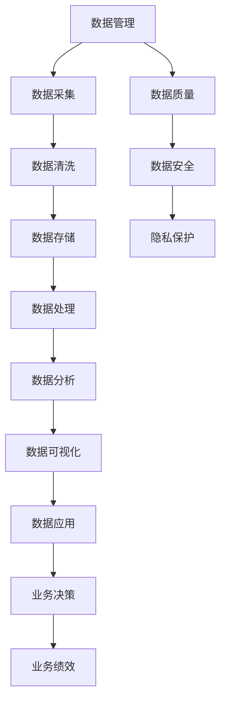

                 

## 1. 背景介绍

在当今数字经济时代，平台经济蓬勃发展，成为驱动经济增长、优化资源配置的重要力量。平台型企业，如电商、社交、娱乐、出行等行业巨头，依托其庞大的用户基数和丰富的业务场景，形成了极为复杂多变的数据环境。如何高效治理这些数据，不仅关系到平台的运营效率和用户体验，更是决定了平台在激烈市场竞争中的生存和可持续发展。

然而，平台经济的数据治理面临着诸多挑战。数据量大且异构，业务场景复杂且动态，用户隐私和数据安全要求高，数据质量问题频出等，都对数据治理提出了更高的要求。因此，如何建立健全的数据管理体系，成为平台型企业的重要课题。

## 2. 核心概念与联系

### 2.1 核心概念概述

平台经济的数据治理，涉及数据采集、存储、处理、分析和应用等多个环节，涵盖数据管理、数据质量、数据安全和隐私保护等多个方面。以下是几个核心概念及其关联关系：

- **数据管理**：通过系统化手段，对数据进行分类、整理、存储和检索，确保数据的有序、完整和可用性。
- **数据质量**：保证数据的准确性、一致性、完整性、及时性和可用性，确保数据在应用中的可靠性。
- **数据安全**：防范数据泄露、破坏和非法使用，保护用户隐私和企业数据资产。
- **隐私保护**：确保个人隐私数据不被未经授权的第三方使用，符合法律法规和道德标准。
- **数据应用**：通过数据分析、挖掘、可视化等手段，将数据转化为洞察和价值，驱动业务决策。

这些核心概念之间相互联系、相互影响，共同构成了平台经济数据治理的全方位框架。

### 2.2 核心概念原理和架构的 Mermaid 流程图



## 3. 核心算法原理 & 具体操作步骤

### 3.1 算法原理概述

平台经济的数据治理，主要依赖于数据管理的核心算法和具体操作步骤。其核心思想是通过系统化的管理策略和高效的工具，对平台上的海量数据进行梳理、清洗、整合和应用，确保数据的质量和安全性。

算法原理主要包括以下几个方面：

- **数据分类与标注**：对数据进行分类和标注，建立标准化的数据模型。
- **数据清洗与标准化**：去除重复、错误、缺失和不一致的数据，进行格式转换和归一化。
- **数据存储与分布式管理**：使用分布式存储技术，如Hadoop、Spark等，实现海量数据的存储和管理。
- **数据处理与计算**：利用流式计算、批处理等技术，对数据进行高效处理和计算。
- **数据分析与机器学习**：通过机器学习算法，进行数据挖掘和预测分析，发现数据中的规律和趋势。
- **数据可视化和报表**：使用可视化工具，将分析结果以图表和报表形式展现，便于业务决策。

### 3.2 算法步骤详解

平台经济的数据治理主要分为以下几个步骤：

#### 步骤1：数据收集与预处理

1. **数据收集**：
   - 通过API接口、爬虫、日志等手段，收集业务数据、用户数据和外部数据。
   - 数据源应包括但不限于订单、交易记录、用户行为数据、公共数据等。

2. **数据预处理**：
   - 数据清洗：去除重复、错误、缺失和不一致的数据。
   - 数据转换：将原始数据转换为统一格式和标准，方便后续处理。
   - 数据规范化：对数据进行归一化处理，消除单位、精度等差异。

#### 步骤2：数据存储与管理

1. **数据存储架构**：
   - 使用分布式存储系统，如Hadoop、Spark、Elasticsearch等，实现海量数据的存储和管理。
   - 数据仓库与数据湖：根据数据的使用频率和生命周期，合理选择数据仓库和数据湖。

2. **数据管理策略**：
   - 数据分类与分级：根据数据的敏感性和重要性，进行分类与分级管理。
   - 数据权限与访问控制：设置数据访问权限，防止未授权访问和数据泄露。
   - 数据备份与恢复：定期备份数据，确保数据安全，并提供快速恢复机制。

#### 步骤3：数据分析与挖掘

1. **数据分析框架**：
   - 使用Spark、Flink、Kafka等分布式计算框架，实现数据的批处理和流处理。
   - 引入机器学习工具，如Scikit-learn、TensorFlow、PyTorch等，进行数据挖掘和建模。

2. **数据挖掘与分析**：
   - 数据关联分析：通过关联分析，挖掘数据之间的内在关系和规律。
   - 数据预测分析：使用预测模型，对未来趋势进行预测和推断。
   - 数据可视化：使用可视化工具，如Tableau、Power BI等，展现数据分析结果。

#### 步骤4：数据应用与监控

1. **数据应用**：
   - 将分析结果应用于业务决策，如市场分析、用户画像、推荐系统等。
   - 数据驱动的决策模型，如A/B测试、推荐算法、预测模型等。

2. **数据监控**：
   - 实时监控数据质量、系统性能和业务指标，及时发现和解决数据问题。
   - 引入监控工具，如Prometheus、Grafana等，实现自动化监控和管理。

### 3.3 算法优缺点

平台经济的数据治理算法具有以下优点：

- **高效性**：通过分布式计算和存储，实现海量数据的快速处理和存储。
- **灵活性**：支持数据分类、标注和标准化，满足不同业务场景的需求。
- **可靠性**：通过数据备份和恢复机制，保障数据的安全性和完整性。

同时，也存在一些缺点：

- **复杂性**：数据治理涉及多个环节和工具，实施和管理较为复杂。
- **成本高**：建设数据治理系统需要高昂的技术和人力投入。
- **技术门槛高**：需要具备数据管理和分布式计算等技术能力。

### 3.4 算法应用领域

平台经济的数据治理算法在以下几个领域得到了广泛应用：

- **电商**：通过数据分析，优化商品推荐、库存管理和定价策略。
- **金融**：通过数据挖掘和预测分析，提高风险评估和客户管理。
- **社交**：通过用户画像和情感分析，提升用户体验和内容推荐。
- **娱乐**：通过数据关联和预测分析，优化游戏体验和内容分发。
- **出行**：通过数据融合和实时分析，提高行程规划和调度效率。

## 4. 数学模型和公式 & 详细讲解 & 举例说明

### 4.1 数学模型构建

平台经济的数据治理模型通常包括以下几个模块：

- **数据采集模块**：用于收集数据，建立数据模型。
- **数据清洗模块**：去除数据中的噪声和错误，进行数据转换和规范化。
- **数据存储模块**：使用分布式存储技术，实现数据的可靠存储和管理。
- **数据分析模块**：利用机器学习算法，进行数据挖掘和预测分析。
- **数据可视化模块**：使用可视化工具，展现数据分析结果。

### 4.2 公式推导过程

以数据清洗为例，假设原始数据为 $D = (x_1, x_2, ..., x_n)$，其中 $x_i = (a_i, b_i, c_i)$。数据清洗的目标是去除缺失值、异常值和不一致值，转换为标准格式。

1. **缺失值处理**：
   - 使用均值或中位数填充缺失值：$\hat{x_i} = \frac{\sum x_i}{n}$。

2. **异常值检测**：
   - 使用Z-score方法检测异常值：$z_i = \frac{x_i - \mu}{\sigma}$，其中 $\mu$ 和 $\sigma$ 为均值和标准差。

3. **不一致值处理**：
   - 使用KNN算法修正不一致值：对于 $x_i = (a_i, b_i, c_i)$，找到与 $a_i$ 最近的 $k$ 个点，计算平均值作为修正值：$\hat{x_i} = \frac{1}{k} \sum_{j=1}^{k} x_j$。

### 4.3 案例分析与讲解

以电商平台的数据治理为例，分析具体流程：

1. **数据收集**：通过API接口收集订单数据、交易数据和用户行为数据。

2. **数据预处理**：去除重复订单和异常交易，将日期格式统一为ISO标准。

3. **数据存储**：使用Hadoop和Spark存储海量数据，建立数据仓库和数据湖。

4. **数据分析**：使用Spark进行批处理，Scikit-learn进行机器学习建模，预测用户购买意愿。

5. **数据应用**：将预测结果应用于推荐系统和广告投放，提升用户体验和转化率。

6. **数据监控**：使用Prometheus和Grafana实时监控数据质量、系统性能和业务指标。

## 5. 项目实践：代码实例和详细解释说明

### 5.1 开发环境搭建

平台经济的数据治理系统开发需要以下环境：

1. **编程语言**：Python、Java、Scala等。
2. **分布式计算框架**：Hadoop、Spark、Flink等。
3. **数据库系统**：MySQL、PostgreSQL、Hive等。
4. **数据可视化工具**：Tableau、Power BI、Grafana等。
5. **监控系统**：Prometheus、Nagios等。

### 5.2 源代码详细实现

以下是一个使用Python和Spark进行数据清洗的示例代码：

```python
from pyspark.sql import SparkSession
from pyspark.sql.functions import col, avg, stddev, array

# 创建SparkSession
spark = SparkSession.builder.appName('DataCleaning').getOrCreate()

# 读取数据
df = spark.read.format('csv').option('header', 'true').load('data.csv')

# 数据清洗
df_cleaned = df.dropDuplicates() \
    .drop('timestamp') \
    .select(col('user_id').alias('uid'), col('order_id').alias('oid'), col('amount').alias('amount'), col('date').alias('dt'), col('category').alias('cat')) \
    .withColumn('dt', col('date').cast('date')) \
    .withColumn('amount', col('amount').cast('float')) \
    .withColumn('avg_amount', avg('amount').over('partition(id)').alias('avg_amount')) \
    .withColumn('stddev_amount', stddev('amount').over('partition(id)').alias('stddev_amount')) \
    .withColumn('is_abnormal', array('uid', 'oid', 'amount', 'avg_amount', 'stddev_amount').filter(array.contains('is_abnormal')))

# 保存清洗后的数据
df_cleaned.write.format('csv').option('header', 'true').save('cleaned_data.csv')
```

### 5.3 代码解读与分析

该示例代码主要完成以下操作：

1. **创建SparkSession**：创建SparkSession，用于分布式数据处理。

2. **读取数据**：使用csv格式读取数据，去掉不必要的时间戳列。

3. **数据清洗**：
   - 去重：使用`dropDuplicates`方法去重。
   - 列选择：只保留必要列，如用户ID、订单ID、金额、日期和分类。
   - 数据转换：将日期列转换为日期类型，金额列转换为浮点数。
   - 计算均值和标准差：使用`avg`和`stddev`方法计算均值和标准差。
   - 异常值检测：使用`array`函数生成包含用户ID、订单ID、金额、均值和标准差的数组，并过滤出异常值。

4. **保存数据**：使用`write`方法将清洗后的数据保存到本地或分布式存储系统。

### 5.4 运行结果展示

运行上述代码后，将生成一个清洗后的数据文件，包含清洗后的数据记录。通过可视化工具，如Tableau，可以进一步进行数据分析和展示。

## 6. 实际应用场景

### 6.1 电商平台的订单数据分析

电商平台通过数据分析，可以优化商品推荐、库存管理和定价策略，提升用户体验和销售转化率。

1. **用户画像**：通过用户行为数据分析，构建用户画像，了解用户偏好和需求。
2. **商品推荐**：利用机器学习算法，进行商品推荐，提升用户购买意愿。
3. **库存管理**：通过数据分析，优化库存管理，避免缺货和积压。
4. **定价策略**：利用价格预测模型，优化商品定价，提升销售转化率。

### 6.2 金融领域的风险评估

金融企业通过数据分析，可以提升风险评估和客户管理，降低不良贷款率，提高企业盈利能力。

1. **风险评估**：通过数据分析，识别高风险客户，采取风险控制措施。
2. **客户管理**：利用客户画像，进行客户细分和精准营销。
3. **贷款审批**：利用信用评分模型，提升贷款审批效率和准确性。
4. **欺诈检测**：通过数据分析，检测和防范欺诈行为，保障企业资产安全。

### 6.3 社交平台的用户行为分析

社交平台通过数据分析，可以提升用户体验和内容推荐，增强用户粘性和平台活跃度。

1. **用户画像**：通过用户行为数据分析，构建用户画像，了解用户偏好和需求。
2. **内容推荐**：利用机器学习算法，进行内容推荐，提升用户满意度。
3. **社区管理**：通过数据分析，优化社区管理，提高平台活跃度。
4. **广告投放**：利用广告投放模型，提升广告投放效果和转化率。

### 6.4 娱乐行业的用户行为分析

娱乐企业通过数据分析，可以优化游戏体验和内容分发，提升用户粘性和平台收入。

1. **用户画像**：通过用户行为数据分析，构建用户画像，了解用户偏好和需求。
2. **游戏推荐**：利用机器学习算法，进行游戏推荐，提升用户留存率。
3. **内容优化**：通过数据分析，优化游戏和内容，提升用户体验。
4. **广告投放**：利用广告投放模型，提升广告投放效果和转化率。

## 7. 工具和资源推荐

### 7.1 学习资源推荐

为了帮助开发者系统掌握平台经济的数据治理技术，以下是一些优质的学习资源：

1. **《数据治理：平台经济的数字化转型》**：全面介绍平台经济的数据治理框架和技术，涵盖数据收集、存储、处理、分析和应用等多个环节。

2. **《大数据与人工智能》**：介绍大数据和人工智能的基本概念和应用，涵盖数据管理、数据挖掘和机器学习等技术。

3. **《Spark大数据技术》**：详细介绍Spark的分布式计算框架和API使用，涵盖数据处理和分析等技术。

4. **《机器学习实战》**：通过实际案例，介绍机器学习算法的实现和应用，涵盖数据预处理、特征工程和模型训练等技术。

5. **《Hadoop实战》**：详细介绍Hadoop的分布式存储和计算框架，涵盖数据采集、存储和管理等技术。

### 7.2 开发工具推荐

平台经济的数据治理系统开发需要以下工具：

1. **分布式计算框架**：Hadoop、Spark、Flink等。
2. **数据库系统**：MySQL、PostgreSQL、Hive等。
3. **数据可视化工具**：Tableau、Power BI、Grafana等。
4. **监控系统**：Prometheus、Nagios等。

### 7.3 相关论文推荐

平台经济的数据治理技术不断发展，以下是几篇具有代表性的相关论文：

1. **《数据治理框架与实践》**：介绍数据治理的框架和最佳实践，涵盖数据管理、数据质量和数据安全等多个方面。

2. **《平台经济中的数据治理》**：通过案例分析，介绍平台经济中的数据治理方法，涵盖数据采集、存储、处理和应用等多个环节。

3. **《大数据技术在平台经济中的应用》**：介绍大数据技术在平台经济中的具体应用，涵盖数据处理、数据分析和数据可视化等多个方面。

## 8. 总结：未来发展趋势与挑战

### 8.1 研究成果总结

平台经济的数据治理技术在近年来取得了显著进展，涵盖数据采集、存储、处理、分析和应用等多个环节。通过系统化管理和高效工具，平台型企业能够高效治理海量数据，提升业务决策和运营效率。

### 8.2 未来发展趋势

未来，平台经济的数据治理技术将呈现以下几个发展趋势：

1. **数据治理自动化**：利用自动化工具和算法，实现数据治理的自动化和智能化。
2. **数据治理跨平台**：支持多平台、多数据源的数据治理，提升数据治理的灵活性和适应性。
3. **数据治理协同化**：引入数据治理平台，实现数据治理的协同管理和协作开发。
4. **数据治理标准化**：制定数据治理的标准和规范，确保数据治理的一致性和可重复性。

### 8.3 面临的挑战

尽管平台经济的数据治理技术取得了显著进展，但仍面临一些挑战：

1. **数据治理复杂性**：数据治理涉及多个环节和工具，实施和管理较为复杂。
2. **数据质量问题**：数据清洗、标准化和质量控制仍然是数据治理中的难点。
3. **数据安全与隐私**：数据安全与隐私保护仍是平台经济中亟待解决的问题。
4. **技术门槛高**：数据治理技术需要高水平的技术和专业知识。

### 8.4 研究展望

未来，平台经济的数据治理技术需要在以下几个方面进行探索：

1. **自动化和智能化**：引入自动化工具和算法，提升数据治理的效率和准确性。
2. **跨平台和协同化**：支持多平台、多数据源的数据治理，实现数据治理的协同管理和协作开发。
3. **标准化和规范化**：制定数据治理的标准和规范，确保数据治理的一致性和可重复性。
4. **安全和隐私保护**：加强数据安全和隐私保护，确保用户数据的安全和合法使用。

总之，平台经济的数据治理技术是提升平台运营效率和用户体验的重要手段。通过系统化管理和高效工具，平台型企业能够高效治理海量数据，提升业务决策和运营效率。未来，平台经济的数据治理技术仍需不断探索和创新，以应对日益复杂和多样化的数据环境。

## 9. 附录：常见问题与解答

**Q1: 什么是平台经济的数据治理？**

A: 平台经济的数据治理，是指通过系统化管理和高效工具，对平台上的海量数据进行梳理、清洗、整合和应用，确保数据的质量和安全性。

**Q2: 平台经济的数据治理主要包括哪些环节？**

A: 平台经济的数据治理主要包括以下环节：数据采集、数据清洗、数据存储、数据处理、数据分析和数据应用等。

**Q3: 平台经济的数据治理有哪些挑战？**

A: 平台经济的数据治理面临的主要挑战包括：数据治理复杂性、数据质量问题、数据安全与隐私、技术门槛高等。

**Q4: 如何提升平台经济的数据治理效率？**

A: 提升平台经济的数据治理效率，可以通过引入自动化工具和算法，实现数据治理的自动化和智能化。

**Q5: 未来平台经济的数据治理技术将如何发展？**

A: 未来平台经济的数据治理技术将朝着数据治理自动化、跨平台和协同化、标准化和规范化、安全和隐私保护等方向发展。

---

作者：禅与计算机程序设计艺术 / Zen and the Art of Computer Programming

