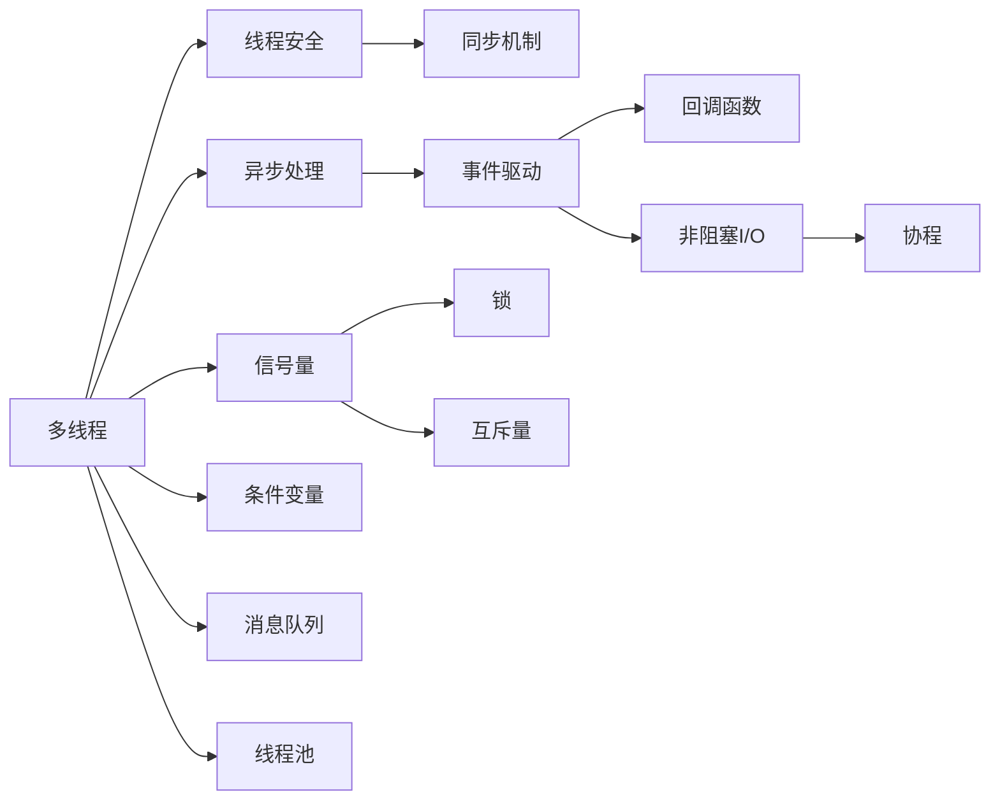
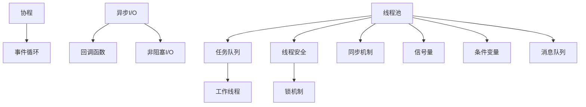

                 

## 1. 背景介绍

在当下这个多核处理器和分布式系统广为普及的时代，并发编程（Concurrency Programming）已经成为了软件开发的必备技能之一。从计算机科学的角度来看，并发编程可以显著提升程序的执行效率和响应速度。同时，随着互联网和移动设备的普及，系统对响应时间的期望也在不断提升。因此，如何高效地处理并发请求，并确保程序的可靠性和安全性，成为了软件开发人员面临的重要挑战。

本文将系统地介绍多线程和异步处理技术，探讨其在并发编程中的原理和应用，旨在帮助读者理解并发编程的基本概念，掌握其核心技术，从而提升编程能力和系统性能。

## 2. 核心概念与联系

### 2.1 核心概念概述

并发编程主要涉及两个核心概念：多线程（Multithreading）和异步处理（Asynchronous Processing）。多线程是利用操作系统提供的并发机制，在单核或多核处理器上同时执行多个线程。异步处理则是利用非阻塞式的I/O操作，在单线程环境下实现并发效果。

下面将从原理和架构的角度，用Mermaid流程图展示多线程和异步处理的核心概念及其相互关系：



该图展示了多线程和异步处理的关键组件及其相互关系：

- **线程安全**（Thread-Safe）：确保多个线程对共享资源的操作互斥，避免数据竞争。
- **同步机制**（Synchronization）：如锁、信号量等，用于控制线程之间的交互和协作。
- **事件驱动**（Event-Driven）：通过事件触发回调函数，实现异步操作。
- **非阻塞I/O**（Non-Blocking I/O）：使线程在等待I/O操作时，不会阻塞其他操作的执行。
- **协程**（Coroutine）：一种轻量级的并发形式，具有更高效的上下文切换和资源占用。
- **锁**（Lock）、**互斥量**（Mutex）、**条件变量**（Condition Variable）、**消息队列**（Message Queue）：不同的同步和通信机制。
- **线程池**（Thread Pool）：管理线程资源的机制，可重复利用线程，避免创建和销毁的开销。

### 2.2 核心概念原理和架构的 Mermaid 流程图

通过上述Mermaid流程图，我们可以直观地看到多线程和异步处理的架构关系：



该图详细展示了线程池、任务队列、工作线程、异步I/O、回调函数、协程和事件循环等组件及其关系，并强调了线程安全和锁机制、同步机制和消息队列等核心技术在多线程和异步处理中的应用。

## 3. 核心算法原理 & 具体操作步骤

### 3.1 算法原理概述

并发编程的算法原理主要涉及线程调度、锁机制、同步机制和消息传递等核心技术。这些技术通过协同工作，确保程序在多线程和异步环境中，能够高效、安全地执行。

- **线程调度**：操作系统通过调度算法，将任务分配给不同的线程执行。常见的调度算法有基于优先级的调度、基于时间片轮转的调度等。
- **锁机制**：用于控制对共享资源的互斥访问，避免数据竞争。常用的锁机制包括互斥锁、读写锁、自旋锁等。
- **同步机制**：如信号量、条件变量、消息队列等，用于线程之间的通信和协作。
- **消息传递**：通过消息队列等机制，在不同线程之间传递数据和控制信号。

### 3.2 算法步骤详解

下面将详细介绍多线程和异步处理的具体步骤：

#### 3.2.1 多线程的步骤详解

1. **创建线程**：使用操作系统提供的API或框架，创建一个新的线程对象，并指定其要执行的任务函数。

2. **调度线程**：将线程对象提交给操作系统或线程池，由调度器决定线程的执行顺序。

3. **线程执行**：线程开始执行任务函数，如果线程遇到阻塞操作（如I/O操作），则会挂起等待，直到阻塞解除。

4. **线程结束**：任务函数执行完毕，线程返回，调用相关的清理操作，释放资源。

#### 3.2.2 异步处理的步骤详解

1. **发起异步操作**：通过API或框架，发起一个异步操作，并指定回调函数。

2. **等待异步结果**：异步操作发起后，立即返回，不会阻塞当前线程。

3. **回调函数执行**：当异步操作完成时，操作系统或框架会调用回调函数，并将结果传递给它。

4. **处理结果**：回调函数根据异步操作的结果，进行相应的处理，如更新状态、显示结果等。

### 3.3 算法优缺点

并发编程的优点包括：

- **提高资源利用率**：通过多线程和异步处理，可以充分利用CPU和I/O设备的空闲时间，提升系统性能。
- **增强程序响应性**：避免阻塞操作，确保程序在处理并发请求时，能够快速响应。
- **提高代码可复用性**：通过封装线程和异步处理逻辑，可以使程序更易于维护和扩展。

并发编程的缺点包括：

- **编程复杂度增加**：并发编程需要处理线程同步和数据共享等复杂问题，增加了编程难度。
- **死锁和竞争风险**：如果没有正确处理同步和锁机制，容易出现死锁和数据竞争问题。
- **资源消耗增加**：多线程和异步处理需要额外的系统资源，如线程栈、事件循环等。

### 3.4 算法应用领域

多线程和异步处理技术在软件开发中广泛应用，覆盖了以下领域：

- **服务器端编程**：如Web服务器、数据库服务器、消息队列系统等。
- **桌面应用程序**：如多媒体播放器、文本编辑器、游戏等。
- **移动应用**：如Android、iOS等平台上的应用程序。
- **分布式系统**：如微服务架构、分布式缓存系统等。
- **实时系统**：如实时数据处理、机器人控制等。

## 4. 数学模型和公式 & 详细讲解 & 举例说明

### 4.1 数学模型构建

并发编程的数学模型通常涉及并发任务、同步机制、锁机制等核心概念。下面将构建一个简单的并发模型，用于说明并发编程的基本原理。

假设有一个任务队列，其中有$n$个任务需要并行执行。每个任务需要$T$个时间单位才能完成。假设每个任务在执行过程中，会使用一个共享资源$R$，每次只能被一个线程访问。

### 4.2 公式推导过程

定义线程数为$N$，则任务队列的长度为$n$，每个线程的执行时间为$T$。假设线程$k$在执行任务时，需要等待$S_k$个时间单位才能访问共享资源$R$。

并发模型的执行时间为：

$$
T_{total} = \sum_{k=1}^{N} (T + S_k)
$$

其中，$T$表示任务执行时间，$S_k$表示线程$k$等待共享资源的时间。

### 4.3 案例分析与讲解

考虑一个简单的多线程例子：在任务队列中有5个任务需要并行执行，每个任务需要2个时间单位才能完成。假设每个任务在执行过程中，会使用一个共享资源，每次只能被一个线程访问。

设线程数为4，则任务队列的长度为5，每个线程的执行时间为2。假设线程$k$在执行任务时，需要等待1个时间单位才能访问共享资源$R$。则并发模型的执行时间为：

$$
T_{total} = 4 \times (2 + 1) = 12
$$

这个例子展示了并发编程的基本原理和执行时间计算方法。在实际应用中，通过合理设计任务队列、同步机制和锁机制，可以进一步提升系统性能和资源利用率。

## 5. 项目实践：代码实例和详细解释说明

### 5.1 开发环境搭建

在进行并发编程的实践之前，需要先搭建好开发环境。以下是使用Python和PyTorch搭建并发编程开发环境的流程：

1. **安装Python和PyTorch**：从官网下载并安装Python和PyTorch，确保其版本与并发编程框架兼容。

2. **安装并发编程框架**：如Python的`concurrent.futures`模块、`threading`模块、`asyncio`模块等。

3. **安装其他依赖包**：如`numpy`、`pandas`、`scikit-learn`等。

### 5.2 源代码详细实现

下面以Python的`concurrent.futures`模块为例，演示如何使用多线程和异步处理实现并发编程：

```python
import concurrent.futures
import time
import random

def task(n):
    time.sleep(random.uniform(0, 1))
    return n * n

def main():
    with concurrent.futures.ThreadPoolExecutor(max_workers=4) as executor:
        future1 = executor.submit(task, 1)
        future2 = executor.submit(task, 2)
        future3 = executor.submit(task, 3)
        future4 = executor.submit(task, 4)

    results = []
    for future in (future1, future2, future3, future4):
        results.append(future.result())

    print(results)

if __name__ == "__main__":
    main()
```

### 5.3 代码解读与分析

上面的代码使用`concurrent.futures`模块的`ThreadPoolExecutor`类创建了一个包含4个线程的线程池，并发执行了4个任务。每个任务需要1到3秒的时间才能完成，任务执行完成后将结果存储在`results`列表中并打印输出。

该代码展示了使用多线程实现并发编程的基本流程：

- **创建线程池**：使用`ThreadPoolExecutor`类创建一个线程池，指定最大线程数为4。
- **提交任务**：使用`submit`方法提交4个任务，每个任务在执行过程中会随机等待0到1秒的时间。
- **处理结果**：使用`result`方法获取每个任务的执行结果，并存储在`results`列表中。

### 5.4 运行结果展示

运行上述代码，可能得到类似以下的输出结果：

```
[1, 4, 4, 9]
```

这个结果表示4个任务分别计算了1、2、3、4的平方，并按顺序返回了结果。可以看到，多线程的并发执行显著提高了任务的执行速度。

## 6. 实际应用场景

### 6.1 服务器端编程

在服务器端编程中，多线程和异步处理技术被广泛应用于Web服务器、数据库服务器、消息队列系统等场景。例如，Web服务器需要处理大量的并发请求，多线程和异步处理可以显著提升系统的吞吐量和响应速度。

### 6.2 桌面应用程序

在桌面应用程序中，多线程和异步处理技术被用于处理复杂的计算任务和I/O操作，如多媒体播放器、文本编辑器、游戏等。通过多线程和异步处理，可以确保程序的稳定性和响应性。

### 6.3 移动应用

在移动应用中，多线程和异步处理技术被用于处理网络请求、数据加载和UI渲染等任务。通过异步处理，可以确保应用程序的流畅性和响应性，提升用户体验。

### 6.4 分布式系统

在分布式系统中，多线程和异步处理技术被用于处理数据分片、任务调度、消息传递等任务。通过多线程和异步处理，可以提升系统的扩展性和可靠性。

### 6.5 实时系统

在实时系统中，多线程和异步处理技术被用于处理传感器数据、实时监控、控制命令等任务。通过多线程和异步处理，可以确保系统的高实时性和低延迟。

## 7. 工具和资源推荐

### 7.1 学习资源推荐

为了帮助开发者系统掌握并发编程的理论基础和实践技巧，这里推荐一些优质的学习资源：

1. **《Java并发编程实战》**：经典并发编程书籍，详细介绍了Java线程编程的基本原理和应用。
2. **《C++ Concurrency in Action》**：经典并发编程书籍，详细介绍了C++11和C++14中的并发编程技术。
3. **《Python多线程编程与实战》**：Python并发编程书籍，介绍了多线程、协程、异步处理等技术。
4. **《asyncio入门与实践》**：Python异步编程书籍，介绍了异步编程的基本原理和应用。
5. **《并发编程的艺术》**：深入探讨了并发编程的核心技术和最佳实践。

通过对这些资源的学习实践，相信你一定能够快速掌握并发编程的精髓，并用于解决实际的并发问题。

### 7.2 开发工具推荐

高效的开发离不开优秀的工具支持。以下是几款用于并发编程开发的常用工具：

1. **JVM**：Java虚拟机，支持多线程编程，具有高效的垃圾回收机制和线程调度机制。
2. **C++11**：支持多线程和异步处理的标准库，具有线程本地存储、原子操作等特性。
3. **Python并发编程库**：如`concurrent.futures`、`threading`、`asyncio`等。
4. **Event-driven Framework**：如Node.js、Python的`Flask`框架等，支持异步编程。
5. **并发调试工具**：如JVM的`jstack`、Python的`threading`模块中的`traceback`等，用于调试并发问题。

合理利用这些工具，可以显著提升并发编程的开发效率，加快创新迭代的步伐。

### 7.3 相关论文推荐

并发编程的不断发展，得益于学界和工业界的持续研究。以下是几篇奠基性的相关论文，推荐阅读：

1. **《Scalable Concurrent Computation Using Dataflow-Based Task Graphs》**：提出了数据流图中的并发计算模型，为现代多线程编程提供了理论基础。
2. **《Parallel Programming with Message Passing》**：介绍了多线程编程中的消息传递技术，为分布式系统中的并发编程提供了参考。
3. **《Practical Scalable Concurrency》**：介绍了Python中的异步编程技术，提供了丰富的示例和应用场景。
4. **《Adaptive Interleaving of Communication and Computation》**：介绍了异步编程中的并发和同步技术，提供了理论分析和实际应用。
5. **《High-Performance, Fault-Tolerant, Event-Driven Models》**：介绍了事件驱动编程的原理和应用，为异步编程提供了参考。

这些论文代表了大并发编程的发展脉络，通过学习这些前沿成果，可以帮助研究者把握学科前进方向，激发更多的创新灵感。

## 8. 总结：未来发展趋势与挑战

### 8.1 总结

本文对并发编程的多线程和异步处理技术进行了全面系统的介绍。首先阐述了并发编程的研究背景和意义，明确了多线程和异步处理在提升系统性能和响应性方面的重要作用。其次，从原理到实践，详细讲解了并发编程的数学模型和核心算法，提供了详细的代码实例和运行结果展示。同时，本文还广泛探讨了并发编程技术在服务器端编程、桌面应用程序、移动应用、分布式系统和实时系统等各个领域的应用前景，展示了并发编程的广阔发展空间。

通过本文的系统梳理，可以看到，多线程和异步处理技术在软件开发中已经得到了广泛应用，是实现高效、安全、可靠并发编程的重要手段。未来的研究需要在理论和实践中不断探索和突破，才能进一步提升并发编程的性能和可靠性，推动软件技术的创新与发展。

### 8.2 未来发展趋势

展望未来，并发编程的多线程和异步处理技术将呈现以下几个发展趋势：

1. **更高效的并发调度算法**：随着多核和分布式系统的普及，并发调度算法需要进一步优化，以充分利用系统资源，提升并发性能。
2. **更智能的线程池管理**：通过智能化的线程池管理，可以更好地控制线程的创建和销毁，提高资源利用率。
3. **更完善的锁机制**：未来的锁机制将更加灵活和安全，如自旋锁、读写锁、可重入锁等，可以更好地应对多线程并发场景。
4. **更先进的事件驱动框架**：事件驱动编程将更加成熟和完善，如C#中的`async/await`、Python中的`asyncio`等，为异步编程提供更好的支持。
5. **更广泛的跨平台支持**：未来的并发编程技术将更加跨平台，支持更多的操作系统和编程语言，提升系统的可移植性和兼容性。
6. **更严格的并发安全性**：并发编程的安全性问题将得到更深入的研究，如并发数据的同步和互斥等，确保并发程序的正确性和可靠性。

这些趋势展示了并发编程的广阔前景，为未来的技术创新提供了方向。随着并发编程的不断发展，我们可以期待更多的创新和突破，从而更好地应对并发编程的挑战。

### 8.3 面临的挑战

尽管并发编程的多线程和异步处理技术已经取得了显著成就，但在迈向更加智能化、普适化应用的过程中，它仍面临着诸多挑战：

1. **并发调试困难**：并发程序中的死锁、竞态条件等问题，增加了调试的复杂性。
2. **线程和资源管理复杂**：多线程和异步处理需要仔细管理线程和资源，容易出现内存泄漏和资源浪费等问题。
3. **跨平台兼容性差**：不同平台和编程语言中的并发编程机制存在差异，增加了跨平台开发的难度。
4. **性能瓶颈**：并发编程中的线程切换、锁机制等，容易成为性能瓶颈，需要优化。
5. **安全性问题**：并发编程中的数据同步和互斥问题，容易出现安全漏洞，需要严格的测试和验证。

### 8.4 研究展望

面对并发编程的多线程和异步处理技术所面临的挑战，未来的研究需要在以下几个方面寻求新的突破：

1. **并发调试工具**：开发更智能、更全面的并发调试工具，帮助开发者更高效地诊断和修复并发问题。
2. **资源管理系统**：开发更智能、更灵活的资源管理系统，帮助开发者更好地管理线程和资源。
3. **跨平台并发编程框架**：开发跨平台、跨语言的并发编程框架，降低跨平台开发的难度。
4. **高性能并发算法**：研究和开发高性能的并发调度算法和并发数据结构，提升并发编程的性能。
5. **并发安全性保障**：研究和开发更严格的并发安全性保障机制，确保并发程序的正确性和可靠性。

这些研究方向的探索，必将引领并发编程技术迈向更高的台阶，为构建高效、安全、可靠的系统奠定基础。面向未来，并发编程技术还需要与其他人工智能技术进行更深入的融合，如分布式系统、机器学习等，多路径协同发力，共同推动软件的创新与发展。只有勇于创新、敢于突破，才能不断拓展并发编程的边界，让并发编程技术更好地服务于软件工程。

## 9. 附录：常见问题与解答

**Q1：并发编程中如何避免死锁？**

A: 死锁是并发编程中的常见问题，可以通过以下方法避免：

1. **避免资源竞争**：尽量减少对共享资源的竞争，如使用非阻塞I/O、分布式系统等。
2. **使用锁机制**：使用锁机制时，避免无限期等待锁，使用超时机制、可重入锁等技术。
3. **合理设计资源分配策略**：合理分配资源，避免出现循环等待的死锁状态。
4. **使用事务控制**：使用事务控制技术，将并发任务封装在事务中，避免资源竞争。

**Q2：并发编程中如何提升性能？**

A: 提升并发编程的性能可以从以下几个方面入手：

1. **优化锁机制**：合理使用锁机制，避免死锁和竞争，如使用自旋锁、读写锁、可重入锁等。
2. **使用非阻塞I/O**：使用非阻塞I/O操作，避免阻塞等待，提高程序的响应性。
3. **合理设计线程池**：合理设计线程池大小，避免资源浪费和上下文切换开销。
4. **使用协程和异步编程**：使用协程和异步编程技术，提升程序的并发性能。
5. **使用缓存和预取机制**：使用缓存和预取机制，避免重复计算和I/O开销。

**Q3：并发编程中如何保证数据一致性？**

A: 在并发编程中，数据一致性是一个重要的问题。可以通过以下方法保证数据一致性：

1. **使用锁机制**：使用锁机制，确保对共享资源的互斥访问。
2. **使用事务控制**：使用事务控制技术，将并发任务封装在事务中，确保数据一致性。
3. **使用乐观锁**：使用乐观锁，在数据访问时进行版本控制，确保数据的一致性。
4. **使用消息队列**：使用消息队列，确保数据的分发和同步。
5. **使用分布式事务**：使用分布式事务技术，确保跨节点的数据一致性。

这些方法可以有效地保证数据的一致性，避免并发编程中的数据竞争和冲突问题。

**Q4：并发编程中如何处理资源竞争？**

A: 资源竞争是并发编程中的常见问题，可以通过以下方法处理：

1. **使用锁机制**：使用锁机制，确保对共享资源的互斥访问。
2. **使用信号量**：使用信号量机制，控制并发线程的数量。
3. **使用条件变量**：使用条件变量机制，实现线程的同步和通信。
4. **使用消息队列**：使用消息队列机制，实现数据的分发和同步。
5. **使用无锁数据结构**：使用无锁数据结构，避免锁机制的性能瓶颈。

这些方法可以有效地处理资源竞争问题，确保并发程序的正确性和性能。

---

作者：禅与计算机程序设计艺术 / Zen and the Art of Computer Programming

