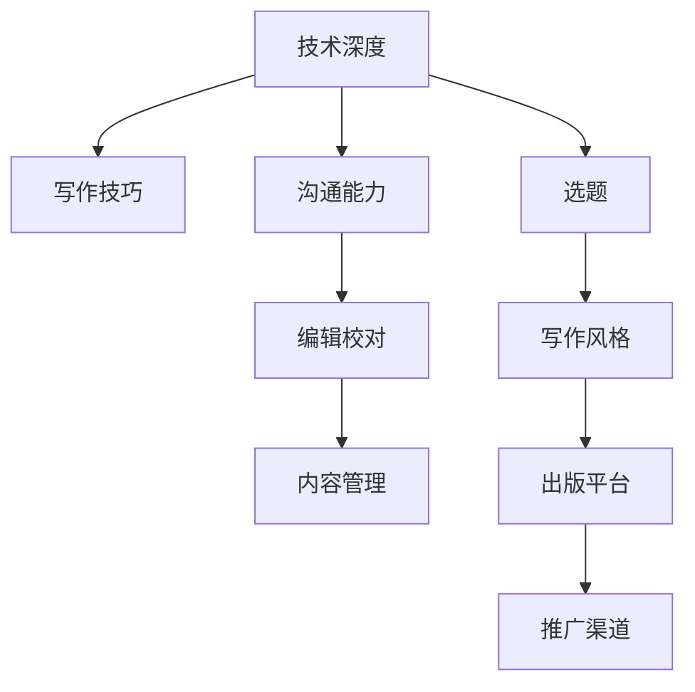

                 

# 开源贡献者到技术作家的转型：出版策略

> 关键词：开源,技术写作,出版策略,软件开发,开源社区

## 1. 背景介绍

### 1.1 问题由来
随着开源运动的蓬勃发展，越来越多的开发者不仅在实际项目中贡献代码，也开始转向技术写作和内容创作，致力于分享知识和经验。然而，对于这些初入技术写作领域的开源贡献者，如何有效规划和执行出版策略，最大化其影响力，仍是一个不小的挑战。

### 1.2 问题核心关键点
技术作家的转型和出版策略主要包括以下几个方面：
- **内容选题**：选择具有市场和受众需求的主题。
- **写作风格**：建立清晰、逻辑严谨的写作风格。
- **出版平台**：选择合适的出版平台，如博客、社交媒体、书籍等。
- **推广渠道**：利用社交媒体、技术社区、邮件列表等多种渠道进行推广。
- **持续更新**：保持内容的时效性和深度，定期更新。
- **社区互动**：积极参与社区讨论，提高影响力和可信度。

本文将围绕这些关键点，详细介绍技术作家的出版策略，帮助开源贡献者顺利转型，并建立自身在技术社区中的权威地位。

## 2. 核心概念与联系

### 2.1 核心概念概述

技术作家与开源贡献者之间的联系紧密。作为一名技术作家，其核心工作是将复杂的开发经验和技术知识以易于理解的形式呈现给读者，帮助他们提升技能和理解新技术。这要求技术作家不仅要有深厚的技术功底，还需要具备优秀的写作和沟通能力。

技术作家通常具备以下核心能力：
- **技术深度**：熟悉核心技术和架构，具备解决复杂问题的能力。
- **写作技巧**：能够用简单易懂的语言描述技术概念和实践经验。
- **沟通能力**：能够通过文章、演讲、视频等多种形式与受众沟通。
- **编辑校对**：掌握基本编辑校对技巧，确保内容准确无误。
- **内容管理**：能规划、组织和管理内容，形成系统性输出。

这些能力在开源贡献者转型为技术作家时，将起到至关重要的作用。

### 2.2 核心概念原理和架构的 Mermaid 流程图



该图表展示了技术作家所需的关键能力及其相互关系。选题（F）是起点，通过深入的技术理解和良好的写作技巧（G），结合沟通和编辑校对（C和D），内容管理（E），最终选择合适的出版平台（H）和推广渠道（I），完成内容创作和传播。

## 3. 核心算法原理 & 具体操作步骤

### 3.1 算法原理概述

技术作家的出版策略本质上是内容营销的一种形式。通过高质量的内容输出，吸引并保持受众的兴趣，逐步建立起自己的品牌和影响力。以下是核心算法原理概述：

1. **选题策划**：根据市场需求和自身技术优势，选择具有吸引力的主题。
2. **内容创作**：系统规划内容结构，采用易于理解的方式呈现技术细节。
3. **平台选择**：选择最适合目标受众的出版平台，并制定内容发布计划。
4. **渠道推广**：利用社交媒体、邮件列表、技术博客等多种渠道进行推广。
5. **反馈循环**：通过评论、邮件、社交媒体互动，收集反馈，持续优化内容。

### 3.2 算法步骤详解

以下详细介绍技术作家出版策略的具体操作步骤：

#### Step 1: 内容选题
- **市场调研**：分析当前技术趋势和热门话题，识别市场需求。
- **受众定位**：明确目标受众，了解他们的痛点和需求。
- **选题策略**：选择能够满足受众需求的、自身有深刻见解的课题，进行选题规划。

#### Step 2: 内容创作
- **大纲设计**：设计清晰的大纲，确保内容结构合理、逻辑严谨。
- **内容撰写**：采用通俗易懂的语言，深入浅出地描述技术原理和实践经验。
- **案例分析**：引入实际案例，增强内容的实用性和可信度。

#### Step 3: 平台选择
- **技术博客**：开设个人技术博客，持续发布高质量技术文章。
- **社交媒体**：通过Twitter、LinkedIn等社交平台分享技术见解和行业动态。
- **书籍出版**：编写技术书籍，通过传统出版社或自助出版平台发布。

#### Step 4: 渠道推广
- **邮件列表**：建立订阅邮件列表，定期发送内容更新和技术提示。
- **技术社区**：积极参与技术社区讨论，回答问题，分享经验。
- **网络研讨会**：通过网络研讨会形式，深入讲解复杂技术问题，吸引受众关注。

#### Step 5: 反馈循环
- **互动评论**：在文章下留言区收集读者反馈，了解受众需求和问题。
- **数据分析**：利用网站统计工具，分析内容阅读和互动数据，优化内容策略。
- **持续更新**：根据反馈和数据，定期更新和改进内容，保持时效性和深度。

### 3.3 算法优缺点

**优点**：
- **权威性**：基于自身的技术积累和实践经验，内容具有高度权威性。
- **影响力**：通过多种渠道进行推广，能迅速提升个人品牌和影响力。
- **持续价值**：高质量的内容能够长期吸引受众，形成持续的关注和互动。

**缺点**：
- **时间成本**：内容创作和推广需要大量时间，投入较高。
- **技术门槛**：需要具备深厚的技术背景和良好的写作能力，门槛较高。
- **市场变化**：技术变化快，需要持续关注市场趋势，更新内容。

### 3.4 算法应用领域

技术作家的出版策略广泛应用于软件开发、人工智能、网络安全等技术领域。例如：

- **软件开发**：撰写关于软件架构设计、编程技巧、代码优化等内容。
- **人工智能**：分享机器学习、深度学习、自然语言处理等技术实践和应用。
- **网络安全**：讨论网络安全策略、防护技术、威胁分析等内容。
- **大数据**：介绍大数据架构、数据处理技术、数据分析应用等。

## 4. 数学模型和公式 & 详细讲解 & 举例说明

### 4.1 数学模型构建

技术作家的出版策略可以构建为一个数学模型，其中目标函数为最大化内容的影响力和用户互动，约束条件为时间成本和技术门槛。

假设：
- $I$ 为用户互动率（如评论数、分享数、阅读时长等）。
- $T$ 为内容创作和推广所需时间。
- $C$ 为技术门槛，包括知识深度、写作技巧等。

优化目标为：

$$
\maximize I \\
\text{subject to} \\
T \leq T_{max} \\
C \leq C_{max}
$$

### 4.2 公式推导过程

为了简化问题，假设用户互动 $I$ 与内容质量 $Q$ 成正比，与推广投入 $E$ 成正比。即：

$$
I = k_1Q + k_2E
$$

其中 $k_1$ 和 $k_2$ 为常数。

内容质量 $Q$ 与内容深度 $D$ 和写作技巧 $W$ 有关：

$$
Q = f(D, W)
$$

推广投入 $E$ 与推广渠道 $C$ 和推广频率 $F$ 有关：

$$
E = g(C, F)
$$

将这些公式带入优化目标，得：

$$
\maximize k_1f(D, W) + k_2g(C, F) \\
\text{subject to} \\
T \leq T_{max} \\
C \leq C_{max}
$$

### 4.3 案例分析与讲解

假设 $k_1=0.5$，$k_2=0.3$，$T_{max}=1000$，$C_{max}=10$。通过调整 $D$、$W$、$C$、$F$，可以探索不同策略下的最优解。例如：

- **高技术深度**：增加内容深度 $D$，虽然时间成本 $T$ 增加，但内容质量 $Q$ 显著提升，用户互动 $I$ 增加。
- **多渠道推广**：增加推广渠道 $C$ 和推广频率 $F$，可以迅速提升用户互动 $I$，但时间成本 $T$ 和推广投入 $E$ 增加。

## 5. 项目实践：代码实例和详细解释说明

### 5.1 开发环境搭建

在项目实践中，通常使用以下开发环境：

- **IDE**：如Visual Studio Code、PyCharm等。
- **文本编辑器**：如Sublime Text、Atom等。
- **版本控制**：如Git，用于代码管理和版本控制。
- **文档工具**：如Markdown、LaTeX，用于撰写和格式化技术文档。

### 5.2 源代码详细实现

以下是一个简单的技术博客内容创作流程的伪代码：

```python
# 选题
def select_topics():
    # 根据市场调研和受众分析，选择热门话题
    return ['topics']

# 内容创作
def create_content():
    topics = select_topics()
    for topic in topics:
        # 设计大纲，撰写文章，引入案例分析
        content = design_outline(topic)
        content = write_article(content)
        content = add_case_studies(content)
    return content

# 平台选择
def select_publishing_platform():
    # 根据目标受众，选择适合的出版平台
    return ['blog', 'medium', 'github']

# 渠道推广
def promote_content(content):
    for platform in select_publishing_platform():
        # 发布文章，进行邮件列表订阅，参与技术社区讨论
        publish(content, platform)
        send_email_list(content)
        participate_in_community(content)
    return

# 反馈循环
def collect_feedback(content):
    # 通过评论、数据分析，收集反馈
    return feedback

# 主函数
def main():
    content = create_content()
    promote_content(content)
    feedback = collect_feedback(content)
    # 根据反馈优化内容
    content = optimize_content(content, feedback)
    return

if __name__ == "__main__":
    main()
```

### 5.3 代码解读与分析

**select_topics** 函数：
- **输入**：无。
- **输出**：热门话题列表。
- **功能**：通过市场调研和受众分析，选择具有市场和受众需求的主题。

**create_content** 函数：
- **输入**：热门话题列表。
- **输出**：撰写好的技术文章。
- **功能**：根据选题设计大纲，撰写文章，引入案例分析，形成高质量内容。

**select_publishing_platform** 函数：
- **输入**：无。
- **输出**：适合的出版平台列表。
- **功能**：根据目标受众选择最适合的出版平台。

**promote_content** 函数：
- **输入**：撰写好的技术文章。
- **输出**：无。
- **功能**：发布文章，进行邮件列表订阅，参与技术社区讨论。

**collect_feedback** 函数：
- **输入**：技术文章。
- **输出**：反馈信息。
- **功能**：通过评论、数据分析，收集受众反馈。

**main** 函数：
- **输入**：无。
- **输出**：优化后的技术文章。
- **功能**：根据内容创作、平台选择、渠道推广、反馈循环，优化内容。

## 6. 实际应用场景

### 6.1 智能制造

在智能制造领域，技术作家可以通过撰写关于自动化生产线、智能设备、工业物联网等内容，帮助制造业企业提升生产效率和智能化水平。例如：

- **智能设备维护**：分享智能设备的故障诊断和维护经验，提供实用的技术指南。
- **工业物联网**：介绍工业物联网架构和应用案例，指导企业搭建物联网平台。
- **生产流程优化**：分析生产线瓶颈和优化建议，提供数据驱动的决策支持。

### 6.2 金融科技

在金融科技领域，技术作家可以通过撰写关于区块链、加密货币、金融算法等内容，帮助金融行业提升技术应用和安全防护能力。例如：

- **区块链技术**：介绍区块链的基本原理、应用场景和技术实现，帮助金融机构理解和应用。
- **加密货币**：讲解加密货币的工作原理和安全性问题，指导企业防范数字货币风险。
- **金融算法**：分析金融算法在风险控制、信用评估中的应用，提供算法优化建议。

### 6.3 医疗健康

在医疗健康领域，技术作家可以通过撰写关于电子病历、医疗数据分析、远程医疗等内容，帮助医疗机构提升信息化水平和医疗服务质量。例如：

- **电子病历系统**：介绍电子病历系统的架构和设计思路，指导医院建设和管理电子病历系统。
- **医疗数据分析**：分享医疗数据分析方法和工具，帮助医院提升数据利用效率。
- **远程医疗**：介绍远程医疗技术的应用场景和最佳实践，指导医院开展远程医疗服务。

### 6.4 未来应用展望

随着技术的不断进步，技术作家的出版策略将面临更多的机遇和挑战。未来，技术作家需要：

- **跨领域融合**：将技术写作与行业知识、数据科学等结合，提供更全面、深入的内容。
- **多媒体化**：利用视频、动画、图表等多种形式丰富内容表达，提高受众参与度。
- **智能化**：利用AI技术自动生成内容摘要、推荐相关文章，提升内容分发效率。
- **国际化**：面向全球受众，撰写多语言内容，提升国际影响力。

## 7. 工具和资源推荐

### 7.1 学习资源推荐

- **Udemy《技术写作与内容创作》课程**：系统讲解技术写作技巧和内容创作方法，适合技术作家入门。
- **Coursera《内容营销与品牌建设》课程**：涵盖内容策略、渠道推广、数据分析等，帮助技术作家全面提升出版策略。
- **Medium《技术博客写作指南》**：Medium平台上丰富的技术文章和写作经验，适合学习和借鉴。
- **CodePen《技术写作与代码分享》**：展示如何通过技术分享建立个人品牌，吸引受众关注。

### 7.2 开发工具推荐

- **GitHub Pages**：提供免费的静态网站托管服务，适合技术博客发布。
- **WordPress**：功能强大的博客发布平台，支持多种主题和插件。
- **Canva**：图形设计工具，用于制作技术文章的配图和视频。
- **Notion**：全能型的文档管理工具，支持笔记、项目管理、协作等功能。

### 7.3 相关论文推荐

- **J. Shapiro和D. Strayer，《技术写作的变革》（2021）**：探讨技术写作的发展趋势和未来方向。
- **M. Bell和N. Becker，《内容营销的效果》（2020）**：分析内容营销的效果和影响因素。
- **A. Gage和L. Squire，《技术作家的品牌建设》（2022）**：介绍技术作家如何建立个人品牌和影响力。

## 8. 总结：未来发展趋势与挑战

### 8.1 研究成果总结

本文对技术作家的出版策略进行了系统性介绍，包括选题策划、内容创作、平台选择、渠道推广和反馈循环等关键环节。技术作家通过高质量的内容输出，能够建立品牌，提升影响力，是开源运动和内容产业的重要力量。

### 8.2 未来发展趋势

未来，技术作家的出版策略将朝着以下方向发展：
- **智能化**：利用AI技术提升内容生成和分发效率。
- **多媒体化**：利用多种形式丰富内容表达，增强用户体验。
- **国际化**：面向全球受众，提升国际影响力。

### 8.3 面临的挑战

尽管技术作家的出版策略具有巨大潜力，但仍面临以下挑战：
- **时间成本**：内容创作和推广需要大量时间，投入较高。
- **技术门槛**：需要深厚的技术背景和良好的写作能力。
- **市场变化**：技术变化快，需要持续关注市场趋势。

### 8.4 研究展望

未来研究可以从以下几个方向进行：
- **内容自动化**：利用AI技术自动化内容生成和优化，降低时间成本。
- **多渠道协同**：整合多种推广渠道，提升内容分发效率。
- **受众细分**：针对不同受众群体，定制化内容策略。

## 9. 附录：常见问题与解答

**Q1：如何平衡时间成本和技术门槛？**

A: 选择合适的选题和发布平台，制定详细的内容发布计划。优先选择技术深度高但门槛低的选题，如基础技术教程、行业趋势分析等，逐步积累经验和影响力。

**Q2：如何保持内容的时效性和深度？**

A: 定期回顾和更新内容，引入最新的技术和应用案例。利用技术博客的灵活性，快速响应热点话题和市场需求。

**Q3：如何提高内容的互动性和传播效果？**

A: 利用社交媒体、邮件列表、技术社区等渠道进行推广。积极参与社区讨论，回答问题，建立良好的社区互动关系。

**Q4：如何选择适合的出版平台？**

A: 根据目标受众选择适合的出版平台，如技术博客、社交媒体、专业论坛等。综合考虑平台的用户基数、受众特征、分发效率等因素。

**Q5：如何利用AI技术提升内容创作效率？**

A: 利用自然语言生成（NLG）技术自动生成文章摘要、推荐相关内容，利用图像识别技术生成配图和视频，利用文本分类技术推荐主题等。

---

作者：禅与计算机程序设计艺术 / Zen and the Art of Computer Programming

