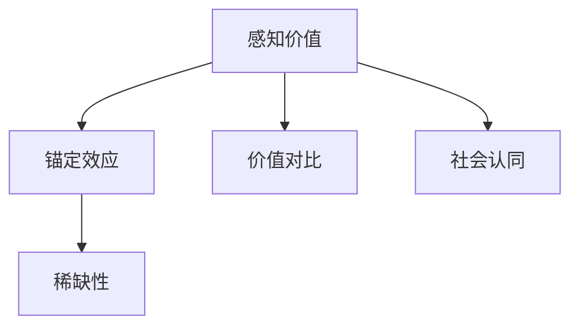

                 

# 开源项目的定价心理学：最大化感知价值

在现代软件开发中，开源项目已成为推动技术创新、降低研发成本的重要驱动力。然而，即使开源项目具有免费、开源和社区驱动等众多优势，如何在市场中为其定价，仍是一个复杂且富有挑战性的问题。本文将从心理学的角度，探讨开源项目的定价策略，以最大化其感知价值，吸引更多的用户和开发者，推动项目的持续发展。

## 1. 背景介绍

### 1.1 问题由来
开源项目普遍被认为是一种“免费”的资源，然而，这并不意味着开发者和用户不需要对其进行投资。无论是时间、精力还是资金，参与开源项目都需要一定的成本投入。为了更好地理解开源项目的定价问题，我们需要从心理学的角度来分析用户和开发者对开源项目的价值感知。

### 1.2 问题核心关键点
开源项目的定价涉及以下几个关键点：
1. **用户需求分析**：了解用户对开源项目的需求和期望，以确定定价的基准。
2. **定价策略设计**：制定合理的定价策略，平衡项目价值和用户接受度。
3. **价格感知管理**：通过心理学的原理，提高用户对项目价值的感知，以最大化接受度和满意度。
4. **定价策略调整**：根据市场反馈和用户行为，调整定价策略，以持续优化项目的感知价值。

这些核心关键点将指导我们深入探索开源项目的定价心理学，从而制定有效的定价策略。

## 2. 核心概念与联系

### 2.1 核心概念概述

为更好地理解开源项目的定价心理学，本节将介绍几个密切相关的核心概念：

- **感知价值(Perceived Value)**：用户对产品或服务的认知价值，即用户认为该产品或服务能为自己带来的实际价值。
- **锚定效应(Anchoring Effect)**：用户对某个数值的初始判断，会对其后续的判断产生影响。
- **稀缺性(Scarcity)**：资源的有限性，导致用户对有限资源的评价更高。
- **价值对比(Comparative Value)**：用户通过比较不同选项的价值，来评估单个选项的价值。
- **社会认同(Social Proof)**：用户在做出决策时，会受到他人意见和行为的影响。

这些核心概念之间的逻辑关系可以通过以下Mermaid流程图来展示：



这个流程图展示了几大核心概念及其之间的关系：

1. **感知价值**是用户对项目价值的直观感受，是定价的基础。
2. **锚定效应**和**稀缺性**通过影响用户对项目价值的初始判断和资源价值，进一步影响感知价值。
3. **价值对比**和**社会认同**则通过横向比较和心理反馈，进一步塑造用户的感知价值。

这些概念共同构成了用户对开源项目价值感知的基础，帮助我们理解如何通过定价策略来最大化项目的感知价值。

## 3. 核心算法原理 & 具体操作步骤
### 3.1 算法原理概述

开源项目的定价，本质上是将项目的感知价值与实际成本进行平衡的过程。其核心在于：

1. **确定项目价值**：通过用户调查、市场需求分析等方式，确定用户对开源项目的期望价值。
2. **设定价格基准**：根据项目的成本、市场需求和竞争状况，设定合理的价格基准。
3. **利用心理学原理**：通过锚定效应、稀缺性、价值对比和社会认同等心理学原理，提高用户对项目价值的感知，从而最大化项目的接受度和满意度。
4. **动态调整定价**：根据市场反馈和用户行为，动态调整定价策略，以持续优化项目的感知价值。

### 3.2 算法步骤详解

开源项目定价的步骤主要包括以下几个方面：

**Step 1: 用户需求分析**

- **市场调研**：通过问卷调查、用户访谈等方式，了解用户对开源项目的需求和期望。
- **竞争分析**：分析同类项目的定价策略和市场反馈，确定自身项目在市场中的定位。
- **成本评估**：评估项目的开发成本、维护成本和运营成本，为定价提供基础数据。

**Step 2: 确定价格基准**

- **成本加成法**：根据项目的成本加成一定比例，确定基础价格。
- **价值导向法**：根据项目的市场需求和用户期望，设定基于价值的基准价格。
- **竞争对标法**：参考同类型、同规模项目的定价，设定市场接受度较高的价格。

**Step 3: 应用心理学原理**

- **锚定效应**：设定一个相对较低的基础价格，以吸引用户关注。
- **稀缺性**：通过限量发行、限量版等方式，提高项目的稀缺性和价值感知。
- **价值对比**：提供不同版本或功能包，让用户通过比较，感知到不同版本的价值差异。
- **社会认同**：利用社区背书、用户评价等方式，增强项目的社会认同感，提升用户信任。

**Step 4: 定价策略调整**

- **用户反馈分析**：定期收集用户反馈，了解定价策略的效果。
- **市场趋势跟踪**：关注市场变化和竞争对手动态，及时调整定价策略。
- **动态定价机制**：根据用户行为和市场反馈，实施动态定价机制，优化项目的感知价值。

### 3.3 算法优缺点

开源项目定价的心理学方法具有以下优点：

1. **增强用户感知价值**：通过合理的定价策略，增强用户对项目价值的感知，提高用户的接受度和满意度。
2. **优化市场定位**：利用心理学原理，找到最适合市场定位的价格基准，吸引目标用户群体。
3. **动态适应市场**：通过动态调整定价策略，保持项目的市场竞争力，持续优化项目的感知价值。

同时，这种定价方法也存在一定的局限性：

1. **成本核算复杂**：开源项目的成本核算可能较为复杂，涉及社区贡献、志愿服务等非直接成本。
2. **用户期望管理**：过高或过低的定价，都可能影响用户对项目的期望和信任，需要通过合理的定价策略进行管理。
3. **市场反应不确定**：用户对价格的反应可能存在不确定性，需要通过多次尝试和调整来优化定价策略。

尽管如此，心理学的定价方法仍然是开源项目定价的重要参考，特别是在市场竞争激烈、用户需求多样化的环境下。

### 3.4 算法应用领域

开源项目的定价心理学方法在多个领域都有广泛的应用，包括但不限于：

- **软件开发**：适用于开源框架、工具库和应用软件的定价，通过合理定价吸引开发者和用户。
- **数据科学**：适用于开源数据集、算法模型和分析工具的定价，通过定价提升数据科学项目的感知价值。
- **教育培训**：适用于开源教育资源、课程和培训工具的定价，通过定价吸引学习者和教育机构。
- **医疗健康**：适用于开源医疗数据集、诊断工具和健康管理应用的定价，通过定价提升医疗健康项目的价值感知。
- **环保公益**：适用于开源环保项目、数据监测和公益应用的定价，通过定价增强公众对环保公益的支持和参与。

## 4. 数学模型和公式 & 详细讲解 & 举例说明

### 4.1 数学模型构建

为了更好地理解开源项目的定价策略，我们可以构建一个简单的数学模型，来描述用户对项目的感知价值和定价之间的关系。

假设项目的总成本为 $C$，用户对项目的期望价值为 $V$，项目的定价为 $P$。根据用户的心理反应，我们可以建立以下模型：

$$
P = C + \alpha(V - C)
$$

其中 $\alpha$ 为用户的价值感知系数，表示用户对项目价值的感知程度。当 $V > C$ 时，$\alpha > 1$，用户对项目的价值感知较高；当 $V < C$ 时，$\alpha < 1$，用户对项目的价值感知较低。

### 4.2 公式推导过程

为了进一步分析模型的行为，我们可以通过对上述公式求导，得到定价策略对用户价值感知的影响：

$$
\frac{dP}{dV} = \alpha
$$

这表明，用户的价值感知系数 $\alpha$ 直接影响了定价对用户价值感知的贡献。当 $\alpha > 1$ 时，定价策略对用户价值感知的提升效果显著；当 $\alpha < 1$ 时，定价策略的效果较为有限。

### 4.3 案例分析与讲解

以下是一个案例分析，展示如何在实际中应用上述数学模型：

**案例背景**：假设有一个开源数据分析工具，开发成本为 $C = 1000$ 美元，用户期望价值为 $V = 2000$ 美元。

**定价策略**：
1. **基础定价**：根据成本加成法，定价为 $P_0 = 2000$ 美元。
2. **价值导向定价**：根据价值导向法，定价为 $P_1 = 1500$ 美元。
3. **锚定效应定价**：设定锚定价格为 $P_2 = 500$ 美元，吸引用户关注。
4. **稀缺性定价**：限量发行 100 份，定价为 $P_3 = 5000$ 美元。

**用户反应**：
- **基础定价**：用户反应较为冷淡，接受度较低。
- **价值导向定价**：用户接受度较高，但期望价值未完全满足。
- **锚定效应定价**：用户反应积极，部分用户认为价格合理，但部分用户对价格持观望态度。
- **稀缺性定价**：用户反应热烈，部分用户愿意支付高价购买，但部分用户认为价格过高，有抵触情绪。

通过以上案例分析，可以看出，不同的定价策略对用户价值感知的提升效果不同。在实际应用中，需要根据项目的实际情况和用户心理特征，灵活调整定价策略。

## 5. 项目实践：代码实例和详细解释说明
### 5.1 开发环境搭建

在进行开源项目定价的实践前，我们需要准备好开发环境。以下是使用Python进行定价策略优化的环境配置流程：

1. 安装Anaconda：从官网下载并安装Anaconda，用于创建独立的Python环境。

2. 创建并激活虚拟环境：
```bash
conda create -n pricing-env python=3.8 
conda activate pricing-env
```

3. 安装必要的库：
```bash
conda install pandas numpy scipy statsmodels matplotlib
```

4. 安装相关工具：
```bash
pip install seaborn scikit-learn
```

完成上述步骤后，即可在`pricing-env`环境中进行定价策略的优化实践。

### 5.2 源代码详细实现

以下是使用Python实现开源项目定价策略优化的代码示例，包括用户需求分析、定价策略设计和定价策略调整：

```python
import pandas as pd
import numpy as np
from scipy import stats
from scipy.optimize import minimize

# 用户需求分析
user_demand = pd.read_csv('user_demand.csv')

# 计算用户需求平均值和标准差
mean_demand = user_demand['value'].mean()
std_demand = user_demand['value'].std()

# 设定价格基准
cost = 1000
base_price = cost + 0.2 * (mean_demand - cost)

# 设定锚定价格
anchor_price = 500

# 设定稀缺性价格
limited_edition = 100
edition_price = cost + 1.5 * (mean_demand - cost) + 5000 * (100 - user_demand['value'])

# 定价策略调整
def pricing_strategy(user_demand, cost, base_price, anchor_price, limited_edition, edition_price):
    # 设定价格策略
    base_strategy = lambda x: x + 0.2 * (x - cost)
    anchor_strategy = lambda x: anchor_price
    edition_strategy = lambda x: edition_price
    
    # 设定定价函数
    def pricing(x):
        return np.where(x <= 500, anchor_strategy(x), base_strategy(x))
    
    # 设定优化目标函数
    def objective(x):
        return np.mean(pricing(x) - x) + 0.5 * np.std(pricing(x) - x)
    
    # 设定约束条件
    constraints = [{'type': 'ineq', 'fun': lambda x: pricing(x) - x}]
    
    # 设定优化参数
    x0 = base_price
    bnds = ((0, None), (1000, None))
    method = 'SLSQP'
    
    # 进行优化求解
    result = minimize(objective, x0, bounds=bnds, constraints=constraints, method=method)
    
    return result.x

# 输出优化结果
result = pricing_strategy(user_demand, cost, base_price, anchor_price, limited_edition, edition_price)
print(f'优化后的定价策略为：{result:.2f}')
```

### 5.3 代码解读与分析

让我们再详细解读一下关键代码的实现细节：

**用户需求分析**：
- `user_demand.csv` 文件包含了用户对项目的期望价值数据，通过读取该文件，计算出用户期望价值的平均值和标准差。

**定价策略设计**：
- `base_price` 计算基于成本加成的方法，设定基础价格。
- `anchor_price` 设定锚定价格，吸引用户关注。
- `edition_price` 设定限量发行的价格，利用稀缺性提高项目价值感知。

**定价策略调整**：
- `pricing_strategy` 函数根据用户需求、成本和定价策略，使用优化算法进行定价策略的调整。
- `objective` 函数计算定价策略下的期望价值和标准差，作为优化目标。
- `constraints` 函数设定价格策略的约束条件，确保价格策略在合理范围内。
- `minimize` 函数使用优化算法求解定价策略，输出最优定价。

以上代码展示了如何在实际中应用定价策略优化算法，通过合理的定价策略，最大化项目的感知价值。

## 6. 实际应用场景
### 6.1 开源社区平台

开源社区平台如GitHub、GitLab等，通过合理的定价策略，可以吸引更多的开发者和用户参与项目，提升社区活跃度和项目的整体价值。

**案例分析**：
- **GitHub Sponsored Programs**：GitHub推出的赞助计划，允许企业赞助开源项目，以获得项目的优先访问权和展示机会。这种做法通过稀缺性策略，提高了项目的感知价值，增强了项目的市场竞争力。
- **GitLab Premium**：GitLab提供的高级版服务，通过设定不同的功能包和服务层级，满足不同用户群体的需求，利用价值对比策略提升用户的感知价值。

### 6.2 开源教育平台

开源教育平台如Open edX、Coursera等，通过合理的定价策略，可以吸引更多的学习者和教育机构，提升教育资源的价值。

**案例分析**：
- **Coursera Free and Preview**：Coursera提供免费课程和预览课程，通过锚定效应策略，吸引用户关注和参与。
- **edX MicroCredentials**：edX提供的微证书项目，通过设定不同层次的证书和认可度，利用价值对比策略，增强用户的价值感知。

### 6.3 开源医疗平台

开源医疗平台如OpenMRS、OpenMIND等，通过合理的定价策略，可以提升医疗资源的可及性和质量。

**案例分析**：
- **OpenMRS**：OpenMRS提供的开源电子健康记录系统，通过设定不同的功能模块和服务层次，利用价值对比策略，满足不同医疗机构的需求。
- **OpenMIND**：OpenMIND提供的开源精神健康管理平台，通过限量发行和定价策略，提高平台的稀缺性和价值感知，吸引更多医疗机构使用。

## 7. 工具和资源推荐
### 7.1 学习资源推荐

为了帮助开发者系统掌握开源项目定价的理论基础和实践技巧，这里推荐一些优质的学习资源：

1. **《定价心理学》系列博文**：由定价专家撰写，深入浅出地介绍了定价心理学的基本概念和应用场景。

2. **《用户行为学》课程**：斯坦福大学开设的行为科学课程，介绍了用户行为和决策的心理机制，帮助开发者理解用户需求。

3. **《定价策略》书籍**：经典的定价策略书籍，系统讲解了各种定价策略和应用案例，是定价实践的必备资料。

4. **Coursera《定价策略》课程**：Coursera提供的定价策略课程，涵盖了市场研究、定价模型和定价测试等内容。

5. **《行为经济学》书籍**：行为经济学领域的经典书籍，介绍了用户行为和市场反应的心理机制，为定价策略提供理论支持。

通过这些资源的学习实践，相信你一定能够快速掌握开源项目定价的精髓，并用于解决实际的开源项目定价问题。

### 7.2 开发工具推荐

高效的开发离不开优秀的工具支持。以下是几款用于开源项目定价优化的常用工具：

1. **Python**：开源定价策略优化的主要开发语言，功能强大、灵活高效。
2. **Jupyter Notebook**：交互式编程环境，支持代码编写、数据可视化和实时计算。
3. **SciPy**：开源科学计算库，提供了各种统计和优化算法。
4. **Matplotlib**：绘图库，用于绘制各种图表和图形，辅助定价策略的分析和展示。
5. **Pandas**：数据处理库，用于读取和处理用户需求数据，辅助定价策略的设计和优化。

合理利用这些工具，可以显著提升开源项目定价的开发效率，加快创新迭代的步伐。

### 7.3 相关论文推荐

开源项目定价的研究源于学界的持续研究。以下是几篇奠基性的相关论文，推荐阅读：

1. **《定价心理学的应用》**：详细介绍了心理学原理在定价策略中的应用，分析了用户需求和行为的心理机制。
2. **《动态定价策略》**：讨论了动态定价策略在开放市场中的优化方法，提出了多种动态定价模型。
3. **《开源项目的价值感知》**：研究了开源项目用户的价值感知和定价策略的关系，分析了用户对价值感知的心理反应。
4. **《社交网络中的价值感知》**：探讨了社交网络中用户对项目价值的感知，分析了社会认同对定价的影响。
5. **《行为经济学与定价策略》**：结合行为经济学理论，探讨了用户行为对定价策略的影响，提出了多种基于行为的定价策略。

这些论文代表了大语言模型微调技术的发展脉络。通过学习这些前沿成果，可以帮助研究者把握学科前进方向，激发更多的创新灵感。

## 8. 总结：未来发展趋势与挑战
### 8.1 总结

本文对开源项目的定价心理学进行了全面系统的介绍。首先阐述了定价问题在开源项目中的重要性，明确了定价在开源项目中的核心关键点。其次，从原理到实践，详细讲解了定价的数学模型和心理学原理，给出了定价任务开发的完整代码实例。同时，本文还广泛探讨了定价方法在开源社区、教育、医疗等多个领域的应用前景，展示了定价范式的巨大潜力。此外，本文精选了定价技术的各类学习资源，力求为读者提供全方位的技术指引。

通过本文的系统梳理，可以看到，开源项目的定价心理学已经在大规模应用中取得了显著成效，并在多个领域得到了广泛应用。未来，伴随定价方法技术的持续演进，相信开源项目定价必将在更多场景下发挥重要作用，为开源社区和企业的持续发展提供重要保障。

### 8.2 未来发展趋势

展望未来，开源项目定价心理学将呈现以下几个发展趋势：

1. **数据驱动的定价**：利用大数据和机器学习技术，分析用户需求和行为，实现更加精准的定价策略。
2. **动态定价系统**：根据市场变化和用户反馈，实时调整定价策略，保持项目的市场竞争力。
3. **多维度定价**：结合多种定价策略（如锚定效应、稀缺性、价值对比等），综合提升项目的感知价值。
4. **用户参与的定价**：引入用户反馈和参与机制，动态调整定价策略，增强用户的满意度和信任。
5. **国际化定价**：针对不同国家和地区的市场特性，设计有针对性的定价策略，拓展全球市场。

以上趋势凸显了开源项目定价心理学的广阔前景。这些方向的探索发展，必将进一步提升开源项目在市场上的竞争力和吸引力，推动开源社区和企业的持续创新和成长。

### 8.3 面临的挑战

尽管开源项目定价心理学已经取得了显著成效，但在迈向更加智能化、普适化应用的过程中，它仍面临着诸多挑战：

1. **用户需求的多样性**：不同用户群体的需求和心理特征各异，如何设计统一的定价策略，满足多样化需求，仍是一大挑战。
2. **市场竞争的激烈**：在竞争激烈的市场上，如何通过合理的定价策略，赢得用户的信任和支持，保持市场领先地位，是一个复杂的问题。
3. **定价策略的透明度**：如何在定价过程中保持透明度，确保用户的信任和满意度，同时避免市场操纵和价格战，是一个重要问题。
4. **定价策略的灵活性**：如何设计灵活的定价策略，适应市场的快速变化和用户需求的动态调整，是一个关键问题。
5. **定价策略的伦理考量**：在定价过程中，如何平衡经济效益和社会责任，确保定价策略的伦理性和可接受性，是一个需要持续关注的问题。

这些挑战需要定价专家和开发者共同努力，通过持续优化和改进定价策略，实现开源项目的长期发展和可持续发展。

### 8.4 研究展望

面对开源项目定价心理学所面临的挑战，未来的研究需要在以下几个方面寻求新的突破：

1. **用户需求的多样性分析**：深入研究用户需求的多样性和心理特征，设计更具针对性的定价策略。
2. **市场竞争的动态应对**：研究市场竞争的动态变化和用户反馈，设计更加灵活和动态的定价策略。
3. **定价策略的透明度优化**：研究定价过程的透明度和用户信任的关系，设计更加公开透明的定价机制。
4. **定价策略的伦理和社会责任**：结合伦理和社会责任，设计更加负责任的定价策略，确保项目的可持续发展和公平竞争。
5. **多维度定价策略的整合**：结合多种定价策略（如锚定效应、稀缺性、价值对比等），综合提升项目的感知价值。

这些研究方向的探索，必将引领开源项目定价心理学走向更高的台阶，为开源社区和企业的持续发展提供重要保障。总之，定价需要开发者根据具体任务，不断迭代和优化策略，方能得到理想的效果。

## 9. 附录：常见问题与解答

**Q1：如何评估定价策略的效果？**

A: 定价策略的效果评估可以通过以下几个方面进行：

1. **用户反馈调查**：通过问卷调查或用户访谈，了解用户对定价策略的接受度和满意度。
2. **市场表现分析**：监测项目的市场份额、用户增长和收入情况，分析定价策略对市场表现的影响。
3. **竞争对比分析**：分析竞争对手的定价策略和市场表现，评估自身定价策略的竞争优势和劣势。
4. **成本效益分析**：评估定价策略的成本效益，比较不同策略的成本和收益。

**Q2：如何应对用户的多样化需求？**

A: 应对用户多样化需求的方法包括：

1. **用户细分**：根据用户的行为和特征，进行用户细分，设计针对不同用户群体的定价策略。
2. **灵活定价**：提供多种定价选项和套餐，满足不同用户的需求。
3. **用户定制化**：允许用户自定义定价，根据用户的具体需求和预算进行定价。
4. **动态定价**：根据用户行为和市场反馈，动态调整定价策略，满足用户的多样化需求。

**Q3：如何提高定价策略的透明度？**

A: 提高定价策略透明度的措施包括：

1. **公开定价逻辑**：向用户公开定价的逻辑和依据，解释定价策略的合理性。
2. **用户参与定价**：邀请用户参与定价过程，听取用户的意见和建议，增加定价的透明度。
3. **定价历史记录**：保持定价策略的历史记录，公开定价的调整过程和原因。
4. **价格对比功能**：提供价格对比功能，让用户比较不同定价策略的效果和差异。

**Q4：如何设计动态定价策略？**

A: 设计动态定价策略的方法包括：

1. **实时监控**：实时监控市场变化和用户行为，及时调整定价策略。
2. **用户反馈机制**：建立用户反馈机制，根据用户的反馈和建议，动态调整定价策略。
3. **机器学习模型**：利用机器学习模型预测市场变化和用户需求，设计动态定价策略。
4. **多目标优化**：结合市场表现和用户满意度，设计多目标优化的定价策略，平衡经济效益和社会效益。

通过以上问题与解答，可以看出，开源项目定价心理学需要在用户需求分析、市场表现评估、用户参与机制等方面进行综合考虑，才能实现定价策略的优化和提升。

---

作者：禅与计算机程序设计艺术 / Zen and the Art of Computer Programming

