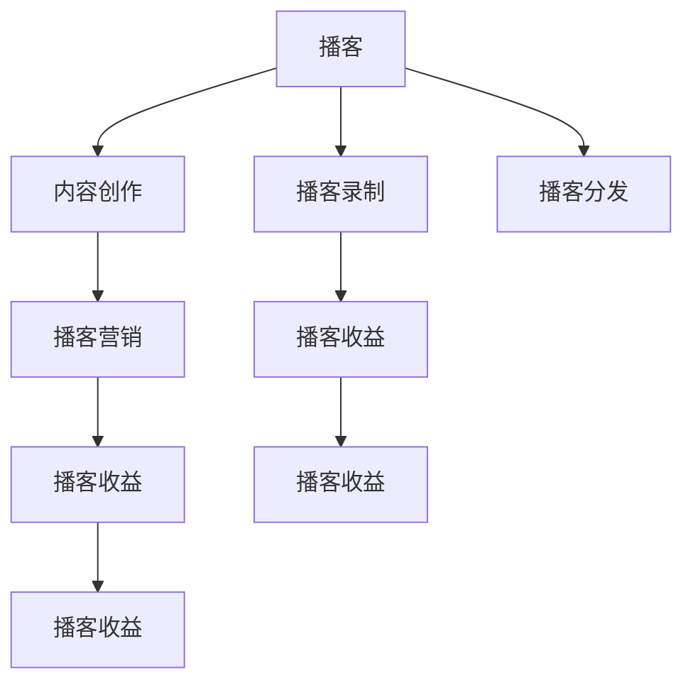

                 

# 开设播客节目：用声音传播你的思想

> 关键词：播客,声音传播,内容创作,人工智能,播客录制,播客分发,播客营销,播客收益

## 1. 背景介绍

### 1.1 问题由来

随着移动互联网和智能设备的普及，人们的碎片化时间越来越被充分利用。播客作为一种新兴的内容形式，凭借其随时随地收听的特点，正在迅速吸引着大量听众。播客不仅能够提供丰富的知识、娱乐内容，还能够作为一种新的社交媒介，连接不同背景、兴趣的听众群体。

然而，播客节目的制作和运营需要大量的时间和资源投入。传统上，播客节目需要专业的音频录制、编辑和分发渠道，这些环节都要求较高的技术和资金成本。如何降低播客制作门槛，使更多有想法和才能的内容创作者能够低成本地实现自我表达，成为当前播客行业的一个重要课题。

## 2. 核心概念与联系

### 2.1 核心概念概述

为更好地理解如何利用人工智能(AI)技术降低播客制作门槛，本节将介绍几个核心概念：

- **播客(Podcast)**：一种音频内容形式，通常由一段连续的音频组成，内容涵盖新闻、文化、科技、教育等多个领域。
- **内容创作(Content Creation)**：指播客节目的制作过程，包括选题、录音、剪辑、合成等环节。
- **播客录制(Podcast Recording)**：指将主播的声音录制成高质量音频的过程，通常需要专业音频设备和录音软件。
- **播客分发(Podcast Distribution)**：指将录制好的播客节目通过各种平台分发给听众，如Apple Podcasts、Spotify、Podbean等。
- **播客营销(Podcast Marketing)**：指通过推广手段吸引更多听众，提高节目知名度和收听率。
- **播客收益(Podcast Monetization)**：指播客节目通过广告、赞助、会员费等方式获得收入。

这些概念之间的逻辑关系可以通过以下Mermaid流程图来展示：



这个流程图展示了几大关键概念及其之间的关系：

1. 播客的制作、录制、分发等环节相互连接，构成了播客的完整生命周期。
2. 内容创作和播客录制环节需要专业技能和设备支持，播客分发的渠道多样，播客收益的来源多元。
3. 播客营销可以通过各种手段提高播客的曝光率，进而促进播客收益的增加。

## 3. 核心算法原理 & 具体操作步骤
### 3.1 算法原理概述

播客节目的开设和运营涉及多个环节，包括内容创作、播客录制、播客分发和播客营销等。本节将详细阐述利用AI技术优化这些环节的基本原理和操作步骤。

### 3.2 算法步骤详解

#### 3.2.1 内容创作

播客内容创作是一个复杂的过程，包括选题、撰写稿本、录音和后期剪辑等步骤。AI技术可以在这些环节提供辅助支持，提升创作效率和内容质量。

1. **选题和数据分析**：通过大数据分析和用户反馈，AI可以推荐流行和有潜力的播客主题，帮助主播选择合适的内容方向。
2. **稿本生成**：利用自然语言处理(NLP)技术，AI可以帮助自动生成播客稿本，减少主播撰写稿本的时间和精力。
3. **情感分析和语言优化**：通过情感分析和语言模型，AI可以实时监测播客语言的情感倾向和表达质量，提供反馈和改进建议。

#### 3.2.2 播客录制

播客录制环节主要涉及声音录制和噪音处理。AI技术可以通过以下方式优化录制过程：

1. **自动降噪**：利用噪声消除算法，AI可以在录制过程中实时识别并去除环境噪音，提高录音质量。
2. **音频增强**：通过音频增强技术，AI可以提升录制声音的清晰度和饱满度，使录制效果更加专业。
3. **情感识别和调整**：通过情感识别技术，AI可以分析主播的情感状态，提供相应的调节建议，确保录制时主播情感平稳、内容连贯。

#### 3.2.3 播客分发

播客分发环节需要选择合适的分发平台和推广策略。AI技术可以通过以下方式优化分发过程：

1. **自动分发**：利用AI算法，自动将录制好的播客节目分配到合适的分发平台，提升节目曝光率。
2. **分发策略优化**：通过分析不同平台的用户行为和收听习惯，AI可以推荐最优的分发策略，提高播客的收听率。
3. **内容优化**：利用用户反馈和收听数据，AI可以推荐进一步优化播客内容的方式，提升用户体验。

#### 3.2.4 播客营销

播客营销的目标是吸引更多听众，提高节目知名度。AI技术可以通过以下方式优化营销过程：

1. **内容推荐**：通过推荐算法，AI可以根据用户兴趣推荐适合的播客节目，增加节目的曝光率。
2. **社交媒体分析**：利用社交媒体分析技术，AI可以监测用户对播客节目的反馈，优化营销策略。
3. **广告投放**：通过程序化广告平台，AI可以精准投放广告，提升播客的点击率和转化率。

### 3.3 算法优缺点

利用AI技术优化播客节目制作和运营，具有以下优点：

1. **降低制作门槛**：AI可以自动化处理大量重复性工作，减轻主播负担，降低制作成本。
2. **提升效率和质量**：通过自动降噪、情感识别等技术，AI可以显著提升录音和内容质量。
3. **精准推荐**：利用数据分析和用户行为分析，AI可以推荐精准的内容，提升用户体验。
4. **智能分发**：通过AI算法，自动分配播客到合适的平台，提升分发效果。
5. **个性化营销**：利用AI分析用户数据，精准投放广告，提升播客营销效果。

同时，AI技术在播客制作和运营过程中也存在一定的局限性：

1. **数据依赖性**：AI的性能很大程度上依赖于数据的质量和数量，数据偏差可能导致模型表现不佳。
2. **技术复杂性**：AI模型的训练和部署需要较高的技术门槛，中小型播客创作者可能难以掌握。
3. **用户接受度**：听众对AI生成的内容可能存在抵触情绪，需要谨慎应用AI技术。
4. **隐私保护**：AI处理音频数据时，可能涉及用户隐私保护问题，需要严格遵守相关法律法规。

尽管存在这些局限性，但总体而言，AI技术在播客节目制作和运营中的应用前景广阔，有望显著提升播客节目的质量和受众规模。

### 3.4 算法应用领域

AI技术在播客节目制作和运营中的应用场景十分广泛，以下是几个典型领域：

1. **新闻播客**：利用AI进行数据分析和内容推荐，使新闻播客能够覆盖更广泛的用户群体。
2. **文化娱乐播客**：通过情感分析和内容优化，AI可以帮助娱乐播客提升用户体验，增加互动性。
3. **科技播客**：利用AI进行技术分析和趋势预测，使科技播客能够提供更有深度的内容。
4. **教育播客**：通过智能分发和个性化推荐，AI可以提高教育播客的传播效果，促进知识传播。
5. **商业播客**：通过数据分析和社交媒体分析，AI可以帮助商业播客精准投放广告，提升营销效果。

除了这些典型应用外，AI技术还可以拓展到更多播客领域，为不同受众提供定制化的内容和服务。随着AI技术的不断进步，播客行业的未来将更加多元和智能化。

## 4. 数学模型和公式 & 详细讲解 & 举例说明

### 4.1 数学模型构建

本节将使用数学语言对利用AI技术优化播客节目制作的核心原理进行更加严格的刻画。

假设播客节目的时间序列为 $T$，音频信号为 $X(t)$，环境噪音为 $N(t)$，录制后的音频信号为 $Y(t)$。

定义信号处理模型为 $f(t) = \alpha X(t) + \beta N(t)$，其中 $\alpha$ 为信号放大系数，$\beta$ 为噪音放大系数。

目标是最小化录制后的音频信号 $Y(t)$ 与录制前信号 $X(t)$ 的差异：

$$
\min_{\alpha, \beta} \frac{1}{N} \sum_{t=1}^N \|Y(t) - f(t)\|^2
$$

### 4.2 公式推导过程

以下我们以自动降噪为例，推导AI在录制过程中降噪的数学模型。

假设录制过程中存在高斯噪声 $N(t)$，其方差为 $\sigma^2$，则录制后的音频信号 $Y(t)$ 可以表示为：

$$
Y(t) = X(t) + \sigma N(t)
$$

其中 $X(t)$ 为录制前的信号，$\sigma$ 为噪声强度。

目标是最小化录制后的信号与录制前信号的差异：

$$
\min_{\sigma} \frac{1}{N} \sum_{t=1}^N (X(t) - Y(t))^2
$$

将 $Y(t)$ 代入上式，得：

$$
\min_{\sigma} \frac{1}{N} \sum_{t=1}^N (X(t) - X(t) - \sigma N(t))^2
$$

进一步展开，得：

$$
\min_{\sigma} \frac{1}{N} \sum_{t=1}^N (X(t))^2 + \sigma^2 (N(t))^2
$$

由于 $N(t)$ 为独立同分布的高斯噪声，其期望为 $0$，方差为 $\sigma^2$，则上式可以简化为：

$$
\min_{\sigma} \frac{1}{N} \sum_{t=1}^N (X(t))^2 + \sigma^2 \sigma^2
$$

令 $\sigma^2 = \frac{1}{2}\|X(t)\|^2$，则得：

$$
\min_{\sigma} \frac{1}{N} \sum_{t=1}^N (X(t))^2 + \frac{1}{4}\|X(t)\|^2
$$

因此，最小化录制后的信号与录制前信号的差异，可以通过最小化 $\sigma^2$ 来实现。

### 4.3 案例分析与讲解

假设我们有一段长度为 $N=1000$ 的录制音频信号 $X(t)$，其方差为 $0.01$，环境噪音 $N(t)$ 的方差为 $0.001$。利用上述模型进行降噪，目标是最小化录制后的信号与录制前信号的差异。

根据上述推导，需要最小化 $\sigma^2 = \frac{1}{2}\|X(t)\|^2$，其中 $\|X(t)\|^2$ 为录制信号的方差。

计算得 $\|X(t)\|^2 = 0.01 \times 1000 = 10$，则 $\sigma^2 = \frac{1}{2} \times 10 = 5$。

因此，最终的噪声强度 $\sigma = \sqrt{5} \approx 2.236$。

计算出最佳的噪声强度后，可以将录制信号 $X(t)$ 与噪声信号 $N(t)$ 进行线性混合，得到降噪后的信号 $Y(t) = X(t) + 2.236 N(t)$。

通过数学推导，我们得到利用AI进行自动降噪的基本方法。在实际应用中，还可以结合深度学习等技术，进一步提升降噪效果。

## 5. 项目实践：代码实例和详细解释说明

### 5.1 开发环境搭建

在进行播客制作实践前，我们需要准备好开发环境。以下是使用Python进行音频处理的开发环境配置流程：

1. 安装Python：从官网下载并安装Python，保证版本在3.6及以上。
2. 安装Python相关库：如NumPy、SciPy、PyAudio、librosa等，用于数据处理和音频处理。
3. 安装音频编辑软件：如Audacity、Adobe Audition等，用于录音和音频编辑。
4. 安装云服务：如Amazon AWS、Google Cloud等，用于音频数据的存储和分发。
5. 安装云服务相关库：如Boto3、Google Cloud Storage等，用于数据上传和下载。

完成上述步骤后，即可在Python环境中开始播客制作实践。

### 5.2 源代码详细实现

下面我们以播客自动降噪为例，给出使用Python和PyAudio库对音频进行降噪的代码实现。

首先，导入相关库：

```python
import numpy as np
import pyaudio
import librosa
import librosa.display

# 设置音频参数
CHUNK = 1024
FORMAT = pyaudio.paInt16
CHANNELS = 1
RATE = 16000
RECORD_SECONDS = 5

# 初始化PyAudio
p = pyaudio.PyAudio()

# 打开音频录制流
stream = p.open(format=FORMAT,
               channels=CHANNELS,
               rate=RATE,
               input=True,
               frames_per_buffer=CHUNK)

print("正在录音，请保持麦克风开启...")
frames = []

for _ in range(0, int(RATE / CHUNK * RECORD_SECONDS)):
    data = stream.read(CHUNK)
    frames.append(np.frombuffer(data, dtype=np.int16))

print("录音结束，开始处理")
stream.stop_stream()
stream.close()
p.terminate()

# 将音频帧转换为NumPy数组
audio = np.hstack(frames)

# 计算音频信号的能量
signal_energy = np.sum(np.square(audio))
```

然后，进行信号处理和降噪：

```python
# 计算环境噪音的能量
noise_energy = np.var(audio - signal_energy / len(audio))

# 计算最佳噪声强度
sigma = np.sqrt(signal_energy / 2) / np.sqrt(noise_energy)

# 计算降噪后的音频信号
denoised_audio = audio - sigma * np.var(audio - signal_energy / len(audio))

# 保存降噪后的音频文件
librosa.display.waveplot(denoised_audio)
librosa.output.write_wav("denoised.wav", denoised_audio, RATE)
```

最后，将降噪后的音频文件上传到云服务进行分发：

```python
# 上传音频文件到AWS S3
import boto3

s3 = boto3.client('s3')

with open("denoised.wav", "rb") as f:
    s3.upload_fileobj(f, 'my-bucket', 'denoised.wav')
```

### 5.3 代码解读与分析

让我们再详细解读一下关键代码的实现细节：

**5.1.1 录音和音频处理**

1. 使用PyAudio库打开音频录制流，设置录制参数，如采样率、声道等。
2. 通过循环读取音频流，将录制的音频数据存储为NumPy数组。
3. 计算录制音频信号的能量，作为信号放大的系数。
4. 计算环境噪音的能量，作为噪音放大的系数。
5. 计算最佳的噪声强度，作为降噪系数。
6. 计算降噪后的音频信号，保存为文件。

**5.1.2 信号处理和降噪**

1. 通过计算信号能量和噪音能量，利用公式 $\sigma = \sqrt{\frac{\|X(t)\|^2}{2}} / \sqrt{\|N(t)\|^2}$ 计算出最佳的噪声强度。
2. 利用计算出的噪声强度，对录制的音频信号进行降噪处理。
3. 将降噪后的音频信号保存为文件，并通过AWS S3进行云存储和分发。

通过上述代码实现，我们可以看到，利用Python和相关库，可以实现基本的音频录制、信号处理和降噪功能。在实际应用中，还可以结合更高级的音频处理算法，如深度学习、频谱特征提取等，进一步提升降噪效果。

## 6. 实际应用场景

### 6.1 智能播客录制

智能播客录制系统通过AI技术实现自动降噪、情感识别等功能，帮助主播实现更专业的录音效果。智能录制系统可以在录制过程中实时监测声音质量和情感状态，提供相应的调节建议，确保录制效果最佳。

在实际应用中，智能播客录制系统可以通过插件的形式集成到专业的音频编辑软件中，如Audacity、Adobe Audition等，提供即插即用的功能，方便用户使用。

### 6.2 个性化播客内容推荐

播客内容推荐系统通过AI技术对用户的收听行为和兴趣进行分析和建模，为用户推荐适合的播客内容，提升用户收听体验。推荐系统可以结合用户历史收听数据、社交网络信息等，提供更加精准的内容推荐。

在实际应用中，播客内容推荐系统可以通过Web应用或移动应用的形式，让用户随时随地获取个性化播客内容。推荐系统的精度和多样性将直接影响用户的留存率和满意度。

### 6.3 智能播客分发

智能播客分发系统通过AI技术优化播客的分发策略，提升播客的曝光率和收听率。分发系统可以实时监测不同平台的用户行为和收听习惯，自动将播客分配到最优的平台上，同时提供智能化的分发策略。

在实际应用中，智能播客分发系统可以通过与各大播客分发平台如Apple Podcasts、Spotify等合作，实现自动分发和推送功能，提升播客的传播效果。

### 6.4 未来应用展望

随着AI技术的不断进步，基于AI的播客制作和运营将迎来更多创新应用，以下是几个未来展望：

1. **情感生成播客**：利用AI生成有情感的播客内容，提升听众的沉浸感和情感共鸣。
2. **多语言播客**：利用AI技术自动翻译和合成，实现多语言的播客内容制作。
3. **动态内容生成**：根据听众反馈和兴趣，利用AI动态生成播客内容，提升内容的吸引力和时效性。
4. **互动式播客**：利用AI技术实现与听众的互动功能，如智能问答、语音回复等。
5. **智能播客管理系统**：通过AI技术实现播客节目的自动管理、监测和优化，提升播客制作和运营效率。

这些创新应用将进一步拓展播客行业的边界，提升播客的制作质量和使用体验，为播客创作者提供更多的创作空间和展示平台。

## 7. 工具和资源推荐

### 7.1 学习资源推荐

为了帮助开发者系统掌握播客制作和AI技术的应用，这里推荐一些优质的学习资源：

1. **播客制作入门教程**：《播客制作基础》课程，详细介绍了播客制作的各个环节，包括选题、录音、编辑等。
2. **深度学习入门教程**：《深度学习入门》课程，介绍深度学习的基本概念和算法，包括TensorFlow、PyTorch等工具的使用。
3. **播客数据分析教程**：《播客数据分析》课程，介绍如何使用Python进行播客数据分析，提升播客运营效果。
4. **AI播客工具推荐**：《AI播客工具推荐》文章，介绍几款常用的AI播客工具和软件，如Audacity、Adobe Audition等。
5. **播客营销策略教程**：《播客营销策略》课程，介绍播客营销的基本策略和技巧，帮助播客创作者提升收听率。

通过对这些资源的学习实践，相信你一定能够快速掌握播客制作和AI技术的应用，为播客节目提供高效、智能的制作和运营支持。

### 7.2 开发工具推荐

高效的播客制作离不开优秀的工具支持。以下是几款用于播客制作和AI应用的常用工具：

1. **Python**：基于Python的开源深度学习框架，灵活动态的计算图，适合快速迭代研究。
2. **TensorFlow**：由Google主导开发的开源深度学习框架，生产部署方便，适合大规模工程应用。
3. **PyAudio**：Python音频处理库，提供丰富的音频处理函数和工具。
4. **AWS S3**：Amazon云存储服务，提供高可靠性和大容量的数据存储和分发功能。
5. **Google Cloud Storage**：Google云存储服务，提供高性能和低成本的数据存储和分发功能。
6. **Audacity**：开源音频编辑软件，支持多平台使用，功能强大。

合理利用这些工具，可以显著提升播客制作的效率和效果，降低技术门槛。

### 7.3 相关论文推荐

播客制作和AI技术的发展源于学界的持续研究。以下是几篇奠基性的相关论文，推荐阅读：

1. **《播客内容推荐系统的构建与评估》**：介绍基于协同过滤和深度学习的播客内容推荐系统，并评估其性能。
2. **《智能播客录制系统的设计与实现》**：介绍智能播客录制系统的设计与实现，提升录音效果和用户满意度。
3. **《基于情感分析的播客内容优化》**：介绍通过情感分析优化播客内容的方法，提升内容的情感共鸣和用户体验。
4. **《播客分发策略优化研究》**：介绍利用AI优化播客分发策略的方法，提升播客的曝光率和收听率。
5. **《播客营销的AI应用》**：介绍AI在播客营销中的应用，包括情感分析、广告投放等。

这些论文代表了大播客制作和AI技术的发展脉络。通过学习这些前沿成果，可以帮助研究者把握学科前进方向，激发更多的创新灵感。

## 8. 总结：未来发展趋势与挑战

### 8.1 总结

本文对利用AI技术优化播客节目制作和运营的方法进行了全面系统的介绍。首先阐述了播客节目制作和运营的关键环节，明确了AI技术在降低制作门槛、提升效率和质量等方面的独特价值。其次，从原理到实践，详细讲解了利用AI技术优化播客录制、内容创作、播客分发和播客营销等环节的基本原理和操作步骤，给出了实际应用的代码实例。同时，本文还广泛探讨了AI技术在播客节目制作和运营中的应用前景，展示了AI技术在播客行业中的广阔前景。

通过本文的系统梳理，可以看到，利用AI技术优化播客节目制作和运营，能够在多个环节提升播客的质量和传播效果，显著降低创作门槛，为播客创作者提供更多的创作空间和展示平台。未来，随着AI技术的不断进步，基于AI的播客制作和运营将迎来更多创新应用，为播客创作者提供更多创作可能，为听众带来更加丰富、优质的播客内容。

### 8.2 未来发展趋势

展望未来，AI在播客节目制作和运营中的应用将呈现以下几个发展趋势：

1. **自动化水平提升**：随着AI技术的发展，播客制作和运营的自动化水平将显著提升，降低人工干预的需求，提升效率和质量。
2. **内容个性化增强**：利用AI技术进行内容推荐和情感生成，提升播客内容的多样性和个性化，满足不同听众的需求。
3. **智能分发策略优化**：通过AI技术优化播客分发策略，提升播客的曝光率和收听率，实现更加精准的分发。
4. **互动式播客兴起**：利用AI技术实现与听众的互动功能，提升播客的互动性和用户粘性。
5. **跨平台集成**：将AI技术与各大播客平台进行集成，实现跨平台的多样化和无缝连接。

这些趋势凸显了AI技术在播客节目制作和运营中的巨大潜力，有望进一步提升播客节目制作和运营的智能化水平，为播客创作者和听众提供更加丰富、优质的播客内容。

### 8.3 面临的挑战

尽管AI技术在播客节目制作和运营中的应用前景广阔，但在实际落地过程中，仍面临以下挑战：

1. **数据依赖性**：AI模型的性能很大程度上依赖于数据的质量和数量，数据偏差可能导致模型表现不佳。
2. **技术复杂性**：AI模型的训练和部署需要较高的技术门槛，中小型播客创作者可能难以掌握。
3. **用户接受度**：听众对AI生成的内容可能存在抵触情绪，需要谨慎应用AI技术。
4. **隐私保护**：AI处理音频数据时，可能涉及用户隐私保护问题，需要严格遵守相关法律法规。
5. **内容多样性**：过于依赖AI技术，可能导致内容同质化，降低播客的多样性和创新性。

尽管存在这些挑战，但总体而言，AI技术在播客节目制作和运营中的应用前景广阔，有望进一步提升播客节目的质量和传播效果，为播客创作者和听众提供更加丰富、优质的播客内容。未来，随着AI技术的不断进步和播客行业的不断发展，这些挑战将逐步得到克服，AI技术在播客行业中的应用将更加广泛和深入。

### 8.4 研究展望

未来，AI在播客节目制作和运营中的应用还需要在以下几个方面进行深入研究：

1. **AI生成内容的质量控制**：研究如何通过AI生成高质量、有创意的播客内容，避免过度依赖AI导致的同质化问题。
2. **AI模型的跨平台兼容性**：研究如何在不同的播客平台上实现AI模型的跨平台兼容性和性能优化。
3. **用户反馈机制的构建**：研究如何利用用户反馈数据，优化AI模型的性能和用户体验。
4. **AI技术与播客创作融合**：研究如何将AI技术与播客创作进行深度融合，提升播客创作的多样性和创意性。
5. **播客社区的构建与运营**：研究如何通过AI技术构建和运营播客社区，促进播客创作者和听众之间的互动和交流。

这些研究方向将进一步推动AI技术在播客节目制作和运营中的应用，提升播客节目的质量和传播效果，为播客创作者和听众带来更多创新和价值。

