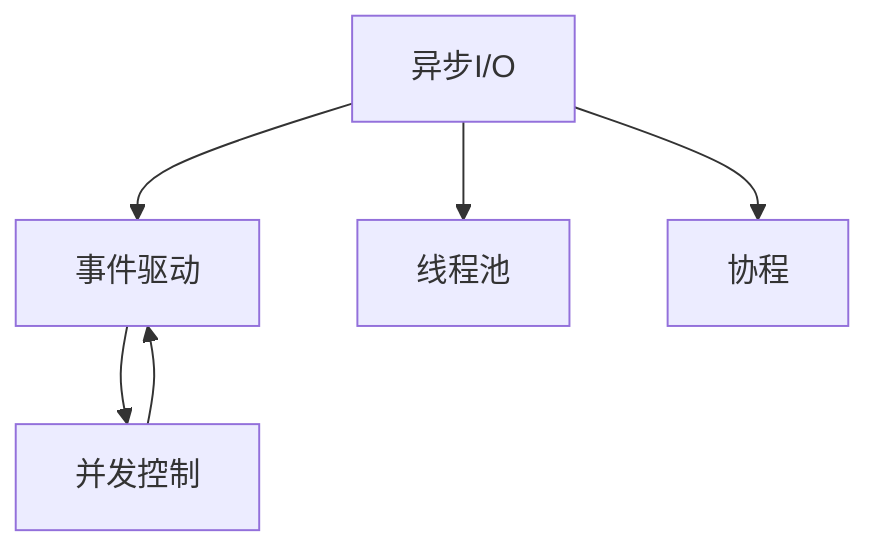

                 

## 1. 背景介绍

在互联网时代，用户对应用程序的响应速度和稳定性提出了更高的要求，尤其是在高吞吐量的场景下，如社交媒体、在线游戏、实时数据处理等，传统的同步处理模式无法满足需求。异步处理技术通过非阻塞I/O、线程池、协程等手段，使系统能够同时处理大量并发请求，显著提升了应用性能和用户满意度。

### 1.1 问题由来
随着网络应用规模的不断扩大，传统的同步阻塞式I/O处理模式逐渐暴露出其局限性，主要体现在以下几个方面：
- **I/O等待时间长**：同步阻塞I/O操作在处理大量并发请求时，导致程序长时间等待I/O完成，造成吞吐量低下。
- **资源占用高**：每个请求线程在I/O等待时会占用CPU和内存资源，导致系统资源浪费。
- **扩展性差**：难以扩展，无法轻松应对高并发请求，容易产生性能瓶颈。

针对以上问题，异步处理技术应运而生。通过异步I/O、多线程、事件驱动等技术，异步处理能够同时处理多个请求，实现高吞吐量和高并发的应用场景。

### 1.2 问题核心关键点
异步处理技术在高吞吐量场景中的应用，需要考虑以下几个关键问题：
- **非阻塞I/O**：使应用程序能够同时处理多个I/O请求，提高并发能力。
- **事件驱动**：通过事件驱动机制，使程序能够响应I/O事件，实现快速响应和高吞吐量。
- **线程池**：使用线程池技术，优化线程复用和调度，提升系统效率。
- **协程**：通过协程技术，减少线程切换和锁竞争，进一步提升性能。
- **并发控制**：在异步处理中，保证数据一致性和线程安全，避免并发问题。

以上这些关键技术点，共同构成了异步处理技术的核心框架，使其在高吞吐量场景中发挥强大作用。

## 2. 核心概念与联系

### 2.1 核心概念概述

为了更好地理解异步处理技术，本节将介绍几个密切相关的核心概念：

- **异步I/O**：指应用程序在发起I/O请求后，不必等待I/O操作完成，而是继续执行后续操作，当I/O操作完成时，通过回调函数或事件机制通知应用程序，从而实现非阻塞I/O。
- **事件驱动**：指应用程序通过事件循环机制，监听I/O事件的发生，并根据事件类型触发相应的处理逻辑，实现事件驱动的异步处理。
- **线程池**：指应用程序通过创建和管理多个线程，复用线程池中的线程，减少线程创建和销毁的开销，提高系统效率。
- **协程**：指一种轻量级线程，使用协程可以降低线程切换和锁竞争，提高系统性能和并发能力。
- **并发控制**：指在高并发环境中，保证数据一致性和线程安全的机制，避免并发问题。

这些核心概念之间的逻辑关系可以通过以下Mermaid流程图来展示：



这个流程图展示异步处理技术的核心概念及其之间的关系：

1. 异步I/O允许应用程序在I/O请求未完成时继续执行。
2. 事件驱动机制使应用程序能够及时响应I/O事件。
3. 线程池优化了线程复用和调度。
4. 协程减少了线程切换和锁竞争。
5. 并发控制保证了数据一致性和线程安全。

这些概念共同构成了异步处理技术的核心框架，使其在高吞吐量场景中发挥强大作用。

## 3. 核心算法原理 & 具体操作步骤

### 3.1 算法原理概述

异步处理技术的核心思想是使用非阻塞I/O和事件驱动机制，使应用程序能够在等待I/O操作完成时，继续执行其他任务。这样，应用程序可以同时处理多个I/O请求，实现高并发和高吞吐量。

异步处理过程主要包括以下几个关键步骤：

1. 异步I/O：应用程序通过异步I/O函数发起I/O请求，并将回调函数传递给操作系统。
2. 事件驱动：操作系统接收到I/O事件后，将事件通知给应用程序，并触发回调函数。
3. 线程池：应用程序使用线程池技术，复用线程池中的线程，提高系统效率。
4. 协程：应用程序使用协程技术，减少线程切换和锁竞争，提高系统性能。
5. 并发控制：应用程序使用锁机制或原子操作，保证数据一致性和线程安全。

### 3.2 算法步骤详解

以下是异步处理技术在高吞吐量场景中的应用流程：

**Step 1: 创建异步I/O任务**

应用程序创建异步I/O任务，例如读写文件、网络套接字等，通过异步I/O函数将任务提交给操作系统，例如：

```python
import asyncio
import aiofiles

async def read_file(file_path):
    async with aiofiles.open(file_path, mode='r') as f:
        data = await f.read()
    return data
```

**Step 2: 监听I/O事件**

应用程序通过事件驱动机制，监听I/O事件的发生，例如：

```python
async def main():
    file_path = 'data.txt'
    loop = asyncio.get_event_loop()
    reader = loop.create_task(read_file(file_path))
    while True:
        event = loop.run_forever()
        if event:
            data = reader.result()
            print(data)
```

**Step 3: 复用线程池**

应用程序使用线程池技术，复用线程池中的线程，例如：

```python
import asyncio
from concurrent.futures import ThreadPoolExecutor

def read_file(file_path):
    with open(file_path, 'r') as f:
        data = f.read()
    return data

async def main():
    file_path = 'data.txt'
    loop = asyncio.get_event_loop()
    executor = ThreadPoolExecutor(max_workers=5)
    loop.set_task_executor(executor)
    reader = loop.create_task(asyncio.ensure_future(loop.run_in_executor(executor, read_file, file_path)))
    while True:
        event = loop.run_forever()
        if event:
            data = reader.result()
            print(data)
```

**Step 4: 使用协程**

应用程序使用协程技术，减少线程切换和锁竞争，例如：

```python
import asyncio
import asyncio.coroutine

@asyncio.coroutine
def read_file(file_path):
    with open(file_path, 'r') as f:
        data = yield from asyncio.coroutine(f.read, yield from)
    return data

async def main():
    file_path = 'data.txt'
    loop = asyncio.get_event_loop()
    reader = loop.create_task(asyncio.ensure_future(loop.run_in_executor(None, read_file, file_path)))
    while True:
        event = loop.run_forever()
        if event:
            data = reader.result()
            print(data)
```

**Step 5: 实现并发控制**

应用程序使用锁机制或原子操作，保证数据一致性和线程安全，例如：

```python
import asyncio
import asyncio.coroutine
import threading

@asyncio.coroutine
def read_file(file_path):
    with open(file_path, 'r') as f:
        data = yield from asyncio.coroutine(f.read, yield from)
    return data

async def main():
    file_path = 'data.txt'
    loop = asyncio.get_event_loop()
    reader = loop.create_task(asyncio.ensure_future(loop.run_in_executor(None, read_file, file_path)))
    while True:
        event = loop.run_forever()
        if event:
            data = reader.result()
            print(data)
```

### 3.3 算法优缺点

异步处理技术在高吞吐量场景中具有以下优点：

- **高并发**：通过非阻塞I/O和事件驱动机制，应用程序能够同时处理多个I/O请求，实现高并发。
- **低延迟**：由于减少了线程切换和锁竞争，异步处理技术具有较低延迟，能够快速响应请求。
- **资源节省**：使用线程池和协程技术，减少线程创建和销毁的开销，节省系统资源。

同时，该技术也存在一些缺点：

- **复杂性高**：异步处理需要理解事件循环、协程等概念，编程复杂度较高。
- **学习成本高**：需要一定的学习成本，掌握异步处理的编程技巧。
- **调试困难**：由于异步处理的非阻塞特性，调试困难，容易出现错误。

尽管存在这些缺点，异步处理技术在高吞吐量场景中仍然具有巨大的优势，能够显著提升应用性能和用户满意度。

### 3.4 算法应用领域

异步处理技术在以下领域得到了广泛应用：

- **网络应用**：例如Web服务器、API网关等，能够同时处理大量并发请求。
- **实时数据处理**：例如实时数据流处理、大数据分析等，能够高效处理海量数据。
- **并发任务处理**：例如多线程并发任务、消息队列等，能够提升任务处理效率。
- **游戏开发**：例如游戏服务器、客户端等，能够提升游戏体验和性能。
- **流媒体处理**：例如视频直播、音频处理等，能够高效处理流媒体数据。

除了上述这些经典应用外，异步处理技术还在实时操作系统、智能家居、物联网等众多领域得到了广泛应用，为高吞吐量场景提供了强大的技术支持。

## 4. 数学模型和公式 & 详细讲解  
### 4.1 数学模型构建

异步处理技术在高吞吐量场景中的应用，可以通过数学模型来进一步描述。

假设系统中有$N$个异步I/O任务，每个任务的执行时间服从指数分布，期望值为$\lambda$。任务之间的执行是独立的，系统使用线程池和协程技术进行并发控制，协程的执行时间为$1/k$，其中$k$为协程的数量。

令$W$为系统执行所有任务的总时间，$C$为线程池中所有线程的等待时间之和。则有：

$$
W = \sum_{i=1}^N \lambda e^{-\lambda t}dt + C
$$

其中，$C$可以通过事件驱动机制进行优化，从而最小化系统执行时间。

### 4.2 公式推导过程

以下是对系统执行时间的推导过程：

**Step 1: 任务执行时间的概率密度函数**

令$T_i$为第$i$个任务的执行时间，$F_i(t)$为$T_i$的累积分布函数，则有：

$$
F_i(t) = 1 - e^{-\lambda t}
$$

**Step 2: 任务执行时间的期望值**

令$E[T_i]$为$T_i$的期望值，则有：

$$
E[T_i] = \int_0^\infty tF_i(t)dt = \frac{1}{\lambda}
$$

**Step 3: 任务执行时间的概率密度函数**

令$g(t)$为$T_i$的概率密度函数，则有：

$$
g(t) = \frac{dF_i(t)}{dt} = \lambda e^{-\lambda t}
$$

**Step 4: 系统执行时间的期望值**

令$W$为系统执行所有任务的总时间，$C$为线程池中所有线程的等待时间之和。则有：

$$
W = \sum_{i=1}^N \lambda e^{-\lambda t}dt + C
$$

通过优化$C$，使$W$最小化，从而得到系统执行时间的期望值。

### 4.3 案例分析与讲解

以一个简单的例子来说明异步处理技术的应用：

**Example 1: 文件读取**

假设系统需要读取一个文本文件，文件大小为1MB，每个I/O操作的读取速度为1MB/s。使用异步I/O和协程技术，系统可以同时读取多个文件，提高读取效率。

**Example 2: 网络请求**

假设系统需要向多个服务器发送HTTP请求，每个请求的响应时间为0.1s。使用异步I/O和事件驱动技术，系统可以同时处理多个请求，提高响应效率。

## 5. 项目实践：代码实例和详细解释说明

### 5.1 开发环境搭建

在进行异步处理实践前，我们需要准备好开发环境。以下是使用Python进行asyncio开发的环境配置流程：

1. 安装Python 3.7以上版本，推荐使用Anaconda管理Python环境。

2. 安装asyncio库：
```bash
pip install asyncio
```

3. 安装aiohttp库（用于HTTP请求）：
```bash
pip install aiohttp
```

完成上述步骤后，即可在Python环境中开始异步处理实践。

### 5.2 源代码详细实现

以下是使用Python进行异步处理的应用示例，展示如何使用异步I/O、协程和事件驱动技术实现高吞吐量应用：

```python
import asyncio
import aiohttp

async def fetch_page(url):
    async with aiohttp.ClientSession() as session:
        async with session.get(url) as response:
            html = await response.text()
            return html

async def main():
    urls = ['http://example.com', 'http://example.org', 'http://example.net']
    tasks = [asyncio.ensure_future(fetch_page(url)) for url in urls]
    results = await asyncio.gather(*tasks)
    print(results)

loop = asyncio.get_event_loop()
loop.run_until_complete(main())
loop.close()
```

在这个示例中，我们使用了Python的asyncio库和aiohttp库，实现了并行请求多个网页的功能。具体实现步骤如下：

1. 定义`fetch_page`函数，使用aiohttp库发送HTTP请求，并获取响应内容。
2. 定义`main`函数，使用`asyncio.ensure_future`将多个异步请求封装为任务。
3. 使用`asyncio.gather`函数并行执行所有任务，获取所有请求的响应结果。
4. 打印所有请求的响应内容。

### 5.3 代码解读与分析

让我们再详细解读一下关键代码的实现细节：

**fetch_page函数**：
- 使用aiohttp库创建一个客户端会话，通过`session.get(url)`发送HTTP请求。
- 使用`await response.text()`获取响应内容，返回结果。

**main函数**：
- 定义多个URL，使用`asyncio.ensure_future`将每个URL的请求封装为异步任务。
- 使用`asyncio.gather`函数并行执行所有任务，获取所有请求的响应结果。
- 打印所有请求的响应内容。

**事件驱动**：
- 在`main`函数中，所有异步任务都被封装为`asyncio.Task`对象，并使用`await`关键字等待所有任务完成。

**协程**：
- 在`fetch_page`函数中，使用`async`关键字定义协程函数。
- 在`main`函数中，使用`asyncio.gather`函数并行执行所有协程任务。

**并发控制**：
- 在`main`函数中，所有协程任务都在事件循环中执行，通过事件驱动机制进行同步和调度。

## 6. 实际应用场景

### 6.1 网络应用

异步处理技术在网络应用中得到了广泛应用，例如Web服务器、API网关等，能够同时处理大量并发请求。以下是一些典型的应用场景：

**Web服务器**：例如Nginx、Apache等，通过异步处理技术，能够高效处理大量并发连接，提升系统性能。

**API网关**：例如Zuul、Kong等，通过异步处理技术，能够处理大量的API请求，实现微服务架构的协同调用。

**WebSocket**：例如Socket.IO、Pusher等，通过异步处理技术，能够实现实时通信和推送功能。

### 6.2 实时数据处理

异步处理技术在实时数据处理中得到了广泛应用，例如实时数据流处理、大数据分析等，能够高效处理海量数据。以下是一些典型的应用场景：

**实时数据流处理**：例如Apache Kafka、Apache Flink等，通过异步处理技术，能够高效处理实时数据流，实现低延迟、高吞吐量的数据处理。

**大数据分析**：例如Hadoop、Spark等，通过异步处理技术，能够高效处理大数据集，实现高吞吐量的数据计算。

**流媒体处理**：例如Amazon Kinesis、Twitter Streaming API等，通过异步处理技术，能够高效处理流媒体数据，实现实时数据处理和分析。

### 6.3 并发任务处理

异步处理技术在并发任务处理中得到了广泛应用，例如多线程并发任务、消息队列等，能够提升任务处理效率。以下是一些典型的应用场景：

**多线程并发任务**：例如ThreadPoolExecutor、ThreadPoolTaskExecutor等，通过异步处理技术，能够提升多线程任务的处理效率。

**消息队列**：例如RabbitMQ、Kafka等，通过异步处理技术，能够实现消息的可靠传输和异步处理。

**分布式计算**：例如Hadoop、Spark等，通过异步处理技术，能够实现大规模计算任务的分布式处理。

### 6.4 未来应用展望

随着异步处理技术的不断发展和完善，其在高吞吐量场景中的应用将更加广泛，未来展望如下：

**物联网**：例如MQTT、CoAP等，通过异步处理技术，能够高效处理物联网设备的海量数据。

**智能家居**：例如Google Home、Amazon Echo等，通过异步处理技术，能够实现智能家居设备的快速响应和控制。

**实时操作系统**：例如Linux Kernel、FreeBSD等，通过异步处理技术，能够提升操作系统的响应速度和稳定性。

**云服务**：例如AWS、Google Cloud等，通过异步处理技术，能够提供高吞吐量的云服务功能。

总之，异步处理技术在高吞吐量场景中的应用前景广阔，随着技术的不断进步，将会有更多的应用场景涌现，为高吞吐量系统提供强大的技术支撑。

## 7. 工具和资源推荐

### 7.1 学习资源推荐

为了帮助开发者系统掌握异步处理技术的理论基础和实践技巧，这里推荐一些优质的学习资源：

1. Python异步编程教程：《Python异步编程实战》一书，介绍了Python异步编程的基本概念和应用场景，适合初学者入门。

2. asyncio官方文档：异步处理技术的官方文档，详细介绍了asyncio库的使用方法和示例代码，是学习和实践异步处理技术的必备资料。

3. 《Python异步编程指南》：在线课程，介绍了Python异步编程的高级技巧和优化方法，适合进阶学习。

4. aiohttp官方文档：aiohttp库的官方文档，详细介绍了HTTP请求和响应处理，是异步处理技术的核心库之一。

5. 《PyCon 2019: The Future of Python: Async and Await Everywhere》：PyCon会议上的演讲视频和PPT，介绍了异步处理技术的最新进展和应用场景。

通过对这些资源的学习实践，相信你一定能够快速掌握异步处理技术的精髓，并用于解决实际的并发问题。

### 7.2 开发工具推荐

高效的开发离不开优秀的工具支持。以下是几款用于异步处理开发的常用工具：

1. asyncio：Python的异步编程库，提供了非阻塞I/O和事件驱动机制，适合异步处理应用开发。

2. aiohttp：Python的异步HTTP客户端和服务器库，提供了高性能的HTTP请求和响应处理功能，适合Web应用开发。

3. aiofiles：Python的异步文件操作库，提供了非阻塞文件读写功能，适合文件处理应用开发。

4. uvloop：高性能的Python asyncio事件循环实现，提供了更快的I/O处理性能，适合高性能应用开发。

5. Tornado：Python的异步Web框架，提供了高性能的Web请求和响应处理功能，适合高性能Web应用开发。

合理利用这些工具，可以显著提升异步处理任务的开发效率，加快创新迭代的步伐。

### 7.3 相关论文推荐

异步处理技术的不断发展源于学界的持续研究。以下是几篇奠基性的相关论文，推荐阅读：

1. *A Programming Model for Asynchronous Programming*：《一种异步编程模型》，由Nicholas Potts和Mike LaManna提出，定义了异步编程的基本概念和编程模型。

2. *Asyncio: Asynchronous I/O in Python*：《Python的异步I/O编程》，由PEP 3148标准提出，定义了Python异步编程的基本语法和规范。

3. *The Python Multiprocessing Library*：《Python的多进程编程库》，由PEP 371标准提出，定义了Python多进程编程的基本接口和功能。

4. *High-Performance Web Application Development with Python*：《Python高性能Web应用开发》，由Brian Kluge撰写，介绍了Python高性能Web应用的异步处理技术。

5. *Asynchronous C++ Programming*：《异步C++编程》，由John Hunt撰写，介绍了C++的异步编程技术和实践方法。

这些论文代表了大异步处理技术的发展脉络。通过学习这些前沿成果，可以帮助研究者把握学科前进方向，激发更多的创新灵感。

## 8. 总结：未来发展趋势与挑战

### 8.1 总结

本文对异步处理技术在高吞吐量场景中的应用进行了全面系统的介绍。首先阐述了异步处理技术在高吞吐量场景中的重要性和应用需求，明确了异步处理在提升系统性能和用户满意度方面的独特价值。其次，从原理到实践，详细讲解了异步处理的数学模型和关键步骤，给出了异步处理任务开发的完整代码实例。同时，本文还广泛探讨了异步处理技术在网络应用、实时数据处理、并发任务处理等多个领域的应用前景，展示了异步处理技术的强大潜力。此外，本文精选了异步处理技术的各类学习资源，力求为读者提供全方位的技术指引。

通过本文的系统梳理，可以看到，异步处理技术在高吞吐量场景中发挥了重要的作用。通过异步I/O、事件驱动、线程池、协程等技术，异步处理能够同时处理多个I/O请求，实现高并发和高吞吐量。得益于Python的asyncio库和aiohttp库等工具支持，异步处理技术已经得到了广泛的应用，并在不断发展和完善。

### 8.2 未来发展趋势

展望未来，异步处理技术将在以下方面继续发展：

1. **异步编程语言的普及**：越来越多的编程语言开始支持异步编程，例如Go、Rust等，异步处理技术将得到更广泛的应用。

2. **异步框架的优化**：异步处理框架的性能和稳定性将得到进一步优化，支持更多高级功能和优化策略。

3. **分布式处理**：异步处理技术将与分布式处理技术相结合，实现大规模数据的分布式处理和存储。

4. **事件驱动架构**：异步处理技术将与其他事件驱动架构结合，实现更灵活和可扩展的系统设计。

5. **微服务架构**：异步处理技术将与微服务架构相结合，实现服务间的高效协同和数据共享。

以上趋势凸显了异步处理技术的广阔前景。这些方向的探索发展，必将进一步提升异步处理技术的性能和应用范围，为高吞吐量系统提供强大的技术支撑。

### 8.3 面临的挑战

尽管异步处理技术已经取得了一定的成就，但在迈向更加智能化、普适化应用的过程中，它仍面临着诸多挑战：

1. **编程复杂性**：异步处理技术需要理解事件循环、协程等概念，编程复杂度较高，学习成本高。

2. **调试困难**：由于异步处理的非阻塞特性，调试困难，容易出现错误。

3. **资源管理**：异步处理技术需要合理管理系统资源，避免资源浪费和性能瓶颈。

4. **网络延迟**：异步处理技术依赖网络通信，网络延迟和带宽限制会影响系统的性能。

5. **安全性和可靠性**：异步处理技术需要保证系统的安全性和可靠性，避免数据泄露和系统崩溃。

这些挑战需要开发者在使用异步处理技术时，合理设计系统架构，避免潜在的性能和安全性问题。

### 8.4 研究展望

面对异步处理技术所面临的挑战，未来的研究需要在以下几个方面寻求新的突破：

1. **编程模型优化**：优化异步编程模型的设计，降低编程复杂度，提高开发效率。

2. **并发控制优化**：优化并发控制机制，提升系统的并发能力和稳定性。

3. **资源管理优化**：优化系统资源管理策略，提高资源利用率和系统性能。

4. **网络延迟优化**：优化网络通信机制，减少网络延迟和带宽限制对系统性能的影响。

5. **安全性和可靠性**：提升系统的安全性和可靠性，保障数据安全和服务稳定。

这些研究方向的发展，必将进一步提升异步处理技术的性能和应用范围，为高吞吐量系统提供更加强大和稳定的技术支撑。

## 9. 附录：常见问题与解答

**Q1：异步处理技术与同步处理技术的区别是什么？**

A: 异步处理技术与同步处理技术的主要区别在于处理I/O请求的方式。异步处理技术在发起I/O请求后，程序不需要等待I/O操作完成，而是继续执行其他任务。当I/O操作完成时，通过回调函数或事件机制通知应用程序，从而实现非阻塞I/O。而同步处理技术在发起I/O请求后，程序必须等待I/O操作完成，才能继续执行其他任务。因此，异步处理技术能够同时处理多个I/O请求，提高系统并发性和吞吐量。

**Q2：异步处理技术的优势是什么？**

A: 异步处理技术在高吞吐量场景中具有以下优势：

1. **高并发**：通过非阻塞I/O和事件驱动机制，应用程序能够同时处理多个I/O请求，实现高并发。

2. **低延迟**：由于减少了线程切换和锁竞争，异步处理技术具有较低延迟，能够快速响应请求。

3. **资源节省**：使用线程池和协程技术，减少线程创建和销毁的开销，节省系统资源。

**Q3：异步处理技术的缺点是什么？**

A: 异步处理技术虽然在高吞吐量场景中具有优势，但也存在一些缺点：

1. **编程复杂性**：异步处理技术需要理解事件循环、协程等概念，编程复杂度较高。

2. **调试困难**：由于异步处理的非阻塞特性，调试困难，容易出现错误。

3. **资源管理**：异步处理技术需要合理管理系统资源，避免资源浪费和性能瓶颈。

4. **网络延迟**：异步处理技术依赖网络通信，网络延迟和带宽限制会影响系统的性能。

5. **安全性和可靠性**：异步处理技术需要保证系统的安全性和可靠性，避免数据泄露和系统崩溃。

尽管存在这些缺点，异步处理技术仍然在高吞吐量场景中具有巨大的优势，能够显著提升应用性能和用户满意度。

**Q4：异步处理技术在实际应用中有哪些案例？**

A: 异步处理技术在实际应用中已经得到了广泛应用，以下是一些典型的案例：

1. **网络应用**：例如Nginx、Apache、Kafka等，通过异步处理技术，能够高效处理大量并发请求和数据流。

2. **实时数据处理**：例如Apache Kafka、Apache Flink、Hadoop等，通过异步处理技术，能够高效处理海量数据和实时数据流。

3. **并发任务处理**：例如ThreadPoolExecutor、ThreadPoolTaskExecutor、Tornado等，通过异步处理技术，能够提升任务处理效率和并发能力。

4. **游戏开发**：例如Socket.IO、Pusher、WebSockets等，通过异步处理技术，能够实现实时通信和推送功能。

5. **智能家居**：例如Google Home、Amazon Echo、SmartThings等，通过异步处理技术，能够实现智能家居设备的快速响应和控制。

总之，异步处理技术已经在多个领域得到了广泛应用，为高吞吐量系统提供强大的技术支持。

---

作者：禅与计算机程序设计艺术 / Zen and the Art of Computer Programming

