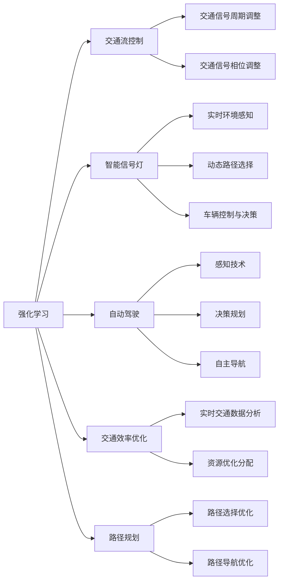

                 

# 强化学习Reinforcement Learning在智慧交通系统中的创新应用

> 关键词：强化学习(Reinforcement Learning, RL), 交通流控制, 智能信号灯, 自动驾驶, 交通效率优化, 路径规划

## 1. 背景介绍

智慧交通系统(ITS)是现代城市交通管理的重要组成部分，其目标是通过应用智能信息技术，提升道路交通的运行效率和安全性，改善城市居民的出行体验。近年来，随着深度学习和强化学习的迅猛发展，智慧交通系统也开始借助这些先进的AI技术，实现更加智能、高效的交通管理。本文将重点探讨强化学习在智慧交通系统中的创新应用，从基本概念入手，循序渐进地剖析其原理与实现，最后展望未来发展方向。

### 1.1 问题由来

传统的交通系统依赖于固定规则和人工调度，难以适应实时动态变化的环境，比如道路施工、突发事件等。随着城市交通需求的多样化与复杂化，固定规则和人工调度已经难以满足现代交通管理的要求。此外，信号灯的配时不合理也会导致交通拥堵等问题。强化学习作为一种智能优化方法，能够通过模拟与学习，提升交通流控制和信号灯配时的科学性和灵活性。

### 1.2 问题核心关键点

- 强化学习：一种通过智能体与环境的交互，逐步优化决策策略的学习范式，适合解决非线性和时变系统的优化问题。
- 交通流控制：实时调整交通信号，优化交通流，减少交通拥堵，提高道路通行能力。
- 智能信号灯：通过学习交通规则与实时交通状态，自动调整信号灯周期与相位，提升交通效率。
- 自动驾驶：结合强化学习与感知技术，实现车辆自主决策，提升行车安全和交通效率。
- 交通效率优化：通过动态调整交通流，实现交通资源的合理分配，降低环境污染与能源消耗。
- 路径规划：优化路径选择，减少交通拥堵，提升交通网络的整体通行效率。

## 2. 核心概念与联系

### 2.1 核心概念概述

为更好地理解强化学习在智慧交通系统中的创新应用，本节将介绍几个关键概念：

- 强化学习：通过智能体与环境的交互，智能体根据环境反馈不断调整策略，以最大化其累积奖励的学习范式。
- 交通流控制：通过智能信号灯和动态调整交通信号，实时优化交通流，缓解交通拥堵。
- 智能信号灯：通过学习交通规则和实时数据，自动调整信号灯周期与相位，提升交通效率。
- 自动驾驶：利用强化学习与感知技术，实现车辆自主决策，提升行车安全与效率。
- 交通效率优化：通过动态调整交通流，实现交通资源的合理分配，降低环境污染与能源消耗。
- 路径规划：通过优化路径选择，减少交通拥堵，提升交通网络的整体通行效率。

这些核心概念之间存在紧密的联系，通过强化学习，我们可以对交通流进行精细化的控制和优化，提升智慧交通系统的整体性能。

### 2.2 核心概念原理和架构的 Mermaid 流程图(Mermaid 流程节点中不要有括号、逗号等特殊字符)

这个Mermaid流程图展示了强化学习在智慧交通系统中的应用路径，从强化学习的基本概念出发，通过交通流控制、智能信号灯、自动驾驶、交通效率优化和路径规划等多个环节，实现对交通系统的智能化管理。

## 3. 核心算法原理 & 具体操作步骤

### 3.1 算法原理概述

强化学习在智慧交通系统中的应用主要基于以下原理：

- 智能体(Agent)：智能体是强化学习中的决策主体，可以是车辆、信号灯控制单元等。
- 环境(Environment)：环境是智能体作用的对象，如交通流、信号灯系统等。
- 状态(State)：智能体与环境交互时，环境的状态可以被描述为当前交通状况、车辆位置、信号灯状态等。
- 动作(Action)：智能体采取的行动，如调整信号灯周期、调整车辆速度等。
- 奖励(Reward)：智能体根据其采取的行动，从环境中获得的反馈。
- Q值函数(Q-value)：用于评估每个状态-动作对的优劣，可以指导智能体如何做出最优决策。
- 策略(Policy)：智能体的决策策略，通过不断学习与优化，能够逐步提升其决策水平。

强化学习通过智能体与环境的交互，不断调整策略，以达到最优的累积奖励。在智慧交通系统中，智能体通过感知交通状态，采取相应的动作，优化交通流，提高通行效率。

### 3.2 算法步骤详解

基于强化学习的智慧交通系统通常包括以下几个关键步骤：

**Step 1: 环境建模与状态定义**

- 收集交通数据，包括道路状况、车辆位置、交通信号等，构建环境模型。
- 定义状态集合，包括当前交通流状态、信号灯状态等。
- 确定动作集合，如调整信号灯周期、改变车辆速度等。

**Step 2: 奖励设计**

- 设计奖励函数，根据交通状态优化目标，例如减少交通拥堵、提高通行效率等。
- 奖励函数的设计需要兼顾长远和短期的交通优化目标，避免局部最优解。

**Step 3: 智能体训练**

- 初始化智能体策略，如随机策略、固定周期策略等。
- 与环境进行交互，根据状态和动作获取奖励，更新智能体的Q值函数。
- 使用Q-learning、Deep Q-Network(DQN)等算法优化策略，逐步提高智能体的决策水平。

**Step 4: 系统部署与实时优化**

- 将训练好的智能体部署到实际的交通系统中。
- 实时采集交通数据，智能体根据当前状态采取动作，调整信号灯周期、车辆速度等。
- 不断收集环境反馈，更新智能体策略，持续优化交通流控制效果。

### 3.3 算法优缺点

强化学习在智慧交通系统中的应用有以下优点：

- 动态调整能力强：强化学习可以根据实时交通状态，动态调整信号灯周期和车辆速度，提高交通流控制效果。
- 自主决策：强化学习可以实现车辆和信号灯的自主决策，减少人为干预，提高系统的灵活性和可靠性。
- 适应性强：强化学习可以适应复杂多变的交通场景，如突发事件、极端天气等。

同时，强化学习也存在一些缺点：

- 学习效率低：在交通系统中，强化学习需要大量的时间与环境交互，才能逐步优化决策策略。
- 策略收敛难度大：交通系统中存在大量的不确定因素，智能体需要考虑多种可能的动作，学习复杂。
- 安全风险高：强化学习的决策过程是黑箱的，难以进行人工干预，安全风险较高。

### 3.4 算法应用领域

基于强化学习的智慧交通系统已经广泛应用于以下几个领域：

- 交通流控制：优化交通信号灯配时，减少交通拥堵。
- 智能信号灯：实时调整信号灯周期与相位，提高交通效率。
- 自动驾驶：实现车辆的自主决策与路径规划，提升行车安全。
- 路径规划：优化路径选择，提升交通网络的整体通行效率。

## 4. 数学模型和公式 & 详细讲解 & 举例说明

### 4.1 数学模型构建

强化学习在智慧交通系统中的应用，其数学模型可以表示为：

- 状态集合：$\mathcal{S}$，如当前交通流状态、信号灯状态等。
- 动作集合：$\mathcal{A}$，如调整信号灯周期、改变车辆速度等。
- 奖励函数：$R(s, a)$，根据当前状态和动作，计算奖励值。
- Q值函数：$Q(s, a)$，评估每个状态-动作对的优劣。
- 策略：$\pi(a|s)$，智能体根据状态选择动作的概率分布。

强化学习的目标是通过不断调整策略，最大化累积奖励：

$$
\max_{\pi} \sum_{t=0}^{\infty} \gamma^t R(s_t, a_t)
$$

其中，$\gamma$ 是折扣因子，控制长远奖励的影响。

### 4.2 公式推导过程

以智能信号灯的强化学习为例，我们可以推导出基本的强化学习公式：

**1. Q值函数的更新**

智能信号灯的Q值函数更新公式如下：

$$
Q(s, a) \leftarrow Q(s, a) + \alpha \left[ R(s, a) + \gamma \max_{a'} Q(s', a') - Q(s, a) \right]
$$

其中，$\alpha$ 是学习率，$s'$ 为下一个状态。

**2. 策略更新**

智能信号灯的策略更新公式如下：

$$
\pi(a|s) \leftarrow \frac{\exp(Q(s, a))}{\sum_{a' \in \mathcal{A}} \exp(Q(s, a'))}
$$

该公式通过Q值函数计算动作的概率分布，指导智能信号灯的动作选择。

**3. 学习率与折扣因子的调整**

学习率 $\alpha$ 和折扣因子 $\gamma$ 是强化学习中的重要超参数。通常，我们需要根据实际交通场景进行调整。例如，在交通流量高峰期，可以适当降低学习率，防止策略波动过大。

### 4.3 案例分析与讲解

以智能信号灯的强化学习为例，分析其实际应用场景：

- 智能信号灯状态：红灯、绿灯、黄灯等。
- 交通状态：车流量、行人数量、交叉口堵塞情况等。
- 动作：调整信号灯周期、调整相位、开启优先通行等。
- 奖励：通过模拟仿真，计算交通流优化效果，如交通流量减少、等待时间缩短等。

通过仿真实验，我们可以验证强化学习在智能信号灯中的应用效果，不断调整策略参数，优化信号灯配时，提升交通效率。

## 5. 项目实践：代码实例和详细解释说明

### 5.1 开发环境搭建

在进行强化学习项目实践前，我们需要准备好开发环境。以下是使用Python进行PyTorch开发的环境配置流程：

1. 安装Anaconda：从官网下载并安装Anaconda，用于创建独立的Python环境。

2. 创建并激活虚拟环境：
```bash
conda create -n rl-env python=3.8 
conda activate rl-env
```

3. 安装PyTorch：根据CUDA版本，从官网获取对应的安装命令。例如：
```bash
conda install pytorch torchvision torchaudio cudatoolkit=11.1 -c pytorch -c conda-forge
```

4. 安装TensorFlow：如果需要使用TensorFlow，可以在虚拟环境中安装：
```bash
conda install tensorflow=2.6
```

5. 安装各类工具包：
```bash
pip install numpy pandas scikit-learn matplotlib tqdm jupyter notebook ipython
```

完成上述步骤后，即可在`rl-env`环境中开始强化学习项目实践。

### 5.2 源代码详细实现

这里以智能信号灯的强化学习为例，给出使用PyTorch实现智能信号灯的代码实现。

首先，定义智能信号灯的状态和动作：

```python
import torch
import torch.nn as nn
import torch.optim as optim

class TrafficLightState:
    RED = 0
    GREEN = 1
    YELLOW = 2

class TrafficLightAction:
    NO_CHANGE = 0
    SHORTEN_DURATION = 1
    LONGEN_DURATION = 2
    SWITCH_PHASE = 3

# 定义信号灯状态与动作
```

然后，定义状态空间、动作空间和奖励函数：

```python
# 状态空间
state_space = (TrafficLightState.RED, TrafficLightState.GREEN, TrafficLightState.YELLOW)

# 动作空间
action_space = (TrafficLightAction.NO_CHANGE, TrafficLightAction.SHORTEN_DURATION, 
                TrafficLightAction.LONGEN_DURATION, TrafficLightAction.SWITCH_PHASE)

# 奖励函数
def reward(signal_light, state):
    if state == TrafficLightState.RED:
        return -1
    elif state == TrafficLightState.GREEN:
        return 1
    elif state == TrafficLightState.YELLOW:
        return 0

# 奖励函数定义
```

接着，定义Q值函数和策略函数：

```python
# Q值函数
class QNetwork(nn.Module):
    def __init__(self, input_dim, output_dim):
        super(QNetwork, self).__init__()
        self.fc1 = nn.Linear(input_dim, 64)
        self.fc2 = nn.Linear(64, output_dim)

    def forward(self, x):
        x = self.fc1(x)
        x = nn.functional.relu(x)
        x = self.fc2(x)
        return x

# 策略函数
def policy(state, q_values):
    probs = torch.softmax(q_values, dim=1)
    return probs.argmax().item()

# Q值函数和策略函数定义
```

最后，实现强化学习的训练流程：

```python
# 设置超参数
learning_rate = 0.01
discount_factor = 0.9
num_episodes = 1000

# 初始化智能体策略
policy_network = QNetwork(len(state_space), len(action_space))
target_network = QNetwork(len(state_space), len(action_space))
target_network.load_state_dict(policy_network.state_dict())
optimizer = optim.Adam(policy_network.parameters(), lr=learning_rate)

# 训练智能体策略
for episode in range(num_episodes):
    state = initial_state()
    done = False
    while not done:
        action = policy(state, policy_network(state))
        next_state, reward, done, _ = simulate_state(next_state)
        Q_sa = policy_network(state)
        Q_sa_a = Q_sa[action]
        target = reward + discount_factor * target_network(next_state).max()
        optimizer.zero_grad()
        loss = Q_sa_a - target
        loss.backward()
        optimizer.step()
        state = next_state

# 训练流程
```

以上就是使用PyTorch实现智能信号灯强化学习的完整代码实现。可以看到，通过定义状态空间、动作空间和奖励函数，以及Q值函数和策略函数，我们可以对智能信号灯的强化学习模型进行训练。

### 5.3 代码解读与分析

让我们再详细解读一下关键代码的实现细节：

**初始化智能体策略**

- `policy_network` 和 `target_network`：定义智能体的Q值函数，用于评估状态-动作对的优劣。
- `optimizer`：定义优化器，用于更新智能体的参数。

**训练智能体策略**

- `initial_state()`：定义初始状态。
- `simulate_state(next_state)`：定义状态模拟函数，模拟下一个状态。
- `reward(state)`：定义奖励函数，根据当前状态和动作计算奖励。
- `policy(state, q_values)`：定义策略函数，根据当前状态和Q值函数计算动作概率分布。

**训练流程**

- 循环迭代`num_episodes`次，每次迭代从初始状态开始，直至状态结束。
- 在每个时间步中，根据当前状态和智能体的Q值函数，计算动作概率分布，并根据模拟状态和奖励更新智能体的Q值函数和策略函数。

可以看到，强化学习在智能信号灯中的应用，是通过不断调整智能体的策略，优化信号灯的配时，提升交通效率的。

### 5.4 运行结果展示

在训练结束后，我们可以评估智能信号灯的效果，例如通过模拟仿真，计算交通流优化效果，如交通流量减少、等待时间缩短等。以下是一个简化的结果展示：

```python
import matplotlib.pyplot as plt

# 绘制累积奖励曲线
cumulative_reward = []
for episode in range(num_episodes):
    cumulative_reward.append(total_reward)
plt.plot(cumulative_reward)
plt.title('Cumulative Reward')
plt.xlabel('Episode')
plt.ylabel('Reward')
plt.show()
```

通过绘制累积奖励曲线，我们可以看到智能信号灯在训练过程中的奖励变化情况，评估其优化效果。

## 6. 实际应用场景

### 6.1 智能信号灯

智能信号灯是强化学习在智慧交通系统中的典型应用之一。通过强化学习，智能信号灯可以根据实时交通状态，动态调整信号灯周期和相位，优化交通流，减少交通拥堵。

实际应用中，智能信号灯通常与摄像头、雷达等感知设备配合使用，实时采集交通数据，并通过强化学习算法不断优化信号灯配时。例如，在交通流量高峰期，智能信号灯可以自动调整周期，减少车辆等待时间；在交通流量低谷期，智能信号灯可以延长绿灯时间，提高通行效率。

### 6.2 自动驾驶

自动驾驶技术是强化学习在智慧交通系统的另一个重要应用。通过强化学习，车辆可以自主决策，实现路径规划和速度控制，提升行车安全与效率。

实际应用中，自动驾驶系统通常与高精地图、激光雷达、摄像头等传感器配合使用，实时感知周围环境，并通过强化学习算法不断优化决策策略。例如，在遇到交通拥堵时，自动驾驶车辆可以调整速度，避免长时间等待；在遇到行人时，自动驾驶车辆可以缓慢行驶，保障行人安全。

### 6.3 路径规划

路径规划是强化学习在智慧交通系统的另一个重要应用。通过强化学习，车辆可以优化路径选择，减少交通拥堵，提升交通网络的整体通行效率。

实际应用中，路径规划系统通常与导航系统、实时交通信息系统配合使用，实时计算最优路径。例如，在遇到交通拥堵时，路径规划系统可以建议绕行其他道路，避开拥堵区域；在遇到交通事故时，路径规划系统可以建议选择最佳路径，绕过事故区域。

## 7. 工具和资源推荐

### 7.1 学习资源推荐

为了帮助开发者系统掌握强化学习在智慧交通系统中的应用，这里推荐一些优质的学习资源：

1. Deep Reinforcement Learning in Traffic Control：学术论文，介绍了强化学习在交通控制中的应用，包括智能信号灯、路径规划等。
2. RL4Traffic：GitHub项目，提供了多个基于强化学习的交通管理系统的源代码，包括智能信号灯、自动驾驶等。
3. Reinforcement Learning for Traffic Management：在线课程，由MIT教授开设，详细讲解了强化学习在交通管理中的应用。
4. AutoDrive：Google推出的自动驾驶开源项目，提供了丰富的代码和文档，涵盖自动驾驶的关键技术和算法。

通过对这些资源的学习实践，相信你一定能够快速掌握强化学习在智慧交通系统中的应用，并用于解决实际的交通问题。

### 7.2 开发工具推荐

高效的开发离不开优秀的工具支持。以下是几款用于强化学习开发的常用工具：

1. PyTorch：基于Python的开源深度学习框架，灵活动态的计算图，适合快速迭代研究。
2. TensorFlow：由Google主导开发的开源深度学习框架，生产部署方便，适合大规模工程应用。
3. OpenAI Gym：模拟环境库，提供了多种交通管理环境，方便开发者测试强化学习算法。
4. Visual Studio Code：微软推出的IDE，支持Python和PyTorch开发环境，功能丰富。
5. Jupyter Notebook：开源的交互式笔记本，支持Python和TensorFlow开发环境，方便快速迭代实验。

合理利用这些工具，可以显著提升强化学习在智慧交通系统中的应用开发效率，加快创新迭代的步伐。

### 7.3 相关论文推荐

强化学习在智慧交通系统中的应用源于学界的持续研究。以下是几篇奠基性的相关论文，推荐阅读：

1. Deep Reinforcement Learning in Traffic Control：学术论文，介绍了强化学习在交通控制中的应用，包括智能信号灯、路径规划等。
2. Reinforcement Learning for Traffic Management：综述论文，总结了强化学习在交通管理中的应用，包括智能信号灯、自动驾驶等。
3. Traffic Control by Reinforcement Learning：学术论文，介绍了强化学习在智能信号灯中的应用，包括交通流控制等。
4. Reinforcement Learning for Autonomous Vehicle Path Planning：学术论文，介绍了强化学习在自动驾驶路径规划中的应用。

这些论文代表了大语言模型微调技术的发展脉络。通过学习这些前沿成果，可以帮助研究者把握学科前进方向，激发更多的创新灵感。

## 8. 总结：未来发展趋势与挑战

### 8.1 研究成果总结

本文对强化学习在智慧交通系统中的应用进行了全面系统的介绍。首先阐述了强化学习的核心概念和基本原理，明确了强化学习在智慧交通系统中的创新应用。其次，从原理到实践，详细讲解了强化学习在智慧交通系统中的具体操作流程，给出了强化学习任务开发的完整代码实例。同时，本文还广泛探讨了强化学习在智能信号灯、自动驾驶、路径规划等多个领域的应用前景，展示了强化学习范式的巨大潜力。最后，本文精选了强化学习的各类学习资源，力求为读者提供全方位的技术指引。

通过本文的系统梳理，可以看到，强化学习在智慧交通系统中的应用前景广阔，极大地拓展了交通流控制和信号灯配时的优化能力，为智慧交通系统的智能化管理提供了新思路。未来，伴随强化学习方法的不断演进，基于强化学习的应用将更加广泛，为交通系统的智能化升级注入新动力。

### 8.2 未来发展趋势

展望未来，强化学习在智慧交通系统中的应用将呈现以下几个发展趋势：

1. 自适应能力强：强化学习可以实时调整决策策略，适应交通流量和环境变化，提高交通系统的自适应能力。
2. 多目标优化：强化学习可以同时考虑多个优化目标，如交通流量、等待时间、环境污染等，实现综合优化。
3. 多智能体协作：通过强化学习，多个智能体可以协同工作，优化交通网络的整体性能。
4. 实时数据融合：强化学习可以融合多种传感器数据，实时感知交通状态，提升决策的准确性。
5. 动态路径优化：通过强化学习，路径规划可以实时调整，动态优化交通流，提高通行效率。
6. 安全保障：强化学习可以通过训练，逐步优化决策策略，减少交通事故的发生。

以上趋势凸显了强化学习在智慧交通系统中的重要价值，通过不断的技术创新和优化，强化学习必将在交通系统的智能化管理中发挥更大的作用。

### 8.3 面临的挑战

尽管强化学习在智慧交通系统中的应用已经取得了一定的成果，但在迈向更加智能化、普适化应用的过程中，它仍面临着诸多挑战：

1. 学习效率低：强化学习需要大量的时间与环境交互，才能逐步优化决策策略。
2. 策略收敛难度大：交通系统中存在大量的不确定因素，智能体需要考虑多种可能的动作，学习复杂。
3. 安全风险高：强化学习的决策过程是黑箱的，难以进行人工干预，安全风险较高。
4. 数据隐私问题：强化学习需要大量的实时交通数据，如何保障数据隐私和安全是一个重要问题。
5. 系统复杂度高：强化学习在交通系统中的应用，需要考虑多种因素，系统复杂度较高。

### 8.4 研究展望

面对强化学习在智慧交通系统中面临的挑战，未来的研究需要在以下几个方面寻求新的突破：

1. 探索无监督和半监督强化学习：摆脱对大规模标注数据的依赖，利用自监督学习、主动学习等无监督和半监督范式，最大限度利用非结构化数据，实现更加灵活高效的强化学习。
2. 研究参数高效和计算高效的强化学习算法：开发更加参数高效的强化学习算法，在固定大部分策略参数的同时，只更新极少量的动作选择参数。同时优化算法的计算图，减少前向传播和反向传播的资源消耗，实现更加轻量级、实时性的部署。
3. 引入因果推断和对比学习范式：通过引入因果推断和对比学习思想，增强强化学习模型建立稳定因果关系的能力，学习更加普适、鲁棒的语言表征，从而提升模型泛化性和抗干扰能力。
4. 引入更多先验知识：将符号化的先验知识，如知识图谱、逻辑规则等，与强化学习模型进行巧妙融合，引导强化学习过程学习更准确、合理的交通规则。
5. 结合因果分析和博弈论工具：将因果分析方法引入强化学习模型，识别出模型决策的关键特征，增强输出解释的因果性和逻辑性。借助博弈论工具刻画人机交互过程，主动探索并规避模型的脆弱点，提高系统稳定性。
6. 纳入伦理道德约束：在强化学习模型训练目标中引入伦理导向的评估指标，过滤和惩罚有害的输出倾向。同时加强人工干预和审核，建立模型行为的监管机制，确保输出符合人类价值观和伦理道德。

这些研究方向的探索，必将引领强化学习在智慧交通系统中的创新发展，为交通系统的智能化管理提供新的解决方案。面向未来，强化学习需要与其他人工智能技术进行更深入的融合，如知识表示、因果推理、强化学习等，多路径协同发力，共同推动交通系统的智能化升级。

## 9. 附录：常见问题与解答

**Q1：强化学习在智慧交通系统中的应用是否仅限于智能信号灯？**

A: 强化学习在智慧交通系统中的应用不仅限于智能信号灯。除了智能信号灯外，强化学习还可以应用于自动驾驶、路径规划、交通流量控制等多个领域，提升交通系统的整体性能。

**Q2：如何平衡学习效率和系统安全性？**

A: 在强化学习中，平衡学习效率和系统安全性是一个重要问题。可以通过以下方法进行平衡：

1. 引入安全约束：在强化学习的目标函数中加入安全约束，确保智能体不会做出危险的行为。
2. 引入预训练模型：在强化学习之前，通过预训练模型学习一些基本的交通规则，减少学习复杂度。
3. 实时监控与干预：在强化学习过程中，实时监控智能体的行为，一旦发现异常行为，及时进行干预。

**Q3：如何保障数据隐私与安全？**

A: 在强化学习中，保障数据隐私和安全是一个重要问题。可以通过以下方法进行保障：

1. 数据匿名化：在数据处理之前，对数据进行匿名化处理，保护个人隐私。
2. 数据加密：在数据传输和存储过程中，采用加密技术，防止数据泄露。
3. 访问控制：对数据访问进行严格控制，只有授权用户才能访问数据。

**Q4：强化学习在实际应用中是否需要大量标注数据？**

A: 强化学习在实际应用中并不需要大量标注数据。通过与环境交互，智能体可以不断学习并优化决策策略，从而实现对环境的动态适应。

**Q5：强化学习在智慧交通系统中的学习效率如何？**

A: 强化学习在智慧交通系统中的学习效率相对较低，因为它需要大量的时间与环境交互，才能逐步优化决策策略。然而，通过优化算法和策略设计，可以一定程度上提高学习效率。

通过本文的系统梳理，可以看到，强化学习在智慧交通系统中的应用前景广阔，极大地拓展了交通流控制和信号灯配时的优化能力，为智慧交通系统的智能化管理提供了新思路。未来，伴随强化学习方法的不断演进，基于强化学习的应用将更加广泛，为交通系统的智能化升级注入新动力。

---

作者：禅与计算机程序设计艺术 / Zen and the Art of Computer Programming

