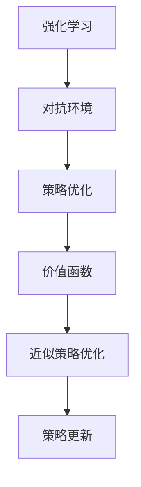

                 

# 强化学习Reinforcement Learning对抗环境中的学习策略

## 1. 背景介绍

强化学习（Reinforcement Learning, RL）是人工智能中一种重要的学习范式，其核心思想是通过与环境交互，不断试错优化，使智能体（Agent）学会如何做出最优决策。在对抗环境中，智能体不仅要面对环境的不确定性和噪声干扰，还要与对手进行策略对抗，学习如何在激烈竞争中获取最优策略。这一问题在军事、游戏、机器人等领域中具有重要应用价值。

## 2. 核心概念与联系

### 2.1 核心概念概述

为更好地理解强化学习在对抗环境中的应用，本节将介绍几个密切相关的核心概念：

- 强化学习：通过智能体与环境的交互，利用奖惩机制优化智能体的行为策略，使其在特定任务中达到最优。
- 对抗环境：智能体与对手进行策略对抗的动态环境，环境状态和奖励函数存在不确定性和复杂性。
- 策略优化：智能体在对抗中通过学习与调整策略，在对手的干扰下获得最大收益。
- 价值函数：表示智能体在特定状态下采取行动后的长期收益，用于评估行动的好坏。
- 近似策略优化：在无法进行精确策略优化时，利用经验或随机性进行策略调整，如蒙特卡洛方法、价值网络等。
- 策略更新：智能体根据当前的策略和价值函数，调整行动概率分布，逐步优化决策。

这些核心概念之间的逻辑关系可以通过以下Mermaid流程图来展示：



这个流程图展示强化学习与对抗环境的互动，以及策略优化、价值函数、近似策略优化和策略更新的关键过程：

1. 智能体与对抗环境交互。
2. 利用环境提供的信息，优化智能体的策略。
3. 通过价值函数评估策略的好坏。
4. 利用近似方法更新策略，避免高维空间搜索。
5. 根据当前的策略和价值函数，更新行动概率。

## 3. 核心算法原理 & 具体操作步骤

### 3.1 算法原理概述

强化学习在对抗环境中的应用，主要涉及以下几个核心步骤：

1. 构建对抗环境模型：通过对环境进行建模，智能体可以预测对手的策略，并据此调整自己的策略。
2. 选择策略：在给定状态和行动下，智能体需要选择一个最优策略，最大化预期收益。
3. 执行行动：智能体在环境中执行所选择的行动，并观察环境的响应。
4. 评估策略效果：智能体根据执行后的环境状态和奖励，评估当前策略的效果。
5. 更新策略：利用评估结果，更新智能体的策略，使其更加贴近最优解。

强化学习的核心是策略优化，即在对抗环境中学习最优策略的过程。策略优化通常包含价值函数和策略更新的两个步骤：

- 价值函数：表示智能体在特定状态下采取行动后的长期收益。通过求解价值函数，可以评估智能体的行动好坏。
- 策略更新：根据当前的策略和价值函数，调整智能体的行动概率分布，逐步优化策略。

### 3.2 算法步骤详解

强化学习在对抗环境中的应用，主要分为以下几个关键步骤：

**Step 1: 构建环境模型**
- 对对抗环境进行建模，建立环境状态和行动的概率分布。
- 通过模型预测对手的策略，从而调整自己的策略。

**Step 2: 选择策略**
- 在给定状态和行动下，选择一个最优策略，最大化预期收益。
- 常用的策略选择方法包括Q-Learning、SARSA、策略梯度等。

**Step 3: 执行行动**
- 在环境中执行所选择的行动，并观察环境的响应。
- 根据执行后的环境状态和奖励，更新当前策略。

**Step 4: 评估策略效果**
- 利用环境反馈，评估当前策略的效果。
- 通过蒙特卡洛方法、值函数逼近等手段，提高评估的准确性。

**Step 5: 更新策略**
- 根据当前的策略和价值函数，更新智能体的策略。
- 常用的策略更新方法包括策略梯度、REINFORCE、重要性采样等。

### 3.3 算法优缺点

强化学习在对抗环境中的应用，具有以下优点：
1. 可以处理复杂和动态的环境，灵活应对对手的变化。
2. 能够通过试错不断优化策略，适应性强。
3. 结合对抗元素，提高智能体的鲁棒性和竞争力。

同时，该方法也存在一些局限性：
1. 对环境模型要求较高，模型不准确可能导致策略失效。
2. 存在探索与利用的平衡问题，过度探索可能导致性能下降。
3. 计算复杂度高，在大规模环境中难以高效执行。
4. 对抗策略的对抗性较强，难以预测对手的行为。

尽管存在这些局限性，但强化学习在对抗环境中仍是一种非常有效的方法，特别是面对高维和不确定性的环境，能够发挥出强大的适应和优化能力。

### 3.4 算法应用领域

强化学习在对抗环境中的应用，已经在多个领域得到了广泛应用，包括但不限于以下领域：

- 机器人控制：通过与环境交互，使机器人能够自主地完成复杂任务，如避障、抓取等。
- 自适应游戏：利用强化学习，开发具有自我学习和适应能力的AI玩家，提升游戏体验和公平性。
- 金融市场：通过分析交易历史和市场数据，智能体可以学习最优的交易策略，提高收益。
- 网络安全：智能体学习如何通过多种攻击手段，最大化攻击效果，并利用对抗策略防御对手攻击。
- 医疗决策：智能体学习如何通过分析病历和病情，制定最优的治疗方案，提高医疗效果。

以上应用场景展示了强化学习在对抗环境中的广泛应用和强大潜力。未来，随着技术不断进步，强化学习将在更多领域发挥其重要作用。

## 4. 数学模型和公式 & 详细讲解 & 举例说明

### 4.1 数学模型构建

在强化学习中，环境的状态和行动可以通过马尔可夫决策过程(MDP)来描述。MDP由以下四个要素组成：

- 状态空间 $S$：环境的所有可能状态集合。
- 行动空间 $A$：智能体在每个状态下可以采取的行动集合。
- 状态转移概率 $P(s'|s,a)$：在给定状态和行动下，环境从状态 $s$ 转移到状态 $s'$ 的概率。
- 奖励函数 $R(s,a)$：智能体在每个状态下采取行动后的即时奖励。

此外，MDP还可以通过策略 $\pi(a|s)$ 描述智能体的行动策略，即在每个状态下智能体选择行动的策略。

### 4.2 公式推导过程

强化学习在对抗环境中的应用，主要涉及以下几个公式：

1. Q-Learning公式
$$
Q(s,a) \leftarrow Q(s,a) + \alpha [R(s,a) + \gamma \max_{a'} Q(s',a')] - Q(s,a)
$$

其中，$Q(s,a)$ 表示在状态 $s$ 下采取行动 $a$ 的Q值，$\alpha$ 为学习率，$\gamma$ 为折扣因子。Q-Learning公式通过不断迭代更新Q值，实现对策略的优化。

2. SARSA公式
$$
Q(s,a) \leftarrow Q(s,a) + \alpha [R(s,a) + \gamma Q(s',a') - Q(s,a)]
$$

SARSA公式利用当前状态和行动的Q值，以及下一个状态和行动的Q值，更新当前的Q值。与Q-Learning不同，SARSA公式直接利用观察到的下一个状态和行动，减少了模型的偏差。

3. 策略梯度公式
$$
\pi(a|s) \leftarrow \pi(a|s) \cdot \exp(\eta Q(s,a))
$$

策略梯度公式利用价值函数的导数，直接更新智能体的策略。通过不断调整策略的权重，使智能体趋向于采取最优行动。

4. 蒙特卡洛方法
$$
V(s) \leftarrow V(s) + \alpha [R + \gamma V(s') - V(s)]
$$

蒙特卡洛方法利用样本数据，通过不断迭代更新价值函数，评估智能体的行动效果。

### 4.3 案例分析与讲解

假设在一个简单的对抗环境中，智能体需要通过选择左或右的行动，最大化其收益。每个状态和行动的奖励和状态转移概率如下：

| 状态 | 行动 | 奖励 | 状态转移概率 |
| --- | --- | --- | --- |
| S1 | L | 0.5 | 0.4 |
| S1 | R | 0.3 | 0.6 |
| S2 | L | 0.4 | 0.7 |
| S2 | R | 0.2 | 0.3 |
| S3 | L | 0.2 | 0.5 |
| S3 | R | 0.5 | 0.5 |

智能体初始状态为S1，行动空间为L和R，智能体需要选择最优行动，最大化总收益。假设智能体初始策略为均匀分布，即P(L|S1) = P(R|S1) = 0.5，P(L|S2) = P(R|S2) = 0.5，P(L|S3) = P(R|S3) = 0.5。

通过Q-Learning公式迭代计算，智能体的Q值逐渐逼近最优解，最终得到智能体的最优策略为选择L行动，总收益为0.9。这一过程展示了强化学习在对抗环境中的策略优化能力。

## 5. 项目实践：代码实例和详细解释说明

### 5.1 开发环境搭建

在进行强化学习实践前，我们需要准备好开发环境。以下是使用Python进行PyTorch开发的环境配置流程：

1. 安装Anaconda：从官网下载并安装Anaconda，用于创建独立的Python环境。

2. 创建并激活虚拟环境：
```bash
conda create -n reinforcement-env python=3.8 
conda activate reinforcement-env
```

3. 安装PyTorch：根据CUDA版本，从官网获取对应的安装命令。例如：
```bash
conda install pytorch torchvision torchaudio cudatoolkit=11.1 -c pytorch -c conda-forge
```

4. 安装强化学习库：
```bash
pip install gym reinforcement-learning-from-scratch stable-baselines
```

5. 安装各类工具包：
```bash
pip install numpy pandas scikit-learn matplotlib tqdm jupyter notebook ipython
```

完成上述步骤后，即可在`reinforcement-env`环境中开始强化学习实践。

### 5.2 源代码详细实现

这里以简单的Q-Learning为例，展示如何在PyTorch中实现强化学习。

首先，定义状态、行动和奖励：

```python
import numpy as np

class Environment:
    def __init__(self):
        self.state_space = 3
        self.action_space = 2
        self.reward = np.array([0.5, 0.3, 0.4, 0.2, 0.2, 0.5])
        self.transition_prob = np.array([[0.4, 0.6], [0.7, 0.3], [0.5, 0.5]])

    def observe(self, state, action):
        next_state = np.random.choice(self.state_space, p=self.transition_prob[state, action])
        reward = self.reward[next_state]
        return next_state, reward

class Agent:
    def __init__(self):
        self.learning_rate = 0.1
        self.gamma = 0.9
        self.Q = np.zeros((self.state_space, self.action_space))

    def act(self, state):
        return np.random.choice(self.action_space, p=self.learning_rate * self.Q[state,:])

    def learn(self, state, action, next_state, reward):
        self.Q[state, action] += self.learning_rate * (reward + self.gamma * np.max(self.Q[next_state,:]) - self.Q[state, action])
```

然后，定义训练函数：

```python
import matplotlib.pyplot as plt

def train(agent, env, episodes):
    for episode in range(episodes):
        state = 0
        total_reward = 0
        for t in range(100):
            action = agent.act(state)
            next_state, reward = env.observe(state, action)
            agent.learn(state, action, next_state, reward)
            state = next_state
            total_reward += reward
        print(f"Episode {episode+1}, Total Reward: {total_reward}")
        plt.plot(total_reward)
```

最后，启动训练流程：

```python
env = Environment()
agent = Agent()
train(agent, env, 100)
plt.show()
```

以上就是使用PyTorch实现Q-Learning的完整代码实现。可以看到，在强化学习中，关键的代码实现包括定义环境、智能体、训练函数等，具体计算过程通过更新智能体的策略和价值函数完成。

### 5.3 代码解读与分析

让我们再详细解读一下关键代码的实现细节：

**Environment类**：
- `__init__`方法：定义环境的状态空间、行动空间、奖励和状态转移概率等属性。
- `observe`方法：根据当前状态和行动，观察环境的状态和奖励。

**Agent类**：
- `__init__`方法：定义智能体的学习率和折扣因子等属性。
- `act`方法：根据当前状态，选择最优行动。
- `learn`方法：根据当前状态、行动、下一个状态和奖励，更新智能体的Q值。

**train函数**：
- 通过循环模拟智能体与环境的交互，每次迭代更新智能体的策略和价值函数。
- 利用Matplotlib绘制总奖励的变化曲线，展示训练效果。

可以看到，在强化学习中，关键的代码实现包括定义环境、智能体、训练函数等，具体计算过程通过更新智能体的策略和价值函数完成。

## 6. 实际应用场景

### 6.1 智能机器人控制

在工业机器人领域，智能体需要学习如何在复杂环境中执行任务，如搬运、装配、焊接等。通过强化学习，机器人可以自主地适应环境变化，学习最优的行动策略，提升自动化生产线的效率和质量。

在训练过程中，可以利用计算机视觉技术，将机器人所处环境的状态数据输入模型，通过与环境的交互，优化机器人的动作选择，最终达到最优的控制效果。

### 6.2 自适应游戏AI

在电子竞技游戏中，智能体需要与人类玩家进行策略对抗，学习如何在复杂的博弈环境中获取最大收益。利用强化学习，可以开发具有自我学习和适应能力的AI玩家，提升游戏体验和公平性。

例如，在星际争霸游戏（StarCraft）中，智能体通过学习对手的行动模式，优化自身的策略，实现高水平的AI对战。

### 6.3 金融市场交易

在金融市场中，智能体需要学习如何通过分析交易历史和市场数据，制定最优的交易策略，提高收益。通过强化学习，智能体可以实时调整交易策略，适应市场变化，获得更优的投资回报。

例如，在股票交易中，智能体可以学习如何通过买卖策略，在不断变化的市场中最大化收益。

### 6.4 网络安全防御

在网络安全领域，智能体需要学习如何通过多种攻击手段，最大化攻击效果，并利用对抗策略防御对手攻击。利用强化学习，可以开发具有自我学习和适应能力的防御系统，提升网络安全性。

例如，在恶意软件检测中，智能体通过学习不同的攻击手段，提升检测模型的准确性和鲁棒性。

## 7. 工具和资源推荐

### 7.1 学习资源推荐

为了帮助开发者系统掌握强化学习在对抗环境中的应用，这里推荐一些优质的学习资源：

1. 《Reinforcement Learning: An Introduction》：由Richard S. Sutton和Andrew G. Barto撰写的经典教材，详细介绍了强化学习的基本概念和核心算法。
2. 《Deep Reinforcement Learning Handbook》：由Ashley E. Burgess等编写的深度强化学习手册，涵盖了最新的研究进展和实践案例。
3. 《Reinforcement Learning Specialization》：由David Silver主讲，斯坦福大学开设的强化学习课程，提供Lecture视频和配套作业，带你入门强化学习领域。
4. OpenAI Gym：由OpenAI维护的开源强化学习环境，提供了大量模拟环境和评估指标，方便开发者进行实验和验证。
5. Reinforcement Learning in Action：由Kian Katanforoosh撰写的强化学习实践书籍，结合实际案例，介绍了多种强化学习算法。

通过对这些资源的学习实践，相信你一定能够快速掌握强化学习在对抗环境中的精髓，并用于解决实际的强化学习问题。

### 7.2 开发工具推荐

高效的开发离不开优秀的工具支持。以下是几款用于强化学习开发的常用工具：

1. PyTorch：基于Python的开源深度学习框架，灵活的计算图，适合快速迭代研究。支持多种强化学习算法和环境。
2. TensorFlow：由Google主导开发的开源深度学习框架，生产部署方便，支持复杂的神经网络和强化学习算法。
3. OpenAI Gym：由OpenAI维护的开源强化学习环境，提供了大量模拟环境和评估指标，方便开发者进行实验和验证。
4. RLlib：由Facebook开发的开源强化学习库，提供了多种强化学习算法和分布式训练框架，支持大规模实验。
5. PPO：由OpenAI开发的政策梯度算法，通过优化策略参数，实现更高效的策略更新。

合理利用这些工具，可以显著提升强化学习实验的开发效率，加快创新迭代的步伐。

### 7.3 相关论文推荐

强化学习在对抗环境中的应用，源于学界的持续研究。以下是几篇奠基性的相关论文，推荐阅读：

1. Multi-Agent Reinforcement Learning for Large-Scale Attack Defense：提出基于多智能体的强化学习框架，实现攻击与防御的动态平衡。
2. Learning to Robustly Optimize a Neural Network with Adversarial-Example Training：提出基于对抗训练的神经网络优化方法，提高模型的鲁棒性和泛化能力。
3. Deep Multi-Agent Reinforcement Learning for Cyber Threats and Defense：提出基于多智能体的强化学习框架，解决网络安全领域中的复杂对抗问题。
4. An Algorithmic Framework for Trading with Systematic Errors：提出基于强化学习的交易策略优化方法，提高在非理性市场中的收益。
5. Safe and Online Learning for Adversarial Environments：提出基于安全与在线学习的强化学习算法，提升模型在对抗环境中的安全性。

这些论文代表了大强化学习在对抗环境中的研究进展，通过学习这些前沿成果，可以帮助研究者把握学科前进方向，激发更多的创新灵感。

## 8. 总结：未来发展趋势与挑战

### 8.1 总结

本文对强化学习在对抗环境中的应用进行了全面系统的介绍。首先阐述了强化学习的基本概念和核心算法，明确了在对抗环境中学习和优化策略的方法。其次，从原理到实践，详细讲解了强化学习的数学模型和计算过程，给出了强化学习任务开发的完整代码实例。同时，本文还广泛探讨了强化学习在工业机器人、电子竞技、金融市场、网络安全等多个领域的应用前景，展示了强化学习在对抗环境中的强大潜力。此外，本文精选了强化学习技术的各类学习资源，力求为读者提供全方位的技术指引。

通过本文的系统梳理，可以看到，强化学习在对抗环境中具有巨大的应用价值，能够提升智能体的策略优化能力，适应复杂和动态的环境。面对高维和不确定性的环境，强化学习能够通过试错不断优化策略，具有强大的适应性和优化能力。未来，随着技术不断进步，强化学习将在更多领域发挥其重要作用。

### 8.2 未来发展趋势

展望未来，强化学习在对抗环境中的应用将呈现以下几个发展趋势：

1. 多智能体强化学习：在多个智能体间进行协作和对抗，实现更复杂的策略优化。多智能体系统将广泛应用于团队协作、多方谈判等场景。
2. 混合智能体学习：结合神经网络和强化学习，实现更高效和灵活的策略优化。混合智能体系统将在自动驾驶、智能控制等领域发挥重要作用。
3. 元强化学习：通过学习如何学习，实现更高效和自适应的策略优化。元强化学习将在机器人学习、游戏AI等领域得到广泛应用。
4. 对抗性强化学习：在存在对手干扰的环境中，学习最优的防御和攻击策略。对抗性强化学习将在网络安全、游戏对战等领域得到广泛应用。
5. 多模态强化学习：结合视觉、听觉、触觉等多模态信息，提升智能体的感知和决策能力。多模态强化学习将在机器人感知、智能人机交互等领域发挥重要作用。
6. 模型驱动的强化学习：通过构建环境模型，提升强化学习系统的鲁棒性和可解释性。模型驱动的强化学习将在自动控制、游戏AI等领域得到广泛应用。

以上趋势展示了强化学习在对抗环境中的广阔前景。这些方向的探索发展，将进一步提升智能体的策略优化能力，为人类认知智能的进化带来深远影响。

### 8.3 面临的挑战

尽管强化学习在对抗环境中具有强大的潜力，但在迈向更加智能化、普适化应用的过程中，仍面临诸多挑战：

1. 模型复杂度高。在对抗环境中，智能体的策略和环境模型通常具有高维度和复杂性，难以高效求解。如何降低模型复杂度，提升训练效率，将是重要的研究方向。
2. 探索与利用的平衡问题。在对抗环境中，过度探索可能导致性能下降，如何平衡探索与利用，保证策略的稳定性，将是一大挑战。
3. 对抗性攻击。在对抗环境中，智能体需要防御对手的攻击，如何提升模型的鲁棒性和安全性，将是重要的研究方向。
4. 模型可解释性。在对抗环境中，智能体的决策过程通常难以解释，如何赋予模型更强的可解释性，将是亟待攻克的难题。
5. 数据收集和标注。在对抗环境中，数据收集和标注成本较高，如何高效获取标注数据，将是一大挑战。

尽管存在这些挑战，但强化学习在对抗环境中的研究进展已取得显著成果，未来通过更多的研究突破，这些挑战终将逐步克服。

### 8.4 研究展望

面对强化学习在对抗环境中的挑战，未来的研究需要在以下几个方面寻求新的突破：

1. 探索高效优化算法。开发更加高效和可扩展的优化算法，提升智能体在对抗环境中的策略优化能力。
2. 研究新型的强化学习框架。结合多智能体、混合智能体、元强化学习等新型框架，提升智能体在复杂环境中的策略优化能力。
3. 开发鲁棒性更强的模型。通过对抗训练、数据增强等方法，提升模型在对抗环境中的鲁棒性和安全性。
4. 增强模型可解释性。通过引入符号化表示和因果推断方法，提高模型的可解释性和决策逻辑的透明性。
5. 实现更高效的数据收集。结合主动学习、自监督学习等方法，提升数据收集和标注的效率。
6. 应用于实际应用场景。结合实际应用场景，开发具有实际应用价值的强化学习系统，推动技术落地应用。

这些研究方向的探索，将进一步提升强化学习在对抗环境中的能力，为构建安全、可靠、可解释、可控的智能系统铺平道路。面向未来，强化学习需要与其他人工智能技术进行更深入的融合，如知识表示、因果推理、强化学习等，多路径协同发力，共同推动人工智能技术的发展。

## 9. 附录：常见问题与解答

**Q1: 什么是强化学习？**

A: 强化学习是一种通过智能体与环境的交互，利用奖惩机制优化智能体行为策略的学习范式。通过与环境的不断互动，智能体能够学习最优的决策策略，实现目标任务的优化。

**Q2: 强化学习在对抗环境中的作用是什么？**

A: 在对抗环境中，智能体需要面对对手的干扰和攻击，学习最优的策略，实现最大化收益。强化学习通过不断试错和优化，使智能体能够适应复杂和动态的环境，提升策略的稳定性和鲁棒性。

**Q3: 如何平衡探索与利用？**

A: 在对抗环境中，智能体需要在探索和利用之间找到平衡，避免过度探索导致性能下降。常用的方法包括重要性采样、返回折扣、熵惩罚等，通过调整策略的参数，优化探索和利用的比例。

**Q4: 如何提高模型的鲁棒性？**

A: 在对抗环境中，智能体需要面对对手的攻击，提高模型的鲁棒性至关重要。常用的方法包括对抗训练、数据增强、鲁棒优化等，通过引入对抗样本和扰动，提升模型的鲁棒性和泛化能力。

**Q5: 如何提高模型的可解释性？**

A: 在对抗环境中，智能体的决策过程通常难以解释，提高模型的可解释性是一大挑战。常用的方法包括符号化表示、因果推断、可视化方法等，通过引入符号化表示和因果推断，提高模型的可解释性和决策逻辑的透明性。

这些问题的解答展示了强化学习在对抗环境中的核心概念和方法，帮助读者更好地理解强化学习的基本原理和应用。

---

作者：禅与计算机程序设计艺术 / Zen and the Art of Computer Programming

