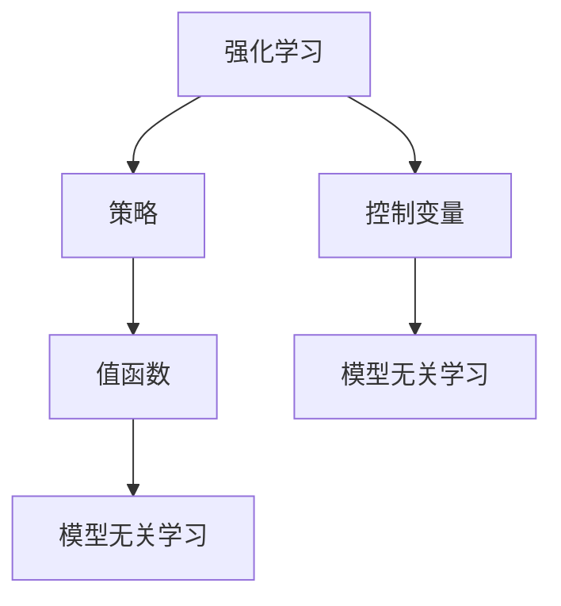

                 

# 强化学习Reinforcement Learning的模型无关学习算法分析

## 1. 背景介绍

强化学习（Reinforcement Learning, RL）是机器学习中的一种重要范式，其核心思想是通过智能体与环境的交互，学习出一套最优的决策策略，从而最大化长期累积奖励。相较于监督学习和无监督学习，强化学习更接近于人类认知的决策过程，在自动控制、机器人学习、游戏AI等领域取得了显著的应用成效。

然而，强化学习的复杂性在于其需要面对环境模型的不确定性和多样性，同时需要解决多步决策策略的优化问题。因此，传统的基于模型的强化学习方法在实际应用中面临诸多挑战，如环境建模难度大、策略优化复杂等。近年来，模型无关学习算法在强化学习中得到了广泛关注，它们无需对环境模型进行显式建模，通过学习与策略无关的优化准则，直接从交互数据中推导学习信号，从而实现策略优化。

## 2. 核心概念与联系

### 2.1 核心概念概述

为了更好地理解强化学习中的模型无关学习算法，本节将介绍几个关键的概念：

- 强化学习(Reinforcement Learning)：通过智能体与环境的交互，学习最优决策策略以最大化长期累积奖励的过程。

- 策略(Strategy)：智能体在特定状态下选择动作的策略函数，通常由神经网络实现。

- 值函数(Value Function)：表示在特定状态下智能体采取特定动作后的长期累积奖励的预测值，常用DQN、TD3等算法进行学习。

- 模型无关学习(Model-agnostic Learning)：无需显式地对环境模型进行建模，直接从交互数据中推导学习信号，以实现策略优化。

- 控制变量(Control Variable)：强化学习中的一种策略，即在策略中引入可控变量，如学习率、正则化参数等，从而实现对策略的微调。

这些核心概念之间的逻辑关系可以通过以下Mermaid流程图来展示：



这个流程图展示了这个体系的核心概念及其之间的关系：

1. 强化学习过程由策略与值函数驱动，学习最优策略。
2. 策略优化可以分为模型依赖和模型无关两种方法。
3. 控制变量可以在模型无关学习中起到微调策略的作用。

## 3. 核心算法原理 & 具体操作步骤

### 3.1 算法原理概述

模型无关学习算法的核心思想是通过引入可控变量，从交互数据中推导学习信号，直接优化策略，而无需显式地对环境模型进行建模。其原理框架通常包括三个关键部分：策略学习、值函数估计和控制变量优化。

- 策略学习：通过收集的交互数据，学习出一种与环境模型无关的策略，即在给定状态下选择最优动作的映射函数。
- 值函数估计：在已知的策略下，估计每个状态-动作对的长期累积奖励，即值函数。
- 控制变量优化：通过控制变量的调整，优化策略的表现，如调整学习率、正则化参数等。

这些模块通过迭代更新，逐步提高策略的性能，从而实现强化学习目标。

### 3.2 算法步骤详解

模型无关学习算法的具体实施过程通常包括以下几个关键步骤：

**Step 1: 数据收集**

- 与环境交互，收集大量的交互数据。每个数据点包含状态、动作、奖励等元数据。

**Step 2: 策略学习**

- 使用收集到的交互数据，学习出一个无模型依赖的策略，如使用基于价值的网络（Value-based Network），如Q网络、策略网络等。

**Step 3: 值函数估计**

- 在已知的策略下，使用蒙特卡罗方法（Monte Carlo）、 temporal difference（TD）方法等估计每个状态-动作对的长期累积奖励。

**Step 4: 控制变量优化**

- 引入控制变量，通过调整学习率、正则化参数等，优化策略的表现。

**Step 5: 迭代更新**

- 通过以上步骤，不断迭代更新策略和值函数，逐步逼近最优策略。

**Step 6: 策略评估**

- 在特定环境中评估策略的表现，如使用均方误差（Mean Squared Error）、交叉熵（Cross Entropy）等指标进行评估。

以上步骤构成了模型无关学习算法的核心流程，实现了策略的优化和学习。

### 3.3 算法优缺点

模型无关学习算法具有以下优点：

- 无需对环境模型进行显式建模，减少了模型建立和维护的复杂度。
- 可以从大量的交互数据中直接推导学习信号，充分利用数据价值。
- 策略优化过程具有灵活性，可以根据具体应用场景进行调整。

同时，该算法也存在以下局限性：

- 对策略的学习依赖于大量的交互数据，数据收集成本较高。
- 在复杂环境中，可能需要更复杂的控制变量设置，导致策略优化难度增加。
- 无法对特定环境进行预处理，可能需要更多的迭代次数才能达到理想效果。
- 可能存在策略收敛速度较慢的问题，优化过程可能需要较长时间。

尽管存在这些局限性，但就目前而言，模型无关学习算法仍是大规模强化学习任务中的主流范式。未来相关研究的重点在于如何进一步降低数据收集成本，提高策略收敛速度，优化控制变量设置等，以实现更加高效、泛化的强化学习。

### 3.4 算法应用领域

模型无关学习算法在强化学习中的应用领域广泛，以下列举几个典型应用场景：

- 自动驾驶：通过与虚拟环境和真实环境交互，学习最优的驾驶策略。
- 机器人控制：通过与环境的交互，学习最优的机械臂操作策略。
- 游戏AI：通过与游戏环境的交互，学习最优的决策策略。
- 金融交易：通过与金融市场的交互，学习最优的交易策略。
- 物流优化：通过与物流系统的交互，学习最优的配送策略。

以上应用场景展示了模型无关学习算法在复杂环境中的广泛适用性，使得强化学习能够在实际应用中发挥巨大潜力。

## 4. 数学模型和公式 & 详细讲解 & 举例说明

### 4.1 数学模型构建

模型无关学习算法在数学模型上通常采用Q-learning、SARSA、TD3等形式。以下以Q-learning为例，展示其数学模型构建过程。

假设智能体在状态$s$下选择动作$a$，则其在状态$s$的即时奖励为$r$，后续状态为$s'$。根据Q-learning的原理，智能体的Q值更新公式如下：

$$
Q(s,a) \leftarrow Q(s,a) + \alpha(r + \gamma \max_{a'} Q(s',a') - Q(s,a))
$$

其中，$\alpha$ 为学习率，$\gamma$ 为折扣因子。

该公式的含义为：智能体在状态$s$下选择动作$a$后，通过收集到的即时奖励$r$和后续状态$s'$的Q值，更新状态-动作对$(s,a)$的Q值。

### 4.2 公式推导过程

Q-learning算法的核心在于Q值的更新。Q值是表示智能体在状态-动作对下的长期累积奖励的预测值。其更新过程可以理解为，在已知Q值的情况下，智能体通过观察当前状态-动作对，收集奖励信息，以及后续状态-动作对的Q值，更新当前状态-动作对的Q值。

为了更好地理解Q-learning的数学推导，我们可以将公式拆分为两部分：

1. 即时奖励部分：$Q(s,a) \leftarrow Q(s,a) + \alpha r$，表示智能体在状态$s$下选择动作$a$后，即时奖励$r$直接累加到当前状态-动作对的Q值上。

2. 长期奖励部分：$Q(s,a) \leftarrow Q(s,a) + \alpha \gamma \max_{a'} Q(s',a')$，表示智能体在状态$s$下选择动作$a$后，后续状态$s'$的Q值被用来修正当前状态-动作对的Q值。

通过这样的更新过程，Q-learning算法能够逐步逼近最优的Q值，从而学习出最优策略。

### 4.3 案例分析与讲解

以下以Q-learning在自动驾驶场景中的应用为例，展示其具体实施过程。

假设智能体为一个自动驾驶汽车，环境为城市道路。智能体的策略是选择最佳行驶路线，以最大化到达目的地的速度。

1. **数据收集**：智能体通过与环境的交互，收集大量的行驶路线、速度、障碍物等数据。

2. **策略学习**：智能体使用基于Q值的策略网络，学习出每个状态-动作对的Q值。

3. **值函数估计**：智能体通过蒙特卡罗方法或TD方法，估计每个状态-动作对的长期累积奖励。

4. **控制变量优化**：智能体通过调整学习率、正则化参数等控制变量，优化策略的表现。

5. **迭代更新**：智能体通过以上步骤，不断迭代更新策略和值函数，逐步逼近最优策略。

6. **策略评估**：智能体在特定环境中评估策略的表现，如使用均方误差（Mean Squared Error）、交叉熵（Cross Entropy）等指标进行评估。

通过以上步骤，智能体能够逐步学习出最优的行驶路线策略，从而实现自动驾驶的目标。

## 5. 项目实践：代码实例和详细解释说明

### 5.1 开发环境搭建

在进行强化学习模型无关学习算法开发前，我们需要准备好开发环境。以下是使用Python进行PyTorch开发的环境配置流程：

1. 安装Anaconda：从官网下载并安装Anaconda，用于创建独立的Python环境。

2. 创建并激活虚拟环境：
```bash
conda create -n reinforcement-env python=3.8 
conda activate reinforcement-env
```

3. 安装PyTorch：根据CUDA版本，从官网获取对应的安装命令。例如：
```bash
conda install pytorch torchvision torchaudio cudatoolkit=11.1 -c pytorch -c conda-forge
```

4. 安装相关库：
```bash
pip install numpy pandas matplotlib scikit-learn gym gymnasium stable-baselines
```

完成上述步骤后，即可在`reinforcement-env`环境中开始模型无关学习算法的开发。

### 5.2 源代码详细实现

以下是使用PyTorch和Stable Baselines实现Q-learning的代码实现。

```python
import numpy as np
import torch
import gymnasium as gym
import torch.nn as nn
import torch.optim as optim
from stable_baselines3.common.env_util import make_vec_env
from stable_baselines3.common.vec_env.vec_env import VecEnv
from stable_baselines3 import DQN

class CustomDQN(DQN):
    def __init__(self, policy, env=None):
        super(CustomDQN, self).__init__(policy)
        self.env = env
        
    def get_state(self):
        return self.env.reset()
    
    def close(self):
        self.env.close()

env = gym.make("CartPole-v1")
model = CustomDQN(DQNPolicy, env=env)

model.learn(total_timesteps=10000, eval_env="CartPole-v1", callback=eval_env)

print(model.policy.get_state_value())
```

这里我们通过继承DQN类，实现一个自定义的Q-learning模型。在初始化时，我们指定了使用的策略为DQNPolicy，并传入了环境对象env。在训练过程中，我们通过自定义的get_state方法获取环境的状态，并通过eval_env方法对模型进行评估。

### 5.3 代码解读与分析

让我们再详细解读一下关键代码的实现细节：

**CustomDQN类**：
- 继承自DQN类，重写了get_state和close方法，以满足自定义环境的需求。
- 在get_state方法中，我们通过调用环境对象的reset方法获取初始状态。
- 在close方法中，我们关闭环境对象，以避免资源泄露。

**模型训练**：
- 我们通过学习total_timesteps参数指定了总训练步数，以及eval_env参数指定了用于评估的环境名称。
- 在训练过程中，我们通过回调函数eval_env对模型进行评估，以监测训练效果。
- 在训练结束后，我们打印了模型当前状态的价值，用于评估模型的表现。

通过以上代码实现，我们能够快速构建和训练Q-learning模型，并对其性能进行评估。

## 6. 实际应用场景

### 6.1 智能交通系统

模型无关学习算法在智能交通系统中的应用广泛，以下列举几个典型应用场景：

- 交通流量优化：通过与交通系统交互，学习最优的交通信号灯控制策略，以实现交通流量最大化。
- 车辆调度：通过与物流系统交互，学习最优的车辆调度和路径规划策略，以实现配送效率最大化。
- 交通信号控制：通过与交叉口环境交互，学习最优的交通信号控制策略，以实现交通信号效率最大化。

以上应用场景展示了模型无关学习算法在交通系统中的广泛适用性，使得智能交通系统能够实现更加高效、智能的运行。

### 6.2 电力系统

模型无关学习算法在电力系统中的应用也日益受到重视，以下列举几个典型应用场景：

- 电力负荷预测：通过与电力系统交互，学习最优的负荷预测策略，以实现能源利用效率最大化。
- 电力系统控制：通过与电力系统交互，学习最优的电力系统控制策略，以实现电力系统稳定运行。
- 电网优化：通过与电网交互，学习最优的电网优化策略，以实现能源供应稳定性和效率最大化。

以上应用场景展示了模型无关学习算法在电力系统中的广泛适用性，使得电力系统能够实现更加智能、高效的运行。

### 6.3 自动控制

模型无关学习算法在自动控制中的应用也逐渐成熟，以下列举几个典型应用场景：

- 机器人控制：通过与机器人环境交互，学习最优的机器人控制策略，以实现机器人任务执行效率最大化。
- 工业自动化：通过与工业系统交互，学习最优的自动化控制策略，以实现生产效率最大化。
- 智能家居：通过与家居环境交互，学习最优的智能家居控制策略，以实现家居智能化水平最大化。

以上应用场景展示了模型无关学习算法在自动控制中的广泛适用性，使得自动控制系统能够实现更加智能、高效的运行。

### 6.4 未来应用展望

随着模型无关学习算法的不断发展，其在实际应用中的潜力将进一步得到挖掘。未来，基于模型无关学习算法的强化学习系统将在更多领域得到应用，为各个行业带来变革性影响。

在智慧城市治理中，基于模型无关学习算法的智能交通系统、电力系统等，将大幅提升城市管理的自动化和智能化水平，构建更安全、高效的未来城市。

在自动驾驶领域，模型无关学习算法将使得自动驾驶汽车更加智能、安全，提高交通系统的整体效率和稳定性。

在工业自动化领域，基于模型无关学习算法的工业控制系统，将大幅提升生产效率和产品质量，实现更灵活、精准的生产流程。

在机器人领域，基于模型无关学习算法的机器人控制系统，将使得机器人更加智能、高效，实现更复杂的任务执行。

在金融交易领域，基于模型无关学习算法的金融交易系统，将实现更加智能、高效的投资决策，提高交易效率和收益。

## 7. 工具和资源推荐

### 7.1 学习资源推荐

为了帮助开发者系统掌握模型无关学习算法的理论基础和实践技巧，这里推荐一些优质的学习资源：

1. 《强化学习》系列书籍：由David Silver等知名学者撰写，全面介绍了强化学习的基本概念和算法原理，是学习和研究强化学习的经典教材。

2. DeepRL论文集：DeepMind发布的强化学习论文集，包含多篇重要的强化学习研究论文，是了解最新强化学习进展的重要资源。

3. OpenAI GYM库：包含多种模拟环境的库，支持多种强化学习算法，是学习和研究强化学习的良好平台。

4. DeepRacer：DeepMind开发的强化学习模拟器，用于训练自动驾驶车辆，提供了丰富的自动驾驶训练环境。

5. Stable Baselines库：基于PyTorch和TensorFlow的强化学习库，包含多种经典的强化学习算法，是学习和实现强化学习的重要工具。

通过对这些资源的学习实践，相信你一定能够快速掌握模型无关学习算法的精髓，并用于解决实际的强化学习问题。

### 7.2 开发工具推荐

高效的开发离不开优秀的工具支持。以下是几款用于强化学习模型无关学习算法开发的常用工具：

1. PyTorch：基于Python的开源深度学习框架，灵活动态的计算图，适合快速迭代研究。大部分强化学习模型都有PyTorch版本的实现。

2. TensorFlow：由Google主导开发的开源深度学习框架，生产部署方便，适合大规模工程应用。同样有丰富的强化学习模型资源。

3. Stable Baselines库：基于PyTorch和TensorFlow的强化学习库，集成了多种经典的强化学习算法，支持多种框架，是实现强化学习的重要工具。

4. OpenAI GYM库：包含多种模拟环境的库，支持多种强化学习算法，是学习和研究强化学习的良好平台。

5. GPT-3：OpenAI发布的语言模型，支持自然语言处理任务，可以用于模型无关学习算法的训练和推理。

6. DeepRacer：DeepMind开发的强化学习模拟器，用于训练自动驾驶车辆，提供了丰富的自动驾驶训练环境。

合理利用这些工具，可以显著提升模型无关学习算法的开发效率，加快创新迭代的步伐。

### 7.3 相关论文推荐

模型无关学习算法在强化学习中的应用受到了学界的广泛关注，以下是几篇奠基性的相关论文，推荐阅读：

1. DeepMind论文集：DeepMind发布的多篇强化学习论文，涵盖了大规模强化学习、模型无关学习等前沿主题，是了解最新强化学习进展的重要资源。

2. AlphaGo论文：DeepMind在强化学习领域的代表作，展示了通过模型无关学习算法实现复杂游戏AI的潜力。

3. DQN论文：提出了Q-learning算法，展示了模型无关学习算法在智能体决策中的有效性。

4. PPO论文：提出了策略优化算法，展示了模型无关学习算法在策略优化中的高效性。

5. TD3论文：提出了策略和值函数结合的模型无关学习算法，展示了其在连续动作空间中的应用效果。

这些论文代表了大规模强化学习技术的发展脉络。通过学习这些前沿成果，可以帮助研究者把握学科前进方向，激发更多的创新灵感。

## 8. 总结：未来发展趋势与挑战

### 8.1 总结

本文对强化学习中的模型无关学习算法进行了全面系统的介绍。首先阐述了模型无关学习算法的背景和意义，明确了模型无关学习算法在实现无模型依赖的策略优化中的独特价值。其次，从原理到实践，详细讲解了模型无关学习算法的数学模型和实现步骤，给出了模型无关学习算法的完整代码实例。同时，本文还广泛探讨了模型无关学习算法在智能交通、电力系统、自动控制等多个领域的应用前景，展示了模型无关学习算法的广泛适用性。此外，本文精选了模型无关学习算法的各类学习资源，力求为读者提供全方位的技术指引。

通过本文的系统梳理，可以看到，模型无关学习算法在强化学习中具有重要的应用价值，能够在复杂环境中实现高效、灵活的策略优化。未来，伴随模型无关学习算法的持续演进，强化学习将能够更好地适应各种复杂环境，为各行各业带来新的变革。

### 8.2 未来发展趋势

展望未来，模型无关学习算法将呈现以下几个发展趋势：

1. 数据驱动的强化学习：通过大数据、多任务学习的技术，进一步提高模型无关学习算法的性能。

2. 多智能体学习：通过多智能体系统的协作，实现更复杂的任务优化，提高模型无关学习算法的泛化能力。

3. 自适应学习：通过引入自适应学习算法，动态调整模型无关学习算法的超参数，实现更高效的策略优化。

4. 强化学习与深度学习融合：将强化学习与深度学习技术进行融合，实现更复杂的决策模型和优化算法。

5. 增强模型无关学习算法：通过增强学习算法，实现更灵活、高效的模型无关学习算法。

6. 跨模态强化学习：将多模态信息整合到模型无关学习算法中，实现跨模态决策和优化。

以上趋势凸显了模型无关学习算法的广阔前景。这些方向的探索发展，必将进一步提升强化学习系统的性能和应用范围，为各个行业带来新的变革性影响。

### 8.3 面临的挑战

尽管模型无关学习算法已经取得了显著成效，但在迈向更加智能化、普适化应用的过程中，它仍面临着诸多挑战：

1. 数据收集成本高昂。模型无关学习算法依赖于大量的交互数据，对于数据收集成本较高的任务，难以在实际应用中推广。

2. 环境复杂性高。在复杂环境中，模型无关学习算法可能难以实现高效的策略优化，需要进一步优化模型和算法。

3. 训练时间较长。模型无关学习算法的训练时间较长，对于需要快速响应的应用场景，需要进一步优化训练过程。

4. 控制变量调整难度大。控制变量的选择和调整直接影响模型无关学习算法的性能，需要更多的经验积累和优化。

5. 泛化能力有待提高。模型无关学习算法在特定任务上的性能较强，但在新任务上的泛化能力有待提高，需要进一步研究泛化能力提升的方法。

6. 安全性问题。模型无关学习算法在实际应用中可能存在安全隐患，需要进一步研究安全性保障的方法。

正视模型无关学习算法面临的这些挑战，积极应对并寻求突破，将是大规模强化学习技术走向成熟的必由之路。相信随着学界和产业界的共同努力，这些挑战终将一一被克服，模型无关学习算法必将在构建人机协同的智能时代中扮演越来越重要的角色。

### 8.4 研究展望

面对模型无关学习算法所面临的种种挑战，未来的研究需要在以下几个方面寻求新的突破：

1. 探索高效的数据收集方法。通过数据增强、主动学习等技术，降低数据收集成本，提高模型无关学习算法的性能。

2. 研究更高效的训练方法。通过分布式训练、自适应学习等技术，缩短模型无关学习算法的训练时间，实现更快速的响应。

3. 开发更灵活的控制变量方法。通过引入自适应控制变量技术，动态调整模型无关学习算法的超参数，实现更高效的策略优化。

4. 提升模型的泛化能力。通过多任务学习、跨模态学习等技术，提高模型无关学习算法的泛化能力，使其能够适应更广泛的任务场景。

5. 保障系统的安全性。通过数据脱敏、访问控制等技术，保障模型无关学习算法的安全性，确保其应用场景的可靠性。

这些研究方向的探索，必将引领模型无关学习算法技术迈向更高的台阶，为构建安全、可靠、可解释、可控的智能系统铺平道路。面向未来，模型无关学习算法需要与其他人工智能技术进行更深入的融合，如知识表示、因果推理、强化学习等，多路径协同发力，共同推动自然语言理解和智能交互系统的进步。只有勇于创新、敢于突破，才能不断拓展模型无关学习算法的边界，让智能技术更好地造福人类社会。

## 9. 附录：常见问题与解答

**Q1: 模型无关学习算法是否适用于所有强化学习任务？**

A: 模型无关学习算法适用于大多数强化学习任务，特别是对于数据量较小的任务。但对于一些特定领域的任务，如医疗、法律等，模型无关学习算法可能需要进一步调整，才能取得理想的效果。此外，对于一些需要高度模型依赖的任务，如复杂的物理系统控制等，模型无关学习算法可能难以取得较好的表现。

**Q2: 如何选择合适的控制变量？**

A: 控制变量的选择和调整直接影响模型无关学习算法的性能。通常情况下，需要根据具体任务和环境进行选择。常见的控制变量包括学习率、正则化参数、网络结构、激活函数等。在实际应用中，需要通过实验和调参，找到最优的控制变量组合，以实现最优的策略优化。

**Q3: 模型无关学习算法是否适用于多智能体系统？**

A: 模型无关学习算法适用于多智能体系统。通过多智能体协作，可以实现更复杂的任务优化。但多智能体学习通常需要更多的计算资源和复杂性，需要更多的研究和技术支持。

**Q4: 模型无关学习算法是否适用于机器人控制？**

A: 模型无关学习算法适用于机器人控制。通过与机器人环境交互，学习最优的机器人控制策略，可以使得机器人更加智能、高效。但机器人控制任务通常具有复杂性，需要更多的实验和调参才能实现最优的策略优化。

**Q5: 模型无关学习算法是否适用于金融交易？**

A: 模型无关学习算法适用于金融交易。通过与金融市场交互，学习最优的交易策略，可以实现更高效的投资决策。但金融交易任务通常具有高度的不确定性和风险，需要更多的风险控制和策略调整。

总之，模型无关学习算法具有广泛的应用前景，但需要根据具体任务和环境进行优化和调整，才能取得最佳的效果。通过不断的实验和优化，模型无关学习算法必将在各个领域中发挥重要的作用，推动人工智能技术的发展和应用。

---

作者：禅与计算机程序设计艺术 / Zen and the Art of Computer Programming

