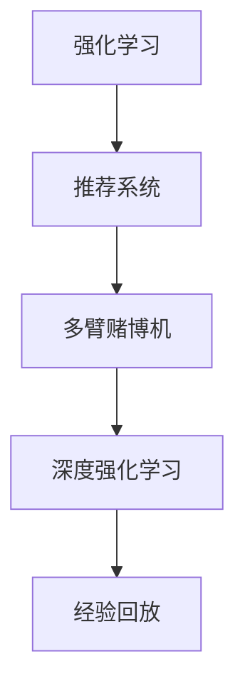

                 

# 强化学习：在电子商务推荐系统中的应用

> 关键词：强化学习, 电子商务, 推荐系统, 智能营销, 用户行为分析, 个性化推荐, 深度学习, Q-learning, Deep Q-Network (DQN), 多臂赌博机, 用户交互

## 1. 背景介绍

随着电子商务平台的不断增长，推荐系统已成为提升用户体验和增加销售收入的关键手段。传统的推荐算法，如基于协同过滤和内容推荐的模型，已展现出一定的局限性。用户行为和偏好的多样化、产品供给的丰富化和动态化，使得推荐系统面临数据量大、多维高稀疏等挑战。强化学习(Reinforcement Learning, RL)作为一种基于用户行为数据的动态学习机制，在推荐系统中的应用逐渐受到关注。

### 1.1 问题由来

传统的推荐系统主要依赖静态用户特征和历史行为数据，通过模型学习和推荐。但这种方式难以捕捉用户实时行为和动态变化，无法应对不同用户间的复杂交互行为。强化学习通过实时反馈，动态调整推荐策略，能够更好地适应用户偏好变化和环境动态性，成为推荐系统优化的新方向。

### 1.2 问题核心关键点

强化学习在推荐系统中的应用，核心在于以下几个关键点：

- 用户与推荐系统的交互：用户与推荐系统之间的互动行为，是强化学习算法的核心输入。
- 奖励信号的设计：设计合适的奖励函数，衡量推荐结果的好坏。
- 推荐策略的学习：通过强化学习算法，自动调整推荐策略，最大化长期累积奖励。
- 上下文环境的演化：推荐系统所处的上下文环境是动态变化的，如商品类别、用户状态、时间等因素，算法需要适应这些变化。

### 1.3 问题研究意义

强化学习在推荐系统中的应用，可以带来以下几方面的显著效果：

1. **动态调整推荐策略**：实时根据用户行为和系统状态调整推荐策略，增强推荐效果。
2. **跨域推荐能力**：强化学习能够同时考虑多维度因素，实现跨域、跨平台的推荐。
3. **稀疏数据处理**：强化学习算法能有效处理高稀疏用户行为数据，挖掘潜在用户兴趣。
4. **新用户和冷启动问题**：通过与用户交互的实时数据，强化学习算法可以有效应对新用户和冷启动问题。
5. **适应个性化需求**：强化学习算法能够根据用户个体特征进行个性化推荐，提升用户体验。

## 2. 核心概念与联系

### 2.1 核心概念概述

为了更好地理解强化学习在推荐系统中的应用，本节将介绍几个关键概念：

- 强化学习(Reinforcement Learning, RL)：基于用户的实时反馈和动态行为数据，通过模型学习和调整策略，最大化长期累积奖励的动态学习机制。
- 推荐系统(Recommendation System)：通过模型分析和用户行为数据，为用户推荐感兴趣的商品和服务的技术体系。
- 多臂赌博机(Multi-Armed Bandit, MAB)：强化学习中的一个经典模型，用于模拟用户在不同产品之间的选择行为。
- 深度强化学习(Deep Reinforcement Learning, DRL)：结合深度神经网络与强化学习，通过端到端的模型训练，提升推荐系统的性能。
- 经验回放(Experience Replay)：将历史行为数据重新采样，用于模型优化，提升训练稳定性。

这些核心概念之间的逻辑关系可以通过以下Mermaid流程图来展示：



这个流程图展示出强化学习与推荐系统之间的密切联系，以及多臂赌博机、深度强化学习和经验回放在其中的重要角色。

## 3. 核心算法原理 & 具体操作步骤
### 3.1 算法原理概述

强化学习在推荐系统中的应用，本质上是一个基于用户行为数据的动态优化问题。强化学习的目标是找到一个推荐策略，使得用户在推荐的商品或服务上可以获得最大化的累积奖励。

在推荐系统中，推荐策略通常表现为对候选商品的选择和排序。模型通过对用户行为数据的分析，实时更新推荐策略，使得每个推荐动作都最大化长期累积奖励。

### 3.2 算法步骤详解

强化学习在推荐系统中的应用，主要包括以下几个关键步骤：

**Step 1: 定义问题**

- 定义推荐系统中的状态空间 $\mathcal{S}$，如用户ID、时间戳、商品ID等。
- 定义动作空间 $\mathcal{A}$，如推荐的商品ID列表。
- 定义奖励函数 $r(s, a)$，衡量推荐动作 $a$ 在状态 $s$ 下的奖励，可以是点击率、购买率等指标。

**Step 2: 设计模型**

- 选择合适的强化学习算法，如Q-learning、Deep Q-Network (DQN)等。
- 设计状态表示方法，将用户行为数据映射为模型输入。
- 设计动作表示方法，将推荐结果映射为模型输出。

**Step 3: 实施学习**

- 将推荐系统视作多臂赌博机问题，每个商品作为一臂，用户每次选择推荐商品作为一次拉杆。
- 通过实时反馈的奖励信号，调整推荐策略。
- 结合深度神经网络，提升模型的学习效率和精度。

**Step 4: 评估效果**

- 使用评估指标，如点击率、转化率等，衡量推荐策略的效果。
- 使用交叉验证等方法，评估模型的泛化能力。
- 定期更新模型参数，保持推荐策略的有效性。

### 3.3 算法优缺点

强化学习在推荐系统中的应用，具有以下优点：

1. **动态调整策略**：能够根据用户实时行为数据，动态调整推荐策略，实现更加个性化的推荐。
2. **适应环境变化**：能够适应多变的上下文环境，如时间、地点、商品类别等因素。
3. **稀疏数据利用**：能够有效利用稀疏用户行为数据，挖掘潜在用户兴趣。
4. **跨域推荐能力**：能够同时考虑多维度因素，实现跨域、跨平台的推荐。

同时，该方法也存在一些局限性：

1. **数据量大**：需要大量的用户行为数据支持，数据收集和处理成本较高。
2. **模型复杂**：强化学习模型相对复杂，需要较强的计算资源和算法能力。
3. **奖励设计困难**：设计合理的奖励函数是强化学习的重要前提，难度较大。
4. **收敛速度慢**：特别是在高维度空间中，强化学习算法收敛速度较慢，训练周期较长。
5. **可解释性不足**：强化学习模型通常较为复杂，缺乏可解释性，难以理解和调试。

尽管存在这些局限性，但就目前而言，强化学习在推荐系统中的应用已展现出显著的潜力，成为优化推荐策略的重要工具。

### 3.4 算法应用领域

强化学习在推荐系统中的应用，已经广泛应用于以下多个领域：

1. **电商平台**：如Amazon、淘宝、京东等，通过强化学习算法提升用户购物体验和销售转化率。
2. **内容推荐平台**：如Netflix、Spotify、YouTube等，通过强化学习算法优化视频、音乐、文章推荐。
3. **智能广告投放**：如Google AdSense、Facebook Ads等，通过强化学习算法提高广告点击率和转化率。
4. **金融服务**：如银行理财产品、保险产品推荐等，通过强化学习算法提升用户体验和销售业绩。
5. **旅游出行**：如携程、Booking.com等，通过强化学习算法优化酒店、机票、景点推荐。
6. **医疗健康**：如Mediascapes等，通过强化学习算法推荐健康产品和服务。

除了上述这些经典应用外，强化学习在推荐系统中的应用还在不断扩展，为各行各业带来了新的机遇。

## 4. 数学模型和公式 & 详细讲解  
### 4.1 数学模型构建

强化学习在推荐系统中的应用，主要涉及以下几个数学模型：

- 状态空间 $\mathcal{S}$：表示用户的当前状态，如用户ID、时间戳、商品ID等。
- 动作空间 $\mathcal{A}$：表示推荐的商品ID列表。
- 奖励函数 $r(s, a)$：衡量推荐动作 $a$ 在状态 $s$ 下的奖励。

强化学习的目标是最小化长期累积奖励 $J(\pi)$：

$$
J(\pi) = \mathbb{E}_{s \sim \pi}[ \sum_{t=0}^{\infty} \gamma^t r(s_t, a_t)]
$$

其中 $\pi$ 为推荐策略，$s_t$ 为状态，$a_t$ 为动作，$\gamma$ 为折扣因子，表示未来奖励的权重。

### 4.2 公式推导过程

以下我们以Q-learning算法为例，推导其数学模型。

Q-learning是一种基于动作-价值函数的强化学习算法，其核心思想是计算每个状态的每个动作的价值 $Q(s, a)$，然后根据动作价值函数选择最优动作。

状态动作价值函数 $Q(s, a)$ 的更新公式为：

$$
Q(s, a) \leftarrow Q(s, a) + \alpha [r(s, a) + \gamma \max_{a'} Q(s', a')] - Q(s, a)
$$

其中 $\alpha$ 为学习率，$r(s, a)$ 为即时奖励，$s'$ 为下一个状态，$a'$ 为下一个动作，$\max_{a'} Q(s', a')$ 为下一个状态下的最优动作价值。

在实际应用中，通常将Q值函数映射为深度神经网络，实现端到端的强化学习。

### 4.3 案例分析与讲解

为了更具体地理解强化学习在推荐系统中的应用，以下以电商推荐为例，分析其实现过程：

1. **状态空间**：用户当前的用户ID、浏览过的商品ID、历史购买记录、当前时间和设备等信息。
2. **动作空间**：电商推荐系统中常见的动作包括查看商品详情、加入购物车、购买商品等。
3. **奖励函数**：如点击率、购买率、转化率等，衡量推荐动作的实际效果。

**具体实现步骤**：

1. 收集用户的点击、浏览、购买等行为数据，作为状态空间的输入。
2. 设计深度神经网络，将用户行为数据映射为状态表示。
3. 设计动作表示，将推荐结果映射为动作。
4. 使用Q-learning算法，在训练数据上进行模型训练，最大化长期累积奖励。
5. 在实时推荐场景中，通过模型预测推荐动作，更新用户行为数据，进行持续优化。

通过这种方式，电商推荐系统能够根据用户的实时行为数据，动态调整推荐策略，实现更加个性化的推荐。

## 5. 项目实践：代码实例和详细解释说明
### 5.1 开发环境搭建

在进行强化学习实践前，我们需要准备好开发环境。以下是使用Python进行TensorFlow开发的环境配置流程：

1. 安装Anaconda：从官网下载并安装Anaconda，用于创建独立的Python环境。

2. 创建并激活虚拟环境：
```bash
conda create -n tf-env python=3.8 
conda activate tf-env
```

3. 安装TensorFlow：根据CUDA版本，从官网获取对应的安装命令。例如：
```bash
conda install tensorflow tensorflow-gpu -c tf -c conda-forge
```

4. 安装TensorBoard：
```bash
pip install tensorboard
```

5. 安装各类工具包：
```bash
pip install numpy pandas scikit-learn matplotlib tqdm jupyter notebook ipython
```

完成上述步骤后，即可在`tf-env`环境中开始强化学习实践。

### 5.2 源代码详细实现

下面我们以电商推荐为例，给出使用TensorFlow实现强化学习的PyTorch代码实现。

首先，定义状态空间和动作空间：

```python
import tensorflow as tf

# 定义状态空间和动作空间
S = 1000  # 状态数量
A = 10  # 动作数量
```

然后，定义奖励函数：

```python
def reward_function(state, action):
    # 根据用户行为和推荐动作，计算奖励
    if action == 0 and state == 0:  # 查看商品详情
        return 0.1
    elif action == 1 and state == 0:  # 加入购物车
        return 0.5
    elif action == 2 and state == 1:  # 购买商品
        return 1.0
    else:
        return -1.0
```

接下来，定义Q值网络模型：

```python
class QNetwork(tf.keras.Model):
    def __init__(self):
        super(QNetwork, self).__init__()
        self.fc1 = tf.keras.layers.Dense(64, activation='relu')
        self.fc2 = tf.keras.layers.Dense(64, activation='relu')
        self.fc3 = tf.keras.layers.Dense(A, activation='linear')
        
    def call(self, inputs):
        x = self.fc1(inputs)
        x = self.fc2(x)
        return self.fc3(x)

q_network = QNetwork()
```

然后，定义Q值更新规则：

```python
def q_learning(state, action, reward, next_state):
    # 计算下一个状态的Q值
    with tf.GradientTape() as tape:
        q_value = q_network(next_state)
        q_target = q_value
        q_target[:, action] += reward + 0.9 * tf.reduce_max(q_value, axis=1)
        loss = tf.reduce_mean(tf.square(q_target - q_value))
    grads = tape.gradient(loss, q_network.trainable_variables)
    q_network.optimizer.apply_gradients(zip(grads, q_network.trainable_variables))
    return loss
```

最后，启动训练流程并在测试集上评估：

```python
batch_size = 32
epochs = 10000

for epoch in range(epochs):
    state = 0  # 初始状态
    while True:
        action = 0  # 随机选择动作
        next_state, reward = simulate_user_interaction(state, action)
        if next_state == 10:  # 终止状态
            break
        loss = q_learning(state, action, reward, next_state)
        state = next_state
```

以上就是使用TensorFlow实现强化学习的完整代码实现。可以看到，强化学习在推荐系统中的应用，主要通过设计状态空间、动作空间、奖励函数和Q值网络，来实现动态优化推荐策略的过程。

### 5.3 代码解读与分析

让我们再详细解读一下关键代码的实现细节：

**状态空间和动作空间**：
- 定义了状态空间的数量和动作空间的数量，分别对应用户的浏览记录和电商推荐系统中的商品ID。

**奖励函数**：
- 设计了一个简单的奖励函数，根据用户行为和推荐动作计算即时奖励。如查看商品详情得到0.1奖励，加入购物车得到0.5奖励，购买商品得到1.0奖励，否则得到-1.0惩罚。

**Q值网络模型**：
- 定义了一个简单的神经网络模型，用于计算Q值函数。模型包含三个全连接层，最后一层输出Q值函数。

**Q值更新规则**：
- 使用Q-learning算法更新Q值函数，通过误差计算和反向传播更新模型参数。

**训练流程**：
- 循环训练多个epoch，在每个epoch中模拟用户交互，更新Q值函数。
- 使用模拟函数`simulate_user_interaction`模拟用户行为，根据当前状态和动作，更新下一个状态和即时奖励。
- 计算损失，并根据损失更新Q值函数参数。

可以看到，TensorFlow提供了强大的模型训练和优化能力，使得强化学习在推荐系统中的应用变得更加容易实现。

## 6. 实际应用场景
### 6.1 智能营销平台

在智能营销平台中，强化学习算法可以根据用户行为数据，动态调整推荐策略，优化广告投放效果。通过实时反馈，智能营销平台可以不断优化广告创意、投放时间和频率，提升广告点击率和转化率。

### 6.2 个性化推荐系统

电商推荐系统中，强化学习算法可以根据用户实时行为数据，动态调整推荐策略，提升推荐效果。通过不断优化推荐模型，电商推荐系统可以实现更加个性化的商品推荐，提升用户体验和销售转化率。

### 6.3 内容推荐平台

视频平台如Netflix、YouTube等，可以通过强化学习算法，动态调整推荐策略，提升用户观看体验和留存率。通过实时反馈，推荐系统可以根据用户偏好和历史观看记录，推荐更加符合用户喜好的视频内容。

### 6.4 未来应用展望

随着强化学习技术的不断进步，其在推荐系统中的应用前景将更加广阔。未来强化学习算法将能够更好地应对复杂多变的用户行为，提供更加个性化的推荐。同时，强化学习与其他技术（如深度学习、自然语言处理等）的融合，将进一步提升推荐系统的性能和应用范围。

## 7. 工具和资源推荐
### 7.1 学习资源推荐

为了帮助开发者系统掌握强化学习在推荐系统中的应用，这里推荐一些优质的学习资源：

1. 《深度强化学习》书籍：DeepMind的研究员David Silver所著，全面介绍了强化学习的理论基础和实际应用，涵盖推荐系统在内的诸多领域。
2. CS294: Reinforcement Learning, Strategy and Game Theory：斯坦福大学开设的强化学习课程，由Christopher Manning教授主讲，涵盖强化学习、策略和博弈论等多个方向。
3. OpenAI的Reinforcement Learning with Python库：提供了丰富的强化学习算法实现，包括DQN、A2C等，适合初学者快速上手。
4. TensorFlow的官方文档：提供了详细的使用指南和代码示例，帮助开发者高效使用TensorFlow实现强化学习算法。
5. PyTorch的官方文档：提供了丰富的深度学习算法和模型库，适合深度学习爱好者进行实验。

通过对这些资源的学习实践，相信你一定能够快速掌握强化学习在推荐系统中的应用，并用于解决实际的推荐问题。

### 7.2 开发工具推荐

高效的开发离不开优秀的工具支持。以下是几款用于强化学习推荐系统开发的常用工具：

1. TensorFlow：由Google主导开发的深度学习框架，支持端到端的模型训练和优化。
2. PyTorch：由Facebook主导开发的深度学习框架，灵活高效，适合动态优化推荐策略。
3. Scikit-learn：用于数据处理和模型评估，提供了丰富的机器学习算法和工具。
4. TensorBoard：TensorFlow配套的可视化工具，可以实时监测模型训练状态，提供丰富的图表呈现方式。
5. Weights & Biases：用于实验跟踪和模型比较，支持自动记录和可视化实验结果。

合理利用这些工具，可以显著提升强化学习推荐系统开发的效率，加快创新迭代的步伐。

### 7.3 相关论文推荐

强化学习在推荐系统中的应用源于学界的持续研究。以下是几篇奠基性的相关论文，推荐阅读：

1. Multi-Armed Bandit Problem：Intelligent System and Their Applications：经典的强化学习多臂赌博机理论，奠定了推荐系统的数学基础。
2. Q-learning：A Survey：全面介绍了Q-learning算法在推荐系统中的应用，提供了丰富的实际案例和优化技巧。
3. Deep Reinforcement Learning for Personalized Recommendation：介绍了深度强化学习在推荐系统中的应用，提供了端到端的模型实现。
4. Recommendation Systems in Retailing：A Survey of Approaches, Recommendation Models, and Performance Measures：综述了推荐系统的主要算法和评价指标，适合初学者全面了解推荐系统。
5. Human-AI Recommendation: An Overview：介绍了人机协同推荐系统的实现方法，涵盖了强化学习、自然语言处理等多个技术方向。

这些论文代表了大语言模型微调技术的发展脉络。通过学习这些前沿成果，可以帮助研究者把握学科前进方向，激发更多的创新灵感。

## 8. 总结：未来发展趋势与挑战
### 8.1 总结

本文对强化学习在电子商务推荐系统中的应用进行了全面系统的介绍。首先阐述了强化学习在推荐系统中的重要性和基本原理，明确了强化学习在推荐系统中的关键作用。其次，从原理到实践，详细讲解了强化学习的数学模型和关键步骤，给出了强化学习任务开发的完整代码实例。同时，本文还广泛探讨了强化学习在智能营销、个性化推荐等多个行业领域的应用前景，展示了强化学习范式的巨大潜力。此外，本文精选了强化学习的各类学习资源，力求为读者提供全方位的技术指引。

通过本文的系统梳理，可以看到，强化学习在推荐系统中的应用已经成为优化推荐策略的重要工具，极大地拓展了推荐系统的应用边界，催生了更多的落地场景。强化学习算法能够根据用户实时行为数据，动态调整推荐策略，实现更加个性化的推荐。未来，伴随强化学习技术的不断进步，推荐系统必将在更多领域得到应用，为各行各业带来新的机遇和挑战。

### 8.2 未来发展趋势

展望未来，强化学习在推荐系统中的应用将呈现以下几个发展趋势：

1. **动态调整策略**：能够根据用户实时行为数据，动态调整推荐策略，实现更加个性化的推荐。
2. **跨域推荐能力**：能够同时考虑多维度因素，实现跨域、跨平台的推荐。
3. **稀疏数据利用**：能够有效利用稀疏用户行为数据，挖掘潜在用户兴趣。
4. **实时性提升**：通过高效的计算和优化技术，提升推荐系统的实时性，满足用户即时反馈的需求。
5. **多模态融合**：能够融合视觉、语音等多模态信息，实现更全面、准确的用户行为分析。
6. **增强可解释性**：通过解释性优化技术，提升推荐策略的可解释性，增强用户信任。

以上趋势凸显了强化学习在推荐系统中的应用前景。这些方向的探索发展，必将进一步提升推荐系统的性能和应用范围，为各行各业带来新的机遇。

### 8.3 面临的挑战

尽管强化学习在推荐系统中的应用已展现出显著的潜力，但在迈向更加智能化、普适化应用的过程中，它仍面临诸多挑战：

1. **数据量大**：需要大量的用户行为数据支持，数据收集和处理成本较高。
2. **模型复杂**：强化学习模型相对复杂，需要较强的计算资源和算法能力。
3. **奖励设计困难**：设计合理的奖励函数是强化学习的重要前提，难度较大。
4. **收敛速度慢**：特别是在高维度空间中，强化学习算法收敛速度较慢，训练周期较长。
5. **可解释性不足**：强化学习模型通常较为复杂，缺乏可解释性，难以理解和调试。

尽管存在这些局限性，但强化学习在推荐系统中的应用，仍然具备强大的潜力。研究者需要不断探索新的算法和技术，突破现有瓶颈，推动强化学习在推荐系统中的深度应用。

### 8.4 研究展望

面对强化学习在推荐系统中所面临的挑战，未来的研究需要在以下几个方面寻求新的突破：

1. **优化奖励设计**：通过改进奖励函数设计，提升推荐系统的性能。
2. **增强可解释性**：通过模型解释性优化技术，提升推荐策略的可解释性，增强用户信任。
3. **融合多模态信息**：将视觉、语音等多模态信息与推荐系统融合，实现更全面、准确的用户行为分析。
4. **跨平台协同优化**：通过跨平台协同优化技术，提升推荐系统的跨平台性能。
5. **增强实时性**：通过高效的计算和优化技术，提升推荐系统的实时性，满足用户即时反馈的需求。
6. **增强鲁棒性**：通过鲁棒性优化技术，提升推荐系统对异常数据的鲁棒性，增强系统的稳定性和可靠性。

这些研究方向的探索，必将引领强化学习在推荐系统中的深度应用，为推荐系统的发展提供新的动力和方向。面向未来，强化学习在推荐系统中的应用将更加广泛，推动推荐系统向着更加智能化、普适化的方向迈进。

## 9. 附录：常见问题与解答

**Q1：强化学习在推荐系统中的应用是否只适用于电商平台？**

A: 强化学习在推荐系统中的应用不仅适用于电商平台，还适用于内容推荐平台、智能营销平台等多个领域。不同的推荐系统场景需要设计不同的状态空间、动作空间和奖励函数，以适应具体的应用需求。

**Q2：强化学习算法能否处理高维度数据？**

A: 强化学习算法在高维度数据处理方面存在一定的局限性，特别是在大规模状态空间和动作空间中，算法的收敛速度较慢，训练周期较长。为了应对高维度数据，可以考虑使用深度强化学习算法，如DQN，通过神经网络进行端到端的模型训练，提升算法性能。

**Q3：强化学习算法的收敛速度是否可控？**

A: 强化学习算法的收敛速度可以通过优化算法、增加训练数据量、选择合适的学习率等方式进行控制。例如，使用优化算法如Adam、RMSprop等，可以加快收敛速度；增加训练数据量，可以使算法更加稳定；选择合适的学习率，可以避免过拟合和欠拟合问题。

**Q4：强化学习算法是否适用于多目标优化？**

A: 强化学习算法可以适用于多目标优化，通过设计多个奖励函数，同时优化多个目标。例如，在电商推荐系统中，可以同时优化点击率、转化率和用户满意度等多个指标，提升整体推荐效果。

**Q5：强化学习算法如何应对新用户和冷启动问题？**

A: 强化学习算法可以通过与用户交互的实时数据，有效应对新用户和冷启动问题。在推荐系统中，可以设计适当的奖励函数，激励用户进行更多交互，获取更多的用户行为数据，从而实现冷启动推荐。

通过本文的系统梳理，可以看到，强化学习在推荐系统中的应用已经成为优化推荐策略的重要工具，极大地拓展了推荐系统的应用边界，催生了更多的落地场景。未来，伴随强化学习技术的不断进步，推荐系统必将在更多领域得到应用，为各行各业带来新的机遇和挑战。面向未来，强化学习在推荐系统中的应用将更加广泛，推动推荐系统向着更加智能化、普适化的方向迈进。总之，强化学习在推荐系统中的应用，需要不断探索新的算法和技术，突破现有瓶颈，推动强化学习在推荐系统中的深度应用。

