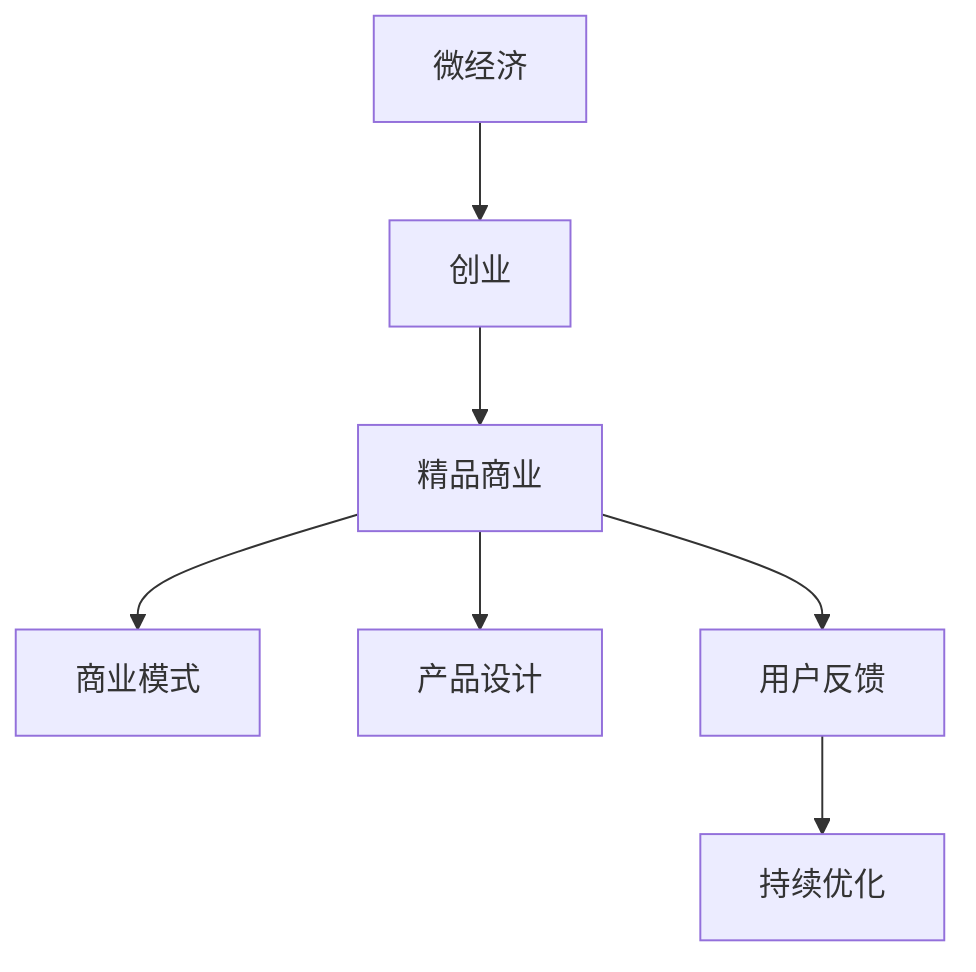

                 

# 微经济创业：小而美的精品商业

> 关键词：微经济，创业，精品商业，商业模式，产品设计，用户反馈，持续优化，快速迭代

## 1. 背景介绍

随着互联网技术的快速发展和市场环境的剧烈变化，传统经济模式正逐步被新兴的微经济模式所取代。在微经济时代，消费者更注重个性化和定制化，小规模、高附加值的产品和服务成为新的趋势。创业者的机会和挑战并存，如何在微经济环境中寻找“小而美”的商业模式，打造具有竞争力的精品商业，成为每一位创业者必须面对的课题。

### 1.1 问题由来

互联网的普及和移动设备的普及，使得消费者拥有更加多样化的选择，不再满足于传统的大规模、标准化产品和服务。他们更倾向于选择具有个性、创意和独特性的产品，从而推动了微经济模式的发展。这种模式以小规模、高附加值为核心，注重用户体验和产品设计，通过精准定位和个性化服务，满足消费者多样化需求。

### 1.2 问题核心关键点

在微经济创业中，如何设计和运营“小而美”的精品商业成为核心问题。这要求创业者不仅要有优秀的商业模式，还要具备卓越的产品设计能力、市场洞察力和用户反馈处理能力。以下是微经济创业的几个核心关键点：

1. **精准定位**：准确识别目标用户群体的需求，设计符合其特点的产品或服务。
2. **个性化服务**：提供定制化的解决方案，提升用户体验和满意度。
3. **快速迭代**：根据用户反馈不断优化产品和服务，快速迭代以适应市场变化。
4. **高效运营**：通过精益管理，实现低成本、高效益的运营模式。

## 2. 核心概念与联系

### 2.1 核心概念概述

为更好地理解微经济创业的模式，本节将介绍几个密切相关的核心概念：

- **微经济（Micro Economy）**：指以小规模、高附加值为核心特征的经济模式，强调精细化和个性化服务。
- **创业（Entrepreneurship）**：指个人或团队利用创新思想和资源，创立和发展具有独特价值和市场潜力业务的过程。
- **精品商业（Niche Business）**：指专注于特定市场细分，提供高质量、高附加值产品或服务的商业模式。
- **商业模式（Business Model）**：指企业盈利的方式和逻辑，包括价值主张、客户细分、收入来源和关键资源等要素。
- **产品设计（Product Design）**：指从用户需求出发，通过创新思维和创意设计，开发出具有竞争力和市场潜力的产品。
- **用户反馈（User Feedback）**：指收集用户对产品或服务的意见和建议，用于优化产品和服务质量。
- **持续优化（Continuous Improvement）**：指通过持续的产品和服务迭代，不断提升用户体验和市场竞争力。

这些核心概念之间的逻辑关系可以通过以下Mermaid流程图来展示：



这个流程图展示了一系列概念之间的相互关联和作用机制：

1. 微经济模式推动了创业的兴起。
2. 创业者在微经济环境中，专注于开发精品商业。
3. 精品商业以独特的商业模式为基础。
4. 产品设计是精品商业的核心竞争力。
5. 用户反馈是持续优化的重要依据。

这些概念共同构成了微经济创业的框架，使得创业者能够更好地理解和运营自己的业务。

## 3. 核心算法原理 & 具体操作步骤
### 3.1 算法原理概述

微经济创业的核心算法原理，可以概括为“精准定位、个性化服务、快速迭代和高效运营”。以下详细阐述这些核心算法原理的科学依据和实践方法。

### 3.2 算法步骤详解

微经济创业通常包括以下几个关键步骤：

**Step 1: 市场调研与用户需求分析**
- 收集目标市场的相关数据，包括人口统计、消费习惯、竞争情况等。
- 通过问卷调查、深度访谈等方式，了解目标用户群体的需求和痛点。
- 分析数据和反馈，确定产品或服务的核心卖点和独特价值。

**Step 2: 设计产品原型和用户体验流程**
- 根据用户需求，设计初步的产品原型和用户体验流程。
- 进行用户测试，收集反馈意见，对原型进行改进。
- 确定产品功能、界面设计和用户体验优化方案。

**Step 3: 制定商业模式和营销策略**
- 根据产品特点和目标用户群体，制定精准的商业模式。
- 设计多渠道营销策略，包括线上和线下推广，提升品牌知名度。
- 设定合理的定价策略，确保盈利能力和市场竞争力。

**Step 4: 开发和测试产品**
- 利用敏捷开发方法，快速迭代产品原型，并上线测试。
- 监测产品表现和用户反馈，持续优化产品功能和用户体验。
- 分析数据，调整营销策略和运营方案。

**Step 5: 持续运营和优化**
- 根据市场反馈和用户需求，持续优化产品和服务。
- 定期更新产品功能和设计，提升用户体验。
- 优化运营流程，提升效率和降低成本。

### 3.3 算法优缺点

微经济创业的算法具有以下优点：

1. **高度灵活**：可以根据市场变化和用户反馈快速调整产品和服务。
2. **精准定位**：能够精准识别目标用户群体，提供符合其需求的产品或服务。
3. **高附加值**：通过独特的商业模式和高质量的产品设计，提升产品附加值。

同时，这种算法也存在一些局限性：

1. **资源限制**：由于规模小，可能面临资源有限的问题，如资金、人力和技术支持。
2. **市场竞争激烈**：在微经济环境中，小企业往往面临强大的市场竞争压力。
3. **风险较高**：由于缺乏大规模运营经验，可能面临较高的市场和运营风险。

### 3.4 算法应用领域

微经济创业的算法原理在多个领域都有广泛应用，例如：

1. **电子商务**：通过微经济创业，提供个性化商品推荐、定制化商品和服务，提升用户体验和满意度。
2. **健康医疗**：利用微经济模式，提供个性化健康咨询、定制化健康产品，提升用户健康水平。
3. **教育培训**：提供个性化学习方案、定制化教育服务，提升教育效果和学习体验。
4. **文化艺术**：开发定制化艺术品、文化产品，满足用户对个性化和创意的需求。
5. **旅游服务**：提供定制化旅游线路、个性化旅游服务，提升旅游体验和满意度。

## 4. 数学模型和公式 & 详细讲解 & 举例说明

### 4.1 数学模型构建

微经济创业的核心算法原理，可以通过数学模型来进一步量化和分析。以下构建一个简化的数学模型：

设目标市场规模为 $M$，用户需求为 $D$，产品附加值为 $V$，市场进入成本为 $C$，用户转化率为 $\alpha$，持续优化成本为 $O$。则微经济创业的总体效益 $E$ 可以表示为：

$$
E = M \times D \times V - C - \alpha \times E
$$

其中，$M \times D \times V$ 表示在目标市场规模和用户需求下，产品附加值带来的收益；$C$ 表示市场进入成本；$\alpha \times E$ 表示由于市场竞争和用户反馈带来的收益损失。

### 4.2 公式推导过程

通过上述模型，我们可以对微经济创业的各个因素进行分析。以用户转化率为例，其推导过程如下：

设目标用户数量为 $U$，初次购买用户数量为 $U_1$，重复购买用户数量为 $U_2$，则用户转化率 $\alpha$ 可以表示为：

$$
\alpha = \frac{U_2}{U_1} = \frac{U_2 - U}{U_1 - U}
$$

假设初次购买用户数量为 $U_1$，用户每次消费的概率为 $p$，则重复购买用户数量为 $U_2$，满足：

$$
U_2 = U_1 \times p^{U_1}
$$

将 $U_2$ 代入用户转化率公式中，得到：

$$
\alpha = \frac{U_1 \times p^{U_1} - U}{U_1 - U}
$$

当 $U$ 远小于 $U_1$ 时，可以忽略 $U$ 的影响，得到近似公式：

$$
\alpha \approx p^{U_1}
$$

这表明，用户转化率与初次购买用户数量和用户每次消费的概率有关。通过优化初次购买用户数量和消费概率，可以有效提升用户转化率。

### 4.3 案例分析与讲解

以电子商务平台为例，分析其微经济创业的数学模型。设电子商务平台的目标市场规模为 $M$，用户需求为 $D$，产品附加值为 $V$，市场进入成本为 $C$，用户转化率为 $\alpha$，持续优化成本为 $O$。则平台总体效益 $E$ 可以表示为：

$$
E = M \times D \times V - C - \alpha \times E
$$

其中，$M \times D \times V$ 表示在目标市场规模和用户需求下，平台产品附加值带来的收益；$C$ 表示市场进入成本；$\alpha \times E$ 表示由于市场竞争和用户反馈带来的收益损失。

假设平台的初始用户数量为 $U_0$，新用户数量为 $U_1$，平台通过优化用户体验、个性化推荐等手段，使得用户转化率为 $\alpha = 0.1$。则平台的总体效益公式可以进一步简化为：

$$
E = M \times D \times V - C - 0.1 \times E
$$

解得：

$$
E = \frac{M \times D \times V - C}{1.1}
$$

这表明，通过优化用户体验和个性化推荐，可以有效提升平台的总体效益。平台可以通过持续优化和快速迭代，不断提升用户转化率和平台收益。

## 5. 项目实践：代码实例和详细解释说明
### 5.1 开发环境搭建

在进行微经济创业实践前，我们需要准备好开发环境。以下是使用Python进行项目开发的流程：

1. 安装Python环境：选择Python 3.8或更高版本，并确保pip工具正常工作。
2. 创建虚拟环境：通过virtualenv或conda等工具，创建一个独立的Python环境。
3. 安装开发工具：安装Git、Visual Studio Code、Jupyter Notebook等开发工具。
4. 安装Python库：通过pip安装必要的Python库，如numpy、pandas、matplotlib等。

完成上述步骤后，即可在虚拟环境中开始项目开发。

### 5.2 源代码详细实现

以下是一个基于微经济创业的项目实现示例，使用Python和Django框架搭建电子商务平台。

**urls.py**

```python
from django.urls import path
from . import views

urlpatterns = [
    path('', views.home, name='home'),
    path('product/<int:id>', views.product_detail, name='product_detail'),
    path('cart/', views.cart, name='cart'),
    path('checkout/', views.checkout, name='checkout'),
]
```

**views.py**

```python
from django.shortcuts import render, redirect
from django.contrib import messages
from .forms import ProductForm, CartForm

def home(request):
    products = Product.objects.all()
    return render(request, 'home.html', {'products': products})

def product_detail(request, id):
    product = Product.objects.get(id=id)
    return render(request, 'product_detail.html', {'product': product})

def cart(request):
    cart_items = CartItem.objects.filter(cart__user=request.user)
    cart = Cart.objects.get_or_create(user=request.user)[0]
    cart.items = cart_items
    cart.save()
    return render(request, 'cart.html', {'cart': cart})

def checkout(request):
    if request.method == 'POST':
        form = CartForm(request.POST)
        if form.is_valid():
            cart = form.save()
            messages.success(request, 'Your order has been placed successfully.')
            return redirect('home')
    else:
        form = CartForm()
    return render(request, 'checkout.html', {'form': form})
```

**forms.py**

```python
from django import forms
from .models import CartItem, Cart

class ProductForm(forms.ModelForm):
    class Meta:
        model = Product
        fields = '__all__'

class CartForm(forms.ModelForm):
    class Meta:
        model = Cart
        fields = '__all__'
```

**models.py**

```python
from django.db import models
from django.contrib.auth.models import User

class Product(models.Model):
    name = models.CharField(max_length=255)
    description = models.TextField()
    price = models.DecimalField(max_digits=10, decimal_places=2)
    image = models.ImageField(upload_to='products/')

class Cart(models.Model):
    user = models.ForeignKey(User, on_delete=models.CASCADE)

class CartItem(models.Model):
    cart = models.ForeignKey(Cart, on_delete=models.CASCADE)
    product = models.ForeignKey(Product, on_delete=models.CASCADE)
    quantity = models.IntegerField()
```

### 5.3 代码解读与分析

**urls.py**：定义了项目的主要路由，包括首页、商品详情、购物车和结算页。

**views.py**：定义了各个路由对应的视图函数，包括首页、商品详情、购物车和结算页的处理逻辑。

**forms.py**：定义了表单类，用于数据验证和提交处理。

**models.py**：定义了项目中的主要数据模型，包括商品、购物车和购物车项。

**home**：渲染首页，显示所有商品列表。

**product_detail**：渲染商品详情页，显示指定商品信息。

**cart**：渲染购物车页，显示当前用户的购物车信息。

**checkout**：渲染结算页，处理用户提交的结算请求。

## 6. 实际应用场景
### 6.1 智能推荐系统

智能推荐系统在微经济创业中有着广泛应用。通过分析用户的历史行为数据和当前兴趣，推荐系统可以提供个性化的商品推荐，提升用户满意度和转化率。

**实现方法**：
- 收集用户的历史行为数据，如浏览记录、购买记录、评价记录等。
- 通过协同过滤、内容推荐等算法，分析用户的行为模式和兴趣偏好。
- 根据用户当前的搜索和浏览行为，实时推荐相关商品。

**效果**：
- 提升用户满意度：通过个性化推荐，满足用户的个性化需求。
- 增加销售额：推荐相关商品，提高用户的购买意愿和转化率。

### 6.2 内容生成平台

内容生成平台通过智能算法生成高质量的文章、视频、音乐等内容，满足用户对创意和个性化内容的需求。

**实现方法**：
- 收集用户的兴趣偏好和历史行为数据。
- 利用深度学习模型，如GPT、LSTM等，根据用户需求生成个性化内容。
- 通过用户反馈，不断优化生成模型的性能。

**效果**：
- 提升用户黏性：个性化内容吸引用户持续关注和使用。
- 增加平台收益：通过广告、付费内容等形式，提升平台收入。

### 6.3 健康管理应用

健康管理应用通过微经济模式，提供个性化健康咨询、定制化健康产品，提升用户健康水平。

**实现方法**：
- 收集用户的健康数据，如身高、体重、饮食记录等。
- 通过机器学习模型，分析用户的健康状况和风险。
- 提供个性化的健康建议和定制化的健康产品。

**效果**：
- 提升用户体验：个性化健康建议和产品满足用户的健康需求。
- 增加用户粘性：用户长期使用平台，积累更多健康数据。

### 6.4 未来应用展望

随着人工智能技术的发展，微经济创业的应用场景将更加广泛和深入。未来，微经济创业将在以下领域实现突破：

1. **AI辅助设计**：利用AI技术，帮助设计师快速生成创意设计方案，提升设计效率和质量。
2. **个性化教育**：根据学生的学习行为和兴趣，提供个性化的学习方案和资源。
3. **智能家居**：通过微经济模式，提供定制化的智能家居解决方案，提升居住体验。
4. **虚拟试衣间**：利用AI技术，提供虚拟试衣间服务，满足用户的个性化购物需求。

## 7. 工具和资源推荐
### 7.1 学习资源推荐

为了帮助创业者系统掌握微经济创业的理论基础和实践技巧，这里推荐一些优质的学习资源：

1. **《创业的艺术》（The Art of Entrepreneurship）**：由知名创业专家撰写，全面介绍了创业的各个方面，包括市场调研、产品设计、商业模式等。

2. **Coursera《创业与创新》（Entrepreneurship and Innovation）**：斯坦福大学开设的创业课程，通过视频讲解、在线讨论等方式，帮助创业者系统学习创业知识。

3. **Udacity《人工智能创业》（Artificial Intelligence Entrepreneurship）**：结合人工智能技术，介绍微经济创业的新趋势和新方法。

4. **《精益创业》（The Lean Startup）》**：由Eric Ries撰写，强调通过快速迭代和市场验证，实现创业成功。

5. **《微经济创业指南》（Micro Economic Entrepreneurship Guide）》**：系统介绍微经济创业的理论基础和实践方法，适合创业者阅读学习。

通过对这些资源的学习实践，相信你一定能够快速掌握微经济创业的精髓，并用于解决实际的创业问题。

### 7.2 开发工具推荐

高效的开发离不开优秀的工具支持。以下是几款用于微经济创业开发的常用工具：

1. **Python**：强大的编程语言，适用于数据分析、机器学习等领域的开发。

2. **Django**：流行的Web开发框架，适合快速开发Web应用。

3. **MySQL/PostgreSQL**：常用的关系型数据库，用于存储和管理数据。

4. **Jupyter Notebook**：交互式编程环境，适合数据分析和机器学习任务。

5. **Git**：版本控制工具，用于代码管理和协作开发。

合理利用这些工具，可以显著提升微经济创业的开发效率，加快创新迭代的步伐。

### 7.3 相关论文推荐

微经济创业的研究源于学界的持续研究。以下是几篇奠基性的相关论文，推荐阅读：

1. **《创业模式探索》（Exploring New Business Models）**：探讨创业模式的多样性和创新性，提供丰富的案例分析。

2. **《微经济理论》（Micro Economic Theory）**：分析微经济环境的理论基础和应用场景，适合研究者参考。

3. **《精益创业方法论》（Lean Startup Methodology）**：介绍精益创业的方法和步骤，指导创业者实现快速迭代和市场验证。

4. **《个性化推荐算法》（Personalized Recommendation Algorithms）**：深入探讨个性化推荐的算法原理和应用实例，适合开发者学习。

5. **《内容生成技术》（Content Generation Techniques）**：研究内容生成技术的发展趋势和应用场景，为微经济创业提供技术支持。

这些论文代表了大经济创业的研究方向，通过学习这些前沿成果，可以帮助研究者把握学科前进方向，激发更多的创新灵感。

## 8. 总结：未来发展趋势与挑战
### 8.1 总结

本文对微经济创业的理论基础和实践方法进行了全面系统的介绍。首先阐述了微经济创业的背景和意义，明确了微经济创业在快速变化的市场环境中的重要性和适用性。其次，从原理到实践，详细讲解了微经济创业的算法原理和操作步骤，提供了完整的代码实例和分析。同时，本文还广泛探讨了微经济创业在多个领域的应用前景，展示了微经济创业的广阔发展空间。最后，本文精选了微经济创业的学习资源和开发工具，力求为创业者提供全方位的技术指引。

通过本文的系统梳理，可以看到，微经济创业不仅能够满足消费者对个性化和创意的需求，还能够在多领域带来变革性影响。未来，伴随技术的不断演进，微经济创业将进一步拓展其应用边界，成为推动经济和社会发展的强劲动力。

### 8.2 未来发展趋势

展望未来，微经济创业的发展趋势主要体现在以下几个方面：

1. **技术融合**：微经济创业将与人工智能、大数据、区块链等前沿技术深度融合，推动技术创新和产业升级。

2. **跨界合作**：微经济创业将突破行业界限，与传统产业进行跨界合作，实现业务创新和价值共创。

3. **国际拓展**：微经济创业将拓展全球市场，利用全球资源和用户需求，实现业务的国际化发展。

4. **可持续发展**：微经济创业将注重环境保护和可持续发展，推动绿色经济和循环经济的发展。

5. **社会责任**：微经济创业将注重社会责任和公益事业，推动企业社会责任和可持续发展。

以上趋势凸显了微经济创业的广阔前景。这些方向的探索发展，必将进一步提升微经济创业的竞争力，为社会和经济带来更多创新价值。

### 8.3 面临的挑战

尽管微经济创业在多个领域取得了显著成效，但在迈向更加智能化、普适化应用的过程中，仍面临诸多挑战：

1. **市场竞争激烈**：微经济创业面临着传统大企业和新进入者的双重竞争压力，市场份额的争夺异常激烈。
2. **用户需求多样**：消费者需求日益多样化，微经济创业需要不断创新产品和服务，以满足不断变化的市场需求。
3. **资源限制**：微经济创业规模小，资源有限，可能面临资金、技术和人才的瓶颈。
4. **法规政策**：微经济创业需要遵守复杂的法规和政策，合规性风险较高。

### 8.4 研究展望

面对微经济创业所面临的种种挑战，未来的研究需要在以下几个方面寻求新的突破：

1. **商业模式创新**：探索更加灵活多样的商业模式，实现多渠道、多路径的收入来源。
2. **产品和服务优化**：通过持续的产品和服务迭代，提升用户体验和市场竞争力。
3. **技术创新应用**：结合前沿技术，如AI、大数据、区块链等，提升微经济创业的创新能力和市场竞争力。
4. **国际市场拓展**：拓展全球市场，实现业务的国际化发展，提升企业的国际竞争力。
5. **社会责任承担**：注重社会责任和公益事业，推动企业的可持续发展。

这些研究方向的探索，必将引领微经济创业走向更高的台阶，为社会和经济带来更多创新价值。面向未来，微经济创业需要不断突破和创新，才能在激烈的市场竞争中脱颖而出，实现持续发展和长期成功。

## 9. 附录：常见问题与解答
**Q1：微经济创业如何与大数据技术结合？**

A: 微经济创业可以通过大数据技术，分析用户行为和市场趋势，进行精准定位和市场预测。具体而言，可以利用数据挖掘、机器学习等技术，对用户历史行为数据进行分析和建模，发现用户需求和市场趋势。通过大数据分析，可以优化产品和服务设计，提升用户体验和市场竞争力。

**Q2：微经济创业的资源限制如何缓解？**

A: 微经济创业可以通过精益管理、众筹融资、共享经济等方式缓解资源限制。例如，通过精益管理优化运营流程，降低成本；通过众筹融资获取资金支持；通过共享经济利用外部资源，提升效率和效益。

**Q3：微经济创业面临的法规政策如何应对？**

A: 微经济创业需要注重合规性，遵守相关的法律法规和政策要求。具体而言，可以聘请法律顾问，定期进行合规性审查，确保业务操作符合法律法规。同时，可以利用区块链等技术，提高业务透明度和可信度，降低合规性风险。

**Q4：微经济创业如何实现可持续发展？**

A: 微经济创业可以注重环保和可持续发展，采用绿色能源、循环利用等措施，减少环境影响。例如，可以采用太阳能、风能等清洁能源，减少碳排放；采用循环利用的包装材料，降低资源消耗。同时，可以积极参与公益事业，承担社会责任，提升企业形象和品牌价值。

**Q5：微经济创业如何拓展国际市场？**

A: 微经济创业可以通过品牌建设和国际化营销，拓展全球市场。具体而言，可以建立国际品牌，提升品牌知名度和市场影响力。通过国际化营销，进入海外市场，提升业务规模和市场竞争力。同时，可以利用跨境电商等新兴渠道，降低国际贸易成本，提升市场响应速度。

通过以上常见问题的解答，相信读者对微经济创业的理论基础和实践方法有了更深入的理解，可以更好地应对实际创业中的各种挑战，实现业务的持续发展和长期成功。

