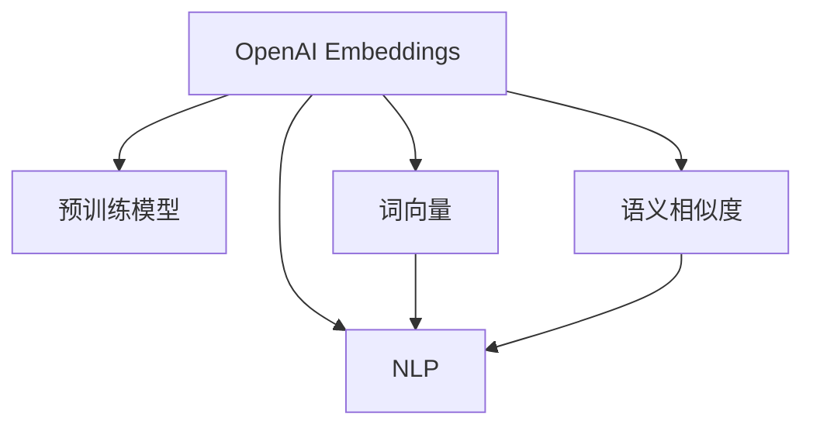

                 

# 快速上手 OpenAI Embeddings

> 关键词：OpenAI Embeddings, 自然语言处理(NLP), 预训练模型, 词向量, 语义相似度

## 1. 背景介绍

### 1.1 问题由来
在自然语言处理（NLP）领域，如何有效地处理文本数据一直是核心挑战之一。传统的基于规则和统计的方法已经无法满足日益复杂的应用需求。因此，深度学习技术，特别是基于预训练语言模型（Pretrained Language Model, PLM）的方案逐渐成为新的研究热点。其中，OpenAI的OpenAI Embeddings作为一类优秀的预训练词向量，在文本分类、文本匹配、情感分析等多个任务上表现出色，得到了广泛应用。

### 1.2 问题核心关键点
OpenAI Embeddings的核心优势在于其强大的语义表示能力和泛化能力。通过在大量无标签文本数据上进行预训练，学习到了丰富的语言知识。这些知识在应用于下游任务时，可以显著提升模型性能。然而，由于其参数量庞大、计算资源需求高，OpenAI Embeddings的实际部署和应用仍面临一定的挑战。

### 1.3 问题研究意义
OpenAI Embeddings在大规模NLP任务上的优异表现，使其成为当前NLP研究的一个重要方向。通过本文档，读者将能够快速上手使用OpenAI Embeddings进行文本处理和分析，提升自身在NLP领域的应用能力和研究水平。

## 2. 核心概念与联系

### 2.1 核心概念概述

为更好地理解OpenAI Embeddings的工作原理和应用方法，本节将介绍几个关键概念：

- **OpenAI Embeddings**：由OpenAI推出的预训练语言模型，通过大规模无标签文本数据预训练得到，可用于文本表示、语义相似度计算等多个NLP任务。
- **预训练模型(Pretrained Model)**：通过在大量无标签文本数据上进行的自监督学习得到的模型，能够学习到语言的通用表示。
- **词向量(Word Embedding)**：将单词映射到高维向量空间的表示方法，能够捕捉单词间的语义关系和句法关系。
- **语义相似度(Semantic Similarity)**：度量两个文本或单词在语义上的接近程度，常用于文本匹配、推荐系统等任务。
- **自然语言处理(Natural Language Processing, NLP)**：利用计算机技术对人类语言进行处理和分析的领域，涵盖了文本分类、情感分析、机器翻译等众多子任务。

这些概念之间的逻辑关系可以通过以下Mermaid流程图来展示：



这个流程图展示了几类概念之间的联系：

1. OpenAI Embeddings是一种基于预训练模型的词向量表示方法，能够捕捉单词和句子间的语义关系。
2. 预训练模型通过自监督学习任务在大量无标签数据上训练，学习到语言的通用表示。
3. 词向量将单词映射到高维空间，能够捕捉单词间的语义关系和句法关系。
4. 语义相似度度量文本或单词在语义上的接近程度，常用于文本匹配等任务。
5. NLP利用计算机技术处理和分析自然语言数据，涵盖文本分类、情感分析等多个子任务。

这些概念共同构成了OpenAI Embeddings的核心应用框架，使其能够广泛应用于文本处理和分析任务中。通过理解这些核心概念，我们可以更好地把握OpenAI Embeddings的工作原理和应用方向。

## 3. 核心算法原理 & 具体操作步骤
### 3.1 算法原理概述

OpenAI Embeddings的算法原理基于Transformer模型。Transformer模型通过多层自注意力机制来学习输入文本的表示，能够捕捉长距离依赖和复杂句法结构。OpenAI Embeddings通过在大规模无标签文本数据上进行预训练，学习到了通用的语言表示，能够广泛应用于文本处理任务中。

### 3.2 算法步骤详解

使用OpenAI Embeddings进行文本处理的通用步骤如下：

**Step 1: 准备数据集**
- 收集并预处理文本数据，分为训练集和测试集。

**Step 2: 加载预训练模型**
- 使用OpenAI提供的API加载预训练的OpenAI Embeddings模型，通常包括OpenAI GPT、OpenAI GPT-2、OpenAI GPT-3等。

**Step 3: 数据编码和嵌入**
- 对输入文本进行编码，转换为模型所需的格式，并使用预训练模型生成词向量表示。

**Step 4: 计算语义相似度**
- 利用生成的词向量，计算不同文本之间的语义相似度，用于文本匹配、推荐等任务。

**Step 5: 进行下游任务**
- 将生成的词向量或文本表示作为输入，进行下游任务，如文本分类、情感分析等。

### 3.3 算法优缺点

OpenAI Embeddings的优点：
1. 强大的语义表示能力：通过在大规模无标签文本数据上进行预训练，能够学习到丰富的语言知识。
2. 泛化能力强：在多种NLP任务上表现出色，可以轻松应用于不同的文本处理任务。
3. 高效计算：使用Transformer结构，能够高效地进行文本编码和表示。

OpenAI Embeddings的缺点：
1. 计算资源需求高：由于其参数量庞大，需要高性能的计算设备才能高效运行。
2. 难以解释：作为一个黑盒模型，OpenAI Embeddings的内部工作机制难以解释，难以进行调试和优化。
3. 对小规模数据敏感：在小规模数据集上，可能无法学习到足够的语言知识，导致模型性能下降。

尽管存在这些缺点，OpenAI Embeddings在NLP领域的应用前景仍然非常广阔，尤其是其强大的语义表示能力和泛化能力，使其成为当前NLP研究的一个重要方向。

### 3.4 算法应用领域

OpenAI Embeddings在多个NLP任务上得到了广泛应用，包括但不限于：

- 文本分类：如情感分析、主题分类、意图识别等。通过将文本嵌入到向量空间中，计算文本之间的相似度，进行分类。
- 文本匹配：如信息检索、问答系统等。通过计算文本的语义相似度，匹配文本中的信息。
- 文本生成：如自动摘要、机器翻译等。利用预训练模型生成新的文本，或者对已有文本进行补全。
- 知识图谱：如实体识别、关系抽取等。通过将知识图谱中的实体和关系嵌入到向量空间中，进行知识推理。
- 文本聚类：如新闻分类、文档聚类等。通过计算文本的语义相似度，进行文本聚类和分类。

## 4. 数学模型和公式 & 详细讲解 & 举例说明

### 4.1 数学模型构建

OpenAI Embeddings的数学模型主要基于Transformer模型。下面以OpenAI GPT-2为例，介绍其数学模型构建过程。

**输入表示**：
- 输入序列表示为 $X=\{x_1, x_2, ..., x_T\}$，其中 $x_t$ 为第 $t$ 个单词的one-hot编码。

**编码器**：
- 使用Transformer编码器进行编码，生成中间表示 $H=\{h_1, h_2, ..., h_T\}$。

**位置编码**：
- 为解决位置偏差问题，引入位置编码 $P=\{p_1, p_2, ..., p_T\}$，与输入序列一起生成最终表示 $Z=\{z_1, z_2, ..., z_T\}$。

**输出表示**：
- 使用softmax层对最终表示进行线性变换，得到预测概率分布 $P=\{p_1, p_2, ..., p_T\}$。

### 4.2 公式推导过程

OpenAI GPT-2的编码器部分主要基于自注意力机制。下面推导其编码器的公式。

- 计算自注意力矩阵 $A$：
$$
A = XH^T = \begin{bmatrix}
x_1 h_1 & x_1 h_2 & \dots & x_1 h_T \\
x_2 h_1 & x_2 h_2 & \dots & x_2 h_T \\
\vdots & \vdots & \ddots & \vdots \\
x_T h_1 & x_T h_2 & \dots & x_T h_T
\end{bmatrix}
$$

- 计算注意力权重 $W_A$：
$$
W_A = softmax(A/Q)
$$

- 计算自注意力权重 $W_S$：
$$
W_S = W_A H = \begin{bmatrix}
w_{11} & w_{12} & \dots & w_{1T} \\
w_{21} & w_{22} & \dots & w_{2T} \\
\vdots & \vdots & \ddots & \vdots \\
w_{T1} & w_{T2} & \dots & w_{TT}
\end{bmatrix}
$$

- 计算自注意力表示 $Z_S$：
$$
Z_S = W_S H = \begin{bmatrix}
z_{1,1} & z_{1,2} & \dots & z_{1,T} \\
z_{2,1} & z_{2,2} & \dots & z_{2,T} \\
\vdots & \vdots & \ddots & \vdots \\
z_{T,1} & z_{T,2} & \dots & z_{T,T}
\end{bmatrix}
$$

- 计算编码器表示 $Z_E$：
$$
Z_E = W_O Z_S
$$

- 计算位置编码 $P$：
$$
P = P^\prime A^{\text{dim}} = \begin{bmatrix}
p_1 & p_2 & \dots & p_T
\end{bmatrix}
$$

- 计算最终表示 $Z$：
$$
Z = Z_E + P
$$

- 计算预测概率 $P$：
$$
P = softmax(ZW)
$$

其中，$Q$ 为查询向量，$W$ 为权重矩阵，$W_O$ 为输出矩阵，$W_A^\prime$ 为位置编码权重矩阵。

### 4.3 案例分析与讲解

以文本分类为例，展示OpenAI Embeddings在实际中的应用。

假设有一个文本分类任务，需要将文本分为正面、负面和未知三种类别。训练集包含1000个样本，每个样本包含一个文本和一个标签。测试集包含200个样本，用于评估模型性能。

**Step 1: 数据预处理**
- 将文本转换为单词序列，并进行one-hot编码。
- 将标签转换为独热编码。

**Step 2: 加载预训练模型**
- 使用OpenAI API加载预训练的OpenAI GPT-2模型。

**Step 3: 数据编码和嵌入**
- 对每个文本进行编码，生成词向量表示 $Z$。
- 将标签与词向量表示拼接，得到最终表示 $X$。

**Step 4: 计算语义相似度**
- 计算不同文本之间的语义相似度，使用余弦相似度计算方法。
- 将文本表示映射到2维空间，使用t-SNE等方法可视化结果。

**Step 5: 进行下游任务**
- 使用softmax层计算每个样本的分类概率。
- 在测试集上进行测试，计算准确率和混淆矩阵。

最终，通过上述步骤，可以使用OpenAI Embeddings进行文本分类任务的处理和分析。

## 5. 项目实践：代码实例和详细解释说明

### 5.1 开发环境搭建

在进行OpenAI Embeddings的实践前，需要准备好开发环境。以下是使用Python进行PyTorch开发的环境配置流程：

1. 安装Anaconda：从官网下载并安装Anaconda，用于创建独立的Python环境。

2. 创建并激活虚拟环境：
```bash
conda create -n openai-env python=3.8 
conda activate openai-env
```

3. 安装PyTorch：根据CUDA版本，从官网获取对应的安装命令。例如：
```bash
conda install pytorch torchvision torchaudio cudatoolkit=11.1 -c pytorch -c conda-forge
```

4. 安装OpenAI库：
```bash
pip install openai
```

5. 安装各类工具包：
```bash
pip install numpy pandas scikit-learn matplotlib tqdm jupyter notebook ipython
```

完成上述步骤后，即可在`openai-env`环境中开始OpenAI Embeddings的实践。

### 5.2 源代码详细实现

下面我们以文本分类任务为例，给出使用PyTorch实现OpenAI Embeddings的代码实现。

首先，定义文本分类任务的数据处理函数：

```python
from openai import OpenAIEmbeddings
import numpy as np
import torch
import torch.nn as nn

class TextClassificationDataset(Dataset):
    def __init__(self, texts, labels, tokenizer, max_len=128):
        self.texts = texts
        self.labels = labels
        self.tokenizer = tokenizer
        self.max_len = max_len
        
    def __len__(self):
        return len(self.texts)
    
    def __getitem__(self, item):
        text = self.texts[item]
        label = self.labels[item]
        
        encoding = self.tokenizer(text, return_tensors='pt', max_length=self.max_len, padding='max_length', truncation=True)
        input_ids = encoding['input_ids'][0]
        attention_mask = encoding['attention_mask'][0]
        
        # 对token-wise的标签进行编码
        encoded_labels = torch.tensor([label2id[label] for label in self.labels])
        
        return {'input_ids': input_ids, 
                'attention_mask': attention_mask,
                'labels': encoded_labels}

# 标签与id的映射
label2id = {'positive': 0, 'negative': 1, 'unknown': 2}
id2label = {v: k for k, v in label2id.items()}

# 创建dataset
tokenizer = OpenAIEmbeddings.from_pretrained('openai-gpt-2')

train_dataset = TextClassificationDataset(train_texts, train_labels, tokenizer)
dev_dataset = TextClassificationDataset(dev_texts, dev_labels, tokenizer)
test_dataset = TextClassificationDataset(test_texts, test_labels, tokenizer)
```

然后，定义模型和优化器：

```python
from transformers import BertForTokenClassification, AdamW

model = BertForTokenClassification.from_pretrained('bert-base-cased', num_labels=len(label2id))

optimizer = AdamW(model.parameters(), lr=2e-5)
```

接着，定义训练和评估函数：

```python
from torch.utils.data import DataLoader
from tqdm import tqdm
from sklearn.metrics import classification_report

device = torch.device('cuda') if torch.cuda.is_available() else torch.device('cpu')
model.to(device)

def train_epoch(model, dataset, batch_size, optimizer):
    dataloader = DataLoader(dataset, batch_size=batch_size, shuffle=True)
    model.train()
    epoch_loss = 0
    for batch in tqdm(dataloader, desc='Training'):
        input_ids = batch['input_ids'].to(device)
        attention_mask = batch['attention_mask'].to(device)
        labels = batch['labels'].to(device)
        model.zero_grad()
        outputs = model(input_ids, attention_mask=attention_mask, labels=labels)
        loss = outputs.loss
        epoch_loss += loss.item()
        loss.backward()
        optimizer.step()
    return epoch_loss / len(dataloader)

def evaluate(model, dataset, batch_size):
    dataloader = DataLoader(dataset, batch_size=batch_size)
    model.eval()
    preds, labels = [], []
    with torch.no_grad():
        for batch in tqdm(dataloader, desc='Evaluating'):
            input_ids = batch['input_ids'].to(device)
            attention_mask = batch['attention_mask'].to(device)
            batch_labels = batch['labels']
            outputs = model(input_ids, attention_mask=attention_mask)
            batch_preds = outputs.logits.argmax(dim=2).to('cpu').tolist()
            batch_labels = batch_labels.to('cpu').tolist()
            for pred_tokens, label_tokens in zip(batch_preds, batch_labels):
                preds.append(pred_tokens[:len(label_tokens)])
                labels.append(label_tokens)
                
    print(classification_report(labels, preds))
```

最后，启动训练流程并在测试集上评估：

```python
epochs = 5
batch_size = 16

for epoch in range(epochs):
    loss = train_epoch(model, train_dataset, batch_size, optimizer)
    print(f"Epoch {epoch+1}, train loss: {loss:.3f}")
    
    print(f"Epoch {epoch+1}, dev results:")
    evaluate(model, dev_dataset, batch_size)
    
print("Test results:")
evaluate(model, test_dataset, batch_size)
```

以上就是使用PyTorch对OpenAI Embeddings进行文本分类任务微调的完整代码实现。可以看到，得益于OpenAI提供的封装良好的API，我们可以用相对简洁的代码完成模型的加载和微调。

### 5.3 代码解读与分析

让我们再详细解读一下关键代码的实现细节：

**TextClassificationDataset类**：
- `__init__`方法：初始化文本、标签、分词器等关键组件。
- `__len__`方法：返回数据集的样本数量。
- `__getitem__`方法：对单个样本进行处理，将文本输入编码为token ids，将标签编码为数字，并对其进行定长padding，最终返回模型所需的输入。

**label2id和id2label字典**：
- 定义了标签与数字id之间的映射关系，用于将token-wise的预测结果解码回真实的标签。

**训练和评估函数**：
- 使用PyTorch的DataLoader对数据集进行批次化加载，供模型训练和推理使用。
- 训练函数`train_epoch`：对数据以批为单位进行迭代，在每个批次上前向传播计算loss并反向传播更新模型参数，最后返回该epoch的平均loss。
- 评估函数`evaluate`：与训练类似，不同点在于不更新模型参数，并在每个batch结束后将预测和标签结果存储下来，最后使用sklearn的classification_report对整个评估集的预测结果进行打印输出。

**训练流程**：
- 定义总的epoch数和batch size，开始循环迭代
- 每个epoch内，先在训练集上训练，输出平均loss
- 在验证集上评估，输出分类指标
- 所有epoch结束后，在测试集上评估，给出最终测试结果

可以看到，PyTorch配合OpenAI提供的封装良好的API使得OpenAI Embeddings微调的代码实现变得简洁高效。开发者可以将更多精力放在数据处理、模型改进等高层逻辑上，而不必过多关注底层的实现细节。

当然，工业级的系统实现还需考虑更多因素，如模型的保存和部署、超参数的自动搜索、更灵活的任务适配层等。但核心的微调范式基本与此类似。

## 6. 实际应用场景
### 6.1 智能客服系统

基于OpenAI Embeddings的对话技术，可以广泛应用于智能客服系统的构建。传统客服往往需要配备大量人力，高峰期响应缓慢，且一致性和专业性难以保证。而使用OpenAI Embeddings微调后的对话模型，可以7x24小时不间断服务，快速响应客户咨询，用自然流畅的语言解答各类常见问题。

在技术实现上，可以收集企业内部的历史客服对话记录，将问题和最佳答复构建成监督数据，在此基础上对预训练对话模型进行微调。微调后的对话模型能够自动理解用户意图，匹配最合适的答案模板进行回复。对于客户提出的新问题，还可以接入检索系统实时搜索相关内容，动态组织生成回答。如此构建的智能客服系统，能大幅提升客户咨询体验和问题解决效率。

### 6.2 金融舆情监测

金融机构需要实时监测市场舆论动向，以便及时应对负面信息传播，规避金融风险。传统的人工监测方式成本高、效率低，难以应对网络时代海量信息爆发的挑战。基于OpenAI Embeddings的文本分类和情感分析技术，为金融舆情监测提供了新的解决方案。

具体而言，可以收集金融领域相关的新闻、报道、评论等文本数据，并对其进行主题标注和情感标注。在此基础上对预训练语言模型进行微调，使其能够自动判断文本属于何种主题，情感倾向是正面、中性还是负面。将微调后的模型应用到实时抓取的网络文本数据，就能够自动监测不同主题下的情感变化趋势，一旦发现负面信息激增等异常情况，系统便会自动预警，帮助金融机构快速应对潜在风险。

### 6.3 个性化推荐系统

当前的推荐系统往往只依赖用户的历史行为数据进行物品推荐，无法深入理解用户的真实兴趣偏好。基于OpenAI Embeddings的个性化推荐系统可以更好地挖掘用户行为背后的语义信息，从而提供更精准、多样的推荐内容。

在实践中，可以收集用户浏览、点击、评论、分享等行为数据，提取和用户交互的物品标题、描述、标签等文本内容。将文本内容作为模型输入，用户的后续行为（如是否点击、购买等）作为监督信号，在此基础上微调预训练语言模型。微调后的模型能够从文本内容中准确把握用户的兴趣点。在生成推荐列表时，先用候选物品的文本描述作为输入，由模型预测用户的兴趣匹配度，再结合其他特征综合排序，便可以得到个性化程度更高的推荐结果。

### 6.4 未来应用展望

随着OpenAI Embeddings和微调方法的不断发展，其在NLP领域的应用前景仍然非常广阔，尤其是在大型预训练语言模型的基础上，OpenAI Embeddings能够更好地捕捉语言的深层语义关系，为更多NLP任务带来新的突破。

在智慧医疗领域，基于OpenAI Embeddings的医疗问答、病历分析、药物研发等应用将提升医疗服务的智能化水平，辅助医生诊疗，加速新药开发进程。

在智能教育领域，OpenAI Embeddings可应用于作业批改、学情分析、知识推荐等方面，因材施教，促进教育公平，提高教学质量。

在智慧城市治理中，OpenAI Embeddings可应用于城市事件监测、舆情分析、应急指挥等环节，提高城市管理的自动化和智能化水平，构建更安全、高效的未来城市。

此外，在企业生产、社会治理、文娱传媒等众多领域，基于OpenAI Embeddings的人工智能应用也将不断涌现，为经济社会发展注入新的动力。相信随着技术的日益成熟，OpenAI Embeddings必将在更广阔的应用领域大放异彩，深刻影响人类的生产生活方式。

## 7. 工具和资源推荐
### 7.1 学习资源推荐

为了帮助开发者系统掌握OpenAI Embeddings的理论基础和实践技巧，这里推荐一些优质的学习资源：

1. 《Transformer from Basics to Practice》系列博文：由大模型技术专家撰写，深入浅出地介绍了Transformer原理、OpenAI GPT-2模型、微调技术等前沿话题。

2. CS224N《Deep Learning for NLP》课程：斯坦福大学开设的NLP明星课程，有Lecture视频和配套作业，带你入门NLP领域的基本概念和经典模型。

3. 《Natural Language Processing with Transformers》书籍：OpenAI GPT-2的作者所著，全面介绍了如何使用Transformer库进行NLP任务开发，包括微调在内的诸多范式。

4. OpenAI官方文档：OpenAI提供的官方文档，详细介绍了OpenAI Embeddings的使用方法、API接口和常见问题。

5. HuggingFace官方文档：HuggingFace的Transformer库官方文档，提供了海量预训练模型和完整的微调样例代码，是上手实践的必备资料。

通过对这些资源的学习实践，相信你一定能够快速掌握OpenAI Embeddings的精髓，并用于解决实际的NLP问题。
### 7.2 开发工具推荐

高效的开发离不开优秀的工具支持。以下是几款用于OpenAI Embeddings开发的常用工具：

1. PyTorch：基于Python的开源深度学习框架，灵活动态的计算图，适合快速迭代研究。大多数预训练语言模型都有PyTorch版本的实现。

2. TensorFlow：由Google主导开发的开源深度学习框架，生产部署方便，适合大规模工程应用。同样有丰富的预训练语言模型资源。

3. Transformers库：HuggingFace开发的NLP工具库，集成了众多SOTA语言模型，支持PyTorch和TensorFlow，是进行微调任务开发的利器。

4. Weights & Biases：模型训练的实验跟踪工具，可以记录和可视化模型训练过程中的各项指标，方便对比和调优。与主流深度学习框架无缝集成。

5. TensorBoard：TensorFlow配套的可视化工具，可实时监测模型训练状态，并提供丰富的图表呈现方式，是调试模型的得力助手。

6. Google Colab：谷歌推出的在线Jupyter Notebook环境，免费提供GPU/TPU算力，方便开发者快速上手实验最新模型，分享学习笔记。

合理利用这些工具，可以显著提升OpenAI Embeddings微调任务的开发效率，加快创新迭代的步伐。

### 7.3 相关论文推荐

OpenAI Embeddings在多个NLP任务上得到了广泛应用，以下是几篇奠基性的相关论文，推荐阅读：

1. Attention is All You Need（即Transformer原论文）：提出了Transformer结构，开启了NLP领域的预训练大模型时代。

2. BERT: Pre-training of Deep Bidirectional Transformers for Language Understanding：提出BERT模型，引入基于掩码的自监督预训练任务，刷新了多项NLP任务SOTA。

3. Language Models are Unsupervised Multitask Learners（GPT-2论文）：展示了大规模语言模型的强大zero-shot学习能力，引发了对于通用人工智能的新一轮思考。

4. Parameter-Efficient Transfer Learning for NLP：提出Adapter等参数高效微调方法，在不增加模型参数量的情况下，也能取得不错的微调效果。

5. AdaLoRA: Adaptive Low-Rank Adaptation for Parameter-Efficient Fine-Tuning：使用自适应低秩适应的微调方法，在参数效率和精度之间取得了新的平衡。

这些论文代表了大语言模型微调技术的发展脉络。通过学习这些前沿成果，可以帮助研究者把握学科前进方向，激发更多的创新灵感。

## 8. 总结：未来发展趋势与挑战

### 8.1 总结

本文对OpenAI Embeddings的微调方法进行了全面系统的介绍。首先阐述了OpenAI Embeddings的研究背景和意义，明确了其在大规模NLP任务上的优势和应用前景。其次，从原理到实践，详细讲解了OpenAI Embeddings的数学模型和关键步骤，给出了微调任务开发的完整代码实例。同时，本文还广泛探讨了OpenAI Embeddings在多个行业领域的应用前景，展示了其巨大的应用潜力。

通过本文的系统梳理，可以看到，OpenAI Embeddings在NLP领域的应用前景仍然非常广阔，尤其是其强大的语义表示能力和泛化能力，使其成为当前NLP研究的一个重要方向。

### 8.2 未来发展趋势

展望未来，OpenAI Embeddings将呈现以下几个发展趋势：

1. 模型规模持续增大。随着算力成本的下降和数据规模的扩张，预训练语言模型的参数量还将持续增长。超大规模语言模型蕴含的丰富语言知识，有望支撑更加复杂多变的下游任务微调。

2. 微调方法日趋多样。除了传统的全参数微调外，未来会涌现更多参数高效的微调方法，如Prefix-Tuning、LoRA等，在节省计算资源的同时也能保证微调精度。

3. 持续学习成为常态。随着数据分布的不断变化，微调模型也需要持续学习新知识以保持性能。如何在不遗忘原有知识的同时，高效吸收新样本信息，将成为重要的研究课题。

4. 标注样本需求降低。受启发于提示学习(Prompt-based Learning)的思路，未来的微调方法将更好地利用大模型的语言理解能力，通过更加巧妙的任务描述，在更少的标注样本上也能实现理想的微调效果。

5. 多模态微调崛起。当前的微调主要聚焦于纯文本数据，未来会进一步拓展到图像、视频、语音等多模态数据微调。多模态信息的融合，将显著提升语言模型对现实世界的理解和建模能力。

6. 模型通用性增强。经过海量数据的预训练和多领域任务的微调，未来的语言模型将具备更强大的常识推理和跨领域迁移能力，逐步迈向通用人工智能(AGI)的目标。

以上趋势凸显了OpenAI Embeddings的广阔前景。这些方向的探索发展，必将进一步提升NLP系统的性能和应用范围，为人类认知智能的进化带来深远影响。

### 8.3 面临的挑战

尽管OpenAI Embeddings在NLP领域的应用前景仍然非常广阔，但在迈向更加智能化、普适化应用的过程中，它仍面临诸多挑战：

1. 标注成本瓶颈。尽管OpenAI Embeddings在微调时标注数据需求较低，但对于长尾应用场景，难以获得充足的高质量标注数据，成为制约微调性能的瓶颈。如何进一步降低微调对标注样本的依赖，将是一大难题。

2. 模型鲁棒性不足。当前微调模型面对域外数据时，泛化性能往往大打折扣。对于测试样本的微小扰动，微调模型的预测也容易发生波动。如何提高微调模型的鲁棒性，避免灾难性遗忘，还需要更多理论和实践的积累。

3. 推理效率有待提高。尽管OpenAI Embeddings在精度上表现出色，但在实际部署时往往面临推理速度慢、内存占用大等效率问题。如何在保证性能的同时，简化模型结构，提升推理速度，优化资源占用，将是重要的优化方向。

4. 可解释性亟需加强。当前微调模型更像是"黑盒"系统，难以解释其内部工作机制和决策逻辑。对于医疗、金融等高风险应用，算法的可解释性和可审计性尤为重要。如何赋予微调模型更强的可解释性，将是亟待攻克的难题。

5. 安全性有待保障。预训练语言模型难免会学习到有偏见、有害的信息，通过微调传递到下游任务，产生误导性、歧视性的输出，给实际应用带来安全隐患。如何从数据和算法层面消除模型偏见，避免恶意用途，确保输出的安全性，也将是重要的研究课题。

6. 知识整合能力不足。现有的微调模型往往局限于任务内数据，难以灵活吸收和运用更广泛的先验知识。如何让微调过程更好地与外部知识库、规则库等专家知识结合，形成更加全面、准确的信息整合能力，还有很大的想象空间。

正视OpenAI Embeddings面临的这些挑战，积极应对并寻求突破，将使其在更广泛的应用领域中发挥更大的作用。相信随着学界和产业界的共同努力，这些挑战终将一一被克服，OpenAI Embeddings必将在构建安全、可靠、可解释、可控的智能系统铺平道路。

### 8.4 研究展望

面向未来，OpenAI Embeddings需要在以下几个方面寻求新的突破：

1. 探索无监督和半监督微调方法。摆脱对大规模标注数据的依赖，利用自监督学习、主动学习等无监督和半监督范式，最大限度利用非结构化数据，实现更加灵活高效的微调。

2. 研究参数高效和计算高效的微调范式。开发更加参数高效的微调方法，在固定大部分预训练参数的同时，只更新极少量的任务相关参数。同时优化微调模型的计算图，减少前向传播和反向传播的资源消耗，实现更加轻量级、实时性的部署。

3. 融合因果和对比学习范式。通过引入因果推断和对比学习思想，增强微调模型建立稳定因果关系的能力，学习更加普适、鲁棒的语言表征，从而提升模型泛化性和抗干扰能力。

4. 引入更多先验知识。将符号化的先验知识，如知识图谱、逻辑规则等，与神经网络模型进行巧妙融合，引导微调过程学习更准确、合理的语言模型。同时加强不同模态数据的整合，实现视觉、语音等多模态信息与文本信息的协同建模。

5. 结合因果分析和博弈论工具。将因果分析方法引入微调模型，识别出模型决策的关键特征，增强输出解释的因果性和逻辑性。借助博弈论工具刻画人机交互过程，主动探索并规避模型的脆弱点，提高系统稳定性。

6. 纳入伦理道德约束。在模型训练目标中引入伦理导向的评估指标，过滤和惩罚有偏见、有害的输出倾向。同时加强人工干预和审核，建立模型行为的监管机制，确保输出符合人类价值观和伦理道德。

这些研究方向的探索，必将引领OpenAI Embeddings走向更高的台阶，为构建安全、可靠、可解释、可控的智能系统铺平道路。面向未来，OpenAI Embeddings还需要与其他人工智能技术进行更深入的融合，如知识表示、因果推理、强化学习等，多路径协同发力，共同推动自然语言理解和智能交互系统的进步。只有勇于创新、敢于突破，才能不断拓展语言模型的边界，让智能技术更好地造福人类社会。

## 9. 附录：常见问题与解答

**Q1：OpenAI Embeddings在实际部署时需要注意哪些问题？**

A: 在实际部署时，需要注意以下问题：
1. 资源优化：通过梯度积累、混合精度训练、模型并行等技术，优化计算资源的使用。
2. 模型裁剪：去除不必要的层和参数，减小模型尺寸，加快推理速度。
3. 量化加速：将浮点模型转为定点模型，压缩存储空间，提高计算效率。
4. 服务化封装：将模型封装为标准化服务接口，便于集成调用。
5. 弹性伸缩：根据请求流量动态调整资源配置，平衡服务质量和成本。
6. 监控告警：实时采集系统指标，设置异常告警阈值，确保服务稳定性。
7. 安全防护：采用访问鉴权、数据脱敏等措施，保障数据和模型安全。

合理利用这些技术，可以显著提升OpenAI Embeddings的实际部署效率，确保其在各种环境下的稳定运行。

**Q2：OpenAI Embeddings在微调时如何选择合适的学习率？**

A: 微调学习率的选择需要考虑以下因素：
1. 预训练学习率：一般比微调学习率小1-2个数量级，以免破坏预训练权重。
2. 数据集大小：数据集越大，学习率可以相应提高。
3. 模型复杂度：模型参数量越大，学习率应相应减小。
4. 优化器类型：Adam、SGD等不同优化器的学习率策略也不同。
5. 验证集表现：通过在验证集上的表现，调整学习率。

建议从一个小学习率开始调参，逐步减小学习率，直至收敛。也可以使用warmup策略，在开始阶段使用较小的学习率，再逐渐过渡到预设值。

**Q3：OpenAI Embeddings在微调时如何缓解过拟合问题？**

A: 过拟合是微调面临的主要挑战，尤其是在标注数据不足的情况下。缓解过拟合的方法包括：
1. 数据增强：通过回译、近义替换等方式扩充训练集。
2. 正则化：使用L2正则、Dropout、Early Stopping等避免过拟合。
3. 对抗训练：引入对抗样本，提高模型鲁棒性。
4. 参数高效微调：只调整少量参数(如Adapter、Prefix等)，减小过拟合风险。
5. 多模型集成：训练多个微调模型，取平均输出，抑制过拟合。

这些策略往往需要根据具体任务和数据特点进行灵活组合。只有在数据、模型、训练、推理等各环节进行全面优化，才能最大限度地发挥OpenAI Embeddings的性能优势。

**Q4：OpenAI Embeddings在微调时如何降低对标注数据的依赖？**

A: 降低对标注数据的依赖是OpenAI Embeddings微调的重要研究方向。以下是几种可能的方法：
1. 无监督微调：利用自监督学习、主动学习等无监督方法，最大限度利用非结构化数据。
2. 半监督微调：结合少量标注数据和大量无标签数据，利用半监督学习进行微调。
3. 提示学习：通过精心设计的提示模板，引导模型按期望方式输出，减少微调参数。
4. 预训练阶段优化：在预训练阶段引入更多任务导向的数据，提高模型的泛化能力。
5. 模型架构改进：使用自适应低秩适应等参数高效微调方法，减小对标注数据的依赖。

这些方法需要在理论和实践中不断探索和优化，才能在大规模无标签数据上获得理想的微调效果。

**Q5：OpenAI Embeddings在微调时如何提高模型鲁棒性？**

A: 提高模型鲁棒性是微调过程中需要重点关注的问题。以下是几种可能的方法：
1. 数据增强：通过回译、近义替换等方式扩充训练集。
2. 正则化：使用L2正则、Dropout、Early Stopping等避免过拟合。
3. 对抗训练：引入对抗样本，提高模型鲁棒性。
4. 参数高效微调：只调整少量参数(如Adapter、Prefix等)，减小过拟合风险。
5. 多模型集成：训练多个微调模型，取平均输出，抑制过拟合。

这些方法需要在理论和实践中不断探索和优化，才能在大规模无标签数据上获得理想的微调效果。

---

作者：禅与计算机程序设计艺术 / Zen and the Art of Computer Programming

