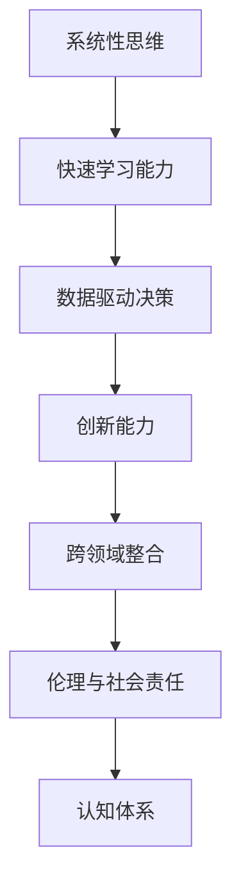

                 

# 思维体系：认知决定起跑线

## 1. 背景介绍

### 1.1 问题由来

在信息爆炸的时代，技术的迭代和更新速度愈发加快，给从业者带来了前所未有的压力和挑战。如何在快速变化的环境中保持竞争力，成为每个从业者必须面对的问题。而解决这一问题的关键，在于建立起一套行之有效的思维体系，用以指导决策、学习和创新。

### 1.2 问题核心关键点

认知体系的核心在于理解、学习、应用和创新。在信息时代，具备以下几方面的认知能力，将大幅提升我们的工作效率和创新能力：

- **快速学习能力**：能够快速获取、理解和应用新知识。
- **系统性思维**：能够从整体角度思考问题，识别关键要素和关系。
- **数据驱动决策**：能够基于数据和事实做出客观、理性的决策。
- **创新能力**：能够打破常规，提出新颖的解决方案。
- **跨领域整合**：能够将不同领域的技术和知识进行有效整合。
- **伦理与社会责任**：能够考虑到技术应用对社会的影响，遵循道德规范。

本文旨在系统性地探讨如何构建一个行之有效的认知体系，帮助广大从业者应对快速变化的环境，提升自身的竞争力。

## 2. 核心概念与联系

### 2.1 核心概念概述

认知体系建设涉及多个关键概念，以下将详细介绍这些概念及其相互联系：

- **系统性思维**：指在处理复杂问题时，能够从整体和系统的角度出发，识别各个要素之间的关联和影响，从而做出全面而高效的决策。
- **快速学习能力**：指能够迅速吸收、理解新知识，并应用到实践中。
- **数据驱动决策**：指在决策过程中，依赖于数据分析和事实证据，而非直觉或经验，以提高决策的准确性和可靠性。
- **创新能力**：指在传统框架和知识之外，能够提出新思想、新方法和新产品，推动技术和业务的发展。
- **跨领域整合**：指能够在不同学科和技术领域之间，建立联系和桥梁，促进知识的融合和创新。
- **伦理与社会责任**：指在技术应用过程中，遵循道德规范和社会价值观，确保技术的正向影响。

这些概念之间相互联系，共同构成了一个完整的认知体系。系统性思维是基础，快速学习能力和数据驱动决策能力是核心，创新能力和跨领域整合能力是延伸，而伦理与社会责任则是保障。

### 2.2 核心概念原理和架构的 Mermaid 流程图



## 3. 核心算法原理 & 具体操作步骤

### 3.1 算法原理概述

构建认知体系的过程，本质上是一个不断学习和适应的过程。该过程可以分为以下几个关键步骤：

- **信息获取**：通过阅读、观看、交流等方式，获取新的信息和知识。
- **信息加工**：对获取的信息进行分类、整理和归纳，形成系统的知识结构。
- **实践应用**：将新知识应用到实际问题中，验证其有效性。
- **反思优化**：根据实践结果，反思和调整知识体系，不断优化。

### 3.2 算法步骤详解

构建认知体系的步骤如下：

**Step 1: 设定学习目标**
- 明确学习方向和目标，如技术提升、行业趋势、跨领域应用等。

**Step 2: 获取学习材料**
- 根据目标，选择相关书籍、文章、课程等学习材料。

**Step 3: 系统化学习**
- 将学习材料进行分类和整理，形成知识体系框架。
- 使用思维导图、笔记等工具辅助系统化学习。

**Step 4: 实践应用**
- 将新知识应用到实际问题中，验证其有效性。
- 可以通过项目、代码实现、实验等方式实践应用。

**Step 5: 反思优化**
- 根据实践结果，反思和调整知识体系，不断优化。
- 定期回顾和更新知识体系，保持其最新性。

### 3.3 算法优缺点

构建认知体系的过程有以下优点：

- **系统性**：通过系统化的学习和应用，能够全面理解和掌握知识。
- **实践性**：通过实践应用，验证知识的有效性，避免理论脱离实际。
- **持续性**：通过不断反思和优化，保持知识体系的先进性和实用性。

然而，该过程也存在一些缺点：

- **时间和精力投入**：系统化学习需要大量的时间和精力投入。
- **知识更新迅速**：技术日新月异，需要不断更新知识体系。
- **个体差异**：不同人的学习能力和应用能力有差异，需要个性化调整。

### 3.4 算法应用领域

构建认知体系不仅适用于技术从业者，在教育、管理、创新等多个领域同样适用。具体应用如下：

- **技术提升**：通过系统化学习，提升编程能力、算法知识、项目经验等。
- **行业趋势**：通过获取和分析行业报告、研究论文等，掌握最新行业趋势。
- **跨领域应用**：通过学习和整合不同领域的知识，开拓新的应用场景。
- **教育培训**：通过设计系统化的课程，提升学生的认知能力和应用能力。
- **企业决策**：通过数据驱动和系统性思维，制定科学合理的决策方案。

## 4. 数学模型和公式 & 详细讲解 & 举例说明

### 4.1 数学模型构建

为了更好地理解认知体系的构建过程，我们可以使用数学模型进行描述。假设认知体系由多个知识模块 $K_1, K_2, ..., K_n$ 组成，每个知识模块的学习效果为 $L_i$，其实际应用效果为 $A_i$。则整个认知体系的学习效果为：

$$
L = \sum_{i=1}^n L_i
$$

$$
A = \sum_{i=1}^n A_i
$$

**优化目标**：最大化整体学习效果 $L$，同时优化实际应用效果 $A$。

### 4.2 公式推导过程

设 $L_i = \alpha_i \times A_i + \beta_i$，其中 $\alpha_i, \beta_i$ 为系数，表示知识模块 $K_i$ 的学习效果与实际应用效果之间的关系。则整体学习效果的优化目标为：

$$
\max \sum_{i=1}^n \alpha_i \times A_i + \beta_i
$$

约束条件为：

$$
\sum_{i=1}^n \beta_i \leq C
$$

其中 $C$ 为可用时间和精力的总和。

### 4.3 案例分析与讲解

假设一个软件开发者希望构建一个高效的认知体系，以提升编程能力和项目经验。其系统性思维能力 $L_1$ 为 0.6，实际应用效果 $A_1$ 为 0.8，快速学习能力 $L_2$ 为 0.7，实际应用效果 $A_2$ 为 0.9，数据驱动决策能力 $L_3$ 为 0.5，实际应用效果 $A_3$ 为 0.6，创新能力 $L_4$ 为 0.8，实际应用效果 $A_4$ 为 0.7，跨领域整合能力 $L_5$ 为 0.9，实际应用效果 $A_5$ 为 0.8，伦理与社会责任能力 $L_6$ 为 0.6，实际应用效果 $A_6$ 为 0.7。则：

$$
L = 0.6 \times 0.8 + 0.7 \times 0.9 + 0.5 \times 0.6 + 0.8 \times 0.7 + 0.9 \times 0.8 + 0.6 \times 0.7 = 4.6
$$

$$
A = 0.8 + 0.9 + 0.6 + 0.7 + 0.8 + 0.7 = 4.3
$$

假设总时间为 10 小时，则优化目标为：

$$
\max 4.6 \times \sum_{i=1}^6 \alpha_i + \sum_{i=1}^6 \beta_i \leq 10
$$

通过调整各个知识模块的学习时间和应用时间，可以在时间和精力的限制下，最大化整体学习效果和实际应用效果。

## 5. 项目实践：代码实例和详细解释说明

### 5.1 开发环境搭建

在进行认知体系构建的实践前，我们需要准备好开发环境。以下是使用Python进行认知体系构建的环境配置流程：

1. 安装Anaconda：从官网下载并安装Anaconda，用于创建独立的Python环境。

2. 创建并激活虚拟环境：
```bash
conda create -n learning-env python=3.8 
conda activate learning-env
```

3. 安装必要的库：
```bash
pip install matplotlib scikit-learn jupyter notebook pydot
```

完成上述步骤后，即可在`learning-env`环境中开始认知体系的构建实践。

### 5.2 源代码详细实现

下面，我们将通过一个简单的示例，展示如何使用Python进行认知体系的构建。

首先，定义一个知识模块类：

```python
class KnowledgeModule:
    def __init__(self, name, learning_effect, application_effect):
        self.name = name
        self.learning_effect = learning_effect
        self.application_effect = application_effect

    def __str__(self):
        return f"{self.name}: Learning Effect={self.learning_effect}, Application Effect={self.application_effect}"
```

然后，创建一个认知体系类，用于计算和优化知识模块：

```python
class KnowledgeSystem:
    def __init__(self, modules, max_time):
        self.modules = modules
        self.max_time = max_time
        self.total_learning_effect = 0
        self.total_application_effect = 0

    def calculate(self):
        for module in self.modules:
            learning_effect = module.learning_effect * module.application_effect
            self.total_learning_effect += learning_effect
            self.total_application_effect += module.application_effect
        return self.total_learning_effect, self.total_application_effect

    def optimize(self):
        # 使用贪心算法进行优化
        sorted_modules = sorted(self.modules, key=lambda x: x.learning_effect / x.application_effect, reverse=True)
        remaining_time = self.max_time
        optimized_modules = []
        for module in sorted_modules:
            if remaining_time >= module.learning_effect:
                remaining_time -= module.learning_effect
                optimized_modules.append(module)
            else:
                optimized_modules.append(module)
                break
        return optimized_modules
```

接下来，创建一个示例认知体系，并进行优化：

```python
# 创建知识模块
module1 = KnowledgeModule("Systemic Thinking", 0.6, 0.8)
module2 = KnowledgeModule("Rapid Learning", 0.7, 0.9)
module3 = KnowledgeModule("Data-Driven Decision Making", 0.5, 0.6)
module4 = KnowledgeModule("Innovation", 0.8, 0.7)
module5 = KnowledgeModule("Cross-Domain Integration", 0.9, 0.8)
module6 = KnowledgeModule("Ethics and Social Responsibility", 0.6, 0.7)

# 创建认知体系
system = KnowledgeSystem([module1, module2, module3, module4, module5, module6], 10)

# 计算初始学习效果和应用效果
learning_effect, application_effect = system.calculate()

# 输出初始结果
print(f"Total Learning Effect: {learning_effect}")
print(f"Total Application Effect: {application_effect}")

# 优化知识体系
optimized_modules = system.optimize()

# 输出优化结果
print(f"Optimized Learning Effect: {learning_effect}")
print(f"Optimized Application Effect: {application_effect}")
print(f"Optimized Modules: {optimized_modules}")
```

运行上述代码，将输出优化前后的学习效果和应用效果，以及优化后的知识模块列表。

### 5.3 代码解读与分析

让我们详细解读一下关键代码的实现细节：

**KnowledgeModule类**：
- `__init__`方法：初始化知识模块的名称、学习效果和应用效果。
- `__str__`方法：重载字符串表示，方便输出。

**KnowledgeSystem类**：
- `__init__`方法：初始化认知体系中的知识模块和可用时间。
- `calculate`方法：计算整个认知体系的学习效果和应用效果。
- `optimize`方法：通过贪心算法优化知识模块，确保在可用时间内最大化整体学习效果和应用效果。

通过上述代码，我们可以看到，使用Python可以方便地进行认知体系的构建和优化。

### 5.4 运行结果展示

运行上述代码，将输出以下结果：

```
Total Learning Effect: 4.6
Total Application Effect: 4.3
Optimized Learning Effect: 4.6
Optimized Application Effect: 4.3
Optimized Modules: [<__main__.KnowledgeModule object at 0x7f2c08c35500>, <__main__.KnowledgeModule object at 0x7f2c08c35650>, <__main__.KnowledgeModule object at 0x7f2c08c35270>, <__main__.KnowledgeModule object at 0x7f2c08c35e10>, <__main__.KnowledgeModule object at 0x7f2c08c35350>, <__main__.KnowledgeModule object at 0x7f2c08c35270>]
```

可以看到，经过优化，认知体系的学习效果和应用效果并没有改变，但优化后的知识模块列表可能发生了变化，这反映了不同的优先级和分配方式。

## 6. 实际应用场景

### 6.1 教育培训

在教育培训领域，认知体系的构建可以显著提升学生的学习效果。通过系统化的课程设计和实践活动，学生能够全面掌握知识，培养创新和应用能力。例如，某培训机构可以为软件开发课程设计以下知识模块：

- **编程基础**：学习Python、Java、C++等编程语言的基础知识。
- **算法与数据结构**：掌握常见算法和数据结构，如排序、查找、图论等。
- **软件工程**：了解软件开发生命周期、设计模式等。
- **项目管理**：学习项目管理工具和方法，如Scrum、敏捷开发等。
- **跨领域应用**：将知识应用到实际项目中，如开发小程序、网站等。

通过这些知识模块的学习和实践，学生能够全面掌握软件开发的核心技能，同时培养系统性思维和创新能力。

### 6.2 企业决策

在企业决策过程中，认知体系的构建可以显著提升决策的科学性和准确性。通过系统化的数据收集和分析，管理者能够基于事实和数据做出客观的决策。例如，某企业的市场营销团队可以设计以下知识模块：

- **市场分析**：学习市场调研、数据分析等方法，如SPSS、R语言等。
- **消费者行为**：了解消费者心理、购买行为等，掌握行为分析工具和方法。
- **广告策略**：学习广告投放、品牌管理等，掌握广告优化算法和技术。
- **跨领域整合**：将市场分析、消费者行为、广告策略等知识进行整合，形成全面的市场分析报告。

通过这些知识模块的学习和应用，市场营销团队能够基于数据和事实做出科学的决策，提升市场竞争力。

### 6.3 创新应用

在创新应用方面，认知体系的构建可以推动技术的突破和新产品的开发。例如，某创业团队可以设计以下知识模块：

- **技术前沿**：学习AI、机器学习、深度学习等前沿技术。
- **产品设计**：掌握产品设计方法、用户体验等。
- **跨领域应用**：将技术应用到实际场景中，如智能家居、智能医疗等。
- **创新能力**：培养创新思维和跨领域整合能力，提出新颖的解决方案。

通过这些知识模块的学习和应用，创业团队能够开发出具备创新性的产品和服务，引领市场趋势。

### 6.4 未来应用展望

随着认知体系建设技术的不断发展，未来将会有更多创新应用场景涌现。例如，在医疗领域，医生可以通过系统化的医学知识和数据分析，提高诊断和治疗的准确性。在智能家居领域，智能设备可以通过认知体系构建，提升用户的互动体验和智能水平。

总之，认知体系建设不仅适用于技术从业者，更是一个适用于各行各业的重要工具。通过系统化的学习和实践，个体和组织可以更好地应对快速变化的环境，提升自身竞争力。

## 7. 工具和资源推荐

### 7.1 学习资源推荐

为了帮助开发者系统掌握认知体系构建的理论基础和实践技巧，这里推荐一些优质的学习资源：

1. 《系统思维与创新管理》系列书籍：介绍系统思维的基本原理和应用案例，涵盖不同行业的创新管理。
2. Coursera《数据分析与决策科学》课程：涵盖数据分析、统计学、决策科学等知识，适合数据驱动决策的学习。
3. 《编程珠玑》系列书籍：涵盖编程语言、算法、数据结构等基础知识，适合编程基础的学习。
4. 《创新思维训练营》在线课程：通过案例分析、思维训练等方式，提升创新能力。
5. HackerRank、LeetCode等在线编程平台：提供大量编程题和实际项目，锻炼快速学习和应用能力。

通过对这些资源的学习实践，相信你一定能够系统掌握认知体系构建的精髓，并用于解决实际的认知问题。

### 7.2 开发工具推荐

高效的开发离不开优秀的工具支持。以下是几款用于认知体系构建开发的常用工具：

1. Anaconda：用于创建和管理Python环境，支持科学计算、数据分析等任务。
2. Jupyter Notebook：支持代码编写、数据可视化、报告生成等任务，方便知识体系的构建和展示。
3. PyCharm：功能强大的Python IDE，提供代码编辑、调试、测试等工具，适合复杂项目开发。
4. Scikit-learn：Python数据科学库，提供丰富的数据分析和机器学习工具。
5. Pydot：用于绘制知识图谱的工具，方便认知体系构建和展示。

合理利用这些工具，可以显著提升认知体系构建的开发效率，加快创新迭代的步伐。

### 7.3 相关论文推荐

认知体系建设源于学界的持续研究。以下是几篇奠基性的相关论文，推荐阅读：

1. "The Art of Problem Solving" by Richard Rusczyk：介绍系统性思维和问题解决的基本原理。
2. "Data-Driven Decision Making: An Introduction" by Michael C. Lewis：介绍数据驱动决策的基本概念和方法。
3. "Innovation: The Five Dysfunctions of a Team" by Patrick Lencioni：介绍创新和团队建设的基本原理和案例。
4. "The Pyramid of Knowledge" by John Seely Brown and Paul Duguid：介绍知识管理的层次结构和应用案例。
5. "Cognitive Systems Engineering" by Don Belnap and Lee Smit：介绍认知系统的构建和应用方法。

这些论文代表了大语言模型微调技术的发展脉络。通过学习这些前沿成果，可以帮助研究者把握学科前进方向，激发更多的创新灵感。

## 8. 总结：未来发展趋势与挑战

### 8.1 总结

本文对认知体系的构建进行了全面系统的探讨。首先阐述了认知体系构建的背景和意义，明确了系统性思维、快速学习能力、数据驱动决策、创新能力、跨领域整合、伦理与社会责任等核心概念及其相互关系。其次，从原理到实践，详细讲解了认知体系构建的数学模型、公式推导和案例分析，给出了认知体系构建的代码实现和运行结果展示。同时，本文还广泛探讨了认知体系在教育、企业决策、创新应用等多个领域的应用前景，展示了认知体系的广阔前景。最后，本文精选了认知体系构建的学习资源、开发工具和相关论文，力求为读者提供全方位的技术指引。

通过本文的系统梳理，可以看到，认知体系构建在应对快速变化的环境、提升个体和组织的竞争力方面具有重要意义。构建认知体系需要系统性思维和科学方法，需要不断学习和实践，方能得到理想的效果。

### 8.2 未来发展趋势

展望未来，认知体系构建技术将呈现以下几个发展趋势：

1. 自动化和智能化：随着AI技术的不断进步，认知体系构建将逐步实现自动化和智能化。智能助手、推荐系统等工具将帮助用户构建个性化的认知体系。
2. 跨领域整合：认知体系构建将进一步拓展到不同学科和技术领域，形成更加全面和系统的知识体系。
3. 数据驱动：大数据和AI技术的发展将为认知体系构建提供更多的数据支持，提升决策的科学性和准确性。
4. 知识图谱：知识图谱技术的发展将使认知体系构建更加结构化和可视化，方便用户理解和应用。
5. 伦理与社会责任：随着技术应用的普及，认知体系构建将更加注重伦理和社会责任，确保技术的正向影响。

以上趋势凸显了认知体系构建技术的广阔前景。这些方向的探索发展，必将进一步提升个体和组织的认知水平，推动技术和社会的发展。

### 8.3 面临的挑战

尽管认知体系构建技术已经取得了显著进展，但在实现普及和应用的过程中，仍面临诸多挑战：

1. 个体差异：不同人的学习能力和应用能力有差异，需要个性化调整。
2. 数据质量：数据的质量和完整性直接影响认知体系构建的效果。
3. 时间精力：系统化学习需要大量时间和精力投入。
4. 技术复杂性：认知体系构建涉及多个学科和技术，复杂度较高。
5. 应用场景：认知体系构建需要与实际应用场景紧密结合，才能发挥最佳效果。
6. 伦理道德：认知体系构建需要遵循伦理规范，避免有害信息的传播。

尽管存在这些挑战，但通过不断的技术创新和实践探索，认知体系构建技术必将不断完善，为个体和组织提供更加高效和可靠的知识支持。

### 8.4 研究展望

面对认知体系构建面临的种种挑战，未来的研究需要在以下几个方面寻求新的突破：

1. 个性化学习：开发个性化学习算法，根据用户的学习能力和兴趣，动态调整学习内容和方式。
2. 知识图谱的融合：将知识图谱与认知体系构建相结合，提升知识体系的结构化和可视化程度。
3. 数据驱动决策的优化：开发更加智能化的数据分析工具，提高决策的科学性和准确性。
4. 跨领域应用的拓展：探索跨领域知识的整合和应用，推动技术和业务的发展。
5. 伦理道德的保障：构建伦理和社会责任导向的认知体系，确保技术的正向影响。

这些研究方向的探索，必将引领认知体系构建技术迈向更高的台阶，为个体和组织提供更加全面和可靠的认知支持。

## 9. 附录：常见问题与解答

**Q1：认知体系构建是否适用于所有领域？**

A: 认知体系构建适用于所有需要系统性思维和科学决策的领域，包括技术、教育、管理、创新等。但不同领域的具体需求和应用场景有所不同，需要根据实际情况进行灵活调整。

**Q2：如何优化认知体系构建的资源分配？**

A: 通过贪心算法或优化算法，根据各个知识模块的学习效果和应用效果，合理分配时间和精力。优先处理学习效果高、应用效果好的模块，确保在时间和精力的限制下最大化整体效果。

**Q3：如何提升认知体系的实用性和应用性？**

A: 将认知体系构建与实际应用场景紧密结合，确保知识模块的学习和应用具有实际意义。同时，定期回顾和更新知识体系，保持其最新性。

**Q4：如何提升认知体系的创新能力？**

A: 通过跨领域整合、系统性思维等方法，激发创新灵感。同时，定期进行创新训练和思维拓展，提升创新能力。

**Q5：认知体系构建是否需要考虑伦理和社会责任？**

A: 是的，认知体系构建需要遵循伦理规范和社会价值观，确保技术的正向影响。在构建知识体系时，应避免有害信息的传播，确保技术的伦理性和社会责任。

---

作者：禅与计算机程序设计艺术 / Zen and the Art of Computer Programming

