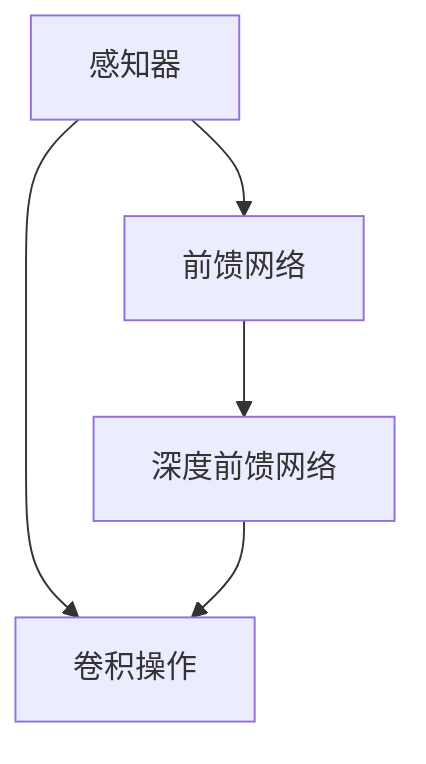

                 

# 感知器到卷积神经网络（CNN）

> 关键词：感知器,卷积神经网络,神经网络,深度学习,前馈网络,卷积操作,池化操作,特征提取,图像处理,计算机视觉

## 1. 背景介绍

### 1.1 问题由来
在深度学习的早期，研究者们探索了多种不同架构的神经网络，以期构建能够有效处理复杂数据的模型。其中，感知器（Perceptron）和卷积神经网络（Convolutional Neural Network, CNN）是两个代表性模型，分别在分类和图像处理领域取得了重要进展。本章节将回顾感知器的历史与局限，探讨卷积神经网络的起源与发展，揭示它们之间的联系与区别。

### 1.2 问题核心关键点
- **感知器与神经元**：了解感知器的基本原理，以及神经元如何计算并输出信号。
- **卷积操作与神经网络**：理解卷积操作的物理意义，以及它在神经网络中的作用。
- **前馈网络与卷积神经网络**：比较前馈网络与卷积神经网络的区别，以及它们在图像处理中的具体应用。
- **深度学习与现代CNN**：回顾深度学习的发展历程，以及卷积神经网络如何成为图像处理领域的主流模型。

## 2. 核心概念与联系

### 2.1 核心概念概述

为了深入理解从感知器到卷积神经网络的演变过程，本节将介绍几个关键概念：

- **感知器（Perceptron）**：最早的神经网络模型，由神经元（Neuron）组成，用于二分类问题。每个神经元接收输入，通过加权和、激活函数计算输出，进而决定最终分类。
- **前馈网络（Feedforward Network）**：神经网络的一种架构形式，信号从前向后传递，不循环连接。深度前馈网络（Deep Feedforward Network）包含多层的神经元，能够处理更复杂的非线性问题。
- **卷积神经网络（Convolutional Neural Network, CNN）**：一种特殊的前馈网络，通过卷积层和池化层提取局部特征，进行图像、语音等信号的处理。
- **深度学习（Deep Learning）**：基于多层次的非线性模型，利用大量数据训练，以实现复杂的模式识别和预测任务。

这些概念之间的逻辑关系可以通过以下Mermaid流程图来展示：



### 2.2 核心概念原理和架构的 Mermaid 流程图

感知器是神经网络的起点，通过简单的线性组合与激活函数计算输出。卷积神经网络则在前馈网络的基础上，增加了卷积层和池化层，用于提取图像数据的局部特征。以下是一个简单的感知器模型和卷积神经网络模型的示意图：

```mermaid
graph TB
    A[感知器] -->|连接| B[输入] -->|权重| C[加权和] -->|激活| D[输出]
    
    graph LR
    A[卷积神经网络] -->|卷积| B[输入] -->|卷积核| C[卷积层] -->|激活| D[下一层]
    A -->|池化| E[池化层]
    A -->|全连接| F[全连接层]
```

## 3. 核心算法原理 & 具体操作步骤

### 3.1 算法原理概述

感知器是最早的神经网络模型，由神经元组成，用于解决二分类问题。神经元接收输入信号，通过加权和与激活函数计算输出，进而决定最终分类。卷积神经网络则在前馈网络的基础上，通过卷积操作和池化操作提取图像数据的局部特征，进而进行分类、检测等任务。

### 3.2 算法步骤详解

**感知器的工作原理**：
1. **输入信号**：感知器接收输入数据，每个输入与一个权重相乘，权重表示特征的重要性。
2. **加权和**：所有输入的加权和传递给激活函数。
3. **激活函数**：激活函数将加权和转换为输出，常见激活函数包括sigmoid和ReLU。
4. **输出**：输出为1表示正类，输出为0表示负类。

**卷积神经网络的基本组成**：
1. **卷积层**：卷积操作通过卷积核（Filter）在输入数据上滑动，提取特征。
2. **激活层**：通过激活函数引入非线性变换，提高模型的表达能力。
3. **池化层**：通过池化操作降低特征维度，减少计算量，避免过拟合。
4. **全连接层**：将池化层输出的特征图展开为向量，进行分类预测。

**卷积操作的数学表达**：
设输入数据为 $X \in \mathbb{R}^{n \times n \times c}$，卷积核为 $K \in \mathbb{R}^{h \times w \times c}$，输出特征图为 $Y \in \mathbb{R}^{(n-h+1) \times (n-w+1) \times c'}$，卷积操作的数学公式为：

$$
Y_{i,j,k} = \sum_{m=0}^{h-1}\sum_{n=0}^{w-1}\sum_{c=0}^{c-1}K_{m,n,c} \cdot X_{i+m,j+n,c}
$$

其中，$h$ 和 $w$ 为卷积核的宽度和高度，$c$ 为输入通道数，$c'$ 为输出通道数。

**池化操作的数学表达**：
常见的池化操作包括最大池化和平均池化。以最大池化为例，设输入特征图为 $X \in \mathbb{R}^{n \times n \times c'}$，池化窗口大小为 $h \times w$，步长为 $s$，池化操作的数学公式为：

$$
Y_{i,j,k} = \max_{r=(i-s)..(i+s),c=(j-s)..(j+s)} X_{r,c,k}
$$

其中，$i$ 和 $j$ 为池化窗口的中心位置。

### 3.3 算法优缺点

**感知器的优点与缺点**：
- **优点**：简单直观，易于实现和理解，用于二分类问题效果显著。
- **缺点**：处理非线性关系能力有限，难以处理复杂的模式。

**卷积神经网络的优点与缺点**：
- **优点**：能够自动提取图像数据的空间局部特征，适用于图像分类、目标检测等任务。通过堆叠多个卷积层和池化层，可以处理高维数据。
- **缺点**：需要大量训练数据，网络结构设计复杂，容易过拟合。

### 3.4 算法应用领域

卷积神经网络在计算机视觉领域表现尤为突出，被广泛应用于图像分类、目标检测、图像分割、人脸识别、自动驾驶等任务。感知器则因其简单性和高效性，主要用于二分类问题和数据量较小的情况。

## 4. 数学模型和公式 & 详细讲解 & 举例说明

### 4.1 数学模型构建

卷积神经网络的数学模型可以表示为：

$$
Y = A(\max_{k=1}^{C}(X \ast K_k))
$$

其中，$A$ 为激活函数，$K_k$ 为第 $k$ 个卷积核，$C$ 为卷积核的个数。

### 4.2 公式推导过程

卷积神经网络通过多个卷积层和池化层逐步提取图像数据的特征。设输入数据为 $X \in \mathbb{R}^{n \times n \times c'}$，第一层卷积核为 $K_1 \in \mathbb{R}^{h \times w \times c'}$，输出特征图为 $Y_1 \in \mathbb{R}^{(n-h+1) \times (n-w+1) \times c}$，第二层卷积核为 $K_2 \in \mathbb{R}^{h \times w \times c}$，输出特征图为 $Y_2 \in \mathbb{R}^{(n-h+1) \times (n-w+1) \times c'}$。根据卷积操作的数学公式，可以得到：

$$
Y_1 = X \ast K_1
$$

$$
Y_2 = A(Y_1 \ast K_2)
$$

重复以上步骤，直到得到最终的输出特征图 $Y$。

### 4.3 案例分析与讲解

以LeNet-5网络为例，该网络由卷积层、池化层、全连接层组成，用于手写数字识别。网络结构如图：

```
Input
|
|--(5x5x1)- Convolution --( Max Pooling --( Softmax)
|           |                     |
|           |----------------- Sigmoid
|           |                     |
|           |----------------- Fully Connected
```

在LeNet-5中，输入图像大小为 $28 \times 28$，经过两个卷积层和两个池化层后，输出特征图的尺寸为 $5 \times 5 \times 120$。最后通过全连接层将特征图展平，进行分类预测。

## 5. 项目实践：代码实例和详细解释说明

### 5.1 开发环境搭建

在进行卷积神经网络实践前，我们需要准备好开发环境。以下是使用Python和PyTorch进行CNN开发的环境配置流程：

1. 安装Anaconda：从官网下载并安装Anaconda，用于创建独立的Python环境。

2. 创建并激活虚拟环境：
```bash
conda create -n cnn-env python=3.8 
conda activate cnn-env
```

3. 安装PyTorch：根据CUDA版本，从官网获取对应的安装命令。例如：
```bash
conda install pytorch torchvision torchaudio cudatoolkit=11.1 -c pytorch -c conda-forge
```

4. 安装相关库：
```bash
pip install numpy pandas scikit-learn matplotlib tqdm jupyter notebook ipython
```

完成上述步骤后，即可在`cnn-env`环境中开始CNN的实践。

### 5.2 源代码详细实现

下面我们以手写数字识别任务为例，给出使用PyTorch实现CNN的代码。

```python
import torch
import torch.nn as nn
import torch.optim as optim
import torchvision.transforms as transforms
import torchvision.datasets as datasets
from torch.utils.data import DataLoader

# 定义网络结构
class CNN(nn.Module):
    def __init__(self):
        super(CNN, self).__init__()
        self.conv1 = nn.Conv2d(1, 10, kernel_size=5)
        self.conv2 = nn.Conv2d(10, 20, kernel_size=5)
        self.fc1 = nn.Linear(20*4*4, 500)
        self.fc2 = nn.Linear(500, 10)
        self.relu = nn.ReLU()

    def forward(self, x):
        x = self.relu(self.conv1(x))
        x = nn.MaxPool2d(2)(x)
        x = self.relu(self.conv2(x))
        x = nn.MaxPool2d(2)(x)
        x = x.view(-1, 20*4*4)
        x = self.relu(self.fc1(x))
        x = self.fc2(x)
        return x

# 定义训练函数
def train(model, train_loader, criterion, optimizer, device):
    model.train()
    for i, (images, labels) in enumerate(train_loader):
        images, labels = images.to(device), labels.to(device)
        optimizer.zero_grad()
        outputs = model(images)
        loss = criterion(outputs, labels)
        loss.backward()
        optimizer.step()
        if (i+1) % 100 == 0:
            print(f"Epoch {epoch+1}, batch {i+1}, loss: {loss.item():.4f}")

# 定义测试函数
def test(model, test_loader, criterion, device):
    model.eval()
    with torch.no_grad():
        correct = 0
        total = 0
        for images, labels in test_loader:
            images, labels = images.to(device), labels.to(device)
            outputs = model(images)
            _, predicted = torch.max(outputs.data, 1)
            total += labels.size(0)
            correct += (predicted == labels).sum().item()
        accuracy = 100 * correct / total
        print(f"Accuracy: {accuracy:.2f}%")
```

### 5.3 代码解读与分析

让我们再详细解读一下关键代码的实现细节：

**CNN网络定义**：
- `__init__`方法：定义网络的结构，包括两个卷积层、两个池化层、两个全连接层，以及激活函数Relu。
- `forward`方法：定义前向传播的流程，即通过卷积、池化和全连接层的组合，计算模型的输出。

**训练函数定义**：
- 使用PyTorch的DataLoader对训练集进行批量化加载，供模型训练使用。
- 在每个epoch内，对数据集进行迭代，对每个批次进行前向传播和反向传播，更新模型参数。
- 在每个epoch结束时，在验证集上评估模型性能，决定是否停止训练。

**测试函数定义**：
- 对测试集进行迭代，计算模型在测试集上的准确率，输出最终结果。

**训练流程**：
- 定义总的epoch数和batch size，开始循环迭代
- 每个epoch内，先在训练集上训练，输出平均loss
- 在验证集上评估，输出验证准确率
- 所有epoch结束后，在测试集上评估，输出最终测试准确率

可以看到，PyTorch配合Torchvision库使得CNN的代码实现变得简洁高效。开发者可以将更多精力放在网络结构的设计和优化上，而不必过多关注底层的实现细节。

当然，工业级的系统实现还需考虑更多因素，如模型的保存和部署、超参数的自动搜索、更灵活的任务适配层等。但核心的CNN范式基本与此类似。

## 6. 实际应用场景

### 6.1 智能图像识别

卷积神经网络在图像识别领域表现尤为出色，被广泛应用于图像分类、目标检测、人脸识别等任务。例如，在图像分类任务中，可以将大规模图像数据集分为训练集和测试集，对卷积神经网络进行训练，然后对测试集进行分类预测，最终评估模型的性能。

### 6.2 医疗影像诊断

在医疗影像诊断中，卷积神经网络同样能够发挥重要作用。通过训练模型识别不同类型的影像特征，可以用于病灶检测、肿瘤分类、图像分割等医疗任务。以乳腺癌诊断为例，使用卷积神经网络处理数字化的乳腺X光片，可以自动检测出疑似病灶区域，辅助医生进行诊断。

### 6.3 自动驾驶

在自动驾驶领域，卷积神经网络被用于图像处理和物体检测。例如，通过训练模型识别道路标志、车辆、行人等物体，可以进行自动驾驶和智能交通管理。在驾驶场景中，卷积神经网络可以快速响应环境变化，提高驾驶安全性。

### 6.4 未来应用展望

随着卷积神经网络的不断演进，未来将有望在更多领域得到广泛应用：

1. **医疗影像分析**：卷积神经网络能够自动分析医疗影像，辅助诊断和治疗。
2. **智能视频监控**：通过卷积神经网络对视频进行实时分析，实现人脸识别、行为监控等功能。
3. **虚拟现实**：在虚拟现实中，卷积神经网络可以用于图像处理、物体识别等任务，提升用户体验。
4. **增强现实**：卷积神经网络能够识别和跟踪现实世界中的物体，实现增强现实应用。

## 7. 工具和资源推荐

### 7.1 学习资源推荐

为了帮助开发者系统掌握卷积神经网络的理论基础和实践技巧，这里推荐一些优质的学习资源：

1. 《深度学习》一书：由Ian Goodfellow等人合著，全面介绍了深度学习的基本概念和常用算法，包括卷积神经网络。
2. CS231n《深度学习视觉识别》课程：斯坦福大学开设的计算机视觉课程，深入讲解卷积神经网络的原理和实现。
3. PyTorch官方文档：PyTorch的官方文档，提供了完整的卷积神经网络实现和代码示例，是学习的绝佳资源。
4. Weights & Biases：模型训练的实验跟踪工具，可以记录和可视化模型训练过程中的各项指标，方便对比和调优。

通过对这些资源的学习实践，相信你一定能够快速掌握卷积神经网络的技术要点，并用于解决实际的图像处理问题。

### 7.2 开发工具推荐

高效的开发离不开优秀的工具支持。以下是几款用于卷积神经网络开发的常用工具：

1. PyTorch：基于Python的开源深度学习框架，灵活动态的计算图，适合快速迭代研究。PyTorch提供了丰富的卷积神经网络实现和代码示例。
2. TensorFlow：由Google主导开发的开源深度学习框架，生产部署方便，适合大规模工程应用。TensorFlow提供了完整的卷积神经网络实现和优化器。
3. Keras：一个高级深度学习API，支持多种后端框架，包括TensorFlow和PyTorch，可以快速搭建卷积神经网络模型。

合理利用这些工具，可以显著提升卷积神经网络开发效率，加快创新迭代的步伐。

### 7.3 相关论文推荐

卷积神经网络的发展源于学界的持续研究。以下是几篇奠基性的相关论文，推荐阅读：

1. A General Framework for Multi-Layer Network Learning（多层次网络学习框架）：提出卷积神经网络的基本架构，奠定了卷积网络的研究基础。
2. ImageNet Classification with Deep Convolutional Neural Networks（利用深层卷积神经网络进行图像分类）：展示了大规模数据集ImageNet上的卷积神经网络应用，刷新了图像分类的SOTA。
3. GoogLeNet（Inception网络）：提出Inception模块，有效减少了计算量，提高了卷积神经网络的性能。
4. ResNet（残差网络）：提出残差连接，解决了深度网络训练中的梯度消失问题，进一步提高了卷积神经网络的深度。

这些论文代表了大卷积神经网络的发展脉络。通过学习这些前沿成果，可以帮助研究者把握学科前进方向，激发更多的创新灵感。

## 8. 总结：未来发展趋势与挑战

### 8.1 总结

本文对感知器到卷积神经网络的发展过程进行了详细阐述。从最早的感知器到如今广泛应用的卷积神经网络，神经网络的发展史展示了人类在探索复杂数据处理中的智慧。卷积神经网络凭借其高效的空间局部特征提取能力，在图像处理、目标检测等任务上取得了显著成果。然而，卷积神经网络仍然面临数据依赖、模型复杂、过拟合等挑战，需要在未来继续探索新的优化方法。

### 8.2 未来发展趋势

展望未来，卷积神经网络将呈现以下几个发展趋势：

1. **更深层次的卷积网络**：随着计算能力的提升，卷积神经网络的深度将进一步增加，用于更复杂的任务。
2. **多任务学习**：在训练卷积神经网络时，通过多任务学习，同时解决多个相关问题，提高模型性能。
3. **无监督学习和自监督学习**：通过无监督和自监督学习，利用非标注数据进行预训练，提升模型的泛化能力。
4. **端到端学习**：将数据获取、模型训练、推理预测等过程整合为端到端系统，实现更高效的自动化处理。
5. **联邦学习**：在分布式环境下，通过联邦学习技术，协同训练卷积神经网络，保护数据隐私。

以上趋势凸显了卷积神经网络的广阔前景。这些方向的探索发展，必将进一步提升卷积神经网络的性能和应用范围，为计算机视觉等领域带来新的突破。

### 8.3 面临的挑战

尽管卷积神经网络在图像处理领域表现优异，但在迈向更加智能化、普适化应用的过程中，它仍面临诸多挑战：

1. **数据依赖**：卷积神经网络需要大量标注数据进行训练，数据收集和标注成本高昂。
2. **模型复杂**：卷积神经网络模型结构复杂，训练和推理过程耗时较长。
3. **过拟合问题**：卷积神经网络在数据量不足的情况下容易出现过拟合，泛化能力不足。
4. **硬件资源要求高**：卷积神经网络需要强大的计算能力和内存支持，对硬件要求较高。

### 8.4 研究展望

面对卷积神经网络所面临的挑战，未来的研究需要在以下几个方面寻求新的突破：

1. **数据增强和数据生成**：通过数据增强和数据生成技术，丰富数据集，提高模型的泛化能力。
2. **模型压缩和加速**：研究模型压缩和加速技术，减少模型参数和计算量，提高推理效率。
3. **迁移学习和联邦学习**：通过迁移学习和联邦学习技术，利用分布式计算资源，提高模型性能和效率。
4. **模型自适应和自监督学习**：研究自适应和自监督学习方法，提高模型对新数据的适应能力。
5. **模型可解释性和鲁棒性**：研究模型可解释性和鲁棒性技术，提高模型的透明性和可靠性。

这些研究方向的探索，必将引领卷积神经网络技术迈向更高的台阶，为构建安全、可靠、可解释、可控的智能系统铺平道路。

## 9. 附录：常见问题与解答

**Q1：卷积神经网络是否适用于所有图像处理任务？**

A: 卷积神经网络在图像处理领域表现出色，但对于一些特殊领域的图像处理任务，如医学影像、遥感图像等，需要针对性地进行模型设计和数据处理。

**Q2：卷积神经网络中如何避免过拟合？**

A: 卷积神经网络中常用的避免过拟合的方法包括：数据增强、正则化、dropout、early stopping等。具体实施时需要根据数据集和模型情况进行合理选择。

**Q3：卷积神经网络是否适用于非图像数据？**

A: 卷积神经网络不仅适用于图像数据，在文本、语音等领域也有广泛应用。例如，通过卷积操作提取文本中的局部特征，进行情感分析、文本分类等任务。

**Q4：卷积神经网络在推理时是否需要GPU支持？**

A: 卷积神经网络在推理时，尤其是对于较大的网络，确实需要GPU支持，以加速计算过程。但对于一些简单的卷积神经网络，可以使用CPU进行推理。

**Q5：卷积神经网络的训练过程是否需要大量数据？**

A: 是的，卷积神经网络的训练过程需要大量数据支持。数据量越大，模型的泛化能力越强。在数据量有限的情况下，可以通过迁移学习、数据增强等方法提高模型性能。

总之，卷积神经网络在图像处理领域的应用已经非常成熟，但在更多领域的应用仍然需要不断探索和优化。通过研究者的不懈努力，卷积神经网络必将带来更多创新，推动人工智能技术的不断进步。

