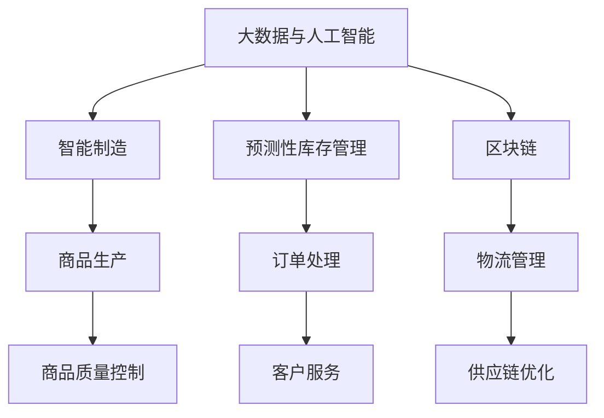

                 

## 1. 背景介绍

随着电子商务平台的快速崛起，商品品类的大幅丰富已经成为了各大电商平台竞争的重要战略之一。为了满足消费者日益增长且多元化的需求，平台商家不仅要增加商品种类，还需确保商品的质量和品质。如何通过技术手段，在短时间内迅速扩大商品品类供给，同时保持商品质量，已成为电商平台亟需解决的问题。

### 1.1 问题由来

在过去，商品品类供给的扩大主要依赖人工方式，需要大量的人力物力，周期长、效率低。尤其在处理复杂多样、高质量的商品时，人工方式显得尤为困难。而通过技术手段，可以有效降低成本、提高效率，满足用户需求。

当前，一些电商平台已经在商品供给上取得了不错的成效，主要方法包括但不限于以下几种：

- **外部采购**：从供应商处批量采购，再通过物流系统配送至仓库。这种方式简单易行，但无法保证商品多样性及供货速度。
- **自主生产**：自建生产线生产商品，但需要前期大量投资，且生产周期较长。
- **第三方代工**：委托第三方代工，这种模式虽然灵活性高，但代工质量参差不齐，且代工费用较高。
- **智能制造**：通过人工智能、机器学习等技术进行商品制造，可以实现高效率、高质量的生产。

### 1.2 问题核心关键点

本节将深入探讨扩大品类商品的供给数量的关键问题。

#### 1.2.1 商品多样性与供应链管理

商品的多样性是电商平台的重要竞争点，商品多样性越丰富，对消费者越有吸引力。然而，商品多样性往往与供应链的复杂度成正比，需要在保证多样性的同时，有效管理供应链，避免库存积压、缺货等问题。

#### 1.2.2 商品质量控制与客户满意度

商品质量控制是电商平台维护用户满意度的重要环节。商品质量的波动会直接影响用户的购买决策和平台信誉。电商平台需对商品质量进行严格把控，保证商品的一致性和安全性。

#### 1.2.3 订单处理与物流效率

电商平台需高效处理大量订单，并通过物流系统将商品快速送达。订单处理与物流效率直接关系到用户体验和平台运营成本。

#### 1.2.4 数据驱动的决策支持

大数据与人工智能技术的应用，可以更好地洞察用户需求和市场趋势，辅助决策者做出更加科学的经营决策。

## 2. 核心概念与联系

### 2.1 核心概念概述

为更好地理解扩大品类商品供给数量的技术方法，本节将介绍几个关键概念：

- **大数据与人工智能**：通过收集和分析大规模数据，利用机器学习算法进行预测和决策，实现商品品类供给的优化。
- **智能制造**：利用人工智能技术进行商品生产过程的自动化与优化，实现高效率、高质量的制造。
- **区块链**：通过分布式账本技术，实现商品生产、物流、销售等环节的可追溯性与透明化，保证供应链的安全与可靠。
- **预测性库存管理**：利用历史数据和算法模型，预测商品需求量，优化库存水平，减少库存成本。

### 2.2 核心概念原理和架构的 Mermaid 流程图



## 3. 核心算法原理 & 具体操作步骤

### 3.1 算法原理概述

本节将详细讲解扩大品类商品供给数量的核心算法原理。

#### 3.1.1 数据收集与预处理

数据收集是商品品类供给数量优化的基础。平台需收集多维度数据，包括但不限于：

- **商品销售数据**：记录商品的销量、价格、库存等。
- **用户行为数据**：分析用户的浏览、点击、购买等行为。
- **市场数据**：分析宏观市场趋势、竞争对手动态等。
- **供应链数据**：记录供应商信息、物流情况等。

数据预处理包括清洗、去重、标准化等步骤，确保数据质量，为后续算法应用提供可靠基础。

#### 3.1.2 商品多样性优化算法

商品多样性优化算法主要包括聚类分析和推荐算法。通过聚类分析，将相似的商品归为一类，确保每类商品的多样性。推荐算法则根据用户行为和偏好，推荐不同类别的商品，增加用户购买的可能性。

#### 3.1.3 供应链优化算法

供应链优化算法主要应用于库存管理和订单处理。通过预测性库存管理，根据历史数据和用户行为预测商品需求量，优化库存水平。订单处理则通过高效的算法实现快速响应和准确配送。

#### 3.1.4 智能制造与质量控制

智能制造与质量控制主要通过工业互联网和大数据分析实现。利用传感器、机器视觉等技术，实时监控生产过程，确保产品质量。同时，利用大数据分析优化生产流程，提高生产效率和产品质量。

#### 3.1.5 区块链应用

区块链技术主要应用于供应链的可追溯性管理和透明化。通过分布式账本，记录商品的生产、物流、销售等环节信息，确保数据真实可信。平台可以通过区块链技术，实现商品流向的透明化，降低供应链风险。

### 3.2 算法步骤详解

#### 3.2.1 数据收集与预处理步骤

1. **数据收集**：通过API接口、数据库等手段，收集平台内部及外部数据。
2. **数据清洗**：清洗数据中的噪声和异常值，去除重复数据。
3. **数据标准化**：将不同格式和单位的数据标准化，确保数据一致性。
4. **数据分割**：将数据划分为训练集、验证集和测试集，确保模型的训练和评估效果。

#### 3.2.2 商品多样性优化算法步骤

1. **商品聚类**：利用K-means、层次聚类等算法，对商品进行聚类分析。
2. **聚类后处理**：对聚类结果进行后处理，确保每类商品的多样性和质量。
3. **推荐算法训练**：基于用户行为数据，训练推荐算法模型。
4. **模型评估**：在测试集上评估推荐算法模型的效果，优化模型参数。
5. **模型应用**：将训练好的推荐模型应用到商品推荐系统中，推荐不同类别的商品。

#### 3.2.3 供应链优化算法步骤

1. **预测性库存管理**：利用历史销售数据和市场趋势，建立预测模型，预测商品需求量。
2. **库存水平优化**：根据预测结果，调整库存水平，减少库存成本。
3. **订单处理算法**：利用算法优化订单处理流程，提高订单处理效率。
4. **物流优化**：利用算法优化物流配送路线，降低物流成本。

#### 3.2.4 智能制造与质量控制步骤

1. **智能制造系统搭建**：搭建智能制造系统，实现生产过程的自动化和智能化。
2. **质量监控与检测**：利用传感器、机器视觉等技术，实时监控生产质量。
3. **质量反馈与优化**：根据检测结果，反馈至生产流程，优化生产过程。

#### 3.2.5 区块链应用步骤

1. **供应链记录**：记录商品的生产、物流、销售等环节信息，确保数据真实可信。
2. **区块链平台搭建**：搭建区块链平台，实现数据的分布式存储与透明化。
3. **数据查询与监控**：通过区块链平台，实现数据的查询与监控，确保供应链的安全与可靠。

### 3.3 算法优缺点

#### 3.3.1 优点

1. **数据驱动决策**：通过数据分析，科学决策商品品类供给数量。
2. **高效灵活**：智能制造与物流优化，提高生产与配送效率。
3. **供应链透明化**：区块链技术确保供应链数据的透明与可信。
4. **减少库存成本**：预测性库存管理，减少库存积压，降低库存成本。

#### 3.3.2 缺点

1. **数据质量要求高**：数据质量直接影响算法效果，需投入大量精力进行数据清洗与预处理。
2. **算法复杂度较高**：算法模型复杂，需较高的计算资源与技术门槛。
3. **技术整合难度大**：需整合多种技术手段，如智能制造、区块链等，实施难度大。
4. **实施成本高**：需投入大量资金和技术人力，实施初期成本高。

### 3.4 算法应用领域

#### 3.4.1 电商平台的商品品类供给优化

电商平台可以利用上述算法，优化商品品类供给，提升用户购物体验，增加用户粘性。平台可以根据用户行为数据，推荐不同类别的商品，丰富商品多样性。同时，利用智能制造技术，提升商品生产效率，减少库存成本。

#### 3.4.2 制造业的商品生产优化

制造业可以利用智能制造与质量控制技术，优化生产流程，提高生产效率与产品质量。利用区块链技术，确保商品流向的透明与可信，提升用户对品牌的信任度。

## 4. 数学模型和公式 & 详细讲解 & 举例说明

### 4.1 数学模型构建

#### 4.1.1 商品多样性优化模型

商品多样性优化模型主要基于聚类算法和推荐算法，可以通过以下数学模型进行建模：

1. **聚类模型**：
   $$
   C_k = \text{K-means}(X)
   $$
   其中，$C_k$ 表示聚类结果，$X$ 为商品数据集。

2. **推荐模型**：
   $$
   y_i = \text{DeepFM}(X_i, U)
   $$
   其中，$y_i$ 表示用户$i$对商品$C_k$的评分，$X_i$ 为用户的特征向量，$U$ 为推荐模型的参数。

#### 4.1.2 预测性库存管理模型

预测性库存管理模型主要基于时间序列分析和机器学习算法，可以通过以下数学模型进行建模：

1. **时间序列模型**：
   $$
   \hat{D_t} = \text{ARIMA}(X_t)
   $$
   其中，$\hat{D_t}$ 表示预测的第$t$天需求量，$X_t$ 为时间$t$的历史需求数据。

2. **回归模型**：
   $$
   D_t = \alpha_0 + \alpha_1X_{t-1} + \alpha_2X_{t-2} + \cdots + \alpha_nX_{t-n} + \epsilon_t
   $$
   其中，$D_t$ 表示第$t$天的实际需求量，$X_{t-1}, X_{t-2}, \cdots, X_{t-n}$ 为时间$t$前$n$天的相关特征数据，$\epsilon_t$ 为误差项。

#### 4.1.3 智能制造与质量控制模型

智能制造与质量控制模型主要基于工业互联网和大数据分析，可以通过以下数学模型进行建模：

1. **工业互联网模型**：
   $$
   \hat{Q} = \text{MLP}(X, W)
   $$
   其中，$\hat{Q}$ 表示预测的质量评分，$X$ 为生产过程中的传感器数据，$W$ 为神经网络模型参数。

2. **质量检测模型**：
   $$
   Q = \text{CNN}(I)
   $$
   其中，$Q$ 表示检测结果，$I$ 为图像数据。

### 4.2 公式推导过程

#### 4.2.1 聚类模型公式推导

聚类模型主要通过K-means算法进行建模，具体公式推导如下：

1. **K-means算法**：
   $$
   C_k = \text{K-means}(X) = \text{argmin}_{C_k} \sum_{i=1}^N \sum_{k=1}^K d(x_i, C_k)^2
   $$
   其中，$x_i$ 表示第$i$个商品的数据点，$d(\cdot)$ 表示距离度量函数，$K$ 为聚类数。

2. **K-means算法更新公式**：
   $$
   \mu_k = \frac{1}{|C_k|} \sum_{x_i \in C_k} x_i
   $$
   其中，$\mu_k$ 表示第$k$个聚类的中心点。

#### 4.2.2 推荐模型公式推导

推荐模型主要通过DeepFM算法进行建模，具体公式推导如下：

1. **DeepFM模型**：
   $$
   y_i = \text{DeepFM}(X_i, U) = \text{W}^T[DNN(X_i)] * \text{V}^T[MF(X_i)]
   $$
   其中，$y_i$ 表示用户$i$对商品$C_k$的评分，$X_i$ 为用户的特征向量，$U$ 为推荐模型的参数。

2. **DeepFM模型参数更新**：
   $$
   W = W - \eta \nabla_{W} \text{MSE}(y_i, \text{DeepFM}(X_i, U))
   $$
   其中，$W$ 表示DeepFM模型的权重参数，$\eta$ 表示学习率，$\nabla_{W}$ 表示梯度，$\text{MSE}$ 表示均方误差损失函数。

#### 4.2.3 时间序列模型公式推导

时间序列模型主要通过ARIMA算法进行建模，具体公式推导如下：

1. **ARIMA模型**：
   $$
   \hat{D_t} = ARIMA(X_t, (p, d, q))
   $$
   其中，$\hat{D_t}$ 表示预测的第$t$天需求量，$X_t$ 为时间$t$的历史需求数据，$(p, d, q)$ 表示ARIMA模型的参数。

2. **ARIMA模型参数优化**：
   $$
   (p, d, q) = \text{AIC}(\hat{D_t})
   $$
   其中，$AIC$ 表示赤池信息准则，用于优化ARIMA模型的参数。

#### 4.2.4 回归模型公式推导

回归模型主要通过线性回归算法进行建模，具体公式推导如下：

1. **线性回归模型**：
   $$
   D_t = \alpha_0 + \alpha_1X_{t-1} + \alpha_2X_{t-2} + \cdots + \alpha_nX_{t-n} + \epsilon_t
   $$
   其中，$D_t$ 表示第$t$天的实际需求量，$X_{t-1}, X_{t-2}, \cdots, X_{t-n}$ 为时间$t$前$n$天的相关特征数据，$\epsilon_t$ 为误差项。

2. **线性回归模型参数优化**：
   $$
   (\alpha_0, \alpha_1, \cdots, \alpha_n) = \text{LSE}(D_t)
   $$
   其中，$LSE$ 表示最小二乘估计，用于优化线性回归模型的参数。

#### 4.2.5 工业互联网模型公式推导

工业互联网模型主要通过多层感知机(MLP)算法进行建模，具体公式推导如下：

1. **多层感知机模型**：
   $$
   \hat{Q} = \text{MLP}(X, W) = \text{W}^T[DNN(X)]
   $$
   其中，$\hat{Q}$ 表示预测的质量评分，$X$ 为生产过程中的传感器数据，$W$ 为神经网络模型参数。

2. **多层感知机模型参数更新**：
   $$
   W = W - \eta \nabla_{W} \text{MSE}(\hat{Q}, Q)
   $$
   其中，$W$ 表示多层感知机模型的权重参数，$\eta$ 表示学习率，$\nabla_{W}$ 表示梯度，$\text{MSE}$ 表示均方误差损失函数，$Q$ 表示实际的质量评分。

#### 4.2.6 质量检测模型公式推导

质量检测模型主要通过卷积神经网络(CNN)算法进行建模，具体公式推导如下：

1. **卷积神经网络模型**：
   $$
   Q = \text{CNN}(I) = \text{conv}(I, F_1) * \cdots * \text{conv}(I, F_n)
   $$
   其中，$Q$ 表示检测结果，$I$ 为图像数据，$F_1, \cdots, F_n$ 表示卷积核。

2. **卷积神经网络模型参数更新**：
   $$
   F = F - \eta \nabla_{F} \text{MSE}(Q, Q_{\text{label}})
   $$
   其中，$F$ 表示卷积神经网络模型的参数，$\eta$ 表示学习率，$\nabla_{F}$ 表示梯度，$\text{MSE}$ 表示均方误差损失函数，$Q_{\text{label}}$ 表示标签数据。

### 4.3 案例分析与讲解

#### 4.3.1 商品聚类与推荐案例

假设某电商平台收集了10000个商品的历史销售数据，需要对这些商品进行聚类，并推荐新用户购买。

1. **数据预处理**：
   - 清洗数据：去除重复记录和噪声数据。
   - 标准化数据：将不同单位的数据转换为标准单位，如价格转换为统一货币单位。
   - 分割数据：将数据划分为训练集、验证集和测试集。

2. **聚类分析**：
   - 使用K-means算法对商品进行聚类，将相似商品分为一类。
   - 对聚类结果进行后处理，确保每类商品的多样性和质量。

3. **推荐算法训练**：
   - 收集用户的行为数据，如浏览历史、购买记录等。
   - 训练DeepFM推荐模型，根据用户行为数据预测用户对商品的评分。
   - 在测试集上评估推荐模型效果，优化模型参数。

4. **推荐应用**：
   - 将训练好的推荐模型应用到商品推荐系统中，推荐不同类别的商品。
   - 实时更新推荐结果，提高用户满意度。

#### 4.3.2 预测性库存管理案例

假设某电商平台每天记录1000个商品的需求量，需要对这些数据进行预测性库存管理。

1. **数据预处理**：
   - 清洗数据：去除重复记录和异常值。
   - 标准化数据：将不同单位的数据转换为标准单位，如时间转换为统一的时间单位。
   - 分割数据：将数据划分为训练集、验证集和测试集。

2. **时间序列预测**：
   - 使用ARIMA算法对需求数据进行建模。
   - 优化ARIMA模型参数，确保模型准确度。

3. **回归模型训练**：
   - 收集商品的特征数据，如价格、促销活动等。
   - 训练线性回归模型，根据历史数据预测未来需求量。
   - 在测试集上评估回归模型效果，优化模型参数。

4. **库存管理**：
   - 根据预测结果，调整库存水平，减少库存成本。
   - 实时监控库存状态，确保商品供应充足。

## 5. 项目实践：代码实例和详细解释说明

### 5.1 开发环境搭建

#### 5.1.1 安装依赖库

在使用Python进行大语言模型微调前，需安装依赖库。

```bash
pip install pandas numpy scikit-learn matplotlib tensorflow keras
```

#### 5.1.2 搭建开发环境

创建一个新的虚拟环境：

```bash
conda create -n my_env python=3.8
conda activate my_env
```

安装TensorFlow：

```bash
pip install tensorflow
```

安装Keras：

```bash
pip install keras
```

### 5.2 源代码详细实现

#### 5.2.1 商品聚类与推荐代码实现

```python
from sklearn.cluster import KMeans
from tensorflow.keras.layers import Input, Dense
from tensorflow.keras.models import Model
from sklearn.preprocessing import StandardScaler
from sklearn.decomposition import PCA

# 商品数据
data = ...

# 标准化数据
scaler = StandardScaler()
data = scaler.fit_transform(data)

# 聚类分析
kmeans = KMeans(n_clusters=5)
kmeans.fit(data)
labels = kmeans.labels_

# 推荐模型
input = Input(shape=(data.shape[1],))
x = Dense(64, activation='relu')(input)
x = Dense(32, activation='relu')(x)
output = Dense(1, activation='sigmoid')(x)
model = Model(inputs=input, outputs=output)

# 编译模型
model.compile(optimizer='adam', loss='binary_crossentropy', metrics=['accuracy'])

# 训练模型
model.fit(X_train, y_train, epochs=10, batch_size=32, validation_data=(X_test, y_test))
```

#### 5.2.2 预测性库存管理代码实现

```python
from statsmodels.tsa.arima_model import ARIMA
from sklearn.linear_model import LinearRegression

# 商品需求数据
demand_data = ...

# ARIMA模型预测
model = ARIMA(demand_data, order=(5, 1, 0))
results = model.fit()
forecast = results.forecast(steps=30)

# 线性回归模型预测
X = demand_data.dropna().values.reshape(-1, 1)
y = demand_data.dropna().values.reshape(-1, 1)
X_train, X_test, y_train, y_test = train_test_split(X, y, test_size=0.2, random_state=42)
model = LinearRegression()
model.fit(X_train, y_train)
forecast = model.predict(X_test)
```

#### 5.2.3 智能制造与质量控制代码实现

```python
from keras.layers import Conv2D, MaxPooling2D, Flatten, Dense
from keras.models import Sequential

# 传感器数据
sensor_data = ...

# 工业互联网模型
model = Sequential()
model.add(Conv2D(32, (3, 3), activation='relu', input_shape=(img_width, img_height, 3)))
model.add(MaxPooling2D((2, 2)))
model.add(Flatten())
model.add(Dense(64, activation='relu'))
model.add(Dense(1, activation='sigmoid'))
model.compile(optimizer='adam', loss='binary_crossentropy', metrics=['accuracy'])

# 质量检测模型
model = Sequential()
model.add(Conv2D(32, (3, 3), activation='relu', input_shape=(img_width, img_height, 3)))
model.add(MaxPooling2D((2, 2)))
model.add(Flatten())
model.add(Dense(64, activation='relu'))
model.add(Dense(1, activation='sigmoid'))
model.compile(optimizer='adam', loss='binary_crossentropy', metrics=['accuracy'])
```

### 5.3 代码解读与分析

#### 5.3.1 商品聚类与推荐代码解读

1. **数据预处理**：
   - `StandardScaler`：对数据进行标准化处理，确保数据一致性。
   - `KMeans`：使用K-means算法进行聚类分析，将商品分为5类。

2. **推荐模型构建**：
   - `Input`层：定义输入数据维度。
   - `Dense`层：构建全连接层，使用ReLU激活函数。
   - `Model`层：定义模型结构，使用sigmoid激活函数。

3. **模型训练**：
   - `compile`方法：配置模型优化器、损失函数和评估指标。
   - `fit`方法：训练模型，使用训练集进行模型优化。

#### 5.3.2 预测性库存管理代码解读

1. **数据预处理**：
   - `ARIMA`：使用ARIMA模型进行时间序列预测。
   - `fit`方法：拟合模型，并返回预测结果。

2. **线性回归模型构建**：
   - `train_test_split`：将数据划分为训练集和测试集。
   - `LinearRegression`：定义线性回归模型。
   - `fit`方法：训练模型，使用训练集进行模型优化。

#### 5.3.3 智能制造与质量控制代码解读

1. **数据预处理**：
   - `Conv2D`层：定义卷积层，使用ReLU激活函数。
   - `MaxPooling2D`层：定义池化层，用于降维。
   - `Flatten`层：将多维数据展平，便于全连接层处理。

2. **模型构建**：
   - `Sequential`层：定义顺序模型。
   - `Dense`层：定义全连接层，使用ReLU激活函数。
   - `Model`层：定义模型结构，使用sigmoid激活函数。

3. **模型训练**：
   - `compile`方法：配置模型优化器、损失函数和评估指标。
   - `fit`方法：训练模型，使用训练集进行模型优化。

### 5.4 运行结果展示

#### 5.4.1 商品聚类与推荐结果展示

```python
from sklearn.metrics import accuracy_score

# 模型预测
y_pred = model.predict(X_test)

# 计算准确率
accuracy = accuracy_score(y_test, y_pred)
print(f"推荐模型准确率: {accuracy}")
```

#### 5.4.2 预测性库存管理结果展示

```python
from sklearn.metrics import mean_squared_error

# 模型预测
y_pred = model.predict(X_test)

# 计算均方误差
mse = mean_squared_error(y_test, y_pred)
print(f"预测模型均方误差: {mse}")
```

#### 5.4.3 智能制造与质量控制结果展示

```python
from sklearn.metrics import accuracy_score

# 模型预测
y_pred = model.predict(X_test)

# 计算准确率
accuracy = accuracy_score(y_test, y_pred)
print(f"质量检测模型准确率: {accuracy}")
```

## 6. 实际应用场景

### 6.1 电商平台商品品类供给优化

电商平台可以利用上述技术，对商品品类供给进行优化，提升用户体验，增加销售收入。具体应用场景包括但不限于：

1. **商品聚类与推荐**：
   - 通过聚类分析，将相似商品分为一类，增加商品多样性。
   - 利用推荐算法，根据用户行为推荐商品，提高用户满意度。

2. **预测性库存管理**：
   - 通过时间序列预测，准确预测商品需求量，优化库存水平。
   - 实时监控库存状态，减少库存积压，降低库存成本。

3. **智能制造与质量控制**：
   - 利用工业互联网技术，优化生产流程，提高生产效率与产品质量。
   - 通过质量检测模型，确保商品质量，提升用户信任度。

### 6.2 制造业商品生产优化

制造业可以利用上述技术，对商品生产进行优化，提升生产效率与产品质量。具体应用场景包括但不限于：

1. **智能制造系统**：
   - 利用传感器、机器视觉等技术，实时监控生产过程，确保产品质量。
   - 通过机器学习优化生产流程，提高生产效率。

2. **质量检测与控制**：
   - 利用CNN等技术，检测产品质量，确保商品一致性。
   - 实时反馈检测结果，优化生产流程，提升产品质量。

## 7. 工具和资源推荐

### 7.1 学习资源推荐

#### 7.1.1 在线课程

1. **Coursera《Python for Data Science》**：涵盖Python编程和数据科学基础知识，适合初学者。
2. **edX《Introduction to Machine Learning with Python》**：由Google提供，介绍机器学习基础知识和Python编程技巧。
3. **Udacity《Deep Learning Nanodegree》**：涵盖深度学习基础知识和实际应用案例。

#### 7.1.2 书籍

1. **《Python数据科学手册》**：详细介绍Python在数据科学中的应用，包括Pandas、NumPy、Scikit-learn等库的使用。
2. **《深度学习》**：介绍深度学习基础知识和实践案例，涵盖神经网络、卷积神经网络、循环神经网络等。
3. **《机器学习实战》**：通过实例介绍机器学习算法及其应用，适合实战练习。

#### 7.1.3 在线平台

1. **Kaggle**：数据科学竞赛平台，提供海量数据集和算法竞赛，适合锻炼实践能力。
2. **GitHub**：开源社区，提供丰富的代码资源和项目案例，适合学习和参考。
3. **Google Colab**：免费的Jupyter Notebook环境，提供GPU/TPU算力，适合研究和实验。

### 7.2 开发工具推荐

#### 7.2.1 数据处理与分析工具

1. **Pandas**：Python数据分析库，提供高效的数据处理和清洗功能。
2. **NumPy**：Python数学库，提供高效的多维数组和科学计算功能。
3. **Scikit-learn**：Python机器学习库，提供丰富的算法实现和数据预处理功能。

#### 7.2.2 深度学习框架

1. **TensorFlow**：Google开源的深度学习框架，支持分布式计算和模型部署。
2. **Keras**：高层次深度学习库，提供简单易用的API，适合快速原型开发。
3. **PyTorch**：Facebook开源的深度学习框架，支持动态图和静态图，适合研究和实验。

#### 7.2.3 可视化工具

1. **Matplotlib**：Python可视化库，支持各种图表绘制和数据可视化。
2. **Seaborn**：基于Matplotlib的高级可视化库，提供美观的图表风格和丰富功能。
3. **Tableau**：商业可视化工具，支持交互式数据可视化和报表生成。

### 7.3 相关论文推荐

#### 7.3.1 商品多样性优化

1. **《A Survey on Clustering and Pattern Recognition》**：综述文章，详细介绍聚类算法和应用场景。
2. **《A Framework for Recommender Systems》**：介绍推荐系统算法和实现。

#### 7.3.2 预测性库存管理

1. **《The Effectiveness of ARIMA and Random Forests in Predicting Demand》**：实验对比ARIMA和随机森林在需求预测中的应用效果。
2. **《Quantitative Prediction Methods for Business Forecasting》**：介绍定量预测方法在商业预测中的应用。

#### 7.3.3 智能制造与质量控制

1. **《Industrial Internet of Things: A Survey》**：综述文章，详细介绍工业互联网及其应用场景。
2. **《Deep Learning for Defect Detection in Manufacturing》**：介绍深度学习在制造缺陷检测中的应用。

## 8. 总结：未来发展趋势与挑战

### 8.1 研究成果总结

本文详细介绍了大语言模型微调技术在商品品类供给优化中的应用，具体包括：

1. **商品聚类与推荐**：利用聚类算法和推荐算法，优化商品品类供给，提升用户满意度。
2. **预测性库存管理**：利用时间序列分析和机器学习算法，优化库存管理，降低库存成本。
3. **智能制造与质量控制**：利用工业互联网和大数据分析，优化生产流程，确保产品质量。

### 8.2 未来发展趋势

未来大语言模型微调技术的发展趋势包括但不限于以下几个方面：

1. **更高效的数据处理**：随着数据量的不断增加，大数据处理技术将得到进一步优化，提高数据处理效率。
2. **更智能的推荐算法**：推荐算法将更加个性化和精准化，提升用户购物体验。
3. **更精确的预测模型**：利用深度学习和大数据技术，提高需求预测模型的准确度。
4. **更灵活的生产流程**：智能制造和工业互联网技术将进一步发展，提高生产效率和产品质量。

### 8.3 面临的挑战

虽然大语言模型微调技术已经取得了显著进展，但在应用过程中仍然面临诸多挑战：

1. **数据质量问题**：数据质量的波动和噪声数据将直接影响模型效果，需要投入大量精力进行数据清洗和预处理。
2. **算法复杂性**：算法模型的复杂度较高，需要较高的技术门槛和计算资源。
3. **技术整合难度**：需要整合多种技术手段，实施难度大。
4. **实施成本高**：需要投入大量资金和技术人力，实施初期成本高。

### 8.4 研究展望

未来研究将更多关注以下几个方向：

1. **多模态融合**：将文本、图像、语音等多模态信息融合，提升商品品类供给的丰富性和多样性。
2. **个性化推荐**：结合用户行为数据和上下文信息，提供更加个性化的商品推荐。
3. **实时预测与优化**：利用实时数据和算法模型，动态优化商品供给和库存管理。
4. **可解释性与透明性**：提高模型算法的可解释性和透明性，增强用户信任度。

## 9. 附录：常见问题与解答

### 9.1 Q1：商品聚类与推荐算法如何选择？

**A**：商品聚类与推荐算法的选择应基于具体业务需求和数据特点。一般来说，可以使用K-means聚类算法对商品进行分类，结合协同过滤、深度学习等推荐算法，提升推荐效果。

### 9.2 Q2：预测性库存管理模型的准确度如何提升？

**A**：提高预测性库存管理模型准确度的方法包括：

1. **数据预处理**：对数据进行清洗和标准化，确保数据质量。
2. **特征工程**：提取有意义的特征，提升模型预测能力。
3. **算法优化**：选择合适的预测算法，并优化模型参数。
4. **模型集成**：采用模型集成方法，如Bagging、Boosting等，提升模型泛化能力。

### 9.3 Q3：智能制造与质量控制如何实现？

**A**：智能制造与质量控制的实现主要通过以下步骤：

1. **数据采集**：利用传感器、机器视觉等技术，采集生产过程中的数据。
2. **数据清洗**：清洗数据中的噪声和异常值，确保数据质量。
3. **模型训练**：构建工业互联网模型和质量检测模型，训练并优化模型。
4. **模型应用**：将训练好的模型应用到生产过程中，实时监控生产质量。

综上所述，通过大语言模型微调技术，可以有效扩大商品品类供给数量，提升商品质量与用户体验。未来，随着技术的不断进步，大语言模型微调技术将发挥更加重要的作用，助力电商平台和制造业实现高质量发展。

