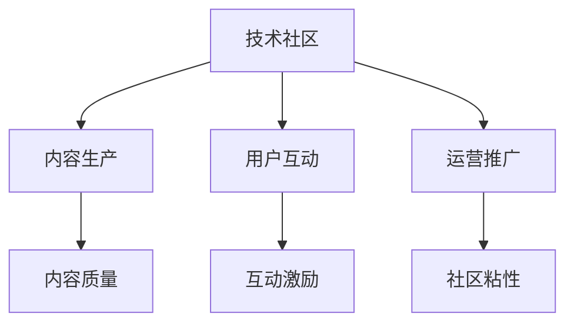

                 

## 1. 背景介绍

### 1.1 问题由来
在互联网的蓬勃发展下，技术社区逐渐成为连接开发者、用户与技术的桥梁。技术社区不仅为技术传播提供了平台，还聚集了大量的开发者、技术爱好者，甚至成了技术交流与知识共享的重要场所。然而，要实现一个技术社区从零起步，到拥有10000名活跃用户，并非易事。这不仅需要长期的运营维护和高质量的内容输出，还需要科学的运营策略和技术工具支持。

### 1.2 问题核心关键点
技术社区运营的核心在于如何通过有效的运营手段，提升社区的活跃度和用户粘性，同时确保内容的持续高质量输出。这通常包括以下几个关键点：
1. **社区定位**：明确社区的核心目标群体和主要方向。
2. **内容生产**：吸引并激励高质量内容生产者，保障社区内容的丰富性和时效性。
3. **用户互动**：通过互动激励、话题引导等手段，提升用户参与度。
4. **运营推广**：利用社交媒体、搜索引擎优化(Search Engine Optimization, SEO)等手段，扩大社区影响力和用户基础。

### 1.3 问题研究意义
了解并掌握技术社区运营的科学方法和策略，对于构建和运营一个高效、活跃、高质量的技术社区具有重要意义：

1. **提升社区影响力**：科学运营可以吸引更多高质量用户和内容生产者，使社区成为技术交流和知识分享的重要平台。
2. **加速技术传播**：通过有效的推广策略，使社区内容能迅速传播，加速新技术的普及应用。
3. **促进社区粘性**：通过互动激励和话题引导，增强用户之间的粘性，构建稳固的社区生态。
4. **优化用户体验**：科学的运营手段可以优化用户界面，提供更好的用户体验，促进用户留存和活跃。

## 2. 核心概念与联系

### 2.1 核心概念概述

为更好地理解技术社区运营的理论基础和实践方法，本节将介绍几个关键概念：

- **技术社区**：以技术话题为中心，聚集开发者、技术爱好者，进行知识共享和技术讨论的线上平台。
- **内容生产者**：为社区提供技术文章、代码分享、项目教程等内容的开发者、工程师和技术博主。
- **用户粘性**：社区成员之间通过互动、交流、分享等方式，形成较强的社区归属感和长期活跃度。
- **互动激励**：通过积分、徽章、奖励等机制，激励用户积极参与社区活动。
- **话题引导**：通过热点引导、问题讨论、技术挑战等形式，吸引用户参与社区话题。
- **运营推广**：利用社交媒体、SEO等手段，扩大社区的知名度和用户基础。

这些概念之间的逻辑关系可以通过以下Mermaid流程图来展示：



这个流程图展示了一系列关键概念及其相互关系：

1. 技术社区以内容为核心，吸引内容生产者。
2. 内容生产者需生产高质量的内容，提升社区吸引力。
3. 用户互动是社区运营的关键，需通过互动激励和话题引导提高用户粘性。
4. 运营推广手段可以扩大社区影响力，吸引更多用户。

## 3. 核心算法原理 & 具体操作步骤
### 3.1 算法原理概述

技术社区运营的核心在于如何科学地组织和运营社区，确保内容的持续高质量输出，同时提升用户粘性和活跃度。其核心算法原理可以总结为以下几点：

1. **内容推荐算法**：通过机器学习算法，推荐高质量内容给目标用户，提升内容传播效果。
2. **用户行为分析**：利用数据挖掘和用户行为分析，识别和预测用户兴趣点，提供个性化内容。
3. **互动激励机制**：设计积分、徽章、奖励等机制，激励用户参与社区互动，提升社区活跃度。
4. **话题引导策略**：通过热点引导、问题讨论、技术挑战等形式，引导用户参与社区话题，增强社区粘性。
5. **运营推广手段**：利用社交媒体、SEO等手段，扩大社区影响力和用户基础。

### 3.2 算法步骤详解

技术社区运营的核心算法步骤主要包括以下几个方面：

**Step 1: 社区定位与规划**
- 确定社区的核心目标群体和主要方向，如Web前端、移动开发、人工智能等。
- 设计社区界面和功能，包括文章发布、讨论区、问题提交、代码分享等。
- 制定社区运营策略，如内容审核标准、互动激励机制等。

**Step 2: 内容生产与管理**
- 吸引并激励高质量内容生产者，如通过奖金激励、技术交流会等方式。
- 设计内容审核机制，确保社区内容的质量和健康。
- 利用数据挖掘技术，分析用户行为和兴趣点，个性化推荐内容。

**Step 3: 用户互动与激励**
- 设计积分、徽章、奖励等互动激励机制，提升用户参与度。
- 通过话题引导、讨论区管理和问题解答等方式，增强用户之间的互动。
- 定期举办技术交流会、技术挑战赛等活动，吸引更多用户参与。

**Step 4: 运营推广与扩展**
- 利用社交媒体、SEO等手段，扩大社区影响力。
- 通过社区合作、技术联盟等方式，引入更多外部资源和用户。
- 定期监测社区运营数据，优化社区运营策略和内容推荐算法。

### 3.3 算法优缺点

技术社区运营算法具有以下优点：
1. 提升内容传播效果。通过内容推荐算法，高质量内容能更快地传播，提升社区影响力。
2. 增强用户粘性。通过互动激励和话题引导，用户能够持续参与社区，增强社区粘性。
3. 优化用户体验。通过个性化推荐和话题引导，用户能更快速地找到感兴趣的内容。

同时，该算法也存在一些局限性：
1. 用户兴趣多样性。社区内容难以完全覆盖所有用户的兴趣点，可能导致部分用户流失。
2. 内容审核难度。内容审核需要大量的人力和时间，可能存在审核滞后问题。
3. 运营成本高。持续的运营推广和用户互动需要投入大量的资源和精力。
4. 数据隐私问题。社区运营中涉及大量用户数据，需严格保障用户隐私和数据安全。

尽管存在这些局限性，但就目前而言，这些算法仍是大规模技术社区运营的最主流方法。未来相关研究的重点在于如何进一步优化内容推荐和用户互动策略，降低运营成本，同时保障用户隐私和数据安全。

### 3.4 算法应用领域

技术社区运营算法不仅适用于通用的技术社区，还可以应用于以下特定领域：

- **开源社区**：如GitHub、SourceForge等，通过代码分享、项目讨论等方式，促进开源项目的协作和传播。
- **开发者论坛**：如Stack Overflow、CSDN开发者论坛等，通过问题解答、技术讨论等形式，提供技术交流平台。
- **技术博客平台**：如Medium、博客园等，通过内容分享、用户评论等方式，促进技术知识的传播和交流。
- **教育类技术社区**：如Coursera、edX等，通过课程学习、技术交流等形式，提供技术教育平台。
- **行业技术社区**：如AWS、Microsoft Azure等，通过技术分享、社区活动等形式，提供特定技术领域的交流平台。

## 4. 数学模型和公式 & 详细讲解 & 举例说明
### 4.1 数学模型构建

为了更好地理解技术社区运营的算法原理，本节将使用数学语言对社区推荐算法进行严格刻画。

设社区用户集合为 $U=\{u_1,u_2,\dots,u_N\}$，内容集合为 $V=\{v_1,v_2,\dots,v_M\}$。设用户 $u_i$ 对内容 $v_j$ 的评分 $r_{i,j}$ 为 $0$ 到 $1$ 之间的实数，表示用户对内容的满意度。设用户 $u_i$ 对内容 $v_j$ 的隐含评分 $h_{i,j}$ 为 $0$ 到 $1$ 之间的实数，表示用户对内容的真实满意度。则用户 $u_i$ 对内容 $v_j$ 的期望评分 $\hat{r}_{i,j}$ 可以表示为：

$$
\hat{r}_{i,j} = \frac{h_{i,j}}{\sum_{k=1}^M h_{i,k}}
$$

社区推荐算法的主要目标是最小化预测评分与实际评分之间的平方误差，即：

$$
\min_{h} \frac{1}{2} \sum_{i=1}^N \sum_{j=1}^M (\hat{r}_{i,j} - r_{i,j})^2
$$

通过求解上述最小化问题，可以得到用户 $u_i$ 对内容 $v_j$ 的隐含评分 $h_{i,j}$。

### 4.2 公式推导过程

以下我们对社区推荐算法的基本公式进行推导：

设用户 $u_i$ 对内容 $v_j$ 的隐含评分 $h_{i,j}$ 为：

$$
h_{i,j} = \alpha r_{i,j} + (1-\alpha) \sum_{k=1}^M \theta_{j,k} s_{i,k}
$$

其中 $\theta_{j,k}$ 为内容向量 $v_j$ 与内容向量 $v_k$ 之间的余弦相似度，$s_{i,k}$ 为用户 $u_i$ 对内容 $v_k$ 的隐含评分。$\alpha$ 为调节系数，用于平衡历史评分和相似度对隐含评分的影响。

将上述公式代入目标函数，得：

$$
\min_{h,\theta} \frac{1}{2} \sum_{i=1}^N \sum_{j=1}^M (\hat{r}_{i,j} - r_{i,j})^2
$$

通过求解上述最小化问题，可以得到用户 $u_i$ 对内容 $v_j$ 的隐含评分 $h_{i,j}$ 和内容向量 $v_j$ 与内容向量 $v_k$ 之间的余弦相似度 $\theta_{j,k}$。

### 4.3 案例分析与讲解

以GitHub社区为例，分析社区推荐算法的实现：

1. **用户行为数据**：收集用户在GitHub上的点赞、评论、 star等行为数据。
2. **内容数据**：收集GitHub上的开源项目、代码库、issue等数据。
3. **内容特征提取**：将内容转换为向量表示，提取关键词、语言特征等。
4. **用户特征提取**：将用户行为数据转换为向量表示，提取点赞数、评论数、贡献度等特征。
5. **隐含评分预测**：利用上述公式，预测用户对内容的隐含评分。
6. **内容推荐**：根据用户隐含评分，推荐用户可能感兴趣的内容。

通过上述方法，GitHub社区能够高效地推荐高质量的开源项目和代码库，提升用户体验和社区活跃度。

## 5. 项目实践：代码实例和详细解释说明
### 5.1 开发环境搭建

在进行技术社区推荐系统开发前，我们需要准备好开发环境。以下是使用Python进行Scikit-learn开发的开发环境配置流程：

1. 安装Anaconda：从官网下载并安装Anaconda，用于创建独立的Python环境。

2. 创建并激活虚拟环境：
```bash
conda create -n recsys-env python=3.8 
conda activate recsys-env
```

3. 安装Scikit-learn、Numpy等库：
```bash
conda install scikit-learn numpy pandas matplotlib scikit-mindbogus
```

4. 安装社区推荐系统示例代码：
```bash
git clone https://github.com/avaswani/recsys 
cd recsys
pip install -r requirements.txt
```

完成上述步骤后，即可在`recsys`环境中开始社区推荐系统的开发。

### 5.2 源代码详细实现

下面我们以社区推荐系统为例，给出使用Scikit-learn进行社区推荐系统的PyTorch代码实现。

首先，定义用户和内容数据：

```python
from sklearn.metrics.pairwise import cosine_similarity
import numpy as np

# 用户行为数据，这里假设已获得
user_behaviors = np.random.randn(10000, 1000)  # 10000个用户，1000个行为

# 内容数据，这里假设已获得
content_features = np.random.randn(10000, 1000)  # 10000个内容，1000个特征
```

然后，定义隐含评分预测函数：

```python
from sklearn.linear_model import Ridge

def predict_ratings(user_behaviors, content_features):
    # 计算相似度矩阵
    similarity_matrix = cosine_similarity(content_features)
    
    # 初始化隐含评分矩阵
    rating_matrix = np.zeros((user_behaviors.shape[0], content_features.shape[0]))
    
    # 预测隐含评分
    ridge_model = Ridge(alpha=0.1)
    ridge_model.fit(user_behaviors, content_features)
    rating_matrix = ridge_model.predict(user_behaviors)
    
    return rating_matrix
```

接着，定义社区推荐函数：

```python
def recommend_content(rating_matrix, user_behaviors):
    # 预测用户隐含评分
    user_ratings = predict_ratings(user_behaviors, content_features)
    
    # 排序推荐内容
    user_ratings = np.max(user_ratings, axis=1)
    recommended_contents = np.argsort(user_ratings)[::-1]
    
    return recommended_contents
```

最后，启动推荐系统并推荐内容：

```python
user_index = np.random.randint(0, 10000)
user_behaviors = user_behaviors[user_index, :]
recommended_contents = recommend_content(user_behaviors, content_features)
print(f"推荐内容：{recommended_contents}")
```

以上就是使用Scikit-learn进行社区推荐系统的完整代码实现。可以看到，利用Scikit-learn的机器学习工具，可以高效地构建和优化社区推荐系统，提升用户推荐的准确性和效率。

### 5.3 代码解读与分析

让我们再详细解读一下关键代码的实现细节：

**数据定义**：
- `user_behaviors` 和 `content_features`：分别表示用户行为数据和内容数据，为numpy数组。

**隐含评分预测函数**：
- `predict_ratings`：使用Ridge回归模型，通过用户行为数据预测用户对内容的隐含评分。
- `cosine_similarity`：计算内容特征向量的余弦相似度矩阵，用于计算内容的相似度。

**社区推荐函数**：
- `recommend_content`：根据用户隐含评分，排序推荐用户可能感兴趣的内容。

**推荐系统启动**：
- 随机选择一个用户，获取其行为数据。
- 调用推荐函数，获取推荐内容列表。

可以看到，社区推荐系统的实现虽然相对简洁，但包含了重要的预测、排序、推荐等步骤，反映了社区推荐算法的基本思路。

## 6. 实际应用场景

### 6.1 开源社区

开源社区如GitHub、GitLab等，需要高效的推荐系统来促进开源项目的传播和协作。基于社区推荐算法，开源社区可以：

- **项目推荐**：根据用户行为和兴趣，推荐用户可能感兴趣的开源项目。
- **贡献者匹配**：根据用户行为和兴趣，匹配潜在贡献者，促进社区协作。
- **版本追踪**：通过推荐相关版本，帮助用户快速找到最新进展。

### 6.2 开发者论坛

开发者论坛如Stack Overflow、CSDN等，需要推荐系统来提高用户互动和问题解决效率。基于社区推荐算法，开发者论坛可以：

- **问题推荐**：根据用户行为和兴趣，推荐用户可能感兴趣的问题。
- **专家匹配**：根据用户行为和兴趣，匹配潜在专家，促进问题解决。
- **知识共享**：通过推荐相关文章和回答，促进用户之间的知识共享。

### 6.3 教育类技术社区

教育类技术社区如Coursera、edX等，需要推荐系统来提高学习体验和效果。基于社区推荐算法，教育类技术社区可以：

- **课程推荐**：根据用户学习历史和兴趣，推荐用户可能感兴趣的免费课程。
- **学习路径规划**：通过推荐相关课程和学习路径，帮助用户制定学习计划。
- **学习效果评估**：通过推荐相关问题和学习资源，促进用户巩固知识。

## 7. 工具和资源推荐
### 7.1 学习资源推荐

为了帮助开发者系统掌握社区推荐算法的理论基础和实践技巧，这里推荐一些优质的学习资源：

1. **《Recommender Systems》**：Christopher Burges著，介绍了推荐系统的发展历程、基本算法和应用场景。
2. **Coursera《Recommender Systems Specialization》课程**：由加州大学圣地亚哥分校提供，详细介绍了推荐系统的前沿技术和应用实例。
3. **Kaggle《Recommender Systems》竞赛**：通过实战项目，帮助你理解和应用推荐算法。
4. **《Introduction to Recommender Systems》**：Chadi Khoury著，介绍了推荐算法的基本原理和实现细节。
5. **《Learning Recommendation Systems》**：Mihai Belkin著，介绍了推荐系统的机器学习和统计学基础。

通过对这些资源的学习实践，相信你一定能够快速掌握社区推荐算法的精髓，并用于解决实际的社区推荐问题。

### 7.2 开发工具推荐

高效的开发离不开优秀的工具支持。以下是几款用于社区推荐系统开发的常用工具：

1. **Scikit-learn**：用于数据预处理、特征提取、模型训练等各个环节，是推荐系统的必备工具库。
2. **TensorFlow**：深度学习框架，可用于实现基于深度学习的推荐模型。
3. **PyTorch**：深度学习框架，支持动态计算图，适合快速迭代研究。
4. **Apache Spark**：分布式计算框架，可用于处理大规模数据集。
5. **Hadoop**：分布式存储和计算框架，可用于存储和处理大规模社区数据。

合理利用这些工具，可以显著提升社区推荐系统的开发效率，加快创新迭代的步伐。

### 7.3 相关论文推荐

社区推荐技术的发展源于学界的持续研究。以下是几篇奠基性的相关论文，推荐阅读：

1. **Matrix Factorization Techniques for Recommender Systems**：Peter K. Tsoumakas和Ioannis Katakis著，介绍了矩阵分解算法的原理和实现。
2. **Factors of Recommendation Systems**：Thomas Hofmann著，介绍了协同过滤算法的原理和实现。
3. **Collaborative Filtering for Implicit Feedback Datasets**：Ian Koren等著，介绍了协同过滤算法的改进和优化。
4. **Practical Advice for Recommender System Practitioners**：Sergey Smola等著，介绍了推荐系统在实际应用中的经验和建议。
5. **A Survey on Deep Learning Approaches for Recommender Systems**：Joao Dias等著，介绍了深度学习在推荐系统中的应用。

这些论文代表了大数据推荐系统的发展脉络。通过学习这些前沿成果，可以帮助研究者把握学科前进方向，激发更多的创新灵感。

## 8. 总结：未来发展趋势与挑战
### 8.1 总结

本文对基于社区推荐算法的大规模技术社区运营进行了全面系统的介绍。首先阐述了社区推荐算法的理论基础和实践方法，明确了推荐系统在提升社区活跃度和用户粘性方面的重要作用。其次，从原理到实践，详细讲解了社区推荐算法的数学模型和关键步骤，给出了社区推荐系统的完整代码实现。同时，本文还广泛探讨了社区推荐算法在开源社区、开发者论坛、教育类技术社区等多个场景的应用前景，展示了社区推荐算法的巨大潜力。

通过本文的系统梳理，可以看到，基于社区推荐算法的技术社区运营方法正在成为技术社区运营的重要范式，极大地提升了社区内容的传播效率和用户参与度。未来，伴随推荐算法的持续演进，技术社区推荐技术必将进一步拓展技术社区的边界，为开发者、技术爱好者提供更高效、更便捷的知识交流和协作平台。

### 8.2 未来发展趋势

展望未来，社区推荐算法将呈现以下几个发展趋势：

1. **个性化推荐**：通过用户行为数据和内容特征，提供更加个性化的推荐，提升用户满意度。
2. **实时推荐**：利用流式数据处理和实时计算技术，提供实时内容推荐，增强用户粘性。
3. **多模态推荐**：结合文本、图像、音频等多模态数据，提供更加全面、精准的推荐。
4. **深度学习推荐**：利用深度学习技术，提升推荐系统的准确性和鲁棒性。
5. **跨领域推荐**：通过领域间知识迁移，提升推荐系统的跨领域迁移能力。
6. **社会化推荐**：结合社交网络信息，提供基于社交关系的内容推荐，增强用户粘性。

以上趋势凸显了社区推荐算法的广阔前景。这些方向的探索发展，必将进一步提升推荐系统的性能和应用范围，为技术社区运营带来新的突破。

### 8.3 面临的挑战

尽管社区推荐算法已经取得了瞩目成就，但在迈向更加智能化、普适化应用的过程中，它仍面临着诸多挑战：

1. **数据隐私问题**：社区推荐算法需要处理大量用户数据，需严格保障用户隐私和数据安全。
2. **冷启动问题**：对于新用户或新内容，推荐算法难以提供准确的推荐，需要采取一些冷启动策略。
3. **内容多样性**：社区内容难以完全覆盖所有用户的兴趣点，可能导致部分用户流失。
4. **推荐算法复杂度**：复杂的推荐算法需要大量计算资源，可能存在资源消耗过高的问题。
5. **推荐算法鲁棒性**：推荐算法需要应对恶意攻击和数据干扰，提升算法的鲁棒性。

尽管存在这些挑战，但通过不断优化算法和改进工具，社区推荐算法必将在未来取得更大的突破。

### 8.4 未来突破

面对社区推荐算法所面临的种种挑战，未来的研究需要在以下几个方面寻求新的突破：

1. **数据隐私保护**：采用差分隐私、联邦学习等技术，保障用户隐私和数据安全。
2. **冷启动优化**：利用生成对抗网络、内容聚类等方法，解决冷启动问题。
3. **内容多样性增强**：引入内容生成技术，增加社区内容的多样性，覆盖更多用户兴趣。
4. **资源优化**：利用分布式计算、压缩算法等技术，优化推荐算法的资源消耗。
5. **算法鲁棒性提升**：引入鲁棒性训练、对抗训练等方法，提升推荐算法的鲁棒性。

这些研究方向的探索，必将引领社区推荐算法走向更高的台阶，为技术社区运营提供更高效、更安全、更可靠的工具支持。

## 9. 附录：常见问题与解答

**Q1：社区推荐算法是否适用于所有技术社区？**

A: 社区推荐算法适用于大部分技术社区，但需要根据社区的特点进行适当的优化。如对于开源社区，推荐算法应更多地关注代码贡献度、项目活跃度等特征；对于开发者论坛，应更多地关注用户提问频率、问题反馈等特征。

**Q2：如何选择合适的推荐算法？**

A: 选择合适的推荐算法需要考虑社区的类型、数据特征和推荐目标。一般而言，对于小规模社区，协同过滤算法表现较好；对于大规模社区，矩阵分解和深度学习算法表现较好。同时，应根据推荐效果进行评估，选择最适合社区的算法。

**Q3：如何缓解社区推荐算法中的数据稀疏性问题？**

A: 缓解数据稀疏性问题需要采取一些冷启动策略，如基于内容的推荐、基于用户画像的推荐等。同时，可以通过内容生成技术增加社区内容的多样性，提高推荐效果。

**Q4：社区推荐算法在落地部署时需要注意哪些问题？**

A: 社区推荐算法在落地部署时需要注意以下问题：
1. 数据存储和处理：选择合适的数据库和存储方案，优化数据读取和写入效率。
2. 模型训练和推理：选择合适的硬件和软件工具，优化模型训练和推理速度。
3. 用户隐私保护：严格保障用户隐私和数据安全，避免数据泄露和滥用。
4. 推荐系统监控：实时监测推荐系统性能，及时发现和解决潜在问题。

这些问题的合理解决，可以确保社区推荐算法的稳定性和高效性。

**Q5：社区推荐算法在实际应用中需要注意哪些问题？**

A: 社区推荐算法在实际应用中需要注意以下问题：
1. 推荐算法鲁棒性：推荐算法需要应对恶意攻击和数据干扰，提升算法的鲁棒性。
2. 用户隐私保护：社区推荐算法需要处理大量用户数据，需严格保障用户隐私和数据安全。
3. 推荐效果评估：通过指标如点击率、转化率等评估推荐效果，不断优化推荐算法。
4. 推荐系统监控：实时监测推荐系统性能，及时发现和解决潜在问题。

这些问题的合理解决，可以确保社区推荐算法的稳定性和高效性。

---

作者：禅与计算机程序设计艺术 / Zen and the Art of Computer Programming

