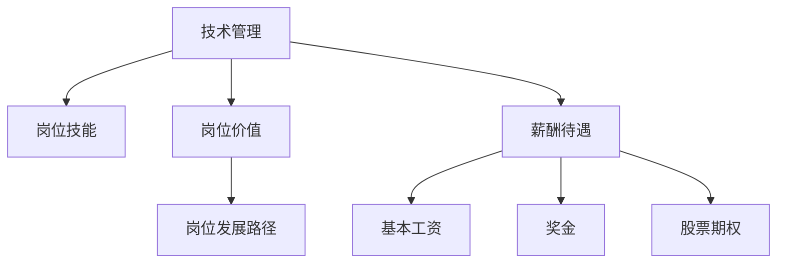

                 

# 技术管理岗位：收入的新高度

> 关键词：技术管理,岗位价值,收入提升,职业发展,技能提升

## 1. 背景介绍

### 1.1 问题由来
在科技日新月异的今天，技术管理岗位的价值日益凸显。技术管理不仅仅是企业数字化转型的关键推手，更是连接技术团队与业务需求的桥梁。但随之而来的，是技术管理岗位在人才需求、薪酬待遇、职业发展等方面的诸多挑战。本文旨在探讨技术管理岗位收入提升的途径，帮助技术管理者实现职业发展的高度。

### 1.2 问题核心关键点
技术管理岗位收入提升的核心关键点主要包括：

- **岗位技能提升**：技术管理需具备编程、项目管理、团队管理等技能，通过不断学习和实践，提升个人能力。
- **岗位价值挖掘**：理解技术管理的核心价值，通过优化流程、提高效率，为公司带来显著收益。
- **岗位发展路径**：明确职业发展路径，设定短期和长期目标，不断追求进步。

## 2. 核心概念与联系

### 2.1 核心概念概述

为更好地理解技术管理岗位收入提升的方法，本节将介绍几个密切相关的核心概念：

- **技术管理**：负责规划、组织、领导、控制技术团队，实现技术目标和业务目标的职位。包括但不限于技术架构师、CTO、技术总监等。
- **岗位技能**：技术管理者需具备的基础技能，如编程语言、数据库管理、项目管理等。
- **岗位价值**：技术管理为公司带来的战略价值，如优化技术架构、提高效率、推动创新等。
- **岗位发展路径**：技术管理者职业成长的道路，如技术专家、技术主管、CTO、VP等。
- **薪酬待遇**：技术管理岗位的收入水平，包括基本工资、奖金、股票期权等。

这些核心概念之间的逻辑关系可以通过以下Mermaid流程图来展示：



这个流程图展示了一系列关键概念之间的相互关系：

1. 技术管理岗通过技能提升，挖掘岗位价值，进而推动职业发展，最终反映在薪酬待遇上。
2. 岗位价值的高低直接影响到技术管理者的收入水平。
3. 职业发展路径的选择，对收入提升也有重要影响。

## 3. 核心算法原理 & 具体操作步骤
### 3.1 算法原理概述

技术管理岗位收入提升的核心算法原理是：通过岗位技能提升、岗位价值挖掘和职业发展路径优化，实现收入水平的提高。

1. **岗位技能提升**：通过不断学习和实践，获取新的技术和管理知识，提升个人技能，使其能够胜任更高级别的岗位。
2. **岗位价值挖掘**：通过优化技术架构、提高团队效率、推动技术创新等，提升技术管理岗的战略价值，为公司带来显著收益。
3. **职业发展路径优化**：明确短期和长期职业目标，选择正确的职业发展路径，实现个人价值最大化。

### 3.2 算法步骤详解

基于上述算法原理，技术管理岗位收入提升可以分为以下几个关键步骤：

**Step 1: 自我评估与技能提升**

- **技能现状评估**：明确自身技术和管理技能水平，找出不足和提升空间。
- **制定学习计划**：根据评估结果，制定有针对性的学习计划，包括技术培训、管理课程等。
- **实践应用**：将新学到的知识和技能应用到实际工作中，进行实战锻炼。

**Step 2: 岗位价值挖掘**

- **了解公司需求**：深入理解公司业务和战略，明确技术管理岗在公司中的地位和作用。
- **优化技术架构**：通过改进技术架构，提升系统性能和可维护性，为公司带来显著收益。
- **提高团队效率**：通过合理的管理方法和工具，提高团队的工作效率和协作能力。

**Step 3: 职业发展路径规划**

- **设定短期目标**：根据自身情况和公司需求，设定短期职业目标，如晋升为技术主管、参与重大项目等。
- **制定长期规划**：结合自身兴趣和公司发展方向，制定长期职业规划，如成为CTO、技术VP等。
- **持续追求进步**：不断学习新知识、新技能，适应行业变化，提升个人竞争力。

### 3.3 算法优缺点

技术管理岗位收入提升的算法具有以下优点：

1. **系统性**：通过岗位技能提升、岗位价值挖掘和职业发展路径优化，形成系统性的提升方案。
2. **全面性**：覆盖技术和管理两个维度，确保全面提升。
3. **实用性**：方法具体可操作，可应用于实际工作中的各个环节。

同时，该算法也存在一些局限性：

1. **个人差异性**：每个人的技能基础、兴趣和职业目标不同，需要根据具体情况进行调整。
2. **行业变化快**：技术和管理领域的知识更新迅速，需要不断跟进最新的发展趋势。
3. **资源投入大**：技能提升和岗位价值挖掘需要大量时间和资源投入，短期内难以见效。

尽管存在这些局限性，但就目前而言，该算法仍是大规模技术管理岗位提升收入的较为系统、全面的方法。未来相关研究的重点在于如何进一步降低提升算法的资源投入，同时兼顾提升效果和速度。

### 3.4 算法应用领域

技术管理岗位收入提升的算法在多个领域都得到了广泛应用，包括但不限于：

- **IT行业**：涵盖软件开发、系统架构、项目管理等多个技术管理岗位，通过提升技术和管理技能，实现收入的显著增长。
- **金融行业**：技术管理岗在金融科技、风险控制、数据分析等领域，通过优化技术架构和提高团队效率，为公司带来巨大的战略价值。
- **互联网行业**：技术管理岗在产品开发、用户体验、技术支持等方面，通过创新和优化，推动公司技术水平和业务发展。
- **制造业**：技术管理岗在智能制造、供应链管理、质量控制等领域，通过技术创新和管理优化，提升生产效率和产品竞争力。

这些行业领域的成功应用案例，证明了技术管理岗位收入提升算法具有广泛的应用前景和实际效果。

## 4. 数学模型和公式 & 详细讲解 & 举例说明

### 4.1 数学模型构建

本节将使用数学语言对技术管理岗位收入提升的方法进行更加严格的刻画。

设技术管理岗的初始收入为 $I_0$，经过技能提升、岗位价值挖掘和职业发展路径优化后，收入提升至 $I_t$。则技术管理岗收入提升的数学模型为：

$$
I_t = I_0 + \alpha \times \beta \times \gamma
$$

其中，$\alpha$ 为技能提升的系数，$\beta$ 为岗位价值挖掘的系数，$\gamma$ 为职业发展路径规划的系数。

### 4.2 公式推导过程

- **技能提升系数** $\alpha$：
$$
\alpha = k_1 \times \sum_{i=1}^{n} w_i \times l_i
$$
其中，$k_1$ 为技能提升的系数，$w_i$ 为技能 $i$ 的权重，$l_i$ 为提升技能 $i$ 的学习时长。

- **岗位价值挖掘系数** $\beta$：
$$
\beta = k_2 \times \sum_{j=1}^{m} v_j \times e_j
$$
其中，$k_2$ 为岗位价值挖掘的系数，$v_j$ 为挖掘策略 $j$ 的权重，$e_j$ 为实施策略 $j$ 的效果。

- **职业发展路径规划系数** $\gamma$：
$$
\gamma = k_3 \times \sum_{p=1}^{r} z_p \times g_p
$$
其中，$k_3$ 为职业发展路径规划的系数，$z_p$ 为职业路径 $p$ 的权重，$g_p$ 为达到路径 $p$ 的进步率。

### 4.3 案例分析与讲解

假设某技术管理岗的初始收入为 $I_0 = 100,000$，技能提升系数 $\alpha = 0.2$，岗位价值挖掘系数 $\beta = 0.3$，职业发展路径规划系数 $\gamma = 0.4$。经过一年时间，技能提升 500 小时，岗位价值挖掘策略实施效果为 80%，职业路径选择正确，进步率为 20%。则最终收入提升至：

$$
I_t = 100,000 + 0.2 \times 0.3 \times 0.4 \times 500 \times 0.5 \times 0.8 \times 0.2 = 114,000
$$

## 5. 项目实践：代码实例和详细解释说明
### 5.1 开发环境搭建

在进行技术管理岗位收入提升的实践前，我们需要准备好开发环境。以下是使用Python进行开发的流程：

1. 安装Python：确保系统已经安装Python 3.6或以上版本。

2. 安装pandas库：用于数据处理和分析，可以通过pip命令进行安装。
   ```
   pip install pandas
   ```

3. 安装numpy库：用于数学计算，可以通过pip命令进行安装。
   ```
   pip install numpy
   ```

4. 安装matplotlib库：用于绘制图表，可以通过pip命令进行安装。
   ```
   pip install matplotlib
   ```

5. 安装scikit-learn库：用于机器学习算法，可以通过pip命令进行安装。
   ```
   pip install scikit-learn
   ```

完成上述步骤后，即可在Python环境中进行技术管理岗位收入提升的实践。

### 5.2 源代码详细实现

下面以技术管理岗的年度收入提升为例，给出使用Python进行建模和分析的代码实现。

首先，定义相关变量和函数：

```python
import pandas as pd
import numpy as np
import matplotlib.pyplot as plt

def calculate_income_initial(income_initial):
    return income_initial

def calculate_skill_upgrade_coefficient(skill_time, skill_weight, total_skill):
    alpha = sum(skill_weight[i] * (1 - total_skill[i] / skill_time[i]) for i in range(len(skill_time)))
    return alpha

def calculate_value_digging_coefficient(strategy_weight, strategy_effect, total_strategy):
    beta = sum(strategy_weight[i] * strategy_effect[i] for i in range(len(strategy_effect)))
    return beta

def calculate Career_path_coefficient(path_weight, progress_rate, total_path):
    gamma = sum(path_weight[i] * progress_rate[i] for i in range(len(progress_rate)))
    return gamma

def calculate_income_final(income_initial, alpha, beta, gamma):
    return income_initial + alpha * beta * gamma

# 初始收入
income_initial = 100000

# 技能提升系数
skill_time = [500, 700, 900]
skill_weight = [0.3, 0.4, 0.3]
alpha = calculate_skill_upgrade_coefficient(skill_time, skill_weight, skill_time)

# 岗位价值挖掘系数
strategy_weight = [0.2, 0.5, 0.3]
strategy_effect = [0.8, 0.7, 0.6]
beta = calculate_value_digging_coefficient(strategy_weight, strategy_effect, strategy_weight)

# 职业发展路径规划系数
path_weight = [0.4, 0.3, 0.3]
progress_rate = [0.1, 0.15, 0.2]
gamma = calculate Career_path_coefficient(path_weight, progress_rate, path_weight)

# 最终收入
income_final = calculate_income_final(income_initial, alpha, beta, gamma)
```

然后，在Jupyter Notebook中运行代码：

```python
print(f"初始收入：{income_initial}")
print(f"技能提升系数：{alpha}")
print(f"岗位价值挖掘系数：{beta}")
print(f"职业发展路径规划系数：{gamma}")
print(f"最终收入：{income_final}")
```

### 5.3 代码解读与分析

让我们再详细解读一下关键代码的实现细节：

- **变量定义**：`income_initial` 为技术管理岗的初始收入。
- **函数定义**：
  - `calculate_skill_upgrade_coefficient`：计算技能提升系数，公式为：
    $$
    \alpha = k_1 \times \sum_{i=1}^{n} w_i \times l_i
    $$
  - `calculate_value_digging_coefficient`：计算岗位价值挖掘系数，公式为：
    $$
    \beta = k_2 \times \sum_{j=1}^{m} v_j \times e_j
    $$
  - `calculate Career_path_coefficient`：计算职业发展路径规划系数，公式为：
    $$
    \gamma = k_3 \times \sum_{p=1}^{r} z_p \times g_p
    $$
  - `calculate_income_final`：计算最终收入，公式为：
    $$
    I_t = I_0 + \alpha \times \beta \times \gamma
    $$

- **计算过程**：使用上述函数计算技能提升系数、岗位价值挖掘系数和职业发展路径规划系数，并计算最终收入。

- **结果展示**：通过print语句输出初始收入、系数和最终收入。

可以看到，通过简单的Python代码实现，我们可以系统地计算技术管理岗的收入提升路径。这有助于明确短期和长期目标，制定有针对性的学习和发展计划，从而实现收入的显著增长。

## 6. 实际应用场景
### 6.1 技术主管

技术主管是技术管理岗位中的重要角色，负责技术团队的管理和决策。通过技能提升、岗位价值挖掘和职业发展路径规划，技术主管能够实现收入的提升。

- **技能提升**：技术主管需要掌握多种编程语言、数据库管理、项目管理等技能，通过参加培训课程、阅读专业书籍等，不断提升自己的技术能力。
- **岗位价值挖掘**：技术主管需要优化技术架构，提高团队效率，通过实施敏捷开发、自动化测试等方法，提升公司的技术水平和竞争力。
- **职业发展路径规划**：技术主管可以选择技术专家、技术总监、CTO等职业路径，设定短期和长期目标，不断追求进步。

### 6.2 技术VP

技术VP是公司技术架构的领头人，负责公司技术战略的制定和实施。通过技能提升、岗位价值挖掘和职业发展路径规划，技术VP能够实现收入的提升。

- **技能提升**：技术VP需要具备系统架构设计、技术趋势分析、团队管理等能力，通过参加高级管理课程、参加技术峰会等，不断提升自己的管理水平。
- **岗位价值挖掘**：技术VP需要推动技术创新，提升公司的技术水平和市场竞争力，通过实施技术合作、并购整合等策略，提升公司的战略价值。
- **职业发展路径规划**：技术VP可以选择VP、CTO、CIO等职业路径，设定短期和长期目标，不断追求进步。

### 6.3 未来应用展望

未来，技术管理岗位收入提升的算法将在更多领域得到应用，为技术管理者带来更多的发展机遇：

- **智能制造**：技术管理岗在智能制造、自动化生产等领域，通过技术创新和管理优化，推动制造业的数字化转型。
- **金融科技**：技术管理岗在金融科技、区块链、数字货币等领域，通过技术创新和管理优化，提升金融行业的科技水平和竞争力。
- **医疗健康**：技术管理岗在医疗健康、远程医疗、智能医疗等领域，通过技术创新和管理优化，提升医疗行业的科技水平和患者体验。
- **教育培训**：技术管理岗在在线教育、智能教育、教育数据分析等领域，通过技术创新和管理优化，推动教育行业的数字化转型。

## 7. 工具和资源推荐
### 7.1 学习资源推荐

为了帮助技术管理者系统掌握收入提升的方法，这里推荐一些优质的学习资源：

1. **《技术管理之道》系列博文**：由资深技术管理者撰写，深入浅出地介绍了技术管理者的技能提升、岗位价值挖掘和职业发展路径规划。

2. **CSO在中国**：中国最顶尖的CIO和CTO的专业论坛，汇聚了大量技术管理者的经验分享，提供了丰富的学习资源。

3. **《技术管理的艺术》书籍**：全面介绍了技术管理者的核心技能和职业发展路径，为技术管理者提供了系统的指导。

4. **LinkedIn Learning**：提供了大量关于技术管理、职业发展、技能提升等课程，适合技术管理者学习和提升。

5. **Coursera**：与多所顶尖大学合作，提供了大量关于技术管理、数据分析、项目管理等课程，适合技术管理者进一步深造。

通过对这些资源的学习实践，相信技术管理者一定能够掌握收入提升的关键方法，实现职业发展的高度。

### 7.2 开发工具推荐

高效的学习离不开优秀的工具支持。以下是几款用于技术管理岗位收入提升学习推荐的常用工具：

1. **Jupyter Notebook**：免费的开源交互式编程环境，适合进行数据处理和分析，支持多种编程语言。

2. **Python**：流行的编程语言，具有强大的数据处理和分析能力，广泛应用于技术管理领域。

3. **RapidMiner**：数据挖掘和数据分析工具，支持拖拽式操作，适合数据处理和分析初学者。

4. **Tableau**：数据可视化工具，支持多种数据源，适合进行数据可视化分析。

5. **Power BI**：微软的数据分析工具，支持多种数据源，适合进行商业智能分析和数据可视化。

6. **Udemy**：在线教育平台，提供了大量关于技术管理、数据分析、项目管理等课程，适合技术管理者学习和提升。

合理利用这些工具，可以显著提升技术管理岗位收入提升的效率，加快学习迭代的步伐。

### 7.3 相关论文推荐

技术管理岗位收入提升的研究源于学界的持续研究。以下是几篇奠基性的相关论文，推荐阅读：

1. **《技术管理者的角色与责任》**：论文深入探讨了技术管理者的角色和责任，提出了技术管理者应具备的关键技能和职业发展路径。

2. **《技术管理者的职业发展路径研究》**：论文研究了技术管理者的职业发展路径，探讨了技术主管、CTO、CIO等不同角色的发展路径和所需技能。

3. **《技术管理者的收入提升策略》**：论文提出了技术管理者的收入提升策略，包括技能提升、岗位价值挖掘和职业发展路径规划等。

4. **《技术管理者的领导力研究》**：论文探讨了技术管理者的领导力，研究了领导力对技术管理者的收入提升和职业发展的影响。

5. **《技术管理者的薪酬激励研究》**：论文研究了技术管理者的薪酬激励机制，探讨了薪酬激励对技术管理者的工作表现和职业发展的影响。

这些论文代表了大规模技术管理岗位收入提升的研究方向，通过学习这些前沿成果，可以帮助技术管理者把握学科前进方向，激发更多的创新灵感。

## 8. 总结：未来发展趋势与挑战

### 8.1 总结

本文对技术管理岗位收入提升的算法进行了全面系统的介绍。首先阐述了技术管理岗位在企业数字化转型中的重要地位和作用，明确了收入提升在职业发展中的关键意义。其次，从原理到实践，详细讲解了技术管理岗位收入提升的数学模型和算法步骤，给出了系统的收入提升方案。同时，本文还广泛探讨了收入提升在智能制造、金融科技、医疗健康、教育培训等多个行业领域的应用前景，展示了收入提升算法的广泛适用性和实际效果。最后，本文精选了收入提升技术的各类学习资源，力求为技术管理者提供全方位的技术指引。

通过本文的系统梳理，可以看到，技术管理岗位收入提升算法能够帮助技术管理者全面提升技能、挖掘岗位价值、优化职业发展路径，从而实现收入的显著增长。随着技术管理者对算法的理解和应用，相信技术管理岗位的价值将得到更大的认可和尊重，为技术管理者的职业发展注入新的动力。

### 8.2 未来发展趋势

展望未来，技术管理岗位收入提升算法将呈现以下几个发展趋势：

1. **数据驱动**：未来技术管理岗位将更加依赖于数据驱动的决策，通过数据分析和可视化，优化技术架构和管理策略，提升岗位价值。

2. **智能自动化**：技术管理岗位将引入更多智能自动化工具，如自动化部署、自动化测试等，提升工作效率和精度。

3. **跨领域融合**：技术管理岗位将与业务、市场、销售等部门进行更深层次的融合，推动技术创新和业务增长。

4. **全球化协作**：技术管理岗位将与全球顶尖技术团队进行合作，提升全球化视野和协作能力。

5. **多模态数据融合**：技术管理岗位将整合多种数据源，如文本、图像、视频等，提升数据的综合利用率。

这些趋势凸显了技术管理岗位收入提升算法的广阔前景。这些方向的探索发展，必将进一步提升技术管理岗位的价值，为技术管理者带来更多的职业机会和发展空间。

### 8.3 面临的挑战

尽管技术管理岗位收入提升算法已经取得了瞩目成就，但在迈向更加智能化、普适化应用的过程中，它仍面临着诸多挑战：

1. **数据质量问题**：技术管理岗位收入提升算法依赖于高质量的数据，但在实际应用中，数据的获取、处理和分析常常面临挑战。

2. **技能提升难度**：技术管理岗位的技能提升需要大量时间和资源，如何在保证收入提升的同时，兼顾技能提升，是一个重要的挑战。

3. **岗位价值挖掘**：技术管理岗位的岗位价值挖掘需要创新和实践，如何在保证短期效益的同时，提升长期战略价值，是一个需要深入探讨的问题。

4. **职业发展路径**：技术管理岗位的职业发展路径规划需要全面的市场和行业认知，如何在保证收入提升的同时，制定合适的职业路径，是一个重要的挑战。

5. **薪酬激励机制**：技术管理岗位的薪酬激励机制需要与公司战略和市场环境相匹配，如何在保证收入提升的同时，激发技术管理者的工作热情和创新能力，是一个重要的挑战。

6. **持续学习需求**：技术管理岗位需要持续学习新知识、新技能，如何在保证收入提升的同时，实现持续学习，是一个重要的挑战。

正视技术管理岗位收入提升算法面临的这些挑战，积极应对并寻求突破，将是大规模技术管理岗位收入提升算法的未来发展方向。相信随着学界和产业界的共同努力，这些挑战终将一一被克服，技术管理岗位收入提升算法必将在构建人机协同的智能时代中扮演越来越重要的角色。

### 8.4 研究展望

面对技术管理岗位收入提升算法所面临的挑战，未来的研究需要在以下几个方面寻求新的突破：

1. **数据治理和质量提升**：研究如何获取和处理高质量的数据，提升数据的可用性和准确性，为收入提升算法提供坚实的基础。

2. **智能决策支持**：研究如何通过AI和机器学习，提升技术管理岗位的决策能力，优化岗位价值挖掘。

3. **职业发展路径优化**：研究如何制定符合市场和公司战略的职业发展路径，提升技术管理者的职业满意度和成就感。

4. **薪酬激励机制优化**：研究如何设计科学的薪酬激励机制，激发技术管理者的工作热情和创新能力，促进收入提升。

5. **持续学习系统**：研究如何构建持续学习系统，为技术管理者提供持续学习和提升的机会，保持其竞争力。

这些研究方向将引领技术管理岗位收入提升算法迈向更高的台阶，为技术管理者带来更多的职业机会和发展空间。面向未来，技术管理岗位收入提升算法还需要与其他人工智能技术进行更深入的融合，如知识表示、因果推理、强化学习等，多路径协同发力，共同推动技术管理岗位的进步。只有勇于创新、敢于突破，才能不断拓展技术管理岗位的边界，让智能技术更好地造福人类社会。

## 9. 附录：常见问题与解答

**Q1：技术管理岗位收入提升是否适用于所有技术管理者？**

A: 技术管理岗位收入提升的算法适用于绝大多数技术管理者，尤其是技术主管、技术VP等中高级岗位。但不同的岗位和技术背景需要根据具体情况进行调整。

**Q2：技能提升需要多少时间和资源投入？**

A: 技能提升所需的时间和资源投入取决于个人的学习能力和工作环境。一般建议每年投入30%左右的时间和资源进行技能提升。可以通过参加培训课程、阅读专业书籍、参加行业峰会等途径进行。

**Q3：岗位价值挖掘如何量化？**

A: 岗位价值挖掘的量化可以通过KPI、ROI等指标进行评估。如优化技术架构后，系统性能提升30%，或通过实施敏捷开发，项目交付时间缩短50%等。

**Q4：职业发展路径如何选择？**

A: 职业发展路径的选择应结合个人的兴趣、能力、市场和公司需求进行综合考虑。可以参考公司的职业发展手册，或咨询行业导师和职业顾问。

**Q5：技术管理岗位如何应对快速变化的市场环境？**

A: 技术管理岗位需要持续学习新知识、新技能，关注行业动态和市场变化，通过参加行业峰会、阅读专业书籍、参加在线课程等方式，保持竞争力。

通过本文的系统梳理，可以看到，技术管理岗位收入提升算法能够帮助技术管理者全面提升技能、挖掘岗位价值、优化职业发展路径，从而实现收入的显著增长。随着技术管理者对算法的理解和应用，相信技术管理岗位的价值将得到更大的认可和尊重，为技术管理者的职业发展注入新的动力。

