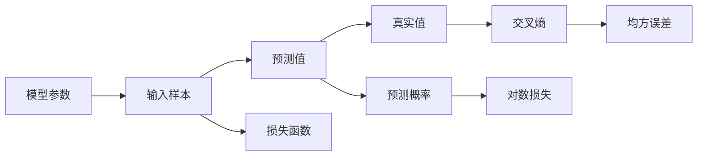

                 

## 1. 背景介绍

在机器学习和深度学习的领域，损失函数（Loss Function）扮演着至关重要的角色。它不仅用于度量模型预测与真实值之间的误差，还是优化算法中反传播梯度的基础。合理设计损失函数是构建有效模型的关键步骤。本文将深入探讨损失函数的原理、选择和应用，帮助读者理解其核心思想和实践技巧。

## 2. 核心概念与联系

### 2.1 核心概念概述

损失函数（Loss Function）是用来衡量模型预测值与真实值之间差距的函数。在监督学习中，模型的目标是使得损失函数最小化，即尽可能使预测结果接近真实值。常见的损失函数包括均方误差（MSE）、交叉熵（Cross-Entropy）等。

**均方误差**（Mean Squared Error, MSE）：衡量预测值与真实值之间的平均差距。适用于回归任务，表达式为：

$$
\text{MSE} = \frac{1}{n} \sum_{i=1}^{n} (y_i - \hat{y_i})^2
$$

其中，$y_i$ 为真实值，$\hat{y_i}$ 为模型预测值，$n$ 为样本总数。

**交叉熵**（Cross-Entropy）：用于衡量预测值与真实值之间的概率差异，适用于分类任务，表达式为：

$$
\text{CE} = -\frac{1}{n} \sum_{i=1}^{n} \sum_{j=1}^{C} y_{ij} \log \hat{y_{ij}}
$$

其中，$C$ 为类别数，$y_{ij}$ 表示样本 $i$ 属于类别 $j$ 的真实概率，$\hat{y_{ij}}$ 表示模型预测样本 $i$ 属于类别 $j$ 的概率。

**对数损失**（Log Loss）：与交叉熵类似，但仅适用于二分类任务，表达式为：

$$
\text{Log Loss} = -\frac{1}{n} \sum_{i=1}^{n} (y_i \log \hat{y_i} + (1-y_i) \log (1-\hat{y_i}))
$$

### 2.2 核心概念原理和架构的 Mermaid 流程图



该图展示了损失函数的工作流程。模型参数接收输入样本后，输出预测值和预测概率。真实值与预测值（或预测概率）之间的差距通过交叉熵、均方误差或对数损失计算，得到损失值。

## 3. 核心算法原理 & 具体操作步骤

### 3.1 算法原理概述

损失函数的设计和选择是深度学习模型构建的重要步骤。一个合理的损失函数应具有以下几个特点：

- **可导性**：损失函数应可导，以便于通过梯度下降等优化算法更新模型参数。
- **非负性**：损失函数值应非负，表示模型预测值与真实值之间的不一致程度。
- **凸性**：损失函数应为凸函数，确保优化过程收敛于全局最小值。
- **可分解性**：损失函数应易于分解计算，便于并行处理大规模数据集。

### 3.2 算法步骤详解

设计损失函数的步骤如下：

1. **确定任务类型**：根据任务是回归、分类还是序列预测等类型，选择合适的损失函数。
2. **选择损失函数**：根据具体问题的特点，选择合适的损失函数。
3. **计算损失**：根据损失函数表达式，计算每个样本的损失值。
4. **计算平均损失**：将所有样本的损失值求和，并除以样本数，得到平均损失。
5. **反向传播**：计算损失对模型参数的梯度，用于参数更新。

### 3.3 算法优缺点

**优点**：

- **易于理解**：损失函数提供了模型预测与真实值之间差距的量化指标。
- **指导优化**：通过最小化损失函数，指导模型的参数更新，优化预测性能。
- **广泛适用**：适用于各类监督学习任务，选择适当的损失函数即可。

**缺点**：

- **依赖于问题定义**：不同任务需要不同的损失函数，需要根据问题特点进行选择。
- **复杂度较高**：设计一个合理的损失函数需要考虑多个因素，复杂度较高。
- **可能存在局部最优解**：优化过程中可能陷入局部最优解，影响模型性能。

### 3.4 算法应用领域

损失函数广泛应用于各种监督学习任务中，包括回归、分类、序列预测等。不同领域的应用场景下，选择合适的损失函数至关重要。

- **回归任务**：如房价预测、股票价格预测等，常用均方误差（MSE）作为损失函数。
- **分类任务**：如图像分类、文本分类等，常用交叉熵（CE）作为损失函数。
- **序列预测任务**：如语音识别、机器翻译等，常用CTC（Connectionist Temporal Classification）损失或序列交叉熵作为损失函数。

## 4. 数学模型和公式 & 详细讲解 & 举例说明

### 4.1 数学模型构建

假设有一个二分类任务，模型预测结果为 $\hat{y}$，真实结果为 $y$。常用的损失函数包括对数损失（Log Loss）和交叉熵（Cross-Entropy Loss）。

**对数损失**：

$$
\text{Log Loss} = -y \log \hat{y} - (1-y) \log (1-\hat{y})
$$

**交叉熵损失**：

$$
\text{CE Loss} = -(y \log \hat{y} + (1-y) \log (1-\hat{y}))
$$

### 4.2 公式推导过程

以交叉熵损失为例，推导其表达式。设样本 $x$ 的真实标签为 $y$，模型预测的标签概率为 $\hat{y}$，则交叉熵损失为：

$$
\text{CE Loss} = -y \log \hat{y} - (1-y) \log (1-\hat{y})
$$

在二分类任务中，$y$ 取值为 0 或 1，$\hat{y}$ 取值范围为 [0, 1]。交叉熵损失是衡量预测概率与真实标签差异的有效指标，通常用于多分类任务。

### 4.3 案例分析与讲解

考虑一个简单的二分类任务，样本 $x$ 的真实标签为 $y=1$，模型预测的标签概率为 $\hat{y}=0.7$。使用交叉熵损失进行计算：

$$
\text{CE Loss} = -1 \log 0.7 - 0 = -0.3567
$$

若 $\hat{y}=0.3$，则交叉熵损失为：

$$
\text{CE Loss} = -1 \log 0.3 - 0 = -0.4055
$$

可以看出，当模型预测更接近真实标签时，交叉熵损失更小。

## 5. 项目实践：代码实例和详细解释说明

### 5.1 开发环境搭建

使用 Python 和 PyTorch 搭建深度学习模型训练环境。

1. 安装 PyTorch：

```bash
pip install torch torchvision torchaudio
```

2. 准备数据集：使用 PyTorch 的数据集加载器（`torch.utils.data.Dataset`）和数据加载器（`torch.utils.data.DataLoader`）。

### 5.2 源代码详细实现

以二分类任务为例，使用 PyTorch 实现交叉熵损失函数的计算。

```python
import torch
import torch.nn as nn

class CrossEntropyLoss(nn.Module):
    def __init__(self):
        super(CrossEntropyLoss, self).__init__()
        
    def forward(self, inputs, targets):
        return torch.nn.functional.cross_entropy(inputs, targets)
```

在训练过程中，使用交叉熵损失函数计算模型预测值与真实标签之间的差异。

```python
import torch.optim as optim

model = YourModel()
criterion = CrossEntropyLoss()
optimizer = optim.SGD(model.parameters(), lr=0.01)

for epoch in range(10):
    for i, (inputs, targets) in enumerate(train_loader):
        optimizer.zero_grad()
        outputs = model(inputs)
        loss = criterion(outputs, targets)
        loss.backward()
        optimizer.step()
```

### 5.3 代码解读与分析

**CrossEntropyLoss 类**：继承自 PyTorch 的 `nn.Module`，定义了交叉熵损失函数的前向传播方法 `forward`，接收模型的预测值 `inputs` 和真实标签 `targets`，返回交叉熵损失。

**训练循环**：遍历训练数据集，使用交叉熵损失函数计算模型预测与真实标签之间的差异，并通过反向传播更新模型参数。

### 5.4 运行结果展示

在训练过程中，使用交叉熵损失可以有效地优化模型参数，提高模型的预测准确率。

## 6. 实际应用场景

损失函数在各种实际应用场景中均有广泛应用。

### 6.1 图像分类

在图像分类任务中，常用的损失函数包括交叉熵（CE）和均方误差（MSE）。交叉熵适用于多分类任务，均方误差适用于回归任务。

### 6.2 自然语言处理

在自然语言处理任务中，交叉熵（CE）是常用的损失函数，特别适用于文本分类、情感分析等分类任务。

### 6.3 语音识别

在语音识别任务中，使用 CTC（Connectionist Temporal Classification）损失函数，可以处理序列数据的预测问题。

## 7. 工具和资源推荐

### 7.1 学习资源推荐

- **《深度学习》（Ian Goodfellow, Yoshua Bengio, Aaron Courville 著）**：系统介绍深度学习的基本概念、算法和应用。
- **Coursera《Deep Learning》课程**：由深度学习领域的权威专家 Andrew Ng 教授主讲，提供深入浅出的课程讲解。
- **PyTorch 官方文档**：提供详细的 PyTorch 使用指南和示例代码。

### 7.2 开发工具推荐

- **PyTorch**：开源深度学习框架，提供灵活的张量计算和自动微分功能。
- **TensorFlow**：由 Google 开发的深度学习框架，支持分布式训练和部署。
- **Keras**：高级神经网络 API，易于使用，适合快速原型开发。

### 7.3 相关论文推荐

- **A Deep Learning Approach to Optimal Machine Learning**（J. V. Duchi et al.）：介绍深度学习中的损失函数及其优化方法。
- **Fast R-CNN**：介绍 R-CNN 系列算法，并使用 CTC 损失函数进行目标检测。
- **Attention is All You Need**：介绍 Transformer 模型及其对自注意力机制的应用。

## 8. 总结：未来发展趋势与挑战

### 8.1 研究成果总结

损失函数是深度学习模型构建的重要组成部分，其设计和使用对模型性能有着决定性影响。当前，常用的损失函数包括均方误差、交叉熵和对数损失等。未来，随着深度学习应用场景的不断扩展，需要设计新的损失函数来应对复杂的实际问题。

### 8.2 未来发展趋势

1. **多任务学习**：未来的深度学习模型可能会同时优化多个任务，设计新的损失函数以支持多任务学习。
2. **自适应损失**：针对不同数据分布，设计自适应损失函数，提高模型的泛化能力。
3. **模型融合**：将多种损失函数融合，提升模型的鲁棒性和性能。
4. **非凸优化**：探索非凸优化的损失函数，解决传统优化算法可能陷入局部最优的问题。

### 8.3 面临的挑战

1. **损失函数设计复杂**：不同任务和数据分布需要不同的损失函数，设计复杂。
2. **计算资源消耗高**：大规模数据集训练和验证可能导致计算资源消耗高。
3. **优化算法选择**：选择合适的优化算法对损失函数的效果影响较大，需要根据问题特点进行选择。

### 8.4 研究展望

未来的研究需要进一步探索损失函数的设计和优化，提高模型的性能和泛化能力。同时，需要开发新的优化算法，解决损失函数在实际应用中面临的挑战。

## 9. 附录：常见问题与解答

**Q1: 如何选择合适的损失函数？**

A: 根据任务类型选择适当的损失函数。回归任务使用均方误差（MSE），分类任务使用交叉熵（CE）或对数损失（Log Loss）。

**Q2: 损失函数设计需要考虑哪些因素？**

A: 损失函数设计需要考虑任务的特性、数据分布、优化算法等因素。

**Q3: 损失函数的优化算法有哪些？**

A: 常用的优化算法包括梯度下降（SGD）、Adam、RMSprop 等。

**Q4: 如何处理异常值？**

A: 在损失函数中加入正则化项或使用鲁棒损失函数，处理异常值对模型性能的影响。

**Q5: 损失函数有哪些类型？**

A: 损失函数包括均方误差（MSE）、交叉熵（CE）、对数损失（Log Loss）、CTC 损失等。

---

作者：禅与计算机程序设计艺术 / Zen and the Art of Computer Programming

