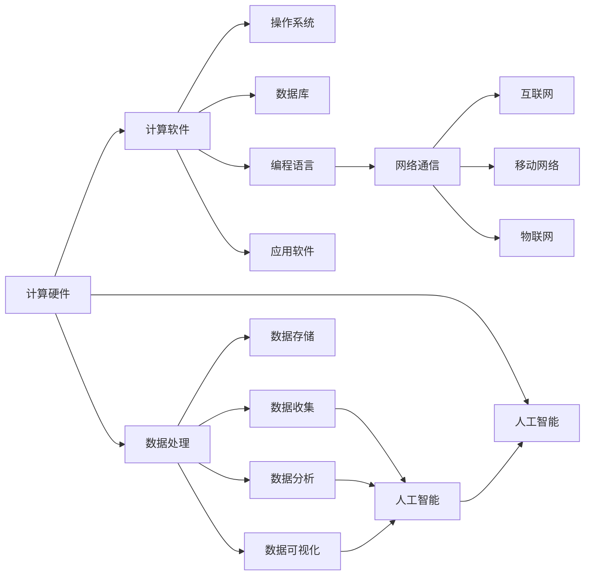

                 

# 推动社会进步的动力：人类计算的积极影响

## 1. 背景介绍

### 1.1 问题由来
随着科技的飞速发展，人类社会正处于数字化、智能化的转型关键时期。在这一进程中，计算技术的迅猛演进扮演着至关重要的角色。它不仅是推动社会进步的重要动力，更是驱动经济、政治、文化等多方面变革的关键因素。从互联网到人工智能，从大数据到区块链，每一次技术突破都深刻地改变了人类的生产生活方式。

计算技术的进步不仅带来了生产力的巨大提升，还推动了社会结构、教育模式、价值观的深刻变革。计算成为现代社会基础设施之一，改变了传统行业的游戏规则，催生了新的经济模式，塑造了全新的社会生态。

### 1.2 问题核心关键点
计算技术对社会进步的积极影响主要体现在以下几个方面：

1. **提升生产力**：自动化、智能化生产流程大幅提高了效率和生产规模，降低了生产成本。
2. **优化资源配置**：大数据和人工智能技术帮助实现资源的最优分配，减少浪费，提高资源利用率。
3. **促进社会公平**：计算技术在教育、医疗等领域的应用，缩小了不同群体之间的差距，提升了社会公平性。
4. **创新驱动**：计算技术是推动科技创新的引擎，带来了新材料、新药物、新能源等领域的重大突破。
5. **社会治理**：计算技术在智慧城市、公共安全等领域的应用，提高了社会治理的效率和效果。

### 1.3 问题研究意义
研究计算技术的积极影响，不仅有助于理解和把握计算技术在社会进步中的作用，还能为未来技术的发展方向提供宝贵的参考。这种研究具有以下重要意义：

1. **促进科学决策**：为政策制定者提供基于数据的决策依据，优化政策设计，提高政府治理能力。
2. **加速技术创新**：为技术开发者提供方向指引，推动更多计算技术的突破和应用。
3. **提升公众意识**：提高社会对计算技术的认识，增强公众的科技素养和创新意识。
4. **构建和谐社会**：通过计算技术在教育、医疗等领域的广泛应用，构建更加公平、包容、可持续的社会。

## 2. 核心概念与联系

### 2.1 核心概念概述

计算技术是现代社会发展的重要驱动力，涉及计算机硬件、软件、网络、数据等多方面。以下是几个核心概念的简要介绍：

- **计算硬件**：包括CPU、GPU、FPGA等，是计算能力的基础。
- **计算软件**：包括操作系统、数据库、编程语言、应用软件等，提供计算资源的抽象和管理。
- **网络通信**：包括互联网、移动网络、物联网等，为计算资源和信息提供传输渠道。
- **数据处理**：包括数据收集、存储、分析、可视化等，是计算技术的重要应用方向。
- **人工智能**：利用计算技术构建的智能系统，如机器学习、深度学习、自然语言处理等。

这些核心概念相互关联，共同构成了计算技术的生态系统。下面通过一个Mermaid流程图来展示它们之间的联系：



这个流程图展示了计算技术的各个核心组件及其相互关系。其中，硬件提供计算能力，软件提供资源管理和抽象，网络提供数据传输，数据处理则直接服务于人工智能的应用。

### 2.2 核心概念原理和架构的 Mermaid 流程图


## 3. 核心算法原理 & 具体操作步骤
### 3.1 算法原理概述

计算技术的积极影响可以通过多种算法和模型来体现。以下是几个关键算法的概述：

- **机器学习**：通过数据训练模型，学习数据分布和规律，应用于分类、预测、聚类等任务。
- **深度学习**：使用多层神经网络，模拟人脑处理复杂数据的能力，应用于图像识别、语音识别、自然语言处理等。
- **强化学习**：通过与环境互动，优化策略，应用于游戏、机器人控制、自动驾驶等。
- **分布式计算**：将任务分解为多个子任务，分布式执行，提升计算效率和资源利用率。
- **云计算**：提供按需的计算资源，支持弹性扩展，降低计算成本。

这些算法和模型通过计算技术的应用，极大地推动了社会进步。下面将以机器学习为例，详细介绍其操作步骤。

### 3.2 算法步骤详解

机器学习算法的核心步骤包括数据准备、模型训练、模型评估和模型应用：

1. **数据准备**：收集和预处理数据，包括数据清洗、特征工程、数据分割等。
2. **模型训练**：使用训练集数据，通过迭代优化，学习数据分布和规律。
3. **模型评估**：使用测试集数据，评估模型性能，如准确率、召回率、F1值等。
4. **模型应用**：将训练好的模型应用于实际场景，进行预测、分类、聚类等任务。

以图像识别为例，具体步骤如下：

1. **数据准备**：收集大量的标注图像数据，进行数据增强、数据清洗和数据分割，将数据集划分为训练集、验证集和测试集。
2. **模型训练**：使用深度卷积神经网络（CNN）模型，在训练集上进行反向传播，更新模型参数，学习图像特征。
3. **模型评估**：在验证集上评估模型性能，调整模型参数，避免过拟合。
4. **模型应用**：将训练好的模型应用于实际场景，对新的图像进行识别，输出预测结果。

### 3.3 算法优缺点

机器学习算法的优点包括：

- **高精度**：通过大量数据训练，学习数据分布和规律，实现高精度的预测和分类。
- **灵活性**：适用于多种任务，如分类、聚类、回归等。
- **可解释性**：可以通过特征重要性分析，解释模型决策过程。

其缺点包括：

- **数据依赖**：需要大量标注数据进行训练，获取高质量标注数据的成本较高。
- **计算资源消耗大**：训练复杂模型需要高性能计算资源，如GPU、TPU等。
- **模型复杂度高**：模型参数量大，解释性和可维护性较差。

### 3.4 算法应用领域

机器学习算法在多个领域得到广泛应用，以下是几个典型应用：

1. **医疗领域**：通过机器学习算法，对患者数据进行分析和预测，辅助医生诊断和治疗。
2. **金融领域**：利用机器学习算法，进行风险评估、欺诈检测、信用评分等。
3. **零售领域**：通过机器学习算法，进行客户行为分析、推荐系统、库存管理等。
4. **制造业**：利用机器学习算法，进行故障预测、质量控制、生产调度等。
5. **交通领域**：通过机器学习算法，进行交通流量预测、自动驾驶、智能交通管理等。

## 4. 数学模型和公式 & 详细讲解 & 举例说明

### 4.1 数学模型构建

在机器学习中，常用的数学模型包括线性回归、逻辑回归、支持向量机、决策树等。这里以线性回归模型为例，展示其构建和求解过程。

线性回归模型假设输入变量 $x$ 和输出变量 $y$ 之间存在线性关系，即 $y = wx + b$，其中 $w$ 为权重向量，$b$ 为偏置项。模型的目标是找到最优的 $w$ 和 $b$，使得预测值与真实值之间的误差最小化。

### 4.2 公式推导过程

线性回归模型的最小化目标是：

$$
\min_{w, b} \frac{1}{2N} \sum_{i=1}^N (y_i - wx_i - b)^2
$$

其中 $N$ 为样本数量，$(y_i, x_i)$ 为第 $i$ 个样本的真实值和输入值。

使用梯度下降法求解上述最小化问题，最小化目标函数的一阶导数为：

$$
\frac{\partial}{\partial w} \frac{1}{2N} \sum_{i=1}^N (y_i - wx_i - b)^2 = \frac{1}{N} \sum_{i=1}^N (y_i - wx_i - b)x_i
$$

$$
\frac{\partial}{\partial b} \frac{1}{2N} \sum_{i=1}^N (y_i - wx_i - b)^2 = \frac{1}{N} \sum_{i=1}^N (y_i - wx_i - b)
$$

通过求解上述导数为零的方程，即可得到最优的 $w$ 和 $b$。

### 4.3 案例分析与讲解

以房价预测为例，展示线性回归模型的应用。

假设有一个房屋数据集，包括房间数量、面积、位置等特征，以及对应的房价。使用线性回归模型对房价进行预测，步骤如下：

1. **数据准备**：收集房屋数据集，进行数据清洗和特征工程。
2. **模型训练**：将数据集划分为训练集和测试集，使用训练集对模型进行训练，得到最优的 $w$ 和 $b$。
3. **模型评估**：在测试集上评估模型性能，如均方误差（MSE）、均方根误差（RMSE）等。
4. **模型应用**：将训练好的模型应用于新的房屋数据，预测其价格。

通过上述步骤，可以实现对房价的预测，帮助房地产市场决策。

## 5. 项目实践：代码实例和详细解释说明

### 5.1 开发环境搭建

在进行机器学习项目实践前，需要准备开发环境。以下是使用Python进行机器学习开发的环境配置流程：

1. 安装Python：从官网下载并安装Python，创建虚拟环境。
2. 安装必要的包：安装NumPy、Pandas、Scikit-learn、TensorFlow等机器学习相关的Python包。
3. 配置开发工具：安装PyCharm、Jupyter Notebook等开发工具，用于编写代码和可视化分析。

完成上述步骤后，即可在虚拟环境中开始机器学习项目实践。

### 5.2 源代码详细实现

以下是使用Scikit-learn进行线性回归模型训练的Python代码实现：

```python
from sklearn.linear_model import LinearRegression
from sklearn.metrics import mean_squared_error

# 加载数据集
X = ...
y = ...

# 创建模型
model = LinearRegression()

# 训练模型
model.fit(X, y)

# 预测房价
new_X = ...
y_pred = model.predict(new_X)

# 评估模型
mse = mean_squared_error(y, y_pred)
print(f"均方误差: {mse}")
```

### 5.3 代码解读与分析

以上代码实现了线性回归模型的训练、预测和评估过程。具体解读如下：

**数据加载**：使用Scikit-learn库中的函数加载数据集，包括特征和标签。

**模型创建**：创建线性回归模型对象，使用默认参数。

**模型训练**：使用训练集数据对模型进行训练，得到最优的模型参数。

**模型预测**：使用训练好的模型对新的数据进行预测，输出预测结果。

**模型评估**：计算预测值与真实值之间的均方误差，评估模型性能。

## 6. 实际应用场景

### 6.1 智慧医疗

机器学习在智慧医疗领域的应用，极大地提高了医疗服务质量和效率。通过数据分析和预测，帮助医生进行诊断、治疗和康复管理，降低了医疗成本，提高了患者满意度。

具体应用包括：

- **疾病预测**：利用机器学习算法，分析患者历史数据，预测疾病发展趋势，提前进行干预。
- **影像识别**：使用深度学习算法，对医学影像进行分析和诊断，如CT、MRI等。
- **个性化治疗**：通过分析患者的基因数据和病历记录，制定个性化治疗方案，提高治疗效果。

### 6.2 金融风险管理

机器学习在金融领域的应用，提高了风险评估和管理的精准度。通过数据分析和预测，帮助金融机构进行风险控制、欺诈检测和信用评分，降低了损失风险。

具体应用包括：

- **信用评分**：利用机器学习算法，分析客户的财务数据和行为数据，预测其信用风险，决定是否发放贷款。
- **欺诈检测**：使用机器学习算法，分析交易数据，识别异常交易行为，防范欺诈行为。
- **投资组合管理**：通过分析市场数据和历史表现，预测股票价格和市场趋势，制定投资策略。

### 6.3 智能交通

机器学习在智能交通领域的应用，提高了交通管理和运营效率。通过数据分析和预测，优化交通流量，减少拥堵，提高安全性和舒适度。

具体应用包括：

- **交通流量预测**：利用机器学习算法，分析交通数据，预测交通流量变化，优化交通信号灯控制。
- **自动驾驶**：使用机器学习算法，对交通环境进行分析，辅助自动驾驶车辆进行路径规划和安全决策。
- **智能停车**：通过数据分析和预测，优化停车资源分配，减少交通拥堵，提高停车效率。

## 7. 工具和资源推荐

### 7.1 学习资源推荐

为了帮助开发者系统掌握机器学习的理论和实践，这里推荐一些优质的学习资源：

1. **《机器学习》课程**：由斯坦福大学Andrew Ng教授主讲的在线课程，深入浅出地介绍了机器学习的基本概念和算法。
2. **《深度学习》书籍**：Ian Goodfellow等人编写的经典深度学习教材，系统地介绍了深度学习的基本原理和应用。
3. **Kaggle平台**：全球最大的数据科学竞赛平台，提供了丰富的数据集和模型实现，是学习和实践机器学习的重要平台。
4. **机器学习社区**：如GitHub、Stack Overflow等，汇集了大量开源项目和代码，是学习和分享机器学习实践经验的好地方。

通过对这些资源的学习实践，相信你一定能够快速掌握机器学习的基本方法和应用，并用于解决实际的业务问题。

### 7.2 开发工具推荐

高效的开发离不开优秀的工具支持。以下是几款用于机器学习开发的常用工具：

1. **Python**：目前最流行的编程语言之一，提供了丰富的机器学习库和数据处理库，如NumPy、Pandas、Scikit-learn等。
2. **TensorFlow**：由Google开发的深度学习框架，支持分布式计算和自动微分，是深度学习应用的重要工具。
3. **PyTorch**：由Facebook开发的深度学习框架，支持动态计算图和自动微分，是深度学习应用的另一重要工具。
4. **Jupyter Notebook**：交互式的代码编辑器，支持代码块、数据可视化、代码共享等功能，是数据科学和机器学习开发的重要工具。
5. **Kaggle**：提供数据集和竞赛平台，支持数据预处理、模型训练和评估，是数据科学和机器学习实践的重要平台。

合理利用这些工具，可以显著提升机器学习项目的开发效率，加快创新迭代的步伐。

### 7.3 相关论文推荐

机器学习的发展离不开学术界的持续研究。以下是几篇奠基性的相关论文，推荐阅读：

1. **《机器学习》书籍**：Tom Mitchell等人编写的经典机器学习教材，系统地介绍了机器学习的基本原理和应用。
2. **《深度学习》书籍**：Ian Goodfellow等人编写的深度学习教材，系统地介绍了深度学习的基本原理和应用。
3. **《机器学习实战》书籍**：Peter Harrington编写的实战性较强的机器学习教材，提供了大量的代码实现和实例。
4. **《数据挖掘与统计学习》书籍**：B rendi和Y Freund等人编写的数据挖掘教材，系统地介绍了数据挖掘和统计学习的基本原理和应用。
5. **《Pattern Recognition and Machine Learning》书籍**：Christopher Bishop等人编写的模式识别教材，系统地介绍了模式识别和机器学习的基本原理和应用。

这些论文代表了大数据和机器学习的发展脉络。通过学习这些前沿成果，可以帮助研究者把握学科前进方向，激发更多的创新灵感。

## 8. 总结：未来发展趋势与挑战

### 8.1 总结

本文对机器学习技术在推动社会进步中的积极影响进行了全面系统的介绍。首先阐述了机器学习技术的背景和意义，明确了机器学习在提升生产力、优化资源配置、促进社会公平等方面的重要价值。其次，从原理到实践，详细讲解了机器学习的数学模型和操作步骤，给出了机器学习项目开发的完整代码实例。同时，本文还广泛探讨了机器学习技术在智慧医疗、金融风险管理、智能交通等多个行业领域的应用前景，展示了机器学习范式的巨大潜力。此外，本文精选了机器学习技术的各类学习资源，力求为读者提供全方位的技术指引。

通过本文的系统梳理，可以看到，机器学习技术已成为现代社会的重要基础设施，极大地推动了社会进步和经济发展。未来，伴随计算技术的进一步演进，机器学习将发挥更大的作用，带来更多的创新和突破。

### 8.2 未来发展趋势

展望未来，机器学习技术的发展呈现以下几个趋势：

1. **深度学习的发展**：深度学习是机器学习的重要分支，随着计算能力的提升和算法的优化，深度学习将在更多领域得到应用，提升机器学习模型的性能和效果。
2. **强化学习的应用**：强化学习在自动驾驶、机器人控制等领域的应用前景广阔，未来将进一步推动这些领域的创新和突破。
3. **多模态学习**：多模态学习将融合视觉、语音、文本等多种数据源，提升机器学习模型的感知能力和决策能力。
4. **联邦学习**：联邦学习通过在分布式环境中训练模型，保护数据隐私和安全性，适用于医疗、金融等领域的应用。
5. **自动化机器学习**：自动化机器学习通过自动化模型选择、超参数优化、模型评估等环节，降低机器学习应用的门槛，推动机器学习技术的普及和应用。

这些趋势表明，机器学习技术在未来将更加广泛地应用于各个领域，成为推动社会进步的重要动力。

### 8.3 面临的挑战

尽管机器学习技术已经取得了瞩目成就，但在迈向更加智能化、普适化应用的过程中，它仍面临诸多挑战：

1. **数据质量问题**：机器学习模型的效果高度依赖数据质量，数据偏差、缺失、噪声等问题可能导致模型性能下降。
2. **计算资源需求**：机器学习模型往往需要高性能计算资源，如GPU、TPU等，对于小规模企业，计算资源成本较高。
3. **模型可解释性**：机器学习模型的决策过程缺乏可解释性，难以理解和调试，尤其是在医疗、金融等高风险领域，对模型输出进行解释和验证尤为重要。
4. **模型鲁棒性**：机器学习模型在面对异常数据和攻击时，容易产生误判，如何提升模型的鲁棒性和安全性是重要研究方向。
5. **隐私保护**：机器学习模型在处理敏感数据时，如何保护用户隐私，防止数据泄露，是重要的法律和伦理问题。

### 8.4 研究展望

面对机器学习技术面临的挑战，未来的研究需要在以下几个方面寻求新的突破：

1. **数据清洗和增强**：改进数据预处理技术，减少数据噪声和偏差，提升数据质量。
2. **模型压缩和加速**：通过模型压缩、剪枝、量化等技术，优化模型结构和计算效率，降低计算资源需求。
3. **可解释性和鲁棒性**：开发可解释的机器学习模型，提升模型决策的可理解性和透明度，同时提升模型的鲁棒性和安全性。
4. **隐私保护技术**：开发隐私保护算法，保护用户隐私，防止数据泄露和滥用。
5. **跨领域模型融合**：将不同领域的知识和技术进行融合，提升机器学习模型的泛化能力和应用范围。

这些研究方向的探索，将推动机器学习技术向更加智能化、普适化、安全化的方向发展，为社会进步和经济发展提供更加强大的动力。

## 9. 附录：常见问题与解答

**Q1: 什么是机器学习?**

A: 机器学习是一种通过数据训练模型，学习数据分布和规律的技术。通过模型预测和分类，实现对未知数据的预测和推理。

**Q2: 机器学习有哪些常见算法?**

A: 机器学习的常见算法包括线性回归、逻辑回归、决策树、支持向量机、随机森林、深度学习等。

**Q3: 如何评估机器学习模型的性能?**

A: 机器学习模型的性能评估通常使用准确率、召回率、F1值、均方误差等指标，这些指标反映了模型在不同数据集上的表现。

**Q4: 机器学习在实际应用中有哪些优势?**

A: 机器学习在实际应用中具有以下优势：高精度、灵活性、自动化、可解释性等。

**Q5: 机器学习在医疗领域的应用有哪些?**

A: 机器学习在医疗领域的应用包括疾病预测、影像识别、个性化治疗等，通过数据分析和预测，帮助医生进行诊断和治疗。

---

作者：禅与计算机程序设计艺术 / Zen and the Art of Computer Programming

