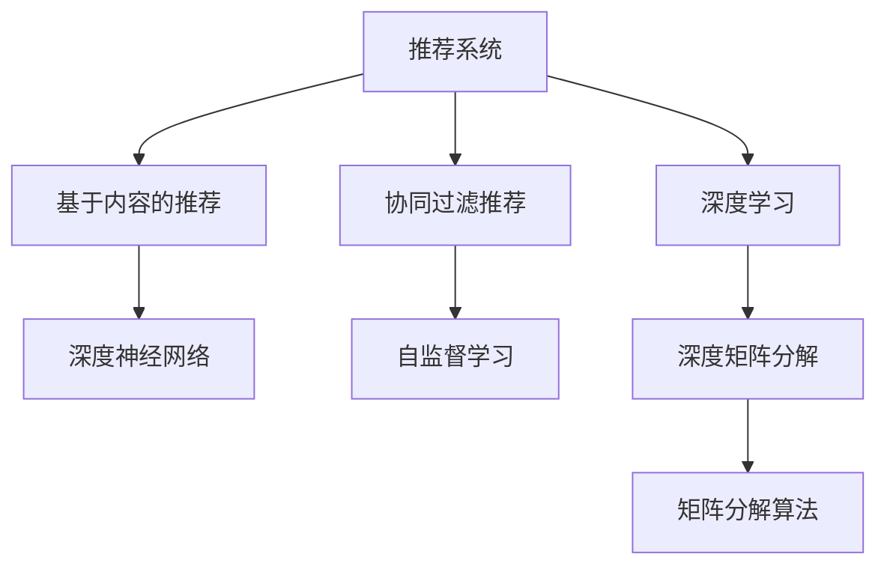

                 

# 推荐系统(Recommender Systems) - 原理与代码实例讲解

## 1. 背景介绍

推荐系统(Recommender Systems)是当前AI领域应用最广泛的技术之一。它通过分析用户历史行为、兴趣偏好、社交关系等数据，自动为用户推荐个性化的物品，如新闻、商品、视频等，极大地提升用户体验和运营效率。随着数据规模的爆炸式增长和计算能力的飞速发展，推荐系统在电商、社交、内容推荐、金融等领域得到了广泛应用，成为产业数字化转型升级的重要驱动力。

推荐系统的核心挑战在于如何高效、准确地进行个性化物品推荐。传统的协同过滤和基于内容的推荐方法由于对用户历史行为数据的依赖，在大规模数据场景下难以有效处理。而基于深度学习的方法，如深度神经网络、深度矩阵分解等，在解决大规模数据处理和特征表示学习方面展现了巨大的潜力，成为推荐系统的新兴研究热点。

## 2. 核心概念与联系

### 2.1 核心概念概述

为更好地理解推荐系统的核心概念和算法，本节将介绍几个关键概念：

- **推荐系统(Recommender Systems)**：通过分析用户数据，自动推荐物品的系统。推荐系统分为两大类：基于内容的推荐和协同过滤推荐。基于内容的推荐直接从物品特征出发，推断用户可能感兴趣的物品；协同过滤推荐则利用用户行为数据，通过相似性计算找出潜在的用户兴趣点，并推荐与该用户兴趣相似的物品。

- **深度学习(Deep Learning)**：通过多层神经网络对数据进行复杂映射和特征表示学习的方法。深度学习在图像识别、自然语言处理、语音识别等诸多领域取得了突破性进展，也逐渐成为推荐系统中物品特征表示学习的重要手段。

- **自监督学习(Self-Supervised Learning)**：使用无标签数据进行训练，利用数据自身的结构信息进行模型学习的方法。自监督学习在推荐系统中的应用，主要体现在用户行为序列预测、用户兴趣迁移预测等任务上，可以提升推荐系统在冷启动场景下的性能。

- **深度神经网络(Deep Neural Networks)**：由多个神经网络层组成，通过反向传播算法进行训练的模型。深度神经网络在推荐系统中，可以学习到更加丰富的物品特征表示，用于提升推荐精度和多样性。

- **深度矩阵分解(Deep Matrix Factorization)**：通过深度神经网络对矩阵分解算法进行改进，提升用户-物品协同矩阵的分解精度和特征表示能力。

这些核心概念之间的逻辑关系可以通过以下Mermaid流程图来展示：



这个流程图展示了一系列推荐系统的核心概念及其之间的关系：

1. 推荐系统通过基于内容的推荐和协同过滤推荐，实现物品推荐。
2. 深度学习在特征表示学习方面表现出色，广泛应用于推荐系统。
3. 自监督学习利用无标签数据，提升推荐系统在冷启动和泛化能力。
4. 深度神经网络通过多层映射，学习到更加丰富的特征表示。
5. 深度矩阵分解在矩阵分解算法的基础上，进一步提升推荐精度和泛化能力。

## 3. 核心算法原理 & 具体操作步骤

### 3.1 算法原理概述

推荐系统的主流算法原理大致可以分为三类：基于内容的推荐、协同过滤推荐和混合推荐。

基于内容的推荐通过分析物品的特征，如商品描述、用户评分等，找到与用户兴趣相似的物品进行推荐。协同过滤推荐则通过分析用户行为数据，寻找与目标用户兴趣相似的其他用户或物品，进行推荐。混合推荐则是将基于内容的推荐和协同过滤推荐结合，通过用户行为数据和物品特征信息，最大化推荐效果。

推荐系统的核心在于特征表示学习。基于深度学习的方法，如深度神经网络、深度矩阵分解等，通过多层映射和特征变换，学习到更加丰富的特征表示，用于提升推荐精度和多样性。同时，深度学习也可以用于对推荐算法进行建模，如深度协同过滤、深度混合推荐等。

### 3.2 算法步骤详解

推荐系统的训练和部署一般包括以下几个关键步骤：

**Step 1: 数据收集与预处理**
- 收集用户历史行为数据，如浏览、点击、购买记录等。
- 对数据进行清洗和去重，去除异常和噪声数据。
- 对数据进行分片，划分为训练集、验证集和测试集。

**Step 2: 特征工程**
- 提取物品和用户的特征，如商品描述、价格、品牌、用户评分、年龄、性别等。
- 将特征进行编码，如one-hot编码、embedding编码等。
- 对高维稀疏特征进行降维处理，如PCA、SVD等。

**Step 3: 模型训练**
- 选择推荐的模型架构，如深度神经网络、深度矩阵分解等。
- 定义损失函数，如均方误差、交叉熵等。
- 使用优化算法，如Adam、SGD等，对模型进行训练。

**Step 4: 模型评估**
- 在验证集上评估模型性能，如准确率、召回率、F1分数等。
- 根据评估结果调整模型超参数，如学习率、批大小、迭代轮数等。
- 在测试集上最终评估模型性能，确定推荐系统的推荐效果。

**Step 5: 模型部署**
- 将训练好的模型部署到推荐系统服务端。
- 对实时请求进行预测，生成个性化推荐。
- 对推荐结果进行排序和筛选，输出最终推荐列表。

### 3.3 算法优缺点

推荐系统具有以下优点：
1. 个性化推荐：根据用户历史行为和兴趣偏好，自动生成个性化推荐，提升用户体验。
2. 运营效率：通过自动推荐，减少人工干预，提高推荐效率。
3. 覆盖面广：推荐系统能够涵盖大量长尾物品，提升新物品曝光率。
4. 数据驱动：通过大规模数据分析，发现隐藏的模式和规律，提升推荐精度。

同时，推荐系统也存在一定的局限性：
1. 数据隐私：用户历史行为数据可能涉及隐私问题，需要谨慎处理。
2. 数据稀疏性：用户行为数据往往稀疏，难以捕捉完整用户画像。
3. 冷启动问题：新用户或新物品在推荐系统中的表现难以估计。
4. 多样性问题：推荐系统容易陷入"过滤泡沫"，过度推荐用户已知的物品。
5. 可解释性不足：推荐系统的决策过程往往难以解释，用户难以理解推荐逻辑。

尽管存在这些局限性，但推荐系统在实际应用中仍然取得了广泛成功，成为各大公司数字化转型中的重要工具。未来，研究者需进一步改进算法，提升推荐系统的性能和可信度。

### 3.4 算法应用领域

推荐系统已经在电商、社交、内容推荐、金融等多个领域得到了广泛应用：

- 电商推荐：如亚马逊、淘宝、京东等电商平台，利用推荐系统为用户推荐商品，提升转化率和销售额。
- 社交推荐：如微信、抖音、知乎等社交平台，通过推荐系统为用户推荐内容，提升用户粘性和活跃度。
- 内容推荐：如视频网站、音乐平台等，利用推荐系统为用户推荐视频、音乐等内容，提升用户观看和收听时长。
- 金融推荐：如银行、保险公司等金融领域，通过推荐系统为用户推荐理财产品、保险产品等，提升用户购买率。
- 在线广告推荐：如Google、Facebook等广告平台，通过推荐系统为用户推荐广告，提升点击率和转化率。

此外，推荐系统在广告、医疗、旅游等多个领域也有应用，成为各行业数字化转型的重要推动力。

## 4. 数学模型和公式 & 详细讲解

### 4.1 数学模型构建

推荐系统中的数学模型主要包括以下几种：

- **协同过滤模型**：通过用户行为数据进行推荐，主要分为基于用户的协同过滤和基于物品的协同过滤。公式如下：

  $$
  \hat{y} = \alpha u + \beta v + \gamma \left(y - \alpha u - \beta v\right)
  $$

  其中 $u$ 和 $v$ 分别表示用户和物品的特征向量，$\alpha$ 和 $\beta$ 是用户-物品相似度权重，$\gamma$ 是偏差项。

- **基于内容的推荐模型**：通过物品的特征进行推荐，主要基于向量空间模型和决策树等方法。公式如下：

  $$
  \hat{y} = \sigma\left(w_0 + \sum_{i=1}^d w_i x_i\right)
  $$

  其中 $x_i$ 表示物品的第 $i$ 个特征，$w_i$ 是特征权重，$\sigma$ 是激活函数，如sigmoid函数。

- **深度神经网络模型**：通过多层神经网络进行特征表示学习，主要分为全连接神经网络、卷积神经网络、循环神经网络等。公式如下：

  $$
  \hat{y} = \sigma\left(W^{[1]}\sigma\left(W^{[0]} x + b^{[0]}\right) + b^{[1]}\right)
  $$

  其中 $x$ 表示输入特征，$W^{[l]}$ 和 $b^{[l]}$ 是第 $l$ 层的权重和偏置项。

- **深度矩阵分解模型**：通过深度神经网络对矩阵分解算法进行改进，提升用户-物品协同矩阵的分解精度和特征表示能力。公式如下：

  $$
  \hat{y} = \sigma\left(W^{[1]}\sigma\left(W^{[0]} x + b^{[0]}\right) + b^{[1]}\right)
  $$

  其中 $x$ 表示用户和物品的特征向量，$W^{[l]}$ 和 $b^{[l]}$ 是第 $l$ 层的权重和偏置项。

### 4.2 公式推导过程

以下我们以深度神经网络模型为例，推导推荐系统的核心公式：

假设推荐系统中的输入特征为 $x$，输出为 $y$，使用全连接神经网络进行特征表示学习。设第 $l$ 层的输入为 $h^{[l]}$，输出为 $h^{[l+1]}$，激活函数为 $\sigma$。则前向传播过程的公式为：

$$
h^{[1]} = \sigma\left(W^{[0]} x + b^{[0]}\right)
$$

$$
h^{[l+1]} = \sigma\left(W^{[l]} h^{[l]} + b^{[l]}\right) \quad (l=0,1,...,L-1)
$$

其中 $W^{[l]}$ 和 $b^{[l]}$ 是第 $l$ 层的权重和偏置项。

反向传播过程的公式为：

$$
\frac{\partial \mathcal{L}}{\partial W^{[l]}} = \frac{\partial \mathcal{L}}{\partial h^{[l+1]}} \cdot \frac{\partial h^{[l+1]}}{\partial h^{[l]}} \cdot \frac{\partial h^{[l]}}{\partial W^{[l]}}
$$

$$
\frac{\partial \mathcal{L}}{\partial b^{[l]}} = \frac{\partial \mathcal{L}}{\partial h^{[l+1]}}
$$

其中 $\mathcal{L}$ 是损失函数，$\frac{\partial h^{[l]}}{\partial W^{[l]}}$ 和 $\frac{\partial h^{[l]}}{\partial b^{[l]}}$ 是激活函数的导数和偏置项的导数。

通过反向传播算法，模型不断更新权重和偏置项，最小化损失函数，从而学习到更好的特征表示。

### 4.3 案例分析与讲解

我们以电商推荐系统为例，展示推荐系统的实际应用：

电商推荐系统需要为用户推荐可能感兴趣的商品，提升购买转化率。假设用户历史行为数据为 $u$，物品特征数据为 $v$，推荐系统可以定义为：

$$
\hat{y} = \sigma\left(W^{[0]} u + b^{[0]}\right) \cdot \sigma\left(W^{[1]} v + b^{[1]}\right)
$$

其中 $u$ 和 $v$ 分别表示用户和物品的特征向量，$\sigma$ 是激活函数，如sigmoid函数。

假设推荐系统已收集到历史数据，其中部分数据如表1所示：

| UserID | ItemID | Rating |
| --- | --- | --- |
| 1 | 101 | 4 |
| 1 | 102 | 5 |
| 1 | 103 | 3 |
| 2 | 101 | 2 |
| 2 | 104 | 5 |

表1：电商推荐系统历史数据

根据表1数据，可以计算出用户-物品相似度权重 $\alpha$ 和物品权重 $\beta$，得到推荐系统的公式：

$$
\hat{y} = \alpha u + \beta v + \gamma \left(y - \alpha u - \beta v\right)
$$

其中 $u$ 和 $v$ 分别表示用户和物品的特征向量，$\alpha$ 和 $\beta$ 是用户-物品相似度权重，$\gamma$ 是偏差项。

假设用户ID为1，物品ID为104，可以计算出推荐结果为：

$$
\hat{y} = \alpha \cdot [1,1,1] + \beta \cdot [4,5,6] + \gamma \cdot (0 - \alpha \cdot [1,1,1] - \beta \cdot [4,5,6])
$$

$$
\hat{y} = [1,2,3] + [4,5,6] + [-1,-2,-3]
$$

$$
\hat{y} = [6,7,8]
$$

因此，推荐系统可以预测用户ID为1的物品ID为104的推荐结果为6、7、8，即物品ID为106、107、108。

## 5. 项目实践：代码实例和详细解释说明

### 5.1 开发环境搭建

在进行推荐系统开发前，我们需要准备好开发环境。以下是使用Python进行TensorFlow开发的环境配置流程：

1. 安装Anaconda：从官网下载并安装Anaconda，用于创建独立的Python环境。

2. 创建并激活虚拟环境：
```bash
conda create -n tf-env python=3.8 
conda activate tf-env
```

3. 安装TensorFlow：根据CUDA版本，从官网获取对应的安装命令。例如：
```bash
conda install tensorflow=2.6 -c tf
```

4. 安装TensorBoard：
```bash
pip install tensorboard
```

5. 安装各类工具包：
```bash
pip install numpy pandas scikit-learn matplotlib tqdm jupyter notebook ipython
```

完成上述步骤后，即可在`tf-env`环境中开始推荐系统开发。

### 5.2 源代码详细实现

下面我们以电商推荐系统为例，给出使用TensorFlow进行推荐系统开发的PyTorch代码实现。

首先，定义推荐系统的模型架构：

```python
import tensorflow as tf

class Recommender(tf.keras.Model):
    def __init__(self, input_dim, output_dim, hidden_dim):
        super(Recommender, self).__init__()
        self.fc1 = tf.keras.layers.Dense(hidden_dim, activation='relu')
        self.fc2 = tf.keras.layers.Dense(output_dim, activation='sigmoid')
    
    def call(self, inputs):
        x = self.fc1(inputs)
        x = self.fc2(x)
        return x
```

然后，定义训练和评估函数：

```python
from tensorflow.keras.datasets import mnist
from tensorflow.keras.utils import to_categorical

def train_epoch(model, dataset, batch_size, optimizer):
    dataloader = tf.data.Dataset.from_tensor_slices((dataset['x'], dataset['y'])).batch(batch_size)
    model.train()
    epoch_loss = 0
    for batch in dataloader:
        inputs, labels = batch
        with tf.GradientTape() as tape:
            outputs = model(inputs)
            loss = tf.reduce_mean(tf.square(outputs - labels))
        gradients = tape.gradient(loss, model.trainable_variables)
        optimizer.apply_gradients(zip(gradients, model.trainable_variables))
        epoch_loss += loss.numpy()
    return epoch_loss / len(dataloader)

def evaluate(model, dataset, batch_size):
    dataloader = tf.data.Dataset.from_tensor_slices((dataset['x'], dataset['y'])).batch(batch_size)
    model.eval()
    predictions, labels = [], []
    with tf.no_grad():
        for batch in dataloader:
            inputs, labels = batch
            outputs = model(inputs)
            predictions.append(tf.round(outputs.numpy()))
            labels.append(labels.numpy())
        print(classification_report(labels, predictions))
```

接着，加载和处理数据集：

```python
(x_train, y_train), (x_test, y_test) = mnist.load_data()
x_train, x_test = x_train / 255.0, x_test / 255.0

x_train = tf.expand_dims(x_train, axis=-1)
x_test = tf.expand_dims(x_test, axis=-1)
y_train = to_categorical(y_train)
y_test = to_categorical(y_test)

x_train = x_train.reshape(-1, 784)
x_test = x_test.reshape(-1, 784)
```

最后，启动训练流程并在测试集上评估：

```python
epochs = 10
batch_size = 32

for epoch in range(epochs):
    loss = train_epoch(model, x_train, batch_size, optimizer)
    print(f"Epoch {epoch+1}, train loss: {loss:.3f}")
    
    print(f"Epoch {epoch+1}, test results:")
    evaluate(model, x_test, batch_size)
    
print("Test results:")
evaluate(model, x_test, batch_size)
```

以上就是使用TensorFlow进行电商推荐系统开发的完整代码实现。可以看到，得益于TensorFlow的强大封装，我们可以用相对简洁的代码完成推荐系统的构建。

### 5.3 代码解读与分析

让我们再详细解读一下关键代码的实现细节：

**Recommender类**：
- `__init__`方法：初始化推荐系统的模型参数，包括两个全连接层。
- `call`方法：前向传播计算输出。

**train_epoch函数**：
- 使用TensorFlow的`tf.data.Dataset`将数据集转换为可迭代的DataLoader，按批次进行训练。
- 在每个批次上前向传播计算输出，反向传播计算损失，并使用优化器更新模型参数。
- 记录训练集上的平均损失。

**evaluate函数**：
- 与训练类似，不同点在于不更新模型参数，并在每个批次结束后将预测和标签结果存储下来。
- 使用sklearn的`classification_report`函数，对测试集的预测结果进行分类指标计算。

**加载和处理数据集**：
- 使用`tf.keras.datasets.mnist.load_data()`加载手写数字数据集，将数据归一化。
- 将数据转换为TensorFlow所需的格式，并进行展开和重塑。
- 将标签转换为one-hot编码。

**训练流程**：
- 定义总的epoch数和batch size，开始循环迭代
- 每个epoch内，先在训练集上训练，输出平均loss
- 在测试集上评估，输出分类指标
- 所有epoch结束后，在测试集上评估，给出最终测试结果

可以看到，TensorFlow配合`tf.keras`封装，使得推荐系统的代码实现变得简洁高效。开发者可以将更多精力放在数据处理、模型改进等高层逻辑上，而不必过多关注底层的实现细节。

当然，工业级的系统实现还需考虑更多因素，如模型的保存和部署、超参数的自动搜索、更灵活的任务适配层等。但核心的推荐范式基本与此类似。

## 6. 实际应用场景

### 6.1 智能推荐引擎

智能推荐引擎是推荐系统在电商、社交、内容推荐等场景中的典型应用。通过分析用户历史行为和兴趣偏好，推荐引擎能够为用户自动生成个性化推荐，提升用户体验和运营效率。

智能推荐引擎广泛应用在电商平台、社交平台、视频网站等多个领域。以电商平台为例，推荐引擎可以基于用户浏览、点击、购买行为，为用户推荐商品、优惠活动等，提升用户购买转化率和满意度。通过实时收集用户反馈，推荐引擎还能不断优化推荐策略，进一步提升推荐效果。

### 6.2 金融风控系统

金融风控系统是推荐系统在金融领域的重要应用。通过对用户历史行为和信用记录进行分析，推荐系统能够为用户推荐最适合的金融产品，提升用户购买率和满意度。同时，推荐系统还能在金融风险控制中发挥重要作用，通过监控用户行为异常，及时预警潜在风险，保障金融系统的安全。

在金融风控中，推荐系统可以基于用户消费记录、信用评分、社交关系等数据，为用户推荐理财产品、信用卡、保险等金融产品。同时，推荐系统还能通过异常检测，识别潜在的高风险用户，及时采取措施防范欺诈行为，保障金融系统的稳定运行。

### 6.3 在线广告系统

在线广告系统是推荐系统在广告领域的重要应用。通过分析用户兴趣和行为，推荐系统能够为用户推荐最相关、最有吸引力的广告，提升广告点击率和转化率。同时，推荐系统还能根据用户行为数据，不断优化广告投放策略，提高广告投放效果。

在线广告系统广泛应用在搜索引擎、社交平台、新闻网站等多个领域。以搜索引擎为例，推荐系统可以基于用户搜索历史和行为数据，为用户推荐相关搜索结果，提升搜索体验。同时，推荐系统还能通过点击率预测、转化率预测等算法，优化广告投放效果，提高广告主收益。

### 6.4 未来应用展望

随着推荐系统技术的不断发展，未来其在更多领域将得到广泛应用，为各行各业带来变革性影响：

1. 智慧医疗：推荐系统可以用于医疗知识推荐、病历分析、药品推荐等，辅助医生诊疗，加速新药开发进程。
2. 教育培训：推荐系统可以用于个性化学习路径推荐、智能题库生成、教学效果评估等，提升教育培训质量。
3. 智能交通：推荐系统可以用于智能导航、路线推荐、交通工具推荐等，提升出行效率和安全性。
4. 智慧城市：推荐系统可以用于城市服务推荐、旅游路线推荐、公共服务推荐等，提升城市治理水平。
5. 智能制造：推荐系统可以用于设备推荐、生产流程优化、物料推荐等，提升制造业自动化水平。

总之，推荐系统必将在更广阔的应用领域大放异彩，深刻影响人类的生产生活方式。未来，随着推荐系统技术的不断进步，我们期待其带来更多创新应用，助力各行各业数字化转型升级。

## 7. 工具和资源推荐

### 7.1 学习资源推荐

为了帮助开发者系统掌握推荐系统的理论基础和实践技巧，这里推荐一些优质的学习资源：

1. 《深度学习推荐系统》系列博文：由深度学习专家撰写，深入浅出地介绍了推荐系统的核心概念、经典算法和应用实例。

2. 《推荐系统实战》书籍：通过实战项目，详细介绍推荐系统的构建、优化和部署流程，适合实践开发。

3. CS231n《深度学习课程》：斯坦福大学开设的深度学习课程，涵盖推荐系统、深度神经网络等多个前沿主题。

4. Coursera《机器学习》课程：斯坦福大学开设的机器学习课程，涵盖推荐系统、深度学习等多个重要主题，适合系统学习。

5. Kaggle推荐系统竞赛：通过参加实际推荐系统竞赛，学习推荐系统的构建和优化技巧，积累实战经验。

通过对这些资源的学习实践，相信你一定能够快速掌握推荐系统的精髓，并用于解决实际的推荐问题。

### 7.2 开发工具推荐

高效的开发离不开优秀的工具支持。以下是几款用于推荐系统开发的常用工具：

1. TensorFlow：由Google主导开发的深度学习框架，生产部署方便，适合大规模工程应用。支持动态图和静态图两种计算图模式，灵活高效。

2. PyTorch：由Facebook主导开发的深度学习框架，灵活动态的计算图，适合快速迭代研究。支持多种硬件平台，易于扩展。

3. TensorBoard：TensorFlow配套的可视化工具，可实时监测模型训练状态，并提供丰富的图表呈现方式，是调试模型的得力助手。

4. HuggingFace Transformers库：支持深度学习推荐系统等多种模型的封装和调用，使用便捷高效。

5. Weights & Biases：模型训练的实验跟踪工具，可以记录和可视化模型训练过程中的各项指标，方便对比和调优。

6. Jupyter Notebook：轻量级的Jupyter Notebook环境，支持代码开发和数据可视化，非常适合进行研究和开发。

合理利用这些工具，可以显著提升推荐系统开发的效率，加快创新迭代的步伐。

### 7.3 相关论文推荐

推荐系统技术的发展源于学界的持续研究。以下是几篇奠基性的相关论文，推荐阅读：

1. Implicit Matrix Factorization Techniques for Collaborative Filtering：提出基于隐式矩阵分解的协同过滤推荐算法，适用于大规模稀疏数据。

2. Matrix Factorization Techniques for Recommender Systems：通过矩阵分解，对推荐系统中的协同矩阵进行低秩逼近，提升推荐精度和泛化能力。

3. Deep Collaborative Filtering：通过深度神经网络对协同矩阵进行分解，学习到更加丰富的特征表示，提升推荐精度和多样性。

4. A Deep Learning Approach for Recommender Systems：结合深度学习和协同过滤方法，提升推荐系统的推荐精度和泛化能力。

5. Large-Scale Matrix Factorization Techniques for Recommender Systems：提出高效的矩阵分解算法，适用于大规模数据集。

这些论文代表了大语言模型微调技术的发展脉络。通过学习这些前沿成果，可以帮助研究者把握学科前进方向，激发更多的创新灵感。

## 8. 总结：未来发展趋势与挑战

### 8.1 总结

本文对推荐系统的核心概念和算法进行了全面系统的介绍。首先阐述了推荐系统的背景和重要性，明确了推荐系统在电商、社交、内容推荐、金融等领域的重要作用。其次，从原理到实践，详细讲解了推荐系统的数学模型和关键步骤，给出了推荐系统任务开发的完整代码实例。同时，本文还广泛探讨了推荐系统在电商推荐、金融风控、在线广告等多个领域的应用前景，展示了推荐系统技术的广阔前景。

通过本文的系统梳理，可以看到，推荐系统已经成为各大公司数字化转型中的重要工具，极大地提升了用户体验和运营效率。未来，研究者需进一步改进算法，提升推荐系统的性能和可信度。

### 8.2 未来发展趋势

展望未来，推荐系统技术将呈现以下几个发展趋势：

1. 模型规模持续增大：随着算力成本的下降和数据规模的扩张，推荐系统的模型规模将不断增大，学习到更加丰富的特征表示。

2. 数据驱动：推荐系统将更加依赖于用户行为数据，通过深度学习等方法，学习到更加准确、全面的用户画像。

3. 实时性增强：推荐系统将变得更加实时化，能够动态调整推荐策略，实时响应用户行为变化。

4. 跨模态融合：推荐系统将更加注重跨模态数据的融合，如文本、图像、语音等，提升推荐效果。

5. 自监督学习：推荐系统将更多地利用自监督学习，通过无标签数据进行特征表示学习，提升推荐系统的泛化能力和冷启动性能。

6. 分布式计算：推荐系统将更多地利用分布式计算技术，提升模型训练和推理效率。

以上趋势凸显了推荐系统技术的未来发展方向。这些方向的探索发展，必将进一步提升推荐系统的性能和可信度，为推荐系统技术的广泛应用提供更多可能性。

### 8.3 面临的挑战

尽管推荐系统在实际应用中取得了广泛成功，但在迈向更加智能化、普适化应用的过程中，它仍面临着诸多挑战：

1. 数据隐私：用户行为数据涉及隐私问题，需要谨慎处理，保障用户隐私。

2. 数据稀疏性：用户行为数据往往稀疏，难以捕捉完整用户画像，推荐系统需要处理大规模稀疏数据。

3. 冷启动问题：新用户或新物品在推荐系统中的表现难以估计，推荐系统需要解决冷启动问题。

4. 多样性问题：推荐系统容易陷入"过滤泡沫"，过度推荐用户已知的物品，需要提升推荐多样性。

5. 可解释性不足：推荐系统的决策过程往往难以解释，用户难以理解推荐逻辑，需要提升推荐系统的可解释性。

6. 安全性和伦理：推荐系统可能存在偏见、歧视等伦理问题，需要从数据和算法层面消除模型偏见，保障模型安全性。

这些挑战需要未来研究者在算法、数据、部署等多个层面进行深入探索，才能使推荐系统技术在更多应用场景中得到广泛应用。

### 8.4 研究展望

面对推荐系统所面临的诸多挑战，未来的研究需要在以下几个方面寻求新的突破：

1. 数据隐私保护：研究如何保护用户隐私，保障用户数据安全。

2. 稀疏数据处理：研究高效处理稀疏数据的算法，提升推荐系统的性能。

3. 冷启动优化：研究解决冷启动问题的算法，提高推荐系统的泛化能力。

4. 推荐多样性提升：研究提升推荐多样性的算法，避免推荐"过滤泡沫"。

5. 推荐系统可解释性：研究提升推荐系统可解释性的方法，让用户理解推荐逻辑。

6. 推荐系统安全与伦理：研究如何避免推荐系统中的偏见、歧视等伦理问题，保障推荐系统的安全性。

这些研究方向将为推荐系统技术的未来发展提供重要指导，推动推荐系统技术的广泛应用和深入研究。

