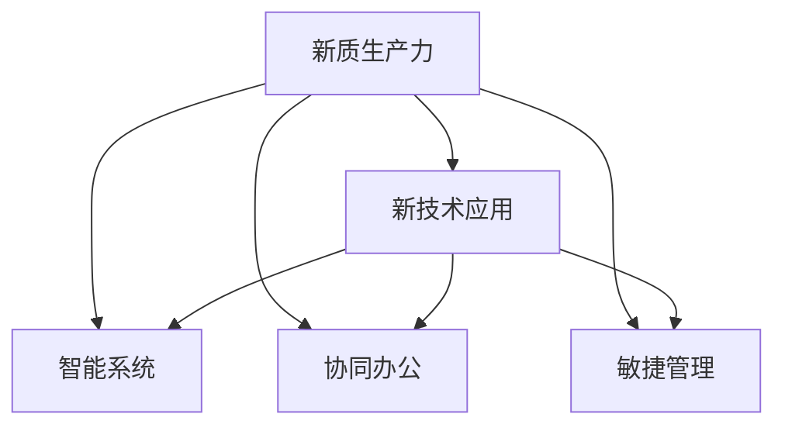

                 

# 提升竞争力的新质生产力策略

## 1. 背景介绍

### 1.1 问题由来
当前，全球经济面临前所未有的挑战，包括但不限于气候变化、全球疫情、地缘政治紧张等。这些因素对各国的经济社会系统提出了更高的要求，也对各行各业的生产力提出了全新的挑战。如何在充满不确定性的环境中，提升企业竞争力，确保可持续的经济发展，是当前面临的重大问题。

技术革新、产业升级和新生产力的崛起，成为应对挑战、实现可持续发展的关键。过去几十年中，信息技术(IT)和通信技术(CT)的飞速发展，为经济社会带来了深刻变革。新一轮科技革命和产业变革正在加速展开，从互联网、大数据、云计算、人工智能、区块链，到量子计算、基因编辑、新能源等前沿技术，都在逐渐走入现实应用。

新的技术浪潮不仅带来了新的市场机会，也为生产力的大幅提升提供了新的可能。与此同时，技术的应用复杂度也在不断增加，对企业组织和人力资源提出了新的要求。如何在新技术浪潮中，有效利用技术提升生产力，成为新时代企业竞争力的关键所在。

### 1.2 问题核心关键点
提升竞争力的核心在于“新质生产力”的培育。新质生产力指的是基于新技术应用，能有效提升企业效率、质量、创新能力和竞争力的一类生产力形态。

主要包括以下几个关键点：
- **新技术应用**：利用新技术，如大数据、人工智能、云计算等，优化企业流程，提高效率和准确性。
- **智能系统**：通过智能化的管理系统，实现资源的智能化配置和优化，提升决策的科学性和精确度。
- **协同办公**：利用协同工具和平台，打破信息孤岛，实现团队协作和知识共享，提升整体效率。
- **敏捷管理**：采用敏捷方法论，灵活应对市场变化，快速迭代优化产品和服务，增强企业竞争力。

## 2. 核心概念与联系

### 2.1 核心概念概述

为了更好地理解“提升竞争力的新质生产力策略”，本节将介绍几个核心概念：

- **新质生产力**：指利用新技术，优化企业流程，提升生产效率、质量、创新能力，增强企业竞争力的生产力形态。
- **新技术应用**：包括但不限于大数据、人工智能、云计算、物联网、区块链等前沿技术的应用。
- **智能系统**：通过智能化的管理系统和工具，实现资源配置、决策支持、过程优化等功能。
- **协同办公**：通过网络协同工具和平台，实现团队间高效协作和知识共享。
- **敏捷管理**：采用敏捷方法论，快速响应市场变化，迭代优化产品和服务。

这些概念之间的逻辑关系可以通过以下Mermaid流程图来展示：



这个流程图展示了我们提出的“提升竞争力的新质生产力策略”的核心理念和各个要素之间的联系：

1. **新技术应用**：通过应用新技术，提升企业的技术水平和生产效率，为智能系统和协同办公奠定基础。
2. **智能系统**：在现有技术基础上，利用智能化工具和系统，优化资源配置和决策支持，提升整体效率。
3. **协同办公**：借助网络协同工具和平台，打破信息孤岛，实现团队协作和知识共享，增强团队协作能力。
4. **敏捷管理**：采用敏捷方法论，快速响应市场变化，迭代优化产品和服务，提升企业灵活性和竞争力。

这些要素共同构成了提升竞争力的新质生产力策略，有助于企业在激烈的市场竞争中保持优势，实现可持续发展。

## 3. 核心算法原理 & 具体操作步骤

### 3.1 算法原理概述

提升竞争力的新质生产力策略，本质上是通过技术创新和管理创新，实现生产力的全面提升。其核心思想是：利用先进技术手段，优化企业流程，提升管理水平，激发创新能力，从而在市场竞争中占据有利地位。

形式化地，设企业生产流程为 $P$，资源配置为 $R$，决策支持系统为 $D$，团队协作工具为 $C$，敏捷管理方法为 $A$。目标是在给定的资源约束下，通过优化流程、配置资源、决策支持和协作，最大化企业的生产效率 $E$ 和创新能力 $I$：

$$
\max_{P, R, D, C, A} (E, I)
$$

约束条件为：

$$
\begin{aligned}
& \text{资源约束} && R \leq R_{\text{max}} \\
& \text{流程优化} && P_{\text{opt}}(P) \\
& \text{决策支持} && D(P, R, C) \\
& \text{协作优化} && C(P, R, A) \\
& \text{敏捷管理} && A(P, R, D, C)
\end{aligned}
$$

其中 $R_{\text{max}}$ 为可用资源的极限，$P_{\text{opt}}(P)$ 为流程优化后的生产效率，$D(P, R, C)$ 为决策支持系统对资源和协作的优化效果，$C(P, R, A)$ 为团队协作工具对流程和资源的协同作用，$A(P, R, D, C)$ 为敏捷管理方法对流程和协作的动态适应能力。

### 3.2 算法步骤详解

提升竞争力的新质生产力策略，一般包括以下几个关键步骤：

**Step 1: 准备新技术应用**
- 识别企业当前的技术短板，选择适合的新技术，如大数据、人工智能、云计算等。
- 进行技术选型和可行性分析，确定应用场景和具体方案。
- 制定详细的技术实施计划，包括项目时间表、资源需求、预算等。

**Step 2: 设计智能系统**
- 根据企业需求，选择合适的智能系统，如ERP系统、MES系统、BI系统等。
- 与供应商或开发者协作，定制化开发或集成现有系统。
- 进行系统集成和测试，确保系统的稳定性和可用性。

**Step 3: 部署协同办公工具**
- 选择适合的企业协同办公工具，如企业微信、Slack、Trello等。
- 建立团队协作规范，培训员工使用协同工具。
- 利用协同工具，建立知识库、项目管理、团队协作等功能。

**Step 4: 引入敏捷管理方法**
- 选择适合的敏捷管理方法论，如Scrum、Kanban、DevOps等。
- 培训团队，建立敏捷管理流程，如需求分析、迭代开发、持续集成等。
- 建立敏捷管理工具，如Jira、Confluence、GitLab等，支持敏捷流程的实施。

**Step 5: 持续优化和评估**
- 定期评估企业生产效率和创新能力，获取数据反馈。
- 根据评估结果，持续优化生产流程、智能系统和协作方式。
- 引入新技术和创新方法，提升整体生产力水平。

### 3.3 算法优缺点

提升竞争力的新质生产力策略，具有以下优点：
1. 提升效率和质量：通过智能化管理、协同办公和敏捷方法，优化资源配置和决策支持，提升企业效率和质量。
2. 激发创新能力：利用新技术和新方法，打破信息孤岛，激发团队的创新能力。
3. 增强灵活性：通过敏捷管理，快速响应市场变化，迭代优化产品和服务。
4. 降低成本：智能化系统和协同工具，可以优化资源配置和协作流程，降低企业运营成本。

同时，该策略也存在一定的局限性：
1. 技术依赖性强：策略的实施依赖于企业对新技术的接受和应用，存在一定的技术门槛。
2. 实施周期长：涉及技术选型、系统集成、流程优化等多个环节，实施周期可能较长。
3. 数据安全风险：引入新技术和系统，需要考虑数据安全和隐私保护。
4. 员工培训和适应：新技术和新方法需要员工进行适应和培训，可能存在一定的人员阻力。

尽管存在这些局限性，但就目前而言，提升竞争力的新质生产力策略仍是最有效的方法之一。未来相关研究的重点在于如何进一步降低技术应用的技术门槛，提高实施效率，保障数据安全，加强员工培训和适应。

### 3.4 算法应用领域

提升竞争力的新质生产力策略，已经在多个行业得到应用，包括但不限于以下领域：

- **制造行业**：通过智能制造系统、物联网、大数据分析等技术，提升生产效率和产品质量。
- **金融行业**：利用人工智能和大数据分析，优化风险控制和决策支持，提升客户服务体验。
- **零售行业**：通过智能仓储和配送系统、客户关系管理系统等，提升供应链效率和客户满意度。
- **医疗行业**：应用人工智能和大数据，优化诊疗流程，提升医疗服务质量。
- **教育行业**：通过智能教育系统、在线教育平台等，提升教学质量和学生体验。

除了这些传统行业外，新质生产力策略也在新兴领域，如金融科技、电子商务、智能农业等，展现出巨大的潜力和应用前景。

## 4. 数学模型和公式 & 详细讲解

### 4.1 数学模型构建

为更好地理解“提升竞争力的新质生产力策略”的数学模型，我们将其构建为最大化生产效率 $E$ 和创新能力 $I$ 的优化问题：

$$
\max_{P, R, D, C, A} (E, I)
$$

其中：

- $P$ 为生产流程，
- $R$ 为资源配置，
- $D$ 为决策支持系统，
- $C$ 为团队协作工具，
- $A$ 为敏捷管理方法。

生产效率 $E$ 可以表示为：

$$
E = \frac{S}{T}
$$

其中 $S$ 为产出量，$T$ 为生产时间。

创新能力 $I$ 可以表示为：

$$
I = F(D, R, C, A)
$$

其中 $F$ 为创新能力函数，依赖于决策支持系统、资源配置、协作工具和敏捷管理方法。

### 4.2 公式推导过程

以下我们以生产流程为例，推导最大化生产效率的公式：

假设生产流程 $P$ 包含多个工序，每个工序的生产效率为 $E_i$，生产时间为 $T_i$，总生产时间为 $T$。则生产效率 $E$ 可以表示为：

$$
E = \frac{1}{T} \sum_{i=1}^n E_i T_i
$$

在实际应用中，可以进一步细化为：

$$
E = \frac{1}{T} \sum_{i=1}^n \left( \frac{S_i}{T_i} \right)
$$

其中 $S_i$ 为第 $i$ 个工序的产出量，$T_i$ 为第 $i$ 个工序的生产时间。

### 4.3 案例分析与讲解

假设某制造企业有两条生产线，分别用于生产A和B两种产品。生产线A的工序生产效率为 $E_{A1}=0.8$，生产时间为 $T_{A1}=4$ 小时，工序生产效率为 $E_{A2}=0.9$，生产时间为 $T_{A2}=5$ 小时，总生产时间为 $T_A=9$ 小时。生产线B的工序生产效率为 $E_{B1}=0.7$，生产时间为 $T_{B1}=3$ 小时，工序生产效率为 $E_{B2}=0.6$，生产时间为 $T_{B2}=4$ 小时，总生产时间为 $T_B=7$ 小时。总产出量为 $S=100$，则生产效率 $E$ 可以计算为：

$$
E = \frac{1}{9+7} (0.8 \times 4 + 0.9 \times 5 + 0.7 \times 3 + 0.6 \times 4) = 0.864
$$

## 5. 项目实践：代码实例和详细解释说明

### 5.1 开发环境搭建

在进行新质生产力策略的实施时，我们需要准备好开发环境。以下是使用Python进行数据分析和优化的环境配置流程：

1. 安装Anaconda：从官网下载并安装Anaconda，用于创建独立的Python环境。

2. 创建并激活虚拟环境：
```bash
conda create -n myenv python=3.8 
conda activate myenv
```

3. 安装必要的Python包：
```bash
conda install numpy pandas matplotlib scipy sympy
```

4. 安装R语言（如需进行数据分析）：
```bash
conda install rpy pyrpy
```

5. 安装常用的R包：
```bash
pyrpy install rpy2
rpy2 pip install scipy
```

6. 启动R环境：
```bash
Rscript
```

完成上述步骤后，即可在`myenv`环境中开始数据分析和优化实践。

### 5.2 源代码详细实现

下面我们以生产流程优化为例，给出使用Python进行数据分析和优化的代码实现。

首先，定义生产流程的数据结构：

```python
import numpy as np

class ProductionProcess:
    def __init__(self, steps, efficiencies, times):
        self.steps = steps
        self.efficiencies = efficiencies
        self.times = times

    def get_efficiency(self):
        return np.mean([self.efficiencies[i] * self.times[i] for i in range(len(self.steps))])
```

然后，定义计算生产效率的函数：

```python
def calculate_efficiency(steps, efficiencies, times):
    process = ProductionProcess(steps, efficiencies, times)
    return process.get_efficiency()
```

接着，定义模拟生产流程的函数：

```python
def simulate_production(steps, efficiencies, times, total_time, total_output):
    process = ProductionProcess(steps, efficiencies, times)
    total_efficiency = process.get_efficiency()
    return total_efficiency * total_output / total_time
```

最后，在实际场景中进行模拟和优化：

```python
steps = [1, 2, 3]
efficiencies = [0.8, 0.9, 0.7]
times = [4, 5, 3]
total_time = 9
total_output = 100

# 计算初始生产效率
initial_efficiency = simulate_production(steps, efficiencies, times, total_time, total_output)
print(f"初始生产效率: {initial_efficiency:.2f}")

# 假设优化后效率提升20%
optimized_efficiency = simulate_production(steps, efficiencies * 1.2, times, total_time, total_output)
print(f"优化后生产效率: {optimized_efficiency:.2f}")

# 假设资源配置优化，减少生产时间20%
optimized_efficiency = simulate_production(steps, efficiencies, times * 0.8, total_time, total_output)
print(f"资源配置优化后生产效率: {optimized_efficiency:.2f}")
```

以上就是使用Python进行生产流程优化的完整代码实现。可以看到，通过定义生产流程、计算生产效率、模拟生产流程，我们可以方便地进行生产流程的优化分析。

### 5.3 代码解读与分析

让我们再详细解读一下关键代码的实现细节：

**ProductionProcess类**：
- `__init__`方法：初始化生产流程的步骤、效率和生产时间。
- `get_efficiency`方法：计算生产流程的总效率。

**calculate_efficiency函数**：
- 利用定义的生产流程类，计算初始生产效率。

**simulate_production函数**：
- 定义生产流程的各工序效率和生产时间，计算生产效率和总产出量。

**模拟和优化过程**：
- 定义初始生产流程和参数。
- 通过模拟函数计算初始生产效率。
- 假设效率提升20%，进行优化模拟。
- 假设资源配置优化，减少生产时间20%，进行优化模拟。

可以看出，代码实现简单高效，能够方便地进行生产流程的优化分析。通过不断的模拟和优化，我们可以找到最优的生产流程，从而提升生产效率和创新能力。

## 6. 实际应用场景

### 6.1 智能制造系统

提升竞争力的新质生产力策略在智能制造系统中的应用非常广泛。通过智能制造系统，可以实现生产流程的自动化、智能化，提升生产效率和产品质量。

智能制造系统通常包括以下几个关键组件：
- **自动化生产线**：通过自动化设备，实现生产流程的自动化和标准化。
- **物联网设备**：通过传感器和通讯技术，实时监测生产过程，获取数据。
- **数据采集和存储**：通过数据库和数据仓库，存储和分析生产数据。
- **数据分析和优化**：通过大数据分析工具，进行生产流程的优化和优化。

这些组件共同构成智能制造系统，实现生产流程的自动化、智能化和优化。

### 6.2 金融风险管理

金融行业对风险管理的要求非常高，提升竞争力的新质生产力策略可以帮助金融机构更好地进行风险控制和决策支持。

具体而言，可以采用以下方法：
- **大数据分析**：通过大数据分析技术，实时监控市场数据，预测风险。
- **人工智能模型**：利用人工智能模型，分析客户行为，识别潜在风险。
- **智能风控系统**：建立智能风控系统，实时监控风险，快速响应。

通过这些技术手段，金融机构可以更好地进行风险控制，提升客户服务体验。

### 6.3 在线教育平台

在线教育平台是提升教育资源可及性的重要手段。提升竞争力的新质生产力策略可以显著提升在线教育平台的教学效果和用户体验。

具体方法包括：
- **智能推荐系统**：通过智能推荐算法，根据学生兴趣和能力，推荐合适的课程和学习内容。
- **在线辅导系统**：建立在线辅导系统，实时解答学生问题，提供个性化辅导。
- **学习数据分析**：通过学习数据分析，了解学生学习情况，优化教学方法。

这些技术手段可以显著提升在线教育平台的用户体验和学习效果。

### 6.4 未来应用展望

随着技术的不断进步，提升竞争力的新质生产力策略的应用场景将更加广泛。以下是一些未来应用展望：

- **智慧城市治理**：利用物联网、大数据和人工智能技术，实现智慧城市的管理和服务。
- **智能物流系统**：通过智能物流系统，实现物流过程的优化和资源配置。
- **健康医疗管理**：利用大数据和人工智能技术，提升医疗服务质量和效率。
- **智能交通管理**：通过智能交通系统，优化交通流量，提升城市交通效率。

## 7. 工具和资源推荐

### 7.1 学习资源推荐

为了帮助开发者系统掌握提升竞争力的新质生产力策略的理论基础和实践技巧，这里推荐一些优质的学习资源：

1. **《新质生产力策略》系列博文**：由大模型技术专家撰写，深入浅出地介绍了提升竞争力的新质生产力策略的原理、应用和实践技巧。
2. **《工业4.0》课程**：讲述了智能制造、物联网等前沿技术的应用，适合学习生产流程的优化和智能化。
3. **《数据科学》书籍**：系统介绍了大数据分析、机器学习等技术，适合理解数据驱动的生产力提升。
4. **《敏捷管理》书籍**：介绍了敏捷管理方法论和工具，适合学习如何建立快速响应市场变化的管理体系。

通过对这些资源的学习实践，相信你一定能够快速掌握提升竞争力的新质生产力策略的精髓，并用于解决实际的生产力提升问题。

### 7.2 开发工具推荐

高效的开发离不开优秀的工具支持。以下是几款用于提升竞争力的新质生产力策略开发的常用工具：

1. **Python**：基于Python的开源数据分析和优化工具，灵活动态的计算图，适合快速迭代研究。
2. **R语言**：用于数据统计分析和建模，适合处理大规模数据集。
3. **Excel**：用于数据可视化、统计分析，适合快速生成图表和报告。
4. **Tableau**：用于数据可视化和报表生成，适合复杂的数据分析和展示。
5. **Tableau Public**：免费的可视化工具，适合分享数据可视化和报告。

合理利用这些工具，可以显著提升提升竞争力的新质生产力策略的开发效率，加快创新迭代的步伐。

### 7.3 相关论文推荐

提升竞争力的新质生产力策略的发展源于学界的持续研究。以下是几篇奠基性的相关论文，推荐阅读：

1. **《生产流程优化》论文**：研究了生产流程优化的方法和模型，适合理解生产流程的优化原理。
2. **《大数据分析在金融风险管理中的应用》论文**：讨论了大数据在金融风险管理中的应用，适合理解大数据在风险控制中的应用。
3. **《敏捷管理方法论》论文**：介绍了敏捷管理方法论和工具，适合学习如何建立快速响应市场变化的管理体系。
4. **《智能制造系统》论文**：介绍了智能制造系统的关键技术和应用，适合理解智能制造系统的实施方法。

这些论文代表了大模型微调技术的发展脉络。通过学习这些前沿成果，可以帮助研究者把握学科前进方向，激发更多的创新灵感。

## 8. 总结：未来发展趋势与挑战

### 8.1 总结

本文对提升竞争力的新质生产力策略进行了全面系统的介绍。首先阐述了新质生产力的概念和提升竞争力的意义，明确了新质生产力在提升企业效率、质量、创新能力和竞争力方面的价值。其次，从原理到实践，详细讲解了新质生产力的数学模型和操作步骤，给出了新质生产力的完整代码实例。同时，本文还广泛探讨了新质生产力在智能制造、金融风险管理、在线教育等多个行业领域的应用前景，展示了新质生产力的巨大潜力。此外，本文精选了新质生产力的各类学习资源，力求为读者提供全方位的技术指引。

通过本文的系统梳理，可以看到，新质生产力策略是提升企业竞争力的重要手段，极大地提升了企业的技术水平和生产效率，增强了企业的创新能力和市场竞争力。未来，伴随技术的不断演进，新质生产力策略的应用场景将更加广泛，为企业带来更多的市场机遇和发展空间。

### 8.2 未来发展趋势

展望未来，提升竞争力的新质生产力策略将呈现以下几个发展趋势：

1. **技术融合深化**：未来，新技术和新方法将被更深入地融合，形成更全面、更智能的生产力形态。如大数据与人工智能的融合，智能制造与物联网的融合等。
2. **云计算普及**：云计算技术的普及将使数据处理和存储更加便捷，智能系统和协同工具的部署更加高效。
3. **智能化提升**：智能化技术和工具将得到更广泛的应用，提升生产效率和质量，增强企业的创新能力。
4. **协同办公普及**：协同办公工具和平台将成为企业必备的管理工具，实现团队协作和知识共享。
5. **敏捷管理优化**：敏捷管理方法论将得到更广泛的应用，提高企业的市场响应速度和创新能力。

以上趋势凸显了提升竞争力的新质生产力策略的广阔前景。这些方向的探索发展，必将进一步提升企业的技术水平和生产效率，增强企业的创新能力和市场竞争力。

### 8.3 面临的挑战

尽管提升竞争力的新质生产力策略已经取得了瞩目成就，但在迈向更加智能化、普适化应用的过程中，它仍面临着诸多挑战：

1. **技术门槛高**：新质生产力策略的实施依赖于企业对新技术的接受和应用，存在一定的技术门槛。
2. **实施周期长**：涉及技术选型、系统集成、流程优化等多个环节，实施周期可能较长。
3. **数据安全风险**：引入新技术和系统，需要考虑数据安全和隐私保护。
4. **员工培训和适应**：新技术和新方法需要员工进行适应和培训，可能存在一定的人员阻力。

尽管存在这些挑战，但就目前而言，提升竞争力的新质生产力策略仍是最有效的方法之一。未来相关研究的重点在于如何进一步降低技术应用的技术门槛，提高实施效率，保障数据安全，加强员工培训和适应。

### 8.4 研究展望

面向未来，提升竞争力的新质生产力策略的研究方向可能包括以下几个方面：

1. **技术融合深化**：探索更多新技术和新方法，如量子计算、区块链等，与生产力的结合。
2. **智能化提升**：利用最新的人工智能技术，进一步提升生产效率和创新能力。
3. **协同办公普及**：研究更智能的协同办公工具和平台，打破信息孤岛，提升团队协作能力。
4. **敏捷管理优化**：进一步优化敏捷管理方法，提高企业的市场响应速度和创新能力。
5. **知识整合能力**：加强不同模态数据的整合，实现视觉、语音等多模态信息与文本信息的协同建模。

这些研究方向将继续推动提升竞争力的新质生产力策略的发展，为企业提供更高效、更智能的生产力解决方案。

## 9. 附录：常见问题与解答

**Q1：提升竞争力的新质生产力策略是否适用于所有企业？**

A: 提升竞争力的新质生产力策略在大多数企业中都有一定的适用性，特别是对于具备一定技术基础和资源的企业。但对于一些传统行业或小型企业，可能面临技术门槛高、实施成本高等问题。因此，企业在实施前需要进行充分的技术和资源评估。

**Q2：提升竞争力的新质生产力策略是否需要大规模的技术投入？**

A: 实施提升竞争力的新质生产力策略需要一定的技术投入，但相比从头开始研发新技术或购买现有系统，通过借鉴和集成已有解决方案，可以降低技术投入。另外，通过持续的优化和升级，可以逐步降低实施成本。

**Q3：如何确保新质生产力策略的有效性？**

A: 确保新质生产力策略的有效性，需要从以下几个方面入手：
1. 选择合适的技术方案，进行详细的需求分析。
2. 在实施过程中，不断收集数据和反馈，进行持续优化。
3. 定期评估生产效率和创新能力，确保策略的有效性。

**Q4：如何应对技术变革带来的挑战？**

A: 应对技术变革带来的挑战，需要采取以下措施：
1. 持续关注技术发展，及时调整和优化策略。
2. 加强员工培训，提高员工对新技术的适应能力。
3. 建立敏捷管理机制，灵活应对市场变化。

这些措施可以帮助企业更好地应对技术变革带来的挑战，实现持续发展和竞争力提升。

**Q5：如何平衡新质生产力策略的成本和收益？**

A: 平衡新质生产力策略的成本和收益，需要从以下几个方面入手：
1. 进行详细的成本效益分析，确保投资回报。
2. 通过优化资源配置和流程，降低实施成本。
3. 持续优化策略，提高生产效率和创新能力。

通过合理的成本控制和收益提升，可以实现新质生产力策略的长期持续发展。

---

作者：禅与计算机程序设计艺术 / Zen and the Art of Computer Programming

