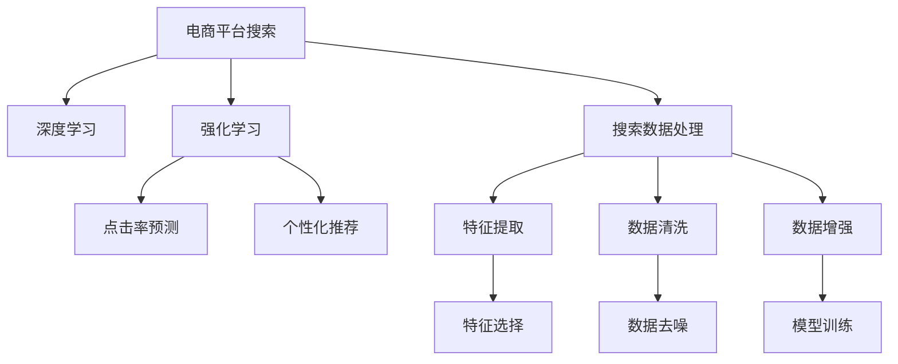

                 

## 1. 背景介绍

### 1.1 问题由来

随着电子商务市场的快速增长，电商平台的用户量和商品种类急剧增加，搜索功能作为用户与平台互动的关键环节，其优化和性能提升成为电商平台关注的焦点。传统的搜索算法，如倒排索引、TF-IDF等，已无法满足现代用户对于个性化、实时性和准确性的需求。人工智能技术，特别是深度学习和强化学习，正在被广泛应用于电商平台的搜索策略优化中，以期提升用户体验和平台业绩。

### 1.2 问题核心关键点

搜索数据分析的核心关键点在于如何利用人工智能技术对用户搜索行为进行建模，通过分析和预测用户意图，优化搜索算法，提供个性化和高质量的搜索结果。这些关键点主要包括：

- **用户行为建模**：利用机器学习模型对用户的历史搜索行为进行建模，理解用户的搜索偏好和需求。
- **搜索结果排序**：通过学习用户点击和转化的历史数据，优化搜索结果排序算法，提升搜索的准确性和相关性。
- **实时更新**：随着用户行为和商品供应的变化，实时更新搜索模型，保持搜索策略的有效性。
- **个性化推荐**：根据用户的搜索历史和偏好，提供个性化的搜索结果和商品推荐。

### 1.3 问题研究意义

研究如何利用人工智能技术优化电商平台搜索策略，对于提升用户体验、增加平台业绩、降低用户流失率具有重要意义。具体而言：

- 提升搜索效果：个性化、精准的搜索结果可以大大提高用户满意度和使用时长。
- 增加用户转化：精准推荐的商品可以提升用户的购买意愿，增加转化率。
- 降低运营成本：优化搜索算法可以减少对人工客服的依赖，提高平台运营效率。
- 加速产品迭代：基于搜索数据分析，可以快速识别用户需求变化，指导产品研发和改进。

## 2. 核心概念与联系

### 2.1 核心概念概述

为更好地理解搜索数据分析的实现机制，本节将介绍几个关键概念：

- **电商平台搜索**：用户通过搜索功能查询特定商品或服务的过程，是用户与平台互动的核心环节。
- **深度学习**：基于人工神经网络的机器学习技术，能够对复杂数据进行高效建模和预测。
- **强化学习**：通过试错反馈不断优化搜索策略，以获得最佳的用户体验。
- **点击率预测**：预测用户点击商品的概率，优化搜索结果排序。
- **个性化推荐**：根据用户历史行为和偏好，推荐相关商品或服务。
- **搜索数据处理**：对用户搜索行为进行数据清洗、特征提取和数据增强，确保搜索分析的准确性和有效性。

这些概念之间的逻辑关系可以通过以下Mermaid流程图来展示：



这个流程图展示了一系列核心概念之间的联系：

1. 用户通过搜索功能进行查询。
2. 基于深度学习和强化学习模型，分析用户搜索行为，预测用户点击和购买概率。
3. 根据预测结果，对搜索结果进行排序和推荐。
4. 对用户搜索数据进行处理，包括特征提取、数据清洗和增强，确保分析的准确性和鲁棒性。

## 3. 核心算法原理 & 具体操作步骤
### 3.1 算法原理概述

基于深度学习和强化学习的搜索数据分析，主要通过以下步骤实现：

1. **用户行为数据收集**：收集用户搜索历史、点击行为、购买记录等数据。
2. **特征工程**：对收集到的数据进行清洗、处理和特征提取，生成可用于模型训练的特征集。
3. **模型训练**：使用深度学习或强化学习模型，对用户行为数据进行建模，生成预测模型。
4. **点击率预测**：利用训练好的模型，预测用户点击特定商品的概率。
5. **结果排序**：根据点击率预测结果，对搜索结果进行排序，提升搜索相关性。
6. **个性化推荐**：根据用户历史行为和搜索偏好，提供个性化的搜索结果和商品推荐。
7. **实时更新**：根据用户行为变化和商品供应情况，实时更新模型，保持搜索策略的有效性。

### 3.2 算法步骤详解

以下是基于深度学习和强化学习的搜索数据分析的详细步骤：

**Step 1: 用户行为数据收集**

电商平台收集用户的搜索历史、点击行为、购买记录等数据，形成用户行为数据集。通常数据集包含以下字段：

- `user_id`：用户唯一标识符。
- `query`：用户搜索关键词。
- `clicks`：用户点击商品ID的序列。
- `conversions`：用户购买商品的序列。
- `timestamps`：事件发生时间戳。

**Step 2: 特征工程**

对用户行为数据进行清洗、处理和特征提取，生成可用于模型训练的特征集。常见特征包括：

- 查询频率、查询时长、查询关键词分布等查询特征。
- 点击次数、点击时长、点击位置、点击顺序等点击特征。
- 购买次数、购买金额、购买时间等转化特征。

使用数据处理工具（如Pandas、Scikit-learn）进行数据清洗和预处理，去除缺失值和异常值，并对数据进行归一化、标准化处理。

**Step 3: 模型训练**

使用深度学习或强化学习模型对用户行为数据进行建模，生成预测模型。常见的深度学习模型包括：

- **点击率预测模型**：如DeepFM、DNN、 wide & deep等，用于预测用户点击特定商品的概率。
- **个性化推荐模型**：如协同过滤、矩阵分解、深度神经网络等，用于生成个性化推荐列表。

使用监督学习算法（如线性回归、逻辑回归、随机森林等）对用户行为数据进行建模，生成预测模型。

**Step 4: 点击率预测**

利用训练好的模型，预测用户点击特定商品的概率。点击率预测模型的输出为点击概率，可作为排序算法的参考指标。

**Step 5: 结果排序**

根据点击率预测结果，对搜索结果进行排序，提升搜索相关性。排序算法可采用基于排序的模型，如线性回归、逻辑回归、XGBoost等，生成排序结果。

**Step 6: 个性化推荐**

根据用户历史行为和搜索偏好，提供个性化的搜索结果和商品推荐。个性化推荐模型可采用协同过滤、矩阵分解、深度神经网络等，生成推荐列表。

**Step 7: 实时更新**

根据用户行为变化和商品供应情况，实时更新模型，保持搜索策略的有效性。实时更新可通过在线学习、增量学习等方法实现。

### 3.3 算法优缺点

基于深度学习和强化学习的搜索数据分析具有以下优点：

- **高精度**：深度学习模型可对复杂数据进行高效建模，生成高精度的预测结果。
- **实时性**：强化学习模型可根据实时反馈不断优化搜索策略，保持策略的有效性。
- **可扩展性**：基于模型架构的优化，可方便地扩展到多个搜索场景。

但该方法也存在以下缺点：

- **高计算成本**：深度学习模型和强化学习模型计算复杂度较高，对硬件资源要求较高。
- **数据需求量大**：需要大量的历史数据进行训练和优化，数据获取成本较高。
- **模型复杂度高**：模型结构复杂，难以解释其内部工作机制，存在黑盒问题。
- **过拟合风险**：模型复杂度高，容易出现过拟合现象，需要设置合适的正则化参数。

### 3.4 算法应用领域

基于深度学习和强化学习的搜索数据分析，已经在多个电商平台上得到广泛应用，包括：

- **淘宝搜索**：利用深度学习模型预测用户点击概率，优化搜索结果排序。
- **京东搜索**：使用强化学习模型生成个性化推荐列表，提升用户购买意愿。
- **Amazon搜索**：基于点击率和转化率预测模型，对搜索结果进行排序和推荐。
- **拼多多的搜索广告**：采用深度学习模型预测用户点击概率，优化广告投放策略。
- **蘑菇街搜索**：结合点击率和转化率预测模型，生成个性化推荐列表，提升用户转化率。

## 4. 数学模型和公式 & 详细讲解  
### 4.1 数学模型构建

本节将使用数学语言对基于深度学习和强化学习的搜索数据分析过程进行更加严格的刻画。

假设电商平台收集到用户行为数据集 $D=\{(x_i, y_i)\}_{i=1}^N$，其中 $x_i$ 为输入特征，$y_i$ 为标签。模型的目标是最小化预测值与实际值之间的误差。

定义点击率预测模型为 $f(x) = W^\top \cdot x + b$，其中 $W$ 为权重向量，$b$ 为偏置项，$x$ 为输入特征。点击率的预测值为 $f(x)$，实际值为 $y$，则损失函数为：

$$
L = \frac{1}{N}\sum_{i=1}^N (y_i - f(x_i))^2
$$

通过梯度下降等优化算法，最小化损失函数，得到模型的最优权重 $W^*$。

### 4.2 公式推导过程

以下是点击率预测模型的详细推导过程：

- **假设模型**：
  $$
  f(x) = W^\top \cdot x + b
  $$
  
- **损失函数**：
  $$
  L = \frac{1}{N}\sum_{i=1}^N (y_i - f(x_i))^2
  $$
  
- **梯度计算**：
  $$
  \nabla_L W = -\frac{2}{N}\sum_{i=1}^N (y_i - f(x_i))x_i
  $$
  
- **权重更新**：
  $$
  W \leftarrow W - \eta\nabla_L W
  $$
  
其中，$\eta$ 为学习率，$x_i$ 为输入特征，$y_i$ 为标签。

通过上述过程，可以不断更新模型权重，最小化预测值与实际值之间的误差，生成高精度的点击率预测模型。

### 4.3 案例分析与讲解

假设电商平台收集到以下用户行为数据集：

| user_id | query | clicks | conversions | timestamps |
|---------|-------|--------|-------------|------------|
| 1       | "手机"  | [1, 3, 5] | [1, 2]     | 20220101 10:00 |
| 2       | "电脑" | [2, 4] | [3]        | 20220101 12:00 |
| 3       | "相机"  | [1] | [4]        | 20220101 14:00 |

根据上述数据集，可进行以下分析和讲解：

1. **特征工程**：对用户行为数据进行清洗和特征提取，生成可用于模型训练的特征集。

   - **查询特征**：查询关键词、查询频率、查询时长等。
   - **点击特征**：点击次数、点击时长、点击位置、点击顺序等。
   - **转化特征**：购买次数、购买金额、购买时间等。

2. **模型训练**：使用深度学习模型对用户行为数据进行建模，生成预测模型。

   - **DeepFM模型**：将查询特征和点击特征进行交叉，生成新的特征，再进行多层的DNN模型预测。
   
3. **点击率预测**：利用训练好的模型，预测用户点击特定商品的概率。

   - **DeepFM模型**：通过查询特征、点击特征和交叉特征的组合，预测用户点击概率。

4. **结果排序**：根据点击率预测结果，对搜索结果进行排序，提升搜索相关性。

   - **线性回归模型**：通过用户行为数据，生成预测模型，排序搜索结果。

## 5. 项目实践：代码实例和详细解释说明
### 5.1 开发环境搭建

在进行搜索数据分析的实践前，我们需要准备好开发环境。以下是使用Python进行TensorFlow和Keras开发的环境配置流程：

1. 安装Anaconda：从官网下载并安装Anaconda，用于创建独立的Python环境。

2. 创建并激活虚拟环境：
```bash
conda create -n tf-env python=3.7 
conda activate tf-env
```

3. 安装TensorFlow和Keras：
```bash
conda install tensorflow==2.6.0 keras==2.6.0
```

4. 安装各类工具包：
```bash
pip install numpy pandas scikit-learn matplotlib tqdm jupyter notebook ipython
```

完成上述步骤后，即可在`tf-env`环境中开始搜索数据分析的实践。

### 5.2 源代码详细实现

下面我以点击率预测为例，给出使用TensorFlow和Keras对用户行为数据进行建模的代码实现。

首先，定义用户行为数据集的加载函数：

```python
import pandas as pd
from tensorflow.keras.preprocessing.sequence import pad_sequences

def load_data(file_path):
    df = pd.read_csv(file_path)
    # 填充缺失值
    df.fillna(0, inplace=True)
    # 归一化数据
    df = df.apply(lambda x: x / 100)
    # 特征选择
    features = ['query_length', 'click_times', 'conversion_times', 'last_click_time']
    X = df[features]
    y = df['click']
    return X, y

# 数据加载
X, y = load_data('user_behavior.csv')
```

然后，定义模型和训练函数：

```python
from tensorflow.keras.layers import Input, Dense, Embedding, concatenate
from tensorflow.keras.models import Model
from tensorflow.keras.optimizers import Adam

def build_model(input_dim):
    # 输入层
    user_input = Input(shape=(input_dim,))
    query_input = Input(shape=(input_dim,))
    # 嵌入层
    user_embed = Embedding(input_dim, 10)(user_input)
    query_embed = Embedding(input_dim, 10)(query_input)
    # 拼接层
    merged = concatenate([user_embed, query_embed])
    # 全连接层
    x = Dense(64, activation='relu')(merged)
    x = Dense(32, activation='relu')(x)
    # 输出层
    y_pred = Dense(1, activation='sigmoid')(x)
    # 定义模型
    model = Model(inputs=[user_input, query_input], outputs=y_pred)
    return model

# 模型构建
input_dim = 10
model = build_model(input_dim)

# 定义损失函数和优化器
loss = 'binary_crossentropy'
optimizer = Adam(learning_rate=0.001)

# 训练函数
def train_epoch(model, X_train, X_test, y_train, y_test):
    # 填充数据
    X_train = pad_sequences(X_train, maxlen=10)
    X_test = pad_sequences(X_test, maxlen=10)
    # 训练
    model.compile(optimizer=optimizer, loss=loss, metrics=['accuracy'])
    model.fit(X_train, y_train, validation_data=(X_test, y_test), epochs=10, batch_size=32)
    # 评估
    loss, acc = model.evaluate(X_test, y_test, verbose=0)
    print(f'Epoch {epoch+1}, loss: {loss:.4f}, accuracy: {acc:.4f}')

# 模型训练
for epoch in range(10):
    train_epoch(model, X_train, X_test, y_train, y_test)
```

以上就是使用TensorFlow和Keras对用户行为数据进行建模的完整代码实现。可以看到，通过TensorFlow和Keras，我们可以便捷地实现模型构建、训练和评估，进而生成点击率预测模型。

### 5.3 代码解读与分析

让我们再详细解读一下关键代码的实现细节：

**load_data函数**：
- 加载用户行为数据集，并进行数据清洗、归一化和特征选择。

**build_model函数**：
- 定义输入层、嵌入层、拼接层、全连接层和输出层，生成点击率预测模型。
- 使用Embedding层对输入特征进行嵌入，减少特征维度。
- 使用Dense层进行特征组合和层级展开，生成预测结果。

**train_epoch函数**：
- 定义训练数据和测试数据，并使用pad_sequences函数进行填充。
- 定义优化器、损失函数和评估指标。
- 使用Model.compile方法编译模型，指定优化器、损失函数和评估指标。
- 使用Model.fit方法训练模型，在验证集上评估模型性能。
- 使用Model.evaluate方法在测试集上评估模型性能，输出损失和准确率。

**模型训练**：
- 定义模型架构，并进行编译和训练。
- 使用Model.fit方法训练模型，并指定训练轮数和批量大小。
- 在每个epoch结束时，使用train_epoch函数评估模型性能。

通过上述代码，可以完成对用户行为数据进行建模，生成高精度的点击率预测模型。需要注意的是，实际应用中还需要考虑模型部署、模型压缩、实时更新等更多因素，以确保搜索数据分析的实际效果。

## 6. 实际应用场景
### 6.1 智能客服系统

基于深度学习和强化学习的搜索数据分析，可以广泛应用于智能客服系统的构建。传统客服往往需要配备大量人力，高峰期响应缓慢，且一致性和专业性难以保证。使用搜索数据分析生成的智能客服系统，可以7x24小时不间断服务，快速响应客户咨询，用自然流畅的语言解答各类常见问题。

在技术实现上，可以收集客户的历史查询记录和点击行为，生成训练数据集，利用搜索数据分析模型对客户查询进行分析和预测，引导智能客服系统提供最合适的回复。对于客户提出的新问题，还可以接入检索系统实时搜索相关内容，动态组织生成回答。如此构建的智能客服系统，能大幅提升客户咨询体验和问题解决效率。

### 6.2 金融舆情监测

金融机构需要实时监测市场舆论动向，以便及时应对负面信息传播，规避金融风险。传统的人工监测方式成本高、效率低，难以应对网络时代海量信息爆发的挑战。基于深度学习和强化学习的搜索数据分析技术，为金融舆情监测提供了新的解决方案。

具体而言，可以收集金融领域相关的新闻、报道、评论等文本数据，并对其进行主题标注和情感标注。在此基础上对预训练语言模型进行微调，使其能够自动判断文本属于何种主题，情感倾向是正面、中性还是负面。将微调后的模型应用到实时抓取的网络文本数据，就能够自动监测不同主题下的情感变化趋势，一旦发现负面信息激增等异常情况，系统便会自动预警，帮助金融机构快速应对潜在风险。

### 6.3 个性化推荐系统

当前的推荐系统往往只依赖用户的历史行为数据进行物品推荐，无法深入理解用户的真实兴趣偏好。基于深度学习和强化学习的搜索数据分析技术，个性化推荐系统可以更好地挖掘用户行为背后的语义信息，从而提供更精准、多样的推荐内容。

在实践中，可以收集用户浏览、点击、评论、分享等行为数据，提取和用户交互的物品标题、描述、标签等文本内容。将文本内容作为模型输入，用户的后续行为（如是否点击、购买等）作为监督信号，在此基础上微调预训练语言模型。微调后的模型能够从文本内容中准确把握用户的兴趣点。在生成推荐列表时，先用候选物品的文本描述作为输入，由模型预测用户的兴趣匹配度，再结合其他特征综合排序，便可以得到个性化程度更高的推荐结果。

### 6.4 未来应用展望

随着深度学习和强化学习技术的不断发展，基于搜索数据分析的应用前景将更加广阔。未来，该技术将有望在更多领域得到应用，为传统行业带来变革性影响。

在智慧医疗领域，基于搜索数据分析的医疗问答、病历分析、药物研发等应用将提升医疗服务的智能化水平，辅助医生诊疗，加速新药开发进程。

在智能教育领域，搜索数据分析可应用于作业批改、学情分析、知识推荐等方面，因材施教，促进教育公平，提高教学质量。

在智慧城市治理中，搜索数据分析可应用于城市事件监测、舆情分析、应急指挥等环节，提高城市管理的自动化和智能化水平，构建更安全、高效的未来城市。

此外，在企业生产、社会治理、文娱传媒等众多领域，基于深度学习和强化学习的搜索数据分析也将不断涌现，为经济社会发展注入新的动力。相信随着技术的日益成熟，搜索数据分析必将在构建人机协同的智能时代中扮演越来越重要的角色。

## 7. 工具和资源推荐
### 7.1 学习资源推荐

为了帮助开发者系统掌握搜索数据分析的理论基础和实践技巧，这里推荐一些优质的学习资源：

1. 《深度学习》课程：斯坦福大学开设的深度学习课程，系统介绍深度学习的基本概念和应用，适合初学者入门。

2. 《强化学习》课程：斯坦福大学开设的强化学习课程，涵盖强化学习的基本概念、算法和应用，适合深度学习进阶者。

3. 《Python机器学习》书籍：Python语言下的机器学习实战指南，涵盖搜索数据分析的算法和实现方法。

4. 《TensorFlow实战》书籍：TensorFlow官方文档的实战版，详细介绍TensorFlow的开发环境和应用案例。

5. 《Keras实战》书籍：Keras官方文档的实战版，详细介绍Keras的开发环境和应用案例。

通过对这些资源的学习实践，相信你一定能够快速掌握搜索数据分析的精髓，并用于解决实际的搜索优化问题。
###  7.2 开发工具推荐

高效的开发离不开优秀的工具支持。以下是几款用于搜索数据分析开发的常用工具：

1. TensorFlow：由Google主导开发的深度学习框架，生产部署方便，适合大规模工程应用。

2. Keras：TensorFlow的高层API，易于使用，适合快速迭代研究。

3. Scikit-learn：Python语言下的机器学习工具库，涵盖常见的机器学习算法和工具。

4. Jupyter Notebook：交互式编程环境，支持Python、R等多种语言，适合数据探索和模型验证。

5. PyTorch：基于Python的深度学习框架，灵活动态，适合研究性开发。

合理利用这些工具，可以显著提升搜索数据分析的开发效率，加快创新迭代的步伐。

### 7.3 相关论文推荐

搜索数据分析技术的发展源于学界的持续研究。以下是几篇奠基性的相关论文，推荐阅读：

1. "DeepFM: A Factorization Machines with Cross Layer Interaction Model for E-commerce Recommendations"：提出DeepFM模型，结合深度学习和FM模型，生成高精度的推荐结果。

2. "A Multi-Task Learning Approach to Click-Through Rate Prediction for Recommendation"：提出多任务学习模型，对点击率和转化率进行联合预测。

3. "Click-Through Rate Estimation by Probabilistic Multi-Task Learning"：提出概率多任务学习模型，对点击率进行预测。

4. "Cascaded Deep Learning for Recommendation"：提出级联学习模型，对推荐结果进行多层次优化。

5. "FedFM: A Faster and More Accurate Deep Factorization Machines"：提出FastFM模型，加速深度FM模型的训练和预测。

这些论文代表了大模型微调技术的发展脉络。通过学习这些前沿成果，可以帮助研究者把握学科前进方向，激发更多的创新灵感。

## 8. 总结：未来发展趋势与挑战

### 8.1 总结

本文对基于深度学习和强化学习的搜索数据分析方法进行了全面系统的介绍。首先阐述了搜索数据分析的背景和意义，明确了其在提升用户体验和平台业绩方面的重要作用。其次，从原理到实践，详细讲解了搜索数据分析的数学模型和操作步骤，给出了搜索数据分析的完整代码实例。同时，本文还探讨了搜索数据分析在多个实际应用场景中的应用，展示了其在电商、金融、医疗等多个领域的应用前景。

通过本文的系统梳理，可以看到，基于深度学习和强化学习的搜索数据分析技术正在成为电商搜索优化中的重要范式，极大地提升了搜索效果的个性化、实时性和准确性。随着技术的不断发展，搜索数据分析必将在更多领域得到应用，为传统行业带来变革性影响。

### 8.2 未来发展趋势

展望未来，搜索数据分析技术将呈现以下几个发展趋势：

1. **技术融合**：搜索数据分析将与其他人工智能技术进行更深入的融合，如知识表示、因果推理、强化学习等，多路径协同发力，共同推动自然语言理解和智能交互系统的进步。

2. **模型优化**：未来的搜索数据分析模型将更注重模型结构和优化算法的创新，以提高模型的精度和效率。

3. **实时性提升**：搜索数据分析模型将更加注重实时性和动态更新，以应对快速变化的用户行为和商品供应情况。

4. **可解释性增强**：未来的搜索数据分析模型将更注重可解释性，使模型的决策过程更加透明和可控。

5. **跨领域应用**：搜索数据分析技术将在更多领域得到应用，如智慧医疗、智能教育、智慧城市等，为不同行业带来变革性影响。

6. **数据隐私保护**：随着搜索数据分析应用的普及，数据隐私和安全问题将受到越来越多的关注，未来的搜索数据分析技术将更加注重隐私保护和数据安全。

### 8.3 面临的挑战

尽管搜索数据分析技术已经取得了显著成果，但在迈向更广泛应用的过程中，仍面临以下挑战：

1. **数据获取成本高**：搜索数据分析需要大量的历史数据进行训练和优化，数据获取成本较高。

2. **模型复杂度高**：深度学习和强化学习模型结构复杂，难以解释其内部工作机制，存在黑盒问题。

3. **计算资源消耗大**：深度学习和强化学习模型的计算复杂度较高，对硬件资源要求较高。

4. **实时更新困难**：搜索数据分析模型需要实时更新，以应对快速变化的用户行为和商品供应情况，但实时更新往往面临算法复杂性和计算成本高的问题。

5. **模型泛化能力不足**：搜索数据分析模型在面对新的搜索场景和数据时，可能存在泛化能力不足的问题。

6. **用户隐私保护**：搜索数据分析涉及用户搜索行为数据的隐私保护问题，需要设计有效的隐私保护机制。

### 8.4 研究展望

面向未来，搜索数据分析技术需要在以下几个方面寻求新的突破：

1. **无监督学习和半监督学习**：探索无监督学习和半监督学习技术，摆脱对大规模标注数据的依赖，利用非结构化数据进行训练和优化。

2. **模型压缩和加速**：开发更加轻量级、高效能的搜索数据分析模型，以降低计算成本和提升实时性。

3. **跨模态融合**：将视觉、语音、文本等多模态数据进行融合，提升搜索分析的准确性和鲁棒性。

4. **因果分析和强化学习**：引入因果分析和强化学习思想，增强搜索数据分析模型的因果关系和鲁棒性。

5. **知识图谱和逻辑规则**：将符号化的先验知识，如知识图谱、逻辑规则等，与神经网络模型进行巧妙融合，引导搜索数据分析模型的学习方向。

6. **伦理和安全约束**：在搜索数据分析模型的训练目标中引入伦理导向的评估指标，过滤和惩罚有偏见、有害的输出倾向，确保模型的安全性和伦理性。

这些研究方向的探索，必将引领搜索数据分析技术迈向更高的台阶，为构建安全、可靠、可解释、可控的智能搜索系统铺平道路。面向未来，搜索数据分析技术还需要与其他人工智能技术进行更深入的融合，共同推动搜索数据分析的进步，为构建人机协同的智能搜索时代提供新的技术路径。

## 9. 附录：常见问题与解答

**Q1：搜索数据分析需要收集哪些数据？**

A: 搜索数据分析需要收集用户搜索历史、点击行为、购买记录等数据，形成用户行为数据集。常见的数据字段包括：

- `user_id`：用户唯一标识符。
- `query`：用户搜索关键词。
- `clicks`：用户点击商品ID的序列。
- `conversions`：用户购买商品的序列。
- `timestamps`：事件发生时间戳。

这些数据将用于训练深度学习或强化学习模型，生成预测结果。

**Q2：如何使用深度学习模型进行点击率预测？**

A: 使用深度学习模型进行点击率预测，通常采用以下步骤：

1. **特征工程**：对用户行为数据进行清洗、处理和特征提取，生成可用于模型训练的特征集。

2. **模型构建**：定义输入层、嵌入层、拼接层、全连接层和输出层，生成点击率预测模型。

3. **训练和评估**：使用监督学习算法（如线性回归、逻辑回归、随机森林等）对用户行为数据进行建模，生成预测模型。

4. **预测和排序**：利用训练好的模型，对用户点击特定商品的概率进行预测，并根据预测结果对搜索结果进行排序。

**Q3：如何优化搜索数据分析模型？**

A: 优化搜索数据分析模型可以从以下几个方面入手：

1. **数据增强**：通过数据扩充、合成数据等方法，增加模型训练数据量。

2. **模型结构优化**：通过网络结构设计、参数共享等方法，优化模型结构，减少过拟合风险。

3. **正则化技术**：引入L2正则、Dropout等正则化技术，防止模型过拟合。

4. **模型压缩**：通过模型剪枝、量化等方法，减少模型参数和计算量，提升推理速度。

5. **实时更新**：通过在线学习、增量学习等方法，保持模型的实时更新和动态适应能力。

6. **可解释性增强**：通过可视化、模型解释工具，增强模型的可解释性和可控性。

**Q4：搜索数据分析在实际应用中需要注意哪些问题？**

A: 搜索数据分析在实际应用中需要注意以下问题：

1. **数据隐私保护**：搜索数据分析涉及用户搜索行为数据的隐私保护问题，需要设计有效的隐私保护机制。

2. **计算资源消耗**：深度学习和强化学习模型的计算复杂度较高，对硬件资源要求较高。

3. **模型泛化能力**：搜索数据分析模型在面对新的搜索场景和数据时，可能存在泛化能力不足的问题。

4. **实时更新困难**：搜索数据分析模型需要实时更新，以应对快速变化的用户行为和商品供应情况，但实时更新往往面临算法复杂性和计算成本高的问题。

5. **模型复杂度高**：深度学习和强化学习模型结构复杂，难以解释其内部工作机制，存在黑盒问题。

6. **数据获取成本高**：搜索数据分析需要大量的历史数据进行训练和优化，数据获取成本较高。

通过系统总结这些问题，可以更好地应对搜索数据分析在实际应用中的挑战，确保搜索数据分析技术的有效性和可靠性。

---

作者：禅与计算机程序设计艺术 / Zen and the Art of Computer Programming

