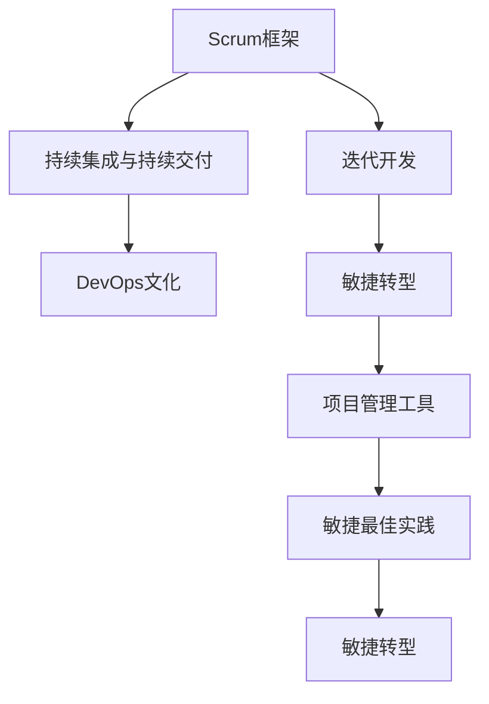

                 

# 敏捷项目管理：在复杂环境中快速交付

> 关键词：敏捷项目管理,复杂环境,快速交付,Scrum,敏捷框架,DevOps,持续交付,持续集成,项目管理工具,敏捷转型,敏捷最佳实践

## 1. 背景介绍

### 1.1 问题由来
随着信息技术的发展，软件开发项目变得越来越复杂。客户需求多变，技术栈多样，团队规模扩大，项目风险增大。如何在这种复杂环境中高效地交付高质量的软件产品，成为每一个软件开发团队亟待解决的难题。敏捷项目管理方法应运而生，以适应这种快速变化的环境。

敏捷项目管理，以客户需求为核心，强调团队协作、快速迭代、持续交付，能够有效应对复杂环境的挑战。与传统项目管理方法相比，敏捷项目管理更注重过程改进和人员沟通，通过快速反馈和持续优化，实现项目的高效交付。

### 1.2 问题核心关键点
敏捷项目管理的核心在于将复杂的项目管理任务分解为一系列小的、可管理的子任务，并按照优先级进行迭代开发。敏捷项目管理的主要实践包括Scrum框架、DevOps文化、持续集成与持续交付等。

敏捷项目管理的关键点包括：
1. **客户参与**：项目成员与客户紧密合作，确保项目始终聚焦于客户需求。
2. **迭代开发**：将项目分解为若干短周期的迭代，每个迭代周期通常为2-4周。
3. **持续反馈**：通过定期回顾和迭代评审，持续改进项目管理和开发过程。
4. **自组织团队**：项目团队自我组织、自我管理，增强团队自主性和责任感。
5. **跨职能协作**：项目成员来自不同职能背景，通过密切协作，实现知识共享和技术融合。

敏捷项目管理在技术、商业、文化等多个层面带来了根本性的变革，已成为现代软件开发的主流项目管理方法。

## 2. 核心概念与联系

### 2.1 核心概念概述

敏捷项目管理涉及多个关键概念，理解这些概念对于有效应用敏捷项目管理方法至关重要。

- **Scrum框架**：敏捷项目管理中的核心框架，强调迭代开发、持续反馈和自组织团队。Scrum框架包括Sprint、Product Backlog、Sprint Backlog等核心元素。
- **DevOps文化**：敏捷项目管理的重要组成部分，强调开发与运维的紧密集成，实现自动化部署、持续集成和持续交付。DevOps文化的核心是打破开发与运维的壁垒，实现无缝协作。
- **持续集成与持续交付**：通过自动化构建、测试和部署，实现快速、可靠的软件交付。持续集成与持续交付能够显著提升开发效率和软件质量。
- **项目管理工具**：敏捷项目管理离不开各种项目管理工具的支持。常用的项目管理工具包括JIRA、Trello、Confluence等。
- **敏捷转型**：将传统项目管理模式转变为敏捷项目管理模式的过程。敏捷转型需要组织上下统一认知，通过培训和实践逐步实现。
- **敏捷最佳实践**：敏捷项目管理中的通用最佳实践，包括每日站会、回顾会议、Sprint回顾等。

这些概念之间相互联系，共同构成了敏捷项目管理的整体框架。理解这些概念的原理和应用方法，是掌握敏捷项目管理的关键。

### 2.2 核心概念原理和架构的 Mermaid 流程图(Mermaid 流程节点中不要有括号、逗号等特殊字符)



这个流程图展示了敏捷项目管理中各个概念之间的联系。

## 3. 核心算法原理 & 具体操作步骤
### 3.1 算法原理概述

敏捷项目管理基于迭代开发和持续改进的原理，通过将复杂的项目管理任务分解为小的、可管理的子任务，并在每个迭代周期中反复进行计划、开发、测试、交付和回顾，实现快速、高质量的软件交付。敏捷项目管理的核心在于以下几个算法原理：

1. **迭代开发**：将项目划分为多个短的迭代周期，每个周期通常为2-4周。每个迭代周期结束时，交付可用的软件增量，同时进行客户验收和团队回顾。
2. **持续反馈**：通过定期回顾和迭代评审，持续改进项目管理和开发过程，确保项目始终朝正确的方向前进。
3. **自组织团队**：项目团队自我组织、自我管理，增强团队自主性和责任感，提高项目执行效率和质量。
4. **跨职能协作**：项目成员来自不同职能背景，通过密切协作，实现知识共享和技术融合。

这些算法原理构成了敏捷项目管理的基础，指导着项目从需求分析、设计、开发、测试到交付的全过程。

### 3.2 算法步骤详解

敏捷项目管理的具体操作步骤包括以下几个关键步骤：

**Step 1: 项目启动与规划**

1. **组建团队**：根据项目需求，组建多职能的跨学科团队，确保团队成员具有足够的技能和经验。
2. **定义目标**：明确项目目标和交付物，确保项目始终聚焦于客户需求。
3. **制定计划**：根据项目需求和目标，制定详细的项目计划，包括时间表、资源分配、风险管理等。

**Step 2: 迭代开发与交付**

1. **划分任务**：将项目任务划分为小的、可管理的子任务，并按优先级排序。
2. **Sprint规划**：根据任务优先级，确定每个迭代周期的任务清单，并设定任务完成标准。
3. **迭代开发**：团队成员在迭代周期内集中精力完成分配的任务，并进行定期的代码评审和测试。
4. **交付和验收**：每个迭代周期结束时，交付可用的软件增量，并通过客户验收评审确保交付物符合客户需求。

**Step 3: 持续反馈与改进**

1. **每日站会**：团队成员每天进行15分钟的站会，确保每个成员了解项目进展、存在的问题和下一步计划。
2. **Sprint回顾**：每个迭代周期结束时，团队进行Sprint回顾，总结经验教训，提出改进建议。
3. **客户反馈**：收集客户的反馈意见，进行项目调整和优化。
4. **迭代评审**：邀请客户、利益相关者和团队成员参与迭代评审，评估交付物的质量。

**Step 4: 持续集成与交付**

1. **持续集成**：通过自动化构建和测试工具，实现快速、可靠的交付。
2. **持续交付**：将软件部署到生产环境，确保软件的高可用性和可靠性。
3. **DevOps实践**：实现开发与运维的紧密集成，提升项目交付速度和质量。

### 3.3 算法优缺点

敏捷项目管理的主要优点包括：

1. **快速响应变化**：敏捷项目管理通过快速迭代和持续反馈，能够灵活应对客户需求的变化。
2. **高效交付**：敏捷项目管理注重高优先级的任务优先完成，确保关键交付物及时交付。
3. **提高团队协作**：敏捷项目管理强调团队协作和知识共享，增强团队的自主性和责任感。
4. **提高软件质量**：通过持续集成与持续交付，敏捷项目管理能够实现快速、可靠的软件交付。

同时，敏捷项目管理也存在一些缺点：

1. **项目风险较高**：由于迭代周期短，敏捷项目管理中的风险管理较为复杂，需要团队具备较高的风险应对能力。
2. **需要团队高度自治**：敏捷项目管理对团队成员的自组织能力要求较高，需要团队具备较高的专业水平和协作精神。
3. **资源需求较大**：敏捷项目管理需要较多的项目资源，包括时间、人力、工具等。
4. **难以衡量进度**：敏捷项目管理强调过程改进，项目进度难以量化衡量，需要依赖客户反馈和团队评估。

### 3.4 算法应用领域

敏捷项目管理已经广泛应用于软件开发、产品设计、项目管理等多个领域，具体应用如下：

1. **软件开发**：敏捷项目管理在软件开发中得到了广泛应用，特别是在大型复杂软件项目中。通过敏捷项目管理，软件开发团队能够高效应对客户需求的变化，快速交付高质量的软件产品。
2. **产品设计**：敏捷项目管理在产品设计中也有重要应用，通过快速迭代和持续反馈，产品设计团队能够及时调整设计方案，提升产品质量和用户体验。
3. **项目管理**：敏捷项目管理已经成为现代项目管理的主流方法，通过敏捷管理，项目团队能够高效实现项目目标，提升项目执行效率和质量。

## 4. 数学模型和公式 & 详细讲解 & 举例说明（备注：数学公式请使用latex格式，latex嵌入文中独立段落使用 $$，段落内使用 $)
### 4.1 数学模型构建

敏捷项目管理的数学模型主要围绕项目进度、资源分配、风险管理等方面进行构建。以下是一个简化的敏捷项目管理数学模型：

1. **项目进度模型**：

   $$
   T = \sum_{i=1}^{n} d_i
   $$

   其中 $T$ 为项目总时间，$n$ 为迭代周期数，$d_i$ 为第 $i$ 个迭代周期所需时间。

2. **资源分配模型**：

   $$
   R = \sum_{j=1}^{m} r_j
   $$

   其中 $R$ 为项目总资源需求，$m$ 为团队成员数，$r_j$ 为第 $j$ 个成员在项目中投入的工作时间。

3. **风险管理模型**：

   $$
   P = \sum_{k=1}^{p} p_k \cdot c_k
   $$

   其中 $P$ 为项目总风险，$p_k$ 为第 $k$ 个风险事件的概率，$c_k$ 为第 $k$ 个风险事件的影响程度。

### 4.2 公式推导过程

敏捷项目管理中的核心公式包括迭代进度、资源分配和风险管理等，以下将逐一推导这些公式：

**迭代进度模型**：

$$
T = \sum_{i=1}^{n} d_i
$$

其中 $T$ 为项目总时间，$n$ 为迭代周期数，$d_i$ 为第 $i$ 个迭代周期所需时间。该公式通过累加每个迭代周期所需时间，计算项目总时间。

**资源分配模型**：

$$
R = \sum_{j=1}^{m} r_j
$$

其中 $R$ 为项目总资源需求，$m$ 为团队成员数，$r_j$ 为第 $j$ 个成员在项目中投入的工作时间。该公式通过累加每个团队成员的工作时间，计算项目总资源需求。

**风险管理模型**：

$$
P = \sum_{k=1}^{p} p_k \cdot c_k
$$

其中 $P$ 为项目总风险，$p_k$ 为第 $k$ 个风险事件的概率，$c_k$ 为第 $k$ 个风险事件的影响程度。该公式通过将每个风险事件的概率和影响程度相乘，计算项目总风险。

### 4.3 案例分析与讲解

以软件开发项目为例，进行敏捷项目管理模型的应用分析：

**项目进度模型应用**：

假设一个软件开发项目需要6个迭代周期完成，每个迭代周期为4周，计算项目总时间为：

$$
T = 6 \times 4 = 24 \text{ 周}
$$

**资源分配模型应用**：

假设项目团队有10名成员，每个成员在项目中投入500小时，计算项目总资源需求为：

$$
R = 10 \times 500 = 5000 \text{ 小时}
$$

**风险管理模型应用**：

假设项目面临5个风险事件，每个风险事件的概率和影响程度如表所示：

| 风险事件 | 概率 | 影响程度 |
|----------|------|----------|
| 需求变更 | 0.2  | 0.5      |
| 技术问题 | 0.3  | 0.6      |
| 人员离职 | 0.1  | 0.4      |
| 交付延期 | 0.5  | 0.3      |
| 用户投诉 | 0.4  | 0.2      |

计算项目总风险为：

$$
P = 0.2 \times 0.5 + 0.3 \times 0.6 + 0.1 \times 0.4 + 0.5 \times 0.3 + 0.4 \times 0.2 = 0.5
$$

通过这些模型的应用，可以对项目进度、资源分配和风险管理进行有效的预测和控制。

## 5. 项目实践：代码实例和详细解释说明
### 5.1 开发环境搭建

要进行敏捷项目管理实践，首先需要搭建一个开发环境。以下是使用JIRA和Confluence进行敏捷项目管理的具体步骤：

1. **安装JIRA和Confluence**：下载并安装JIRA和Confluence软件，并进行基本配置。
2. **创建项目**：在JIRA中创建一个新的敏捷项目，设置项目名称、描述、负责人等基本信息。
3. **创建团队**：在JIRA中创建一个新的敏捷团队，包括团队成员、角色和权限等信息。
4. **配置Confluence空间**：在Confluence中创建一个新的项目空间，用于项目文档和协作。
5. **创建任务和需求**：在JIRA中创建项目任务和需求，并进行优先级排序和分配。

### 5.2 源代码详细实现

以下是一个使用JIRA和Confluence进行敏捷项目管理的代码实现示例：

```python
from jira import JIRA
from confluence import Confluence
from time import sleep

# 创建JIRA连接
jira = JIRA('https://jira.example.com', username='username', password='password')

# 创建Confluence连接
confluence = Confluence('https://confluence.example.com', username='username', password='password')

# 创建项目
project = jira.create_project(name='MyProject', project_type='software')
print(f"项目创建成功：{project.key}")

# 创建团队
team = jira.create_team(name='MyTeam', project={project.key})
print(f"团队创建成功：{team.key}")

# 创建任务和需求
task1 = jira.create_issue(issuetype='Task', project={project.key})
task2 = jira.create_issue(issuetype='Task', project={project.key})
task3 = jira.create_issue(issuetype='Task', project={project.key})
task1.fields['assignee'] = 'username'
task2.fields['assignee'] = 'username'
task3.fields['assignee'] = 'username'
task1.fields['priority'] = 'High'
task2.fields['priority'] = 'Medium'
task3.fields['priority'] = 'Low'
jira.add_comment(task1.key, '任务1开始')
jira.add_comment(task2.key, '任务2开始')
jira.add_comment(task3.key, '任务3开始')

# 创建Confluence页面
page1 = confluence.create_page(space_key='space1', title='任务1', body='任务1开始', type='Page')
page2 = confluence.create_page(space_key='space1', title='任务2', body='任务2开始', type='Page')
page3 = confluence.create_page(space_key='space1', title='任务3', body='任务3开始', type='Page')

# 每日站会
for i in range(2):
    sleep(1)
    task1.update(fields={'status': 'In Progress'})
    task2.update(fields={'status': 'In Progress'})
    task3.update(fields={'status': 'In Progress'})
    jira.add_comment(task1.key, '今日完成20%')
    jira.add_comment(task2.key, '今日完成30%')
    jira.add_comment(task3.key, '今日完成40%')

# Sprint结束和任务验收
jira.update_task(task1.key, fields={'status': 'Done'})
jira.update_task(task2.key, fields={'status': 'Done'})
jira.update_task(task3.key, fields={'status': 'Done'})
jira.add_comment(task1.key, '任务1完成')
jira.add_comment(task2.key, '任务2完成')
jira.add_comment(task3.key, '任务3完成')

# Sprint回顾
jira.add_comment(project.key, 'Sprint回顾完成')
```

### 5.3 代码解读与分析

这段代码实现了使用JIRA和Confluence进行敏捷项目管理的核心功能，包括项目创建、任务分配、每日站会、任务验收和Sprint回顾等。

**JIRA连接创建**：通过JIRA API创建JIRA连接，并设置登录信息。

**项目和团队创建**：使用JIRA API创建项目和团队，设置项目名称、团队成员等基本信息。

**任务和需求创建**：使用JIRA API创建任务和需求，设置任务优先级、分配成员等属性，并进行任务状态更新。

**Confluence页面创建**：使用Confluence API创建项目页面，记录任务状态和进度。

**每日站会**：通过JIRA API更新任务状态，并在任务中添加每日进度更新。

**任务验收和Sprint回顾**：通过JIRA API更新任务状态，并在项目中添加Sprint回顾内容。

**代码实现**：通过JIRA和Confluence API实现敏捷项目管理的关键操作，确保项目高效、透明地运行。

### 5.4 运行结果展示

通过JIRA和Confluence的代码实现，可以创建项目、任务和页面，并进行任务分配、每日站会、任务验收和Sprint回顾。以下是一个简单的运行结果示例：

**JIRA任务列表**：

```
Task 1 (High, username)
Task 2 (Medium, username)
Task 3 (Low, username)
```

**Confluence页面列表**：

```
任务1
任务2
任务3
```

通过JIRA和Confluence的集成使用，可以有效地管理项目进度、资源分配和团队协作，实现敏捷项目的高效交付。

## 6. 实际应用场景
### 6.1 软件开发

敏捷项目管理在软件开发中的应用非常广泛。通过敏捷项目管理，软件开发团队能够高效应对客户需求的变化，快速交付高质量的软件产品。

**敏捷开发实践**：

1. **Scrum框架**：敏捷开发项目通常采用Scrum框架，通过迭代开发、每日站会和Sprint回顾，确保团队高效协作和持续改进。
2. **DevOps文化**：敏捷开发项目需要与运维团队紧密协作，通过持续集成和持续交付，实现快速、可靠的软件交付。
3. **持续反馈**：敏捷开发项目注重客户反馈，通过快速迭代和持续反馈，确保软件始终符合客户需求。

**软件开发案例**：

某软件开发项目通过敏捷项目管理，实现了以下效果：
- 项目需求明确，客户满意度提升。
- 团队协作高效，任务进度控制得当。
- 快速响应客户需求，交付高质量软件产品。

**敏捷项目管理应用**：

- **每日站会**：团队成员每天进行15分钟的站会，了解项目进展和存在的问题，确保任务顺利推进。
- **Sprint规划**：根据项目需求和优先级，确定每个迭代周期的任务清单，并设定任务完成标准。
- **Sprint回顾**：每个迭代周期结束时，团队进行Sprint回顾，总结经验教训，提出改进建议。
- **持续集成与持续交付**：通过自动化构建和测试工具，实现快速、可靠的交付。

### 6.2 产品设计

敏捷项目管理在产品设计中也有广泛应用，通过敏捷项目管理，产品设计团队能够及时调整设计方案，提升产品质量和用户体验。

**敏捷设计实践**：

1. **用户故事**：敏捷设计项目注重用户故事，通过用户故事来定义产品需求和功能。
2. **原型设计**：敏捷设计项目通过快速原型设计，及时获取用户反馈，进行产品迭代和优化。
3. **持续反馈**：敏捷设计项目注重持续反馈，通过快速迭代和持续反馈，确保产品设计始终符合用户需求。

**产品设计案例**：

某产品设计项目通过敏捷项目管理，实现了以下效果：
- 产品设计符合用户需求，用户满意度提升。
- 团队协作高效，设计进度控制得当。
- 快速响应用户反馈，设计出高质量的产品。

**敏捷项目管理应用**：

- **用户故事**：团队成员通过用户故事来定义产品需求和功能，确保产品设计符合用户需求。
- **原型设计**：通过快速原型设计，及时获取用户反馈，进行产品迭代和优化。
- **持续反馈**：注重持续反馈，通过快速迭代和持续反馈，确保产品设计始终符合用户需求。

### 6.3 项目管理

敏捷项目管理已经成为现代项目管理的主流方法，通过敏捷项目管理，项目团队能够高效实现项目目标，提升项目执行效率和质量。

**敏捷项目管理实践**：

1. **项目启动与规划**：敏捷项目管理注重项目启动和规划，确保项目目标明确和资源合理分配。
2. **迭代开发与交付**：敏捷项目管理通过迭代开发和持续交付，确保项目高效推进和及时交付。
3. **持续反馈与改进**：敏捷项目管理注重持续反馈和改进，确保项目始终朝正确的方向前进。

**项目管理案例**：

某项目管理项目通过敏捷项目管理，实现了以下效果：
- 项目目标明确，资源分配合理。
- 项目高效推进，及时交付成果。
- 持续反馈和改进，确保项目顺利推进。

**敏捷项目管理应用**：

- **项目启动与规划**：通过明确项目目标和制定详细计划，确保项目顺利推进。
- **迭代开发与交付**：通过迭代开发和持续交付，确保项目高效推进和及时交付。
- **持续反馈与改进**：注重持续反馈和改进，确保项目始终朝正确的方向前进。

## 7. 工具和资源推荐
### 7.1 学习资源推荐

要深入掌握敏捷项目管理方法，推荐以下几个学习资源：

1. **《敏捷管理实践》**：这是一本经典的敏捷项目管理书籍，详细介绍了敏捷管理的核心思想和实践方法。
2. **《Scrum指南》**：这是一份由Scrum官方网站发布的标准文档，详细介绍了Scrum框架的核心实践和应用方法。
3. **《DevOps实践指南》**：这是一本详细介绍DevOps文化的书籍，涵盖持续集成、持续交付、DevOps文化等关键内容。
4. **Scrum.org官网**：这是一个权威的敏捷项目管理资源平台，提供Scrum认证、培训和实践社区等。
5. **Confluence官方文档**：这是Atlassian提供的Confluence官方文档，详细介绍了Confluence的使用和配置方法。

### 7.2 开发工具推荐

要高效进行敏捷项目管理实践，推荐以下几个开发工具：

1. **JIRA**：这是一个功能强大的敏捷项目管理工具，支持Scrum、Kanban等多种敏捷框架。
2. **Confluence**：这是一个灵活的文档协作工具，支持文档创建、编辑、协作等多种功能。
3. **Trello**：这是一个简单易用的看板管理工具，适合小团队和个人使用。
4. **Slack**：这是一个团队沟通协作工具，支持消息、文件、视频等多种功能。
5. **GitLab**：这是一个集成的软件开发平台，支持代码管理、CI/CD、DevOps等多种功能。

### 7.3 相关论文推荐

要深入了解敏捷项目管理的最新研究，推荐以下几个相关论文：

1. **《敏捷管理实践》**：这是一篇详细介绍敏捷管理方法的研究论文，详细介绍了敏捷管理的核心思想和实践方法。
2. **《Scrum框架的最佳实践》**：这是一篇详细介绍Scrum框架的研究论文，详细介绍了Scrum框架的核心实践和应用方法。
3. **《DevOps文化及其在软件开发中的应用》**：这是一篇详细介绍DevOps文化的研究论文，涵盖持续集成、持续交付、DevOps文化等关键内容。
4. **《敏捷项目管理方法的比较研究》**：这是一篇比较不同敏捷项目管理方法的研究论文，详细分析了Scrum、Kanban等方法的特点和优缺点。
5. **《敏捷项目管理工具的比较研究》**：这是一篇比较不同敏捷项目管理工具的研究论文，详细分析了JIRA、Trello等工具的特点和优缺点。

## 8. 总结：未来发展趋势与挑战
### 8.1 研究成果总结

敏捷项目管理方法已经广泛应用于软件开发、产品设计、项目管理等多个领域，并取得了显著的效果。敏捷项目管理的核心思想是快速迭代、持续反馈和团队协作，通过敏捷管理，能够高效应对客户需求的变化，快速交付高质量的软件产品。

### 8.2 未来发展趋势

展望未来，敏捷项目管理将呈现以下几个发展趋势：

1. **多学科融合**：敏捷项目管理将与其他技术手段和方法进行深度融合，如知识管理、知识图谱、人工智能等，提升项目管理和交付质量。
2. **智能协作工具**：随着人工智能技术的发展，敏捷项目管理工具将变得更加智能，能够自动生成任务清单、预测任务进度、优化资源分配等。
3. **全球化协作**：敏捷项目管理将更加注重全球化协作，通过远程协作工具和平台，实现跨国团队的紧密合作。
4. **敏捷文化**：敏捷项目管理将逐步渗透到组织文化中，形成敏捷文化，提升组织整体的敏捷性。

### 8.3 面临的挑战

敏捷项目管理在快速发展的同时，也面临一些挑战：

1. **组织变革**：敏捷项目管理需要组织上下统一认知，需要变革传统的管理方式。
2. **技术壁垒**：敏捷项目管理需要依赖各种技术工具和平台，需要技术团队的支撑。
3. **知识共享**：敏捷项目管理需要团队成员具备良好的沟通和协作能力，需要良好的知识共享机制。
4. **风险管理**：敏捷项目管理需要应对项目风险，需要有效的风险管理机制。

### 8.4 研究展望

面对敏捷项目管理所面临的挑战，未来的研究需要在以下几个方面寻求新的突破：

1. **敏捷转型**：通过敏捷转型，将传统项目管理模式转变为敏捷项目管理模式，提升组织整体的敏捷性。
2. **敏捷文化**：推动组织上下形成敏捷文化，提升敏捷管理的执行力和效果。
3. **技术优化**：通过技术优化，提升敏捷项目管理工具的智能度和易用性。
4. **知识共享**：通过知识共享机制，提升团队成员的知识水平和协作能力。
5. **风险管理**：通过风险管理机制，提升敏捷项目的风险应对能力。

## 9. 附录：常见问题与解答

**Q1：敏捷项目管理是否适用于所有项目？**

A: 敏捷项目管理适用于大部分复杂项目，但不适合所有项目。对于简单、规模小的项目，敏捷项目管理可能会造成资源浪费和时间成本增加。

**Q2：敏捷项目管理如何应对客户需求变化？**

A: 敏捷项目管理通过快速迭代和持续反馈，能够灵活应对客户需求的变化。通过定期与客户沟通和反馈，及时调整项目方向和任务清单，确保项目始终聚焦于客户需求。

**Q3：敏捷项目管理是否需要高技术团队？**

A: 敏捷项目管理需要技术团队的支撑，但并不要求高技术团队。通过敏捷项目管理工具和平台的辅助，敏捷项目管理能够实现高效的项目管理。

**Q4：敏捷项目管理是否适合长期项目？**

A: 敏捷项目管理适合长期项目，通过快速迭代和持续反馈，确保项目能够适应变化，提升项目质量和交付效率。

**Q5：敏捷项目管理如何实现团队协作？**

A: 敏捷项目管理注重团队协作，通过每日站会、Sprint回顾等机制，确保团队成员的沟通和协作。同时，敏捷项目管理工具也支持团队协作，提升团队协作效率。

通过以上对敏捷项目管理的全面介绍，相信读者能够更好地理解敏捷项目管理的核心思想和实践方法，掌握敏捷项目管理的关键技能。敏捷项目管理将在复杂环境中发挥重要作用，助力组织高效应对变化，实现高质量的软件交付。

---

作者：禅与计算机程序设计艺术 / Zen and the Art of Computer Programming

