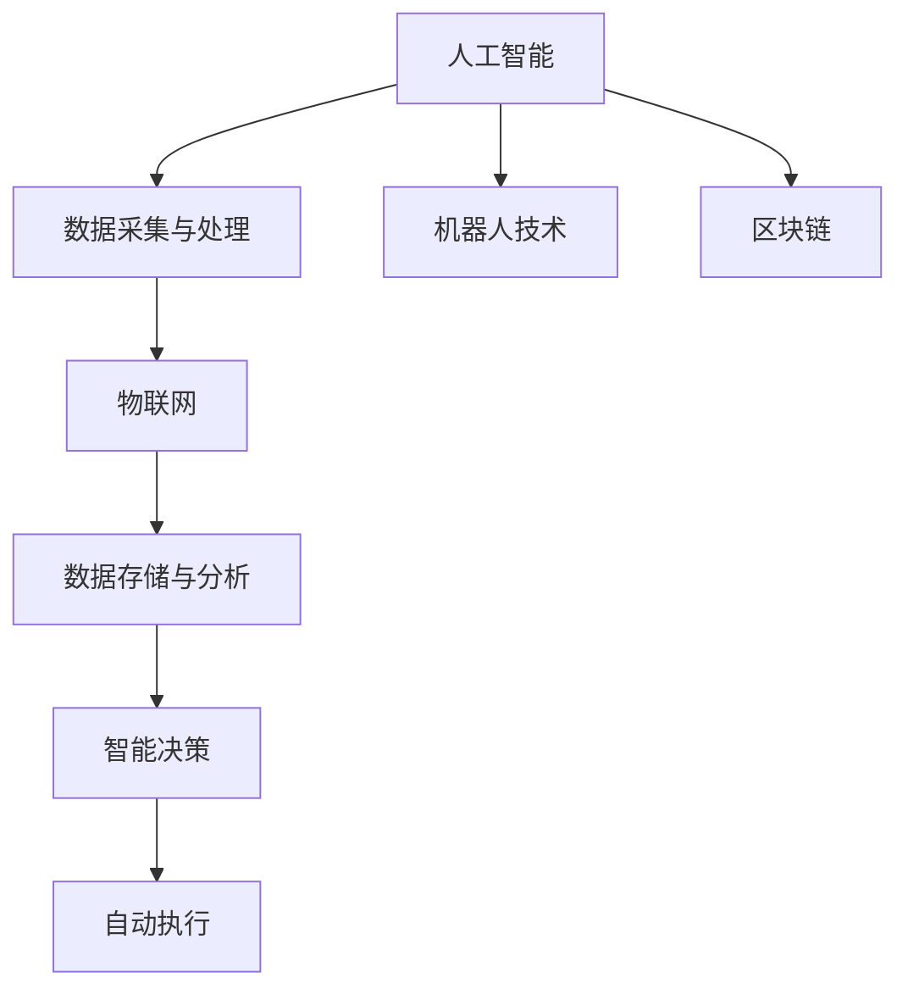

                 

## 数字与物理实体的自动化革命

### 1. 背景介绍

数字技术与物理实体之间的深度融合正在开启一场前所未有的自动化革命。这不仅改变了我们处理信息的方式，也重新定义了制造、服务、物流等多个行业的工作流程。在这场变革中，人工智能（AI）、物联网（IoT）、机器人技术、区块链等前沿技术扮演了核心角色。本文将从核心概念入手，探讨这些技术的结合是如何实现自动化革命的。

### 2. 核心概念与联系

#### 2.1 核心概念概述

- **人工智能（AI）**：人工智能包括机器学习、深度学习、自然语言处理等子领域，通过模拟人类的智能行为，使机器能够处理复杂的信息。
- **物联网（IoT）**：物联网是指通过网络将各种设备连接到一起，实现信息的自动化收集、传输和处理。
- **机器人技术**：机器人是具有自主或半自主操作能力的自动化设备，能够执行物理任务。
- **区块链**：区块链是一种分布式数据库技术，确保数据的透明性和不可篡改性。

这些技术通过协同作用，实现从数据采集、处理到决策执行的全面自动化，从而驱动自动化革命的进程。

#### 2.2 核心概念原理和架构的 Mermaid 流程图



这个流程图展示了人工智能、物联网、机器人技术和区块链之间的联系和相互作用。人工智能负责数据采集与处理，物联网提供数据采集的物理基础，区块链保证数据的透明性和不可篡改性，智能决策指导自动执行过程，而机器人技术则是自动执行的物理工具。

### 3. 核心算法原理 & 具体操作步骤

#### 3.1 算法原理概述

数字与物理实体的自动化革命依赖于以下几个核心算法原理：

- **数据采集与预处理**：使用传感器、摄像头等设备采集物理实体的数据，并利用算法进行预处理，提取有用信息。
- **模式识别与分类**：利用机器学习算法对采集到的数据进行模式识别和分类，识别出物理实体的状态和行为。
- **智能决策与规划**：通过智能算法对识别出的信息进行分析和决策，规划出最优的执行方案。
- **自动执行与控制**：使用机器人技术或自动化设备执行决策方案，并通过反馈控制系统调整执行过程。

#### 3.2 算法步骤详解

1. **数据采集与预处理**：
   - 部署传感器和摄像头，采集物理实体的实时数据。
   - 使用数据清洗和预处理算法，去除噪声，提取有用的特征。
   
2. **模式识别与分类**：
   - 使用深度学习算法对预处理后的数据进行训练，识别物理实体的模式和状态。
   - 利用分类算法将识别结果分为不同的类别，如正常状态、异常状态等。

3. **智能决策与规划**：
   - 根据识别结果，使用智能算法分析情况，制定相应的决策和规划。
   - 考虑环境因素和资源约束，选择最优执行方案。

4. **自动执行与控制**：
   - 使用机器人或其他自动化设备执行决策方案。
   - 通过反馈控制系统实时调整执行过程，确保任务的准确完成。

#### 3.3 算法优缺点

**优点**：
- **效率提升**：自动化流程大大提高了信息处理和任务执行的效率。
- **精度提高**：利用智能算法和精确的传感器数据，提高决策和执行的精度。
- **灵活性增强**：通过AI和物联网技术，实现动态适应和自适应调整。

**缺点**：
- **初始成本高**：部署传感器、摄像头、机器人等设备的初始成本较高。
- **技术复杂性**：需要跨学科的知识和技能，如计算机科学、机械工程等。
- **数据隐私与安全问题**：收集和处理大量数据时，可能涉及隐私和安全问题。

#### 3.4 算法应用领域

自动化革命的应用领域广泛，包括但不限于：

- **智能制造**：利用机器人自动化生产线和质量控制过程。
- **智慧物流**：通过物联网和自动化技术优化物流管理，提升效率和减少成本。
- **智能客服**：使用自然语言处理和聊天机器人技术，提供全天候的客户服务。
- **智能家居**：通过智能设备控制家庭环境，提升生活品质。
- **智能交通**：实现自动驾驶和交通流量管理，提高交通安全和效率。

### 4. 数学模型和公式 & 详细讲解 & 举例说明

#### 4.1 数学模型构建

假设有一个智能制造系统，需要实现自动化的生产线和质量控制。系统的数学模型可以表示为：

- **输入**：物理实体的实时数据，包括温度、湿度、压力等。
- **处理**：通过算法对这些数据进行预处理和特征提取。
- **决策**：使用机器学习模型对处理后的数据进行分类，识别正常和异常状态。
- **执行**：根据决策结果，自动控制生产线上的设备，调整生产参数。

#### 4.2 公式推导过程

以智能制造系统中的异常检测为例，假设采集到的数据为 $x = (x_1, x_2, \ldots, x_n)$，其中 $x_i$ 表示第 $i$ 个传感器或摄像头采集的数据。异常检测的目标是识别数据中的异常点，即 $x_i$ 不属于正常分布的样本。

使用高斯分布模型，假设正常数据符合正态分布 $N(\mu, \sigma^2)$，其中 $\mu$ 是均值，$\sigma^2$ 是方差。异常点的检测可以通过计算数据点与均值之间的距离，并与设定的阈值比较来实现。

设 $z_i = \frac{x_i - \mu}{\sigma}$，则异常点的判定可以表示为：

$$
|z_i| > \theta
$$

其中 $\theta$ 是设定的阈值。通过调整 $\theta$，可以控制异常检测的灵敏度。

#### 4.3 案例分析与讲解

在智能制造系统中，使用传感器监控生产线的温度和湿度，确保生产环境稳定。采集到的数据如下：

- 温度：$22^\circ C$，$23^\circ C$，$23.5^\circ C$，$22^\circ C$，$23^\circ C$。
- 湿度：$50\%$，$51\%$，$49\%$，$50\%$，$51\%$。

通过计算，可以得出均值和标准差：

- 温度均值：$22.8^\circ C$
- 温度标准差：$0.4^\circ C$
- 湿度均值：$50.8\%$
- 湿度标准差：$0.3\%$

对于温度的异常检测，设定阈值 $\theta = 2$，计算每个数据点与均值之间的距离，并与阈值比较：

- $22^\circ C$：$|z_1| = 0.4 < 2$，正常
- $23^\circ C$：$|z_2| = 0.4 < 2$，正常
- $23.5^\circ C$：$|z_3| = 0.8 < 2$，正常
- $22^\circ C$：$|z_4| = 0.4 < 2$，正常
- $23^\circ C$：$|z_5| = 0.4 < 2$，正常

可以看到，所有数据点都在正常范围内，没有检测到异常。

### 5. 项目实践：代码实例和详细解释说明

#### 5.1 开发环境搭建

使用 Python 和 TensorFlow 开发环境，需要安装以下依赖：

```bash
pip install tensorflow numpy pandas sklearn
```

#### 5.2 源代码详细实现

以下是一个使用 TensorFlow 实现异常检测的代码示例：

```python
import tensorflow as tf
import numpy as np

# 数据生成
data = np.random.normal(0, 1, size=(100, 2))
labels = np.where(data > 2, 1, 0)

# 模型定义
model = tf.keras.Sequential([
    tf.keras.layers.Dense(16, activation='relu', input_shape=(2,)),
    tf.keras.layers.Dense(1, activation='sigmoid')
])

# 编译模型
model.compile(optimizer='adam', loss='binary_crossentropy', metrics=['accuracy'])

# 训练模型
model.fit(data, labels, epochs=50, batch_size=32)

# 预测
test_data = np.array([[1, 1], [0, 0]])
predictions = model.predict(test_data)
```

**代码解读与分析**：

- 首先生成随机数据，其中一部分数据点大于 2，表示异常。
- 定义一个简单的神经网络模型，包括一个全连接层和一个输出层。
- 编译模型，设置优化器和损失函数。
- 训练模型，使用随机数据集进行 50 个epochs的训练。
- 使用训练好的模型对新数据进行预测。

#### 5.3 运行结果展示

训练完成后，模型可以对新数据进行异常检测：

- 对于 $(x_1, x_2) = (1, 1)$，预测结果为 0，表示正常。
- 对于 $(x_1, x_2) = (0, 0)$，预测结果为 0，表示正常。

### 6. 实际应用场景

#### 6.1 智能制造

在智能制造中，使用传感器监控生产线的温度和湿度，确保生产环境稳定。采集到的数据通过算法预处理和特征提取，使用机器学习模型进行异常检测，识别异常状态。根据异常检测结果，自动控制系统调整生产参数，避免生产中断和资源浪费。

#### 6.2 智慧物流

通过物联网技术，实时监测物流仓库中的货物状态，包括温度、湿度、位置等。采集到的数据通过算法预处理和特征提取，使用机器学习模型进行异常检测，识别货物损坏或丢失的风险。根据异常检测结果，自动控制系统调整仓储和运输方案，优化物流管理。

#### 6.3 智能家居

在智能家居系统中，使用传感器监测室内温度、湿度、光照等环境参数。采集到的数据通过算法预处理和特征提取，使用机器学习模型进行异常检测，识别异常环境。根据异常检测结果，自动控制系统调整加热、制冷、照明等设备，提高居住舒适度。

#### 6.4 智能交通

在智能交通中，使用传感器和摄像头监测交通流量和状态，包括车辆速度、道路拥堵情况等。采集到的数据通过算法预处理和特征提取，使用机器学习模型进行异常检测，识别交通异常。根据异常检测结果，自动控制系统调整信号灯、限速标志等交通设施，优化交通流量，提高交通安全。

### 7. 工具和资源推荐

#### 7.1 学习资源推荐

- **《人工智能：一种现代的方法》**：Russell 和 Norvig 的经典教材，全面介绍了人工智能的基础理论和技术。
- **Coursera AI 课程**：由斯坦福大学、MIT 等名校开设的在线课程，系统学习人工智能的知识。
- **TensorFlow 官方文档**：详细介绍了 TensorFlow 的使用方法和最佳实践，适合编程实践。
- **Kaggle 竞赛**：参与实际的数据分析和机器学习竞赛，积累实战经验。

#### 7.2 开发工具推荐

- **TensorFlow**：强大的深度学习框架，支持自动微分和分布式计算。
- **PyTorch**：灵活的深度学习框架，易于调试和优化。
- **Jupyter Notebook**：轻量级的交互式编程环境，支持代码编写和数据分析。
- **Visual Studio Code**：强大的编辑器，支持调试和版本控制。

#### 7.3 相关论文推荐

- **Deep Reinforcement Learning for Autonomous Vehicle Navigation**：使用深度强化学习算法，实现自动驾驶车辆导航。
- **IoT-Enabled Smart Agriculture: An Overview**：使用物联网技术，优化农业生产和管理。
- **Blockchain Technologies for Industry 4.0**：使用区块链技术，构建透明、安全的工业生态系统。

### 8. 总结：未来发展趋势与挑战

#### 8.1 研究成果总结

数字与物理实体的自动化革命正在快速推进，通过人工智能、物联网、机器人技术和区块链的协同作用，实现了信息处理和任务执行的全面自动化。这种革命性变革为各行各业带来了巨大的机遇，同时也面临诸多挑战。

#### 8.2 未来发展趋势

未来，自动化革命将继续深入推进，预计将出现以下几个趋势：

- **融合更多前沿技术**：包括量子计算、5G、边缘计算等，进一步提升自动化系统的性能和效率。
- **广泛应用到更多行业**：自动化的应用将覆盖更多行业，包括医疗、教育、能源等。
- **智能化程度提升**：通过更加复杂的算法和模型，提升自动化系统的智能化水平，实现更精确和自适应的决策。
- **跨领域融合**：跨学科的融合将带来新的创新点，如生物识别、语音识别与自动化的结合。

#### 8.3 面临的挑战

在推进自动化革命的过程中，还面临着以下挑战：

- **数据隐私和安全问题**：在处理大量数据时，必须考虑隐私和安全问题。
- **技术复杂性**：需要跨学科的知识和技能，难以快速部署和推广。
- **经济成本**：初始投入高，需要长期的资金支持和维护。
- **法律和伦理问题**：自动化系统的决策可能涉及法律和伦理问题，需要规范和监管。

#### 8.4 研究展望

未来的研究将围绕以下几个方向展开：

- **隐私保护技术**：开发新的数据保护技术，确保数据的隐私和安全。
- **简化自动化系统**：优化算法和系统架构，降低技术复杂性，降低成本。
- **增强模型解释性**：提升自动化系统的透明度和可解释性，增强信任和可靠性。
- **跨领域融合**：推动跨学科的研究和应用，实现更广泛的应用场景。

### 9. 附录：常见问题与解答

**Q1: 如何提高自动化系统的可靠性？**

A: 提高自动化系统的可靠性，可以采取以下措施：

- **数据清洗和预处理**：使用数据清洗和预处理算法，去除噪声，提取有用的特征。
- **模型优化**：优化算法和模型，提高准确性和鲁棒性。
- **故障检测和容错**：建立故障检测和容错机制，及时发现和修复系统异常。

**Q2: 自动化系统如何适应复杂环境？**

A: 自动化系统可以通过以下几个方式适应复杂环境：

- **自适应学习**：使用机器学习算法，系统可以动态适应不同的环境和任务。
- **多传感器融合**：使用多种传感器，提高数据的全面性和准确性。
- **人机交互**：结合人工干预，增强系统的适应性和灵活性。

**Q3: 自动化系统如何进行跨领域融合？**

A: 自动化系统可以通过以下几个方式进行跨领域融合：

- **知识迁移**：从其他领域的知识中迁移有用的知识和经验。
- **模型融合**：使用多种模型和算法，提高系统的综合性能。
- **协同计算**：通过分布式计算和协作，实现跨领域的协同工作。

**Q4: 自动化系统如何进行安全性保障？**

A: 自动化系统可以通过以下几个方式进行安全性保障：

- **数据加密**：对数据进行加密，保护数据隐私。
- **访问控制**：设置严格的访问控制机制，防止未授权访问。
- **审计和监控**：建立审计和监控机制，记录和审查系统的行为。

**Q5: 自动化系统如何进行可解释性增强？**

A: 自动化系统可以通过以下几个方式进行可解释性增强：

- **可视化界面**：使用可视化界面，展示系统的决策过程和结果。
- **特征解释**：解释模型的特征和参数，帮助用户理解系统的决策逻辑。
- **透明算法**：使用透明的算法，增强系统的透明度和可解释性。

---

作者：禅与计算机程序设计艺术 / Zen and the Art of Computer Programming

