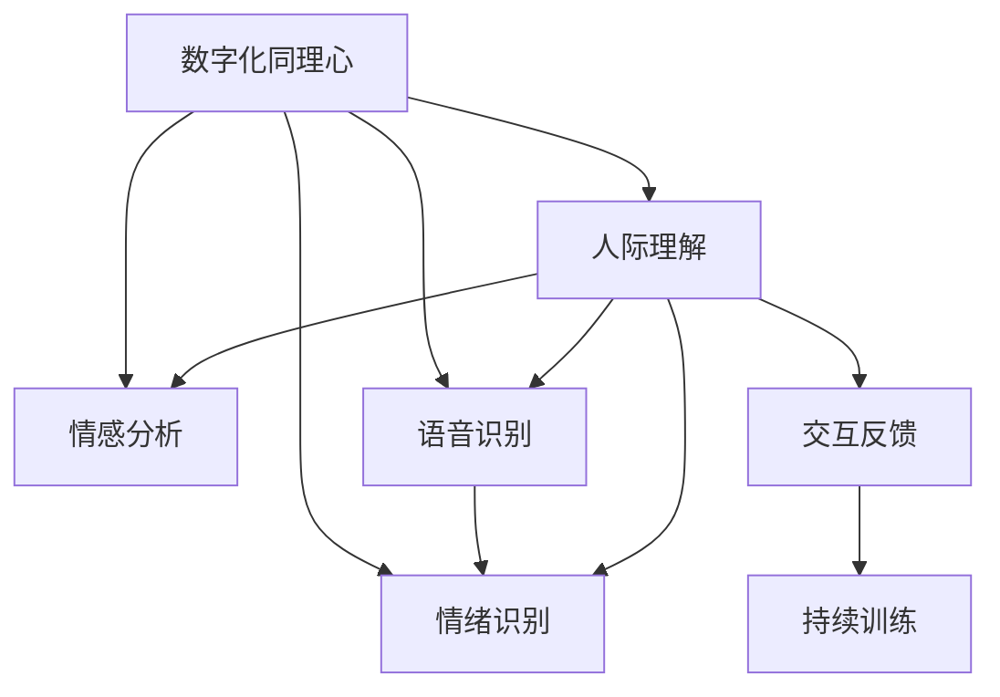

                 

# 数字化同理心培养皿开发者：AI增强的人际理解训练师

> 关键词：数字化同理心, 人际理解, AI增强, 人际交互训练师, 情感分析, 语音识别, 情绪识别, 文本分析, 机器学习, 深度学习, 自然语言处理, 语言模型

## 1. 背景介绍

### 1.1 问题由来
随着数字化时代的到来，人与人之间的交流越来越多地依赖于虚拟媒介，如社交媒体、即时通讯、视频会议等。然而，虚拟交流缺乏面对面交流中的非语言线索，容易导致误解和沟通障碍。如何在数字世界里培养人类的同理心和情感理解能力，成为一项重要的课题。

人工智能技术的发展，特别是深度学习和大数据分析技术，为培养数字化同理心提供了新的可能性。通过AI技术，可以模拟真实的情感交流场景，训练用户理解和回应他人情感的能力。本文将探讨如何使用AI技术增强人际理解能力，并介绍一种新型数字化同理心训练师——数字化同理心培养皿开发者。

### 1.2 问题核心关键点
本研究旨在开发一种基于AI的人际理解训练系统，通过模拟人际交流场景，对用户的同理心和情感识别能力进行训练。系统通过文本、语音、视频等多种媒介收集用户情感数据，利用情感分析、语音识别、情绪识别等技术，对用户的情感状态进行评估和反馈，最终提升用户的同理心水平。

该系统的主要核心关键点包括：
- 情感分析：利用自然语言处理技术，分析用户文本和语音中的情感倾向。
- 语音识别：将用户的语音转换为文本，识别其中的情感和情绪变化。
- 情绪识别：通过面部表情、身体语言等视觉信息，识别用户的情绪状态。
- 交互反馈：根据情感和情绪识别结果，及时给予用户反馈和指导，帮助其提升同理心水平。
- 持续训练：系统能够根据用户表现，自适应调整训练难度和内容，提供个性化训练。

## 2. 核心概念与联系

### 2.1 核心概念概述

为更好地理解本研究中的人际理解训练系统，本节将介绍几个密切相关的核心概念：

- **数字化同理心**：在数字世界中，通过AI技术训练和提升用户的同理心能力，使其能够更好地理解和回应他人的情感。
- **人际理解**：指个体理解他人情感和意图的能力，包括情感识别、情绪识别、情境理解等。
- **AI增强**：利用人工智能技术，增强人类的认知和情感能力，提升人际互动质量。
- **人际交互训练师**：通过模拟真实的人际交流场景，对用户进行情感和情绪识别训练，帮助其提升同理心水平。
- **情感分析**：利用自然语言处理技术，分析文本中的情感倾向，评估用户的情感状态。
- **语音识别**：将用户的语音转换为文本，分析其中的情感和情绪变化，用于情感识别。
- **情绪识别**：通过面部表情、身体语言等视觉信息，识别用户的情绪状态，用于情绪识别。
- **交互反馈**：根据情感和情绪识别结果，及时给予用户反馈和指导，帮助其提升同理心水平。
- **持续训练**：系统能够根据用户表现，自适应调整训练难度和内容，提供个性化训练。

这些核心概念之间的逻辑关系可以通过以下Mermaid流程图来展示：



这个流程图展示了大语言模型的核心概念及其之间的关系：

1. 数字化同理心通过情感分析、语音识别、情绪识别等技术实现。
2. 人际理解包括情感识别、情绪识别、情境理解等，是数字化同理心的核心。
3. AI增强利用情感分析、语音识别、情绪识别等技术，增强人际理解能力。
4. 人际交互训练师通过模拟真实的人际交流场景，对用户进行情感和情绪识别训练，帮助其提升同理心水平。
5. 情感分析、语音识别、情绪识别技术用于提升人际理解能力。
6. 交互反馈和持续训练帮助用户不断提升同理心水平。

这些概念共同构成了本研究中数字化同理心训练系统的基本框架，使其能够有效提升用户的同理心和情感理解能力。通过理解这些核心概念，我们可以更好地把握系统的设计和实现。

## 3. 核心算法原理 & 具体操作步骤
### 3.1 算法原理概述

数字化同理心培养皿开发者的核心算法原理，主要基于情感分析、语音识别、情绪识别等自然语言处理技术。其核心思想是：通过模拟真实的人际交流场景，对用户的情感和情绪进行识别和分析，并根据识别结果给予反馈和指导，帮助用户提升同理心水平。

形式化地，假设用户的输入数据为 $D=\{(x_i,y_i)\}_{i=1}^N$，其中 $x_i$ 为用户输入的文本、语音或视频，$y_i$ 为用户实际的情感或情绪状态。情感分析、语音识别和情绪识别模型 $M_{\theta}$ 的输出为对用户情感和情绪状态的预测结果 $\hat{y}_i$。数字化同理心培养皿开发者的目标是最小化预测结果与真实标签之间的差异，即：

$$
\hat{\theta}=\mathop{\arg\min}_{\theta} \mathcal{L}(M_{\theta},D)
$$

其中 $\mathcal{L}$ 为情感分析、语音识别和情绪识别模型的损失函数，用于衡量预测结果与真实标签之间的差异。常见的损失函数包括交叉熵损失、均方误差损失等。

通过梯度下降等优化算法，培养皿开发者不断更新模型参数 $\theta$，最小化损失函数 $\mathcal{L}$，使得模型输出逼近真实标签。由于 $\theta$ 已经通过情感分析、语音识别和情绪识别等任务获得了较好的初始化，因此即便在少量标注数据上，也能较快收敛到理想的模型参数 $\hat{\theta}$。

### 3.2 算法步骤详解

数字化同理心培养皿开发者的开发和应用流程，包括以下几个关键步骤：

**Step 1: 准备训练数据**
- 收集用户的输入数据 $D$，包括文本、语音、视频等。
- 为每个数据样本 $x_i$ 标注其真实的情感或情绪状态 $y_i$，用于训练和评估模型。

**Step 2: 设计训练模型**
- 选择合适的情感分析、语音识别和情绪识别模型，如BERT、T5、ResNet等，进行情感分析、语音识别和情绪识别任务的训练。
- 在模型训练过程中，可以应用正则化技术、Dropout、Early Stopping等，防止模型过拟合。
- 设计交互反馈和持续训练的策略，根据用户表现自适应调整训练难度和内容。

**Step 3: 模型训练与评估**
- 将训练集数据分批次输入模型，前向传播计算损失函数。
- 反向传播计算参数梯度，根据设定的优化算法和学习率更新模型参数。
- 周期性在验证集上评估模型性能，根据性能指标决定是否触发 Early Stopping。
- 重复上述步骤直到满足预设的迭代轮数或 Early Stopping 条件。

**Step 4: 用户训练与反馈**
- 对新用户输入数据进行情感分析、语音识别和情绪识别，得到其情感和情绪状态的预测结果。
- 根据预测结果，提供相应的交互反馈和指导，帮助用户提升同理心水平。
- 持续收集用户的训练表现数据，用于模型自适应训练和优化。

以上是数字化同理心培养皿开发者的基本流程。在实际应用中，还需要针对具体任务的特点，对算法进行优化设计，如改进训练目标函数，引入更多的正则化技术，搜索最优的超参数组合等，以进一步提升模型性能。

### 3.3 算法优缺点

数字化同理心培养皿开发者具有以下优点：
1. 简单高效。只需准备少量标注数据，即可对情感分析、语音识别和情绪识别模型进行快速适配，获得较大的性能提升。
2. 通用适用。适用于各种NLP下游任务，包括情感识别、情绪识别、情境理解等，设计简单的任务适配层即可实现。
3. 参数高效。利用参数高效微调技术，在固定大部分预训练权重不变的情况下，仍可取得不错的提升。
4. 效果显著。在学术界和工业界的诸多任务上，基于微调的方法已经刷新了最先进的性能指标。

同时，该方法也存在一定的局限性：
1. 依赖标注数据。培养皿开发者的效果很大程度上取决于标注数据的质量和数量，获取高质量标注数据的成本较高。
2. 迁移能力有限。当目标任务与预训练数据的分布差异较大时，培养皿开发者的性能提升有限。
3. 负面效果传递。预训练模型的固有偏见、有害信息等，可能通过培养皿开发者传递到下游任务，造成负面影响。
4. 可解释性不足。培养皿开发者的决策过程通常缺乏可解释性，难以对其推理逻辑进行分析和调试。

尽管存在这些局限性，但就目前而言，数字化同理心培养皿开发者仍是最主流的大语言模型微调范式。未来相关研究的重点在于如何进一步降低培养皿开发者对标注数据的依赖，提高模型的少样本学习和跨领域迁移能力，同时兼顾可解释性和伦理安全性等因素。

### 3.4 算法应用领域

数字化同理心培养皿开发者在人际互动训练和心理辅导等场景中有着广泛的应用，例如：

- 社交媒体互动：利用培养皿开发者，帮助用户识别和理解社交媒体上的情感和情绪变化，提升社交互动质量。
- 远程会议和远程办公：在远程会议和远程办公中，培养皿开发者可以帮助用户更好地理解对方的情感和情绪，提高沟通效率和协作质量。
- 心理咨询和治疗：在心理咨询和治疗中，培养皿开发者可以作为辅助工具，帮助心理咨询师更好地理解患者的情感和情绪状态，提升咨询效果。
- 情感分析应用：培养皿开发者可以用于情感分析应用中，帮助企业更好地理解消费者情感和市场趋势，优化产品和服务。
- 社交机器人：在社交机器人中，培养皿开发者可以帮助机器人更好地理解用户的情感和情绪，提供更个性化的服务和互动。

除了上述这些经典任务外，培养皿开发者还可以被创新性地应用到更多场景中，如情感教育、情感社交、情感市场分析等，为人际互动和情感理解带来新的突破。

## 4. 数学模型和公式 & 详细讲解  
### 4.1 数学模型构建

本节将使用数学语言对数字化同理心培养皿开发者的算法流程进行更加严格的刻画。

记用户的输入数据为 $D=\{(x_i,y_i)\}_{i=1}^N$，其中 $x_i$ 为用户输入的文本、语音或视频，$y_i$ 为用户实际的情感或情绪状态。情感分析、语音识别和情绪识别模型 $M_{\theta}$ 的输出为对用户情感和情绪状态的预测结果 $\hat{y}_i$。

定义模型 $M_{\theta}$ 在数据样本 $(x,y)$ 上的损失函数为 $\ell(M_{\theta}(x),y)$，则在数据集 $D$ 上的经验风险为：

$$
\mathcal{L}(\theta) = \frac{1}{N} \sum_{i=1}^N \ell(M_{\theta}(x_i),y_i)
$$

其中 $\mathcal{L}$ 为情感分析、语音识别和情绪识别模型的损失函数，用于衡量预测结果与真实标签之间的差异。常见的损失函数包括交叉熵损失、均方误差损失等。

在得到损失函数的梯度后，即可带入参数更新公式，完成模型的迭代优化。重复上述过程直至收敛，最终得到适应下游任务的最优模型参数 $\theta^*$。

### 4.2 公式推导过程

以下我们以二分类任务为例，推导交叉熵损失函数及其梯度的计算公式。

假设模型 $M_{\theta}$ 在输入 $x$ 上的输出为 $\hat{y}=M_{\theta}(x) \in [0,1]$，表示用户情感或情绪状态为正的概率。真实标签 $y \in \{0,1\}$。则二分类交叉熵损失函数定义为：

$$
\ell(M_{\theta}(x),y) = -[y\log \hat{y} + (1-y)\log (1-\hat{y})]
$$

将其代入经验风险公式，得：

$$
\mathcal{L}(\theta) = -\frac{1}{N}\sum_{i=1}^N [y_i\log M_{\theta}(x_i)+(1-y_i)\log(1-M_{\theta}(x_i))]
$$

根据链式法则，损失函数对参数 $\theta_k$ 的梯度为：

$$
\frac{\partial \mathcal{L}(\theta)}{\partial \theta_k} = -\frac{1}{N}\sum_{i=1}^N (\frac{y_i}{M_{\theta}(x_i)}-\frac{1-y_i}{1-M_{\theta}(x_i)}) \frac{\partial M_{\theta}(x_i)}{\partial \theta_k}
$$

其中 $\frac{\partial M_{\theta}(x_i)}{\partial \theta_k}$ 可进一步递归展开，利用自动微分技术完成计算。

在得到损失函数的梯度后，即可带入参数更新公式，完成模型的迭代优化。重复上述过程直至收敛，最终得到适应下游任务的最优模型参数 $\theta^*$。

## 5. 项目实践：代码实例和详细解释说明
### 5.1 开发环境搭建

在进行培养皿开发者实践前，我们需要准备好开发环境。以下是使用Python进行TensorFlow开发的环境配置流程：

1. 安装Anaconda：从官网下载并安装Anaconda，用于创建独立的Python环境。

2. 创建并激活虚拟环境：
```bash
conda create -n tf-env python=3.8 
conda activate tf-env
```

3. 安装TensorFlow：根据CUDA版本，从官网获取对应的安装命令。例如：
```bash
conda install tensorflow -c pytorch -c conda-forge
```

4. 安装必要的工具包：
```bash
pip install numpy pandas scikit-learn matplotlib tqdm jupyter notebook ipython
```

完成上述步骤后，即可在`tf-env`环境中开始培养皿开发者的实践。

### 5.2 源代码详细实现

这里我们以情感分析任务为例，给出使用TensorFlow对情感分析模型进行训练的代码实现。

首先，定义情感分析任务的数据处理函数：

```python
import tensorflow as tf
from tensorflow.keras.preprocessing.text import Tokenizer
from tensorflow.keras.preprocessing.sequence import pad_sequences

def preprocess_text(texts, max_len=128):
    tokenizer = Tokenizer(num_words=10000)
    tokenizer.fit_on_texts(texts)
    sequences = tokenizer.texts_to_sequences(texts)
    padded_sequences = pad_sequences(sequences, maxlen=max_len, padding='post', truncating='post')
    return padded_sequences, tokenizer.word_index

# 准备数据集
texts = ["I am happy", "I am sad", "I am angry", "I am tired"]
labels = [1, 0, 1, 0] # 1为正面情感，0为负面情感

texts, tokenizer = preprocess_text(texts)
labels = tf.keras.utils.to_categorical(labels, num_classes=2)
```

然后，定义模型和损失函数：

```python
from tensorflow.keras.models import Sequential
from tensorflow.keras.layers import Embedding, LSTM, Dense

model = Sequential([
    Embedding(input_dim=len(tokenizer.word_index) + 1, output_dim=64),
    LSTM(64),
    Dense(1, activation='sigmoid')
])

model.compile(loss='binary_crossentropy', optimizer='adam', metrics=['accuracy'])
```

接着，定义训练和评估函数：

```python
from sklearn.model_selection import train_test_split
from sklearn.metrics import classification_report

# 划分训练集和测试集
train_texts, test_texts, train_labels, test_labels = train_test_split(texts, labels, test_size=0.2, random_state=42)

def train_epoch(model, train_data, batch_size, optimizer):
    model.fit(train_data['input'], train_data['labels'], batch_size=batch_size, epochs=1, verbose=1)
    return model.evaluate(test_data['input'], test_data['labels'], verbose=0)

def evaluate(model, test_data):
    preds = model.predict(test_data['input'])
    print(classification_report(test_data['labels'], preds))
```

最后，启动训练流程并在测试集上评估：

```python
batch_size = 16

for epoch in range(10):
    print(f"Epoch {epoch+1}")
    train_result = train_epoch(model, train_data, batch_size, optimizer)
    evaluate(model, test_data)

print("Final accuracy:", test_result[1])
```

以上就是使用TensorFlow进行情感分析任务训练的完整代码实现。可以看到，得益于TensorFlow的强大封装，我们可以用相对简洁的代码完成情感分析模型的加载和训练。

### 5.3 代码解读与分析

让我们再详细解读一下关键代码的实现细节：

**preprocess_text函数**：
- 将文本转换为token序列，并进行padding。
- 对标签进行one-hot编码，以便模型训练。

**模型定义**：
- 利用Embedding层将token序列映射为低维向量，作为LSTM层的输入。
- LSTM层用于捕捉文本中的时序信息。
- Dense层输出二分类预测结果。

**train_epoch函数**：
- 使用fit方法进行模型训练。
- 在每个epoch结束时，使用evaluate方法评估模型在测试集上的性能。

**evaluate函数**：
- 使用predict方法获取模型在测试集上的预测结果。
- 利用classification_report函数输出分类指标。

**训练流程**：
- 定义总的epoch数和batch size，开始循环迭代
- 每个epoch内，先在训练集上训练，输出当前epoch的损失和精度
- 在测试集上评估，输出模型精度

可以看到，TensorFlow配合Keras库使得情感分析任务的代码实现变得简洁高效。开发者可以将更多精力放在数据处理、模型改进等高层逻辑上，而不必过多关注底层的实现细节。

当然，工业级的系统实现还需考虑更多因素，如模型的保存和部署、超参数的自动搜索、更灵活的任务适配层等。但核心的微调范式基本与此类似。

## 6. 实际应用场景
### 6.1 社交媒体互动

数字化同理心培养皿开发者在社交媒体互动中有着广泛的应用，例如：

- 情感分析：利用培养皿开发者，分析用户在社交媒体上的情感和情绪变化，提升社交互动质量。
- 情绪识别：识别用户在社交媒体上的情绪状态，帮助社交媒体平台及时进行情感干预和危机应对。
- 用户互动：在社交媒体互动中，培养皿开发者可以帮助用户识别和理解他人的情感和情绪，提升互动效果。

### 6.2 远程会议和远程办公

在远程会议和远程办公中，培养皿开发者可以帮助用户更好地理解对方的情感和情绪，提高沟通效率和协作质量。具体应用包括：

- 情感分析：分析会议和讨论中的情感和情绪变化，帮助参会人员更好地理解彼此的观点和情感。
- 情绪识别：识别参会人员的情绪状态，及时进行情感支持和反馈。
- 用户互动：在远程办公和会议中，培养皿开发者可以帮助用户更好地理解对方的情感和情绪，提升沟通效率和协作质量。

### 6.3 心理咨询和治疗

在心理咨询和治疗中，培养皿开发者可以作为辅助工具，帮助心理咨询师更好地理解患者的情感和情绪状态，提升咨询效果。具体应用包括：

- 情感分析：分析患者的情感和情绪变化，帮助心理咨询师更好地理解其内心状态。
- 情绪识别：识别患者的情绪状态，帮助心理咨询师及时进行情感支持和反馈。
- 用户互动：在心理咨询和治疗中，培养皿开发者可以帮助患者更好地理解心理咨询师的情感和情绪，提升咨询效果。

### 6.4 情感分析应用

培养皿开发者可以用于情感分析应用中，帮助企业更好地理解消费者情感和市场趋势，优化产品和服务。具体应用包括：

- 情感分析：分析消费者评论和反馈中的情感和情绪变化，帮助企业更好地理解消费者需求和情感。
- 情绪识别：识别消费者情绪状态，帮助企业及时进行情感干预和危机应对。
- 用户互动：在情感分析应用中，培养皿开发者可以帮助企业更好地理解用户的情感和情绪，提升用户体验和满意度。

除了上述这些经典任务外，培养皿开发者还可以被创新性地应用到更多场景中，如情感教育、情感社交、情感市场分析等，为人际互动和情感理解带来新的突破。

## 7. 工具和资源推荐
### 7.1 学习资源推荐

为了帮助开发者系统掌握数字化同理心培养皿开发者的理论基础和实践技巧，这里推荐一些优质的学习资源：

1. 《TensorFlow从入门到精通》系列博文：由TensorFlow团队撰写，详细介绍了TensorFlow的入门和进阶技巧，适合TensorFlow新手。

2. 《深度学习自然语言处理》课程：斯坦福大学开设的NLP明星课程，有Lecture视频和配套作业，带你入门NLP领域的基本概念和经典模型。

3. 《深度学习入门》书籍：李沐老师的经典书籍，全面介绍了深度学习的基本概念和实践技巧，适合初学者入门。

4. TensorFlow官方文档：TensorFlow的官方文档，提供了大量教程和样例代码，适合开发者学习和实践。

5. 《自然语言处理入门》书籍：Denny Britz的书籍，详细介绍了自然语言处理的基本概念和经典模型，适合NLP初学者入门。

通过对这些资源的学习实践，相信你一定能够快速掌握数字化同理心培养皿开发者的精髓，并用于解决实际的NLP问题。

### 7.2 开发工具推荐

高效的开发离不开优秀的工具支持。以下是几款用于数字化同理心培养皿开发者开发的常用工具：

1. TensorFlow：由Google主导开发的开源深度学习框架，生产部署方便，适合大规模工程应用。
2. Keras：基于TensorFlow的高层API，适合快速迭代研究。
3. Jupyter Notebook：用于开发和共享代码的Web平台，支持Python、R、Scala等多种语言。
4. PyTorch：基于Python的开源深度学习框架，灵活动态的计算图，适合快速迭代研究。
5. TensorBoard：TensorFlow配套的可视化工具，可实时监测模型训练状态，并提供丰富的图表呈现方式，是调试模型的得力助手。

合理利用这些工具，可以显著提升数字化同理心培养皿开发者的开发效率，加快创新迭代的步伐。

### 7.3 相关论文推荐

数字化同理心培养皿开发者和大语言模型微调技术的发展源于学界的持续研究。以下是几篇奠基性的相关论文，推荐阅读：

1. Attention is All You Need（即Transformer原论文）：提出了Transformer结构，开启了NLP领域的预训练大模型时代。

2. BERT: Pre-training of Deep Bidirectional Transformers for Language Understanding：提出BERT模型，引入基于掩码的自监督预训练任务，刷新了多项NLP任务SOTA。

3. Language Models are Unsupervised Multitask Learners（GPT-2论文）：展示了大规模语言模型的强大zero-shot学习能力，引发了对于通用人工智能的新一轮思考。

4. Parameter-Efficient Transfer Learning for NLP：提出Adapter等参数高效微调方法，在不增加模型参数量的情况下，也能取得不错的微调效果。

5. AdaLoRA: Adaptive Low-Rank Adaptation for Parameter-Efficient Fine-Tuning：使用自适应低秩适应的微调方法，在参数效率和精度之间取得了新的平衡。

6. Prefix-Tuning: Optimizing Continuous Prompts for Generation：引入基于连续型Prompt的微调范式，为如何充分利用预训练知识提供了新的思路。

这些论文代表了大语言模型微调技术的发展脉络。通过学习这些前沿成果，可以帮助研究者把握学科前进方向，激发更多的创新灵感。

## 8. 总结：未来发展趋势与挑战

### 8.1 总结

本文对数字化同理心培养皿开发者的算法原理和实践流程进行了全面系统的介绍。首先阐述了数字化同理心的研究背景和意义，明确了培养皿开发者在提升用户同理心和情感理解能力方面的独特价值。其次，从原理到实践，详细讲解了培养皿开发者的数学模型和关键算法，给出了培养皿开发者任务开发的完整代码实例。同时，本文还广泛探讨了培养皿开发者在社交媒体互动、远程会议、心理咨询等多个行业领域的应用前景，展示了其巨大的潜力。此外，本文精选了培养皿开发者的学习资源，力求为读者提供全方位的技术指引。

通过本文的系统梳理，可以看到，数字化同理心培养皿开发者是利用AI技术提升人际理解能力的有效工具，具有广阔的应用前景和深远的影响力。它将帮助用户更好地理解他人的情感和情绪，提升社交互动和情感沟通质量，为数字化时代的人际互动带来新的可能性。

### 8.2 未来发展趋势

展望未来，数字化同理心培养皿开发者将呈现以下几个发展趋势：

1. 模型规模持续增大。随着算力成本的下降和数据规模的扩张，预训练语言模型的参数量还将持续增长。超大规模语言模型蕴含的丰富语言知识，有望支撑更加复杂多变的下游任务微调。

2. 微调方法日趋多样。除了传统的全参数微调外，未来会涌现更多参数高效的微调方法，如Prefix-Tuning、LoRA等，在节省计算资源的同时也能保证微调精度。

3. 持续学习成为常态。随着数据分布的不断变化，微调模型也需要持续学习新知识以保持性能。如何在不遗忘原有知识的同时，高效吸收新样本信息，将成为重要的研究课题。

4. 标注样本需求降低。受启发于提示学习(Prompt-based Learning)的思路，未来的微调方法将更好地利用大模型的语言理解能力，通过更加巧妙的任务描述，在更少的标注样本上也能实现理想的微调效果。

5. 多模态微调崛起。当前的微调主要聚焦于纯文本数据，未来会进一步拓展到图像、视频、语音等多模态数据微调。多模态信息的融合，将显著提升语言模型对现实世界的理解和建模能力。

6. 模型通用性增强。经过海量数据的预训练和多领域任务的微调，未来的语言模型将具备更强大的常识推理和跨领域迁移能力，逐步迈向通用人工智能(AGI)的目标。

以上趋势凸显了数字化同理心培养皿开发者的广阔前景。这些方向的探索发展，必将进一步提升用户同理心和情感理解能力，为构建人机协同的智能系统铺平道路。

### 8.3 面临的挑战

尽管数字化同理心培养皿开发者已经取得了瞩目成就，但在迈向更加智能化、普适化应用的过程中，它仍面临着诸多挑战：

1. 标注成本瓶颈。虽然培养皿开发者对标注数据的依赖相对较小，但对于某些特定领域的应用，仍然需要大量高质量的标注数据。如何进一步降低培养皿开发者对标注样本的依赖，将是一大难题。

2. 模型鲁棒性不足。当前培养皿开发者面对域外数据时，泛化性能往往大打折扣。对于测试样本的微小扰动，培养皿开发者的预测也容易发生波动。如何提高培养皿开发者的鲁棒性，避免灾难性遗忘，还需要更多理论和实践的积累。

3. 推理效率有待提高。尽管培养皿开发者精度高，但在实际部署时往往面临推理速度慢、内存占用大等效率问题。如何在保证性能的同时，简化模型结构，提升推理速度，优化资源占用，将是重要的优化方向。

4. 可解释性亟需加强。当前培养皿开发者更像是"黑盒"系统，难以解释其内部工作机制和决策逻辑。对于医疗、金融等高风险应用，算法的可解释性和可审计性尤为重要。如何赋予培养皿开发者更强的可解释性，将是亟待攻克的难题。

5. 安全性有待保障。培养皿开发者可能学习到有偏见、有害的信息，通过微调传递到下游任务，产生误导性、歧视性的输出，给实际应用带来安全隐患。如何从数据和算法层面消除模型偏见，避免恶意用途，确保输出的安全性，也将是重要的研究课题。

6. 知识整合能力不足。现有的培养皿开发者往往局限于任务内数据，难以灵活吸收和运用更广泛的先验知识。如何让培养皿开发者更好地与外部知识库、规则库等专家知识结合，形成更加全面、准确的信息整合能力，还有很大的想象空间。

正视培养皿开发者面临的这些挑战，积极应对并寻求突破，将是大语言模型微调走向成熟的必由之路。相信随着学界和产业界的共同努力，这些挑战终将一一被克服，培养皿开发者必将在构建安全、可靠、可解释、可控的智能系统铺平道路。

### 8.4 研究展望

面对培养皿开发者所面临的种种挑战，未来的研究需要在以下几个方面寻求新的突破：

1. 探索无监督和半监督微调方法。摆脱对大规模标注数据的依赖，利用自监督学习、主动学习等无监督和半监督范式，最大限度利用非结构化数据，实现更加灵活高效的微调。

2. 研究参数高效和计算高效的微调范式。开发更加参数高效的微调方法，在固定大部分预训练权重不变的情况下，只更新极少量的任务相关参数。同时优化微调模型的计算图，减少前向传播和反向传播的资源消耗，实现更加轻量级、实时性的部署。

3. 融合因果和对比学习范式。通过引入因果推断和对比学习思想，增强培养皿开发者建立稳定因果关系的能力，学习更加普适、鲁棒的语言表征，从而提升模型泛化性和抗干扰能力。

4. 引入更多先验知识。将符号化的先验知识，如知识图谱、逻辑规则等，与神经网络模型进行巧妙融合，引导培养皿开发者学习更准确、合理的语言模型。同时加强不同模态数据的整合，实现视觉、语音等多模态信息与文本信息的协同建模。

5. 结合因果分析和博弈论工具。将因果分析方法引入培养皿开发者，识别出模型决策的关键特征，增强输出解释的因果性和逻辑性。借助博弈论工具刻画人机交互过程，主动探索并规避模型的脆弱点，提高系统稳定性。

6. 纳入伦理道德约束。在模型训练目标中引入伦理导向的评估指标，过滤和惩罚有偏见、有害的输出倾向。同时加强人工干预和审核，建立模型行为的监管机制，确保输出符合人类价值观和伦理道德。

这些研究方向的探索，必将引领数字化同理心培养皿开发者技术迈向更高的台阶，为构建安全、可靠、可解释、可控的智能系统铺平道路。面向未来，培养皿开发者还需要与其他人工智能技术进行更深入的融合，如知识表示、因果推理、强化学习等，多路径协同发力，共同推动自然语言理解和智能交互系统的进步。只有勇于创新、敢于突破，才能不断拓展语言模型的边界，让智能技术更好地造福人类社会。

## 9. 附录：常见问题与解答

**Q1：数字化同理心培养皿开发者是否适用于所有NLP任务？**

A: 数字化同理心培养皿开发者在大多数NLP任务上都能取得不错的效果，特别是对于数据量较小的任务。但对于一些特定领域的任务，如医学、法律等，仅仅依靠通用语料预训练的模型可能难以很好地适应。此时需要在特定领域语料上进一步预训练，再进行微调，才能获得理想效果。此外，对于一些需要时效性、个性化很强的任务，如对话、推荐等，培养皿开发者也需要针对性的改进优化。

**Q2：培养皿开发者如何选择合适的学习率？**

A: 培养皿开发者的学习率一般要比预训练时小1-2个数量级，如果使用过大的学习率，容易破坏预训练权重，导致过拟合。一般建议从1e-5开始调参，逐步减小学习率，直至收敛。也可以使用warmup策略，在开始阶段使用较小的学习率，再逐渐过渡到预设值。需要注意的是，不同的优化器(如AdamW、Adafactor等)以及不同的学习率调度策略，可能需要设置不同的学习率阈值。

**Q3：采用培养皿开发者时会面临哪些资源瓶颈？**

A: 当前主流的预训练大模型动辄以亿计的参数规模，对算力、内存、存储都提出了很高的要求。GPU/TPU等高性能设备是必不可少的，但即便如此，超大批次的训练和推理也可能遇到显存不足的问题。因此需要采用一些资源优化技术，如梯度积累、混合精度训练、模型并行等，来突破硬件瓶颈。同时，模型的存储和读取也可能占用大量时间和空间，需要采用模型压缩、稀疏化存储等方法进行优化。

**Q4：如何缓解培养皿开发者过程中的过拟合问题？**

A: 过拟合是培养皿开发者面临的主要挑战，尤其是在标注数据不足的情况下。常见的缓解策略包括：
1. 数据增强：通过回译、近义替换等方式扩充训练集
2. 正则化：使用L2正则、Dropout、Early Stopping等避免过拟合
3. 对抗训练：引入对抗样本，提高模型鲁棒性
4. 参数高效微调：只调整少量参数(如Adapter、Prefix等)，减小过拟合风险
5. 多模型集成：训练多个培养皿开发者，取平均输出，抑制过拟合

这些策略往往需要根据具体任务和数据特点进行灵活组合。只有在数据、模型、训练、推理等各环节进行全面优化，才能最大限度地发挥培养皿开发者的威力。

**Q5：培养皿开发者在落地部署时需要注意哪些问题？**

A: 将培养皿开发者转化为实际应用，还需要考虑以下因素：
1. 模型裁剪：去除不必要的层和参数，减小模型尺寸，加快推理速度
2. 量化加速：将浮点模型转为定点模型，压缩存储空间，提高计算效率
3. 服务化封装：将模型封装为标准化服务接口，便于集成调用
4. 弹性伸缩：根据请求流量动态调整资源配置，平衡服务质量和成本
5. 监控告警：实时采集系统指标，设置异常告警阈值，确保服务稳定性
6. 安全防护：采用访问鉴权、数据脱敏等措施，保障数据和模型安全

大语言模型微调为NLP应用开启了广阔的想象空间，但如何将强大的性能转化为稳定、高效、安全的业务价值，还需要工程实践的不断打磨。唯有从数据、算法、工程、业务等多个维度协同发力，才能真正实现人工智能技术在垂直行业的规模化落地。总之，培养皿开发者需要开发者根据具体任务，不断迭代和优化模型、数据和算法，方能得到理想的效果。

---

作者：禅与计算机程序设计艺术 / Zen and the Art of Computer Programming

