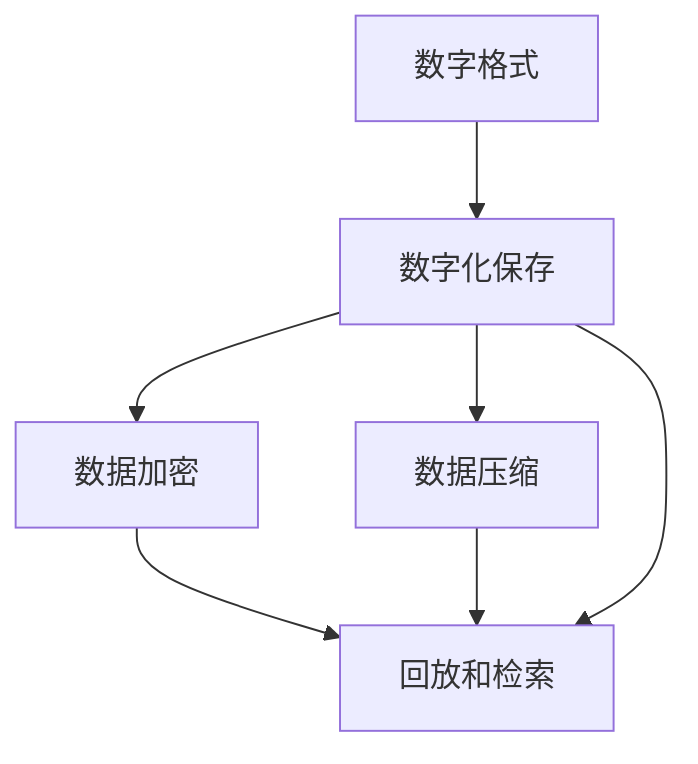

                 

## 1. 背景介绍

### 1.1 问题由来
在数字化时代，数据变得越来越重要，其中情感数据尤其珍贵。情感数据包含大量的个人经历和感受，是个人记忆的宝贵部分。然而，这些数据往往以数字形式存储在各种设备中，容易出现数据丢失、格式混乱等问题。为了更好地保存和利用这些珍贵的情感数据，需要一种新的解决方案来数字化存储和回放这些个人情感记忆。

### 1.2 问题核心关键点
在数字化情感存储的创业中，核心问题是如何将个人的情感数据进行高效、准确、安全的数字化保存和回放。这包括以下几个关键点：
- **数字化存储**：将各种设备上的个人情感数据转换成数字格式，并保存在可靠的云平台或本地存储设备中。
- **高效性**：数字化存储过程需要快速、高效，以便快速完成数据转换和保存。
- **准确性**：在转换过程中，要保证数据的准确性，避免数据丢失和错误。
- **安全性**：在数字化存储过程中，需要保证数据的安全性，避免数据泄露和被篡改。
- **回放性**：数字化存储不仅仅是保存数据，更重要的是能够便捷地回放和检索数据。

### 1.3 问题研究意义
数字化情感存储创业具有重要的研究意义，主要体现在以下几个方面：
- **保存个人记忆**：将个人的情感数据数字化保存，可以让这些宝贵的回忆得以长期保存，不会因时间流逝而消失。
- **促进情感交流**：数字化存储使得情感数据可以更方便地分享和交流，增进人与人之间的情感联系。
- **推动技术发展**：数字化存储技术的发展可以带动相关产业的发展，如云存储、数据处理、人工智能等。

## 2. 核心概念与联系

### 2.1 核心概念概述
在数字化情感存储的创业中，涉及到多个核心概念：

- **数字格式**：将个人情感数据转换成数字格式，以便进行保存和处理。
- **数字化保存**：将数字格式的数据保存在可靠的云平台或本地存储设备中。
- **回放和检索**：从存储设备中快速回放和检索数字化情感数据。
- **数据加密**：在数字化保存和回放过程中，对数据进行加密，确保数据的安全性。
- **数据压缩**：对数据进行压缩，减少存储空间，提高存储效率。

### 2.2 核心概念原理和架构的 Mermaid 流程图


这个流程图展示了数字化情感存储的基本流程：首先，将个人情感数据转换成数字格式；然后，将数字格式的数据进行数字化保存，并对其加密和压缩；最后，从存储设备中回放和检索数字化情感数据。

## 3. 核心算法原理 & 具体操作步骤

### 3.1 算法原理概述
数字化情感存储的算法原理主要包括以下几个步骤：
1. **数据采集**：从各种设备（如手机、电脑、相机等）中采集个人情感数据。
2. **数据预处理**：对采集到的数据进行清洗和预处理，确保数据的准确性和完整性。
3. **数据转换**：将预处理后的数据转换成数字格式，如文本、图片、音频等。
4. **数据保存**：将数字格式的数据保存在可靠的云平台或本地存储设备中。
5. **数据加密**：对保存的数据进行加密，确保数据的安全性。
6. **数据压缩**：对保存的数据进行压缩，减少存储空间，提高存储效率。
7. **数据回放**：从存储设备中快速回放和检索数字化情感数据。

### 3.2 算法步骤详解
以下是数字化情感存储的详细步骤：

**Step 1: 数据采集**
- 通过API接口、应用程序、传感器等方式，从各种设备中采集个人情感数据。

**Step 2: 数据预处理**
- 对采集到的数据进行清洗和预处理，去除无关数据，填补缺失值，校正错误数据等。

**Step 3: 数据转换**
- 将预处理后的数据转换成数字格式，如文本、图片、音频等。
- 例如，将文本数据转换成ASCII码、Unicode编码等格式。
- 将音频数据转换成MP3、WAV等格式。
- 将图片数据转换成JPEG、PNG等格式。

**Step 4: 数据保存**
- 将数字格式的数据保存在可靠的云平台或本地存储设备中。
- 例如，使用Amazon S3、Google Cloud Storage等云存储服务，或者本地硬盘、固态硬盘等存储设备。

**Step 5: 数据加密**
- 对保存的数据进行加密，确保数据的安全性。
- 可以使用AES、RSA等加密算法，对数据进行加密。
- 例如，使用AES算法对保存的数据进行加密，生成加密后的密文。

**Step 6: 数据压缩**
- 对保存的数据进行压缩，减少存储空间，提高存储效率。
- 可以使用Gzip、Zip等压缩算法，对数据进行压缩。
- 例如，使用Gzip算法对保存的数据进行压缩，生成压缩后的文件。

**Step 7: 数据回放**
- 从存储设备中快速回放和检索数字化情感数据。
- 例如，从云存储中下载加密压缩后的数据文件，使用解密算法和解压缩算法还原原始数据。

### 3.3 算法优缺点

数字化情感存储的优点包括：
- **便捷性**：数字化存储可以方便地保存和检索个人情感数据，减少了物理设备的依赖。
- **安全性**：数字化存储通过加密和压缩，确保数据的安全性和存储效率。
- **可扩展性**：数字化存储可以方便地扩展到多个设备和平台，适应不同的数据格式和存储需求。

数字化情感存储的缺点包括：
- **复杂性**：数字化存储涉及数据采集、预处理、转换、保存、加密、压缩和回放等多个步骤，操作复杂。
- **成本高**：数字化存储需要购买云存储服务或本地存储设备，成本较高。
- **隐私问题**：数字化存储涉及大量个人情感数据，需要保护用户隐私。

### 3.4 算法应用领域

数字化情感存储的应用领域非常广泛，主要包括：
- **个人档案**：保存个人的各种情感数据，如日记、照片、视频、音频等。
- **家庭记忆**：保存家庭成员的情感数据，如家庭活动、旅行照片、视频等。
- **企业档案**：保存企业的各种情感数据，如员工反馈、客户满意度、市场调查等。
- **社会记录**：保存社会的各种情感数据，如公共事件、社会舆论、文化活动等。

## 4. 数学模型和公式 & 详细讲解 & 举例说明

### 4.1 数学模型构建
数字化情感存储的数学模型主要包括以下几个部分：
- **数据采集模型**：用于描述从各种设备中采集个人情感数据的模型。
- **数据预处理模型**：用于描述对采集到的数据进行清洗和预处理的模型。
- **数据转换模型**：用于描述将数据转换成数字格式的模型。
- **数据保存模型**：用于描述将数据保存在可靠的云平台或本地存储设备中的模型。
- **数据加密模型**：用于描述对保存的数据进行加密的模型。
- **数据压缩模型**：用于描述对保存的数据进行压缩的模型。
- **数据回放模型**：用于描述从存储设备中回放和检索数字化情感数据的模型。

### 4.2 公式推导过程
以数据加密模型为例，使用AES算法进行数据加密的公式推导过程如下：

**AES算法加密公式**：
\[ C = E_k(P) \]
其中，\( P \)为明文，\( C \)为密文，\( E_k \)为加密函数，\( k \)为密钥。

**AES算法解密公式**：
\[ P = D_k(C) \]
其中，\( C \)为密文，\( P \)为明文，\( D_k \)为解密函数，\( k \)为密钥。

在实际应用中，可以根据具体的加密算法和解密算法，选择合适的加密函数和解密函数。

### 4.3 案例分析与讲解
以保存一张照片的数字化情感存储为例：

**Step 1: 数据采集**
- 通过相机采集到一张照片，保存到手机相册中。

**Step 2: 数据预处理**
- 对照片进行清洗和预处理，去除无关数据，填补缺失值，校正错误数据等。

**Step 3: 数据转换**
- 将预处理后的照片转换成JPEG格式。
- 例如，使用Python的Pillow库将照片转换成JPEG格式。

**Step 4: 数据保存**
- 将转换后的照片保存在Amazon S3云存储中。
- 例如，使用Python的boto3库将照片上传至Amazon S3云存储。

**Step 5: 数据加密**
- 对保存的照片进行AES加密。
- 例如，使用Python的pycryptodome库对照片进行AES加密。

**Step 6: 数据压缩**
- 对加密后的照片进行Gzip压缩。
- 例如，使用Python的gzip库对照片进行Gzip压缩。

**Step 7: 数据回放**
- 从Amazon S3云存储中下载压缩加密后的照片文件。
- 使用解密和解压缩算法还原原始照片。

## 5. 项目实践：代码实例和详细解释说明

### 5.1 开发环境搭建
以下是使用Python进行数字化情感存储项目开发的开发环境配置流程：

1. 安装Anaconda：从官网下载并安装Anaconda，用于创建独立的Python环境。

2. 创建并激活虚拟环境：
```bash
conda create -n digital-emotion python=3.8 
conda activate digital-emotion
```

3. 安装必要的Python库：
```bash
conda install pillow boto3 pycryptodome gzip
```

### 5.2 源代码详细实现
以下是保存一张照片的数字化情感存储项目的Python代码实现：

```python
import os
from PIL import Image
from boto3 import client
from Crypto.Cipher import AES
from Crypto.Random import get_random_bytes

# 照片路径
photo_path = 'path/to/photo.jpg'

# 加密密钥
key = get_random_bytes(16)

# 将照片转换成JPEG格式
image = Image.open(photo_path)
image.save(photo_path + '.jpg')

# 加密照片
def encrypt(photo_path, key):
    with open(photo_path, 'rb') as f:
        plaintext = f.read()
    cipher = AES.new(key, AES.MODE_ECB)
    ciphertext = cipher.encrypt(plaintext)
    with open(photo_path + '.encrypted', 'wb') as f:
        f.write(ciphertext)

# 保存加密照片
encrypt(photo_path + '.jpg', key)

# 压缩加密照片
with open(photo_path + '.encrypted', 'rb') as f:
    encrypted_data = f.read()
with open(photo_path + '.encrypted.gz', 'wb') as f:
    f.write(gzip.compress(encrypted_data))

# 上传加密压缩照片到Amazon S3云存储
s3 = client('s3')
s3.upload_file(photo_path + '.encrypted.gz', 'bucket_name', 'photo.encrypted.gz')
```

### 5.3 代码解读与分析
**代码解析**：
1. 首先，定义照片路径和加密密钥。
2. 使用Pillow库将照片转换成JPEG格式。
3. 定义一个加密函数，使用AES算法对照片进行加密，生成加密后的密文。
4. 将加密后的照片保存到本地，并使用Gzip进行压缩。
5. 使用boto3库将压缩加密后的照片上传至Amazon S3云存储。

**分析**：
- 通过代码实现，可以看出数字化情感存储涉及数据采集、预处理、转换、保存、加密、压缩和回放等多个步骤，操作复杂。
- 数字化存储需要综合考虑各种因素，如数据格式、存储位置、加密算法、压缩算法等。
- 数字化存储可以方便地保存和检索个人情感数据，但需要考虑数据的安全性和隐私问题。

### 5.4 运行结果展示
保存一张照片的数字化情感存储项目的运行结果如下：

1. 照片转换后的JPEG格式文件。
2. 加密后的照片文件。
3. 压缩后的照片文件。
4. 上传至Amazon S3云存储的加密压缩照片文件。

## 6. 实际应用场景
### 6.1 个人档案
数字化情感存储可以应用于个人档案，保存个人的各种情感数据，如日记、照片、视频、音频等。个人可以通过应用程序或网站访问数字化档案，查看和回放保存的数据。数字化档案可以方便地进行备份和迁移，避免了物理设备损坏和数据丢失的风险。

### 6.2 家庭记忆
数字化情感存储可以应用于家庭记忆，保存家庭成员的情感数据，如家庭活动、旅行照片、视频等。家庭成员可以通过应用程序或网站访问数字化记忆，分享和回放保存的数据。数字化记忆可以方便地进行共享和交流，增进家庭成员之间的情感联系。

### 6.3 企业档案
数字化情感存储可以应用于企业档案，保存企业的各种情感数据，如员工反馈、客户满意度、市场调查等。企业可以通过应用程序或网站访问数字化档案，查看和回放保存的数据。数字化档案可以方便地进行数据分析和决策，提高企业的管理和运营效率。

### 6.4 社会记录
数字化情感存储可以应用于社会记录，保存社会的各种情感数据，如公共事件、社会舆论、文化活动等。社会可以通过应用程序或网站访问数字化记录，分享和回放保存的数据。数字化记录可以方便地进行社会分析和研究，推动社会的进步和发展。

## 7. 工具和资源推荐

### 7.1 学习资源推荐
为了帮助开发者系统掌握数字化情感存储的理论基础和实践技巧，这里推荐一些优质的学习资源：

1. 《Python数据科学手册》：一本关于Python数据处理的经典书籍，涵盖数据采集、预处理、转换、保存、加密、压缩和回放等步骤。

2. 《数据科学实战》：一本关于数据科学实践的书籍，包含大量实用的案例和代码示例。

3. 《A First Course in Coding: Interactive Python》：一本适合初学者的Python编程入门书籍，涵盖数据处理、数据分析、数据可视化等基础知识。

4. 《深度学习与数据科学》：一本关于深度学习和数据科学的书籍，涵盖深度学习模型的构建、训练和应用。

5. 《NLP实战：文本挖掘与情感分析》：一本关于自然语言处理和情感分析的书籍，涵盖文本数据采集、预处理、转换、保存、加密、压缩和回放等步骤。

### 7.2 开发工具推荐
以下是一些常用的开发工具，可以帮助开发者高效地进行数字化情感存储项目开发：

1. Anaconda：一个开源的Python发行版，可以创建和管理多个Python环境，方便进行依赖管理和代码共享。

2. Visual Studio Code：一个轻量级的代码编辑器，支持多种语言和插件，方便进行代码编写和调试。

3. Jupyter Notebook：一个交互式的笔记本环境，支持Python、R等语言，方便进行数据处理和可视化。

4. AWS CLI：一个基于AWS的命令行工具，可以方便地进行云存储操作。

5. PyCryptodome：一个Python加密库，支持多种加密算法，方便进行数据加密和解密。

### 7.3 相关论文推荐
以下是几篇关于数字化情感存储的论文，推荐阅读：

1. "Digital Archiving: Preserving Digital Records for Future Generations"：讨论了数字化档案的构建和管理，探讨了数字格式、数据加密和数据压缩等关键技术。

2. "A Survey on Digital Preservation of Digital Images"：探讨了数字图像的数字化保存和回放技术，讨论了数据采集、预处理、转换、保存、加密和回放等步骤。

3. "Data Encryption and Compression Techniques for Digital Storage"：探讨了数据加密和压缩技术在数字化存储中的应用，讨论了AES、Gzip等加密和压缩算法。

4. "Digital Storage for Archival Purposes: An Overview"：探讨了数字化存储的架构和应用，讨论了数据采集、预处理、转换、保存、加密、压缩和回放等步骤。

## 8. 总结：未来发展趋势与挑战

### 8.1 研究成果总结
数字化情感存储技术在数字化时代具有重要的应用价值，已经在个人档案、家庭记忆、企业档案和社会记录等多个领域得到了广泛应用。数字化情感存储技术通过数据采集、预处理、转换、保存、加密、压缩和回放等步骤，实现了个人情感数据的长期保存和便捷回放。

### 8.2 未来发展趋势
未来的数字化情感存储技术将呈现以下几个发展趋势：
1. **智能化**：未来的数字化情感存储技术将进一步智能化，通过人工智能技术，实现情感数据的自动化处理和分析。
2. **自动化**：未来的数字化情感存储技术将进一步自动化，通过自动化工具，实现情感数据的自动采集、预处理、转换、保存、加密、压缩和回放。
3. **安全性**：未来的数字化情感存储技术将进一步提高安全性，通过先进的加密算法和数据保护技术，确保情感数据的安全性和隐私保护。
4. **个性化**：未来的数字化情感存储技术将进一步个性化，通过个性化推荐和用户定制，满足不同用户的需求和偏好。
5. **云化**：未来的数字化情感存储技术将进一步云化，通过云平台和云服务，实现情感数据的便捷管理和访问。

### 8.3 面临的挑战
尽管数字化情感存储技术在实际应用中已经取得了一些进展，但仍面临以下挑战：
1. **数据隐私**：数字化情感存储涉及大量个人情感数据，需要保护用户隐私，避免数据泄露和滥用。
2. **数据质量**：数字化情感存储需要保证数据的质量，避免数据缺失、错误和噪声。
3. **数据安全**：数字化情感存储需要保证数据的安全性，避免数据篡改和攻击。
4. **数据兼容性**：数字化情感存储需要支持多种数据格式和存储方式，确保数据兼容性。
5. **数据迁移**：数字化情感存储需要支持数据的迁移和备份，避免数据丢失和损坏。

### 8.4 研究展望
未来的数字化情感存储技术需要在以下几个方面进行研究：
1. **数据隐私保护**：研究如何保护用户的隐私，避免数据泄露和滥用。
2. **数据质量控制**：研究如何提高数据的质量，避免数据缺失、错误和噪声。
3. **数据安全技术**：研究如何提高数据的安全性，避免数据篡改和攻击。
4. **数据兼容性技术**：研究如何支持多种数据格式和存储方式，确保数据兼容性。
5. **数据迁移技术**：研究如何支持数据的迁移和备份，避免数据丢失和损坏。

## 9. 附录：常见问题与解答

**Q1: 数字化情感存储是否适用于所有情感数据类型？**

A: 数字化情感存储适用于大部分情感数据类型，如文本、图片、音频等。但是，对于一些特殊的情感数据类型，如视频、传感器数据等，需要进行特殊的处理和保存。

**Q2: 数据加密和压缩是否会影响数据的回放速度？**

A: 数据加密和压缩会对数据的回放速度产生一定的影响。但是，通过选择合适的加密算法和压缩算法，可以最大限度地减少回放时间，保证数据的快速回放。

**Q3: 如何保护用户的数据隐私？**

A: 保护用户的数据隐私，需要在数字化情感存储过程中采用多种措施，如数据加密、数据匿名化、数据访问控制等。同时，需要建立完善的数据隐私保护政策，规范数据的使用和保护。

**Q4: 数字化情感存储是否适合存储所有类型的情感数据？**

A: 数字化情感存储适合存储大部分类型的情感数据，但是一些特殊的情感数据类型，如传感器数据、生物特征数据等，需要进行特殊的处理和保存。

**Q5: 数字化情感存储技术的发展方向是什么？**

A: 数字化情感存储技术的发展方向包括智能化、自动化、安全性、个性化和云化。未来的数字化情感存储技术将通过人工智能技术、自动化工具、先进的加密算法和数据保护技术，进一步提升其应用价值和用户体验。

---

作者：禅与计算机程序设计艺术 / Zen and the Art of Computer Programming

