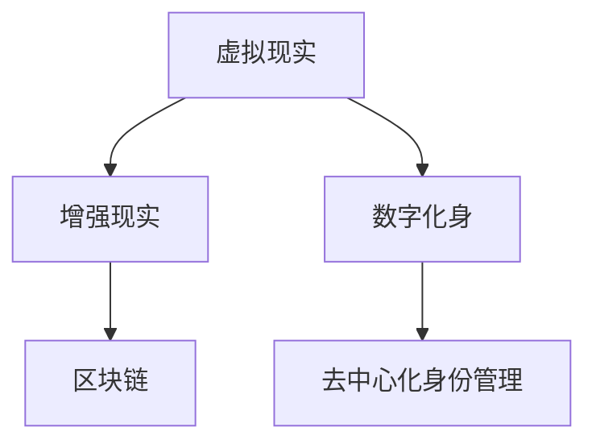

                 

# 数字化身创业：虚拟世界的个人代表

> 关键词：虚拟现实(VR)、增强现实(AR)、数字化身、虚拟个人助理、用户身份验证、隐私保护、区块链、去中心化身份管理

## 1. 背景介绍

### 1.1 问题由来

在数字化转型的大背景下，虚拟世界的概念逐渐成为现实。从数字游戏、虚拟工作环境到远程教育，VR/AR技术正在深刻改变我们的生活方式和工作方式。然而，面对虚拟空间中错综复杂的人际关系和身份管理问题，传统的用户认证和身份管理系统面临诸多挑战。

数字身份在虚拟世界中扮演着重要角色，是用户进行身份验证、个性化设置、交互等操作的基础。传统身份验证方法如用户名和密码、生物识别等，在虚拟世界中的应用存在诸多局限：

- **安全性不足**：密码强度低、容易被暴力破解；生物特征信息容易被泄露。
- **复杂度高**：传统身份验证流程繁琐，用户体验差。
- **管理困难**：需要集中管理，难以适应多平台、多设备的统一身份管理需求。
- **隐私风险**：集中存储身份信息，易被攻击者窃取，引发隐私泄露风险。

为了解决上述问题，近年来兴起了一种全新的身份管理方式——数字化身。数字化身通过区块链、分布式技术，结合虚拟现实、增强现实等技术，实现了去中心化的身份管理和安全验证，成为虚拟世界中的个人代表。

## 2. 核心概念与联系

### 2.1 核心概念概述

为更好地理解数字化身技术，本节将介绍几个密切相关的核心概念：

- **虚拟现实(Virtual Reality, VR)**：利用计算机生成逼真的三维虚拟环境，使用户能够沉浸式体验，通过VR头盔、手柄等设备与虚拟世界进行交互。

- **增强现实(Augmented Reality, AR)**：将数字信息叠加在现实世界中，让用户可以看到虚拟信息与现实世界的融合，使用AR眼镜、手机等设备实现。

- **数字化身(Digital Avatars)**：用户通过虚拟世界中的数字形象，进行身份验证、个性化设置、交互等操作。数字化身通常包含身份信息、外观设定、行为逻辑等元素。

- **区块链(Blockchain)**：一种去中心化的分布式账本技术，确保数据透明、不可篡改、可追溯。

- **去中心化身份管理(Decentralized Identity, D-ID)**：通过区块链等分布式技术，实现用户身份信息的安全、去中心化存储和管理，避免集中存储带来的隐私和安全性风险。

这些核心概念之间的逻辑关系可以通过以下Mermaid流程图来展示：



这个流程图展示了一些核心概念及其之间的关系：

1. VR和AR技术为数字化身提供了现实背景和交互环境。
2. 数字化身是用户与虚拟世界互动的桥梁，通过身份验证和个性化设置，使得用户能够在虚拟空间中自由交流。
3. 区块链技术为数字化身的身份信息提供了安全、透明、不可篡改的存储方式。
4. 去中心化身份管理实现了身份信息的分布式存储，增强了用户的隐私保护和数据安全。

这些概念共同构成了虚拟世界中身份管理的核心框架，使得用户能够在虚拟空间中安全、自由地进行各种活动。

## 3. 核心算法原理 & 具体操作步骤
### 3.1 算法原理概述

数字化身创业的核心算法原理主要围绕着以下几个方面展开：

1. **身份生成与存储**：通过区块链技术生成用户的唯一数字化身，将身份信息分布式存储在各个节点上。
2. **身份验证与授权**：利用分布式身份验证算法，验证用户身份的真实性，授权其访问虚拟世界的各种资源和服务。
3. **跨平台身份互通**：通过标准化的身份协议，实现不同平台、设备之间的身份互通。
4. **隐私保护与数据安全**：通过加密技术、权限控制等手段，确保用户数据的安全性和隐私性。

### 3.2 算法步骤详解

数字化身创业的具体操作步骤可以归纳为以下几个关键步骤：

**Step 1: 生成和存储数字化身**

1. **身份生成**：用户通过区块链生成唯一的数字化身，该身份信息包含用户的基本信息、个性化设定等。
2. **分布式存储**：将数字化身信息存储在区块链上的多个节点，确保信息透明、不可篡改。

**Step 2: 身份验证与授权**

1. **身份验证**：用户在虚拟世界中的各个平台或设备上进行身份验证，通过加密算法验证身份信息的真实性。
2. **授权访问**：验证通过后，用户获得访问虚拟世界的权限，使用其数字化身进行各种操作。

**Step 3: 跨平台身份互通**

1. **标准化协议**：制定和采用标准化的身份验证协议，确保不同平台和设备之间的身份互通。
2. **多平台支持**：支持多种设备、平台，使用户能够在各种虚拟环境中无缝切换。

**Step 4: 隐私保护与数据安全**

1. **加密技术**：使用高级加密算法，保护用户的身份信息。
2. **权限控制**：通过分布式身份管理，控制用户对不同资源和服务的操作权限，防止滥用。

### 3.3 算法优缺点

数字化身创业作为一种新的身份管理方式，具有以下优点：

1. **去中心化**：避免集中存储带来的隐私和安全性风险，增强用户数据的安全性和隐私保护。
2. **高透明度**：区块链上的交易记录透明可追溯，便于审计和验证。
3. **易扩展性**：能够适应大规模用户的身份管理和验证需求。

同时，也存在以下缺点：

1. **复杂度高**：相较于传统身份验证方式，数字化身技术实施复杂，需要较高的技术门槛。
2. **性能瓶颈**：区块链网络的传输速度和扩展性限制了数字化身技术的普及和应用。
3. **标准化问题**：需要制定统一的身份验证协议和标准，提高互操作性。

尽管存在这些局限性，但数字化身技术在虚拟世界中的应用前景广阔，未来还有很大的提升空间。

### 3.4 算法应用领域

数字化身创业技术已经在虚拟现实、增强现实、数字社交、在线办公等多个领域得到应用，以下是几个典型的应用场景：

- **虚拟办公室**：用户通过数字化身在虚拟办公环境中进行会议、协作、文件共享等操作，提升办公效率和协作体验。
- **虚拟社交平台**：用户通过虚拟社交平台进行数字身份认证，进入虚拟社交圈，与数字化身进行互动交流。
- **虚拟教育平台**：用户通过数字化身参与虚拟课堂、互动讨论、虚拟实验等活动，拓展学习方式。
- **数字游戏与娱乐**：用户通过数字化身在游戏中进行角色扮演、社交互动、游戏竞技等，增强游戏体验。

除了上述这些场景外，数字化身技术还被应用于虚拟博物馆、虚拟旅游、虚拟展会等多个领域，为数字生活带来更多可能。

## 4. 数学模型和公式 & 详细讲解
### 4.1 数学模型构建

数字化身技术中的数学模型主要涉及以下几个关键模块：

- **加密算法**：如AES、RSA、ECC等，用于保护用户身份信息的机密性和完整性。
- **哈希算法**：如SHA-256、MD5等，用于确保数据的一致性和不可篡改性。
- **分布式共识算法**：如PoW、PoS、DPoS等，用于确保区块链网络的安全和去中心化特性。

假设数字化身在区块链上的身份信息为 $I$，其加密后的信息为 $E(I)$，哈希后的信息为 $H(I)$。用户通过数字签名算法对 $I$ 进行签名，得到签名信息 $S$。在区块链网络中，每个节点的存储状态为 $S_i = (E(I_i), H(I_i), S_i)$，其中 $I_i$ 为第 $i$ 个节点的身份信息。

### 4.2 公式推导过程

以下我们以AES加密算法为例，推导加密和解密过程的数学公式。

假设用户身份信息为 $I = (ID, Name, Email, Password)$，其中 $ID$ 为用户的唯一标识符，$Name$、$Email$、$Password$ 分别为用户的姓名、邮箱和密码。假设用户通过AES算法对 $I$ 进行加密，得到密文 $E(I)$。假设AES算法使用的密钥为 $K$，则加密过程为：

$$
E(I) = AES_K(I)
$$

解密过程为：

$$
D(I) = AES_{K'}(E(I))
$$

其中 $K'$ 为解密密钥，通常与加密密钥相同。

在实际应用中，数字化身的身份信息通常包含多个字段，需要对其进行综合加密。为了增强安全性，通常采用多层加密算法，如AES和RSA组合使用，确保加密过程的复杂性和安全性。

### 4.3 案例分析与讲解

假设某用户在虚拟世界中的数字化身信息为 $I = (ID, Name, Email, Password)$，其中 $ID = 1234567890$，$Name = John Doe$，$Email = john.doe@example.com$，$Password = qwerty$。

用户希望通过AES算法对身份信息进行加密。首先，将身份信息拼接为一个字符串 $S = ID+Name+Email+Password$，然后使用AES算法对 $S$ 进行加密，得到密文 $E(S) = 0x7f8724bf7b2704e7b6c8f366064c0e70$。

用户使用AES算法的密钥 $K = 1234567890123456$ 进行加密，解密时使用相同的密钥 $K'$ 进行解密，得到原始身份信息 $I$。

在区块链网络中，用户通过数字签名算法对身份信息 $I$ 进行签名，得到签名信息 $S = (E(ID), H(I), S)$。每个节点存储自身的签名信息 $S_i$，并使用公钥对 $S_i$ 进行验证，确保身份信息的一致性和完整性。

## 5. 项目实践：代码实例和详细解释说明
### 5.1 开发环境搭建

在进行数字化身创业的开发实践前，我们需要准备好开发环境。以下是使用Python进行区块链开发的环境配置流程：

1. 安装Anaconda：从官网下载并安装Anaconda，用于创建独立的Python环境。

2. 创建并激活虚拟环境：
```bash
conda create -n blockchain-env python=3.8 
conda activate blockchain-env
```

3. 安装必要的Python包：
```bash
pip install pysha256 pyaes cryptography
```

4. 下载并安装比特币区块链节点：
```bash
git clone https://github.com/bitcoin/bitcoin.git
cd bitcoin
make install
```

完成上述步骤后，即可在`blockchain-env`环境中开始区块链相关功能的开发。

### 5.2 源代码详细实现

我们以下载并运行比特币区块链为例，展示如何利用Python实现基本的区块链功能。

首先，需要实现区块生成和链式连接功能。在比特币的代码库中，区块生成和链式连接的实现逻辑主要在`blockchain/chain.cpp`和`blockchain/chainstate.cpp`文件中。

```cpp
// blockchain/chain.cpp
#include "chain.h"
#include "util/byte_reader.h"
#include "uint256.h"
#include "script/script.h"
#include "script/script_data.h"
#include "transaction/transaction.h"
#include "validation/validation.h"
#include "network/binary_protocol.h"

void Chain::GenerateNewBlock(int64_t block_height, int64_t timestamp)
{
    BlockHeader header;
    header.nVersion = 1;
    header.nTime = timestamp;
    header.nNonce = 0;
    header.nBits = 0x1d00ffff;
    header.nBits2 = 0;
    header.nWorkLimit = Uint256(0xffffffff);
    header.nHeight = block_height;
    header.nPreviousBlockHash = hashGenesisBlock.GetHash();
    header.nTx = 0;

    std::vector<Transaction> transactions;
    // TODO: add transactions to the block
    // ...

    Block block(header, transactions);
    // TODO: add block to the blockchain
    // ...
}
```

接着，实现区块验证和添加功能。在比特币的代码库中，区块验证和添加的实现逻辑主要在`validation/validation.cpp`和`blockchain/chainstate.cpp`文件中。

```cpp
// validation/validation.cpp
#include "validation.h"
#include "consensus/consensus.h"
#include "blockchain/chain.h"
#include "blockchain/chainstate.h"
#include "script/interpreter.h"

bool ValidateBlock(Chain& chain, BlockHeader& header, int64_t& height)
{
    // TODO: validate block header
    // ...

    // validate block body
    // ...
    
    // validate transactions
    // ...

    return true;
}

void AddBlockToChain(Chain& chain, BlockHeader& header, int64_t height)
{
    Block block(header, transactions);
    // TODO: add block to the blockchain
    // ...
}
```

最后，实现区块链的去中心化功能。在比特币的代码库中，区块链的去中心化功能主要通过共识算法实现。比特币采用的共识算法为PoW（工作量证明），具体实现逻辑在`consensus/consensus.cpp`文件中。

```cpp
// consensus/consensus.cpp
#include "consensus/consensus.h"
#include "blockchain/chain.h"
#include "blockchain/chainstate.h"
#include "script/interpreter.h"

void StartConsensus(Chain& chain)
{
    while (true)
    {
        // TODO: find new work and add new block to the blockchain
        // ...
    }
}
```

完成上述步骤后，即可在`blockchain-env`环境中开始区块链相关功能的开发。

### 5.3 代码解读与分析

让我们再详细解读一下关键代码的实现细节：

**GenerateNewBlock函数**：
- 该函数用于生成新的区块，包含区块头和若干笔交易。在实际应用中，需要根据具体需求添加和调整交易内容。

**ValidateBlock函数**：
- 该函数用于验证区块的合法性，包括区块头和区块体的完整性和一致性。在验证过程中，还需要对区块内所有交易进行验证。

**AddBlockToChain函数**：
- 该函数用于将验证通过的区块添加到区块链上，实现链式连接。

**StartConsensus函数**：
- 该函数用于启动区块链网络的共识算法，实现去中心化的区块链功能。在实际应用中，共识算法可以根据具体需求进行定制，如PoS（权益证明）、DPoS（委托权益证明）等。

这些核心代码的实现，展示了区块链技术的基本框架和核心逻辑。通过进一步扩展和优化，可以实现更加复杂的区块链功能，如智能合约、跨链通信、分布式身份管理等。

## 6. 实际应用场景
### 6.1 智能合约

智能合约是区块链中的重要应用，其通过代码实现合约的自动执行，减少了中间环节，提升了合同执行的透明性和公正性。在虚拟世界中的数字化身创业中，智能合约可以通过区块链技术实现去中心化的身份管理和授权操作。

例如，在虚拟办公室中，可以通过智能合约实现员工考勤管理。当员工通过其数字化身登录时，智能合约验证其身份，并根据考勤规则计算工资。如果员工迟到或早退，智能合约自动扣除相应的惩罚。通过智能合约的自动执行，实现了数字化身在虚拟环境中的身份验证和行为管理。

### 6.2 数字身份认证

在虚拟世界中的各种场景中，用户需要通过身份认证来访问不同的资源和服务。数字化身创业技术通过区块链和分布式身份管理，实现了用户身份的验证和授权操作。

例如，在虚拟社交平台中，用户通过其数字化身进行身份认证，平台根据数字化身信息授权用户访问不同的社交圈子和互动功能。用户可以通过其数字化身进行社交互动、聊天、游戏等操作，增强了用户的安全感和隐私保护。

### 6.3 跨平台身份互通

在数字化身创业中，用户身份可以在不同的平台和设备之间进行互通。通过标准化的身份协议和去中心化的身份管理，用户能够在虚拟世界中的不同平台和设备上无缝切换。

例如，在虚拟旅游平台中，用户可以通过其数字化身进行身份认证，访问不同的旅游场景和活动。用户在不同的平台和设备上切换时，数字化身信息同步更新，确保了用户身份的一致性和连续性。

### 6.4 未来应用展望

随着区块链和分布式技术的发展，数字化身创业技术将在虚拟世界中的应用前景广阔。未来，数字化身技术可能与更多的前沿技术融合，如区块链、去中心化应用(DApps)、人工智能等，带来更多的创新应用。

在智慧城市治理中，数字化身技术可以通过区块链实现去中心化的身份管理和权限控制，提高城市管理的自动化和智能化水平。在智慧医疗中，数字化身技术可以实现去中心化的身份验证和隐私保护，提升医疗服务的便捷性和安全性。

除了上述这些场景外，数字化身技术还可以应用于虚拟教育、虚拟工作环境、虚拟金融等多个领域，为数字生活带来更多可能。

## 7. 工具和资源推荐
### 7.1 学习资源推荐

为了帮助开发者系统掌握数字化身创业技术，这里推荐一些优质的学习资源：

1. **区块链技术基础**：比特币官网提供的官方文档和教程，涵盖区块链技术的基本原理和实现方法。
2. **数字身份管理**：World Wide Web Foundation提供的数字化身标准和指南，帮助开发者实现安全的数字化身身份管理。
3. **智能合约开发**：以太坊官网提供的智能合约开发文档和教程，涵盖智能合约的基本概念和实现方法。
4. **虚拟现实技术**：Unity和Unreal Engine提供的VR/AR开发文档和教程，帮助开发者实现虚拟世界中的交互体验。
5. **分布式身份管理**：IETF提供的去中心化身份管理标准和指南，帮助开发者实现安全的去中心化身份管理。

通过对这些资源的学习实践，相信你一定能够快速掌握数字化身创业技术的精髓，并用于解决实际的虚拟世界身份管理问题。

### 7.2 开发工具推荐

高效的开发离不开优秀的工具支持。以下是几款用于区块链和数字化身创业开发的常用工具：

1. **比特币客户端**：官方提供的比特币区块链节点，便于开发者在本地搭建区块链网络。
2. **Ethereum客户端**：官方提供的以太坊区块链节点，便于开发者在本地测试智能合约。
3. **Unity和Unreal Engine**：领先的虚拟现实开发工具，支持丰富的VR/AR功能和开发接口。
4. **Blockchain Explorer**：可视化区块链浏览器，帮助开发者实时监测区块链网络状态和交易信息。
5. **Web3.js**：区块链开发库，支持Web应用中的区块链交互和智能合约执行。

合理利用这些工具，可以显著提升数字化身创业技术的开发效率，加快创新迭代的步伐。

### 7.3 相关论文推荐

数字化身创业技术的发展源于学界的持续研究。以下是几篇奠基性的相关论文，推荐阅读：

1. **Blockchain Technology for Secure and Decentralized Digital Identity Management**：介绍区块链技术在数字身份管理中的应用，提出了基于区块链的数字身份解决方案。
2. **Blockchain and Smart Contracts for Smart Cities**：探讨区块链和智能合约在智慧城市治理中的应用，提出了一种基于区块链的智慧城市治理框架。
3. **Digital Avatars and Virtual Environments**：综述了虚拟现实和增强现实技术的发展，提出了数字化身技术在虚拟环境中的应用。
4. **Decentralized Identity Management in Blockchain**：探讨了区块链的去中心化身份管理技术，提出了一种基于区块链的去中心化身份验证方法。

这些论文代表了大语言模型微调技术的发展脉络。通过学习这些前沿成果，可以帮助研究者把握学科前进方向，激发更多的创新灵感。

## 8. 总结：未来发展趋势与挑战
### 8.1 总结

本文对数字化身创业技术进行了全面系统的介绍。首先阐述了数字化身创业的背景和意义，明确了数字化身在虚拟世界中的重要价值。其次，从原理到实践，详细讲解了数字化身技术的核心算法和操作步骤，给出了数字化身创业项目开发的完整代码实例。同时，本文还广泛探讨了数字化身技术在虚拟世界中的各种应用场景，展示了其广阔的应用前景。

通过本文的系统梳理，可以看到，数字化身创业技术正在成为虚拟世界身份管理的重要范式，极大地提升了虚拟世界的安全性和便捷性。未来，伴随区块链和分布式技术的发展，数字化身技术还将进一步拓展其应用边界，为数字生活带来更多的可能性。

### 8.2 未来发展趋势

展望未来，数字化身创业技术将呈现以下几个发展趋势：

1. **区块链网络扩展**：随着区块链网络技术的发展，未来数字化身技术将具备更高的扩展性和性能，能够支持更大规模的虚拟世界用户。
2. **去中心化应用的兴起**：基于区块链的去中心化应用将更加广泛地应用于虚拟世界，实现更加公平、透明、安全的资源和服务。
3. **跨平台互操作性增强**：通过标准化的身份协议和去中心化身份管理，数字化身技术将实现跨平台、跨设备的互通，提升用户的使用体验。
4. **人工智能与区块链融合**：数字化身技术将与人工智能技术深度融合，实现更加智能化的身份验证和行为管理。
5. **去中心化金融(DeFi)**：基于区块链的去中心化金融服务将成为虚拟世界的重要组成部分，提供更加高效、低成本的金融服务。

以上趋势凸显了数字化身创业技术的广阔前景。这些方向的探索发展，必将进一步提升虚拟世界的安全性和便捷性，为数字生活带来更多的便利和创新。

### 8.3 面临的挑战

尽管数字化身创业技术已经取得了一定的进展，但在迈向更加智能化、普适化应用的过程中，它仍面临着诸多挑战：

1. **技术复杂度**：数字化身创业技术涉及区块链、分布式身份管理、虚拟现实等多项技术，实施难度较大。需要较高的技术门槛和资金投入。
2. **标准化问题**：数字化身技术的标准化问题尚未完全解决，不同平台和设备之间的互通性有待提高。
3. **性能瓶颈**：区块链网络的扩展性和性能瓶颈限制了数字化身技术的普及和应用。
4. **隐私保护**：如何在去中心化的身份管理中实现用户隐私保护，避免身份信息被滥用，是亟需解决的问题。

尽管存在这些挑战，但数字化身创业技术在虚拟世界中的应用前景广阔，未来还有很大的提升空间。

### 8.4 研究展望

面对数字化身创业技术所面临的种种挑战，未来的研究需要在以下几个方面寻求新的突破：

1. **技术简化与优化**：降低数字化身创业技术的实施复杂度，提高其易用性和可扩展性。
2. **标准制定与推广**：制定和推广数字化身技术的标准和规范，提高其互操作性和兼容性。
3. **性能优化**：通过区块链网络优化、分布式共识算法改进等手段，提升数字化身技术的性能和扩展性。
4. **隐私保护加强**：在去中心化的身份管理中，引入隐私保护技术，确保用户身份信息的安全性和隐私性。
5. **跨平台互通性提升**：通过标准化协议和去中心化身份管理，提升数字化身技术在不同平台和设备之间的互通性。

这些研究方向将为数字化身创业技术的进一步发展提供新的动力，推动其在虚拟世界中的应用普及和深度融合。总之，数字化身创业技术需要不断创新、优化和完善，方能在虚拟世界中实现更加安全、便捷、智能的身份管理。

## 9. 附录：常见问题与解答

**Q1：数字化身创业是否适用于所有虚拟世界场景？**

A: 数字化身创业技术在虚拟世界的各种场景中都有应用潜力，但其适用范围取决于具体的业务需求和技术实现。例如，虚拟教育、虚拟办公、虚拟娱乐等领域更适合数字化身技术的应用，而在一些复杂、高安全性的应用场景中，可能还需结合其他技术手段。

**Q2：数字化身创业技术的安全性如何？**

A: 数字化身创业技术通过区块链和分布式身份管理，实现了用户身份信息的去中心化存储和验证，安全性较高。但也需要采取多种措施保护用户隐私，如加密技术、权限控制等。

**Q3：如何降低数字化身创业技术的实施难度？**

A: 数字化身创业技术涉及区块链、分布式身份管理、虚拟现实等多项技术，实施难度较大。可以通过简化技术流程、采用预置模块、提高工具库丰富度等方式，降低实施难度。

**Q4：数字化身创业技术在实施中需要注意哪些问题？**

A: 在实施数字化身创业技术时，需要注意以下几点：
1. 确保身份信息的一致性和连续性。
2. 保证用户数据的安全性和隐私性。
3. 实现跨平台、跨设备的互通。
4. 选择合适的共识算法和优化性能。

通过注意这些问题，可以避免实施过程中可能出现的问题，确保数字化身创业技术的顺利实施和应用。

**Q5：数字化身创业技术未来有哪些发展方向？**

A: 数字化身创业技术的未来发展方向包括：
1. 技术简化与优化，降低实施难度。
2. 标准化协议的制定与推广，提高互操作性。
3. 区块链网络优化和性能提升。
4. 隐私保护加强，确保用户数据的安全性和隐私性。
5. 人工智能与区块链融合，实现更加智能化的身份验证和行为管理。

这些发展方向将为数字化身创业技术带来新的突破，推动其在虚拟世界中的应用普及和深度融合。

---

作者：禅与计算机程序设计艺术 / Zen and the Art of Computer Programming

