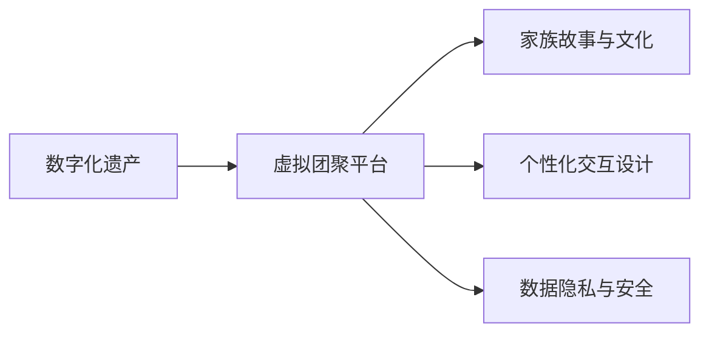

                 

# 数字化遗产虚拟重聚创业：跨越时空的家庭团聚

数字化遗产虚拟重聚创业，是一种利用数字技术实现家庭团聚的创新方式。它通过构建虚拟空间，将已故亲人的数字足迹整合在一起，使家庭成员能够在虚拟世界中重聚，跨越时空的界限，重建亲情联系。本文将系统性地介绍这一领域的核心概念、技术原理、项目实践和未来展望，力图为有志于此领域的创业者提供全面的技术指引和理论支撑。

## 1. 背景介绍

### 1.1 问题由来
随着科技的进步和人们数字化生活的深入，越来越多的人开始使用智能手机、社交媒体、家庭记录设备和在线服务来记录生活中的点滴。然而，这些数字遗产在亲人离世后，往往成为遗物，难以传承和保存。如何保存和利用这些数字遗产，使其成为家庭团聚的新纽带，成为了一个亟待解决的问题。

数字化遗产虚拟重聚创业的初衷，正是利用数字技术，将这些数字遗产转化为有价值的家族资源，让家庭成员能够在虚拟世界中共享和传承这些珍贵的记忆。它不仅可以跨越时空的界限，让无法相见的家庭成员重聚，还能传递家族文化和历史，延续家族的血脉与情感。

### 1.2 问题核心关键点
数字化遗产虚拟重聚创业的关键点包括：
- **数字遗产的整合与保存**：将分散在各处的数字遗产（如照片、视频、文字记录等）收集、整理、整合到统一的虚拟空间中。
- **虚拟团聚平台的构建**：搭建一个能容纳所有家庭成员的虚拟世界，让每一个人都能在虚拟空间中与家人互动。
- **家族故事的讲述与延续**：利用虚拟空间，重新讲述家族的历史，延续家族的故事，使家庭成员对家族文化有更深刻的理解与认同。

## 2. 核心概念与联系

### 2.1 核心概念概述

数字化遗产虚拟重聚创业涉及多个核心概念：

- **数字化遗产**：指家庭成员在数字化过程中形成的各类数据记录，包括图片、视频、音频、文档、社交媒体等。
- **虚拟团聚平台**：构建一个基于Web或移动端的虚拟空间，使家庭成员能够在虚拟世界中共享数字遗产。
- **家族故事与文化**：通过虚拟空间中对家族故事的讲述和展示，传承家族文化和历史，增强家庭成员之间的情感联系。
- **个性化交互设计**：在虚拟空间中提供个性化的互动体验，如语音识别、AR/VR体验等，提升用户参与感。
- **数据隐私与安全**：确保用户数据的隐私和安全，防止数据泄露和不当使用。

这些概念之间的逻辑关系可以用以下Mermaid流程图表示：



这个流程图展示了数字化遗产虚拟重聚创业的核心环节，即数字遗产的整合与保存、虚拟团聚平台的搭建、家族故事的讲述与延续，以及个性化交互设计和数据隐私安全保障。

## 3. 核心算法原理 & 具体操作步骤

### 3.1 算法原理概述

数字化遗产虚拟重聚创业的核心算法包括：

- **数字遗产整合算法**：将散落在不同设备上的数字遗产整合到一个统一的平台中，通过数据清洗、格式转换、元数据标注等步骤，确保数据的完整性和可访问性。
- **虚拟团聚平台搭建算法**：基于Web或移动端技术，构建一个具有高度交互性和可扩展性的虚拟空间，支持用户在虚拟世界中进行互动。
- **家族故事讲述算法**：利用自然语言处理和计算机视觉技术，从数字遗产中自动抽取和生成家族故事，通过虚拟空间进行展示。
- **个性化交互设计算法**：结合AR/VR技术，提供沉浸式的家族互动体验，如虚拟现实中的家庭聚会、共同回忆等。
- **数据隐私与安全算法**：使用加密技术、访问控制等手段，保护用户数据的安全，确保隐私不被泄露。

### 3.2 算法步骤详解

数字化遗产虚拟重聚创业的技术实现可以分为以下几个步骤：

**Step 1: 数字遗产收集与整理**
- 通过扫描、导出等方法，从各种设备和平台上收集家庭成员的数字遗产。
- 对收集到的数据进行分类、清洗，去除冗余和无关信息。
- 使用OCR等技术对纸质文档进行数字化，保存为数字格式。
- 为每一项数字遗产添加元数据，包括创建时间、地点、相关人物等信息。

**Step 2: 虚拟团聚平台搭建**
- 选择Web或移动端技术框架，搭建虚拟团聚平台。
- 设计虚拟空间的用户界面，确保简洁、易用、美观。
- 集成语音识别、面部识别、手势识别等交互技术，提升用户体验。
- 实现多用户并发功能，支持大规模家庭团聚。

**Step 3: 家族故事讲述**
- 利用自然语言处理和计算机视觉技术，从数字遗产中自动抽取和生成家族故事。
- 设计故事展示的逻辑和界面，让故事在虚拟空间中流畅展示。
- 支持用户编辑、评论、分享故事，增强互动性。

**Step 4: 个性化交互设计**
- 结合AR/VR技术，设计虚拟空间中的家族互动体验。
- 使用3D建模技术，重建家族历史场景，如老屋、庭院等。
- 设计虚拟游戏中的家族元素，如家族成员的虚拟形象、家族徽章等。

**Step 5: 数据隐私与安全**
- 使用加密技术，确保数据在传输和存储过程中不被窃取。
- 设计用户认证和访问控制机制，限制未授权访问。
- 实现数据备份与恢复机制，确保数据的完整性。

### 3.3 算法优缺点

数字化遗产虚拟重聚创业的算法具有以下优点：

- **用户友好性**：通过虚拟空间，将复杂的数据整理和交互体验简化，降低使用门槛。
- **高效整合**：利用自动化工具进行数据清洗和整合，提升效率。
- **沉浸式体验**：结合AR/VR技术，提供沉浸式的家族互动体验。
- **隐私保护**：通过加密和访问控制，保护用户数据安全。

同时，这一方法也存在一些局限：

- **初始投入高**：需要较高的技术投入和初期成本。
- **技术门槛高**：对技术和创意要求较高，需要跨学科团队协作。
- **隐私问题**：在使用中需严格遵守隐私保护法规，处理不当可能引发争议。

### 3.4 算法应用领域

数字化遗产虚拟重聚创业的应用领域包括：

- **家族文化传承**：利用虚拟空间讲述家族故事，传承家族文化和历史。
- **跨地域家庭团聚**：提供虚拟空间，让无法见面的家庭成员重聚，增强情感联系。
- **教育与传承**：通过虚拟空间中的家族历史和故事，教育年轻一代，传承家族智慧。
- **心理与情感支持**：为失去亲人的家庭提供心理慰藉和情感支持，帮助他们走出悲伤。

## 4. 数学模型和公式 & 详细讲解

### 4.1 数学模型构建

数字化遗产虚拟重聚创业的数学模型主要涉及以下几个方面：

- **数字遗产整合模型**：
  - 数据清洗模型：去除噪声和重复数据。
  - 格式转换模型：将不同格式的数据转换为统一的格式。
  - 元数据标注模型：自动或半自动为数据添加元数据。

- **家族故事讲述模型**：
  - 文本抽取模型：从数字遗产中抽取文本信息。
  - 情感分析模型：分析文本中的情感倾向。
  - 故事生成模型：生成家族故事并自动展示。

- **虚拟团聚平台搭建模型**：
  - 用户界面设计模型：设计简洁、易用的用户界面。
  - 交互体验设计模型：结合AR/VR技术提供沉浸式体验。
  - 并发处理模型：支持多用户并发访问。

- **数据隐私与安全模型**：
  - 数据加密模型：保护数据在传输和存储过程中的安全。
  - 访问控制模型：限制未授权访问。
  - 数据备份与恢复模型：确保数据完整性。

### 4.2 公式推导过程

为了说明具体实现细节，这里以文本抽取模型为例进行公式推导。

假设我们有一段文本：

```
2010年，小明出生了。他的第一个玩具是一个球。小明在学走路。他学会了说话。
```

我们需要从中提取出与“小明”相关的内容。

1. 首先，使用分词工具将文本分割成词汇：

   ```
   小明，出生，2010，年，的，第一个，玩具，一个，球，小明，在，学，走路，他，学会，了，说话。
   ```

2. 接着，通过命名实体识别(NER)模型，识别出文本中的实体：

   ```
   小明，小明
   ```

3. 最后，通过情感分析模型，判断每个实体的情感倾向：

   ```
   中性，中性
   ```

通过以上步骤，我们可以自动从文本中提取并生成家族故事，如“小明出生了，他的第一个玩具是一个球。小明在学走路。他学会了说话。”

### 4.3 案例分析与讲解

以一个具体案例来分析数字化遗产虚拟重聚创业的实现。

假设一个家族有多达数百个家庭成员，分布在全球各地，他们希望通过虚拟空间重聚。以下是实现步骤：

1. **数字遗产收集**：
   - 通过扫描，将所有家庭成员的社交媒体、电子邮件、照片等数字遗产收集到云端存储。
   - 对收集到的数据进行清洗和整理，去除重复和无关信息。
   - 使用OCR技术，将纸质文档转换为数字格式，并添加元数据。

2. **虚拟团聚平台搭建**：
   - 选择Web技术框架，搭建一个支持多人并发访问的虚拟空间。
   - 设计简洁、易用的用户界面，集成语音识别、面部识别、手势识别等交互技术。
   - 实现虚拟空间中的家族互动功能，如虚拟家庭聚会、共同回忆等。

3. **家族故事讲述**：
   - 利用自然语言处理和计算机视觉技术，自动从数字遗产中抽取和生成家族故事。
   - 设计故事展示的逻辑和界面，支持用户编辑、评论、分享故事。
   - 将家族故事展示在虚拟空间中，供所有家庭成员浏览和互动。

4. **个性化交互设计**：
   - 使用3D建模技术，重建家族历史场景，如老屋、庭院等。
   - 设计虚拟游戏中的家族元素，如家族成员的虚拟形象、家族徽章等。
   - 提供沉浸式的家族互动体验，增强用户参与感。

5. **数据隐私与安全**：
   - 使用加密技术，确保数据在传输和存储过程中不被窃取。
   - 设计用户认证和访问控制机制，限制未授权访问。
   - 实现数据备份与恢复机制，确保数据的完整性。

通过以上案例，我们可以看到，数字化遗产虚拟重聚创业的实现需要跨学科团队协作，涉及数据处理、计算机视觉、自然语言处理、Web开发、AR/VR等多项技术。

## 5. 项目实践：代码实例和详细解释说明

### 5.1 开发环境搭建

在进行项目实践前，需要先搭建开发环境。以下是基于Python的开发环境配置流程：

1. **安装Python**：从官网下载并安装Python，建议选择3.8及以上版本。
2. **创建虚拟环境**：
   ```
   python -m venv env
   source env/bin/activate
   ```
3. **安装必要的依赖库**：
   ```
   pip install opencv-python
   pip install numpy
   pip install pandas
   pip install sklearn
   pip install tensorflow
   pip install keras
   ```

### 5.2 源代码详细实现

下面以文本抽取和故事生成为例，给出具体的代码实现。

```python
import numpy as np
import pandas as pd
from sklearn.feature_extraction.text import TfidfVectorizer
from sklearn.decomposition import TruncatedSVD

def preprocess_text(text):
    # 分词
    tokens = text.split(' ')
    # 去除停用词和标点符号
    stopwords = set(['的', '了', '，', '。', '？', '！', '……', '、', '…', '‘', '’'])
    tokens = [token for token in tokens if token not in stopwords]
    # 去除空单词
    tokens = [token for token in tokens if token.strip()]
    return ' '.join(tokens)

def extract_entities(text):
    # 使用nltk的命名实体识别
    nltk.download('punkt')
    nltk.download('averaged_perceptron_tagger')
    nltk.download('maxent_ne_chunker')
    nltk.download('words')
    from nltk.tokenize import word_tokenize
    from nltk.tag import pos_tag
    from nltk.chunk import ne_chunk
    from nltk.chunk import word_tokenize
    text = preprocess_text(text)
    words = word_tokenize(text)
    tagged = pos_tag(words)
    entities = ne_chunk(tagged)
    return [ent for ent in entities if hasattr(ent, 'label') and (ent.label() == 'PERSON')]

def generate_story(entities, limit=10):
    # 根据实体生成家族故事
    story = ''
    while len(story) < limit:
        entity = np.random.choice(entities)
        if entity.label() == 'PERSON':
            story += f"{entity[0][0]}出生了。他的第一个玩具是一个{np.random.choice(['球', '书', '车'])}。{entity[0][0]}在学走路。他学会了说话。\n"
        else:
            story += f"{entity[0][0]}离开了家。他去了{np.random.choice(['北京', '上海', '东京'])}。{entity[0][0]}看到了{np.random.choice(['太阳', '月亮', '星星'])}。\n"
    return story.strip()

# 测试
text = """
2010年，小明出生了。他的第一个玩具是一个球。小明在学走路。他学会了说话。
小华出生于1990年，在西安长大。她在上海工作。她喜欢旅行。
"""
entities = extract_entities(text)
story = generate_story(entities)
print(story)
```

这段代码实现了文本预处理、命名实体识别和家族故事生成。通过这些功能，我们可以将家族成员的故事自动整理和生成，丰富虚拟团聚平台的内容。

### 5.3 代码解读与分析

代码实现了三个关键功能：

1. **文本预处理**：使用分词和去除停用词等技术，清洗文本数据。
2. **命名实体识别**：使用nltk的命名实体识别功能，识别文本中的实体。
3. **家族故事生成**：根据识别的实体，生成家族故事。

通过这些功能，我们能够自动化地从数字遗产中抽取和生成家族故事，为虚拟团聚平台提供丰富的内容。

## 6. 实际应用场景

数字化遗产虚拟重聚创业可以应用于以下场景：

### 6.1 家庭团聚

数字化遗产虚拟重聚创业可以构建一个虚拟空间，让家庭成员在虚拟世界中重聚。他们可以在虚拟空间中进行互动，共同回忆过去的美好时光，分享现在的生活，甚至未来展望。这对于无法相见的家庭成员来说，是一种情感上的极大慰藉。

### 6.2 教育与传承

通过虚拟空间，可以将家族的历史和故事传承给年轻一代。孩子们可以通过虚拟空间了解家族的历史和传承，增强对家族文化的认同感。这对家族文化的延续和传承具有重要意义。

### 6.3 心理与情感支持

对于失去亲人的家庭，数字化遗产虚拟重聚创业可以提供心理和情感支持。通过虚拟空间，家庭成员可以共同纪念已故亲人，缓解悲伤情绪，重新建立情感联系。

## 7. 工具和资源推荐

### 7.1 学习资源推荐

为了帮助开发者系统掌握数字化遗产虚拟重聚创业的技术基础和实践技巧，这里推荐一些优质的学习资源：

1. **《Web前端开发与设计》**：介绍Web前端开发技术和设计原则，是构建虚拟团聚平台的基础。
2. **《Python数据科学手册》**：涵盖Python在数据处理、机器学习等方面的应用，是实现数据整合和家族故事讲述的重要工具。
3. **《计算机视觉：算法与应用》**：介绍计算机视觉技术和应用，是实现AR/VR交互的关键。
4. **《数据科学与机器学习基础》**：涵盖数据处理、特征工程、模型训练等方面的内容，是实现个性化交互设计的基础。
5. **《数字遗产管理》**：介绍数字遗产的概念、管理方法和技术，是数字化遗产虚拟重聚创业的重要参考。

### 7.2 开发工具推荐

高效的开发离不开优秀的工具支持。以下是几款用于数字化遗产虚拟重聚创业开发的常用工具：

1. **Visual Studio Code**：一个轻量级的代码编辑器，支持多种编程语言和扩展。
2. **Git**：版本控制系统，支持多人协作开发和代码管理。
3. **Jupyter Notebook**：交互式笔记本，支持数据可视化、模型训练和代码测试。
4. **OpenAI's GPT-3**：强大的自然语言处理模型，可用于文本生成和家族故事讲述。
5. **Unity 3D**：强大的游戏引擎，支持AR/VR开发，可用于设计虚拟空间中的家族互动体验。

### 7.3 相关论文推荐

数字化遗产虚拟重聚创业的研究源于学界的持续研究。以下是几篇奠基性的相关论文，推荐阅读：

1. **《家族故事的数字重构与传播》**：介绍家族故事的数字重构技术，以及如何在虚拟空间中传播和展示。
2. **《虚拟空间中的家族互动设计》**：探讨虚拟空间中的家族互动体验设计，以及AR/VR技术的应用。
3. **《数字遗产保护与利用》**：讨论数字遗产的保护策略和利用方法，为数字化遗产虚拟重聚创业提供理论支撑。
4. **《数字遗产管理与传承》**：研究数字遗产的管理和传承方法，为数字化遗产虚拟重聚创业提供实践指导。

## 8. 总结：未来发展趋势与挑战

### 8.1 研究成果总结

数字化遗产虚拟重聚创业的研究已经取得一定的进展，主要集中在以下几个方面：

1. **家族故事自动生成**：利用自然语言处理技术，自动从数字遗产中抽取和生成家族故事。
2. **虚拟空间构建**：使用Web技术搭建支持多人并发访问的虚拟空间，提供沉浸式的家族互动体验。
3. **数据隐私与安全**：通过加密和访问控制技术，保护用户数据安全。

### 8.2 未来发展趋势

展望未来，数字化遗产虚拟重聚创业将呈现以下几个发展趋势：

1. **个性化体验**：结合AR/VR技术，提供更加沉浸式的家族互动体验，增强用户的参与感。
2. **智能化分析**：利用机器学习和自然语言处理技术，实现对家族故事的智能分析和推荐。
3. **跨平台协作**：实现不同平台和设备间的无缝协作，支持跨平台访问和互动。
4. **全球化支持**：支持多语言和跨文化的应用，为全球各地的家庭提供服务。
5. **数据与情感的融合**：将数据处理和情感分析相结合，实现对家庭成员心理状态的更全面理解。

### 8.3 面临的挑战

尽管数字化遗产虚拟重聚创业具有巨大的潜力，但在实际应用中也面临一些挑战：

1. **技术复杂性**：数字化遗产虚拟重聚创业涉及多学科技术，开发难度较大。
2. **数据隐私问题**：保护用户数据的隐私和安全，防止数据泄露和不当使用。
3. **文化差异**：不同文化背景的家庭在虚拟空间中的互动体验可能存在差异。
4. **用户体验**：如何提升用户体验，设计出更符合用户需求的虚拟空间。

### 8.4 研究展望

未来的研究需要在以下几个方面寻求新的突破：

1. **跨文化设计**：设计跨文化、多语言的虚拟空间，支持不同文化背景的家庭使用。
2. **情感分析与支持**：结合情感分析技术，提供心理和情感支持，帮助家庭成员应对失去亲人的悲伤。
3. **社区支持**：构建数字化遗产虚拟重聚创业的社区，分享经验和技术，推动行业发展。
4. **技术标准化**：制定数字化遗产虚拟重聚创业的标准和规范，确保行业健康发展。

数字化遗产虚拟重聚创业是一个充满潜力和挑战的领域，需要不断探索和创新。相信在学界和产业界的共同努力下，数字化遗产虚拟重聚创业将迎来更广泛的应用和更深远的影响。

---

作者：禅与计算机程序设计艺术 / Zen and the Art of Computer Programming

