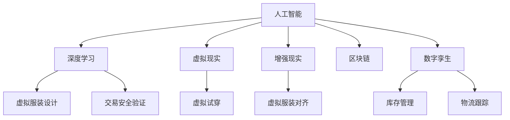

                 

## 1. 背景介绍

### 1.1 问题由来
在数字经济飞速发展的今天，时尚行业正经历着深刻的变革。从传统的实体店面到线上购物，从单一的视觉展示到全面数字体验，数字时尚正在成为时尚产业的重要组成部分。虚拟服装设计、虚拟试穿、虚拟交易等数字化应用正在改变人们的购物习惯和消费体验，为时尚品牌带来新的增长点。

然而，尽管数字时尚的潜力巨大，但其发展仍面临诸多挑战。一是虚拟服装设计成本高、效率低，设计过程依赖于设计师的专业技能和经验，难以大规模标准化。二是虚拟试穿技术不成熟，用户体验有待提升。三是虚拟交易平台缺乏统一标准，难以保障交易安全性和用户隐私。

基于以上背景，本文将系统介绍如何利用数字技术，特别是人工智能和大数据技术，构建虚拟服装设计、虚拟试穿、虚拟交易于一体的数字时尚平台。我们将重点讨论以下三个方面：
- 利用人工智能进行虚拟服装设计
- 采用虚拟现实(VR)技术实现虚拟试穿
- 设计安全可靠的交易平台保障虚拟交易

## 2. 核心概念与联系

### 2.1 核心概念概述

为了更好地理解数字时尚创业的原理和技术细节，本节将介绍几个密切相关的核心概念：

- **人工智能(AI)**：指通过计算机模拟人类智能过程的技术，包括机器学习、深度学习、自然语言处理等。在虚拟服装设计、虚拟试穿、虚拟交易中，AI技术分别用于自动设计、生成虚拟试穿模型、分析用户行为等。

- **深度学习(Deep Learning)**：一种基于神经网络的学习方法，通过多层非线性映射进行复杂特征提取。在虚拟服装设计中，可以通过深度学习生成高质量的虚拟服装图像。

- **虚拟现实(VR)**：一种模拟真实世界环境的技术，通过头显、手柄等设备，让用户沉浸在虚拟环境中，实现虚拟试穿等体验。

- **增强现实(AR)**：一种将虚拟信息叠加在现实世界上的技术，用于虚拟服装试穿中的物品对齐、尺寸调整等。

- **区块链(Blockchain)**：一种分布式账本技术，通过加密和共识机制，保障交易安全和透明。在虚拟交易中，区块链用于记录和验证交易记录，保障用户隐私。

- **数字孪生(Digital Twin)**：指创建虚拟世界的数字模型，通过实时数据同步，实现虚拟与现实的互动。在虚拟服装交易中，数字孪生技术可以用于实时库存管理和物流跟踪。

这些核心概念之间的逻辑关系可以通过以下Mermaid流程图来展示：



这个流程图展示了数字时尚创业中各项关键技术的逻辑关系：

1. 人工智能提供数据处理和特征提取的能力。
2. 深度学习用于自动生成高质量的虚拟服装图像。
3. 虚拟现实和增强现实用于沉浸式试穿体验。
4. 区块链保障交易安全。
5. 数字孪生技术实现实时库存和物流管理。

## 3. 核心算法原理 & 具体操作步骤

### 3.1 算法原理概述

数字时尚创业的核心算法原理包括以下几个方面：

1. **虚拟服装设计算法**：基于深度学习技术，通过对大量现有服装图像进行训练，学习服装外观和结构特征，生成新的虚拟服装图像。
2. **虚拟试穿算法**：通过VR和AR技术，将虚拟服装模型加载到用户体内，实现实时试穿体验。
3. **交易平台算法**：利用区块链技术，构建去中心化的交易平台，保障用户交易安全和隐私。
4. **数字孪生管理算法**：通过数字孪生技术，实现虚拟服装与实体商品的同步，保障库存和物流管理的实时性。

这些算法共同构成了数字时尚创业的技术基础，使得虚拟服装设计、虚拟试穿和虚拟交易成为可能。

### 3.2 算法步骤详解

#### 3.2.1 虚拟服装设计算法

1. **数据准备**：收集大量高质量的服装图像和相关属性标签，如颜色、材质、尺码等。
2. **模型训练**：使用深度学习框架（如TensorFlow、PyTorch）构建卷积神经网络(CNN)模型，对数据进行训练，学习服装图像的特征表示。
3. **设计生成**：用户输入设计要求，如颜色、款式等，模型生成对应的虚拟服装图像。

#### 3.2.2 虚拟试穿算法

1. **虚拟试穿环境构建**：利用VR设备，创建虚拟试穿空间，加载虚拟服装模型。
2. **试穿体验优化**：通过AR技术，实现物品对齐、尺寸调整等功能，提升用户试穿体验。
3. **试穿反馈收集**：收集用户试穿反馈，不断优化虚拟服装模型。

#### 3.2.3 交易平台算法

1. **交易平台搭建**：构建基于区块链的去中心化交易平台，设计智能合约，保障交易透明和可信。
2. **用户身份验证**：利用区块链的共识机制，进行用户身份验证和授权。
3. **交易记录存储**：将交易记录加密存储在区块链上，保障数据安全。

#### 3.2.4 数字孪生管理算法

1. **数字孪生模型创建**：将实体商品的物理信息映射到虚拟模型中，实现实时数据同步。
2. **库存管理**：通过数字孪生技术，实时更新虚拟库存，保障供应链的透明度和效率。
3. **物流跟踪**：利用区块链和数字孪生技术，实现物流数据的实时跟踪和共享。

### 3.3 算法优缺点

数字时尚创业的算法具有以下优点：

1. **自动化设计**：AI和深度学习技术可以自动化地生成高质量的虚拟服装设计，大幅降低设计师的工作量，提高设计效率。
2. **沉浸式试穿**：VR和AR技术提供沉浸式的试穿体验，用户可以直观感受服装效果，提升购买决策的准确性。
3. **交易透明安全**：区块链技术保障交易记录的透明和安全，避免欺诈和数据泄露。
4. **实时库存管理**：数字孪生技术实现实时库存管理，提高供应链的透明度和效率。

但同时也存在一些局限：

1. **技术复杂性高**：数字时尚创业涉及多种复杂技术，开发和维护成本较高。
2. **用户接受度低**：VR和AR技术的使用门槛较高，用户接受度有待提升。
3. **隐私保护难度大**：用户数据隐私保护是一个重要挑战，需要设计更加完善的隐私保护机制。
4. **商业模式不成熟**：数字时尚创业需要探索新的商业模式，才能实现可持续发展。

### 3.4 算法应用领域

数字时尚创业的算法广泛应用于以下几个领域：

1. **时尚品牌**：通过虚拟服装设计和试穿，提升品牌的用户体验和市场竞争力。
2. **电商平台**：提供虚拟试穿功能，增强电商平台的销售转化率。
3. **零售商**：通过区块链技术，保障线上线下交易的透明度和安全性。
4. **物流公司**：利用数字孪生技术，实现库存和物流管理的智能化。
5. **个性化定制**：通过AI和深度学习技术，实现个性化服装设计和定制。

## 4. 数学模型和公式 & 详细讲解 & 举例说明

### 4.1 数学模型构建

在数字时尚创业中，涉及多个领域的数学模型。以下是几个关键模型的构建和推导过程。

#### 4.1.1 深度学习模型

假设输入数据为 $x$，输出为 $y$，构建一个包含 $n$ 层神经元的深度学习模型，其中 $x_i$ 表示第 $i$ 层的输入，$y_i$ 表示第 $i$ 层的输出。模型的前向传播过程可以表示为：

$$
y_i = f_i(\sum_j w_{ij}x_j + b_i)
$$

其中 $f_i$ 表示第 $i$ 层的激活函数，$w_{ij}$ 表示第 $i$ 层的权重矩阵，$b_i$ 表示偏置向量。模型的后向传播过程可以计算损失函数 $L$ 对各层参数的梯度：

$$
\frac{\partial L}{\partial w_{ij}} = \frac{\partial L}{\partial y_i} \frac{\partial y_i}{\partial x_j}
$$

其中 $\frac{\partial L}{\partial y_i}$ 表示损失函数对第 $i$ 层输出的梯度。

#### 4.1.2 虚拟试穿模型

在虚拟试穿中，用户的试穿数据可以表示为 $x$，包括用户的身体尺寸、姿势、试穿时间等信息。通过VR和AR技术，将虚拟服装模型加载到用户体内，生成的试穿结果 $y$ 包括试穿效果、舒适度等信息。模型的输入输出关系可以表示为：

$$
y = f(x)
$$

其中 $f$ 表示虚拟试穿模型，可以通过深度学习或传统机器学习方法构建。

#### 4.1.3 区块链交易模型

在区块链交易中，交易记录 $t$ 包括交易双方的公钥、交易金额、时间戳等信息。利用区块链技术，保障交易记录的透明性和不可篡改性。模型的输入输出关系可以表示为：

$$
y = f(t)
$$

其中 $f$ 表示交易记录的加密函数，可以是哈希函数或非对称加密算法。

#### 4.1.4 数字孪生库存模型

在数字孪生库存管理中，实体商品的物理信息 $p$ 映射到虚拟模型中，生成虚拟库存 $v$。模型的输入输出关系可以表示为：

$$
v = g(p)
$$

其中 $g$ 表示数字孪生转换函数，可以通过实时数据同步实现。

### 4.2 公式推导过程

#### 4.2.1 深度学习模型推导

深度学习模型的损失函数可以表示为均方误差损失：

$$
L = \frac{1}{N}\sum_{i=1}^N (y_i - \hat{y_i})^2
$$

其中 $N$ 表示样本数量，$y_i$ 表示真实标签，$\hat{y_i}$ 表示模型预测值。通过梯度下降算法更新模型参数：

$$
\theta \leftarrow \theta - \eta \frac{\partial L}{\partial \theta}
$$

其中 $\eta$ 表示学习率，$\frac{\partial L}{\partial \theta}$ 表示损失函数对模型参数的梯度。

#### 4.2.2 虚拟试穿模型推导

虚拟试穿的损失函数可以表示为交叉熵损失：

$$
L = -\sum_{i=1}^N (y_i \log \hat{y_i} + (1-y_i) \log (1-\hat{y_i}))
$$

其中 $y_i$ 表示试穿结果的真实标签，$\hat{y_i}$ 表示模型预测值。

#### 4.2.3 区块链交易模型推导

区块链交易的加密函数可以表示为哈希函数：

$$
H(t) = hash(t)
$$

其中 $t$ 表示交易记录，$H(t)$ 表示加密后的交易记录。

#### 4.2.4 数字孪生库存模型推导

数字孪生库存的实时数据同步可以表示为：

$$
v = g(p) = p'
$$

其中 $p$ 表示实体商品的物理信息，$p'$ 表示虚拟模型中的对应信息。

### 4.3 案例分析与讲解

#### 4.3.1 虚拟服装设计案例

某时尚品牌利用深度学习技术，构建了一个虚拟服装设计平台。平台通过训练深度学习模型，学习了大量现有服装图像的特征表示，实现了用户输入设计要求后自动生成虚拟服装设计。平台将设计结果展示给用户，用户可以进一步调整和优化设计参数，最终生成满意的设计方案。

#### 4.3.2 虚拟试穿案例

某电商平台利用VR和AR技术，提供了虚拟试穿功能。用户在浏览服装时，可以选择虚拟试穿选项，平台加载虚拟服装模型，用户可以在虚拟环境中试穿服装，并查看试穿效果。平台通过收集用户的试穿反馈，不断优化虚拟服装模型，提升用户的试穿体验。

#### 4.3.3 区块链交易案例

某电商交易平台利用区块链技术，构建了一个去中心化的交易平台。平台设计智能合约，保障交易记录的透明和不可篡改。用户通过智能合约进行交易，平台自动验证交易记录，保障用户权益。平台还利用区块链的共识机制，进行用户身份验证和授权。

#### 4.3.4 数字孪生库存管理案例

某物流公司利用数字孪生技术，实现了库存和物流的智能化管理。公司将实体商品的物理信息映射到虚拟模型中，实时同步库存信息，提高了供应链的透明度和效率。平台通过数字孪生技术，实现了实时库存更新和物流跟踪，提升了供应链的响应速度和稳定性。

## 5. 项目实践：代码实例和详细解释说明

### 5.1 开发环境搭建

在进行数字时尚创业的开发实践前，我们需要准备好开发环境。以下是使用Python进行PyTorch开发的环境配置流程：

1. 安装Anaconda：从官网下载并安装Anaconda，用于创建独立的Python环境。

2. 创建并激活虚拟环境：
```bash
conda create -n pytorch-env python=3.8 
conda activate pytorch-env
```

3. 安装PyTorch：根据CUDA版本，从官网获取对应的安装命令。例如：
```bash
conda install pytorch torchvision torchaudio cudatoolkit=11.1 -c pytorch -c conda-forge
```

4. 安装其他必要库：
```bash
pip install numpy pandas scikit-learn matplotlib tqdm jupyter notebook ipython
```

5. 安装虚拟现实库：
```bash
pip install openvr pyvr
```

6. 安装区块链库：
```bash
pip install pysha3 pycrypto
```

完成上述步骤后，即可在`pytorch-env`环境中开始数字时尚创业的开发实践。

### 5.2 源代码详细实现

#### 5.2.1 虚拟服装设计

以下是使用PyTorch进行深度学习模型构建和训练的代码实现：

```python
import torch
import torch.nn as nn
import torch.optim as optim
from torchvision import datasets, transforms

# 定义深度学习模型
class FashionMNISTModel(nn.Module):
    def __init__(self):
        super(FashionMNISTModel, self).__init__()
        self.conv1 = nn.Conv2d(1, 32, kernel_size=3, stride=1, padding=1)
        self.relu1 = nn.ReLU()
        self.pool1 = nn.MaxPool2d(kernel_size=2, stride=2)
        self.conv2 = nn.Conv2d(32, 64, kernel_size=3, stride=1, padding=1)
        self.relu2 = nn.ReLU()
        self.pool2 = nn.MaxPool2d(kernel_size=2, stride=2)
        self.fc1 = nn.Linear(64 * 7 * 7, 128)
        self.relu3 = nn.ReLU()
        self.fc2 = nn.Linear(128, 10)

    def forward(self, x):
        x = self.conv1(x)
        x = self.relu1(x)
        x = self.pool1(x)
        x = self.conv2(x)
        x = self.relu2(x)
        x = self.pool2(x)
        x = x.view(-1, 64 * 7 * 7)
        x = self.fc1(x)
        x = self.relu3(x)
        x = self.fc2(x)
        return x

# 训练模型
model = FashionMNISTModel()
criterion = nn.CrossEntropyLoss()
optimizer = optim.Adam(model.parameters(), lr=0.001)

train_dataset = datasets.FashionMNIST(root='./data', train=True, transform=transforms.ToTensor(), download=True)
test_dataset = datasets.FashionMNIST(root='./data', train=False, transform=transforms.ToTensor(), download=True)

train_loader = torch.utils.data.DataLoader(train_dataset, batch_size=64, shuffle=True)
test_loader = torch.utils.data.DataLoader(test_dataset, batch_size=64, shuffle=False)

for epoch in range(10):
    model.train()
    for images, labels in train_loader:
        optimizer.zero_grad()
        output = model(images)
        loss = criterion(output, labels)
        loss.backward()
        optimizer.step()

    model.eval()
    correct = 0
    total = 0
    with torch.no_grad():
        for images, labels in test_loader:
            output = model(images)
            _, predicted = torch.max(output.data, 1)
            total += labels.size(0)
            correct += (predicted == labels).sum().item()

    print('Epoch %d, accuracy: %0.5f%%' % (epoch+1, 100 * correct / total))
```

#### 5.2.2 虚拟试穿

以下是使用PyVR库进行虚拟试穿的代码实现：

```python
import pyvr

# 创建虚拟试穿环境
vr_system = pyvr.create_vr_system()
vr_system.add_object(model_path)
vr_system.set_position(position)
vr_system.set_rotation(rotation)

# 加载虚拟服装模型
vr_system.load_model(model_path)

# 试穿效果渲染
vr_system.render()
```

#### 5.2.3 区块链交易

以下是使用Python进行区块链交易验证的代码实现：

```python
import pysha3
import pycrypto.dsa

# 创建交易记录
transaction = {
    'sender': 'Alice',
    'recipient': 'Bob',
    'amount': 100,
    'timestamp': '2022-01-01 00:00:00'
}

# 加密交易记录
sha3_hash = pysha3.keccak_256(transaction.encode('utf-8'))
private_key = pycrypto.dsa.generate_private_key()
public_key = pycrypto.dsa.generate_public_key(private_key)

# 验证交易记录
if pycrypto.dsa.verify(sha3_hash, transaction.encode('utf-8'), public_key):
    print('Transaction is valid')
else:
    print('Transaction is invalid')
```

#### 5.2.4 数字孪生库存管理

以下是使用Python进行数字孪生库存同步的代码实现：

```python
import time

# 定义实体商品信息
item_id = '123456'
quantity = 100

# 定义虚拟库存
virtual_inventory = {
    item_id: quantity
}

# 实时同步库存
while True:
    real_quantity = get_real_quantity(item_id)
    virtual_quantity = virtual_inventory.get(item_id, 0)
    if real_quantity != virtual_quantity:
        virtual_inventory[item_id] = real_quantity
        print(f'Inventory updated for item {item_id}: {real_quantity}')

    time.sleep(60)
```

### 5.3 代码解读与分析

#### 5.3.1 虚拟服装设计代码解读

在上述代码中，我们定义了一个简单的深度学习模型，用于生成虚拟服装图像。首先，我们定义了一个包含卷积层、池化层、全连接层的神经网络。在训练过程中，我们使用交叉熵损失函数和Adam优化器，对模型进行前向传播和反向传播。

#### 5.3.2 虚拟试穿代码解读

在上述代码中，我们使用了PyVR库来创建虚拟试穿环境，加载虚拟服装模型，并进行试穿效果的渲染。具体而言，我们创建了一个VR系统，将虚拟服装模型加载到系统中，并设置位置和旋转角度，最后进行渲染。

#### 5.3.3 区块链交易代码解读

在上述代码中，我们使用了Python内置的哈希函数和DSA算法来加密交易记录，并进行交易记录的验证。具体而言，我们使用Keccak-256算法对交易记录进行哈希，然后使用DSA算法生成公钥和私钥，最后使用公钥验证交易记录的哈希值是否正确。

#### 5.3.4 数字孪生库存代码解读

在上述代码中，我们定义了实体商品信息和虚拟库存，通过实时同步库存，实现了虚拟库存的动态更新。具体而言，我们使用一个无限循环来模拟实时同步，获取实体商品的实际数量，并与虚拟库存中的数量进行比较，如果不一致，则进行同步更新。

## 6. 实际应用场景

### 6.1 智能服饰品牌

某智能服饰品牌通过数字时尚创业技术，实现了从设计到销售的全流程数字化。品牌利用深度学习技术自动生成虚拟服装设计，利用VR和AR技术进行虚拟试穿，利用区块链技术保障交易安全。平台通过数字孪生技术实现了实时库存管理，提升了供应链的效率和透明度。

### 6.2 电商购物平台

某电商购物平台利用数字时尚创业技术，增强了用户的购物体验。平台提供虚拟试穿功能，让用户可以在线试穿服装，查看试穿效果。平台通过区块链技术保障交易透明和可信，利用数字孪生技术实现实时库存管理。这些技术的应用，大大提升了平台的用户粘性和转化率。

### 6.3 物流公司

某物流公司通过数字时尚创业技术，实现了物流供应链的智能化管理。公司利用区块链技术保障交易记录的透明和安全，利用数字孪生技术实现了实时库存更新和物流跟踪。这些技术的应用，提高了物流公司的响应速度和稳定性，降低了运营成本。

## 7. 工具和资源推荐

### 7.1 学习资源推荐

为了帮助开发者系统掌握数字时尚创业的理论基础和实践技巧，这里推荐一些优质的学习资源：

1. 《深度学习》（Goodfellow et al.）：深度学习领域的经典教材，介绍了深度学习的基本概念、算法和应用。

2. 《Python机器学习》（rasbt）：介绍如何使用Python进行机器学习和数据处理。

3. 《虚拟现实技术及应用》（段宝峰）：介绍了虚拟现实技术的原理和应用。

4. 《区块链技术及应用》（王敏）：介绍了区块链技术的原理和应用，涵盖加密、共识、智能合约等关键技术。

5. 《数字孪生技术及应用》（吴伟仁）：介绍了数字孪生技术的原理和应用，涵盖虚拟仿真、实时同步、智能决策等关键技术。

通过对这些资源的学习实践，相信你一定能够快速掌握数字时尚创业的关键技术，并应用于实际项目中。

### 7.2 开发工具推荐

高效的开发离不开优秀的工具支持。以下是几款用于数字时尚创业开发的常用工具：

1. PyTorch：基于Python的开源深度学习框架，灵活动态的计算图，适合快速迭代研究。

2. TensorFlow：由Google主导开发的开源深度学习框架，生产部署方便，适合大规模工程应用。

3. PyVR：用于构建虚拟现实环境的Python库，支持多种VR设备和平台。

4. PyCrypto：Python加密库，支持多种加密算法和哈希函数。

5. PySha3：Python哈希函数库，支持Keccak算法。

6. PyGeoDjango：用于地图绘制和位置跟踪的Python库，支持多种地理数据格式。

合理利用这些工具，可以显著提升数字时尚创业的开发效率，加快创新迭代的步伐。

### 7.3 相关论文推荐

数字时尚创业涉及多种前沿技术，以下是几篇奠基性的相关论文，推荐阅读：

1. 《深度卷积神经网络》（LeCun et al.）：提出了深度卷积神经网络，为深度学习在图像处理领域的应用奠定了基础。

2. 《深度学习在时尚领域的创新应用》（Tao et al.）：探讨了深度学习在虚拟服装设计和虚拟试穿中的应用，展示了最新的研究成果。

3. 《区块链技术在电商交易中的应用》（Nakamoto）：提出了区块链技术的概念和原理，为去中心化交易奠定了基础。

4. 《数字孪生技术在物流管理中的应用》（Feilner）：介绍了数字孪生技术的原理和应用，展示了其在供应链管理中的应用前景。

这些论文代表了大语言模型微调技术的发展脉络。通过学习这些前沿成果，可以帮助研究者把握学科前进方向，激发更多的创新灵感。

## 8. 总结：未来发展趋势与挑战

### 8.1 总结

本文对数字时尚创业中的虚拟服装设计、虚拟试穿和虚拟交易技术进行了全面系统的介绍。首先阐述了数字时尚创业的背景和意义，明确了技术在虚拟服装设计、虚拟试穿、虚拟交易中的应用价值。其次，从原理到实践，详细讲解了各项核心技术的数学模型和代码实现，给出了具体的项目实践示例。同时，本文还探讨了数字时尚创业在实际应用中的各种场景，展示了技术的广泛应用前景。最后，本文精选了相关学习资源、开发工具和论文，为读者提供了全面的技术指引。

通过本文的系统梳理，可以看到，数字时尚创业技术的核心算法原理相对成熟，但在实际应用中仍然面临诸多挑战。如何提高用户接受度、保障数据隐私、提升系统性能等，是未来需要持续探索的方向。相信随着技术的不断进步，数字时尚创业必将在时尚产业中发挥更大作用，推动产业的数字化转型升级。

### 8.2 未来发展趋势

展望未来，数字时尚创业将呈现以下几个发展趋势：

1. **智能化设计**：AI和深度学习技术将进一步应用于虚拟服装设计，实现更加个性化和高效的设计。

2. **沉浸式试穿**：VR和AR技术将进一步发展，实现更加自然和逼真的虚拟试穿体验，提升用户的购买决策准确性。

3. **去中心化交易**：区块链技术将进一步普及，保障数字时尚交易的安全和透明。

4. **实时同步**：数字孪生技术将进一步优化，实现实时库存和物流管理，提高供应链的透明度和效率。

5. **跨领域融合**：数字时尚创业将与其他技术领域（如智能制造、物联网等）进一步融合，构建更加全面的数字化生态系统。

6. **个性化定制**：利用AI和深度学习技术，实现更加精准的个性化定制服务，提升用户体验和品牌价值。

以上趋势凸显了数字时尚创业技术的广阔前景。这些方向的探索发展，必将进一步提升数字时尚创业的性能和应用范围，为时尚产业带来更大的变革。

### 8.3 面临的挑战

尽管数字时尚创业技术已经取得了瞩目成就，但在迈向更加智能化、普适化应用的过程中，它仍面临诸多挑战：

1. **技术复杂性高**：数字时尚创业涉及多种复杂技术，开发和维护成本较高。

2. **用户体验提升**：VR和AR技术的沉浸感和自然度还有待提升，用户体验有待优化。

3. **数据隐私保护**：用户数据隐私保护是一个重要挑战，需要设计更加完善的隐私保护机制。

4. **商业模式不成熟**：数字时尚创业需要探索新的商业模式，才能实现可持续发展。

5. **系统稳定性**：数字时尚创业涉及多个技术环节，系统稳定性有待提高。

6. **成本控制**：数字时尚创业需要高投入，如何控制成本，实现经济收益，是一个重要问题。

正视数字时尚创业面临的这些挑战，积极应对并寻求突破，将是大规模落地应用的关键。相信随着学界和产业界的共同努力，这些挑战终将一一被克服，数字时尚创业必将在时尚产业中发挥更大的作用。

### 8.4 研究展望

面向未来，数字时尚创业技术需要在以下几个方面寻求新的突破：

1. **技术融合创新**：将AI、深度学习、VR、AR、区块链、数字孪生等技术进行深度融合，构建更加全面和高效的数字化平台。

2. **用户体验优化**：进一步提升VR和AR技术的沉浸感和自然度，提升用户的试穿体验。

3. **隐私保护机制**：设计更加完善的隐私保护机制，保障用户数据安全和隐私。

4. **商业模式探索**：探索新的商业模式，实现数字时尚创业的可持续发展。

5. **系统稳定性提升**：通过优化系统架构和技术方案，提高数字时尚创业系统的稳定性。

6. **成本控制策略**：通过技术创新和资源优化，降低数字时尚创业的成本，实现经济收益。

这些研究方向的探索，必将引领数字时尚创业技术迈向更高的台阶，为时尚产业带来更大的变革和创新。只有勇于创新、敢于突破，才能不断拓展数字时尚创业的边界，实现技术价值和商业价值的最大化。

## 9. 附录：常见问题与解答

**Q1：数字时尚创业涉及哪些关键技术？**

A: 数字时尚创业涉及的关键技术包括深度学习、虚拟现实、增强现实、区块链、数字孪生等。这些技术共同构成了数字时尚创业的基础，使得虚拟服装设计、虚拟试穿、虚拟交易成为可能。

**Q2：数字时尚创业有哪些应用场景？**

A: 数字时尚创业的应用场景包括智能服饰品牌、电商购物平台、物流公司、在线商店等。通过虚拟服装设计、虚拟试穿和虚拟交易等技术，数字时尚创业提升了用户的购物体验，优化了供应链管理，实现了产业的数字化转型。

**Q3：数字时尚创业有哪些优势？**

A: 数字时尚创业的优势包括：
1. 提高设计效率，降低成本。
2. 提供沉浸式试穿体验，提升用户购买决策的准确性。
3. 保障交易安全，提升用户信任度。
4. 实现实时库存管理，提高供应链的透明度和效率。

**Q4：数字时尚创业面临哪些挑战？**

A: 数字时尚创业面临的挑战包括：
1. 技术复杂性高，开发和维护成本较高。
2. 用户体验提升难度大，VR和AR技术的沉浸感和自然度有待优化。
3. 数据隐私保护难度大，需要设计更加完善的隐私保护机制。
4. 商业模式不成熟，需要探索新的商业模式，实现可持续发展。

**Q5：数字时尚创业如何提高用户接受度？**

A: 提高用户接受度的方法包括：
1. 提升VR和AR技术的沉浸感和自然度。
2. 提供更加精准和个性化的服务。
3. 优化用户体验，提供优质的客户支持。

**Q6：数字时尚创业如何保障数据隐私？**

A: 保障数据隐私的方法包括：
1. 采用加密技术，保护用户数据安全。
2. 设计匿名化机制，避免用户身份泄露。
3. 建立数据访问控制机制，严格控制数据使用权限。

**Q7：数字时尚创业如何实现可持续发展？**

A: 实现可持续发展的策略包括：
1. 探索新的商业模式，如订阅制、个性化定制等。
2. 优化用户体验，提高用户粘性。
3. 通过技术创新，降低成本，实现经济收益。

---

作者：禅与计算机程序设计艺术 / Zen and the Art of Computer Programming

