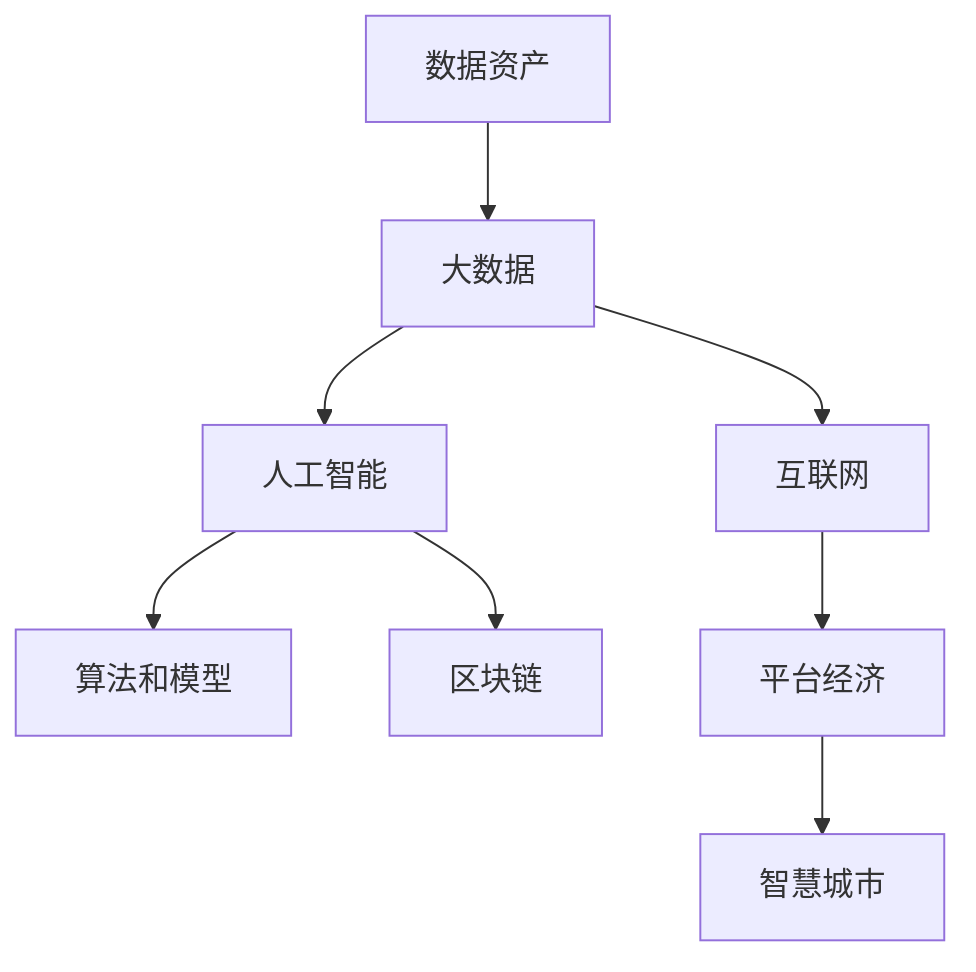

                 

# 数字经济：社会发展的助推器

## 1. 背景介绍

### 1.1 问题由来

数字经济作为21世纪经济的新形态，正在深刻地改变全球经济社会的各个层面。近年来，全球数字经济规模不断扩大，数字技术与实体经济深度融合，带来了产业结构、消费模式、就业方式、社会治理等方面的巨大变革。数字经济的发展，不仅推动了信息技术的快速迭代和产业升级，还为社会创新、社会包容和可持续发展提供了新的动力。

然而，数字经济的快速发展也带来了诸多挑战。数据隐私保护、网络安全、数字鸿沟等问题愈发凸显。如何更好地发挥数字经济的潜力，同时保障社会的公平与正义，是当前数字经济研究的重要课题。本文聚焦于数字经济的理论基础与实践应用，探索数字经济推动社会发展的关键路径。

### 1.2 问题核心关键点

数字经济的核心在于数据、算法和计算资源的深度融合。通过数字技术的应用，企业能够实现精准的生产运营、灵活的供应链管理、个性化的客户服务、智能化的决策支持等，从而提升效率和降低成本。而数据作为数字经济的基石，其获取、存储、处理、应用等方面，对经济社会的各个层面都有着深远影响。

数字经济的发展，也需要依赖于高效的算法和计算平台。算法可以挖掘数据的价值，生成有效的洞察，并指导决策。计算平台则提供了算法的运行基础，保障了数据的实时性、可靠性和安全性。算力作为数字经济的关键资源，其规模和效率决定了数字经济的活力和发展潜力。

当前，数字经济正处于快速发展的黄金时期，各行业数字化转型的需求愈发迫切。如何更好地构建数字基础设施，提升数据获取和处理的效率，优化算法设计，保障数据安全，是数字经济发展的关键问题。

## 2. 核心概念与联系

### 2.1 核心概念概述

数字经济的发展，离不开以下几个关键概念：

- 数据资产：数据作为数字经济的基石，能够提供重要的经济价值和社会价值。数据资产的利用可以带来新的商业机会和增长点。

- 大数据：海量、多样、高速、高价值的数据资源，是大数据技术处理的对象。大数据技术可以挖掘数据的价值，提供精确的洞察和预测。

- 人工智能：通过机器学习、深度学习等技术，人工智能可以从数据中学习知识，辅助决策，提升效率。

- 算法和模型：算法是大数据处理的基础，模型则是算法的应用。高效、准确的算法和模型，能够提升数据处理的精度和速度。

- 区块链：作为分布式账本技术，区块链可以保障数据的安全和透明，提供去中心化的信任机制。

- 互联网：互联网是数字经济的基础设施，提供了信息传递和资源共享的平台，推动了数字技术与实体经济的深度融合。

- 平台经济：平台经济通过互联网平台，实现了供应链、供应链、客户和市场的集成，提升了效率和效益。

- 智慧城市：通过数字化手段，智慧城市可以实现智能交通、智慧医疗、智慧教育等，提升城市的治理能力和服务水平。

这些概念之间的逻辑关系可以通过以下Mermaid流程图来展示：



这个流程图展示了大数据、人工智能、算法和模型等概念之间的联系：

1. 数据资产是大数据处理的基础，是大数据技术应用的前提。
2. 大数据通过算法和模型进行分析和应用，能够提供精确的洞察和预测。
3. 区块链和互联网为数据和算法的安全、透明和可信提供了保障。
4. 平台经济和智慧城市是数字经济的应用领域，展示了数据、算法和计算在实际场景中的综合应用。

## 3. 核心算法原理 & 具体操作步骤
### 3.1 算法原理概述

数字经济的运行，离不开数据、算法和计算资源的深度融合。以机器学习为例，数据通过算法进行训练，生成模型，最终在计算平台上进行推理和优化。这一过程可以概括为：

1. 数据获取和预处理：通过互联网等渠道，获取原始数据，并进行清洗、标注等预处理。
2. 算法训练：利用机器学习算法对数据进行训练，生成模型。
3. 模型应用：将训练好的模型应用到实际场景中，进行推理和优化。

### 3.2 算法步骤详解

以机器学习为例，数字经济中的算法训练和应用步骤可以总结为：

1. **数据准备**：
   - 数据获取：通过互联网、传感器、社交媒体等渠道，获取原始数据。
   - 数据清洗和预处理：清洗缺失、噪声、重复等数据，进行标注和归一化。
   - 数据划分：将数据集划分为训练集、验证集和测试集，保证模型训练的公平和可靠性。

2. **算法训练**：
   - 选择合适的算法：如线性回归、决策树、神经网络等。
   - 设置训练参数：如学习率、迭代次数、正则化等。
   - 进行模型训练：利用训练集对模型进行训练，通过反向传播算法计算梯度，更新模型参数。

3. **模型评估和优化**：
   - 在验证集上评估模型性能：使用准确率、精确率、召回率等指标评估模型。
   - 进行超参数调优：利用网格搜索、贝叶斯优化等技术，寻找最优的算法参数。
   - 应用模型进行推理：将训练好的模型应用到实际场景中，进行推理和预测。

### 3.3 算法优缺点

数字经济中的算法具有以下优点：

1. 高效性：通过算法可以高效地处理和分析大规模数据，生成有效的洞察和预测。
2. 灵活性：算法可以灵活地适应不同的应用场景，支持个性化和定制化服务。
3. 自动化：算法可以自动化地处理数据和生成模型，减少人工干预。

同时，算法也存在一些局限性：

1. 数据依赖性：算法的训练和应用高度依赖于数据的质量和数量，数据获取和处理难度较大。
2. 模型复杂性：复杂的算法需要高计算资源和大量的时间训练，增加了成本和复杂度。
3. 解释性不足：黑盒算法的决策过程难以解释，缺乏透明度。
4. 过拟合风险：算法容易过拟合，需要选择合适的正则化和训练策略。

### 3.4 算法应用领域

数字经济中的算法广泛应用于各个领域，如：

- 金融科技：利用算法进行风险控制、信用评估、欺诈检测等。
- 医疗健康：通过算法进行疾病预测、医疗影像分析、个性化治疗等。
- 零售电商：利用算法进行需求预测、库存管理、推荐系统等。
- 智能制造：通过算法进行质量控制、生产优化、设备维护等。
- 智慧城市：利用算法进行交通管理、环境监测、公共安全等。
- 教育科技：通过算法进行学生评估、课程推荐、智能答疑等。

## 4. 数学模型和公式 & 详细讲解  
### 4.1 数学模型构建

数字经济中的算法通常使用机器学习模型进行构建。以线性回归为例，假设有一组数据集 $(x_i, y_i)$，其中 $x_i$ 是输入特征，$y_i$ 是输出目标。线性回归的目标是找到一条直线 $y = \beta_0 + \beta_1 x_1 + \cdots + \beta_n x_n$，使得该直线能够最小化预测误差。

形式化地，定义均方误差损失函数为：

$$
\mathcal{L}(\beta) = \frac{1}{2m} \sum_{i=1}^m (y_i - \beta_0 - \beta_1 x_{i1} - \cdots - \beta_n x_{in})^2
$$

其中，$m$ 为数据集大小。

训练目标是最小化损失函数 $\mathcal{L}(\beta)$，因此需要求解：

$$
\beta^* = \mathop{\arg\min}_{\beta} \mathcal{L}(\beta)
$$

通过梯度下降算法，更新模型参数 $\beta_k$ 的公式为：

$$
\beta_k \leftarrow \beta_k - \eta \frac{1}{m} \sum_{i=1}^m (y_i - \beta_0 - \beta_1 x_{i1} - \cdots - \beta_n x_{in}) x_{ik}
$$

其中，$\eta$ 为学习率。

### 4.2 公式推导过程

以下我们以线性回归为例，推导模型的求解过程：

1. **梯度求解**：
   - 定义损失函数 $\mathcal{L}(\beta)$，对 $\beta_k$ 求偏导数，得到梯度 $\nabla_{\beta_k} \mathcal{L}(\beta)$。
   - 根据链式法则，将损失函数对 $\beta_k$ 的偏导数展开。

2. **梯度下降**：
   - 根据梯度下降算法，更新模型参数 $\beta_k$，使得损失函数最小化。
   - 定义迭代次数 $t$，每次迭代更新 $\beta_k$，直至收敛。

3. **正规方程求解**：
   - 如果数据集规模较小，可以直接使用正规方程求解 $\beta$，避免迭代计算。
   - 定义正规方程 $\mathbf{X}^T \mathbf{X} \beta = \mathbf{X}^T \mathbf{y}$，求解 $\beta$ 的解。

### 4.3 案例分析与讲解

以电商推荐系统为例，探讨数字经济中的算法应用。电商推荐系统通过算法对用户行为进行分析和预测，生成个性化的商品推荐。具体步骤如下：

1. **数据获取**：通过用户在平台上的浏览、点击、购买等行为数据，生成原始数据集。
2. **特征工程**：对用户行为数据进行特征提取和编码，生成特征向量。
3. **算法训练**：使用协同过滤、矩阵分解等算法，对用户和商品进行关联矩阵的建模。
4. **模型应用**：将训练好的模型应用到实时请求中，生成推荐结果。

通过以上步骤，电商推荐系统能够快速响应用户需求，提升用户体验和转化率。

## 5. 项目实践：代码实例和详细解释说明
### 5.1 开发环境搭建

在进行数字经济应用开发前，需要准备好开发环境。以下是使用Python进行TensorFlow开发的环境配置流程：

1. 安装Anaconda：从官网下载并安装Anaconda，用于创建独立的Python环境。

2. 创建并激活虚拟环境：
```bash
conda create -n tf-env python=3.8 
conda activate tf-env
```

3. 安装TensorFlow：根据CUDA版本，从官网获取对应的安装命令。例如：
```bash
conda install tensorflow -c tf -c conda-forge
```

4. 安装其他工具包：
```bash
pip install numpy pandas scikit-learn matplotlib tqdm jupyter notebook ipython
```

完成上述步骤后，即可在`tf-env`环境中开始数字经济应用开发。

### 5.2 源代码详细实现

这里我们以电商推荐系统为例，给出使用TensorFlow进行推荐算法开发的PyTorch代码实现。

首先，定义推荐系统中的数据处理函数：

```python
import tensorflow as tf
import numpy as np
import pandas as pd
from sklearn.model_selection import train_test_split

def load_data(file_path, sep=','):
    data = pd.read_csv(file_path, sep=sep)
    return data

def preprocess_data(data):
    data['rating'] = (data['rating'] - 3) / 2  # 标准化
    return data

def split_data(data, test_size=0.2, random_state=42):
    train, test = train_test_split(data, test_size=test_size, random_state=random_state)
    return train, test
```

然后，定义推荐算法模型：

```python
class RecommendationModel(tf.keras.Model):
    def __init__(self, num_users, num_items, embedding_dim=128, num_factors=128):
        super(RecommendationModel, self).__init__()
        self.num_users = num_users
        self.num_items = num_items
        self.embedding_dim = embedding_dim
        self.num_factors = num_factors
        
        self.user_embedding = tf.keras.layers.Embedding(num_users, embedding_dim)
        self.item_embedding = tf.keras.layers.Embedding(num_items, embedding_dim)
        self.interaction = tf.keras.layers.Dot(axes=(1, 1), normalize=True)
        
        self.factor_matrix = tf.Variable(tf.random.normal([num_items, num_factors]))
        self.user_bias = tf.Variable(tf.random.normal([num_users]))
        self.item_bias = tf.Variable(tf.random.normal([num_items]))
        
        self.evaluation = tf.keras.layers.Lambda(lambda x: tf.sqrt(1 + tf.square(x) - tf.reduce_sum(x, axis=1, keepdims=True)))
    
    def call(self, user_ids, item_ids):
        user_embs = self.user_embedding(user_ids)
        item_embs = self.item_embedding(item_ids)
        
        interaction = self.interaction([user_embs, item_embs])
        prediction = tf.reduce_sum(self.factor_matrix * interaction, axis=1)
        prediction = prediction + self.user_bias[user_ids] + self.item_bias[item_ids]
        prediction = tf.clip_by_value(prediction, 0, 5)
        
        rating = tf.reduce_sum(user_embs * item_embs, axis=1)
        rating = tf.sqrt(1 + tf.square(rating) - tf.reduce_sum(rating, axis=1, keepdims=True))
        
        return prediction, rating
```

接着，定义训练和评估函数：

```python
def train_model(model, train_data, test_data, batch_size=32, epochs=100, learning_rate=0.001):
    train_dataset = tf.data.Dataset.from_tensor_slices(train_data[['user_id', 'item_id', 'rating']])
    train_dataset = train_dataset.shuffle(buffer_size=1000).batch(batch_size)
    
    test_dataset = tf.data.Dataset.from_tensor_slices(test_data[['user_id', 'item_id', 'rating']])
    test_dataset = test_dataset.batch(batch_size)
    
    optimizer = tf.keras.optimizers.Adam(learning_rate=learning_rate)
    loss_fn = tf.keras.losses.MeanSquaredError()
    
    @tf.function
    def train_step(inputs):
        user_ids, item_ids, ratings = inputs
        with tf.GradientTape() as tape:
            prediction, rating = model(user_ids, item_ids)
            loss = loss_fn(prediction, ratings)
        gradients = tape.gradient(loss, model.trainable_variables)
        optimizer.apply_gradients(zip(gradients, model.trainable_variables))
        return loss
    
    @tf.function
    def eval_step(inputs):
        user_ids, item_ids, ratings = inputs
        prediction, rating = model(user_ids, item_ids)
        return tf.reduce_mean(tf.square(prediction - ratings))
    
    for epoch in range(epochs):
        avg_loss = 0.0
        for batch in train_dataset:
            avg_loss += train_step(batch).numpy()
        avg_loss /= len(train_dataset)
        
        avg_score = 0.0
        for batch in test_dataset:
            score = eval_step(batch).numpy()
            avg_score += score
        avg_score /= len(test_dataset)
        
        print(f'Epoch {epoch+1}, Train Loss: {avg_loss}, Test Score: {avg_score}')
```

最后，启动训练流程：

```python
train_data = load_data('train.csv')
test_data = load_data('test.csv')
train_data, test_data = preprocess_data(train_data), preprocess_data(test_data)
train_data, test_data = split_data(train_data), split_data(test_data)
train_model(RecommendationModel(train_data.shape[0], train_data.shape[1]), train_data, test_data, epochs=100, learning_rate=0.001)
```

以上就是使用TensorFlow进行电商推荐系统开发的完整代码实现。可以看到，TensorFlow提供了高效的分布式计算和自动微分功能，使得算法模型的训练和推理变得更加简单。

### 5.3 代码解读与分析

让我们再详细解读一下关键代码的实现细节：

**load_data函数**：
- 定义数据读取函数，从CSV文件中加载数据。

**preprocess_data函数**：
- 对数据进行标准化处理，将评分归一化到[0, 1]区间。

**split_data函数**：
- 对数据集进行划分，生成训练集和测试集。

**RecommendationModel类**：
- 定义推荐算法模型，包含用户和商品的嵌入层、交互层、因子分解层和评分生成层。
- 使用嵌入层和交互层计算用户和商品的隐向量，使用因子分解层计算预测评分，使用评分生成层计算实际评分。

**train_model函数**：
- 定义训练过程，包括数据批处理、模型训练、损失计算和参数更新。
- 使用Adam优化器进行梯度下降，使用均方误差损失函数评估模型性能。

通过以上代码实现，我们构建了电商推荐系统的推荐模型，并通过训练得到了较好的推荐效果。

## 6. 实际应用场景
### 6.1 智能制造

数字经济在智能制造中的应用，主要体现在生产流程的数字化、智能化和协同化。通过物联网、大数据、人工智能等技术，企业可以实现智能生产、质量控制、设备维护等功能。

具体而言，数字经济在智能制造中的应用场景包括：

1. **智能生产调度**：利用大数据和算法，优化生产调度，提高生产效率。例如，通过预测生产瓶颈，优化生产计划，实现精益生产。
2. **智能质量控制**：利用传感器和大数据，实时监测生产过程中的质量数据，及时发现和解决质量问题。例如，通过机器学习算法，预测产品缺陷率，提升产品质量。
3. **智能设备维护**：利用物联网和大数据，实时监测设备状态，预测设备故障，进行预防性维护。例如，通过深度学习算法，预测设备故障，提前安排维护，避免生产中断。

### 6.2 智慧城市

智慧城市是数字经济在城市治理中的重要应用。通过数字化手段，智慧城市可以实现智能交通、智慧医疗、智慧教育等，提升城市的治理能力和服务水平。

具体而言，数字经济在智慧城市中的应用场景包括：

1. **智能交通管理**：利用大数据和算法，实时监测交通流量，优化交通信号灯，缓解交通拥堵。例如，通过机器学习算法，预测交通流量，动态调整信号灯，提升交通效率。
2. **智慧医疗服务**：利用大数据和算法，优化医疗资源配置，提升医疗服务质量。例如，通过深度学习算法，分析患者数据，推荐个性化治疗方案，提高治疗效果。
3. **智慧教育平台**：利用大数据和算法，优化教育资源配置，提升教育服务质量。例如，通过机器学习算法，分析学生数据，推荐个性化学习方案，提升学习效果。

### 6.3 金融科技

金融科技是数字经济的重要组成部分，通过数字化手段，提升金融服务的效率和质量。数字经济在金融科技中的应用场景包括：

1. **风险控制和信用评估**：利用大数据和算法，评估客户信用风险，进行风险控制。例如，通过机器学习算法，分析客户数据，评估信用风险，降低贷款违约率。
2. **欺诈检测和识别**：利用大数据和算法，实时监测交易行为，识别异常交易，进行欺诈检测。例如，通过深度学习算法，分析交易数据，识别欺诈行为，保护用户资金安全。
3. **智能投顾和资产管理**：利用大数据和算法，优化投资组合，提升投资收益。例如，通过机器学习算法，分析市场数据，生成投资建议，优化投资策略。

## 7. 工具和资源推荐
### 7.1 学习资源推荐

为了帮助开发者系统掌握数字经济的理论基础和实践技巧，这里推荐一些优质的学习资源：

1. 《机器学习》（西瓜书）：经典机器学习教材，系统介绍了机器学习的基本概念和算法。
2. 《深度学习》（Ian Goodfellow）：深度学习领域权威教材，深入浅出地介绍了深度学习的基本理论和实践。
3. 《数据科学与机器学习》（Coursera）：Coursera上的数据科学课程，系统介绍了数据科学和机器学习的基本概念和应用。
4. 《TensorFlow官方文档》：TensorFlow官方文档，提供了详细的API文档和示例代码，帮助开发者快速上手。
5. Kaggle竞赛：Kaggle数据科学竞赛平台，提供大量的数据集和竞赛任务，可以帮助开发者提升实践能力。

通过对这些资源的学习实践，相信你一定能够系统掌握数字经济的基本概念和关键技术，并用于解决实际的数字经济问题。

### 7.2 开发工具推荐

高效的开发离不开优秀的工具支持。以下是几款用于数字经济开发的常用工具：

1. Jupyter Notebook：轻量级的开发环境，支持Python、R等多种语言，提供交互式编程体验。
2. TensorFlow：开源深度学习框架，提供高效的分布式计算和自动微分功能，适合大规模模型训练。
3. PyTorch：开源深度学习框架，提供动态计算图和丰富的算法库，适合快速原型开发和研究。
4. Hadoop和Spark：分布式计算框架，支持大规模数据处理和分析，适合大数据应用。
5. Apache Kafka：分布式消息系统，支持实时数据流处理，适合实时数据应用。

合理利用这些工具，可以显著提升数字经济应用的开发效率，加快创新迭代的步伐。

### 7.3 相关论文推荐

数字经济的发展离不开学术界的持续研究。以下是几篇奠基性的相关论文，推荐阅读：

1. 《Data Science and Statistical Learning》：数据科学领域的经典教材，介绍了数据科学的基本概念和应用。
2. 《Deep Learning》：深度学习领域权威教材，深入浅出地介绍了深度学习的基本理论和实践。
3. 《Machine Learning》：经典机器学习教材，系统介绍了机器学习的基本概念和算法。
4. 《Big Data in Practice》：大数据领域权威教材，介绍了大数据技术的基本概念和应用。
5. 《Blockchain Technology and Applications》：区块链技术领域的经典教材，介绍了区块链技术的基本理论和应用。

这些论文代表了大数据、人工智能、区块链等数字经济技术的发展脉络。通过学习这些前沿成果，可以帮助研究者把握学科前进方向，激发更多的创新灵感。

## 8. 总结：未来发展趋势与挑战

### 8.1 总结

本文对数字经济的基本概念和关键技术进行了系统介绍。数字经济作为21世纪经济的新形态，正在深刻地改变全球经济社会的各个层面。数据、算法和计算资源的深度融合，使得企业能够实现精准的生产运营、灵活的供应链管理、个性化的客户服务、智能化的决策支持等，从而提升效率和降低成本。

数字经济的发展，也需要依赖于高效的算法和计算平台。算法可以挖掘数据的价值，生成有效的洞察，并指导决策。计算平台则提供了算法的运行基础，保障了数据的实时性、可靠性和安全性。算力作为数字经济的关键资源，其规模和效率决定了数字经济的活力和发展潜力。

在数字经济的发展过程中，还面临诸多挑战，如数据隐私保护、网络安全、数字鸿沟等。如何更好地发挥数字经济的潜力，同时保障社会的公平与正义，是当前数字经济研究的重要课题。

### 8.2 未来发展趋势

展望未来，数字经济的发展趋势如下：

1. **大数据规模化**：随着数据采集技术的进步，数据规模将不断扩大，大数据技术的应用将更加广泛。
2. **人工智能普及化**：人工智能技术将逐渐普及到各个行业，提升生产效率和服务质量。
3. **区块链去中心化**：区块链技术将逐步普及，提供去中心化的信任机制，保障数据和算法的安全。
4. **智慧城市智能化**：智慧城市建设将更加智能化，提升城市治理能力和服务水平。
5. **金融科技创新化**：金融科技将不断创新，提供高效、安全的金融服务。
6. **平台经济生态化**：平台经济将更加生态化，提供多样化、个性化的服务。

### 8.3 面临的挑战

尽管数字经济带来了诸多机遇，但也面临诸多挑战：

1. **数据隐私保护**：如何保护数据隐私，防止数据泄露和滥用，是一个重要问题。
2. **网络安全**：如何保障网络安全，防止黑客攻击和数据篡改，是一个重要问题。
3. **数字鸿沟**：如何缩小数字鸿沟，让更多人享受到数字经济的红利，是一个重要问题。
4. **伦理道德**：如何保障算法的伦理道德，避免偏见和歧视，是一个重要问题。
5. **计算资源**：如何优化计算资源，提升算法的效率和可扩展性，是一个重要问题。

### 8.4 研究展望

未来的研究需要在以下几个方面寻求新的突破：

1. **算法优化**：优化算法设计和参数调优，提高算法的效率和精度。
2. **计算资源**：优化计算资源分配和管理，提升算法的可扩展性和可扩展性。
3. **隐私保护**：研究隐私保护技术，保障数据隐私和安全。
4. **伦理道德**：研究算法伦理和道德，避免偏见和歧视，保障公平和正义。
5. **智慧城市**：研究智慧城市建设，提升城市治理和服务水平。
6. **金融科技**：研究金融科技创新，提供高效、安全的金融服务。

## 9. 附录：常见问题与解答

**Q1：数字经济是否只适用于高科技企业？**

A: 数字经济不仅适用于高科技企业，还适用于各行各业。通过数字化转型，传统企业也能提升效率，降低成本，提升竞争力。例如，制造业通过智能化生产，提升生产效率和产品质量；零售业通过数字化营销，提升用户体验和市场竞争力。

**Q2：数字经济是否会造成就业岗位的减少？**

A: 数字经济虽然会替代一些低技能岗位，但也创造了许多新的就业机会。例如，数据分析师、机器学习工程师、大数据科学家等岗位将会增加。同时，数字经济也带来了更高的生产效率和服务质量，有利于提升整体就业水平。

**Q3：如何应对数字经济中的数据隐私保护问题？**

A: 数据隐私保护是数字经济的重要课题。可以采用以下方法应对：

1. 数据匿名化：对数据进行匿名化处理，防止个人信息泄露。
2. 数据加密：对数据进行加密处理，防止数据被非法获取和篡改。
3. 访问控制：采用严格的访问控制机制，防止未经授权的访问和数据泄露。
4. 隐私计算：利用隐私计算技术，在不泄露原始数据的情况下，进行数据分析和计算。

**Q4：数字经济中如何保障网络安全？**

A: 网络安全是数字经济的重要保障。可以采用以下方法保障网络安全：

1. 加密传输：采用加密技术，保障数据在传输过程中的安全。
2. 防火墙和入侵检测：部署防火墙和入侵检测系统，防止黑客攻击和恶意软件入侵。
3. 安全审计和监控：定期进行安全审计和监控，及时发现和处理安全问题。
4. 身份认证和授权：采用多因素身份认证和授权机制，防止未授权访问和数据篡改。

**Q5：如何缩小数字鸿沟，让更多人享受到数字经济的红利？**

A: 缩小数字鸿沟，需要政府、企业和社会的共同努力。可以采用以下方法缩小数字鸿沟：

1. 基础设施建设：建设和升级数字基础设施，保障城乡和地区间的数字连接。
2. 数字教育和培训：开展数字教育和培训，提升公众的数字素养和技能。
3. 数字普惠金融：发展数字普惠金融，提供更加便捷、安全的金融服务。
4. 数字政府服务：提供数字化政府服务，提升政府治理和服务水平。

**Q6：数字经济中的算法是否需要解释性？**

A: 数字经济中的算法需要具备一定的解释性。算法的决策过程需要透明和可解释，以便于用户理解和信任。例如，医疗领域的算法需要解释其诊断逻辑，金融领域的算法需要解释其风险评估过程。

**Q7：数字经济中的数据和算法是否需要保护知识产权？**

A: 数字经济中的数据和算法需要保护知识产权。可以采用以下方法保护知识产权：

1. 数据版权保护：通过法律和政策，保障数据的版权和隐私权。
2. 算法专利保护：通过法律和政策，保障算法的专利权和商业机密保护。
3. 开源共享：通过开源平台，共享算法和数据，推动技术创新和应用普及。

总之，数字经济的发展需要各方共同努力，通过技术创新和政策引导，保障数据隐私和安全，提升数据和算法的利用效率，推动社会公平和可持续发展。只有这样，才能让数字经济成为造福全社会的强大引擎。

