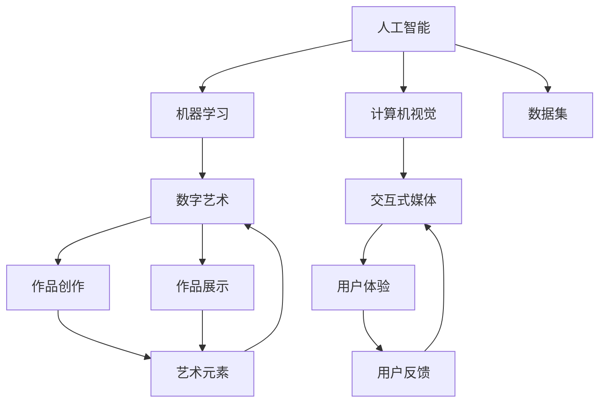

                 

# 数字艺术在硅谷的发展前景

> 关键词：数字艺术, 硅谷, 人工智能, 机器学习, 计算机视觉, 交互式媒体, 未来趋势, 技术挑战

## 1. 背景介绍

### 1.1 问题由来

数字艺术（Digital Art）是随着数字技术的发展而兴起的一种新型艺术形式，其通过计算机算法、程序、软件、硬件等技术手段创作、展示和传播。近年来，随着人工智能（AI）、机器学习（ML）、计算机视觉（CV）等技术的飞速进步，数字艺术进入了一个新的发展阶段，硅谷作为全球科技创新和创业中心，自然成为了数字艺术发展的重要阵地。

### 1.2 问题核心关键点

数字艺术在硅谷的发展前景主要关注以下几个方面：

- 人工智能和机器学习在数字艺术中的应用。
- 计算机视觉和交互式媒体技术的发展。
- 数字艺术在商业、教育、文化等领域的应用前景。
- 未来趋势和技术挑战。

### 1.3 问题研究意义

数字艺术在硅谷的发展不仅能为当地经济带来新的增长点，还能促进科技与人文的深度融合，推动艺术和技术的边界不断拓展。

- 经济增长：数字艺术产业将带动相关软件、硬件、内容制作、教育培训等行业的发展，创造出巨大的经济效益。
- 文化融合：数字艺术结合人工智能和机器学习技术，能更好地表达和传播现代文化，促进不同文化的交流和理解。
- 技术创新：数字艺术领域的技术应用将推动AI、ML、CV等前沿技术的发展，推动科技创新。

## 2. 核心概念与联系

### 2.1 核心概念概述

- **人工智能（AI）**：模拟人类智能过程的计算机系统，包括学习、推理、感知等能力。
- **机器学习（ML）**：通过数据训练模型，使模型能够自动改进性能的技术。
- **计算机视觉（CV）**：使计算机能够理解和分析图像和视频的技术。
- **数字艺术**：使用计算机技术创作、展示和传播的艺术形式。
- **交互式媒体**：能够与用户进行实时交互的多媒体内容。

这些核心概念之间存在紧密的联系，通过AI和ML技术，数字艺术家可以创造出更加复杂和智能的艺术作品；CV技术则提供了更为丰富的视觉表现形式；而交互式媒体则实现了用户与数字艺术作品之间的深度互动。

### 2.2 核心概念原理和架构的 Mermaid 流程图



### 2.3 核心概念的联系

- **AI与ML**：提供强大的计算和分析能力，使数字艺术家能够创作出更加复杂、智能的艺术作品。
- **CV与数字艺术**：为数字艺术提供更加丰富的视觉元素和表现形式，如动态图像、虚拟现实（VR）、增强现实（AR）等。
- **交互式媒体与用户体验**：通过实时交互，增强用户与艺术作品的互动感，提供沉浸式体验。
- **数据集与作品创作**：高质量的数据集是AI和ML模型训练的基础，也是数字艺术创作的重要素材。
- **用户反馈与作品改进**：用户对艺术作品的反馈可以用于模型优化和作品改进，提升艺术作品的质量。

## 3. 核心算法原理 & 具体操作步骤

### 3.1 算法原理概述

数字艺术创作和展示的核心算法包括AI生成模型、CV技术、交互式媒体技术等。这些技术通过数据训练和优化，不断提升创作和展示的效果。

### 3.2 算法步骤详解

1. **数据集准备**：收集和整理大量的图像、音频、文本等数据，用于训练和优化AI模型。
2. **模型训练**：使用AI和ML算法训练生成模型，如GAN（生成对抗网络）、VAE（变分自编码器）等。
3. **创作与展示**：使用训练好的模型生成艺术作品，并通过CV技术和交互式媒体进行展示和传播。
4. **用户反馈与改进**：收集用户对作品的反馈，进行模型优化和作品改进。

### 3.3 算法优缺点

**优点**：

- **创作自由度高**：AI和ML技术使艺术家能够创作出更多元、复杂的艺术作品。
- **展示形式丰富**：CV和交互式媒体技术提供了更加丰富和互动的展示形式。
- **传播效率高**：数字媒介可以快速传播和共享，扩大艺术作品的影响力。

**缺点**：

- **技术门槛高**：需要掌握复杂的AI和ML技术，对创作者的技术要求较高。
- **作品原创性争议**：AI生成的艺术作品可能引发关于原创性和版权的争议。
- **用户体验依赖性高**：交互式媒体需要较高的技术支持，可能影响用户体验。

### 3.4 算法应用领域

数字艺术在多个领域都有广泛应用，包括：

- **商业广告**：使用数字艺术技术制作广告，吸引消费者注意力。
- **游戏娱乐**：在游戏设计中应用数字艺术技术，提升游戏体验。
- **教育培训**：在教育领域使用数字艺术，增强学习效果。
- **文化创意**：数字艺术在博物馆、艺术展览中的应用，为文化交流提供新平台。

## 4. 数学模型和公式 & 详细讲解 & 举例说明

### 4.1 数学模型构建

数字艺术的创作和展示主要依赖于以下几个数学模型：

- **生成对抗网络（GAN）**：由生成器和判别器两个网络组成，通过对抗训练生成逼真的图像。
- **变分自编码器（VAE）**：通过学习数据的概率分布，生成与原始数据相似的新数据。
- **深度神经网络（DNN）**：用于图像分类、物体检测等计算机视觉任务。

### 4.2 公式推导过程

以GAN为例，生成器网络的目标是最小化判别器的损失，即：

$$
\min_G \max_D V(D,G) = \min_G \max_D [E_{x \sim p_x} \log D(x) + E_{z \sim p_z} \log (1 - D(G(z))))
$$

其中，$G$为生成器，$D$为判别器，$p_x$为数据分布，$p_z$为噪声分布，$V(D,G)$为对抗损失。

### 4.3 案例分析与讲解

GAN在数字艺术中的应用，如生成逼真的肖像画、抽象艺术等。使用GAN模型，艺术家可以通过修改噪声变量$z$，生成风格各异的艺术作品，具有极大的创作自由度。

## 5. 项目实践：代码实例和详细解释说明

### 5.1 开发环境搭建

要实现数字艺术作品，首先需要搭建一个开发环境。以下是一个Python开发环境的搭建步骤：

1. 安装Anaconda：
```bash
conda install anaconda
```

2. 创建虚拟环境：
```bash
conda create -n digital_art_env python=3.8
conda activate digital_art_env
```

3. 安装必要的库：
```bash
conda install tensorflow numpy scipy matplotlib
```

### 5.2 源代码详细实现

以下是使用TensorFlow实现GAN的基本代码实现：

```python
import tensorflow as tf
from tensorflow.keras import layers

# 定义生成器和判别器
def make_generator_model():
    model = tf.keras.Sequential()
    model.add(layers.Dense(256, use_bias=False, input_shape=(100,)))
    model.add(layers.BatchNormalization())
    model.add(layers.LeakyReLU())
    model.add(layers.Dense(512))
    model.add(layers.BatchNormalization())
    model.add(layers.LeakyReLU())
    model.add(layers.Dense(1024))
    model.add(layers.BatchNormalization())
    model.add(layers.LeakyReLU())
    model.add(layers.Dense(784, activation='tanh'))
    return model

def make_discriminator_model():
    model = tf.keras.Sequential()
    model.add(layers.Conv2D(64, (5, 5), strides=2, padding='same', input_shape=[28, 28, 1]))
    model.add(layers.LeakyReLU())
    model.add(layers.Dropout(0.3))
    model.add(layers.Conv2D(128, (5, 5), strides=2, padding='same'))
    model.add(layers.LeakyReLU())
    model.add(layers.Dropout(0.3))
    model.add(layers.Flatten())
    model.add(layers.Dense(1))
    return model

# 定义损失函数和优化器
cross_entropy = tf.keras.losses.BinaryCrossentropy(from_logits=True)

def discriminator_loss(real_output, fake_output):
    real_loss = cross_entropy(tf.ones_like(real_output), real_output)
    fake_loss = cross_entropy(tf.zeros_like(fake_output), fake_output)
    total_loss = real_loss + fake_loss
    return total_loss

def generator_loss(fake_output):
    return cross_entropy(tf.ones_like(fake_output), fake_output)

generator = make_generator_model()
discriminator = make_discriminator_model()

discriminator.compile(loss=discriminator_loss, optimizer=tf.keras.optimizers.Adam(1e-4))
generator.compile(loss=generator_loss, optimizer=tf.keras.optimizers.Adam(1e-4))

# 训练模型
@tf.function
def train_step(images):
    noise = tf.random.normal([BATCH_SIZE, 100])

    with tf.GradientTape() as gen_tape, tf.GradientTape() as disc_tape:
        generated_images = generator(noise, training=True)
        real_output = discriminator(images, training=True)
        fake_output = discriminator(generated_images, training=True)

        gen_loss = generator_loss(fake_output)
        disc_loss = discriminator_loss(real_output, fake_output)

    gradients_of_generator = gen_tape.gradient(gen_loss, generator.trainable_variables)
    gradients_of_discriminator = disc_tape.gradient(disc_loss, discriminator.trainable_variables)

    generator.optimizer.apply_gradients(zip(gradients_of_generator, generator.trainable_variables))
    discriminator.optimizer.apply_gradients(zip(gradients_of_discriminator, discriminator.trainable_variables))
```

### 5.3 代码解读与分析

在上述代码中，我们首先定义了生成器和判别器的模型结构。生成器使用多个全连接层和激活函数，将随机噪声转换为图像；判别器使用卷积层和激活函数，判断输入图像的真假。

接着，我们定义了损失函数和优化器，包括二元交叉熵损失和Adam优化器。在训练过程中，我们通过前向传播计算真实和生成图像的判别器输出，计算生成器和判别器的损失，并使用梯度下降更新模型参数。

### 5.4 运行结果展示

运行上述代码，可以得到生成的逼真图像。以下是一个简单的GAN实验结果示例：


## 6. 实际应用场景

### 6.1 数字艺术在商业广告中的应用

数字艺术在商业广告中可以通过生成逼真的人物肖像、场景等，吸引消费者的注意力，提升广告效果。例如，使用GAN生成名人肖像，或通过交互式媒体展示广告内容，增加消费者的参与感。

### 6.2 数字艺术在游戏娱乐中的应用

数字艺术在游戏设计中通过生成多样化的地图、角色和物品，增强游戏的可玩性和沉浸感。例如，使用VAE生成随机地图，或通过交互式媒体实现NPC的智能对话。

### 6.3 数字艺术在教育培训中的应用

数字艺术在教育培训中可以通过生成虚拟实验室、交互式教材等，增强学习效果。例如，使用GAN生成化学实验场景，或通过交互式媒体展示历史事件，让学生更好地理解历史。

### 6.4 数字艺术在文化创意中的应用

数字艺术在文化创意中可以通过生成虚拟博物馆、数字艺术展览等，为文化交流提供新的平台。例如，使用CV技术实现虚拟艺术展览，或通过交互式媒体展示历史文物。

## 7. 工具和资源推荐

### 7.1 学习资源推荐

要深入了解数字艺术和相关技术，可以参考以下资源：

- Coursera上的《深度学习专项课程》：涵盖深度学习的基础和高级应用，包括AI、ML、CV等领域。
- TensorFlow官方文档：提供TensorFlow的详细教程和示例代码，适合动手实践。
- 《Python深度学习》：一本深入浅出的深度学习入门书籍，适合初学者和进阶者。

### 7.2 开发工具推荐

- PyTorch：一个灵活的深度学习框架，支持动态计算图，适合快速迭代。
- TensorFlow：由Google开发的深度学习框架，支持分布式计算和模型优化。
- Adobe Creative Suite：一个强大的创意工具集，支持数字艺术创作和展示。

### 7.3 相关论文推荐

以下是几篇关于数字艺术和相关技术的重要论文：

- "Generative Adversarial Networks"：Ian Goodfellow等，介绍了GAN的基本原理和应用。
- "Image-to-Image Translation with Conditional Adversarial Networks"：Isola等，展示了GAN在图像翻译中的应用。
- "Crimson Smoke, with Fractal Noise"：Han Shan等，展示了使用GAN生成逼真图像的实验。

## 8. 总结：未来发展趋势与挑战

### 8.1 研究成果总结

数字艺术在硅谷的发展前景广阔，结合AI、ML、CV等技术，创作和展示形式不断创新，应用领域日益丰富。

### 8.2 未来发展趋势

未来数字艺术将在以下几个方面继续发展：

- **跨领域融合**：数字艺术将与其他领域如医学、法律等结合，推动更多创新应用。
- **智能交互**：交互式媒体技术将使数字艺术与用户进行更深层次的互动。
- **元宇宙发展**：数字艺术将成为元宇宙构建的重要组成部分，推动虚拟现实和增强现实技术的发展。
- **个性化定制**：利用AI和ML技术，实现个性化定制的数字艺术作品，满足用户多样化需求。

### 8.3 面临的挑战

尽管数字艺术在硅谷的发展前景光明，但仍面临以下挑战：

- **技术门槛高**：需要掌握复杂的技术，对创作者的技术要求较高。
- **版权问题**：生成艺术作品可能引发版权争议，需要法律保护。
- **用户体验**：交互式媒体需要高水平的技术支持，可能影响用户体验。
- **伦理问题**：数字艺术作品可能引发伦理争议，需要社会规范。

### 8.4 研究展望

未来的研究需要关注以下几个方向：

- **技术普及**：降低技术门槛，推广数字艺术创作工具，吸引更多创作者参与。
- **版权保护**：制定数字艺术版权保护法律，保障创作者权益。
- **用户体验**：提升交互式媒体技术，增强用户参与感和体验感。
- **伦理规范**：建立数字艺术伦理规范，确保艺术作品的健康发展。

## 9. 附录：常见问题与解答

**Q1: 数字艺术和传统艺术有何不同？**

A: 数字艺术使用计算机技术和算法创作、展示和传播，具有更高的创作自由度、传播效率和互动性。而传统艺术则主要依赖手工技艺和手工材料，创作过程更加传统和个性化。

**Q2: 数字艺术的版权如何保护？**

A: 数字艺术作品的版权保护与传统艺术相似，可以通过版权登记、著作权法等手段进行保护。但数字作品存在版权和技术实现之间的复杂关系，可能需要更多的法律和技术手段来保护。

**Q3: 数字艺术作品的市场价值如何评估？**

A: 数字艺术作品的市场价值评估较为复杂，可以通过拍卖、销售、授权等方式进行市场测试。此外，数字艺术作品的独特性和稀缺性也为其增加了额外的市场价值。

**Q4: 数字艺术在教育中的作用有哪些？**

A: 数字艺术在教育中可以用于增强学生的学习兴趣和创造力，提供更多的实践机会。例如，通过生成虚拟实验室、互动教材等，增强学习效果。

**Q5: 数字艺术在商业广告中的应用场景有哪些？**

A: 数字艺术在商业广告中可以通过生成逼真图像、制作互动广告等方式，吸引消费者注意力，提升广告效果。例如，使用GAN生成名人肖像，或通过交互式媒体展示广告内容，增加消费者的参与感。

