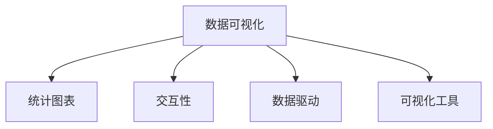

                 

# 数据可视化 原理与代码实例讲解

> 关键词：数据可视化, 可视化原理, 图形化展示, 数据洞察, Python, Matplotlib, Seaborn

## 1. 背景介绍

数据可视化是数据分析和决策支持的关键环节。它以图形化方式展示数据，揭示数据中的模式、趋势和异常，辅助用户理解和判断数据中的信息。随着数据量的激增，数据可视化在各行各业中得到了广泛应用，如商业分析、科学研究、金融分析、公共卫生等领域。

### 1.1 问题由来
现代企业的数据量呈现指数级增长，每天都会产生大量复杂且具有多维度的数据。传统的数据报告和表格方式难以直观展示这些数据，无法为决策者提供及时、有效、清晰的信息支持。此外，人们在处理数据时，更容易受到视觉上的印象和干扰，而数据可视化则能以更直观、更具吸引力的方式呈现数据，从而更好地辅助决策。

### 1.2 问题核心关键点
数据可视化主要围绕以下几个核心关键点展开：

1. **数据展现形式**：选择合适且直观的图形方式，如柱状图、折线图、散点图等，以展现数据的分布、变化和趋势。
2. **交互性设计**：增加可交互的元素，如鼠标悬停、缩放、动画等，提升用户操作的便利性和体验。
3. **数据驱动的图形设计**：保证图形的设计和展示符合数据的内在逻辑，避免误导用户。
4. **数据可视化技术**：包括但不限于统计学原理、图形学原理、编程实现技术等。
5. **可视化工具和库**：如Matplotlib、Seaborn、D3.js等，这些工具极大简化了可视化过程。

## 2. 核心概念与联系

### 2.1 核心概念概述

为了更好地理解数据可视化原理，本节将介绍几个关键的概念：

- **数据可视化（Data Visualization）**：以图形化方式展现数据，揭示数据中的模式、趋势和异常，辅助决策。
- **统计图表（Statistical Charts）**：如柱状图、折线图、散点图等，是数据可视化的基础图形展示形式。
- **交互性（Interactivity）**：增加可交互的元素，提升用户体验。
- **数据驱动（Data-Driven）**：图形设计和展示应基于数据的统计学原理和内在逻辑。
- **可视化工具**：如Matplotlib、Seaborn、D3.js等，这些工具极大地简化了可视化过程。

这些概念之间紧密关联，共同构成了数据可视化的基础框架，如图：



## 3. 核心算法原理 & 具体操作步骤
### 3.1 算法原理概述

数据可视化的算法原理主要包括以下几个方面：

1. **数据预处理**：对原始数据进行清洗、归一化、降维等处理，以便于后续的可视化。
2. **图形设计**：根据数据特性选择合适的图形，并设计图形的布局和颜色。
3. **数据映射**：将数据映射到图形的各个部分，如横轴、纵轴、点等。
4. **交互设计**：增加鼠标悬停、缩放、动画等交互元素，提升用户体验。

### 3.2 算法步骤详解

以下是数据可视化的主要步骤：

**Step 1: 数据预处理**
- 收集并整理数据集，清洗缺失值、异常值等，保证数据质量。
- 根据可视化需求进行数据归一化、降维等预处理。

**Step 2: 选择图形**
- 根据数据特性选择合适的统计图表，如柱状图、折线图、散点图等。
- 确定图形的布局，如横轴、纵轴、坐标轴范围等。

**Step 3: 设计图形**
- 设计图形的颜色、字体、样式等，保证美观和清晰。
- 确保图形的设计符合数据的统计学原理和内在逻辑，避免误导用户。

**Step 4: 数据映射**
- 将数据映射到图形的各个部分，如横轴、纵轴、点等。
- 根据数据的分布和特性进行适当调整，如分组、分页等。

**Step 5: 增加交互**
- 增加可交互的元素，如鼠标悬停、缩放、动画等，提升用户体验。
- 设计合适的交互方式，让用户可以更便捷地获取和理解数据信息。

**Step 6: 输出展示**
- 将设计好的图形展示出来，如打印、保存、网页展示等。
- 根据实际需求进行输出调整，如分辨率、尺寸等。

### 3.3 算法优缺点

数据可视化算法具有以下优点：

1. **直观展示数据**：图形化方式能直观展现数据的内在逻辑，辅助用户理解复杂数据。
2. **发现数据模式**：图形化方式能揭示数据中的模式、趋势和异常，辅助决策。
3. **提升用户体验**：增加可交互的元素，提升用户操作的便利性和体验。
4. **数据驱动设计**：图形设计基于数据的统计学原理和内在逻辑，避免误导用户。

同时，数据可视化算法也存在一些局限性：

1. **数据质量依赖**：图形的质量很大程度上取决于原始数据的质量，数据清洗和预处理尤为重要。
2. **选择图形复杂**：选择合适且直观的图形方式并非易事，需要根据数据特性和展示目的灵活选择。
3. **交互设计难度**：增加交互性元素增加了设计复杂度，需投入更多时间和精力。
4. **图形可解释性**：复杂图形可能会增加用户理解难度，需要注意图形的可解释性。

## 4. 数学模型和公式 & 详细讲解 & 举例说明

### 4.1 数学模型构建

数据可视化的数学模型构建主要围绕以下几个方面展开：

- **坐标轴设计**：横轴、纵轴的设计，如坐标原点、坐标轴范围、刻度等。
- **点状图设计**：点的分布、大小、颜色等。
- **折线图设计**：线的形态、颜色、填充等。
- **柱状图设计**：柱子的分布、高度、颜色等。

### 4.2 公式推导过程

以简单的柱状图为例，其数学模型构建过程如下：

设数据集为 $D = \{(x_i, y_i)\}_{i=1}^N$，其中 $x_i$ 为横轴，$y_i$ 为纵轴。柱状图的横轴范围为 $[a,b]$，纵轴范围为 $[c,d]$，柱子的高度为 $h_i = y_i - y_{i-1}$。

假设柱状图有 $k$ 个柱子，则其总高度为：

$$
H = \sum_{i=1}^{k} h_i
$$

根据上述公式，可以计算出每个柱子的高度，并进行图形绘制。

### 4.3 案例分析与讲解

以某电商平台的销售数据为例，通过柱状图展示不同产品在不同时间段的销售额。

1. **数据预处理**：整理销售数据，清洗缺失值和异常值，进行归一化处理。
2. **图形选择**：选择柱状图展示销售数据，横轴为时间段，纵轴为销售额。
3. **图形设计**：设计柱状图的颜色、字体、样式等，确保图形美观和清晰。
4. **数据映射**：将销售额映射到柱子的高度，通过横轴和纵轴展示时间段的分布。
5. **交互设计**：增加鼠标悬停、缩放、动画等交互元素，提升用户体验。

以下是对应的Python代码实现：

```python
import matplotlib.pyplot as plt

# 数据预处理
sales_data = {'product1': [100, 150, 200, 180, 120], 'product2': [80, 70, 90, 110, 100]}
sales_data = {k: v for k, v in sales_data.items() if len(v) == 5}

# 图形选择
months = ['Jan', 'Feb', 'Mar', 'Apr', 'May']

# 图形设计
plt.figure(figsize=(10, 6))
plt.title('Sales by Product')
plt.xlabel('Month')
plt.ylabel('Sales')

# 数据映射
plt.bar(months, sales_data['product1'], color='blue')
plt.bar(months, sales_data['product2'], bottom=sales_data['product1'], color='red')

# 交互设计
plt.legend(['Product 1', 'Product 2'])
plt.xticks(rotation=45)
plt.show()
```

运行代码后，将生成柱状图展示不同产品在各月份的销售情况，用户可以通过鼠标悬停获取详细信息。

## 5. 项目实践：代码实例和详细解释说明
### 5.1 开发环境搭建

在进行数据可视化实践前，我们需要准备好开发环境。以下是使用Python进行Matplotlib开发的配置流程：

1. 安装Anaconda：从官网下载并安装Anaconda，用于创建独立的Python环境。
2. 创建并激活虚拟环境：
```bash
conda create -n pyenv python=3.8 
conda activate pyenv
```

3. 安装Matplotlib：
```bash
pip install matplotlib
```

4. 安装相关库：
```bash
pip install numpy pandas scikit-learn seaborn
```

完成上述步骤后，即可在`pyenv`环境中开始数据可视化实践。

### 5.2 源代码详细实现

这里我们以绘制散点图为例，给出使用Matplotlib库进行数据可视化的PyTorch代码实现。

```python
import matplotlib.pyplot as plt

# 创建散点图
x = [1, 2, 3, 4, 5]
y = [2, 4, 5, 4, 6]

plt.figure(figsize=(10, 6))
plt.scatter(x, y)
plt.xlabel('X-axis')
plt.ylabel('Y-axis')
plt.title('Scatter Plot')
plt.show()
```

这段代码将生成一个简单的散点图，展示数据点在二维坐标系中的分布情况。

### 5.3 代码解读与分析

让我们再详细解读一下关键代码的实现细节：

**Matplotlib库**：
- 导入Matplotlib库，是Python中最流行的数据可视化库之一。
- 使用`plt.figure()`函数创建画布，`figsize`参数用于设置画布大小。
- 使用`plt.scatter()`函数绘制散点图，`x`和`y`分别为横轴和纵轴数据。
- 使用`plt.xlabel()`、`plt.ylabel()`和`plt.title()`函数设置横轴、纵轴和图形标题。
- 使用`plt.show()`函数显示图形。

可以看到，Matplotlib库的使用非常简单，只需几行代码即可实现基本的图形绘制。Matplotlib提供了丰富的图形类型和自定义选项，可以满足多种数据可视化需求。

当然，实际的数据可视化实践远比上述代码复杂。在工业级的系统实现中，还需要考虑数据交互、动态更新、异常处理等更多因素。但核心的数据可视化过程基本与此类似。

## 6. 实际应用场景

数据可视化技术在各行各业中得到了广泛应用，以下展示几个典型场景：

### 6.1 商业分析

在商业分析领域，数据可视化能够帮助企业从海量数据中提炼出有价值的商业洞察，制定更加精准的决策。例如，通过可视化展示不同地区的销售数据、用户增长曲线等，辅助企业优化产品策略、营销方案、供应链管理等。

### 6.2 科学研究

在科学研究领域，数据可视化能够帮助科学家揭示数据的复杂结构，发现潜在的科学规律。例如，通过可视化展示实验数据、观测数据等，辅助科学家进行数据分析、模型验证、结果解释等。

### 6.3 金融分析

在金融分析领域，数据可视化能够帮助分析师从复杂的数据集中提取有价值的信息，进行风险评估、市场预测等。例如，通过可视化展示股票价格走势、市场指数波动等，辅助分析师制定投资策略、风险管理方案等。

### 6.4 公共卫生

在公共卫生领域，数据可视化能够帮助公共卫生机构从大量医疗数据中提取有价值的健康信息，进行疾病监测、疫情预警等。例如，通过可视化展示不同地区的疾病发病率、死亡率等，辅助公共卫生机构制定公共卫生政策、防控措施等。

## 7. 工具和资源推荐
### 7.1 学习资源推荐

为了帮助开发者系统掌握数据可视化技术，这里推荐一些优质的学习资源：

1. 《Python数据可视化教程》：介绍使用Matplotlib、Seaborn、Plotly等库进行数据可视化的基本方法，适合初学者。
2. 《数据可视化实战》：介绍数据可视化的基本原理和多种实现方式，适合进阶学习者。
3. Coursera《数据可视化基础》课程：斯坦福大学开设的课程，介绍数据可视化的基本概念和实践技巧，适合各层次学习者。
4. D3.js官方文档：介绍D3.js库的使用方法，适合前端开发者。
5. Kaggle：提供大量数据集和可视化案例，适合实战练习。

通过这些资源的学习实践，相信你一定能够掌握数据可视化的基本方法和技巧，将数据转化为直观、清晰的图形。

### 7.2 开发工具推荐

高效的开发离不开优秀的工具支持。以下是几款用于数据可视化开发的常用工具：

1. Matplotlib：基于Python的开源数据可视化库，功能强大，支持多种图形类型。
2. Seaborn：基于Matplotlib的数据可视化库，支持更高级的图形类型和定制选项。
3. Plotly：基于JavaScript的数据可视化库，支持交互式图表和动画效果。
4. D3.js：基于JavaScript的数据可视化库，支持复杂的交互式图形设计。
5. Tableau：商业智能软件，提供可视化仪表盘和数据报告，适合数据驱动的决策支持。

合理利用这些工具，可以显著提升数据可视化开发的效率，加快创新迭代的步伐。

### 7.3 相关论文推荐

数据可视化技术的发展源于学界的持续研究。以下是几篇奠基性的相关论文，推荐阅读：

1. "A Study of Data Visualization Principles and Practices"：探讨数据可视化的基本原则和实践方法。
2. "Visualization with Visualization"：提出可视化过程中的交互设计原则和方法。
3. "Interactive Visualization in Scientific Research"：探讨科学数据可视化中的交互性和可解释性。
4. "Data Visualization in Business Intelligence"：介绍商业数据可视化的基本方法和应用案例。
5. "A Survey on Data Visualization Techniques"：综述数据可视化的主要技术和应用领域。

这些论文代表了大数据可视化技术的发展脉络。通过学习这些前沿成果，可以帮助研究者把握学科前进方向，激发更多的创新灵感。

## 8. 总结：未来发展趋势与挑战

### 8.1 总结

本文对数据可视化原理进行了全面系统的介绍。首先阐述了数据可视化的研究背景和意义，明确了数据可视化在数据驱动决策中的重要性。其次，从原理到实践，详细讲解了数据可视化的数学模型构建和主要操作步骤，给出了数据可视化任务开发的完整代码实例。同时，本文还广泛探讨了数据可视化技术在商业分析、科学研究、金融分析、公共卫生等多个领域的应用前景，展示了数据可视化技术的广阔应用范围。

通过本文的系统梳理，可以看到，数据可视化技术正在成为数据驱动决策的重要支撑，极大地拓展了数据展现和分析的方式，提升了决策效率和质量。未来，伴随数据量的持续增长和数据分析需求的日益多样化，数据可视化技术也将不断演进，为人类社会的发展提供更强大的数据洞察和决策支持。

### 8.2 未来发展趋势

展望未来，数据可视化技术将呈现以下几个发展趋势：

1. **多维数据分析**：随着数据量的激增，多维数据可视化将变得更加重要。如何从多维数据中提取有价值的信息，并进行高效展示，将是重要的研究方向。
2. **交互性和动态性**：交互性和动态性是提升用户体验的重要手段。未来，更多可交互的图形、动态展示效果等将得到广泛应用。
3. **大数据可视化**：大数据量的数据可视化对计算资源和展示效果提出了更高的要求。如何优化计算和展示过程，提升大数据可视化的效率和效果，将是重要的研究方向。
4. **智能可视化**：结合人工智能技术，实现自动化的数据探索和可视化，提升数据分析效率。
5. **可视化与机器学习结合**：将可视化技术与机器学习算法结合，实现数据驱动的自动化可视化，提升数据洞察和决策支持能力。

以上趋势凸显了数据可视化技术的广阔前景。这些方向的探索发展，将进一步提升数据可视化在各领域的落地效果，为决策者提供更加精准、及时、直观的数据支持。

### 8.3 面临的挑战

尽管数据可视化技术已经取得了显著成果，但在迈向更高效、更智能的展示过程中，它仍面临着诸多挑战：

1. **数据质量问题**：原始数据的质量很大程度上决定了可视化结果的准确性。如何保证数据清洗和预处理的准确性，避免数据噪声对结果的影响，是一个重要的问题。
2. **图形设计复杂性**：选择合适且直观的图形方式并非易事，需要根据数据特性和展示目的灵活选择。图形设计复杂度高，需投入更多时间和精力。
3. **交互设计难度**：增加可交互的元素增加了设计复杂度，需投入更多时间和精力。
4. **图形可解释性**：复杂图形可能会增加用户理解难度，需要注意图形的可解释性。

这些挑战凸显了数据可视化技术在落地应用中的难度。解决这些挑战需要从数据、算法、用户等多个维度进行综合优化。

### 8.4 研究展望

面向未来，数据可视化技术的研究方向可以从以下几个方面进行探索：

1. **自动化可视化**：结合机器学习和数据挖掘技术，实现自动化的数据探索和可视化，提升数据分析效率。
2. **多维数据可视化**：发展多维数据可视化技术，提升对复杂数据的理解能力。
3. **可视化与数据挖掘结合**：将数据挖掘技术与可视化技术结合，发现数据中的潜在模式和异常。
4. **可视化与AI结合**：结合人工智能技术，实现智能化的数据可视化，提升决策支持能力。
5. **可视化与自然语言处理结合**：将自然语言处理技术与可视化技术结合，提升数据表达的语义性和可理解性。

这些研究方向将进一步拓展数据可视化的应用边界，为数据驱动决策提供更强大的技术支撑。

## 9. 附录：常见问题与解答

**Q1：数据可视化主要有哪些应用场景？**

A: 数据可视化主要应用于以下几个领域：
1. 商业分析：展示销售数据、用户增长曲线等，辅助企业制定决策。
2. 科学研究：展示实验数据、观测数据等，辅助科学家进行数据分析、模型验证等。
3. 金融分析：展示股票价格走势、市场指数波动等，辅助分析师制定投资策略、风险管理方案等。
4. 公共卫生：展示不同地区的疾病发病率、死亡率等，辅助公共卫生机构制定防控措施等。

**Q2：如何选择合适且直观的图形方式？**

A: 选择合适且直观的图形方式需要考虑以下几个方面：
1. 数据类型：不同类型的数据适合不同类型的图形，如柱状图适合展示分类数据，折线图适合展示时间序列数据。
2. 数据分布：数据分布的形态（如正态分布、偏态分布）会影响图形的选择。
3. 展示目的：不同的展示目的需要不同的图形，如比较不同组的数值、展示数据的趋势等。
4. 用户需求：用户对图形的理解度和需求也会影响图形的选择。

**Q3：数据可视化的关键步骤有哪些？**

A: 数据可视化的主要步骤包括：
1. 数据预处理：清洗、归一化、降维等，保证数据质量。
2. 图形选择：选择合适的图形类型，如柱状图、折线图、散点图等。
3. 图形设计：设计图形的颜色、字体、样式等，保证美观和清晰。
4. 数据映射：将数据映射到图形的各个部分，如横轴、纵轴、点等。
5. 交互设计：增加可交互的元素，提升用户体验。
6. 输出展示：将设计好的图形展示出来，如打印、保存、网页展示等。

**Q4：数据可视化工具推荐哪些？**

A: 推荐使用以下几个工具进行数据可视化：
1. Matplotlib：基于Python的开源数据可视化库，功能强大，支持多种图形类型。
2. Seaborn：基于Matplotlib的数据可视化库，支持更高级的图形类型和定制选项。
3. Plotly：基于JavaScript的数据可视化库，支持交互式图表和动画效果。
4. D3.js：基于JavaScript的数据可视化库，支持复杂的交互式图形设计。
5. Tableau：商业智能软件，提供可视化仪表盘和数据报告，适合数据驱动的决策支持。

**Q5：数据可视化技术有哪些发展趋势？**

A: 数据可视化技术的发展趋势包括：
1. 多维数据分析：从多维数据中提取有价值的信息，并进行高效展示。
2. 交互性和动态性：提升用户体验，增加可交互的元素和动态展示效果。
3. 大数据可视化：优化计算和展示过程，提升大数据可视化的效率和效果。
4. 智能可视化：结合人工智能技术，实现自动化的数据探索和可视化。
5. 可视化与机器学习结合：实现数据驱动的自动化可视化。

**Q6：数据可视化面临的主要挑战有哪些？**

A: 数据可视化面临的主要挑战包括：
1. 数据质量问题：保证数据清洗和预处理的准确性，避免数据噪声对结果的影响。
2. 图形设计复杂性：选择合适且直观的图形方式，保证图形设计的美观和清晰。
3. 交互设计难度：增加可交互的元素，提升用户体验。
4. 图形可解释性：复杂图形可能会增加用户理解难度，需要注意图形的可解释性。

通过解决这些挑战，数据可视化技术将更好地服务于各领域的决策支持。

---

作者：禅与计算机程序设计艺术 / Zen and the Art of Computer Programming

