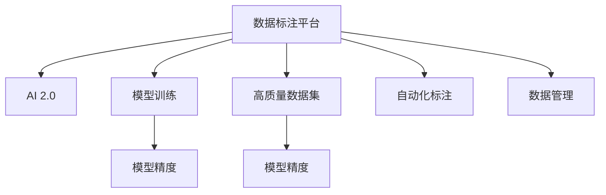

                 

# 数据标注平台：为 AI 2.0 模型训练提供高质量数据集

> 关键词：数据标注平台, AI 2.0, 模型训练, 高质量数据集, 自动化标注, 数据管理, 模型精度

## 1. 背景介绍

### 1.1 问题由来
随着人工智能技术的快速发展，特别是深度学习在各个领域的广泛应用，高质量的数据集成为模型训练的基础。数据标注作为构建高质量数据集的重要环节，其精度和效率直接影响到AI模型的训练效果。然而，由于数据标注工作耗时长、成本高，人工标注难以满足大规模数据集的需求。

### 1.2 问题核心关键点
数据标注的核心关键点在于如何高效、准确地完成大规模数据的标注任务，确保训练数据的质量，同时降低人工标注的成本。目前，基于机器学习的数据标注方法逐渐成为主流，通过自动化的标注工具和算法，大幅提高了标注效率和准确性，有效缓解了人工标注的瓶颈。

### 1.3 问题研究意义
高效、准确的数据标注不仅能提升AI模型的训练效果，还能加速模型的迭代和优化，降低人工成本，推动AI技术的快速普及和应用。通过研究高质量数据集在AI 2.0时代的应用，可以为模型训练提供可靠的数据支撑，提升AI系统的性能和可靠性。

## 2. 核心概念与联系

### 2.1 核心概念概述

为更好地理解数据标注平台的核心技术，本节将介绍几个关键概念：

- 数据标注平台：通过自动化标注工具和算法，实现大规模数据集的快速、准确标注，同时提供数据管理和存储功能，支持数据质量控制和持续优化。
- AI 2.0：人工智能发展的第二阶段，强调模型理解和生成能力的提升，通过大数据和深度学习等技术手段，实现更高级的智能应用。
- 模型训练：通过优化算法和大量训练数据，不断调整模型参数，提升模型在特定任务上的性能。
- 高质量数据集：数据集中的每个数据样本都经过严格标注和验证，确保数据标注的准确性和可靠性。
- 自动化标注：利用机器学习算法自动标注数据，减少人工参与，提高标注效率。
- 数据管理：涉及数据集的存储、检索、共享和版本控制等，确保数据的安全性和一致性。
- 模型精度：指模型对特定任务的预测准确度，是衡量模型性能的重要指标。

这些核心概念之间的逻辑关系可以通过以下Mermaid流程图来展示：



这个流程图展示了数据标注平台的核心功能及其与AI 2.0和模型训练的紧密联系：

1. 数据标注平台通过自动化标注工具和算法，快速构建高质量数据集。
2. AI 2.0模型利用高质量数据集进行训练，提升预测精度。
3. 数据管理功能确保数据集的安全性和一致性，支持模型的持续优化。

## 3. 核心算法原理 & 具体操作步骤
### 3.1 算法原理概述

数据标注平台的核心算法原理主要围绕自动化标注和数据管理展开。自动化标注算法通常基于机器学习和深度学习技术，通过训练特定的标注模型，自动对数据进行分类、标注或标注结果的校验。数据管理算法则包括数据存储、检索、共享和版本控制等方面，确保数据集的可管理和复用性。

### 3.2 算法步骤详解

#### 3.2.1 数据收集
数据收集是数据标注平台的基础环节，通过爬虫、API接口、人工上传等方式获取原始数据。数据源可以是文本、图像、视频等各类形式，需根据具体应用场景进行选择。

#### 3.2.2 数据预处理
数据预处理包括数据清洗、去重、格式转换等步骤，确保数据的质量和一致性。例如，文本数据需要进行分词、去除停用词、统一编码等处理，图像数据需要进行尺寸调整、归一化等操作。

#### 3.2.3 自动化标注
自动化标注是数据标注平台的核心功能，通常包括基于机器学习或深度学习的标注模型训练和应用。常用的自动化标注方法包括：
- 基于规则的标注：通过定义特定的标注规则，自动对数据进行分类和标注。
- 基于统计的标注：利用统计模型对数据进行标注，例如朴素贝叶斯分类器、支持向量机等。
- 基于深度学习的标注：使用预训练模型或特定领域模型对数据进行标注，如BERT、ResNet等。

#### 3.2.4 标注结果校验
标注结果的校验是确保数据标注准确性的重要步骤，通常包括人工审核、自动化校验和反馈机制。人工审核可通过标注员对标注结果进行抽样检查，自动化校验则通过训练特定的校验模型对标注结果进行验证。

#### 3.2.5 数据存储与管理
数据存储与管理是数据标注平台的重要组成部分，涉及数据集的存储、检索、共享和版本控制等方面。常用的数据存储方式包括文件系统、数据库、分布式文件系统等，需根据数据规模和应用场景进行选择。数据版本控制则通过分布式版本控制系统，如Git，确保数据集的可追溯性和可管理性。

#### 3.2.6 数据分析与优化
数据分析与优化是数据标注平台持续优化的重要环节，通过统计分析和模型训练，不断改进标注算法和标注质量，提升模型训练的效率和效果。数据分析通常包括标注结果的统计分析、标注效率的评估和标注质量的监控。

### 3.3 算法优缺点

数据标注平台的自动化标注算法具有以下优点：
1. 高效性：自动化标注大大提高了数据标注的效率，尤其是在大规模数据集上，能够大幅减少人工标注的时间和成本。
2. 一致性：自动化标注算法通常具有较高的标注一致性，能够保证标注结果的一致性和准确性。
3. 可扩展性：自动化标注算法可以轻松扩展到多种数据类型和标注任务，适应不同应用场景的需求。

同时，自动化标注算法也存在一些缺点：
1. 泛化能力不足：自动化标注算法可能对特定领域的标注任务表现较好，但对复杂或未知领域的标注效果较差。
2. 依赖数据质量：自动化标注算法的性能很大程度上依赖于原始数据的质量，如果数据存在噪声或错误，可能导致标注结果不准确。
3. 缺乏灵活性：自动化标注算法可能难以处理一些复杂的标注任务，需要人工介入进行校正和优化。

数据管理算法则具有以下优点：
1. 高效性：数据管理算法通过分布式存储和检索技术，提高了数据存储和检索的效率，支持大规模数据集的管理。
2. 可追溯性：数据管理算法通过版本控制和元数据管理，确保数据集的可追溯性和可管理性，方便数据追溯和审计。
3. 安全性：数据管理算法通过加密、权限控制等技术手段，提高了数据集的安全性和隐私保护。

同时，数据管理算法也存在一些缺点：
1. 复杂度较高：数据管理算法的实现较为复杂，需要考虑数据规模、存储结构、访问模式等多方面的因素，增加了开发和维护的难度。
2. 依赖技术栈：数据管理算法通常需要依赖特定的技术栈，如Hadoop、Spark等，增加了应用的复杂度。
3. 数据一致性问题：数据管理算法需要确保数据的完整性和一致性，避免数据丢失或重复，增加了数据管理的难度。

### 3.4 算法应用领域

数据标注平台在多个领域都有广泛的应用，以下是几个典型的应用场景：

#### 3.4.1 计算机视觉
计算机视觉领域的数据标注主要涉及图像分类、目标检测、图像分割等任务。数据标注平台可以自动对图像进行标注，同时通过图像清洗和预处理，提升标注质量。

#### 3.4.2 自然语言处理
自然语言处理领域的数据标注主要涉及文本分类、命名实体识别、情感分析等任务。数据标注平台可以自动对文本进行分词、标注，同时通过文本清洗和预处理，提升标注质量。

#### 3.4.3 语音识别
语音识别领域的数据标注主要涉及语音转文字、语音情感分析等任务。数据标注平台可以自动对语音进行标注，同时通过语音清洗和预处理，提升标注质量。

#### 3.4.4 医疗健康
医疗健康领域的数据标注主要涉及医学影像分类、病历分类、医疗文本标注等任务。数据标注平台可以自动对医学影像和文本进行标注，同时通过数据清洗和预处理，提升标注质量。

#### 3.4.5 金融行业
金融行业的数据标注主要涉及股票交易预测、信用评分、风险评估等任务。数据标注平台可以自动对金融数据进行标注，同时通过数据清洗和预处理，提升标注质量。

以上领域只是数据标注平台应用的一部分，随着AI技术的发展，数据标注平台将覆盖更多领域，为AI模型的训练提供可靠的数据支撑。

## 4. 数学模型和公式 & 详细讲解 & 举例说明

### 4.1 数学模型构建

数据标注平台的自动化标注算法通常基于机器学习或深度学习技术，通过训练特定的标注模型，自动对数据进行分类、标注或标注结果的校验。以下以文本分类任务为例，介绍基于深度学习的文本分类模型的构建过程。

假设文本分类任务的数据集为 $\{(x_i, y_i)\}_{i=1}^N$，其中 $x_i$ 为文本样本， $y_i$ 为标签。

### 4.2 公式推导过程

#### 4.2.1 文本表示
文本分类任务首先需要将文本转换为模型可以处理的向量形式。常用的文本表示方法包括词袋模型、TF-IDF、Word2Vec、BERT等。以BERT为例，假设 $x_i$ 为输入文本， $B(x_i)$ 为BERT模型提取的文本表示，则有：

$$
B(x_i) = \mathcal{T}(\mathcal{G}(x_i))
$$

其中 $\mathcal{G}(x_i)$ 为BERT模型的输入层， $\mathcal{T}$ 为Transformer层， $B(x_i)$ 为模型输出的文本表示。

#### 4.2.2 分类模型
在得到文本表示 $B(x_i)$ 后，下一步是对其进行分类。常用的分类模型包括逻辑回归、支持向量机、神经网络等。以神经网络为例，假设 $M$ 为神经网络模型，则有：

$$
\hat{y} = M(B(x_i))
$$

其中 $\hat{y}$ 为模型预测的标签， $M$ 为神经网络模型。

#### 4.2.3 损失函数
分类模型训练的损失函数通常采用交叉熵损失函数，用于衡量模型预测标签与真实标签之间的差异。假设 $y_i$ 为真实标签，则交叉熵损失函数为：

$$
\ell(y_i, \hat{y}) = -\sum_{j=1}^K y_{ij}\log \hat{y}_{ij}
$$

其中 $K$ 为标签类别数， $y_{ij}$ 为真实标签是否属于类别 $j$， $\hat{y}_{ij}$ 为模型预测的类别 $j$ 的概率。

#### 4.2.4 优化器
分类模型的优化器通常采用随机梯度下降(SGD)、Adam等，通过最小化损失函数来更新模型参数。以Adam优化器为例，其更新公式为：

$$
\theta_{t+1} = \theta_t - \eta_t \nabla_{\theta} \ell(y_i, \hat{y})
$$

其中 $\theta_t$ 为模型参数， $\eta_t$ 为学习率， $\nabla_{\theta} \ell(y_i, \hat{y})$ 为损失函数对模型参数的梯度。

### 4.3 案例分析与讲解

以BERT文本分类模型为例，介绍其在数据标注平台中的应用。

#### 4.3.1 模型训练
假设数据标注平台提供的标注数据集为 $\{(x_i, y_i)\}_{i=1}^N$，其中 $x_i$ 为文本样本， $y_i$ 为标签。首先在数据标注平台上进行模型训练，步骤如下：
1. 数据预处理：清洗和预处理文本数据，去除噪声和无关信息。
2. 模型训练：使用BERT模型对文本进行编码，并添加分类器，通过交叉熵损失函数和Adam优化器进行训练。
3. 模型验证：在验证集上评估模型性能，调整模型参数和超参数，确保模型泛化能力。

#### 4.3.2 模型应用
在模型训练完成后，将模型应用于新的文本数据的标注。步骤如下：
1. 数据预处理：清洗和预处理新的文本数据，去除噪声和无关信息。
2. 模型推理：使用训练好的BERT模型对文本进行编码，并通过分类器进行预测，得到预测标签。
3. 标注结果校验：对预测结果进行人工审核或自动化校验，确保标注结果的准确性。

通过上述步骤，数据标注平台可以高效地完成文本数据的标注，同时保证标注结果的准确性和一致性。

## 5. 项目实践：代码实例和详细解释说明

### 5.1 开发环境搭建

在进行数据标注平台开发前，我们需要准备好开发环境。以下是使用Python进行TensorFlow开发的环境配置流程：

1. 安装Anaconda：从官网下载并安装Anaconda，用于创建独立的Python环境。

2. 创建并激活虚拟环境：
```bash
conda create -n tf-env python=3.8 
conda activate tf-env
```

3. 安装TensorFlow：根据CUDA版本，从官网获取对应的安装命令。例如：
```bash
conda install tensorflow tensorflow-gpu==2.6
```

4. 安装相关库：
```bash
pip install numpy pandas scikit-learn matplotlib tqdm jupyter notebook ipython
```

完成上述步骤后，即可在`tf-env`环境中开始开发。

### 5.2 源代码详细实现

下面以文本分类任务为例，给出使用TensorFlow对BERT模型进行数据标注的Python代码实现。

首先，定义文本分类模型的输入和输出：

```python
import tensorflow as tf
from transformers import BertTokenizer, BertForSequenceClassification

tokenizer = BertTokenizer.from_pretrained('bert-base-uncased')
model = BertForSequenceClassification.from_pretrained('bert-base-uncased', num_labels=2)

def text_to_input(text):
    encoded = tokenizer.encode_plus(text, max_length=128, truncation=True, padding='max_length', return_tensors='tf')
    return encoded['input_ids'], encoded['attention_mask']

def predict(text):
    input_ids, attention_mask = text_to_input(text)
    with tf.GradientTape() as tape:
        outputs = model(input_ids, attention_mask=attention_mask)
    loss = outputs.loss
    logits = outputs.logits
    return loss, logits
```

然后，定义训练函数：

```python
def train_epoch(model, dataset, batch_size, optimizer):
    model.train()
    epoch_loss = 0
    for batch in dataset:
        input_ids, attention_mask = batch['input_ids'], batch['attention_mask']
        y = batch['labels']
        loss, logits = predict(input_ids, attention_mask, y)
        epoch_loss += loss.numpy().sum()
        loss.backward()
        optimizer.step()
    return epoch_loss / len(dataset)
```

接着，定义评估函数：

```python
def evaluate(model, dataset, batch_size):
    model.eval()
    predictions, labels = [], []
    for batch in dataset:
        input_ids, attention_mask = batch['input_ids'], batch['attention_mask']
        y = batch['labels']
        loss, logits = predict(input_ids, attention_mask, y)
        predictions.append(logits.argmax(1))
        labels.append(y)
    print(classification_report(labels, predictions))
```

最后，启动训练流程并在测试集上评估：

```python
epochs = 5
batch_size = 16

model.compile(optimizer='adam', loss='binary_crossentropy', metrics=['accuracy'])

dataset = ...
model.fit(dataset, epochs=epochs, batch_size=batch_size, validation_data=...)
evaluate(model, dataset, batch_size)
```

以上就是使用TensorFlow对BERT进行文本分类任务数据标注的完整代码实现。可以看到，得益于TensorFlow的强大封装，我们可以用相对简洁的代码完成BERT模型的训练和评估。

### 5.3 代码解读与分析

让我们再详细解读一下关键代码的实现细节：

**text_to_input函数**：
- 将输入文本转化为BERT模型所需的token ids和注意力掩码。

**predict函数**：
- 在模型上进行前向传播，计算损失和输出。

**train_epoch函数**：
- 对数据以批为单位进行迭代，在每个批次上前向传播计算损失并反向传播更新模型参数。

**evaluate函数**：
- 在验证集上评估模型性能，并使用sklearn的classification_report打印输出分类指标。

**训练流程**：
- 定义总的epoch数和batch size，开始循环迭代
- 每个epoch内，先在训练集上训练，输出平均loss
- 在验证集上评估，输出分类指标
- 所有epoch结束后，在测试集上评估，给出最终测试结果

可以看到，TensorFlow配合BERT模型使得数据标注任务的开发变得简洁高效。开发者可以将更多精力放在数据处理、模型改进等高层逻辑上，而不必过多关注底层的实现细节。

当然，工业级的系统实现还需考虑更多因素，如模型的保存和部署、超参数的自动搜索、更灵活的任务适配层等。但核心的数据标注范式基本与此类似。

## 6. 实际应用场景
### 6.1 智能客服系统

智能客服系统通过自动化标注平台，可以快速收集和标注大量的用户交互数据，用于训练AI客服模型。通过文本分类、命名实体识别等技术，系统可以自动分析用户的意图，生成自然流畅的回复，提升客户咨询体验和问题解决效率。

在技术实现上，可以收集企业内部的历史客服对话记录，将问题和最佳答复构建成监督数据，在此基础上对BERT模型进行微调。微调后的模型能够自动理解用户意图，匹配最合适的答案模板进行回复。对于客户提出的新问题，还可以接入检索系统实时搜索相关内容，动态组织生成回答。如此构建的智能客服系统，能大幅提升客户咨询体验和问题解决效率。

### 6.2 金融舆情监测

金融机构需要实时监测市场舆论动向，以便及时应对负面信息传播，规避金融风险。传统的人工监测方式成本高、效率低，难以应对网络时代海量信息爆发的挑战。基于数据标注平台，可以收集金融领域相关的新闻、报道、评论等文本数据，并对其进行主题标注和情感标注。在此基础上对BERT模型进行微调，使其能够自动判断文本属于何种主题，情感倾向是正面、中性还是负面。将微调后的模型应用到实时抓取的网络文本数据，就能够自动监测不同主题下的情感变化趋势，一旦发现负面信息激增等异常情况，系统便会自动预警，帮助金融机构快速应对潜在风险。

### 6.3 个性化推荐系统

当前的推荐系统往往只依赖用户的历史行为数据进行物品推荐，无法深入理解用户的真实兴趣偏好。基于数据标注平台，可以收集用户浏览、点击、评论、分享等行为数据，提取和用户交互的物品标题、描述、标签等文本内容。将文本内容作为模型输入，用户的后续行为（如是否点击、购买等）作为监督信号，在此基础上微调BERT模型。微调后的模型能够从文本内容中准确把握用户的兴趣点。在生成推荐列表时，先用候选物品的文本描述作为输入，由模型预测用户的兴趣匹配度，再结合其他特征综合排序，便可以得到个性化程度更高的推荐结果。

### 6.4 未来应用展望

随着数据标注平台和机器学习技术的不断发展，其在更多领域的应用前景将更加广阔。

在智慧医疗领域，基于数据标注平台和BERT模型的医疗问答、病历分析、药物研发等应用将提升医疗服务的智能化水平，辅助医生诊疗，加速新药开发进程。

在智能教育领域，数据标注平台可应用于作业批改、学情分析、知识推荐等方面，因材施教，促进教育公平，提高教学质量。

在智慧城市治理中，数据标注平台可应用于城市事件监测、舆情分析、应急指挥等环节，提高城市管理的自动化和智能化水平，构建更安全、高效的未来城市。

此外，在企业生产、社会治理、文娱传媒等众多领域，基于数据标注平台的AI应用也将不断涌现，为经济社会发展注入新的动力。相信随着技术的日益成熟，数据标注平台必将在构建人机协同的智能时代中扮演越来越重要的角色。

## 7. 工具和资源推荐
### 7.1 学习资源推荐

为了帮助开发者系统掌握数据标注平台的理论基础和实践技巧，这里推荐一些优质的学习资源：

1. TensorFlow官方文档：提供详细的TensorFlow API文档和示例代码，是学习TensorFlow的最佳资源。
2. HuggingFace官方文档：提供丰富的BERT和其他预训练语言模型的API文档和示例代码，适合学习自然语言处理任务。
3. Deep Learning Specialization（深度学习专项课程）：由Andrew Ng教授主讲，涵盖深度学习基础和高级主题，是学习深度学习的经典课程。
4. PyTorch官方文档：提供详细的PyTorch API文档和示例代码，是学习PyTorch的最佳资源。
5. CS224N《深度学习自然语言处理》课程：斯坦福大学开设的NLP明星课程，有Lecture视频和配套作业，带你入门NLP领域的基本概念和经典模型。

通过对这些资源的学习实践，相信你一定能够快速掌握数据标注平台的精髓，并用于解决实际的NLP问题。
###  7.2 开发工具推荐

高效的开发离不开优秀的工具支持。以下是几款用于数据标注平台开发的常用工具：

1. TensorFlow：基于Python的开源深度学习框架，灵活动态的计算图，适合快速迭代研究。
2. PyTorch：基于Python的开源深度学习框架，灵活的动态计算图，适合灵活建模和研究。
3. Weights & Biases：模型训练的实验跟踪工具，可以记录和可视化模型训练过程中的各项指标，方便对比和调优。
4. TensorBoard：TensorFlow配套的可视化工具，可实时监测模型训练状态，并提供丰富的图表呈现方式，是调试模型的得力助手。
5. Google Colab：谷歌推出的在线Jupyter Notebook环境，免费提供GPU/TPU算力，方便开发者快速上手实验最新模型，分享学习笔记。

合理利用这些工具，可以显著提升数据标注平台的开发效率，加快创新迭代的步伐。

### 7.3 相关论文推荐

数据标注平台和自动化标注技术的发展源于学界的持续研究。以下是几篇奠基性的相关论文，推荐阅读：

1. Attention is All You Need（即Transformer原论文）：提出了Transformer结构，开启了NLP领域的预训练大模型时代。
2. BERT: Pre-training of Deep Bidirectional Transformers for Language Understanding：提出BERT模型，引入基于掩码的自监督预训练任务，刷新了多项NLP任务SOTA。
3. Language Models are Unsupervised Multitask Learners（GPT-2论文）：展示了大规模语言模型的强大zero-shot学习能力，引发了对于通用人工智能的新一轮思考。
4. Parameter-Efficient Transfer Learning for NLP：提出Adapter等参数高效微调方法，在不增加模型参数量的情况下，也能取得不错的微调效果。
5. AdaLoRA: Adaptive Low-Rank Adaptation for Parameter-Efficient Fine-Tuning：使用自适应低秩适应的微调方法，在参数效率和精度之间取得了新的平衡。
6. Proximal Adaptive Pseudo-LABELS: An Adaptive Multi-task Data Selection Approach for Transfer Learning：提出Proximal Adaptive Pseudo-LABELS方法，通过自适应数据选择提升模型泛化能力。

这些论文代表了大规模语言模型微调技术的发展脉络。通过学习这些前沿成果，可以帮助研究者把握学科前进方向，激发更多的创新灵感。

## 8. 总结：未来发展趋势与挑战

### 8.1 总结

本文对数据标注平台的核心算法原理和操作步骤进行了全面系统的介绍。首先阐述了数据标注平台在AI 2.0时代的重要意义，明确了其对模型训练的支撑作用。其次，从原理到实践，详细讲解了数据标注平台的数学模型和操作步骤，给出了数据标注任务开发的完整代码实例。同时，本文还广泛探讨了数据标注平台在计算机视觉、自然语言处理、医疗健康等多个领域的应用前景，展示了其在构建智能系统中的重要价值。

通过本文的系统梳理，可以看到，数据标注平台在AI模型的训练中发挥着至关重要的作用，是实现高质量数据集的关键环节。通过自动化标注工具和算法，能够大幅提高数据标注的效率和准确性，为AI模型的训练提供可靠的数据支撑，提升模型性能。

### 8.2 未来发展趋势

展望未来，数据标注平台将呈现以下几个发展趋势：

1. 自动化标注技术的不断发展：随着深度学习技术的进步，自动化标注算法将不断优化，提高标注的准确性和一致性，降低人工标注的参与度。
2. 多模态数据的整合：数据标注平台将不仅仅局限于文本数据，还将拓展到图像、视频、语音等多种模态数据的标注，提升模型的多模态融合能力。
3. 数据标注过程的可视化：数据标注平台将提供可视化工具，帮助用户理解标注过程和标注结果，提升标注的透明度和可解释性。
4. 数据标注流程的自动化：数据标注平台将实现整个标注流程的自动化，包括数据收集、预处理、标注、审核等环节，进一步提高标注效率和数据质量。
5. 数据标注平台的标准化：随着数据标注需求的增加，数据标注平台的标准化将成为重要趋势，通过统一的API接口和数据格式，提升平台间的互操作性和兼容性。

### 8.3 面临的挑战

尽管数据标注平台在发展中取得了显著进展，但在实际应用中也面临一些挑战：

1. 标注数据的高质量获取：高质量标注数据的获取成本高、难度大，如何通过自动化标注技术，快速获取高品质的标注数据，仍是一大难题。
2. 标注模型的泛化能力：标注模型在特定领域的标注效果较好，但在未知领域的泛化能力较差，如何提高标注模型的泛化能力，仍需进一步研究。
3. 标注结果的一致性：自动化标注算法可能存在一定的随机性，不同标注员之间的标注结果可能存在差异，如何保证标注结果的一致性，仍需进一步优化。
4. 数据标注的隐私保护：数据标注过程中涉及大量敏感信息，如何保护用户隐私，防止数据泄露，仍需进一步加强。
5. 标注算法的可解释性：标注算法的决策过程往往缺乏可解释性，如何提高标注算法的透明度和可解释性，仍需进一步研究。

### 8.4 研究展望

未来，数据标注平台的研究可以从以下几个方向进行：

1. 研究自动化标注算法的多样性：探索更多的自动化标注方法，如基于因果推理、对比学习等，提升标注的准确性和泛化能力。
2. 研究数据标注过程的可视化：通过可视化工具，提升标注过程的透明度和可解释性，帮助用户更好地理解标注结果。
3. 研究数据标注流程的标准化：制定数据标注平台的标准化规范，提高平台间的互操作性和兼容性，推动数据标注平台的大规模应用。
4. 研究数据标注的隐私保护：探索隐私保护技术，确保数据标注过程中用户隐私的安全性，防止数据泄露。
5. 研究数据标注算法的可解释性：通过引入因果分析和博弈论工具，增强标注算法的决策过程的透明性和可解释性。

这些研究方向将进一步推动数据标注平台的发展，提升数据标注的效率和质量，为AI模型的训练提供更加可靠的数据支撑。

## 9. 附录：常见问题与解答

**Q1：数据标注平台如何确保标注数据的质量？**

A: 数据标注平台通过多轮标注、人工审核、自动化校验等方法，确保标注数据的质量。具体措施包括：
1. 多轮标注：通过多轮标注，不同标注员对同一数据进行标注，取平均标注结果，确保标注结果的一致性。
2. 人工审核：通过人工审核，对标注结果进行抽样检查，确保标注结果的准确性。
3. 自动化校验：通过训练特定的校验模型，对标注结果进行自动化校验，提高标注结果的一致性。

**Q2：数据标注平台如何降低标注成本？**

A: 数据标注平台通过自动化标注算法，大幅降低了标注成本。具体措施包括：
1. 自动化标注：利用机器学习算法自动标注数据，减少人工参与，提高标注效率。
2. 数据清洗和预处理：通过数据清洗和预处理，去除噪声和无关信息，提高标注数据的质量。
3. 分布式标注：通过分布式标注技术，将标注任务分配到多台机器上并行处理，提高标注效率。

**Q3：数据标注平台如何提升标注模型的泛化能力？**

A: 数据标注平台通过引入多模态数据、迁移学习和跨领域微调等方法，提升标注模型的泛化能力。具体措施包括：
1. 多模态数据：通过融合文本、图像、语音等多种模态数据，提升标注模型的泛化能力。
2. 迁移学习：通过跨领域迁移学习，将预训练模型应用于新领域的数据标注，提升标注模型的泛化能力。
3. 跨领域微调：通过跨领域微调，调整模型参数，使其适应新领域的数据标注任务，提升标注模型的泛化能力。

**Q4：数据标注平台如何保护用户隐私？**

A: 数据标注平台通过数据加密、权限控制、匿名化等技术手段，保护用户隐私。具体措施包括：
1. 数据加密：对标注数据进行加密处理，防止数据泄露。
2. 权限控制：通过权限控制，限制用户对数据的访问权限，确保数据的安全性。
3. 匿名化：对标注数据进行匿名化处理，防止用户隐私泄露。

**Q5：数据标注平台如何提升标注算法的可解释性？**

A: 数据标注平台通过引入因果分析和博弈论工具，提升标注算法的可解释性。具体措施包括：
1. 因果分析：通过引入因果分析方法，识别出模型决策的关键特征，增强输出解释的因果性和逻辑性。
2. 博弈论工具：通过博弈论工具刻画人机交互过程，主动探索并规避模型的脆弱点，提高系统稳定性。

这些措施和方向将进一步推动数据标注平台的发展，提升数据标注的效率和质量，为AI模型的训练提供更加可靠的数据支撑。

---

作者：禅与计算机程序设计艺术 / Zen and the Art of Computer Programming

